# 一次 office 样本漏洞分析 - 先知社区

一次 office 样本漏洞分析

- - -

样本 hash:619b8a3156730f610a27b3357731089f

[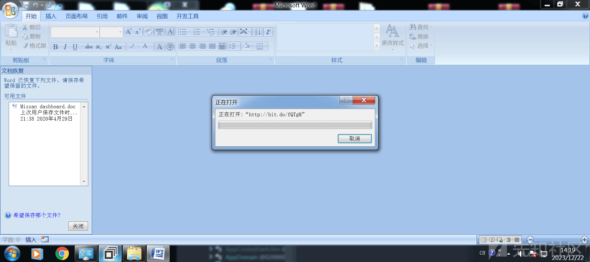](https://xzfile.aliyuncs.com/media/upload/picture/20240126101149-434265dc-bbf0-1.png)  
看到 xml 格式的 office 文档首先考虑使用 oleid 和 oleobj 对他进行解析 (先 pip install oletools）

[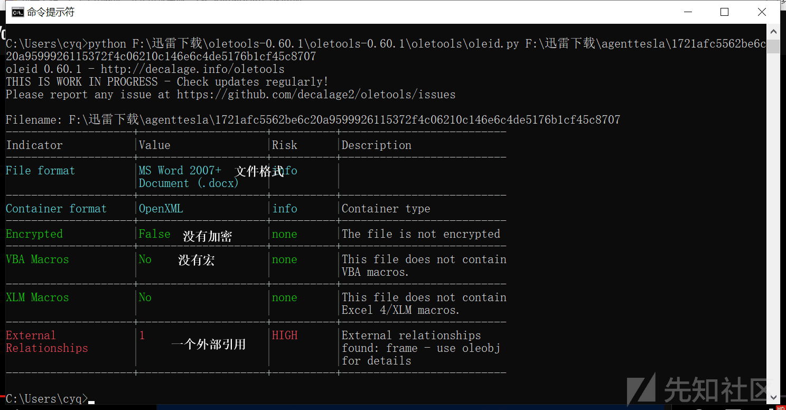](https://xzfile.aliyuncs.com/media/upload/picture/20240126101202-4b17e232-bbf0-1.png)  
使用 oleobj 提取到外部短链接“[http://bit.do/fQTgM”](http://bit.do/fQTgM%E2%80%9D)

[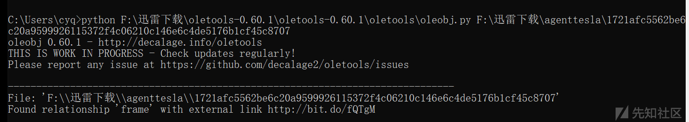](https://xzfile.aliyuncs.com/media/upload/picture/20240130180923-a4280fa4-bf57-1.png)

对于这种短链接，我们使用命令

```plain
$respond=Invoke-WebRequest -Uri 'http://bit.do/fQTgM' -UserAgent "Mozilla/4.0 (compatible; MSIE 7.0; Windows NT 6.1; Win64; x64; 
Trident/7.0; .NET CLR 2.0.50727; SLCC2; .NET CLR 3.5.30729; .NET CLR 
3.0.30729; .NET4.0C; .NET4.0E)"
```

该命令的作用是模拟请求接口，并对接收的数据进行 json 格式化，并取出其中的属性值

[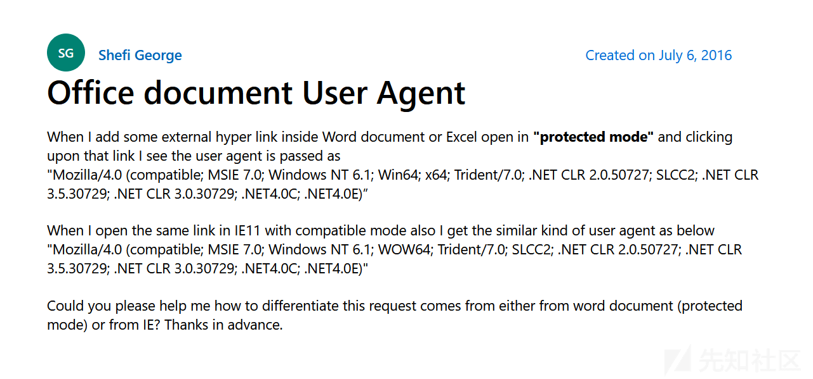](https://xzfile.aliyuncs.com/media/upload/picture/20240130181012-c1cdda7a-bf57-1.png)  
使用 networkMiner，从流量包中提取到三个文件

[](https://xzfile.aliyuncs.com/media/upload/picture/20240130181024-c8b21b26-bf57-1.png)

dot.rtf 是一个 rtf 格式的文档，里面有一些 obj 数据：

[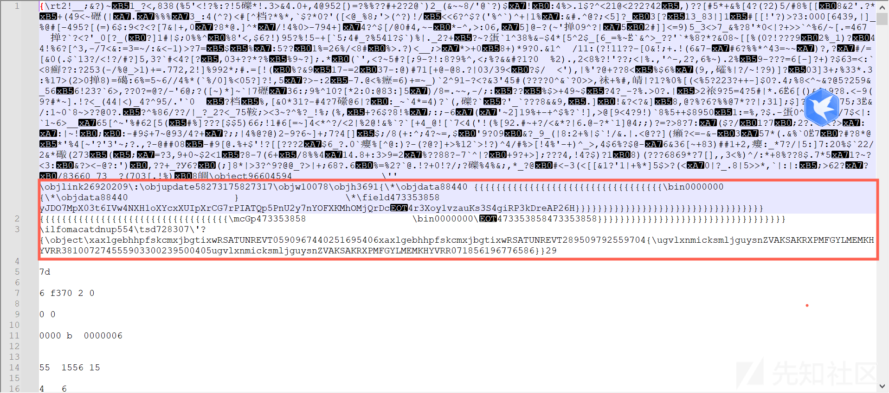](https://xzfile.aliyuncs.com/media/upload/picture/20240130181047-d67b48a4-bf57-1.png)

在使用 rtfdump 的时候出现了小问题，最开始报右边的错，查阅资料后发现是 python 版本问题，因为我右边机子使用的是 python3，所以怎么都执行不成功，当换成 python2 后成功执行（如左图）

[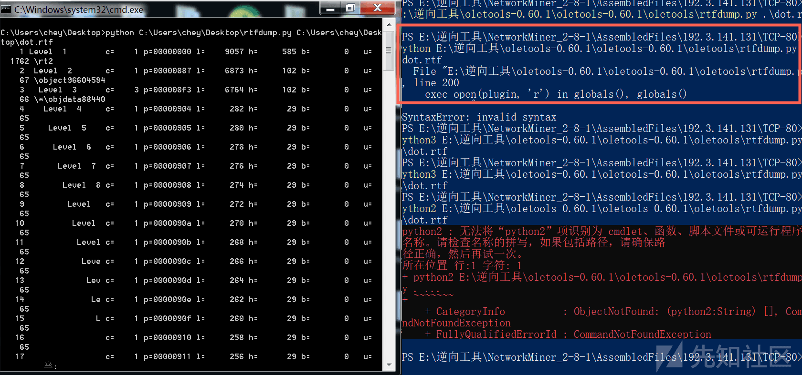](https://xzfile.aliyuncs.com/media/upload/picture/20240130181057-dc48197e-bf57-1.png)  
rtfdump.py .\\dot.rtf -s 1 (查看十六进制数据）  
可以看到他启动了方程式进程执行了一段 powershell 命令  
EquationEditor 通常是一个危险的标志。因为攻击者经常利用 CVE-2017-11882 来运行特定的 shellCode。如果你通过 HexView 检查第 2 节中的内容，你可能会发现某些编码模式，即反复出现的字符和符号。这通常是 XOR/ROL/SHIFT 加密函数的典型行为。为此，Didier Stevens 提供了另一个有趣的工具，名为 xorsearch。

[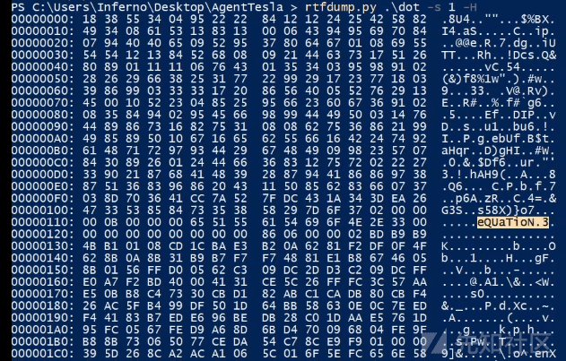](https://xzfile.aliyuncs.com/media/upload/picture/20240130181106-e1eca714-bf57-1.png)  
使用 rtfobj 提取 rtf 中的数据

[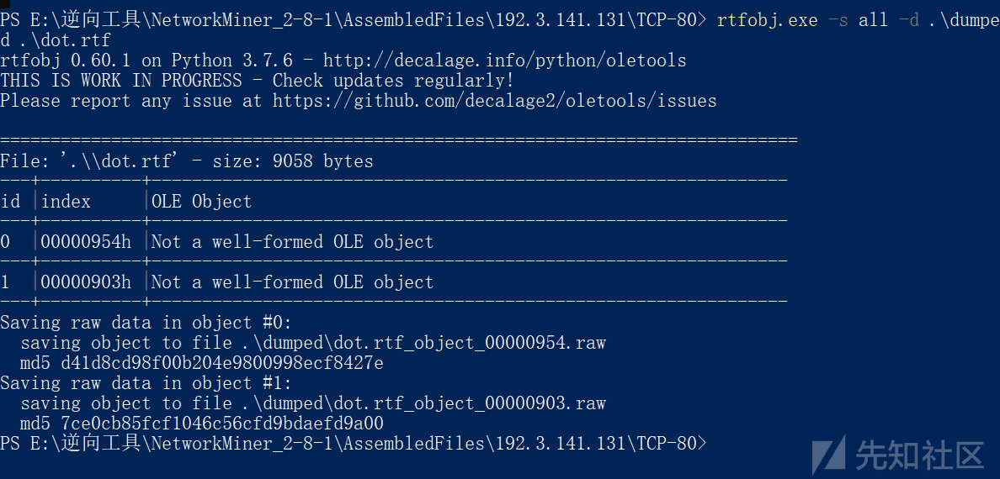](https://xzfile.aliyuncs.com/media/upload/picture/20240130181115-e6f1f930-bf57-1.png)  
dump 出来两个文件，第一个就是方程式里面的 shellcode，第二个是个空文件

[](https://xzfile.aliyuncs.com/media/upload/picture/20240130181121-eaa14bc6-bf57-1.png)  
这个 rtf 文件并不是按照标准格式的 rtf 文件，直接分析不出来。在使用 xorsearch 工具之前，我们需要将 equationeditor 所在节转储到一个外部文件中。xorsearch 会提供许多偏移量，如果从这些偏移量处运行 shellcode 的话，可以避免执行未对齐的指令。  
xorsearch.exe -W .\\dot.raw

[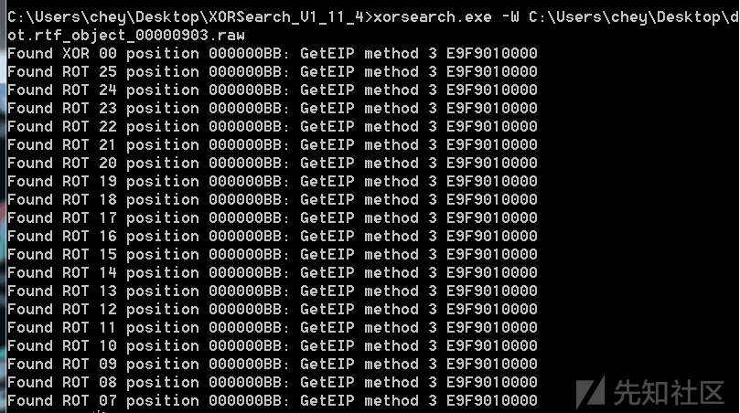](https://xzfile.aliyuncs.com/media/upload/picture/20240130181202-0351c60a-bf58-1.png)  
偏移量是 BB，可能是 shellcode 开始位置的偏移量  
使用 010editor 打开该文件，找到偏移量 bb 的位置，前面的内容可以都删掉，就得到了一个纯正的 shellcode

[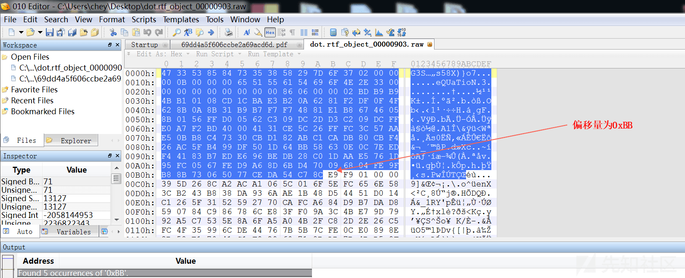](https://xzfile.aliyuncs.com/media/upload/picture/20240130181210-07fe09fc-bf58-1.png)  
使用 ida 打开该 shellcode  
入口处跳转到一个地址：

[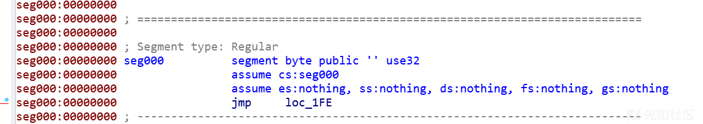](https://xzfile.aliyuncs.com/media/upload/picture/20240130181216-0b84f14e-bf58-1.png)  
该地址会调用一个函数，该函数直接 pop ebp，看起来像是在试图寻找自己在内存中的位置：

[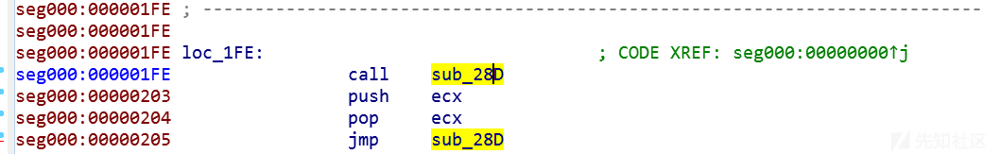](https://xzfile.aliyuncs.com/media/upload/picture/20240130181223-0f9775b8-bf58-1.png)

[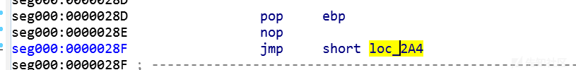](https://xzfile.aliyuncs.com/media/upload/picture/20240130181225-10aba6a4-bf58-1.png)

知识点补充

```plain
在 x86 体系结构的汇编语言中，call 指令与 pop 指令通常用于不同的目的，但它们有时可以一起使用来进行特定的技巧，比如寻找当前代码的内存地址。

call 指令用于调用一个函数。在 call 执行时，它会将下一条指令的地址（返回地址）压入堆栈，并将程序计数器（PC）更新为被调用函数的起始地址。这样当被调用的函数执行完毕后，可以通过栈上的返回地址回到调用它的地方继续执行。
pop 指令用于弹出堆栈顶部的值并将其存储到一个指定的寄存器中。在这种情况，如果 pop 指令紧跟在 call 指令之后，在同一个函数中，这通常是一种技巧，用于获取当前函数的地址。

使用这类技术可以用于构建基于偏移量的引用，例如访问相对于函数位置的数据或者其他资源，尤其常见于生成 Shellcode 时，因为 Shellcode 通常需要在不知道确切加载地址的情况下执行。
```

将 opcode 打开，查看 shellcode 入口点的位置

[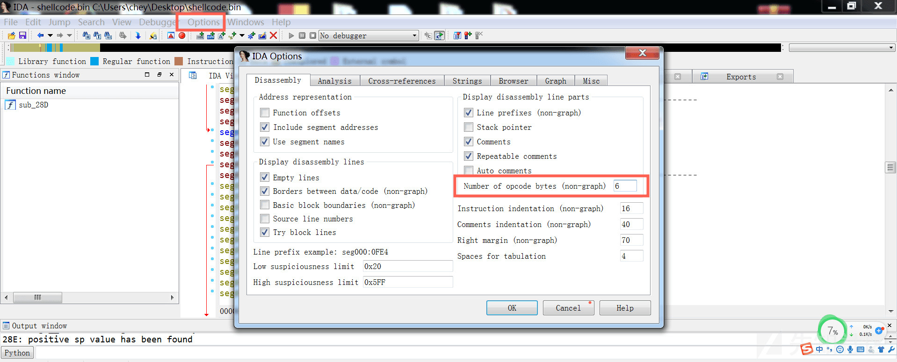](https://xzfile.aliyuncs.com/media/upload/picture/20240130181254-221bb794-bf58-1.png)

[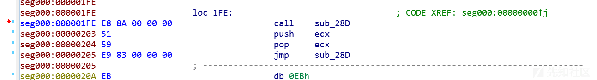](https://xzfile.aliyuncs.com/media/upload/picture/20240130181256-2393ff78-bf58-1.png)  
想要模拟 32 位的 shellcode 的时候可以使用另一款号称 ShellCode 调试专家的软件：scDbg 来代替 ida 寻找 shellcode 起始地址。运行该软件后需要从 xorsearch.exe 给出的偏移量处运行模拟器，就本例来说，该偏移量为 0x2c74c。在此，建议勾选“Unlimited steps”功能，这样的话，模拟器就能够在不停止 shellcode 的情况下进行跟踪；同时，我们还建议勾选“Reporting Mode”，这样你就可以在执行结束时看到一个摘要视图。

将 shellcode 二进制文件放进 scdbg，选中 FindSc 寻找 shellcode 起始点，点击 Launch 开始搜索。选择一个地址开始搜索，然后会显示出一些环境字符串、加载库、下载文件等信息。此时很好的确认了偏移量是 0x01fe

[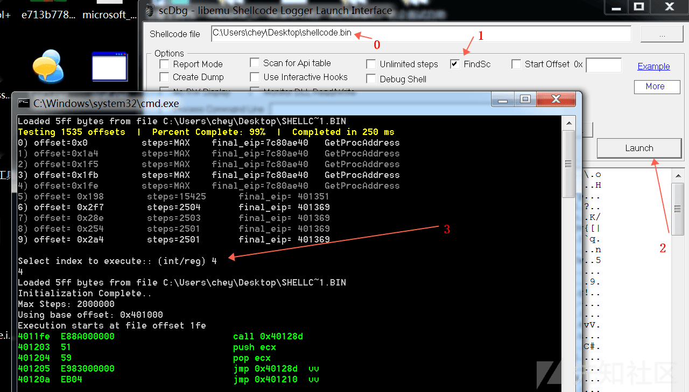](https://xzfile.aliyuncs.com/media/upload/picture/20240130181311-2c12b8ba-bf58-1.png)

[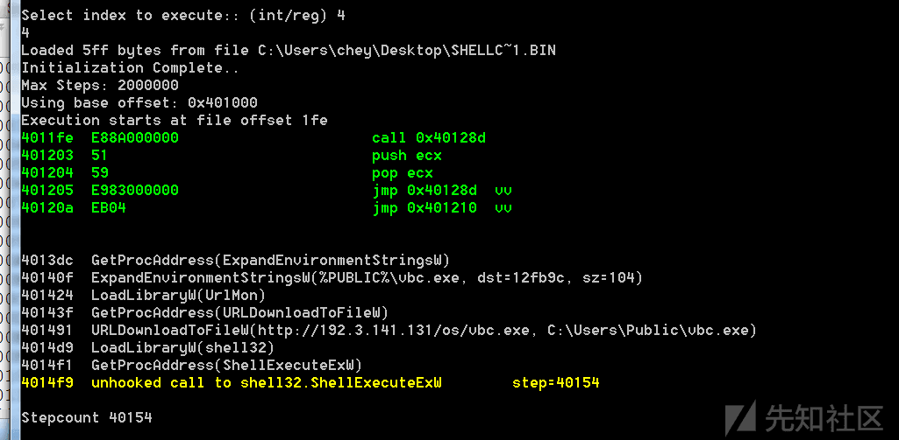](https://xzfile.aliyuncs.com/media/upload/picture/20240130181313-2d493de4-bf58-1.png)  
打开 010editor，删除掉 0x01fe 偏移量前面的信息

[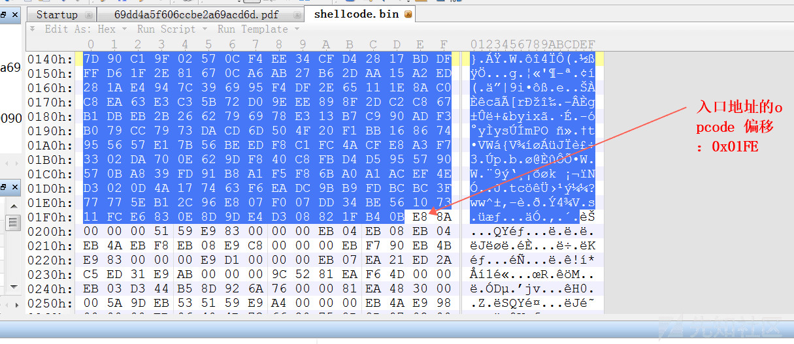](https://xzfile.aliyuncs.com/media/upload/picture/20240130181318-30a0d0f6-bf58-1.png)  
createdump 会模拟 shellcode 的创建以及对 shellcode 的所有修改，他会解密一些内容：

[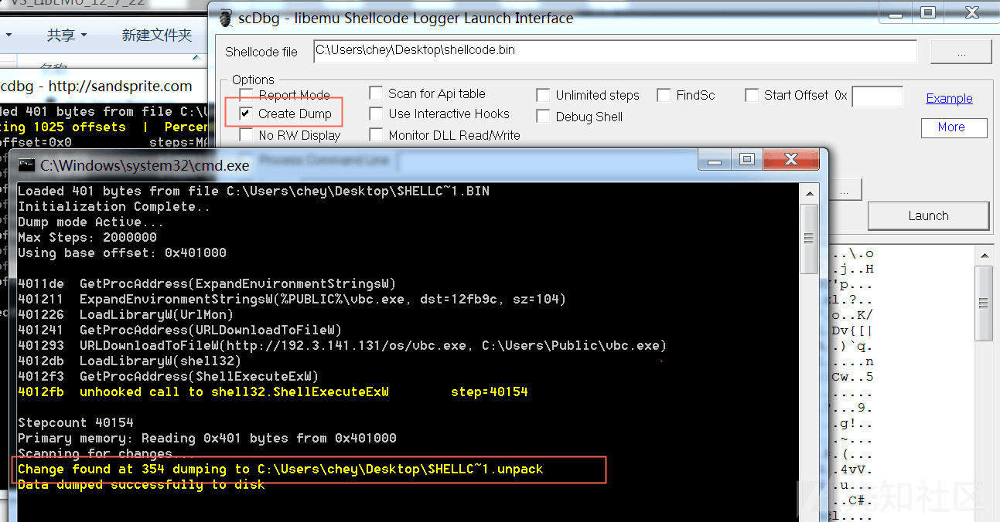](https://xzfile.aliyuncs.com/media/upload/picture/20240130181326-34f92c84-bf58-1.png)  
对 ebp 的值进行计算会发现他的偏移是 0x5：

[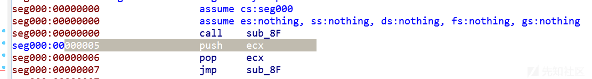](https://xzfile.aliyuncs.com/media/upload/picture/20240130181332-39060482-bf58-1.png)  
加上 0x15D=0x162，找到偏移为 0x162 的位置，这里是在进行解码操作

[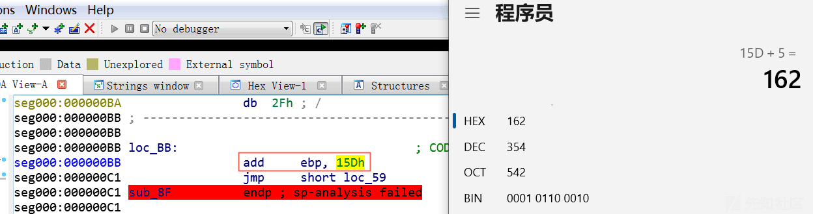](https://xzfile.aliyuncs.com/media/upload/picture/20240130181340-3da2f3b0-bf58-1.png)

[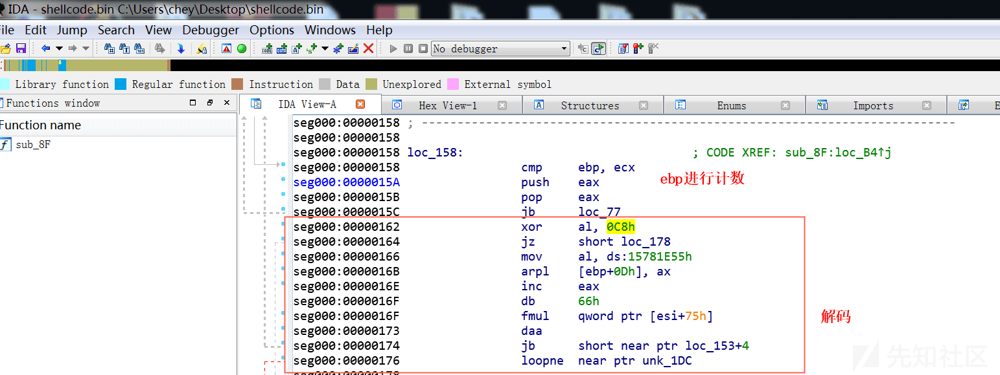](https://xzfile.aliyuncs.com/media/upload/picture/20240130181347-41a5ad7c-bf58-1.png)  
加上 0x297，找到偏移为 3F9 的地址

[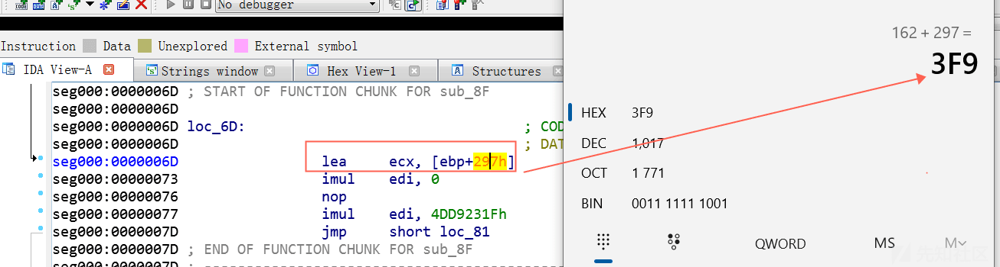](https://xzfile.aliyuncs.com/media/upload/picture/20240130181352-44ac695c-bf58-1.png)  
如果要运行 rtf 或者 office 文档，Microsoft office 将会支持这些文档使用 Equation.exe。gflags.exe 可以给这些程序以图像的方式调试。调试方法如下：  
1、运行 dot.rtf 文件，打开 procmon.exe 对进程树进行监控

[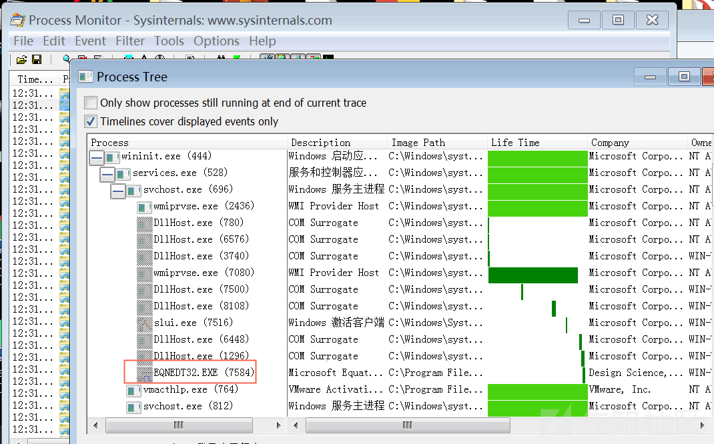](https://xzfile.aliyuncs.com/media/upload/picture/20240130181358-48718dec-bf58-1.png)  
2、将信息填入调试器

[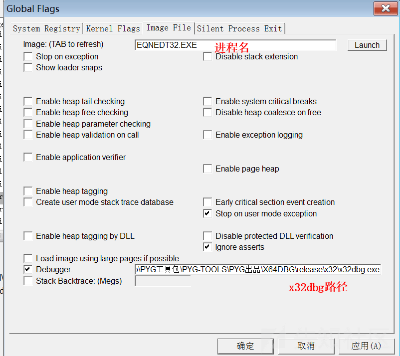](https://xzfile.aliyuncs.com/media/upload/picture/20240130181403-4b6b0adc-bf58-1.png)  
3、将 dbg 附加到 EQNEDT32.exe 进行调试  
打开 doc.rtf 后再打开调试器，触发附加调试断点，程序断下来

[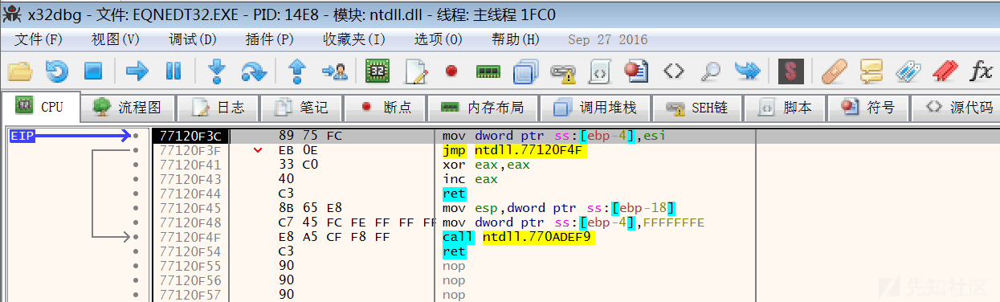](https://xzfile.aliyuncs.com/media/upload/picture/20240130181410-4f6f2938-bf58-1.png)  
因为他会下载文件，所以寻找 urlmon.dll 这个库文件

[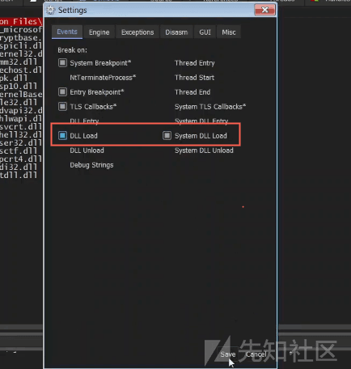](https://xzfile.aliyuncs.com/media/upload/picture/20240130181416-52db3eb8-bf58-1.png)  
就可以动态分析 shellcode 下载 exe 的地方了 由于这里我始终断不到这个 dll，暂时只记录思路

发现他会下载一个软件 vbc.exe

[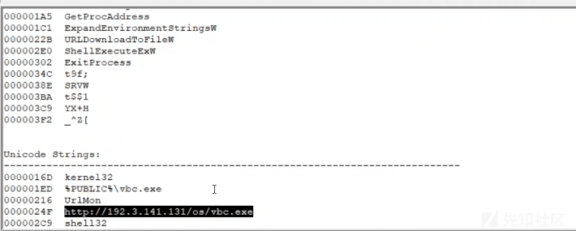](https://xzfile.aliyuncs.com/media/upload/picture/20240130181423-57665f44-bf58-1.png)

vbc.exe  
先使用 pestudio、die、exeinfope 检查一遍基本信息  
.text 和.rsrc 区段有加密

[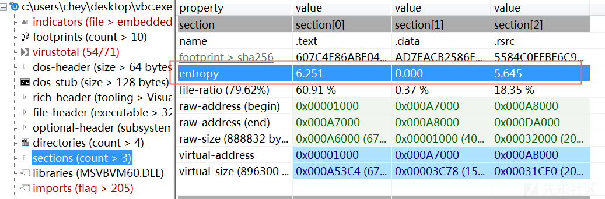](https://xzfile.aliyuncs.com/media/upload/picture/20240130181430-5b921216-bf58-1.png)  
vb 写的程序，无壳

[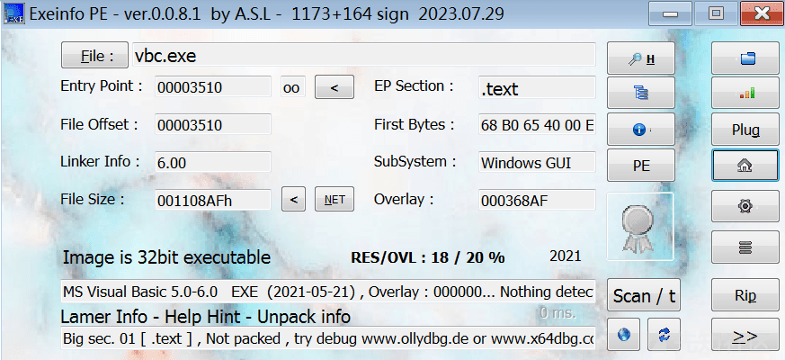](https://xzfile.aliyuncs.com/media/upload/picture/20240130181436-5f1bfd70-bf58-1.png)  
有很多 api 解密的函数调用

[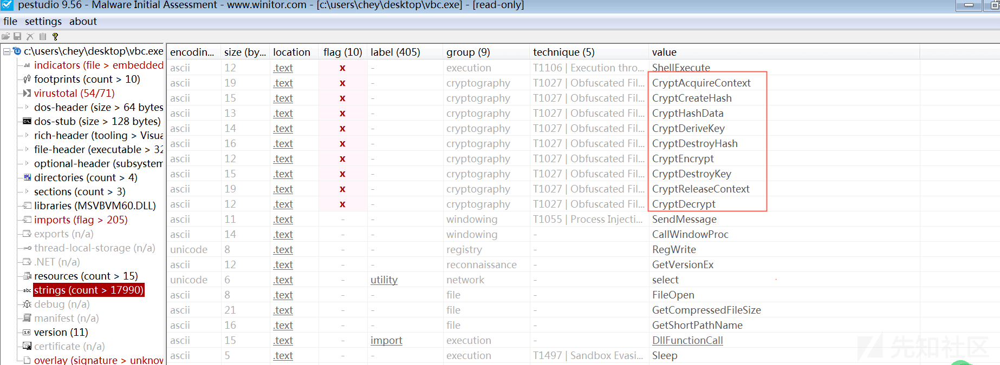](https://xzfile.aliyuncs.com/media/upload/picture/20240130181451-67e546be-bf58-1.png)  
给 CryptDecrypt 下断点，断下来后直接运行到返回地址，按理说解密的内存地址指针应该在堆栈处，但我划拉了很久才发现这个地址 不懂

[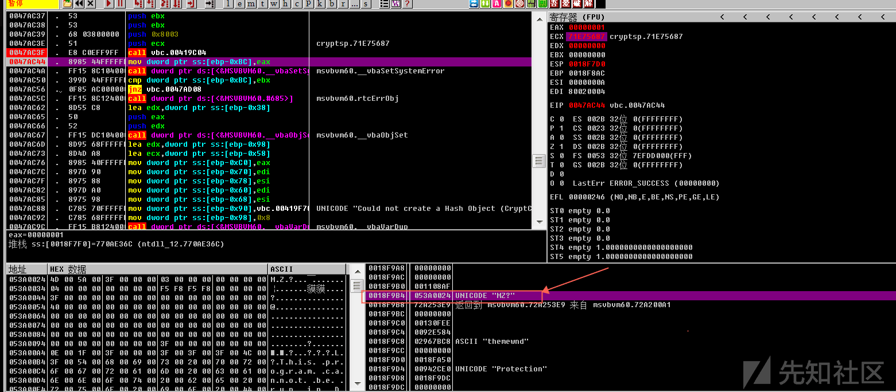](https://xzfile.aliyuncs.com/media/upload/picture/20240130181456-6ace9dc6-bf58-1.png)  
证明 vbc.exe 是个加载器，目的是从内存中解密并执行 payload。把这篇内存空间 dump 下来  
这篇空间格式有点奇怪 不是标准的 pe 查了资料也不知道出了什么问题
