# 一次平平无奇的 Oracle 注入 - 先知社区

一次平平无奇的 Oracle 注入

- - -

在某次项目中，首先是发现注入点，数据库是 Oracle，利用方式是时间盲注：

[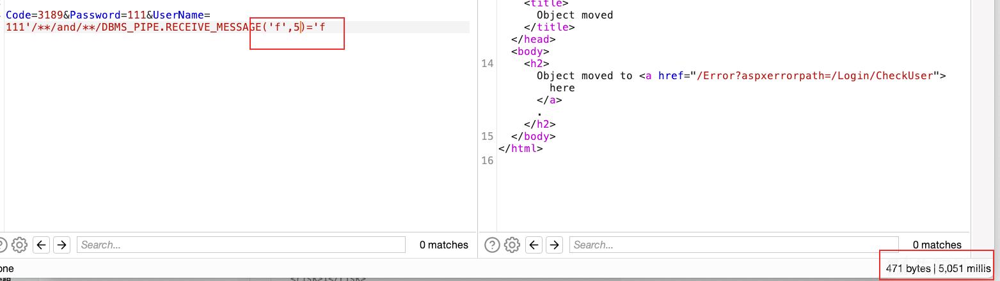](https://xzfile.aliyuncs.com/media/upload/picture/20240219140608-f8fe7320-ceec-1.png)

因为需要具体数据，所以要深入利用，手工肯定不方便，所以直接上 Sqlmap:

[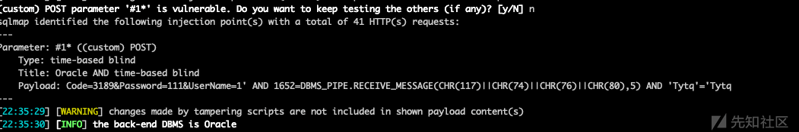](https://xzfile.aliyuncs.com/media/upload/picture/20240219140841-543ea26e-ceed-1.png)

Sqlmap 也可以扫出该注入点，但想要进一步查询数据时，却发现 Sqlmap 利用不起来，无法查出数据：

[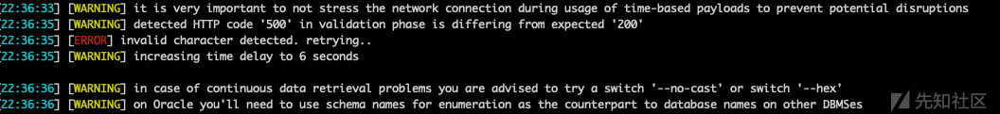](https://xzfile.aliyuncs.com/media/upload/picture/20240219141050-a15c2a9e-ceed-1.png)

为了确定查询数据失败原因，此时加上参数 `-proxy http://127.0.0.1:1080` 使流量经过 burp，发现某些常用的查询方式，在该 oracle 数据库中会报错，如 `SELECT banner FROM v$version WHERE ROWNUM=1` 等（可能是数据库版本原因？）

语句错误返回

[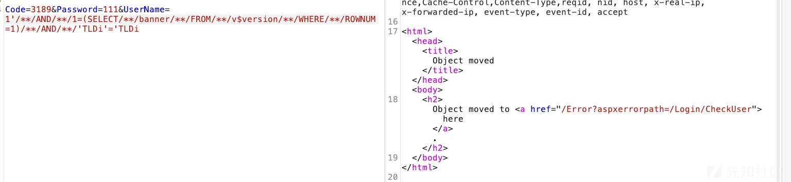](https://xzfile.aliyuncs.com/media/upload/picture/20240219141307-f3178658-ceed-1.png)

语句正常返回

[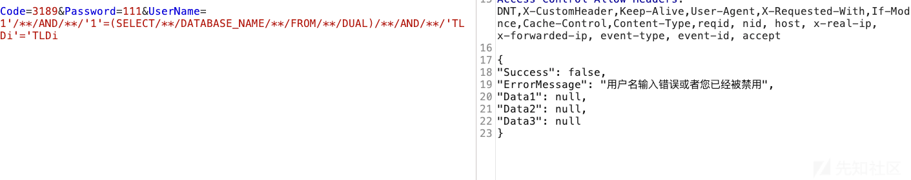](https://xzfile.aliyuncs.com/media/upload/picture/20240219141320-facff196-ceed-1.png)

使用其他某些语法也会报错，比如 Sqlmap payload 中的 `CAST(%s AS VARCHAR(4000))` 、`NVL(%s,' ')` 等，常见的 `COUNT` 方法也会报错。

大概确定了查询数据失败原因。那解决问题的方法也很简单，就是把有问题的数据库方法找出来，然后进行相关的替换就可以了。

打开 Sqlmap 目录下 `data/xml/queries.xml` ，找到 Oracle 的 payload：

[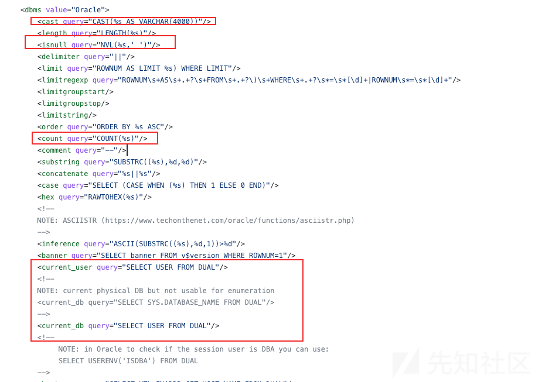](https://xzfile.aliyuncs.com/media/upload/picture/20240219141626-69e932c2-ceee-1.png)

替换其中经过尝试会使程序错误的方法，其中 `count` 可以用 `sum(1)` 替代。同时也发现了 `current_db` 和 `current_user` 是同一个 payload，感觉有点问题，也顺便替换了，替换后的数据如下：

[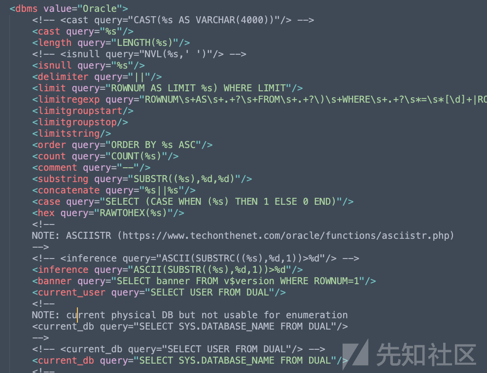](https://xzfile.aliyuncs.com/media/upload/picture/20240219141726-8d2eb996-ceee-1.png)

接下来就是修改具体的查询数据的语句了，其中有些 `%s` 占位符是命令行的输入，如 下面的 `TABLE_NAME` 的值就是命令行输入的 `-T` 参数的值

[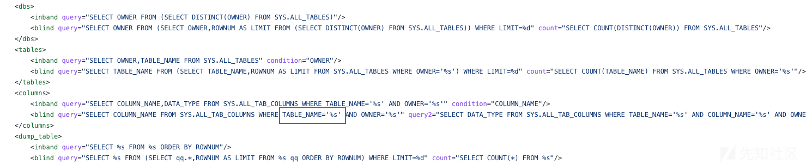](https://xzfile.aliyuncs.com/media/upload/picture/20240219141903-c7633f92-ceee-1.png)

修改完成后，再使用 Sqlmap 跑数据，不断根据返回确定查询方法，根据请求结果调整 SQL 语句，最终能够跑起来了。

本以为这次平平无奇的注入就结束了，没想到新问题又出现了，Sqlmap 跑数据是能跑了，但因为注入点的利用方式是时间盲注，所以会受网络波动或者数据库响应的影响，跑出的数据经常会有错误，一看就不对劲，而且时间盲注效率很低，花时间的很多，数据输出很少，对于跑数据非常不方便：

[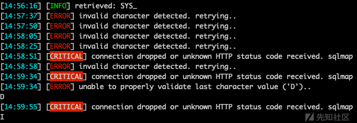](https://xzfile.aliyuncs.com/media/upload/picture/20240219142555-bcfc6078-ceef-1.png)

所以需要想办法，解决上述问题。在之前的测试中也发现了，当数据库报错时，返回的请求结果和正常是不一样的，所以可以利用这两个不同的页面差异构造布尔盲注，Oracle 数据库可以利用 `1/0` 报错的特性（Mysql 就不会报错），将时间盲注转换成布尔盲注。

但 Sqlmap 并没有这种检测方法，所以要在 `/data/xml/payloads/boolean_blind.xml` 修改 payload，加入以下方法：

```plain
<test>
        <title>Oracle AND boolean-based blind - (custom)</title>
        <stype>1</stype>
        <level>1</level>
        <risk>1</risk>
        <clause>1</clause>
        <where>1</where>
        <vector> AND [RANDNUM]=(CASE WHEN ([INFERENCE]) THEN 1 ELSE 1/0 END)</vector>
        <request>
            <payload> AND  [RANDNUM]=(CASE WHEN ([RANDNUM]=[RANDNUM]) THEN [RANDNUM] ELSE  1/0 END )</payload>
        </request>
        <response> 
            <comparison> AND  [RANDNUM]=(CASE WHEN ([RANDNUM]=[RANDNUM1]) THEN [RANDNUM] ELSE  1/0 END) </comparison>
        </response>
        <details>
            <dbms>Oracle</dbms>
        </details>
    </test>
```

使 Sqlmap 能够按照自定义的语句查询数据结果：

[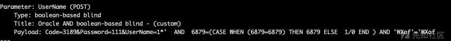](https://xzfile.aliyuncs.com/media/upload/picture/20240219143039-65c9e1c6-cef0-1.png)

最终，通过不断的测试，所有问题均已解决，能够非常高效的跑出具体的数据：

[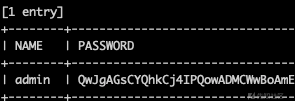](https://xzfile.aliyuncs.com/media/upload/picture/20240219143206-99b5cfc2-cef0-1.png)
