# 一次曲折的 JDK 反序列化到 JNDI 注入绕过（no forceString） - 先知社区

一次曲折的 JDK 反序列化到 JNDI 注入绕过（no forceString）

- - -

## JDK 原生反序列化漏洞发现和绕过的过程

最近的一次渗透项目中，通过 nmap 扫到一个 Jetty 的服务。  
用 dirsearch 扫到`/metrics/`路径，但是再后面就扫不出来了。  
从客户提供的 Windows 账号 RDP 登录上去，找到开启这个端口的服务，用 Everything 找到一个 zip 安装包，拖回来安装分析。  
安装的时候注意到有一个设置代理的选项，将其设置为我的 burp 的地址，等待后续可能的惊喜发生。  
安装完成之后，对其加入调试参数，然后把依赖 jar 包导入 IDEA 待调试。选择一些感兴趣的调试点开始调试。

### 1、通过设置代理，发现反序列化的 endpoint（从客户端）

最开始主要是希望找到`/metrics/`后面到底有啥，于是随便 GET、POST 请求尝试一下。  
[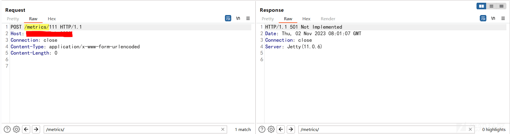](https://xzfile.aliyuncs.com/media/upload/picture/20231127105156-ed9b68ee-8ccf-1.png)  
请求响应完了之后并没有结束，看到 burp 里有这样一条记录。

[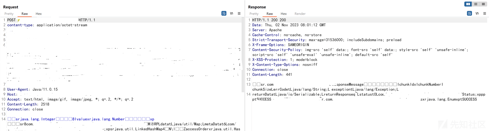](https://xzfile.aliyuncs.com/media/upload/picture/20231127111752-8ce53f9e-8cd3-1.png)  
通过 http 请求在网络中进行了序列化对象的传输。  
于是我先是把 POST 的 body 直接设置为 ysoserial/Urldns.jar（探测 gadget）的 payload，但是 dnslog 没有任何反应。我想如果反序列化成功的话，至少应该有一个探测 Windows/Linux 的记录吧。可见发送的探测 payload 没有被反序列化成功。  
同时，注意到 burp 的响应中出现了貌似 Exception 的 stackTrace 的样子。  
（不过截图放了一个命令行输错了的情况）

[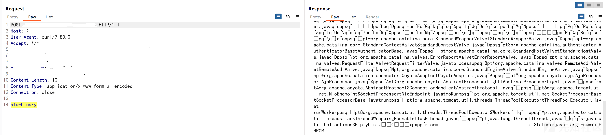](https://xzfile.aliyuncs.com/media/upload/picture/20231127125709-6b7bd1de-8ce1-1.png)

在客户端代码中通过设置合适的断点，找到发起 HTTP 请求的地方，复制，用 Java 代码构造请求。

### 2、观察 request/response，设置正确的数据格式、输出服务端 Exception

由于当时我已经有客户端依赖的 jar 包，我就在 IDEA 里搜一下这个返回的响应类：`ResponseMessage`。

[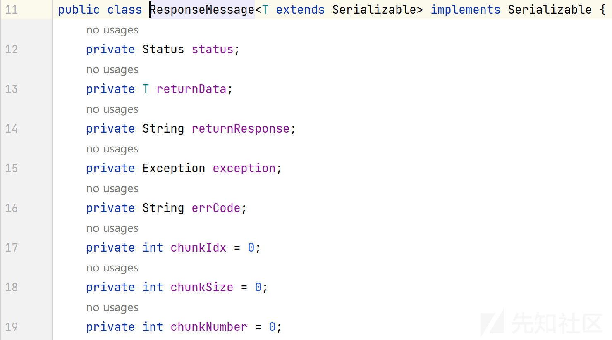](https://xzfile.aliyuncs.com/media/upload/picture/20231127130327-4ccbb8b6-8ce2-1.png)

发现客户端里有这个类。于是对响应的对象进行 readObject 还原，然后取出里面的 Exception 对象，打印 stackTrace。

```plain
ResponseMessage responseMessage = readResponse(connection.getInputStream());
System.out.println(responseMessage);
responseMessage.getException().printStackTrace();
```

通过分析异常栈知道，对于客户端请求的序列化数据，服务端并不是直接反序列化成对象，而是先读取了一个 Integer 类型，然后根据这个 Integer 数值，读取这样大小的后续字节，然后进行反序列化。

[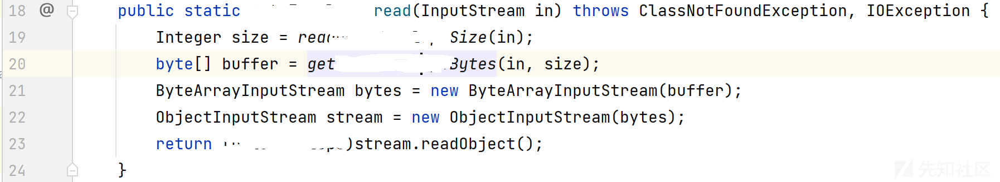](https://xzfile.aliyuncs.com/media/upload/picture/20231127131138-7180a044-8ce3-1.png)  
于是修改之后再发送。  
[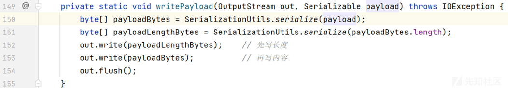](https://xzfile.aliyuncs.com/media/upload/picture/20231127131401-c6c0adba-8ce3-1.png)

### 3、反序列化 gadgets 探测

最近正好在学习 Jackson + Spring-aop 的 gadget，索性先用这个试试，还好这次终于成功走入了反序列化利用的流程。

[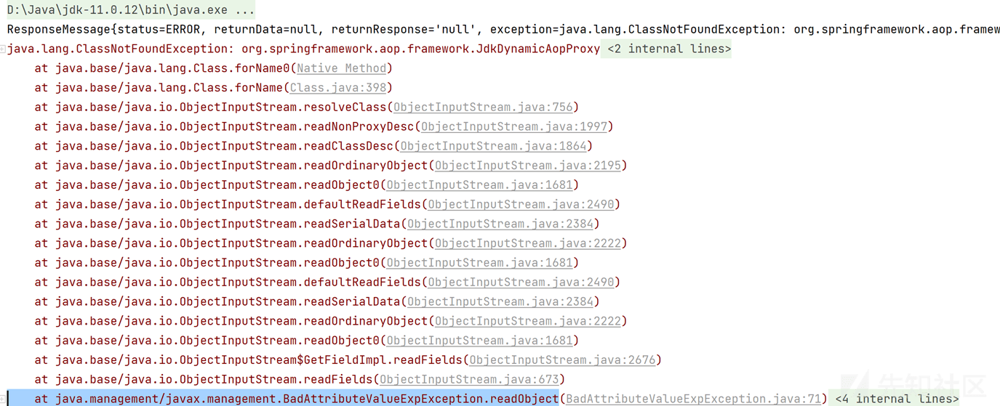](https://xzfile.aliyuncs.com/media/upload/picture/20231127131517-f41312a8-8ce3-1.png)  
虽然服务端没有 spring-aop 依赖。

这里没有使用 Urldns.jar 进行 gadgets 探测，由于拿到了客户端的依赖 jar，可以先分析一下这里都有什么好东西，也许服务端跟这个差不多。

[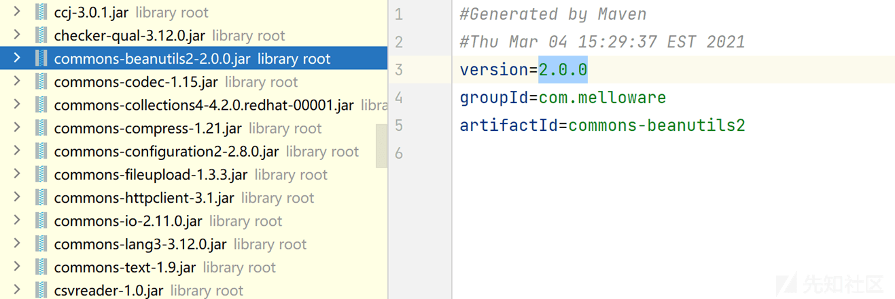](https://xzfile.aliyuncs.com/media/upload/picture/20231127131729-429b1e34-8ce4-1.png)  
经过分析，得到这个结果：

-   jython（没有这个依赖）
-   Commons-Collections（版本是 2 系列，fixed, 关键的类都不再 Serializable）
-   Groovy（版本为 2.4.21，fixed）
-   commons-fileupload（版本为 1.3.3，fixed）
-   Commons-Beanutils（没有 1 系列，只有 2）

注意到，根据客户端的推测，服务端用的是 commons-beanutils2，  
[https://github.com/melloware/commons-beanutils2](https://github.com/melloware/commons-beanutils2)  
奇怪之前没见过，github 0 star。不过大概看了一下，关键的 gadget 依然存在，只是改了一下包名。  
修改包名，在本地测试，发现是能用的。

[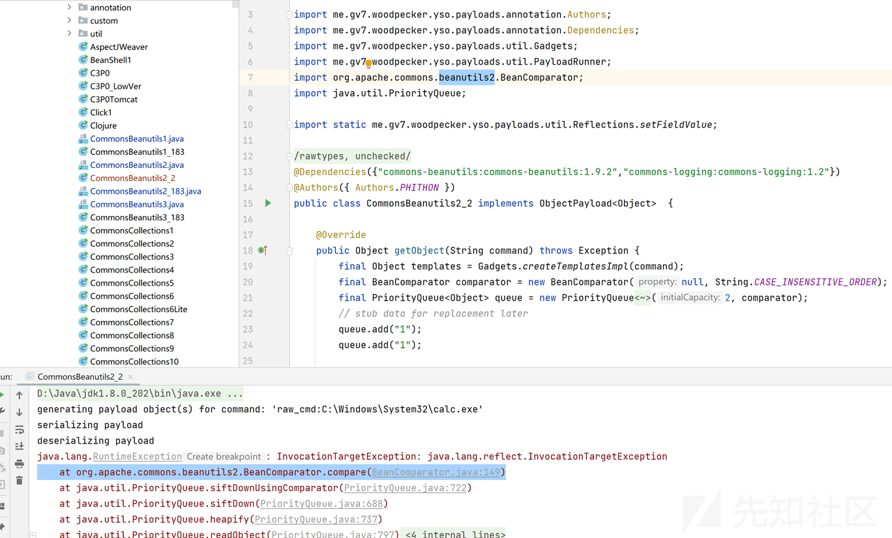](https://xzfile.aliyuncs.com/media/upload/picture/20231127132556-70f3fe80-8ce5-1.png)  
构造好 payload 发送给服务端，结果报了这个错：

```plain
java.lang.UnsupportedOperationException: When Java security is enabled, support for deserializing TemplatesImpl is disabled. This can be overridden by setting the jdk.xml.enableTemplatesImplDeserialization system property to true.
at java.xml/com.sun.org.apache.xalan.internal.xsltc.trax.TemplatesImpl.readObject(TemplatesImpl.java:270)
```

[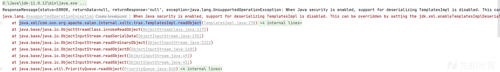](https://xzfile.aliyuncs.com/media/upload/picture/20231127132725-a634a978-8ce5-1.png)

当时看到这里只是想怎么覆盖掉这个属性`jdk.xml.enableTemplatesImplDeserialization`为 true，后来才知道其实这里是因为开启了 SecurityManager。参考[这篇文章](https://c0d3p1ut0s.github.io/%E6%94%BB%E5%87%BBJava%E6%B2%99%E7%AE%B1/) 尝试了各种绕过都失败了。它的策略比较严格。

### 4、从反序列化到 JNDI 注入

分析一下不依赖 Commons-Collections 的 CommonsBeanutils2 这个 gadget，

```plain
java.util.PriorityQueue#readObject
    ...
    java.util.Comparator#compare
        org.apache.commons.beanutils2.BeanComparator#compare
        org.apache.commons.beanutils2.PropertyUtils#getProperty
            ...
            Xxx#getYyy() （条件：Serializable、利用空参数的 getter 方法）
            com.sun.org.apache.xalan.internal.xsltc.trax.TemplatesImpl#getOutputProperties（现有的）
```

这里利用 TemplatesImpl 的 getOutputProperties 是用的最广的一个 getter 了，因为它存在于 jdk 中，而且能自定义任意类，可以进行各种扩展（内存马等），但是这条路目前被堵了。得换个别的 getter。忘记在哪里看到的了，据说各种 dataSource 里很方便能 getConnection() 然后使用 jdbc url。不过经过探测服务端没有 postgresql、mysql、h2 等数据库驱动，只有 Oracle 的。于是放弃了 jdbc url 这条路。  
最后找到了`oracle.jdbc.rowset.OracleCachedRowSet#getConnection`，这个方法可以通过 getter 方法将反序列化转到 JNDI 注入。

[](https://xzfile.aliyuncs.com/media/upload/picture/20231127140210-80df6848-8cea-1.png)

从前面的报错已经知道服务端使用了 jdk 高版本，所以得想如何绕过 JNDI 注入的限制。  
绕过限制主要就是两方面：

-   1、利用反序列化
-   2、利用本地 javax.naming.spi.ObjectFactory 中的 javax.naming.Reference 携带 payload

不过反序列化就不考虑了，不然也不会转来 JNDI 注入。  
ObjectFactory？看看目标环境有什么？首先想到的当然是用著名的 Tomcat 自带的依赖`org.apache.naming.factory.BeanFactory`中的 Reference 的`forceString`属性。只需要找一个接受单 String 类型的参数的方法完成 RCE 即可，对其方法名没有限制。@浅蓝师傅总结了很多（ELProcessor、Groovy 等），很富裕不用担心没有。需要担心的是 Tomcat 版本是否在范围内。因为 Tomcat7 没有加入这个功能，而 Tomcat 高版本（9.0.63、8.5.79）移除了这个功能。  
[这里](https://bz.apache.org/bugzilla/show_bug.cgi?id=65736)讨论了官方商量删除`forceString`功能，  
[这里](https://github.com/apache/tomcat/blob/9.0.63/java/org/apache/naming/factory/BeanFactory.java)可以看到 9.0.63 确实移除了 forceString 这个功能。

[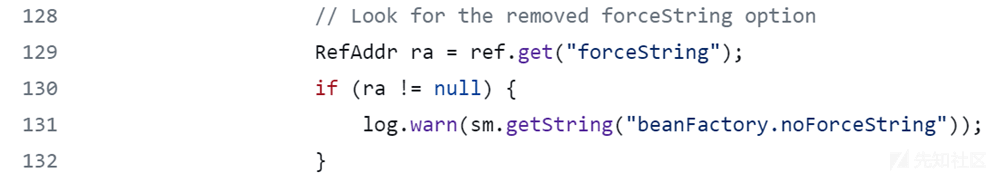](https://xzfile.aliyuncs.com/media/upload/picture/20231127144504-7f268314-8cf0-1.png)

不死心？本地试试就知道了。

[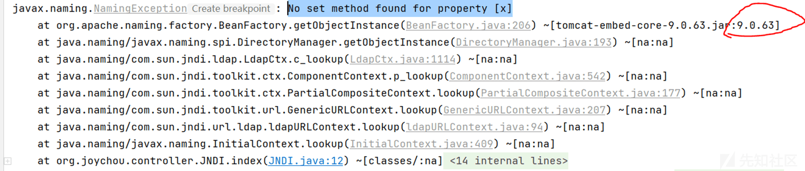](https://xzfile.aliyuncs.com/media/upload/picture/20231127142027-0e93907c-8ced-1.png)  
那服务端版本是多少？  
随便发一个包让服务端报错即可：

[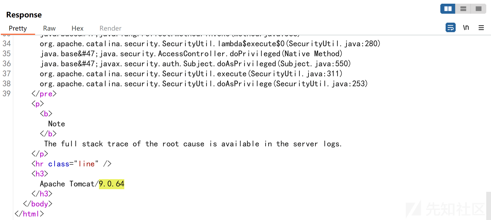](https://xzfile.aliyuncs.com/media/upload/picture/20231127142208-4b0229a6-8ced-1.png)  
9.0.64，是修复的版本了。  
所以，好走的 forceString 这条路已经不通了。  
可用的选择：

-   1、（反序列化 getter）当时是从反序列化的 getter 转过来的，既然不通，要不试试别的 getter 方法？
-   2、 （JNDI 注入 setter）被堵这条路只是不能用 xyz(String payload) 这样的方法，但是有没有好的 setAbc(String payload) 的恶意方法？

### 5、No forceString：反序列化 getter/JNDI 注入 setter?

通过学习《探索 JNDI 攻击》from @浅蓝 on 2022 北京网络安全大会，知道虽然不能通过 forceString 来 RCE，但是依然存在其他的方法可以进行敏感的操作。

[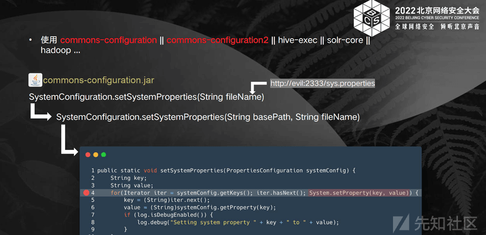](https://xzfile.aliyuncs.com/media/upload/picture/20231128131903-a54450cc-8dad-1.png)  
[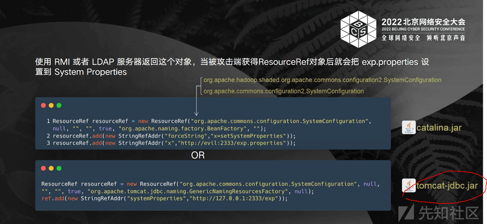](https://xzfile.aliyuncs.com/media/upload/picture/20231128131916-acb38c38-8dad-1.png)

在他的 ppt 里介绍了使用 commons-configuration(2)/groovy + tomcat-jdbc.jar 实现`System.setProperty()`的效果。  
我理解一下，这里的原理是，首先找到一个特殊的 ObjectFactory：`org.apache.tomcat.jdbc.naming.GenericNamingResourcesFactory`(tomcat-jdbc.jar)。与`org.apache.naming.factory.BeanFactory`(catalina.jar) 相比，它支持调用某个类中的所有的方法，包括 static 的方法，只要以 set 开头。而`org.apache.naming.factory.BeanFactory`是根据属性去找对应的 setter 方法（有 abc 这个属性，才会去调用 setAbc(String value) 这个方法）。理解如有错误还请指正。

附`org.apache.naming.factory.BeanFactory`：  
[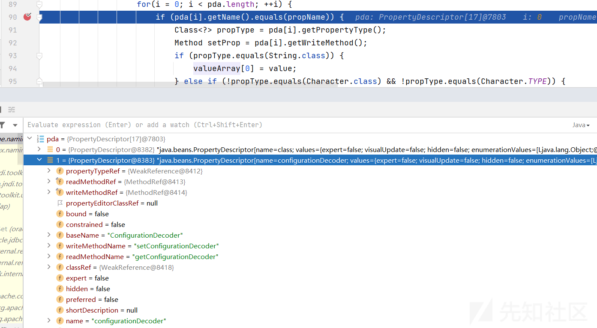](https://xzfile.aliyuncs.com/media/upload/picture/20231128133057-4eec7e28-8daf-1.png)

`org.apache.tomcat.jdbc.naming.GenericNamingResourcesFactory`：

[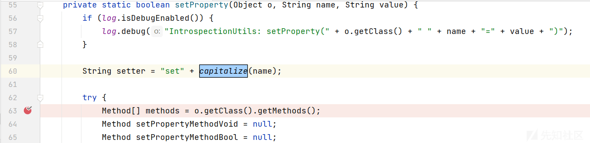](https://xzfile.aliyuncs.com/media/upload/picture/20231128133143-6a70ddec-8daf-1.png)

[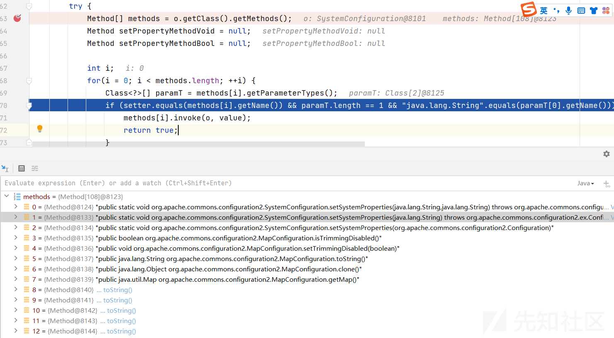](https://xzfile.aliyuncs.com/media/upload/picture/20231128133150-6e78c986-8daf-1.png)

而另外一个特殊的类是`org.apache.commons.configuration2.SystemConfiguration`(commons-configuration2-\*.jar) 或者`org.apache.commons.configuration.SystemConfiguration`(commons-configuration-\*.jar)。  
它的 setSystemProperties 方法可以设置系统属性，也就是

```plain
System.setProperty()
```

setSystemProperties 方法接收一个 String 类型的参数，叫做`fileName`，但是实际上最后它会被构造成一个 URL 对象，所以可以传入的不仅是一个本地文件，也可以是一个网络请求，

[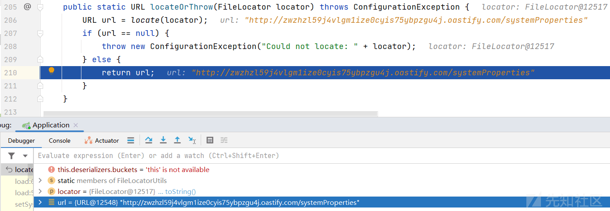](https://xzfile.aliyuncs.com/media/upload/picture/20231128133928-7f9a0b16-8db0-1.png)  
所以我们可以在自己控制的 web 服务器上放一个文件，里面的内容是每行一个

```plain
key=value
```

想到之前失败的 TemplatesImpl，不是因为`jdk.xml.enableTemplatesImplDeserialization`系统属性的问题吗？这里找到机会了，先把这个属性给改了。  
满怀欣喜的再发送 payload，结果又报了这个错：

[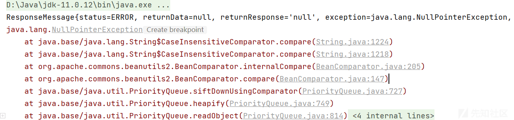](https://xzfile.aliyuncs.com/media/upload/picture/20231128134656-8a11f256-8db1-1.png)

Well, not so bad. 至少说明设置系统属性的 gadget 生效了。  
这个系统属性改了，依然无法利用成功。有没有别的系统属性值得改的呢？

### 6、应用启动后 System.setProperty() 能绕过 JNDI 注入限制吗？

又想到浅蓝师傅在 ppt 里提到的，可以试试修改这两个作为 JNDI 注入缓解措施的系统属性：

```plain
com.sun.jndi.ldap.object.trustURLCodebase=true
com.sun.jndi.rmi.object.trustURLCodebase=true
```

继续测试。

[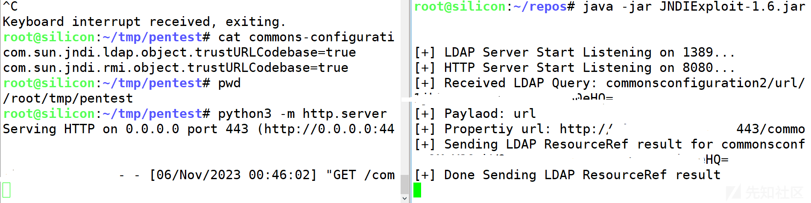](https://xzfile.aliyuncs.com/media/upload/picture/20231128140935-b423eb78-8db4-1.png)

修改完之后，发现使用 JNDIExploit 的`/Basic/Command/`依然不成功。于是尝试本地搭建环境试试是否真的能成功。

我先用 Spring 环境（其实就是 java-sec-code）试试：  
[](https://xzfile.aliyuncs.com/media/upload/picture/20231128135308-67d3ca38-8db2-1.png)  
关键的点就在这个类：`com.sun.naming.internal.VersionHelper`

[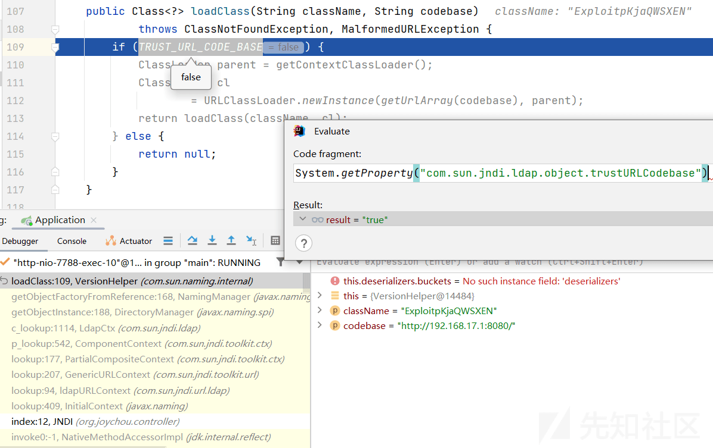](https://xzfile.aliyuncs.com/media/upload/picture/20231128135438-9da1482a-8db2-1.png)  
在 loadClass 的时候，会判断其 private static final 的属性`TRUST_URL_CODE_BASE`值，只有为 true 的时候，才能从远程 URL 拉取 class。而这个值在这个类第一次被加载的时候，就会根据当时的系统属性`com.sun.jndi.ldap.object.trustURLCodebase`而赋值。所以即便后续我们在代码里将系统属性设置为 true 了，`TRUST_URL_CODE_BASE`也不会再从系统属性中取值了。所以我们的利用不赶趟儿了。  
下图可以看出，spring-boot 启动的时候就会加载这个类：

[](https://xzfile.aliyuncs.com/media/upload/picture/20231128140015-665ad394-8db3-1.png)

开始我以为只是 spring-boot 会这样，我们的目标环境是 tomcat 可能不是这样。之后我又在 tomcat 的环境下测试了一遍。  
发现使用不进行绕过的 JNDI 注入利用`/Basic/Command/`依然失败。还是倒在了这个`TRUST_URL_CODE_BASE`上。

[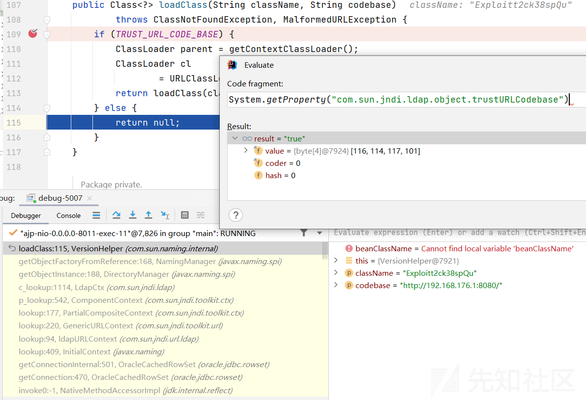](https://xzfile.aliyuncs.com/media/upload/picture/20231128140330-daa1421a-8db3-1.png)  
为了让我们观察到这个属性被赋值的时刻，同样是设置了调试参数为`server=y,suspend=y`。

[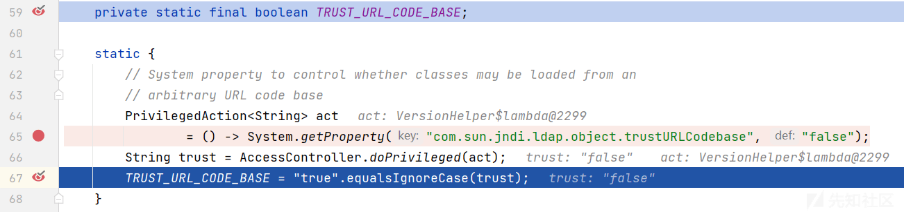](https://xzfile.aliyuncs.com/media/upload/picture/20231128140414-f4e1e292-8db3-1.png)

调用栈为：

```plain
<clinit>:67, VersionHelper (com.sun.naming.internal)
<clinit>:87, ResourceManager (com.sun.naming.internal)
init:232, InitialContext (javax.naming)
<init>:184, InitialContext (javax.naming)
createMBeans:99, GlobalResourcesLifecycleListener (org.apache.catalina.mbeans)
lifecycleEvent:82, GlobalResourcesLifecycleListener (org.apache.catalina.mbeans)
fireLifecycleEvent:123, LifecycleBase (org.apache.catalina.util)
setStateInternal:423, LifecycleBase (org.apache.catalina.util)
setState:366, LifecycleBase (org.apache.catalina.util)
startInternal:923, StandardServer (org.apache.catalina.core)
start:183, LifecycleBase (org.apache.catalina.util)
start:772, Catalina (org.apache.catalina.startup)
invoke0:-1, NativeMethodAccessorImpl (jdk.internal.reflect)
invoke:62, NativeMethodAccessorImpl (jdk.internal.reflect)
invoke:43, DelegatingMethodAccessorImpl (jdk.internal.reflect)
invoke:566, Method (java.lang.reflect)
start:345, Bootstrap (org.apache.catalina.startup)
main:476, Bootstrap (org.apache.catalina.startup)
```

### 7、MemoryUserDatabaseFactory(Tomcat) 的 XXE/文件写入到 RCE

这时候实在没什么思路了，去知识星球里问问大佬们。

星主挺热心的，这里表示感谢。遗憾的是，根据星主提示的`org.apache.batik.swing.JSVGCanvas#setURI`这个 gadget 测试发现目标并没有这个依赖。

还是回来继续看@浅蓝的文章。XXE/Tomcat 文件写入 RCE？(org.apache.catalina.users.MemoryUserDatabaseFactory)

[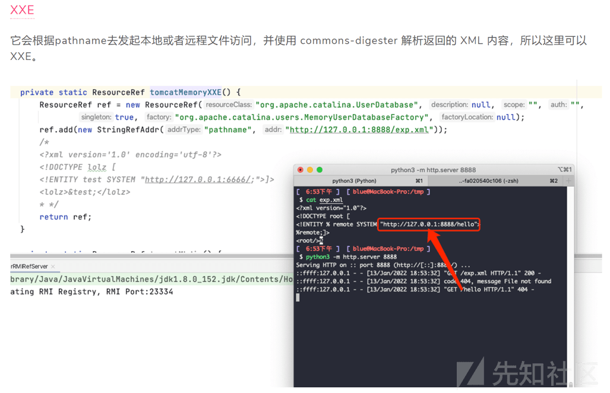](https://xzfile.aliyuncs.com/media/upload/picture/20231128141745-d84b19d0-8db5-1.png)

先理解一下这个 XXE 的原理，它是后续 RCE 的前导。其原理是 MemoryUserDatabaseFactory 设置 pathname，后续会转换成 URL，然后进行 database#open() 的时候，从 pathname 指定的 URL 中取得 xml 内容进行解析。可以说是 blind SSRF=> blind XXE。

[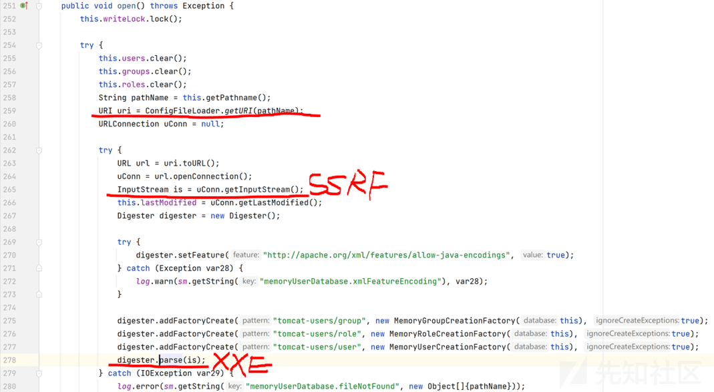](https://xzfile.aliyuncs.com/media/upload/picture/20231128142701-2421d99c-8db7-1.png)

这个 factory 利用开始看那篇文章的时候扫到过，但是想到目标是 Linux，据说还得自己找创建目录的方法先略过了。这下实在没招，再硬着头皮看看这个有没有戏吧。  
由于 RCE 需要创建目录，先看看 XXE 吧，虽然是个 blind XXE。兴许能读到一些敏感的文件，帮忙后续的利用？  
结果，由于 blind XXE 的局限性，只能读取到/etc/hostname。

[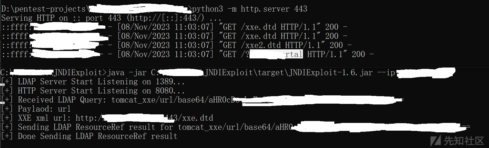](https://xzfile.aliyuncs.com/media/upload/picture/20231128142241-889b3ec8-8db6-1.png)

再看看 RCE 的原理。看这张图：

[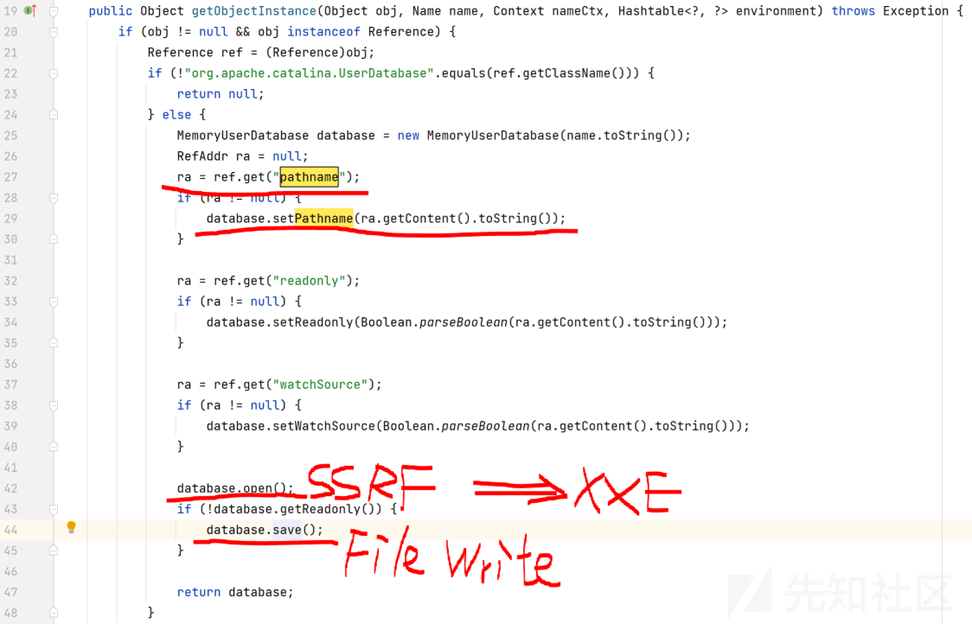](https://xzfile.aliyuncs.com/media/upload/picture/20231128142900-6a7d7b30-8db7-1.png)

注意到这里的 database.save()。

[](https://xzfile.aliyuncs.com/media/upload/picture/20231128142933-7e2d0d3a-8db7-1.png)

就是 tomcat 会根据之前设置的 pathname 值在`System.getProperty("catalina.base")`下创建 pathname + ".new"这样的文件（不用担心，后续会重命名回来）。

看到这里，疑惑构造 File 的第二个参数能路径穿越吗？  
在 Windows 上测试一下：

```plain
private static void test3() {
        File file = new File(System.getProperty("java.io.tmpdir"), "lalala/../../../test_temp_cqq3.txt");
        // File file = new File(System.getProperty("java.io.tmpdir"), "../../../test_temp_cqq2.txt");
        // File file = new File(System.getProperty("java.io.tmpdir"),"test_temp_cqq.txt");
        try {
            FileWriter writer = new FileWriter(file);
            writer.write("Hello, this is a test string.");
            writer.close();
            System.out.println("Successfully wrote to the file.");
        } catch (IOException e) {
            System.out.println("An error occurred.");
            e.printStackTrace();
        }
    }
```

[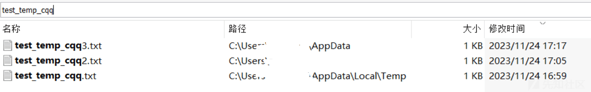](https://xzfile.aliyuncs.com/media/upload/picture/20231128144444-9d737330-8db9-1.png)  
Windows 下确实可以无视这里的 lalala，直接跳目录。Linux 下没有测试，应该是不能的。  
从 pathname 这个名字，以及创建 pathname + ".new"这样的文件，可以看出 tomcat 这里的用意也是期待传入的是一个相对路径的文件名。只不过这里由于 URL 比 File 更宽泛被 abuse 了。

需要担心的是，对于`http://xxx/yyy` 这样的文件名，如果中间路径比如`http:`不存在，tomcat 会自动帮你创建吗？tomcat 并不会不帮你创建。你得自己想办法让`System.getProperty("catalina.base")`路径下有这样一个目录，  
Tomcat 才会给你写入从 pathname 得到的文件内容。具体的代码在 isWritable() 方法中。

[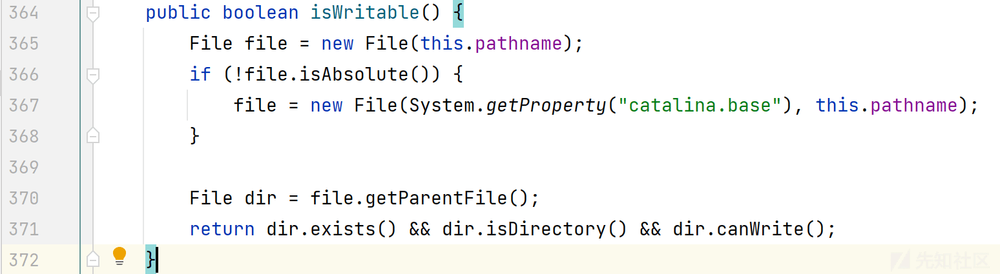](https://xzfile.aliyuncs.com/media/upload/picture/20231128143854-cce307ee-8db8-1.png)  
后续需要找到在`System.getProperty("catalina.base")`目录下，创建任意目录，比如`http:`的办法。  
看到@浅蓝文章里说的他用的办法是`org.h2.store.fs.FileUtils#createDirectory(String)`，需要配合 forceString。但是现在已经不能用 forceString 了。还是得自己找。  
先看看手里有什么可以用来创建目录的？

手里有

-   System.setProperty()；
-   任意 public 类的 public 的 setAbc(String payload)，可以是 static 的；
-   实现 Serializable 接口类的 getXyz() 方法，类的属性可以随便设置。

问了一下 ChatGPT，创建目录的 API 至少有：

-   Files.createDirectory
-   Files.createDirectories（父目录不存在则创建、直到创建完整目录）
-   File.mkdir
-   File.mkdirs（父目录不存在则创建、直到创建完整目录）

最开始还是希望从 JDK 里找到的，这样可以方便下次使用。尝试创建 jdk 的 codeql 数据库，但是碰到一堆问题，先不折腾了。直接 grep 然后手动确认吧。  
先找到 com.sun.org.apache.xalan.internal.xsltc.compiler.XSLTC，

[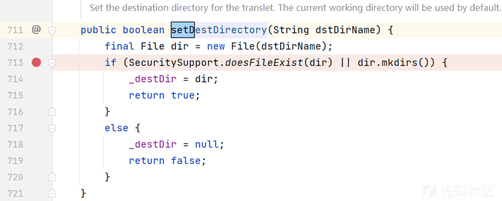](https://xzfile.aliyuncs.com/media/upload/picture/20231128153053-0fa57e3e-8dc0-1.png)  
看似有希望，但是它没有空参数的构造器，放弃。  
又找到 org.graalvm.compiler.debug.DiagnosticsOutputDirectory，但是它并不是 Serializable。

[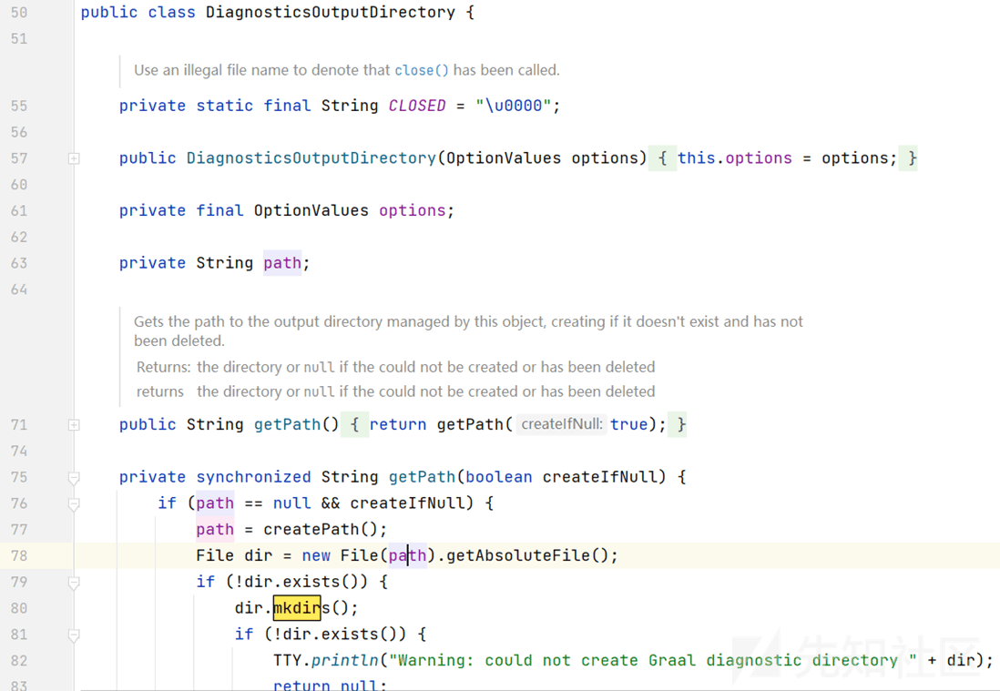](https://xzfile.aliyuncs.com/media/upload/picture/20231128153152-32d239a6-8dc0-1.png)  
算了吧，直接找项目中的代码吧，先能 RCE 了再说。  
找到了两个，其中一个是通过 getOutputStream 来创建目录的，就用这个了。

[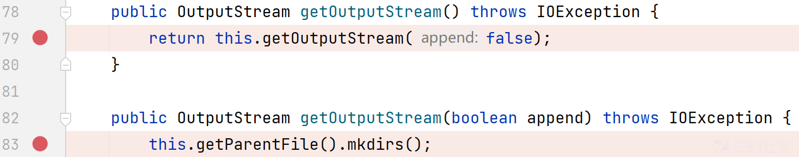](https://xzfile.aliyuncs.com/media/upload/picture/20231128153601-c7aabaee-8dc0-1.png)

构造序列化 payload：

[](https://xzfile.aliyuncs.com/media/upload/picture/20231128154010-5c0dec6a-8dc1-1.png)

```plain
Serializable payload8 = XyzFileMkdir1.getObject("/opt/tomcat/aaa/bbb/http:/192.168.176.1:8888/whatever");
```

成功创建这样的目录：

[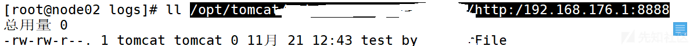](https://xzfile.aliyuncs.com/media/upload/picture/20231128154136-8f350e16-8dc1-1.png)

然后实现文件写入：

[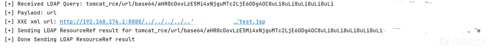](https://xzfile.aliyuncs.com/media/upload/picture/20231129101856-a613a7c2-8e5d-1.png)

[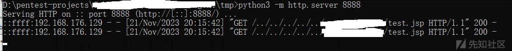](https://xzfile.aliyuncs.com/media/upload/picture/20231128154841-8c857218-8dc2-1.png)

[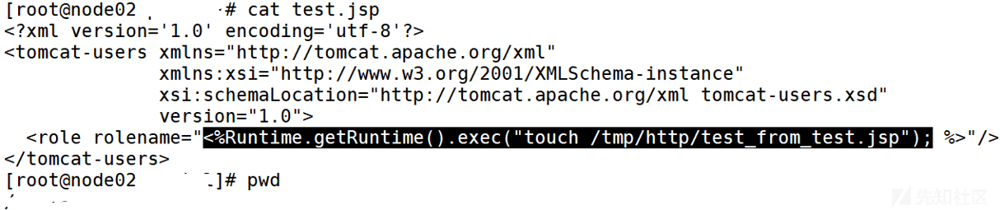](https://xzfile.aliyuncs.com/media/upload/picture/20231128154844-8e82f162-8dc2-1.png)

至此，终于实现了 RCE。

## References

-   [探索高版本 JDK 下 JNDI 漏洞的利用方法](https://tttang.com/archive/1405/)
-   [探索 JNDI 攻击](https://github.com/iSafeBlue/presentation-slides/blob/main/BCS2022-%E6%8E%A2%E7%B4%A2JNDI%E6%94%BB%E5%87%BB.pdf)
