一次有趣的锐捷 EG 易网关代码审计

- - -

# 一次有趣的锐捷 EG 易网关代码审计

## 前言

之前提交过一次锐捷 RG-EG 系列出口网关的逻辑漏洞，最近几天有时间再次审计一下，这次主要针对 WEB 管理端的登录功能进行审计。锐捷 RG-EG 系列的出口网关是网络设备，类似这种网络设备一般都会内置 web 管理端，网络设备最主要的是设备功能，从而导致开发者在 web 端的逻辑设计方面存在疏忽，造成漏洞的产生。这次审计最终成功找到了前台无条件命令执行漏洞，也算是给之前的逻辑漏洞成因画上了一个完美的句号，接下来我将回到当初审计的视角，带大家一起复盘这次有趣的审计过程。

## 审计过程

### 接口发现

1.  这次我手中的是 WEB 管理端的源码，这种设备说实话是不太好审的，因为这是网关设备，我们本地无法搭建完整的环境，小伙伴们如果想测试可以去 fofa 上搜一下相关的在线资产，我这里也是拿一个朋友公司的网站，叫他帮我搭了一个，供我们进行测试。
    
    
    
2.  同时我们使用浏览器的 SwitchyOmega 插件，把本地代理端口切到 8080，打开 Burp，抓一下登录功能的接口及参数，从返回包可以看到登录功能为 login.php，登录逻辑非常的朴实无华，POST 发送用户名密码，返回 json 带着状态和数据。
    
    [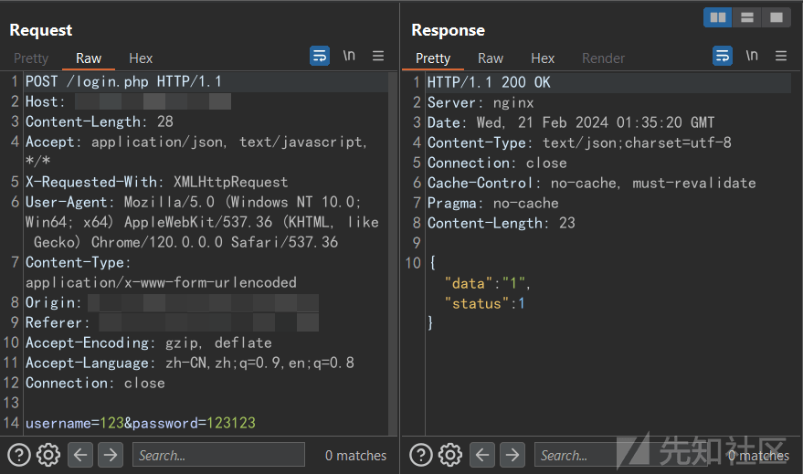](https://xzfile.aliyuncs.com/media/upload/picture/20240221111912-fc68a5fe-d067-1.png)
    

### 代码审计

1.  找到了登录功能后，我们打开 login.php，大概看一下这个登录逻辑
    
    [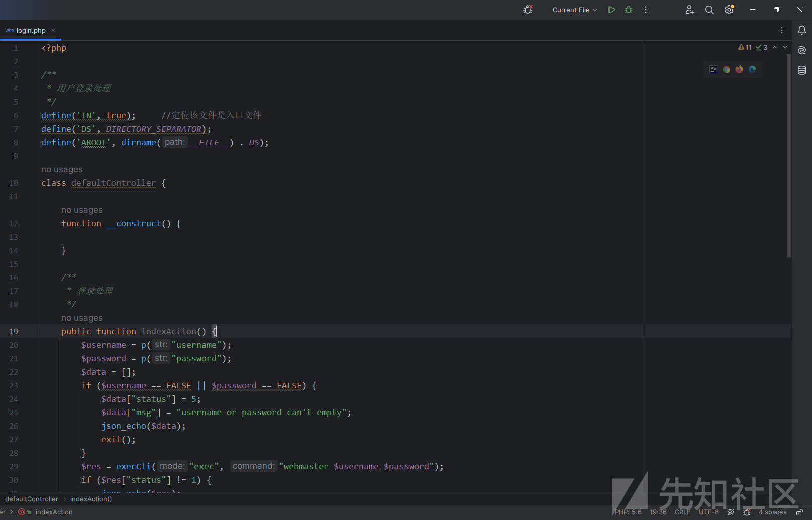](https://xzfile.aliyuncs.com/media/upload/picture/20240221111923-02911088-d068-1.png)
    
    [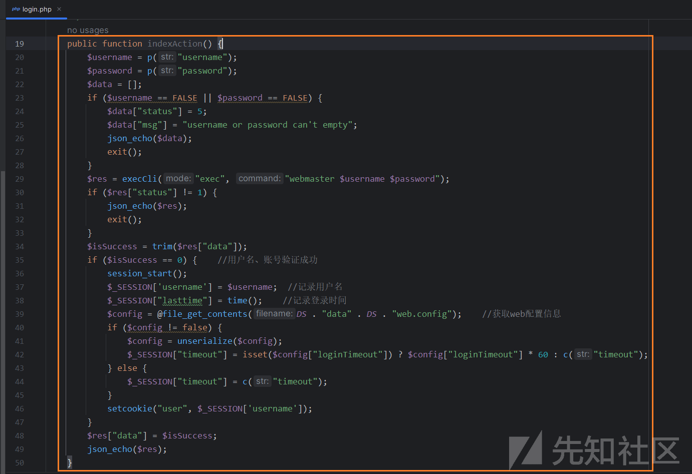](https://xzfile.aliyuncs.com/media/upload/picture/20240221111926-048ea6e8-d068-1.png)
    
2.  负责登录处理的函数就是上面这个，其中首先会传进来两个变量"username"和"password"，就是账号和密码，是我们可控的变量，同时会首先判断不能让这两个变量是空的，然而其实这么写是有个逻辑问题，光靠判断是否=false 实际并不能判断是否为空，哈哈，不过这无关紧要。
    
    [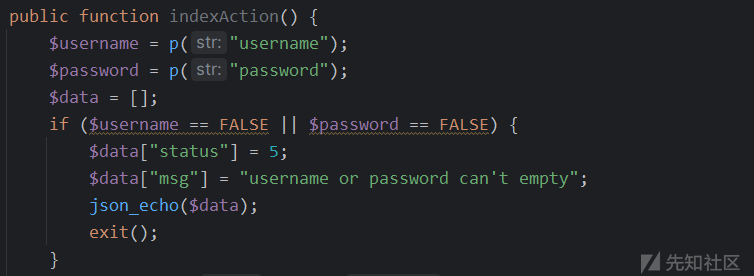](https://xzfile.aliyuncs.com/media/upload/picture/20240221111958-177b61a6-d068-1.png)
    
3.  接下来可以看到有个$res 变量，这个变量装载着执行 execCli() 函数的返回结果。
    
    [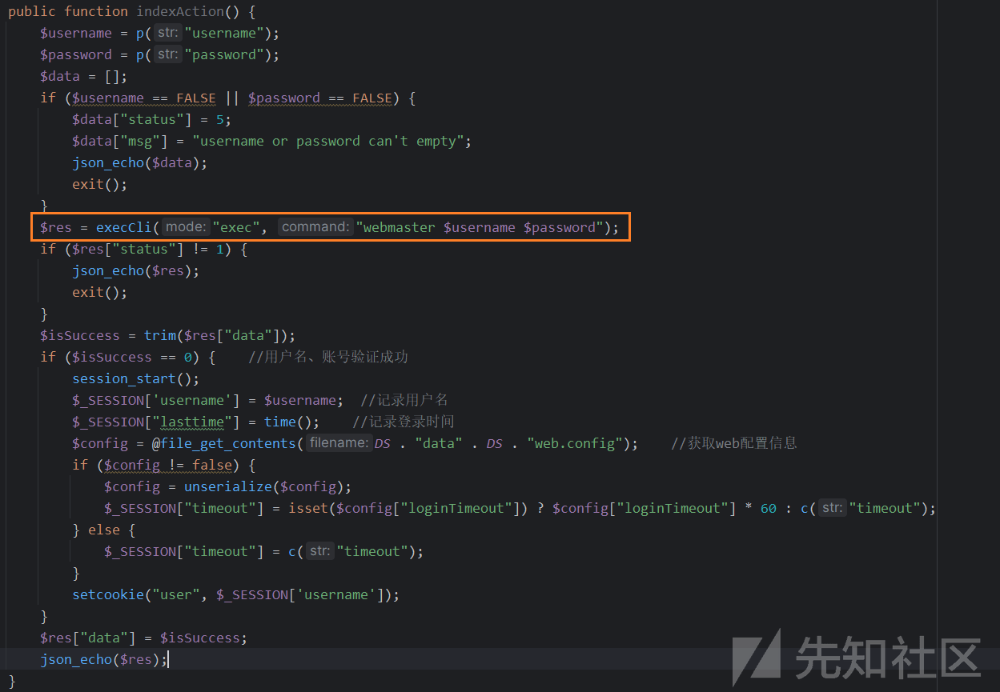](https://xzfile.aliyuncs.com/media/upload/picture/20240221112005-1b725f76-d068-1.png)
    
4.  从下面的代码我们可以看出下面的大多是对$res 的值进行判断，从而直接给出结果，所以我们大概能猜到这是一个状态码变量，通过它的值来判断登陆成功与否，又因为他是 execCli 函数的返回结果，因此我们判断 execCli 会接管登录逻辑判断这一任务
    
    [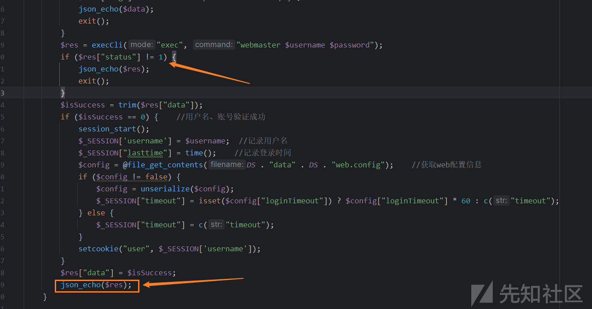](https://xzfile.aliyuncs.com/media/upload/picture/20240221112012-20221b4c-d068-1.png)
    
5.  跟进到 execCli 函数，我们可以看到这个函数有三个形式参数，$mode, $command, $answer，初步猜测第一个是模式，第二个是命令，从上面我们也可以知道从 login.php 传过来的时候，$mode=exec, $command="webmaster $username $password"，到这里我们确定了 execCli 函数会执行命令，但是这个命令我们没有见过，不是常见的系统命令，于是接着往下进一步分析下 execCli 这个函数是怎么处理这条命令的。
    
    [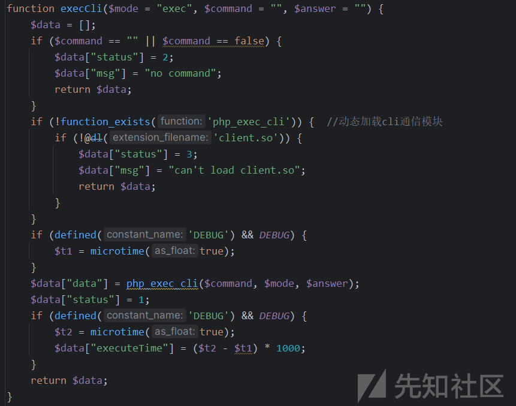](https://xzfile.aliyuncs.com/media/upload/picture/20240221112016-22891a8e-d068-1.png)
    
6.  往下看这个函数的内部一开始也是在判断参数是否为空，然后在下面会传入到一个 php\_exec\_cli 函数中，我一开始想着又是要看另一个函数，于是按着 Ctrl 对函数名一阵狂点，试图跟进，但是死活不管用....
    
    [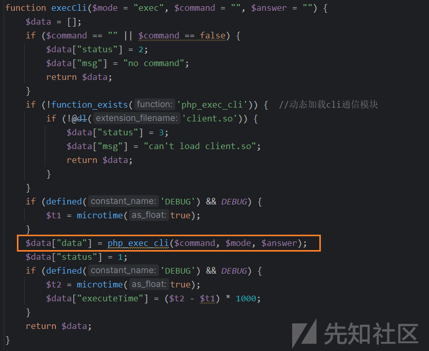](https://xzfile.aliyuncs.com/media/upload/picture/20240221112020-24b8adc4-d068-1.png)
    
7.  仔细一看，哈哈，原来是上面自己定义的一个函数，动态加载 php cli 的通信模块，与其他命令行进行了互联通信，但是我们本地的源码并没有 client.so。此时陷入了僵局，当时我也不知道 webmaster 这究竟是一条什么命令。
    
    [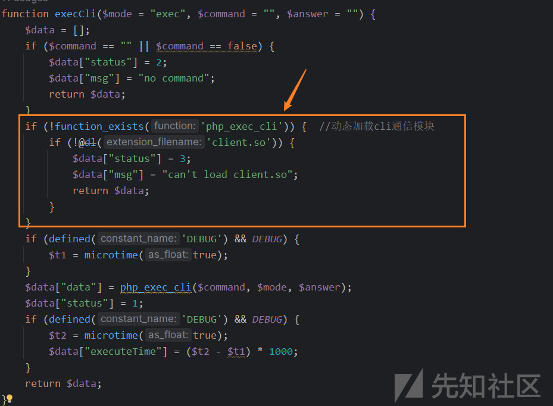](https://xzfile.aliyuncs.com/media/upload/picture/20240221112024-26d00080-d068-1.png)
    
8.  再次回看，复盘分析，去群里问，去百度，谷歌搜索，我坐下来再次思考，这是一套网络设备的 web 管理系统，里面的许多功能更多地是以 web 的方式展示设备的各项数据，再加上除了 login.php，其他功能点也有很多用了 execCli 这个函数，因此大胆猜测，这里执行的应该是网关设备的命令，类似于路由器命令。
    
9.  假如你是一名运维小哥，那么看到这里也许你心里已经自动有了 Payload，然而，在此之前我从未接触过这种网络设备的命令都有什么，也不知道不同的设备有没有通用的命令，因此我还是回归渗透测试的视角，进入官网点击客服，开始社工！(小小的咨询)
    
    [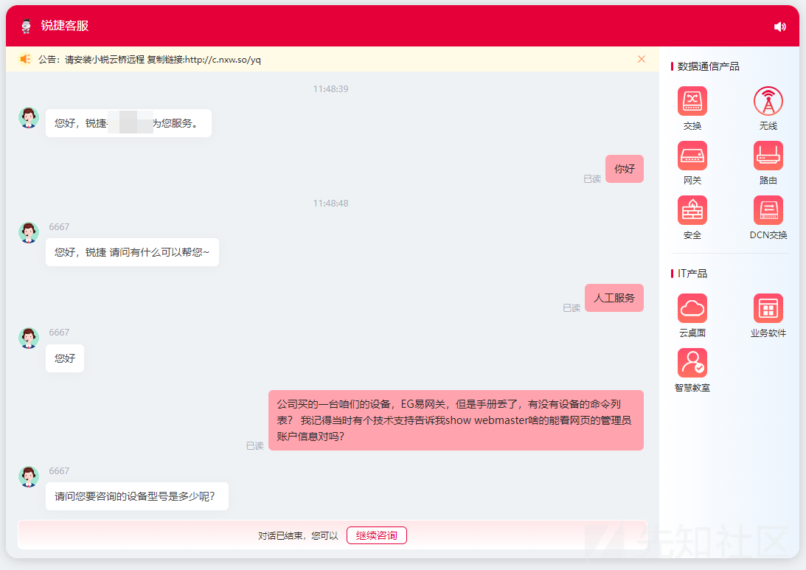](https://xzfile.aliyuncs.com/media/upload/picture/20240221112041-3123a1d6-d068-1.png)
    
10.  三下五除二拿到了设备命令手册，详细地看了下，发现了许多敏感命令，例如直接操作更改设备相关信息，更改 ip 信息，更改路由等等，结合百度，发现了一些没有危害的命令：Show 命令，主要用于返回信息。
    
    
    

### 复现开始

1.  经过审计阶段，我们如今已经知道 login.php 存在命令执行，POST 请求的 username 和 password 参数最终会被拼到 webmaster 命令里，最终到后端设备会执行 webmaster username password 命令，之后后端会再将执行的结果返回给前端，如果成功，那么直接返回 1，如果不成功，会返回错误 + 报错信息，如下我画了一张图，举例：如果让 username=abc, password=bcd, 那么程序的命令执行过程是这样的：
    
    [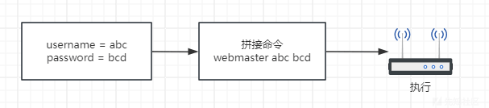](https://xzfile.aliyuncs.com/media/upload/picture/20240221112053-3872554a-d068-1.png)
    
2.  因为 password 拼接了命令的后半部分，因此我们只需要构造一下 password 参数即可，使用"?"符号可以用来分割两条命令，类似 Linux 的管道符"||"，之后再加上我们要执行的命令，Payload 打造完成：
    
    [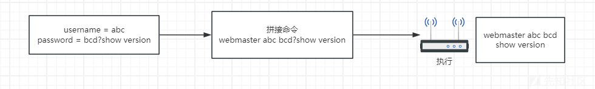](https://xzfile.aliyuncs.com/media/upload/picture/20240221112057-3aebdd64-d068-1.png)
    
3.  这样以来，我们直接到 burp 中发送 payload，即可实现任意命令执行，如图 burp 中的返回包中已经返回了 show version 命令的执行结果，显示了当前设备的详细版本等信息
    
    [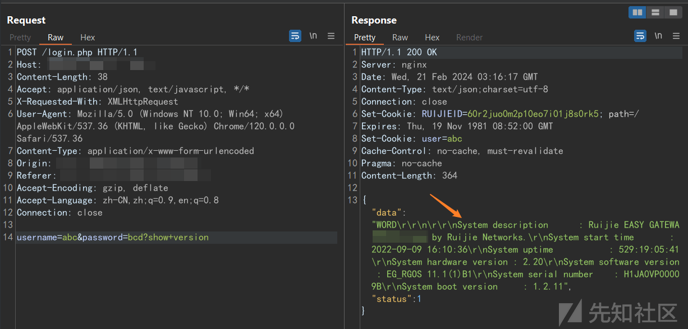](https://xzfile.aliyuncs.com/media/upload/picture/20240221112102-3d8e18f2-d068-1.png)
    

## 总结复盘

这次命令执行审计出现的最终原因还是因为没有进行参数过滤，使得其他命令传到了后端，并且被设备执行了，但这对于渗透测试人员来说，也是一种提示，当今许多的网络设备都配有 web 管理端，许多开发者为了开发方便，直接写一个执行设备命令的接口，然后通过增加路由器命令来验证账号密码对错与否，虽说这种方式对于其他功能的二次开发以及整合确实省事了不少，但也导致了安全问题，我审计这个系统之后也找了其他的设备源码进行分析，发现不少设备厂商都有像这篇文章写的这样大同小异的问题，由此可知，即使是网络设备，我们也不能放过蛛丝马迹，即使执行的是设备命令或者配置命令，也会有很大的危害！

我是小安，感谢你能看到这里，欢迎对我的文章发表评论和批评，祝你生活愉快~
