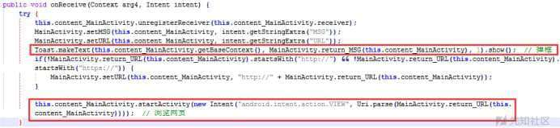
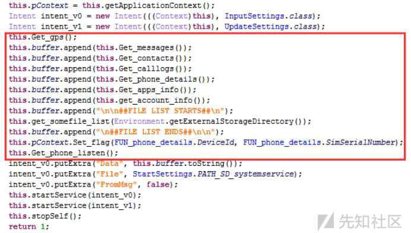
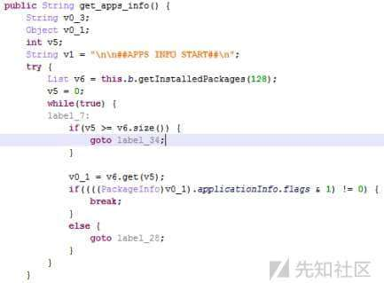
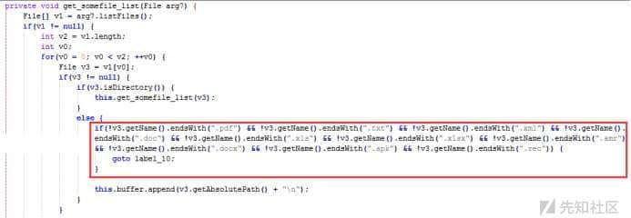
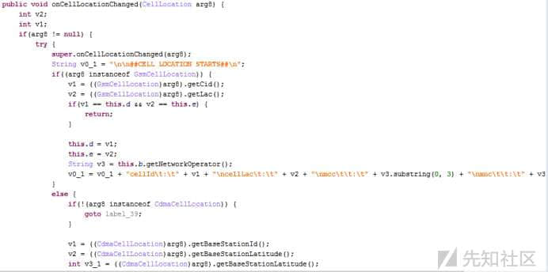
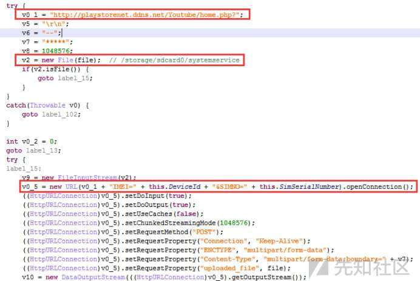

# 一款 Bitter 组织使用的手机远控木马分析 - 先知社区

一款 Bitter 组织使用的手机远控木马分析

- - -

## 概述

近期，笔者在对电脑文件进行整理的时候，无意间发现了一款 Bitter 组织使用的 Android 端远控样本，本着学习的态度，笔者尝试对其进行了详细分析。

通过分析，发现此款 Android 端远控样本除了会对自身行为进行隐藏执行外，还会从 Android 端监视和窃取大量个人用户信息：

-   设备 GPS 信息
-   短信信息
-   联系人信息
-   通话记录信息
-   设备基本信息
-   已安装应用信息
-   设备账户信息
-   指定文件路径信息
-   基站信息

## 样本家族

基于样本行为及外联信息进行网络调研，同时结合 VT 平台进行关联分析，关联发现此样本为 Bitter 组织 Android 端远控样本。

[](https://xzfile.aliyuncs.com/media/upload/picture/20240301092146-122dc9ec-d76a-1.png)

网络中 bitdefender 公司针对 Bitter 组织攻击活动发布的分析报告截图如下：

[](https://xzfile.aliyuncs.com/media/upload/picture/20240301092159-19a1037e-d76a-1.png)

## 样本分析

### 基本信息

样本基本信息如下：

```plain
文件名称：photos.apk

文件大小：701723 字节

MD5   ：D20C6731E278A1D3202B4CAA0902AFA8

SHA1   ：B6353DAC1E425C3081F672ADF24D49B33E53A902

CRC32  ：4D82C814

package.name: google.comgooglesettings

cer.sha1:1173C15E0E3E69EE088CE0654CAB314F94DBD018
```

### 安装情况

样本安装后没有图标，运行后将申请相关设备权限，以便后台执行相关恶意功能；

相关代码截图如下：

[](https://xzfile.aliyuncs.com/media/upload/picture/20240301092212-21659b38-d76a-1.png)

[](https://xzfile.aliyuncs.com/media/upload/picture/20240301092225-29345b56-d76a-1.png)

### 伪装行为

样本将 POST 请求`http://playstorenet.ddns.net/Youtube/index.php?`地址，从接收数据中提取“MSG”、“URL”数据，最后以弹框方式显示“MSG”数据和浏览“URL”网页（网页已失效，因此不清楚具体的“MSG”和“URL”值），以达到伪装效果（因为获取的“URL”数据未在其他代码处有相关的访问行为，因此猜测此行为只是为了迷惑用户，将自身伪装成一个服务程序弹框报错）。

POST 请求代码截图如下：

[](https://xzfile.aliyuncs.com/media/upload/picture/20240301092240-32600a86-d76a-1.jpg)

从接收数据中提取“MSG”、“URL”数据：

[](https://xzfile.aliyuncs.com/media/upload/picture/20240301092254-3a5e0cd8-d76a-1.jpg)

[](https://xzfile.aliyuncs.com/media/upload/picture/20240301092305-4177bf82-d76a-1.jpg)

弹框方式显示“MSG”数据和浏览“URL”网页：

[](https://xzfile.aliyuncs.com/media/upload/picture/20240301092317-483fdae8-d76a-1.jpg)

### 窃取数据

样本将获取设备 GPS 信息、短信信息、联系人信息、通话记录信息、设备基本信息、已安装应用信息、设备账户信息、指定文件路径信息、基站信息等，并将获取的数据信息写入“/storage/sdcard0/systemservice”文件中，然后 POST 请求`http://playstorenet.ddns.net/Youtube/home.php?IMEI=[DeviceId]&SIMNO=[SimSerialNumber]`地址上传获取的窃密数据。

相关代码截图如下：

[](https://xzfile.aliyuncs.com/media/upload/picture/20240301092329-4f673654-d76a-1.jpg)

### 获取 GPS 信息

样本将获取 GPS 信息；

相关代码截图如下：

[](https://xzfile.aliyuncs.com/media/upload/picture/20240301092340-56019bd0-d76a-1.jpg)

### 获取短信信息

样本将获取短信信息；

相关代码截图如下：

[](https://xzfile.aliyuncs.com/media/upload/picture/20240301092352-5d4ed8ee-d76a-1.jpg)

### 获取联系人信息

样本将获取联系人信息；

相关代码截图如下：

[](https://xzfile.aliyuncs.com/media/upload/picture/20240301092406-65a71330-d76a-1.jpg)

### 获取通话记录信息

样本将获取通话记录信息；

相关代码截图如下：

[](https://xzfile.aliyuncs.com/media/upload/picture/20240301092419-6d10b09a-d76a-1.jpg)

### 获取设备基本信息

样本将获取设备基本信息；

相关代码截图如下：

[](https://xzfile.aliyuncs.com/media/upload/picture/20240301092430-73fc78c6-d76a-1.jpg)

### 获取已安装应用信息

样本将获取设备已安装应用信息；

相关代码截图如下：

[](https://xzfile.aliyuncs.com/media/upload/picture/20240301092443-7ba86256-d76a-1.jpg)

### 获取设备账户信息

样本将获取设备账户信息；

相关代码截图如下：

[](https://xzfile.aliyuncs.com/media/upload/picture/20240301092456-83622e82-d76a-1.jpg)

### 获取指定文件路径

样本将获取设备 SD 卡上所有".pdf"、".txt"、".xml"、".doc"、".xls"、".xlsx"、".amr"、".docx"、".apk"、".rec"文件类型的文件路径；

相关代码截图如下：

[](https://xzfile.aliyuncs.com/media/upload/picture/20240301092509-8b031476-d76a-1.jpg)

[](https://xzfile.aliyuncs.com/media/upload/picture/20240301092524-93eebd56-d76a-1.jpg)

### 基站变化监听

样本将监听基站变化情况，并获取当前基站信息、附近基站信息；

相关代码截图如下：

[](https://xzfile.aliyuncs.com/media/upload/picture/20240301092538-9c226b44-d76a-1.jpg)

获取当前基站信息代码截图如下：

[](https://xzfile.aliyuncs.com/media/upload/picture/20240301092552-a485f800-d76a-1.jpg)

获取附近基站信息代码截图如下：

[](https://xzfile.aliyuncs.com/media/upload/picture/20240301092604-ac002a6a-d76a-1.jpg)

### 写入 systemservice 文件

样本将把获取的数据写入“/storage/sdcard0/systemservice”文件中，以便后续上传行为；

相关代码截图如下：

[](https://xzfile.aliyuncs.com/media/upload/picture/20240301092617-b36de134-d76a-1.jpg)

### 上传数据

样本将上传存放窃密数据的“/storage/sdcard0/systemservice”文件；

上传地址为：

```plain
http://playstorenet.ddns.net/Youtube/home.php?IMEI=[DeviceId]&SIMNO=[SimSerialNumber]
```

相关代码截图如下：

[](https://xzfile.aliyuncs.com/media/upload/picture/20240301092633-bcfb1be0-d76a-1.jpg)
