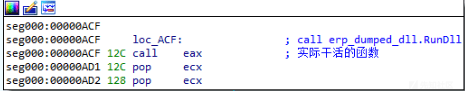

# 一款 mm 的免杀启动架构分析 - 先知社区

一款 mm 的免杀启动架构分析

- - -

年底邮箱收到一封投毒邮件，附件是个 msi。  

微步云沙箱跑一下，发现 26 个杀毒引擎只有一个检测出威胁，行为检测也没有发现啥异常。  

唯一的查杀很可能是把 viewer.exe 列为了恶意软件，但就功能和行为来说，目前大多数杀软还是放过这个程序的。

免杀做的这么好的，倒是让人感兴趣到底是怎么搞的。于是本着学习的目的，详细撸了一下这个 mm 的加载过程。

### 一、msi

MSI 文件是 Microsoft Installer 的缩写，它是一个用于在 Microsoft Windows 系统上安装、卸载、修复或更新软件的安装包。本质上是一种文件格式，并不是可执行程序，其是由 windows 系统的 MS Installer 系统服务解析并执行的。由于 windows 系统服务运行在 SYSTEM 账户下，使用 MSI 封装 mm，不但可以获得管理员权限，甚至有机会得到 SYTEM 的最高权限。

使用微软提供的工具"Orca"打开 MSI 文件，可以看到其打包的文件。看起来似乎是一个图形界面的正常程序。  

真实的 payload 都打包在"disk1.cab"中。  

在 Orca 中找到 "CustomAction" 和 "InstallExecuteSequence" 表，这些表存储了安装过程中的操作。  

似乎"viewer.exe"是一个加载器，有意思的东西貌似在"oop.bat"中。  

这么明显的吗，安装到"C:\\Windows\\HAHA"目录下。不过文件名似乎和压缩包里面的不一样。Orca 查看文件安装对应关系：  

这里犯了一个先入为主的错误，以为"viewer.exe"是某个正常的系统程序（因为没有在 disk1.cab 打包文件里），所以微步云沙箱查不出问题。找了一圈才明白，这就是一个引导 mm 运行的第一个程序。（之所以说是第一个，因为后面深入分析发现，一环接一环，真实 payload 的加载过程跌宕起伏，唉！）

### 二、viewer.exe

由于 mm 开发的 VS 比较新，IDA6.8 似乎不能正确识别`winmain`，使用 IDA7.7 分析才能事半功倍。

详细分析了一下这个程序，貌似一个通用启动器，主要是调用"ShellExecuteEx"启动多种类型的文件。  

在第一级的启动器层面，直面杀毒软件各种查杀，功能越简单，调用的特征函数越少，似乎越安全。后续针对性的免杀修改也越简单。

### 三、CNM.exe

CNM.exe 是由"txt"和"txt\_1"两个文件二进制连接而成。"txt"文件只有两个字节"MZ"，是 PE 文件的起始 magic 字符。这种拆分在后面的"loader"里面也用到。是不是杀软在判断威胁文件的时候，“MZ”这个 magic 字符是一个重要的判断标准？（还求大神赐教）

作为 viewer.exe 启动的第一个程序，实际上本身的功能很简单，是一个 shellcode 的引导器。  

功能没啥可说的，加载并解密 opk.txt，解密方式是按字节 xor 0x6C，跳转执行这个 shellcode。有意思的是跳转执行所用的方法：CreateTimerQueueTimer。

这是一个延时运行函数，延时 100ms 执行 shellcode。杀软的异常行为检测点不知道包括了些啥，反正这 mm 在关键跳转的方式选择上，所找到的函数或者方法还是很特别的。

需要注意的是这点代码和程序的大小严重不符。看一下程序的信息，更有意思。  

严重怀疑这个是把原始的那个程序扣出来一块，重新填充了相关加载代码。

### 四、opk.txt（shellcode)

这个本质上是一个 DLL Loader。优先把自身尾部携带的处理过的 DLL 加载到 0x10000000 地址上。  

函数`sub_32`加载 dll，并用`call eax`跳转到 dll 的 entry point。  

这个 Loader 还是挺复杂的，和正常 Loader 不同的地方是：

-   内嵌的 DLL 没有 DOS 头，Loader 补全后不加“MZ”magic 字符；
    
-   内嵌的 DLL 的 Import Directory 做了顺序上的打乱，由这个加载器负责复原，恢复正确的 IAT。
    

### 五、opk--加载的内存 DLL

这个 DLL 的功能看图几乎一目了然：干 360、实现驻留、下载关键 DLL、启动下一级 erp.exe，最后的 ExitProcess 退出 CNM.exe 进程。  

### 六、erp.exe

先来看看这个：  

比第一个 CNM.exe 多了数字签名，但缺少开发者信息，只有一个 CCLiveMTR.pdb 信息。

这个程序大概操作如下：

-   打开配置文件：C:\\Windows\\HAHA\\CCLiveMTR.conf，读取并进行相关设置，太多了，也看不懂。
    
-   连接域名：videoms.cc.163.com；进行 ping 测试：[http://videoms.cc.163.com/v1/vnetctl/ping，等操作](http://videoms.cc.163.com/v1/vnetctl/ping%EF%BC%8C%E7%AD%89%E6%93%8D%E4%BD%9C)
    
-   创建/打开日志文件：C:\\Users\\snake\\AppData\\Roaming\\CC\\logs\\CCLiveMTR.log
    

看到这里感觉这不是一个正常 mm 会干的事情，太托大了，难道是制式武器级别？拿来群发对付我是不是小题大作。转念一想，结合我分析这个 mm 的初衷，似乎能窥到一点端倪： == 这不会又是一个 CCLive 类的标准程序挖洞改的吧！ ==

可是这是一个带数字签名的文件，怎么改？往下面分析发现，不改 exe，但可以改 dll，这招厉害啊。

重温一下上一步下载了一个 libcurl.dll，看导出表似乎是一个正常的 DLL。不过跟踪到`.text:004023BA 12060 call sub_402960`，函数看起来很正常：  

实际上`curl_easy_init`这个函数就被篡改了，程序流程跑不到下面。

从免杀角度，这是放了一个签名的“未篡改”程序欺骗杀软。然后篡改其调用的偏门 DLL（系统默认没有的），这个 DLL 还放在互联网上，运行时下载。当程序执行到调用这个 DLL 函数时，就会执行篡改后的代码。

### 七、libcurl.dll 的`curl_easy_init()`

其实是一个加载 shellcode 的代码，参考第二步的 CNM.exe。过程大致如下：

-   打开并读取"C:\\Windows\\HAHA\\xo.had"文件，就是 shellcode。
    
-   解密：`(v6 ^ 0x7B) + 0x7B) ^ 0x7B`。图中用 xmm 寄存器实现了并行处理提高效率。
    
-   使用 CryptEnumOIDInfo 的回调函数指针跳转到 shellcode。
    

### 八、xo.had

这个 shellcode 本质上和前面的那个 shellcode 一样，位尾部附带了一个 DLL，自身是一个 Loader。  

和前面的那一个的区别主要在与这次加载的是一个真实的 payload。

这个 DLL 的 DllMain 函数只调用一次`DisableThreadLibraryCalls(selfDllModule)`。

真实的远控代码都在另一个导出函数`RunDll 100093D6`里面。

所以 shellcode 最后会调用这个函数： 

### 九、xo--加载的 DLL 就是最终的 payload。

这个 DLL 的`RunDll`导出函数执行真正的远控操作。实现了一个传输协议和简单加密算法。远控的 Server IP 是香港的，目前连不上了。有一个复杂的跳转表，应该是功能列表，多线程处理。

因为本文重点不是分析 mm 的 payload 如何工作，而是着眼点放在免杀的一些烧脑思路和操作上，就不深入分析了。

### 十、总结

落盘可见的可执行文件：功能简单人畜无害、公开的应用程序修改里面的部分代码、带数字签名的文件

-   恶意行为的文件：加密、动态载入内存中执行
    
-   拖拉机式的多级跳转、跳转点使用特殊函数
    
-   关键 DLL 从网上下载，利用数字签名的文件加载执行关键威胁代码
    
-   这套骚操作下来，不但静态查杀难以发现，动态跟踪、云沙箱也无能为力。
    

这似乎是一个免杀的框架，可以根据被杀情况随时更改被杀的部分。这才是最厉害的地方吧。

目前已经看到基于这个架构的另外两个个版本 mm。

由于本人非专业防病毒和保护技术的研究人员，错漏之处还望大神不吝赐教。
