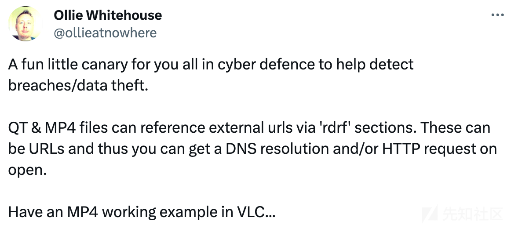
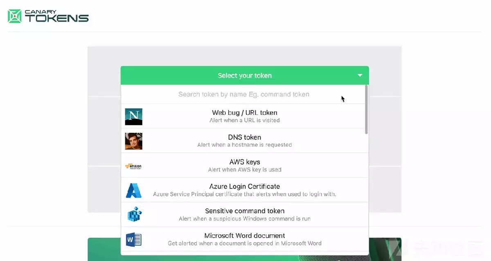
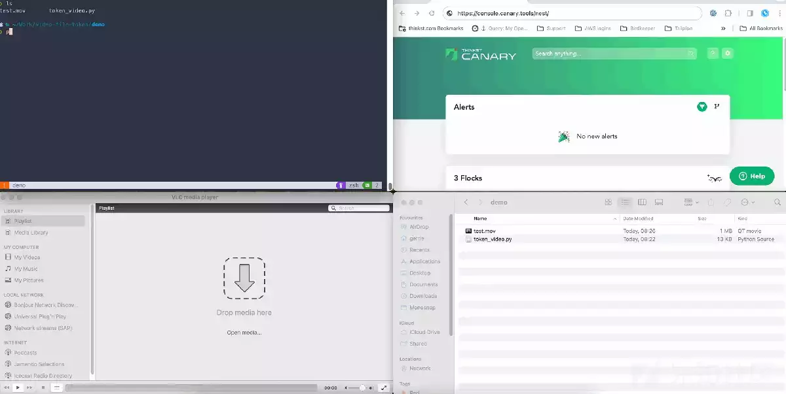
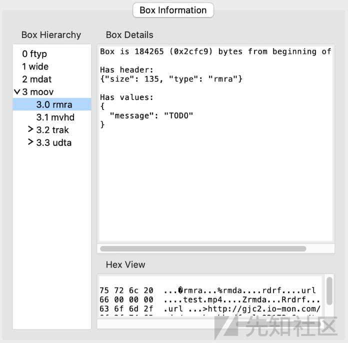
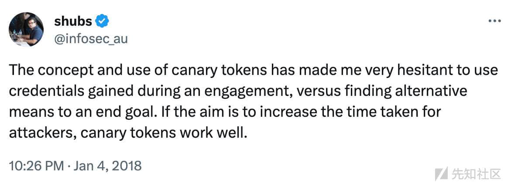

# 一种新的蜜罐技术思路——视频文件 Canarytokens：to be or not to be - 先知社区

一种新的蜜罐技术思路——视频文件 Canarytokens：to be or not to be

- - -

# 一种新的蜜罐设计思路：视频文件 Canarytokens（蜜罐）：to be or not to be

原文链接：[https://blog.thinkst.com/2024/01/video-file-canarytokens-to-be-or-not-to-be.html](https://blog.thinkst.com/2024/01/video-file-canarytokens-to-be-or-not-to-be.html)

最近 Thinkst 上的朋友（也是 NCSC 的 CTO）在推特上发布了这个有趣的花絮：

我们一直在寻找新型的 Canarytokens（蜜罐的一种形式），所以如果我们使用这种方法来创建视频文件的 Canarytokens，那就太酷了。

# 快速背景解释

我们首先搭建[Canaries](https://canary.tools/ "Canaries")（蜜罐产品）来当作全部的机器，几乎不需要任何配置并且可以当作各种操作系统来使用。逻辑上你只需要不到一分钟去设置它，当攻击者进入你的网络时，他们会搜集有价值的东西，或者横向移动，并且不可避免的会与 Canary 产生交互（我们就可以捕获他们的攻击行为并发现他们的存在）。

根据经验，Canaries 在七大洲都有使用。

我们也搭建了一些[Canarytokens](https://canarytokens.org/ "Canarytokens")。这是一些较小的陷阱，它也可以用来检测攻击者，但是运行方式有些区别。

它们可能是：

-   你在你的 code-signing-server 上放一个虚假的 AWS API KEY，攻击者拿下这个 server，拿到了这个 KEY 并尝试连接它，因为它可能使她访问新的网络环境。当他们这样做的时候，Canarytokens 会捕获到他们的行为并通知您。
-   一个伪造的 MS-Excel 文件，文件名可能是服务器密码.xls。将这个文件放在 DevOps 成员的一个文件夹里。攻击者发现这个文件还觉得自己太幸运了，打开这个文件，Canarytokens 会捕获到他们的行为并通知您他们的存在。
-   还有更多例子（参见免费的[Canarytokens 网站](https://canarytokens.org/ "Canarytokens网站")）

AWS-API key token 是非常好的防御行为。攻击者会主动搜索它们。发现它们并尝试利用它们，绕过它们对于攻击者来说不容易。

虚假文件 Canarytokens（像 MS-office 文件或者 PDF 文件）通常通过在其中嵌入一些远程访问的资源来运作的。许多文件格式都提供了 URL，文档阅读器（像 MS office 或者 Acrobat Reader PDF 阅读器）会发现 URL 并尝试跟它交互，即使是 DNS 请求，那么我们可以在攻击者访问该文件之后发出告警）令人惊讶的是，有很多文件格式允许获取 URL；例如，当 windows 启动已签名的 exe 二进制文件时，它将在签名中查找证书吊销列表（CRL）URL，如果存在，它将首先尝试从嵌入的 URL 里下载 CRL。

当然，我们有一堆文件/技术可以使用，因此任何人都可以毫不费力的部署这些 token：

# 查看 QuickTime movie file 内部

QuickTime movie (.mov file) 这个文件格式是一种容器格式，其中包含 media data 和用来描述 media data 的 metadata。由于该文件格式是容器格式，因此无需对 media data 进行解码即可解析和修改存储在文件中的 metadata。

.mov 文件包含许多不同的原子（也称为 sections(段））。每个原子都有一个类型和一个大小，而一些原子还包含额外的字段和/或 child 原子，从而形成树结构文件。此设计允许应用程序解析 QuickTime 影片文件，同时忽略它不关心的原子类型（以及扩展树结构的部分）。

所有 .mov 文件都包含一个“moov”原子，它是描述电影的所有 metadate 原子 s 的 parent 原子。大多数 .mov 文件还包含一个“mdat”原子，用于存储媒体数据（编码的音频和视频数据）。.mov 文件也可以只包含 reference movie（没有“mdat”原子），例如[此处](https://samples.ffmpeg.org/mov/reference-files/ "此处")的示例。

“moov”原子包含以下一个或两个子原子：

-   'mvhd' – 一个 movie header 原子，其中包含描述整个电影的数据。
-   'rmra' – 一个 reference movie 原子，其中包含对一个或多个电影的引用（可以在本地计算机上或外部资源上）

为了使用 URL 指定参考电影，需要将原子树添加到“moov”原子中：“moov”>“rmra”>“rmda”>“rdrf”。URL 存储在“rdrf”原子中。

# 让我们来做一个视频文件 token

Ollie 指出，他可以创建一个视频文件，通过使用“rdrf”原子来触发 DNS 请求和 HTTP 请求。这似乎是一个值得创造的 token。

想象一下，一个攻击者进入我们的网络并看到（她认为是）保存的 Zoom 录音，或供媒体公司使用的有趣视频文件（想想 avengers\_6\_can\_we\_go\_home\_now.mp4），或董事会会议的录音。

十六进制编辑器和 ffmpeg 的[参考文件](https://samples.ffmpeg.org/mov/reference-files/ "参考文件")（已经包含“rdrf”原子）在快速测试提供便利。我们可以让 VLC 向修改后的 URL 发送请求，但这些.mov 文件不包含任何视频数据，所以我们知道我们可以做得更好。

再编写一个小脚本将指向外部 URL 的“rdrf”原子 添加到现有的 .mov 文件后，我们在 VLC 上触发令牌方面取得了一些早期成功！这是令人兴奋和让人热血沸腾的;使用 VLC 打开我们的视频文件会产生警报，并告诉我们可能有一个新的 Canarytoken 即将出现。

.mov 文件的结构如下所示（由[MP4Analyser](https://github.com/essential61/mp4analyser "MP4Analyser")可视化）。多个“rdrf”原子是必需的，因为如果“rdrf”原子的 URL 未解析，VLC 不会回退到存储在 .mov 文件中的视频数据。添加一个指向外部 URL 的“rdrf”和一个指向本地文件的“rdrf”可以工作，并且 VLC 将这两个引用作为各种播放列表播放。

一个巧妙的功能是，由于 .mov 和 .mp4 文件格式之间的相似性，代码在使用 VLC 的 .mp4 文件上按原样工作。

然而，我们最初的成功是短暂的，因为我们很快了解到同一个文件在 QuickTime 或 Windows Media Player 上不起作用。Windows Media Player 完全忽略“rdrf”原子，只播放存储在.mov 文件中的视频数据。QuickTime 拒绝在添加“rmda”原子后立即打开文件（即使它不包含“rdrf”原子），尽管 Quick Look 能够播放文件的视频数据。

# 一点攻防哲学的思考

在尝试创建文件类型的 Canarytokens 时有点像设定了某种标准。作为防御者，我们希望利用攻击者的行为来提醒他们。从某种意义上说，我们希望利用他们机器的行为。如果攻击者在非标准应用程序中打开文件，会发生什么情况？如果他们选择在 vim 中阅读我们的 Word-Doc 会怎样？

从这个意义上说，Canarytoken 很像绊线，问题类似于：“如果攻击者踩到你的绊线会发生什么？什么也没有。。。

但是，无论如何，放置得当的绊线通常都会起作用，并且意识到它们存在的攻击者会发现自己在场上移动的速度比不了解它们的攻击者慢得多。这也证明了为什么我们真的喜欢涉及身份验证密钥和第三方服务的 Canarytokens，攻击者必须联系 Internet 资源以检查它是否有效。

# 我们可以通过调整文件来让它运行吗？

我们假设 QuickTime 需要一些额外的元数据原子（例如“rmcd”，它指定播放“rdrf”源所需的组件，或“rmvc”，它指定播放“rdrf”源所需的软件版本）是 QuickTime 播放文件所必需的。在尝试了元数据原子的各种配置无济于事后，我们在旧版本的 QuickTime（7）上尝试了原始文件。瞧！token 按预期触发。因此，我们得出结论，参考影片在最新版本的 QuickTime（10.5）中不再以相同的方式工作（或根本不受支持）。

再看一下 QTFF 规范，就会发现另一个可以使用 URL 的地方：“dref”原子。作为最终测试，我们将“dref”url 指向外部 URL，但 VLC 和 QuickTime 都忽略了这一点。

# 这不是终点......也许......

唉。尽管让视频播放器在打开视频文件时点击外部 URL 很酷，但只有在 VLC 中打开时才会触发的视频文件并不适合我们的理想用例，因此我们不会用它制作官方的 Canarytoken。（我们全年都会进行数十次这样的尝试，只有我们认为符合易用性和可靠性标准的检测才能将其作为 Canarytokens 或 Canary 服务）。

不过，文件格式似乎很有趣，有很多摆弄的空间。我们可能会在未来重新审视它，并认为这篇文章也会让其他人更容易去尝试寻找新的 Canarytokens。
