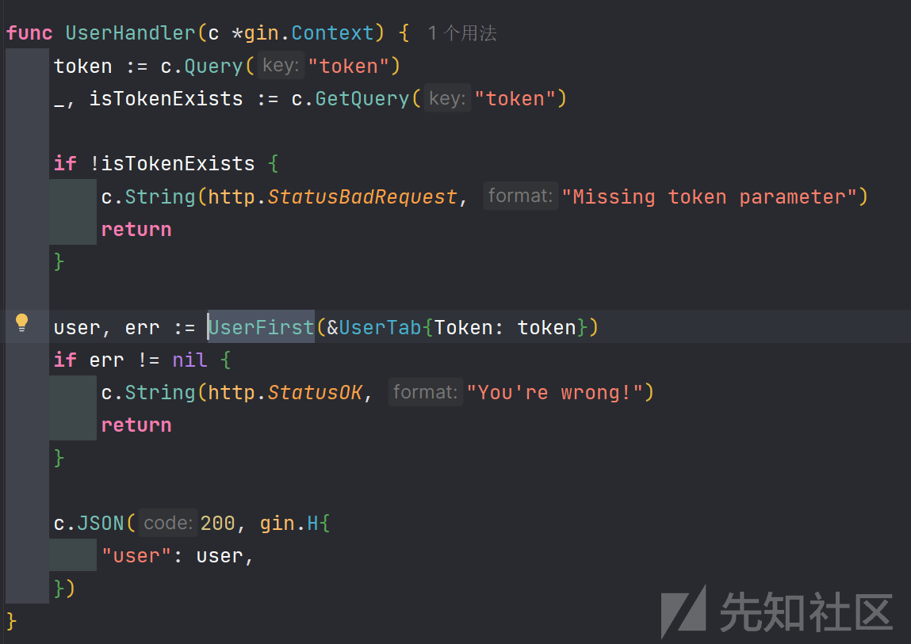
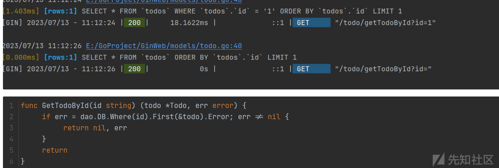
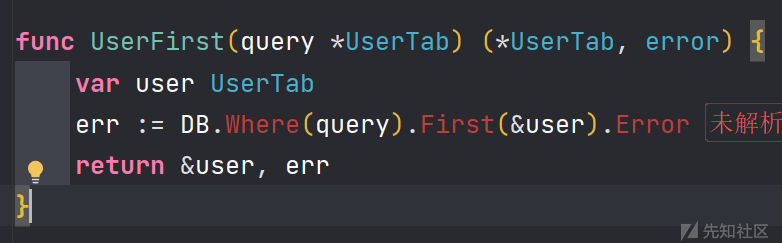
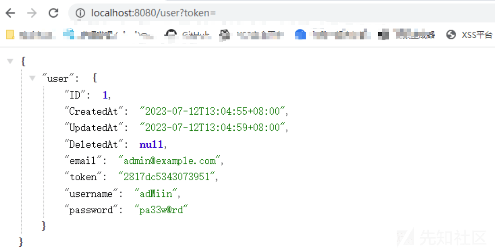
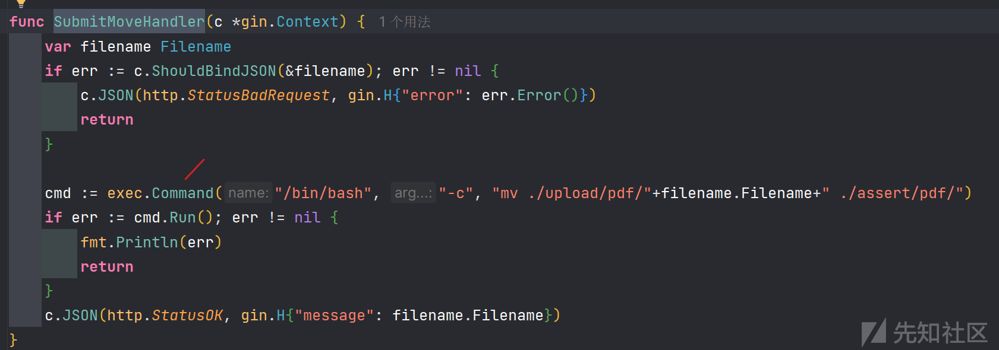
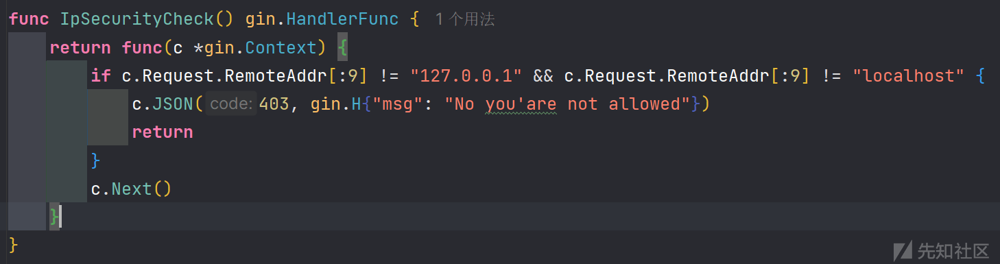
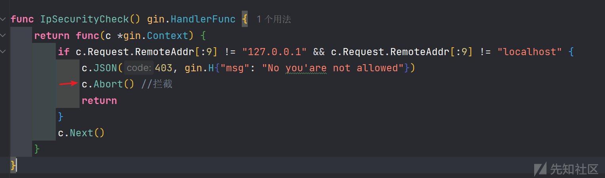
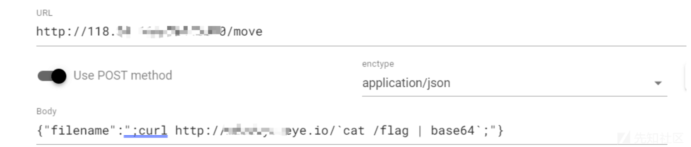
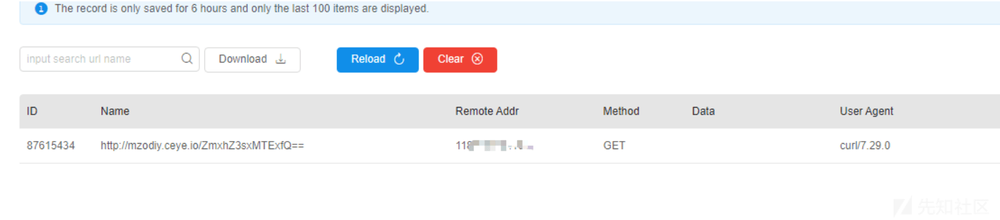

# 一道有趣的 go 语言 CTF - 先知社区

一道有趣的 go 语言 CTF

- - -

## 前言

这道题做起来并不是很难，但是因为 go 的话出的也不多，里面涉及的点也是比较有意思的，所以写一下。

## 路由分析

这个题目是 gin+gorm 写的一个 web 服务  
路由主要为以下几个

```plain
router.GET("/user", UserHandler)   获取用户信息
router.POST("/login", LoginHandler)  登录
router.POST("/upload", cookieCheckMiddleware(), UploadHandler)  上传文件（需要登录）
router.POST("/move", IpSecurityCheck(), SubmitMoveHandler)   移动文件（检测 ip）
router.POST("/download", cookieCheckMiddleware(), DownloadHandler)  下载文件
```

upload、move、download 是存在中间件进行校验的。  
做题的时候肯定是需要找重点去看的，这里因为代码量并不多，所以可以仔细看看。

### gorm 问题

首先看/user 这个路由  
具体代码如下

[](https://xzfile.aliyuncs.com/media/upload/picture/20240226192626-e0b6e2a4-d499-1.png)

p 牛曾经在星球里面说过这个问题，由于 Go 这门语言本身对于“零值”的设计，他是无法区分某个结构体中某个字段是否有被赋值过。如下代码，如果 id 参数不传值的话，这条 SQL 语句直接帮我们把 where 条件去掉了，这里实际上就产生了安全问题。  
[](https://xzfile.aliyuncs.com/media/upload/picture/20240226192941-5539b3e0-d49a-1.png)

就是这段代码，如果 token 不传值的话，实际上执行 sql 语句的时候 token 也是不会在 where 条件内的，  
[](https://xzfile.aliyuncs.com/media/upload/picture/20240226192521-ba83aa7c-d499-1.png)

所以直接查询就可以获得表的第一条数据了。  
[](https://xzfile.aliyuncs.com/media/upload/picture/20240226193306-cfb1c0b8-d49a-1.png)

### 中间件问题

接下来进入重点，也是解决题目的地方。  
在这个函数内是存在命令执行的功能点的，而且这里是采取拼接处理，不存在关键字过滤等防护。如果可以调用到这个函数的话就可以进行 RCE 了。  
[](https://xzfile.aliyuncs.com/media/upload/picture/20240226193646-52cd2dc0-d49b-1.png)  
而 move 路由的话就是调用的该函数进行处理，那么只需要访问 move 路由然后传入文件名即可。但是这个路由是存在一个中间件防护的。

[](https://xzfile.aliyuncs.com/media/upload/picture/20240226194457-77313890-d49c-1.png)

这个中间件会对 IP 进行检查，但是 ip 又不能伪造，那怎么办呢  
仔细看这段代码其实是存在逻辑问题的，gin 的中间件其实有点类似 java 的 filter，放行的话就需要写 c.Next()，拦截就是 c.Abort()，但是这里是没有 c.Abort() 的，所以就出问题了，然后这里有一个 return，但是代码还是继续往后执行了，因为没有被拦截。所以这个中间件其实是没有起到防护作用。

[](https://xzfile.aliyuncs.com/media/upload/picture/20240226194553-988275b8-d49c-1.png)  
这样才是正确写法。  
所以解题思路很明确了，直接传值即可，因为是无回显，这里借助 dnslog 平台进行解题

[](https://xzfile.aliyuncs.com/media/upload/picture/20240226194734-d4c6fabc-d49c-1.png)

[](https://xzfile.aliyuncs.com/media/upload/picture/20240226194742-d9d551a2-d49c-1.png)

[](https://xzfile.aliyuncs.com/media/upload/picture/20240226194750-de8e329a-d49c-1.png)

## 结语

在进行代码审计的时候，我们也需要重点关注一些代码逻辑产生的问题，这个问题有点像以前出现很多的 php 系统相关的重装漏洞，做了判断但是并没有 exit() 程序，导致代码逻辑还是在往下跑。
