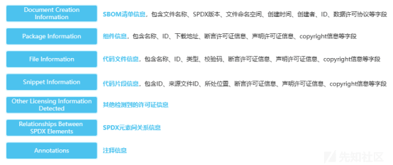
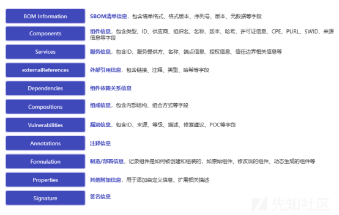
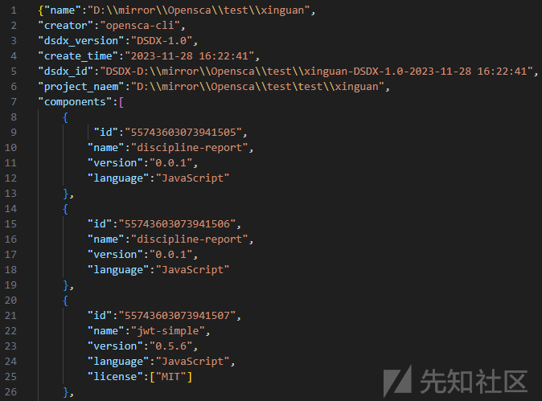
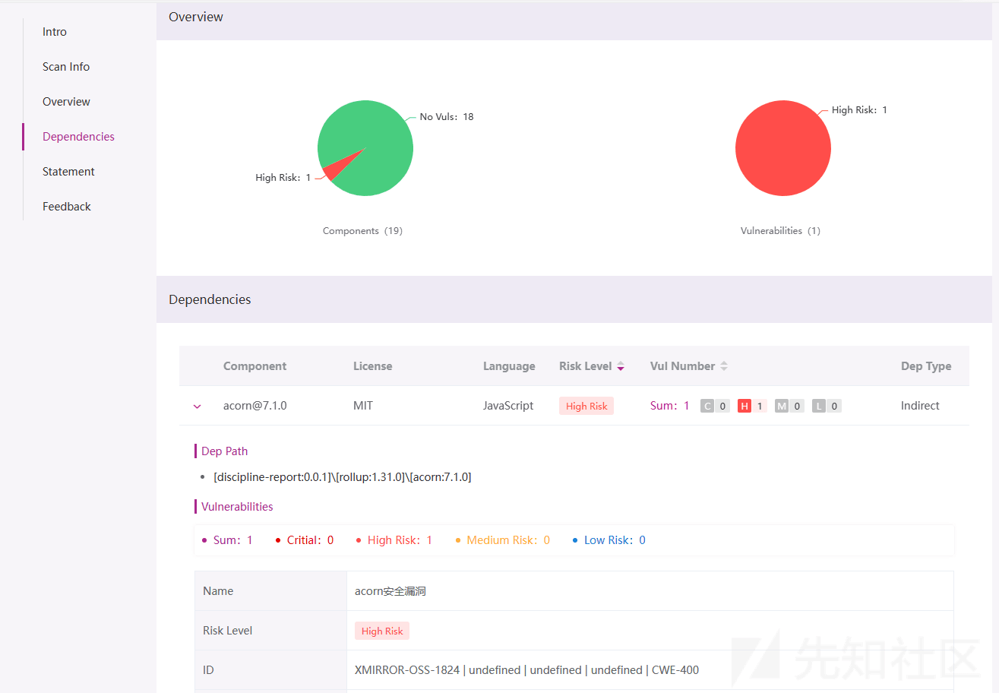

# 不同格式标准 SBOM 清单横评：SPDX、CDX 和 DSDX - 先知社区

不同格式标准 SBOM 清单横评：SPDX、CDX 和 DSDX

- - -

为了保证安全性、降低开发、采购及维护的相关成本，复杂动态的现代软件供应链对软件资产透明度提出了更高的要求。使用清晰的软件物料清单（SBOM）收集和共享信息，并在此基础上进行漏洞、许可证和授权管理等，可以揭示整个软件供应链中的弱点、提高软件供应链的透明度并增进供应链上下游间的相互信任、有效管控软件供应链攻击的威胁。

从定义上讲，SBOM 是包含软件应用中使用的所有组件、库和其他依赖项的列表。国际通用的 SBOM 标准格式包括 SPDX、CDX 和 SWID，前两者由于记录着更详细的依赖信息而得到了更广泛的使用。

DSDX（Digital Supply-chain Data Exchange）是由 OpenSCA 社区主导，开源中国、电信研究院、中兴通讯联合发起的中国首个数字供应链 SBOM 格式，更适配中国企业实战化应用实践场景，并且能兼容 SPDX、CDX、SWID 国际标准和国内标准。

更多 DSDX 相关信息请参考：[SCA 技术进阶系列（四）：DSDX SBOM 供应链安全应用实践](https://mp.weixin.qq.com/s?__biz=MzkwMjMxMDMyMQ==&mid=2247485840&idx=1&sn=f383c594a355e0cf04f6a12348e5df9a&chksm=c0a6394ef7d1b05847c5589845962a786fac4300061165312eead8596c5b520e8cdd9e7ddfa0&token=777777255&lang=zh_CN#rd "SCA技术进阶系列（四）：DSDX SBOM供应链安全应用实践")

下文将对 SPDX、CDX 及 DSDX 三种标准 SBOM 格式进行对比分析。

**01 SPDX**

**1.1 许可证**

cc-by-3.0

**1.2 格式简介**

SPDX（Software Package Data Exchange）是 Linux 基金会的一个开源项目，旨在作为收集和共享软件数据的通用格式，已于 2021 年 9 月被 ISO 列入 SBOM 国际标准（ISO/IEC 5962），也是目前唯一一个获此认可的 SBOM 标准格式。今年 5 月项目发布了 v3.0-rc1（候选版本，目前尚无完整的官方文档），目前最广泛使用的仍然是 2020 年发布的 v2.2 版本。

SPDX 标准格式 SBOM 清单中包含用于描述许可证信息的详细字段，并涵盖了代码文件及片段引用场景；自 v2.1 开始，安全性方面，也已支持与漏洞数据的关联。SPDX 支持的输出格式包括 SPDX、XML、JSON、RDF 和 YAML。

**1.3 字段说明**

SPDX（v2.2）格式标准 SBOM 包含以下部分：

**02 CDX**

**2.1 许可证**

apache-2.0

**2.2 格式简介**

CDX（CycloneDX）是 OWASP 发布的轻量级 SBOM 标准，专注于自动化整个软件构建周期中对 SBOM 的使用和管理。目前最新的版本是今年 6 月发布的 v1.5。

与 SPDX 相比，在记录授权和依赖关系的基础上，CDX 提供了更多与安全性相关的信息，相对更适用于安全审计、漏洞管理等场景。此外，CDX 还支持对硬件及云系统的描述，并有专门的部分记录服务信息及制造/部署信息，有更强的扩展性。不过相应地，它的完整字段设计及嵌套关系也会更加复杂。CDX 支持的输出格式有 XML 和 JSON。

**2.3 字段说明**

CDX（v1.5）格式标准 SBOM 包含以下部分：

**03 DSDX**

**3.1 格式简介**

目前，我国尚无 SBOM 标准格式相关国标；基于广大社区用户的实践反馈及对国际标准格式的研究，今年 8 月推出的 DSDX 着重考虑了运行环境及供应链流转信息的引入，以最小集/扩展集的形式增强了 SBOM 应用的灵活性，并考虑了国内企业出海合规相关需求的场景。DSDX 支持的输出格式包括 DSDX、JSON 和 XML。

DSDX 是社区实践的产物，正处于蓬勃发展的阶段，欢迎向项目组提出反馈及建议，与我们共同建设国内首个标准 SBOM 格式。

**3.2 字段说明**

DSDX（v1.0）格式标准 SBOM 包含以下部分：

**04 总结**

简言之，唯一被写入 ISO 国际标准的 SPDX 在标准化的基础上相对更关注对许可证信息的描述，能记录更多安全及服务相关信息的 CDX 有更强的扩展性，而基于国内实践发布的 DSDX 则引入了运行环境及供应链流转信息并对描述对象做了最小集/扩展集的拆分。

**使用 OpenSCA 按需输出标准格式 SBOM**

OpenSCA 支持输出 SPDX/CDX/DSDX 及 SWID 标准格式 SBOM 文件，一站式解决各种需求；从 v3.0.0 开始，还新增了通过 SBOM 清单输出依赖、漏洞及许可证信息的能力。

**| 使用样例**

① 输出 SBOM 清单

opensca-cli -path ${project\_path} -out output.dsdx  

② 使用 SBOM 清单输出漏洞及许可证清单

opensca-cli -token ${token} -path ${sbomname.suffix} -out output.html  
\*此处 suffix 可以是

dsdx/dsdx.json/dsdx.xml/cdx.json/cdx.xml等

（准确起见，输入的 SBOM 需包含 Purl 信息，故而更推荐使用 CDX 及 DSDX）

