# 云时空 ERP 系统任意文件上传漏洞分析 - 先知社区

云时空 ERP 系统任意文件上传漏洞分析

- - -

# 路由分析

核心路由在 WEB-INF/web.xml 配置文件中，部分内容如下图  
[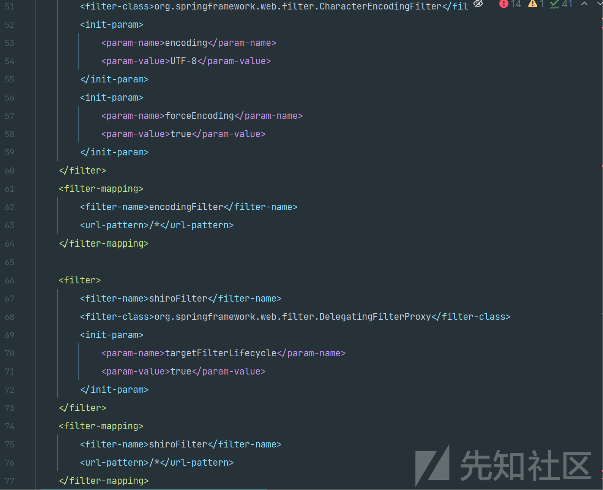](https://xzfile.aliyuncs.com/media/upload/picture/20240220182719-a0277cda-cfda-1.png)  
[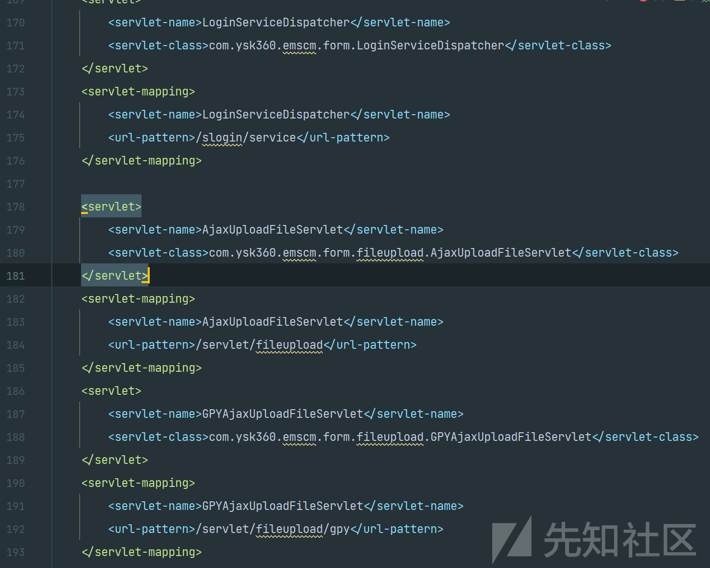](https://xzfile.aliyuncs.com/media/upload/picture/20240220182732-a7e0b6a8-cfda-1.png)

定义了 Servlet 组件，和过滤器。从 web.xml 配置来看，我们可以知道这个应用使用了 Spring 框架进行 Web 开发，配置了多个 Servlet 用于不同的功能，如表单处理、文件上传下载等，同时整合了 Apache Shiro 进行安全控制，另外还配置了字符编码和跨域资源共享的处理。

其中并没有 Servlet 的专门鉴权机制，只有一个 Shiro 相关的过滤器配置。

```plain
<filter>
    <filter-name>shiroFilter</filter-name>
    <filter-class>org.springframework.web.filter.DelegatingFilterProxy</filter-class>
    <init-param>
        <param-name>targetFilterLifecycle</param-name>
        <param-value>true</param-value>
    </init-param>
</filter>
<filter-mapping>
    <filter-name>shiroFilter</filter-name>
    <url-pattern>/*</url-pattern>
</filter-mapping>
```

从上面的配置可以看出，`shiroFilter`过滤器应用于所有 URL（通过`url-pattern`配置为`/*`），这意味着所有进入应用的请求都将通过 Shiro 过滤器。因此所有 Servlet 也会经过。

通过分析我们可以知道`org.springframework.web.filter.DelegatingFilterProxy`是 Spring 框架提供的一个类，它允许过滤器代理到一个 Spring 上下文中定义的 bean。也就是当请求到达并且需要通过特定的过滤器处理时，`DelegatingFilterProxy`会在 Spring 的上下文中查找相应名称的 bean，并将请求处理工作委托给这个 bean。

在这里`DelegatingFilterProxy`被命名为`shiroFilter`。当请求到达并且经过这个代理过滤器时，它会在 Spring 的上下文中查找一个也叫`shiroFilter`的 bean，然后将过滤任务委托给这个 bean 来处理。  
[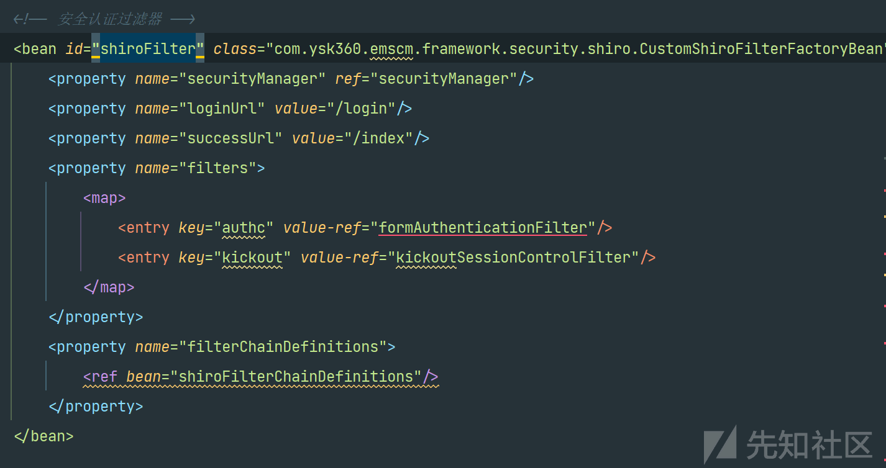](https://xzfile.aliyuncs.com/media/upload/picture/20240220182747-b122939e-cfda-1.png)  
shiroFilter 的配置如上，定义了一个 Spring bean，其 ID 为`shiroFilter`，并且其类型为`CustomShiroFilterFactoryBean`，这是一个自定义的过滤器工厂 Bean（查看代码发现是自定义的拦截并处理包含潜在风险字符的请求的过滤器）。还配置了`shiroFilter`的属性`securityManager`，它引用了另一个名为`securityManager`的 Spring bean。在 Shiro 中，`SecurityManager`是安全操作的核心，负责所有与安全相关的操作，包括认证、授权等。

同时我们可以发现在 spring-context-shiro 的 XML 配置定义了一个叫做`shiroFilterChainDefinitions`的 Spring bean，它是一个`String`类型的 bean，用于定义 Apache Shiro 框架用于 URL 模式匹配的权限和访问控制规则。  
[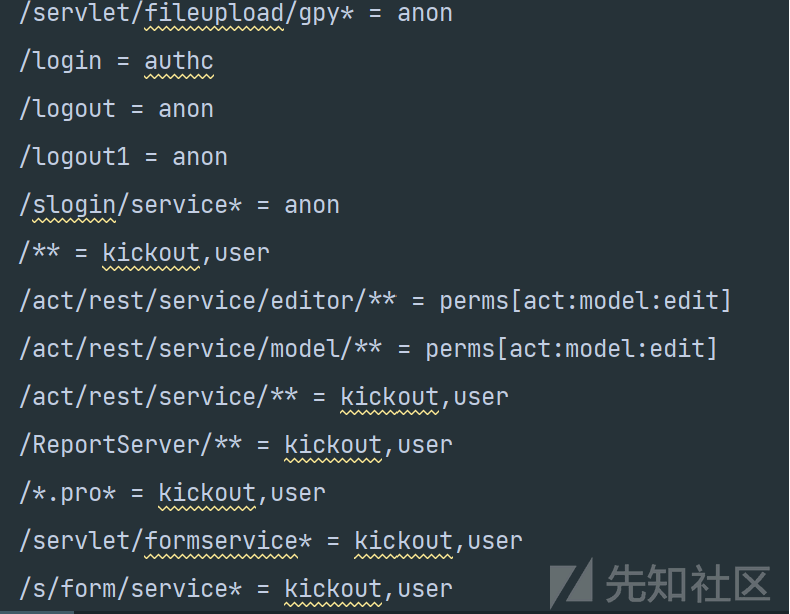](https://xzfile.aliyuncs.com/media/upload/picture/20240220182802-ba14f032-cfda-1.png)

其中`/servlet/fileupload/gpy* = anon`，表示这个特定的路径不需要认证。

# 漏洞分析

通过 web.xml 配置文件定位到相应代码。  
[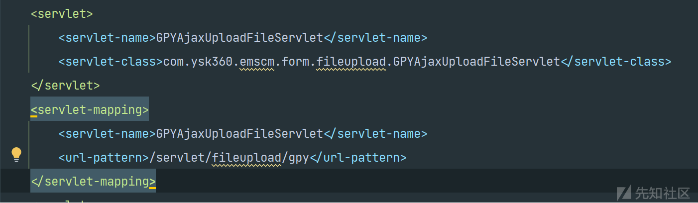](https://xzfile.aliyuncs.com/media/upload/picture/20240220183203-49ac99de-cfdb-1.png)  
分析代码，可以发现首先定义了一系列常量。这里`private static final String uploadFolderName = "/pics/"`应该和后续的存储路径相关。`extensionPermit`定义了允许上传的文件扩展名，但通过后续的分析发现并没有使用。  
[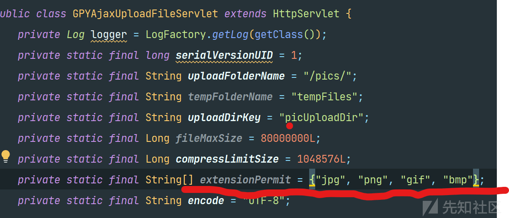](https://xzfile.aliyuncs.com/media/upload/picture/20240220183220-53908a1e-cfdb-1.png)  
通过分析代码我们可以知道是使用了`HttpServletRequest`对象来读取请求数据，并处理 multipart/form-data 格式的数据来提取文件和字段。  
[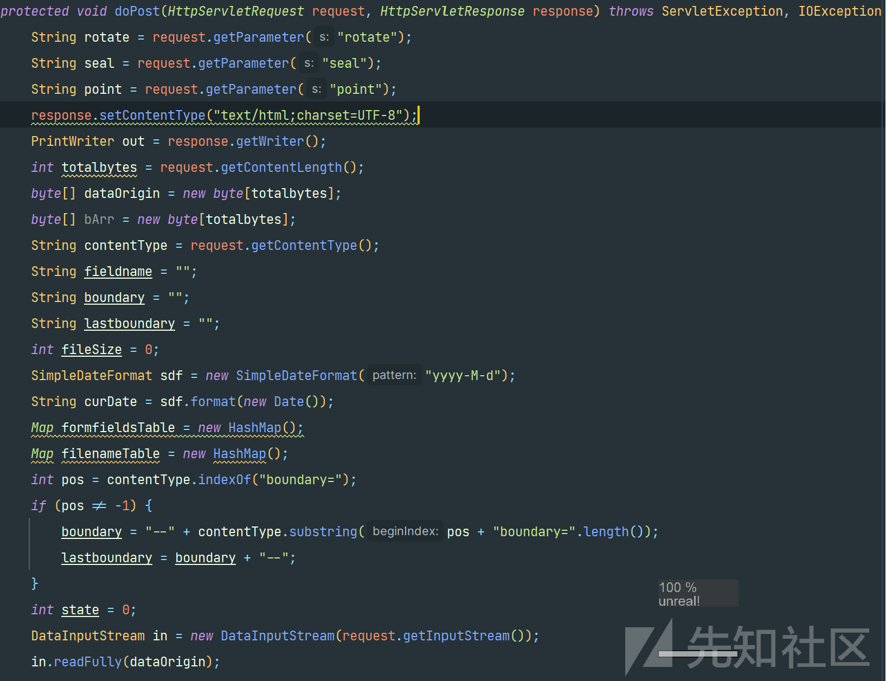](https://xzfile.aliyuncs.com/media/upload/picture/20240220183235-5c67d3cc-cfdb-1.png)  
其中`DataInputStream in = new DataInputStream(request.getInputStream());`直接从`request`的输入流中读取数据，后续就是对输入流中读取的数据的提取操作。  
[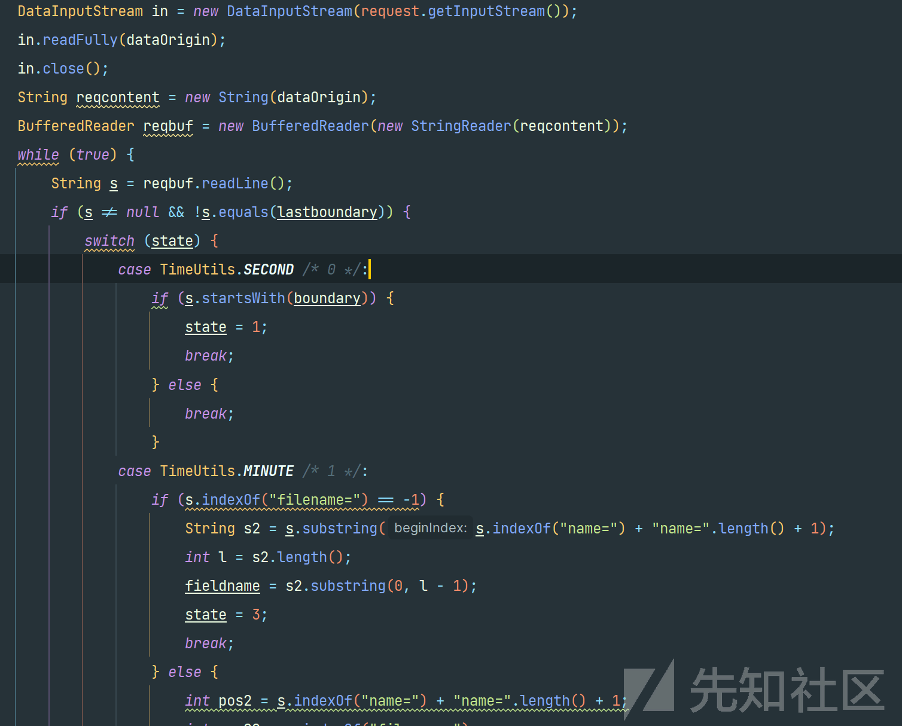](https://xzfile.aliyuncs.com/media/upload/picture/20240220183248-6465050e-cfdb-1.png)  
其中`if (s.indexOf("filename=") == -1) { ... } else { ... }`这个条件判断，用于检查当前读取的行`String s`中是否包含了字符串"filename="。只有包含时，才认为当前行描述的是一个文件上传字段不然就是表单字段。  
[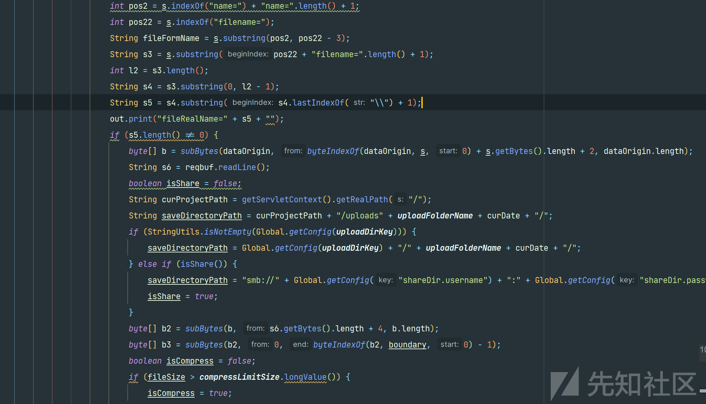](https://xzfile.aliyuncs.com/media/upload/picture/20240220183309-70ffa026-cfdb-1.png)  
这里`int pos22 = s.indexOf("filename=");`找到"文件名="字符串的位置，然后`String fileFormName = s.substring(pos2, pos22 - 3);`截取从字段名开始到"filename="出现之前的字符串，得到表单中文件字段的名称。`String s3 = s.substring(pos22 + "filename=".length() + 1);`截取"filename="之后的字符串，即完整的文件路径和名称。可以发现没有对文件名和后缀的过滤。

并且通过`out.print("fileRealName=" + s5 + "");`将实际的文件名直接写入响应中。

后续就是读取文件数据并决定如何储存的操作，

`byte[] b = subBytes(dataOrigin, byteIndexOf(dataOrigin, s, 0) + s.getBytes().length + 2, dataOrigin.length);`

从原始的字节数组`dataOrigin`（包含了整个 HTTP 请求体的数据）中提取出当前文件的数据。

`String saveDirectoryPath = curProjectPath + "/uploads" + uploadFolderName + curDate + "/";`构造一个用于存上传文件的目录路径，包括上传的目录、一个文件夹名称和当前日期。其中`curProjectPath` 为当前 web 应用根目录。`uploadFolderName`为先前定义的常量/pics/

注意此时定义了`boolean isShare = false;`，在后续中会进行判断文件是否需要保存到本地服务器还是一个网络共享位置（使用 SMB 协议）。默认为 false 保存在本地。  
[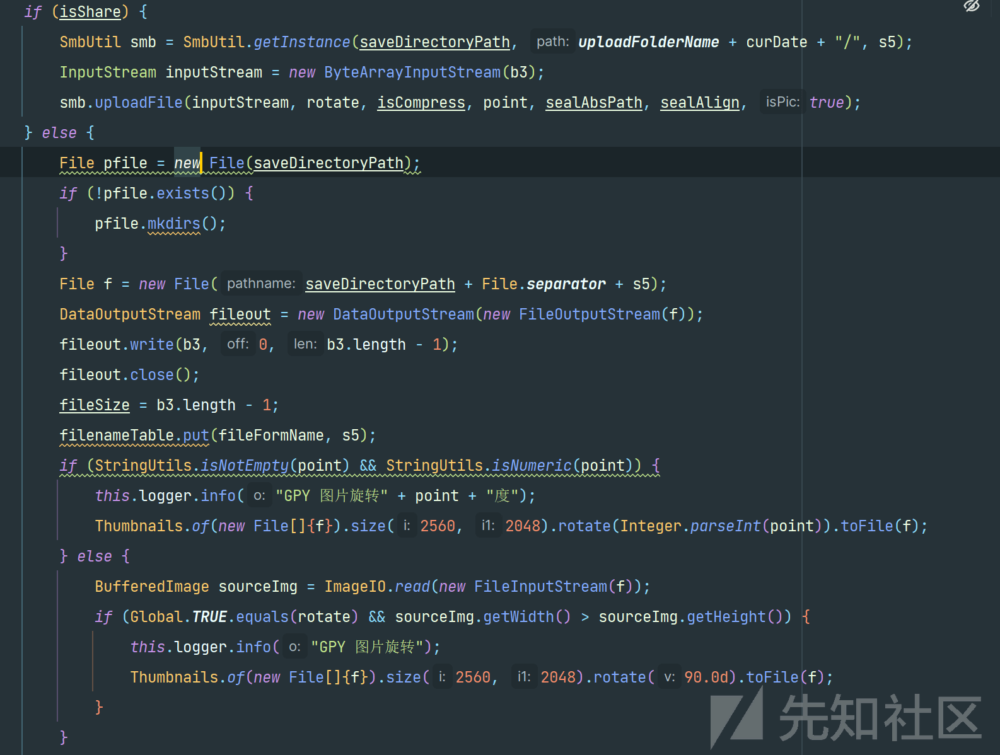](https://xzfile.aliyuncs.com/media/upload/picture/20240220183347-8791bd74-cfdb-1.png)  
在本地保存操作中`File f = new File(saveDirectoryPath + File.separator + s5);`直接将上传的文件名拼接进入，`DataOutputStream fileout = new DataOutputStream(new FileOutputStream(f));`然后打开一个到文件`f`的数据输出流。`fileout.write(b3, 0, b3.length - 1);`将上传内容写入文件。至此我们的上传文件流程大致结束，根据以上的分析文件上传路径为当前 web 应用根目录+/uploads+/pics/+服务器日期 + 上传文件名。同时在最后流程中 out.print("date=" + curDate);直接将服务器日期写入响应中。  
[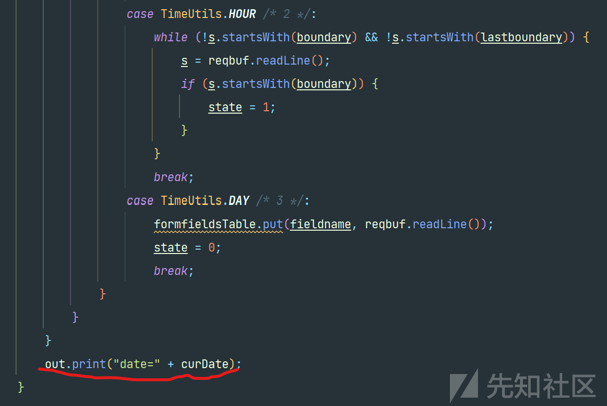](https://xzfile.aliyuncs.com/media/upload/picture/20240220183402-90bfb400-cfdb-1.png)

# 漏洞复现

[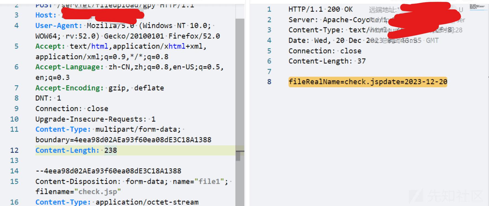](https://xzfile.aliyuncs.com/media/upload/picture/20240220183422-9cb6bb6e-cfdb-1.png)  
直接将文件上传，再通过返回的日期，即可得到文件上传的路径
