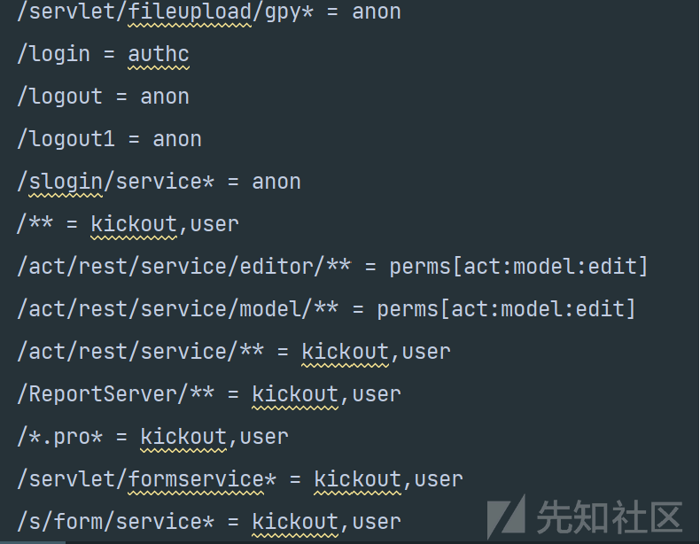
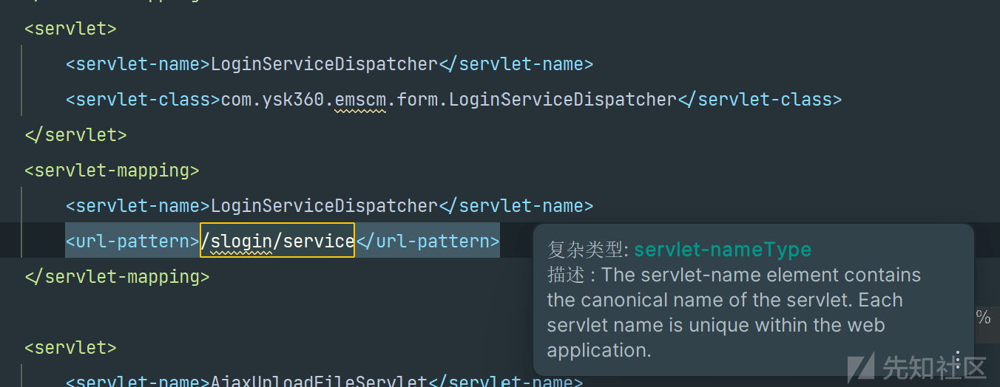
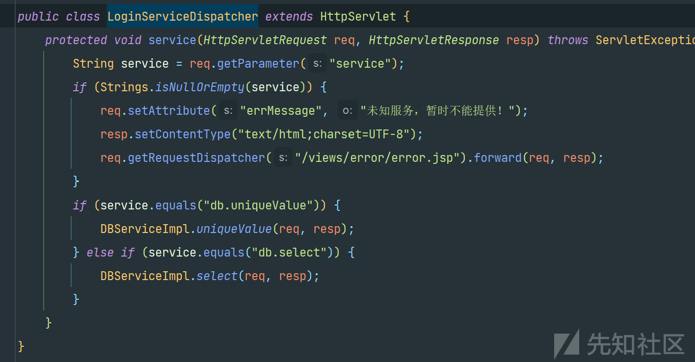
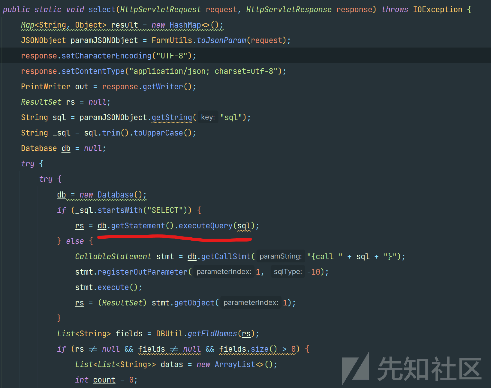
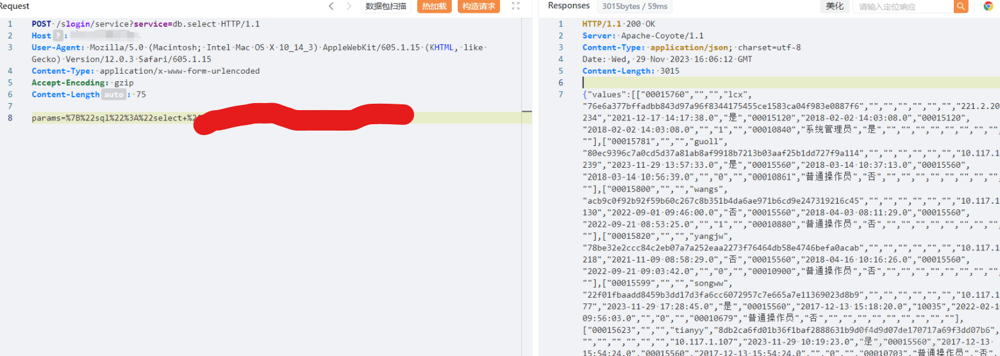
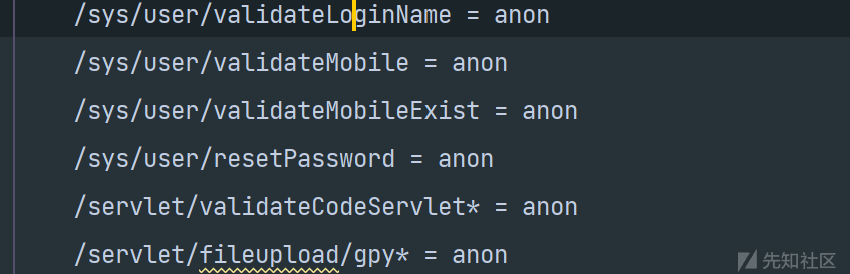
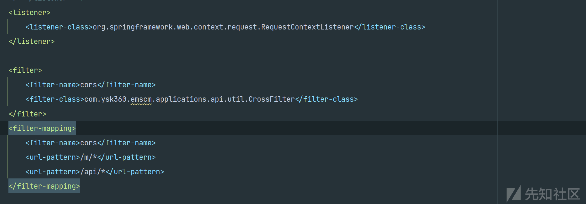
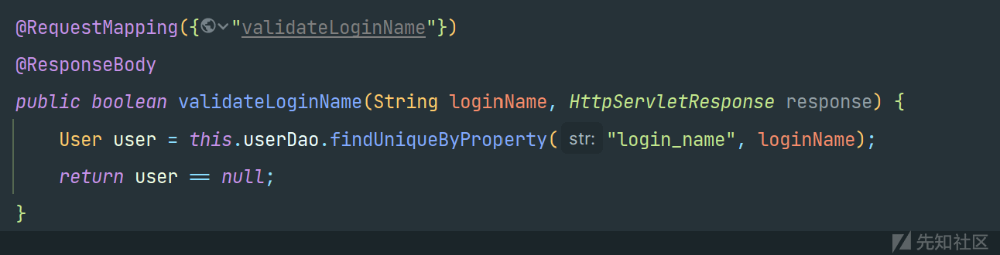
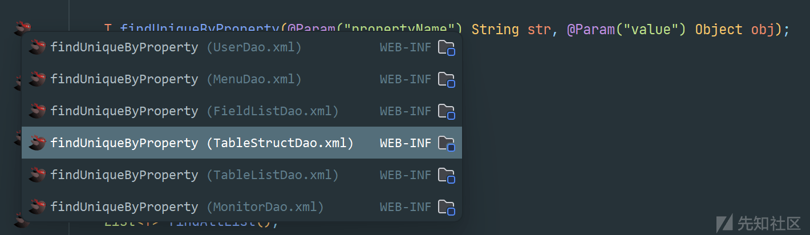

# 云时空 ERP 系统多个 SQL 注入漏洞分析 - 先知社区

云时空 ERP 系统多个 SQL 注入漏洞分析

- - -

# service SQL 注入漏洞

## 未授权接口寻找

[在前面的文章](https://xz.aliyun.com/t/13750 "在前面的文章")中我们可以知道，系统的鉴权依赖于 shiro，在 spring-context-shiro 的 XML 配置定义了一个叫做`shiroFilterChainDefinitions`的 Spring bean，它是一个`String`类型的 bean，用于定义 Apache Shiro 框架用于 URL 模式匹配的权限和访问控制规则。

在配置文件中，是通过定义一个类型为`java.lang.String`的 bean 来声明这些规则。每个规则是由一行组成的，格式是“pattern = filterName”，其中 pattern 是一个 Ant 风格的路径模式，而 filterName 是过滤器的名称，决定了访问该模式的路径时所执行的安全检查。  
[](https://xzfile.aliyuncs.com/media/upload/picture/20240221183343-afba1d90-d0a4-1.png)

其中`anon`（匿名）表示这个路径下的资源不需要认证或授权，任何人都可以访问。于是我们就可以发现系统中的未授权接口，再结合`web.xml`文件中，通过配置的 servlet，可以快速定位到未授权接口的相应代码。

## 漏洞分析

通过分析我们可以发现`/slogin/service* = anon`接口是配置的匿名访问，在 web.xml 配置文件中寻找`/slogin/service*`路由。  
[](https://xzfile.aliyuncs.com/media/upload/picture/20240221183357-b7edbc74-d0a4-1.png)

可以发现配置的 servlet 及其映射关系，查看相应代码。  
[](https://xzfile.aliyuncs.com/media/upload/picture/20240221183411-c041a64c-d0a4-1.png)

内容不多，通过分析我们可以知道`LoginServiceDispatcher`类继承自`HttpServlet`，进行处理 HTTP 请求。并且重写了 HttpServlet 的`service`方法，它是处理请求的核心方法。如何从 HTTP 请求头中获取名为"service"的参数，首先会检查请求参数中是否存在名为`service`的参数，并且这个参数不应该为空。如何根据参数值调用 DBServiceImpl 的不同方法处理请求。

当`service`参数等于"`db.select`"，调用 DBServiceImpl 的 select 方法处理请求，查看代码分析。  
[](https://xzfile.aliyuncs.com/media/upload/picture/20240221183424-c7cb7c6c-d0a4-1.png)

方法会先将 HTTP 请求参数转换为 JSON 对象，`JSONObject paramJSONObject = FormUtils.toJsonParam(request);`再从 JSON 对象中获取键为"sql"的值 `String sql = paramJSONObject.getString("sql");`进行判断如果 SQL 语句是一个 SELECT 查询，直接执行 SQL 查询，获取结果集 `rs = db.getStatement().executeQuery(sql);`。

未对 sql 语句进行任何判断和过滤，直接使用来自请求的 SQL 语句来执行查询，造成了 SQL 注入。

## 漏洞分析

至此我们可以构造 poc，params={"sql":"select 语句"}，查询任意数据。  
[](https://xzfile.aliyuncs.com/media/upload/picture/20240221183438-d055e476-d0a4-1.png)

# validateLoginName SQL 注入漏洞

## 未授权接口寻找

通过前面的方法，我们可以找到/sys/user/validateLoginName 接口也是配置的匿名访问。  
[](https://xzfile.aliyuncs.com/media/upload/picture/20240221183453-d9234878-d0a4-1.png)

同时从 web.xml 配置来看，我们可以知道这个应用使用了 Spring 框架进行 Web 开发，配置了多个 Servlet 用于不同的功能。  
[](https://xzfile.aliyuncs.com/media/upload/picture/20240221183507-e1cf5bc4-d0a4-1.png)

## 漏洞分析

通过全局搜索我们可以知道其中`/sys/user/validateLoginName`接口，属于 Spring MVC 中定义的控制器（Controller）。  
[](https://xzfile.aliyuncs.com/media/upload/picture/20240221183525-ec497076-d0a4-1.png)

这里`@RequestMapping`注解将 HTTP 请求映射到 MVC 和 REST 控制器的处理方法上。任何直接调用了一个名为 userDao 的对象的 findUniqueByProperty 方法，在系统中使用了 MyBatis 框架。

[](https://xzfile.aliyuncs.com/media/upload/picture/20240221183857-6ac10cd4-d0a5-1.png)

`T findUniqueByProperty(@Param("propertyName") String str, @Param("value") Object obj);`是 MyBatis Mapper 接口中的一个方法声明，当我们搜索 SQL 映射文件时，有多个文件。但我们这里调用的是 userDao 的对象，查看 userDao.xml。

```plain
<select id="findUniqueByProperty" resultType="User"
            statementType="STATEMENT">
        select *
        from sys_user
        where ${propertyName} = '${value}'
          AND del_flag = '0'
    </select>
```

可以发现 SQL 查询语句，是用于从数据库表 sys\_user 中进行检索数据。`'${value}'` 是参数占位符，用于动态替换与属性名对应的值。在 MyBatis 框架中#{value}是进行预编译参数的替换，这样可以避免 SQL 注入。而这里使用`'${value}'` ，相当于直接将参数拼接进入 sql 语句，导致了 SQL 注入漏洞。

在`/sys/user/validateLoginName`接口中返回类型是 boolean，得不到回显所以这里我们不能直接进行查询得到数据，只能进行时间或布尔盲注。
