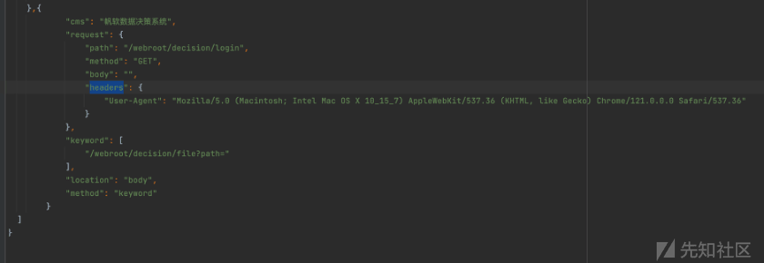
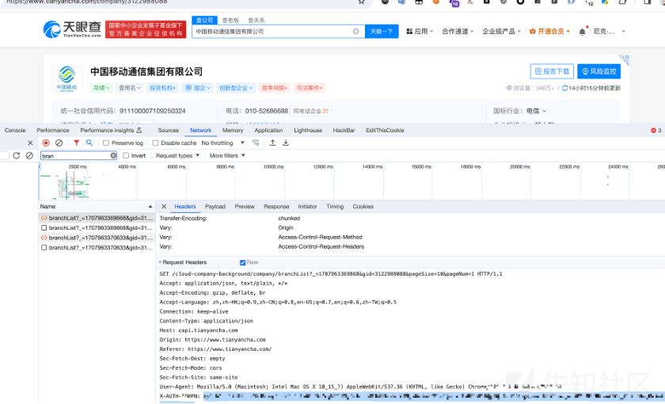

# 仅需一个公司名即可进行自动化信息收集食用指南-Tailorfinder - 先知社区

仅需一个公司名即可进行自动化信息收集食用指南-Tailorfinder

- - -

Tailorfinder

# 起因

世面上好用的子域名，公司详情，端口扫描，指纹识别工具和 api 接口都不少，因此做信息收集时往往不能一步到位，比如，对收集的结果要去重，子域名收集完成后还得再去存货探测，泛解析处理，端口扫描指纹识别，不能接着往下走，同时不想重复造轮子，但是想一步都到位，所以有了开发这个工具的想法，将上面工具 api 接口做个整合，让整个界面更加好看

# 介绍

一款方便懒人对企业资产自动化收集工具，因为避免重复造轮子，所以收集过程中用到了一些已经有的工具故取名裁缝-Tailorfinder  
收集的结果有子域名，c 段，控股子公司，子公司及主公司主域名，邮箱，app 资产，web 资产指纹识别，masscan+nmap 扫描结果  
nmap，masscan，xsltproc 请大家自行安装，只支持 linux，mac 版本，windows 不支持了 Masscan 版本 1.3.2  
检查一下终端命令行是否可以执行 nmap,masscan,xlstproc 命令

流程如下

结合以下信息收集工具  
[https://github.com/projectdiscovery/subfinder](https://github.com/projectdiscovery/subfinder)  
[https://github.com/tomnomnom/assetfinder](https://github.com/tomnomnom/assetfinder)  
[https://github.com/projectdiscovery/shuffledns](https://github.com/projectdiscovery/shuffledns)  
[https://github.com/blechschmidt/massdns](https://github.com/blechschmidt/massdns)

**子域名收集 api 接口**  
fofa  
hunter  
securitytrails  
rapiddns.io  
crt.sh  
ip138

**邮箱查询网址**  
veryvp  
hunter.io  
www.email-format.com

**指纹识别**  
参考该项目指纹识别库 2W+：  
[https://github.com/lemonlove7/EHole\_magic](https://github.com/lemonlove7/EHole_magic)  
新增二级目录指纹识别，在 finger/finger.json，可自行添加

**使用前准备**  
shuffledns 需要结合 massdns 使用请参考其 github 进行配置，二进制运行文件在 bin 目录下  
配置 config.py 里的 cookie  
准备 fofo，hunter，SecurityTrails, hunteremailkey，爱奇查，天眼查 的 key 或者 cookie  
注意爱奇查有时会报错，有人机识别，自己浏览器重新访问一下过一下人机识别就好，建议本机搜集相关公司信息，服务器搜集子域名 web，c 段信息  
天眼查记得配置 X-AUTH-Token 搜索 branchlist 接口配置，有些接口需要 token

**配置完成后**  
pip3 install -r requirements.txt  
python3 main.py -h

**使用方法及参数**  
搜集公司相关信息  
python3.8 main.py -name 公司名称 -p 控股子公司的百分比 -fc 搜集分支机构数量上限 -o 输出保存路径

公司根域名结果  

公司股份结果

旗下 app

邮箱

搜集子域名  
建议搜集子域名放服务器上跑，因为内置子域名字典达到 180w+，速度比较慢  
python3.8 main.py -name 王尼玛有限公司 -o ./test -d ./test/domain

结果会把各个工具接口搜集的结果汇集到各个表格中，其中 alldomain 汇总了所有的子域名，alive\_domain 汇总了所有的存活子域名，all\_ip,fofa\_ip,hunter\_ip 汇总了 c 段的 ip 次数。

端口 web 指纹搜集  
公司名称要和上面搜集子域名的保存得到 xlsx 表格名一致，例如：搜集子域名后保存为王尼玛有限公司.xlsx，则公司名称为王尼玛有限公司  
python3.8 main.py -name 公司名称 -o 输出保存路径 -ps true  
也可以自定义表格，只需要满足格式即可，从 alive\_domain 表里取域名

python3.8 main.py -name 公司名称 -o 输出保存路径 -ps true -pf 表格名称 (/test/王尼玛有限公司.xlsx，记得带绝对路径)

搜集完后，会将端口搜集结果保存为 Portdetail.csv,web 指纹收集结果保存名字为输入的公司名+\_web.html  
详情如下

指纹识别信息，如果没有找到 ip 对应的域名，则域名为 ip

当然也可以一把命令梭哈  
python3.8 main.py -name 公司名称 -p 控股子公司的百分比 -fc 搜集分支机构数量上限 -o 输出保存路径 -c true -ps true

定时任务  
\-t 参数设置每次收集的间隔时间，单位（天），并发送邮箱（config.py 配置好你的邮箱）

工具链接  
[https://github.com/penson233/TailorFinder](https://github.com/penson233/TailorFinder)
