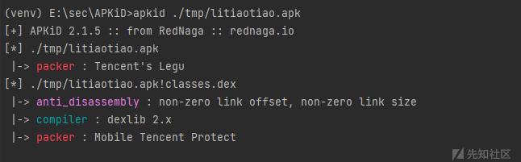
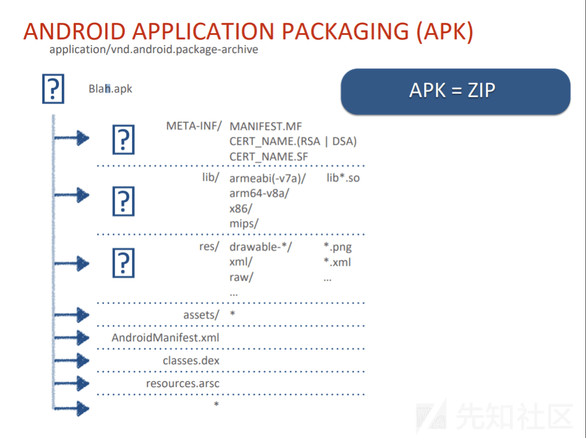
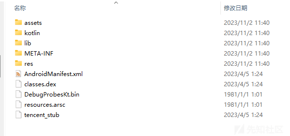
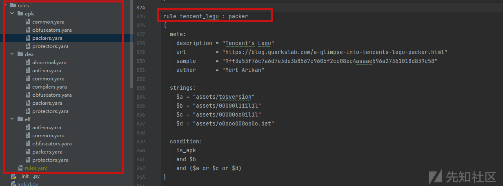
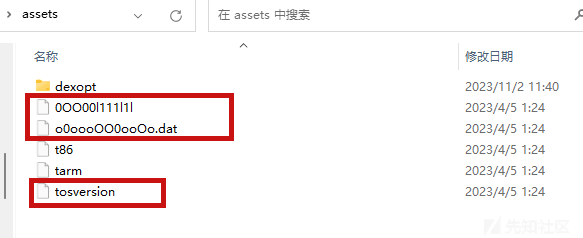
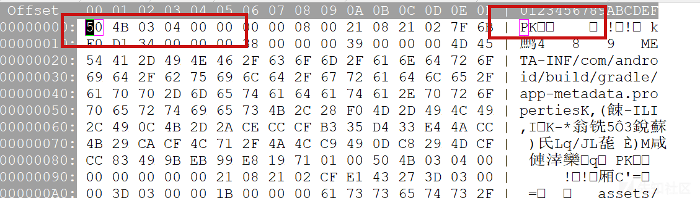
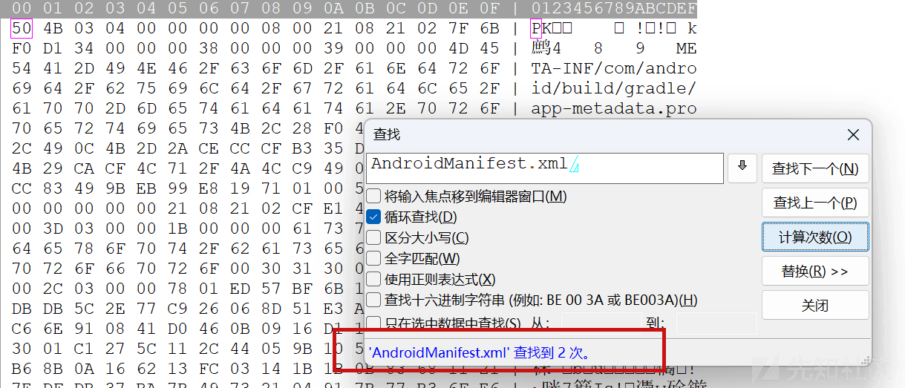
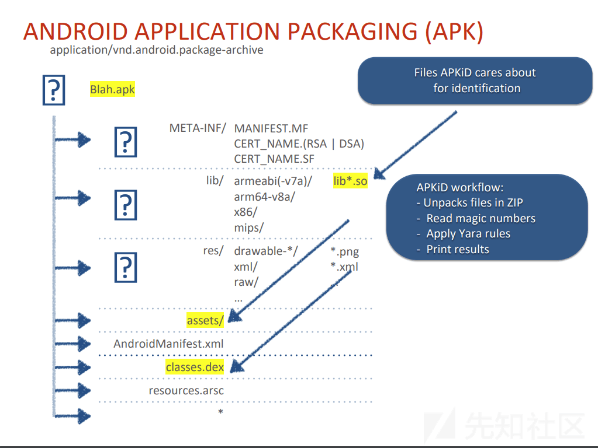

# 从 APKiD 看 APK 壳检测 - 先知社区

从 APKiD 看 APK 壳检测

- - -

之前朋友检测 APK 壳是用的 APKiD - [https://github.com/rednaga/APKiD](https://github.com/rednaga/APKiD) ，看了一下项目简介发现参加过两次 BlackHat orz

[](https://xzfile.aliyuncs.com/media/upload/picture/20231102180859-d7611874-7967-1.png)

[](https://xzfile.aliyuncs.com/media/upload/picture/20231102180904-da730ce8-7967-1.png)

一个是工具介绍，一个是快速识别 RASP SDK，不过感觉中文网络上对于这个工具还停留在使用阶段，简单看一下代码实现，本篇文章使用的是 APKiD 2.1.5

## 简介

> APKiD gives you information about how an APK was made. It identifies many compilers, packers, obfuscators, and other weird stuff. It's PEiD for Android.

APKiD 是一个获取 APK 信息（编译器、壳、混淆...）的工具，项目地址 [https://github.com/rednaga/APKiD](https://github.com/rednaga/APKiD)  
PS：这里提到的 PEiD 是一个查壳工具，所以 APKiD 即 APK 查壳的工具

## 环境搭建

> pip install apkid

这种方式的安装可以直接通过 apkid 命令来对目标进行探测

[](https://xzfile.aliyuncs.com/media/upload/picture/20231102180915-e10bf2d6-7967-1.png)

可以看到这里使用了腾讯的加壳保护

为了方便断点调试和看数据，我这里以本地源代码的方式进行运行

> git clone [https://github.com/rednaga/APKiD](https://github.com/rednaga/APKiD)  
> cd APKiD  
> ./prep-release.py

运行 ./prep-release.py 之后会在本地生成 rules.yarc 规则文件  
编写一个 python 加载代码调用 APKiD

```plain
from apkid.apkid import Options, Scanner

def loader_apkid(apk_path):
    options = Options(json=True)
    rules = options.rules_manager.load()

    scanner = Scanner(rules, options)
    scanner.scan(apk_path)


if __name__ == '__main__':
    loader_apkid("./tmp/litiaotiao.apk")
```

指定 APK，运行该脚本就可以得到结果了

## 一些前置知识

### APK 文件结构

APK 其实就是一个 ZIP 文件，APK 文件的基本结构如下

```plain
├── META-INF/
│   ├── MANIFEST.MF 包含了存储在 APK 中的数字签名信息和其他与应用程序完整性验证相关的文件
│   └── CERT.SF 
│   └── CERT.（RSA | DSA） 
├── res/ 存放应用程序的资源文件
├── assets/ 存放应用程序需要在运行时读取的原始资源文件
├── lib/ 一些库文件，*.so，也可能会按照不同 CPU 架构（如 armeabi-v7a、x86、arm64-v8a 等）存放
├── AndroidManifest.xml APK 的清单文件
├── classes.dex 可执行的 DEX 字节码文件，其中包含应用程序的 Java 类和方法
├── resources.arsc Android 资源表文件，包含了应用程序使用的所有资源的编译后的二进制表示
└── other files...
```

APKID 作者们在 blackhat 2018 上的 PPT

[](https://xzfile.aliyuncs.com/media/upload/picture/20231102180933-eb6e9c60-7967-1.png)

我们解压一个 APK 也可以看到相关文件

[](https://xzfile.aliyuncs.com/media/upload/picture/20231102180943-f1bab8a6-7967-1.png)

### Yara 文件

#### Yara 简介

Yara 是一个旨在（但不限于）帮助恶意软件研究人员识别和分类恶意软件样本的开源工具

> 除了分析恶意软件样本之外，其实对于某些特征值的识别也可以用 Yara 来做，比如这里的 APKiD 就用到了 Yara，你说这个是恶意文件吗，其实不然，里面更多的是特征值

Yara 项目地址 [https://github.com/VirusTotal/yara](https://github.com/VirusTotal/yara) （是不是觉得 VirusTotal 似曾相识，没错就是[https://www.virustotal.com/](https://www.virustotal.com/) 团队）  
Yara 的每一条描述、规则都由一系列字符串和一个布尔型表达式构成，并阐述其逻辑。

#### Yara 规则 demo

打开 apkid 的 rules 文件夹，里面的都是 yara 规则

[](https://xzfile.aliyuncs.com/media/upload/picture/20231102180953-f7af294a-7967-1.png)

我们查看这一条规则，这里的描述是腾讯乐固的壳，不过感觉特征跟腾讯御安全相似

```plain
rule tencent_legu : packer
{
  meta:
    description = "Tencent's Legu"
    url         = "https://blog.quarkslab.com/a-glimpse-into-tencents-legu-packer.html"
    sample      = "9ff3a53f76c7a6d7e3de3b8567c9606f2cc08ec4aaaae596a27361018d839c58"
    author      = "Mert Arıkan"

  strings:
    $a = "assets/tosversion"
    $b = "assets/0OO00l111l1l"
    $c = "assets/0OO00oo01l1l"
    $d = "assets/o0oooOO0ooOo.dat"

  condition:
    is_apk
    and $b
    and ($a or $c or $d)
}
```

rule 分为三部分

-   meta 元数据，提供描述信息
-   strings 字符串部分，列举了需要匹配的特定字符串
-   condition 指定了规则的匹配条件

可以看到这里的规则就是需要满足是 APK、存在 assets/0OO00l111l1l，以及 a,c,d 对应字符串中的一个  
打开我们通过腾讯加壳的 APK 软件，可以看到对应的特征值确实存在

[](https://xzfile.aliyuncs.com/media/upload/picture/20231102181003-fd525e58-7967-1.png)

而 is\_apk 这个判定条件实际上在 common.yara 里面

```plain
rule is_apk : file_type
{
  meta:
    description = "APK"

  strings:
    $zip_head = "PK"
    $manifest = "AndroidManifest.xml"

  condition:
    $zip_head at 0 and $manifest and #manifest >= 2
}
```

这里的规则就是检查目标文件开头是否匹配字符串 PK，对于压缩包我们知道头文件是 50 4B 也就是 PK

[](https://xzfile.aliyuncs.com/media/upload/picture/20231102181010-01de95fe-7968-1.png)

同是目标文件包含字符串"AndroidManifest.xml"，且数量>=2

[](https://xzfile.aliyuncs.com/media/upload/picture/20231102181016-05224328-7968-1.png)

这就是这条 tencent\_legu 规则的详情

#### 深入学习 yara

-   官方文档 [https://yara.readthedocs.io/en/stable/](https://yara.readthedocs.io/en/stable/)
-   如何编写简单合理的 Yara 规则 [https://www.nextron-systems.com/2015/02/16/write-simple-sound-yara-rules/](https://www.nextron-systems.com/2015/02/16/write-simple-sound-yara-rules/)
-   自动 Yara 生成工具 [https://github.com/Neo23x0/yarGen](https://github.com/Neo23x0/yarGen)

## APKiD 是如何工作的

工作流程

[](https://xzfile.aliyuncs.com/media/upload/picture/20231102181027-0bfdc19a-7968-1.png)

主要实现逻辑的方法在

```plain
def scan_file_obj(self, file: IO, file_path: str = '$FILE$'):
    if file_path == '$FILE$':
        file_name = file_path
    else:
        file_name = os.path.basename(file_path)

    results: Dict[str, List[yara.Match]] = {}
    if not self._should_scan(file, file_name):
        return results

    matches: List[yara.Matches] = self.rules.match(data=file.read(), timeout=self.options.timeout)
    if len(matches) > 0:
        results[file_path] = matches
    if self._is_zipfile(file, file_name):
        with zipfile.ZipFile(file) as zf:
            zip_results = self._scan_zip(zf)
        for entry_name, entry_matches in zip_results.items():
            results[f'{file_path}!{entry_name}'] = entry_matches
    return results
```

这里会先对全文件进行一次 rules.match 匹配，然后对于压缩包类型的文件，解压之后再遍历扫描一次  
遍历扫描的时候，针对的文件也就是上面截图中的那些，判断逻辑是

```plain
def _should_scan(self, file: IO, name: str) -> bool:
    if self.options.typing == 'magic':
        file_type = Scanner._type_file(file)
        return file_type is not None
    elif self.options.typing == 'filename':
        name = name.lower()
        return name.startswith('classes') \
               or name.startswith('AndroidManifest.xml') \
               or name.startswith('lib/') \
               or name.endswith('.so') \
               or name.endswith('.dex') \
               or name.endswith('.apk')
    return True
```

扫描结束之后把结果经过处理存储在 result 里面就 OK 了，整体逻辑也很清晰  
相对于其他的 APK 扫描工具，它的特点在于使用了 yara 文件来作为规则，可以在 "打标" 的时候更灵活

## 其他的一些开源工具

以 [https://github.com/Andy10101/ApkDetecter/](https://github.com/Andy10101/ApkDetecter/) 为例  
规则是通过字典的方式放置的，如果想要扩充的话在该部分添加即可

```plain
self.protectflag_dict = {"libsecexe.so": u"该 APK 已加固=>梆梆加固", "libAPKProtect.so": u"该 APK 已加固=>APKProtect 加固",
                           "libprotectClass.so": u"该 APK 已加固=>360 加固", "libNSaferOnly.so": u"该 APK 已加固=>通付盾加固",
                           "libnqshield.so": u"该 APK 已加固=>网秦加固", "libshell.so": u"该 APK 已加固=>腾讯加固",
                           "ijiami.dat": u"该 APK 已加固=>爱加密加固", "libddog.so": u"该 APK 已加固=>娜迦加固",
                           "libmobisec.so": u"该 APK 已加固=>阿里加固", "libbaiduprotect.so": u"该 APK 已加固=>百度加固"}
```

后续对比是通过有文件名包含对应关键字来判断

```plain
for key in self.protectflag_dict.keys():
    if file_name.has_key(key):
        self.protectflag = self.protectflag + self.protectflag_dict[key]

if file_name.has_key("key.dat") and all_dir_name.has_key("apkprotect.com"):
    if self.protectflag == "" or (u"APKProtect 加固" not in self.protectflag):
        self.protectflag = self.protectflag + u"APKProtect 加固"
```

师傅们可以选择自己喜欢的选择使用

## 参考链接

-   [https://www.cnblogs.com/zhaijiahui/p/6916556.html](https://www.cnblogs.com/zhaijiahui/p/6916556.html)
-   [https://forum.butian.net/share/1913](https://forum.butian.net/share/1913)
-   [https://www.anquanke.com/post/id/211501](https://www.anquanke.com/post/id/211501)
-   [https://www.shuziguanxing.com/newsinfo/1315722.html](https://www.shuziguanxing.com/newsinfo/1315722.html)
-   [https://www.anquanke.com/post/id/211501](https://www.anquanke.com/post/id/211501)

打赏
