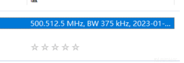
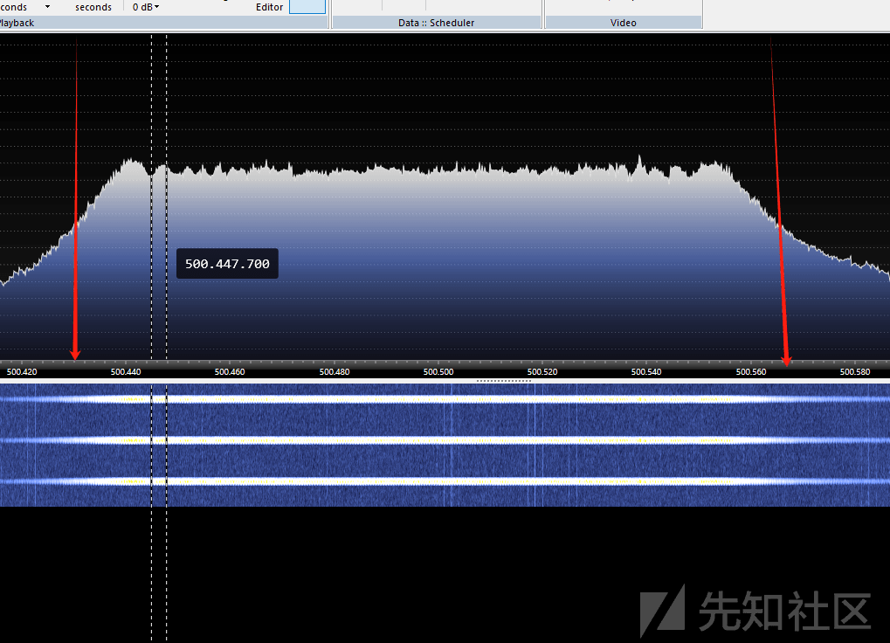

# 从 LongRange1&2 学习 lora 通信 - 先知社区

从 LongRange1&2 学习 lora 通信

- - -

# 关于 LongRange1&2

## 前言

总算是可以安顿下来好好看看这两题目了

工具[https://github.com/rpp0/gr-lora](https://github.com/rpp0/gr-lora)

```plain
git clone https://github.com/rpp0/gr-lora.git .
cd docker/
./docker_run_grlora.sh
```

我们把附件放入 docker 的工作目录下就好

再次使用

```plain
./docker_run_grlora.sh
gnuradio-companion 
docker inspect id //找到 docker 的工作目录
工具安放在 src 文件夹下面
```

## 题解部分

### LongRange1

主要是对 LoRa 信号的处理

关于 LoRa 信号的处理，用 gunradio 的 gr\_lora 插件解决问题

剩下的就要解决几个参数的问题，其实 lorg 的通信信号和其他的数字信号通信的道理差不多（暂时不管他的实现逻辑）我们直接看 LoRa Receiver 这个模块

[](https://xzfile.aliyuncs.com/media/upload/picture/20240208205525-53e4bc3c-c681-1.png)

```plain
Sample rate：采样率
Center frequency：中心频率
channel list：直译信道列表
Bandwidth：带宽
Spreading factor：扩频因子（SF）
```

**Center frequency**

我们参考滤波器的一些概念

[](https://xzfile.aliyuncs.com/media/upload/picture/20240208205530-5700c6c2-c681-1.png)

禁带的开始处称作半功率点（Half-power point）。滤波器允许或阻止一定的频率通过并不象刀切一样突然变化，而是有一个过渡，是一条斜线。斜线的倾斜程度用斜率（Slop）来表示。当输出信号下降 3 分贝时，就是半功率点，也叫负 3 分贝点，大家可能更加熟悉它的另一个称呼“截止频率”（Cutoff Frequency）。带通和带阻滤波器各自有两个半功率点，这两点的中心就称为**中心频率**（Center Frequency）

**channel list**

这里说的是 lora 信号的信道的范围，这里可参考国际规定的 lora 信道规范标准

**Bandwidth**

我们常见的带宽的定义，带宽可以理解为能携带的信号的大小，（直观的说就是我们看信号波状图的信号变化范围的宽度）

[](https://xzfile.aliyuncs.com/media/upload/picture/20240208205535-59c499b0-c681-1.png)

Bandwidth 和 Sample rate 存在整数倍关系，采样率大于带宽的 2 倍并且二者常呈整数倍关系

**Spreading factor**

LoRa 采用多个信息码片来代表有效负载信息的每个位，扩频信息的发送速度称为符号速率（Rs），而码片速率与标称的 Rs 比值即为扩频因子（SF，SpreadingFactor），表示了每个信息位发送的符号数量

[](https://xzfile.aliyuncs.com/media/upload/picture/20240208205539-5c1a3468-c681-1.png)

理解了这些概念之后我们就可以取参数了

[](https://xzfile.aliyuncs.com/media/upload/picture/20240208205543-5ebe14f0-c681-1.png)

首先知道了频率和采样率（BW 不应该是带宽吗),这里给的也是中心频率，但是通过实际查看频谱图发现并不是，给出的 500.512.5mHz 并不在波的中心，所以这里手动调一下，得到波的中心频率大约为 500.500.500 左右 mHz（500.512.5m+375k 也是这个结果，不知道有没有关系）

我们估算一些带宽 125k 满足整数倍关系

[](https://xzfile.aliyuncs.com/media/upload/picture/20240208205547-60ea851a-c681-1.png)

Spreading factor 的范围是 6-12

我们构建类似于这样的流程图

[](https://xzfile.aliyuncs.com/media/upload/picture/20240208205551-63186f50-c681-1.png)

解释：第一部分是进行数据类型的转换，第二部分可以理解成限流作用是防止进程太大，三部分就 lora 解码

[](https://xzfile.aliyuncs.com/media/upload/picture/20240208205554-64ffc188-c681-1.png)

```plain
Major opcode: 62 (X_CopyArea)
  Resource id:  0x260000d
 08 30 00 41 6e 79 6f 6e 65 20 3f 8e dc
 08 30 00 41 6e 79 6f 6e 65 20 3f 8e dc
 08 30 00 41 6e 79 6f 6e 65 20 3f 8e dc
 08 30 00 41 6e 79 6f 6e 65 20 3f 8e dc
 08 30 00 41 6e 79 6f 6e 65 20 3f 8e dc
 08 30 00 41 6e 79 6f 6e 65 20 3f 8e dc
 08 30 00 41 6e 79 6f 6e 65 20 3f 8e dc
 08 30 00 41 6e 79 6f 6e 65 20 3f 8e dc
 08 30 00 41 6e 79 6f 6e 65 20 3f 8e dc
 4e 31 70 57 65 6c 63 6f 6d 65 2c 20 42 65 20 41 20 52 57 43 54 46 65 72 21 20 72 77 63 74 66 7b 47 72 33 33 74 5f 46 72 30 6d 5f 4c 6f 52 34 5f 32 36 39 33 32 38 30 32 66 32 36 61 38 63 39 62 34 35 31 39 65 62 36 66 39 30 30 66 36 37 36 66 7d 83 c3
```

[](https://xzfile.aliyuncs.com/media/upload/picture/20240208205559-68490bec-c681-1.png)

[](https://xzfile.aliyuncs.com/media/upload/picture/20240208205603-6a6a822a-c681-1.png)

### LongRange2

同样的道理

这里可能会出现这样的报错

[](https://xzfile.aliyuncs.com/media/upload/picture/20240208205607-6cdbc4c4-c681-1.png)

因为我的工具是用 docker 起的因为本机的环境我实在是配不好，在使用 gun radio 的 wavfilesource 的时候会出现以上的报错（悲，暂未找到原因所在

```plain
from scipy.io import wavfile
import numpy as np
samplerate, data = wavfile.read('./486_375MHz-1MSps-1MHz.wav')
signal = data[:,0] + data[:,1] * 1j
signal = signal.astype(np.complex64)
signal /= (2**32)//2
signal.tofile("./486_375MHz-1MSps-1MHzcomlex64")
```

我们可以使用以上的脚本来平替 wavfilesource

我们可以看到文件名很明显给出了一些信息

[](https://xzfile.aliyuncs.com/media/upload/picture/20240208205612-6fd9f5e2-c681-1.png)

我们知道了

```plain
采样率：1M
频段:375M
```

[](https://xzfile.aliyuncs.com/media/upload/picture/20240208205616-724d3154-c681-1.png)

带宽差不多是 250k

[](https://xzfile.aliyuncs.com/media/upload/picture/20240208205620-7466a56a-c681-1.png)

当我 sf 在 11 的时候数据正确

```plain
2d 31 e0 bc 4b 6c fa c4 c0 6d fa 66 26 d2 02 0b 08 a7 92 b3 78 fb 63 77 d7 e0 54 d7 4f 67 1e c0 2d f1 8c 7d 04 66 c9 31 bb 22 40 0f c9 ec 25 c8 71 33
 1b 31 e0 c4 c0 6d fa bc 4b 6c fa 29 5d 91 38 03 08 a7 92 12 19 7e 5e 99 47 1a 63 33 0f d5 24 55
 49 31 20 c4 c0 6d fa bc 4b 6c fa a6 41 be 1e 0b 08 a7 92 b9 4d 99 11 17 1c a9 be 15 47 44 0f f1 d6 ce 46 02 e2 d2 a4 11 af e6 da e9 f2 0c db d0 5e e5 04 3b 82 cd 6c 79 47 31 94 f9 79 73 d9 0c 85 b3 09 8c c7 22 73 85 64 36 c8 be 0a de 
 1b 31 e0 bc 4b 6c fa c4 c0 6d fa 0f 21 39 44 03 08 a7 92 b8 56 c7 f0 c5 8e 43 63 70 27 c9 75 2d
 5f 30 00 ff ff ff ff c4 c0 6d fa a3 f3 0f 12 03 08 a7 92 aa c1 8d 79 d8 3c 56 bc 10 34 5a ea 0f cc 82 91 41 29 1c 63 01 cc 6e 23 15 f6 a1 0f 72 20 b9 5d f1 88 c5 e5 0b ec ec 89 cb 54 b5 40 6e c1 83 c1 b7 bf 77 5e 6b ff 15 0d aa 09 c8 3d 6c 98 4f 70 c9 e2 dc 26 97 2f 84 e0 5c ba e7 5a 89 51 d4 cd 2f
 5f 30 00 ff ff ff ff c4 c0 6d fa a3 f3 0f 12 02 08 a7 92 aa c1 8d 79 d8 3c 56 bc 10 34 5a ea 0f cc 82 91 41 29 1c 63 01 cc 6e 23 15 f6 a1 0f 72 20 b9 5d f1 88 c5 e5 0b ec ec 89 cb 54 b5 40 6e c1 83 c1 b7 bf 77 5e 6b ff 15 0d aa 09 c8 3d 6c 98 4f 70 c9 e2 dc 26 97 2f 84 e0 5c ba e7 5a 89 51 d4 d7 b3 
 2d 31 e0 ff ff ff ff bc 4b 6c fa ed bb 63 1c 03 08 a7 92 c9 4d 34 c5 67 d1 39 89 47 9d 37 6c 8a 0c ac dc 65 8d 12 56 4a 93 ef 74 00 25 44 37 ac 10 56 
 2d 31 e0 ff ff ff ff bc 4b 6c fa ed bb 63 1c 02 08 a7 92 c9 4d 34 c5 67 d1 39 89 47 9d 37 6c 8a 0c ac dc 65 8d 12 56 4a 93 ef 74 00 25 44 37 ac 39 d8
 1f 31 40 ff ff ff ff bc 4b 6c fa a6 20 df 2d 03 04 a7 92 5a fa cd 43 97 76 00 36 1b 8c c3 f5 0f bd 5d 65 2e 
 1f 31 40 ff ff ff ff bc 4b 6c fa a6 20 df 2d 02 04 a7 92 5a fa cd 43 97 76 00 36 1b 8c c3 f5 0f bd 5d 87 3e
 68 30 60 ff ff ff ff c4 c0 6d fa 88 99 c2 02 03 04 a7 92 50 01 50 2e 35 d7 3a b7 93 c3 e9 ad 6a cc 9d a6 a4 95 5b c5 6b 80 54 e9 98 9d 76 f5 35 5c f2 86 8b 90 bf fa e3 21 d5 10 77 be 4e 17 74 fc 07 4f 63 a4 c0 af 6b a3 8f 33 a8 29 b0 78 4b da db cc 73 8b 16 e9 30 e7 41 c4 8f 4d 6c 0c ab 01 2e 56 05 12 2d ce 40 ea eb 7b 76 26 
 68 30 60 ff ff ff ff c4 c0 6d fa 88 99 c2 02 02 04 a7 92 50 01 50 2e 35 d7 3a b7 93 c3 e9 ad 6a cc 9d a6 a4 95 5b c5 6b 80 54 e9 98 9d 76 f5 35 5c f2 86 8b 90 bf fa e3 21 d5 10 77 be 4e 17 74 fc 07 4f 63 a4 c0 af 6b a3 8f 33 a8 29 b0 78 4b da db cc 73 8b 16 e9 30 e7 41 c4 8f 4d 6c 0c ab 01 2e 56 05 12 2d ce 40 ea eb 7b e2 d3 
 22 31 70 ff ff ff ff c4 c0 6d fa 5f 8a 54 22 03 04 a7 92 53 1f 89 a3 6f ea 30 18 c9 ce b7 e7 1f a3 cd 72 71 ed 14 0f 
 22 31 70 ff ff ff ff c4 c0 6d fa 5f 8a 54 22 02 04 a7 92 53 1f 89 a3 6f ea 30 18 c9 ce b7 e7 1f a3 cd 72 71 ed a7 3a
```

数据的前三个和后两个可以去掉参考 lora 的数据包结构

[](https://xzfile.aliyuncs.com/media/upload/picture/20240208205625-7771110a-c681-1.png)

```plain
bc4b6cfac4c06dfa6626d2020b08a792b378fb6377d7e054d74f671ec02df18c7d0466c931bb22400fc9ec25c8
c4c06dfabc4b6cfa295d91380308a79212197e5e99471a63330fd5
c4c06dfabc4b6cfaa641be1e0b08a792b94d9911171ca9be1547440ff1d6ce4602e2d2a411afe6dae9f20cdbd05ee5043b82cd6c79473194f97973d90c85b3098cc72273856436c8be
bc4b6cfac4c06dfa0f2139440308a792b856c7f0c58e43637027c9
ffffffffc4c06dfaa3f30f120308a792aac18d79d83c56bc10345aea0fcc829141291c6301cc6e2315f6a10f7220b95df188c5e50becec89cb54b5406ec183c1b7bf775e6bff150daa09c83d6c984f70c9e2dc26972f84e05cbae75a8951d4
ffffffffbc4b6cfaedbb631c0308a792c94d34c567d13989479d376c8a0cacdc658d12564a93ef7400254437ac
ffffffffbc4b6cfaa620df2d0304a7925afacd43977600361b8cc3f50fbd5d
ffffffffc4c06dfa8899c2020304a7925001502e35d73ab793c3e9ad6acc9da6a4955bc56b8054e9989d76f5355cf2868b90bffae321d51077be4e1774fc074f63a4c0af6ba38f33a829b0784bdadbcc738b16e930e741c48f4d6c0cab012e5605122dce40eaeb7b
ffffffffc4c06dfa5f8a54220304a792531f89a36fea3018c9ceb7e71fa3cd7271ed
```

这样我们就提取到了有效的载荷

这个时候我们把目光放在题目的附件 flashdump 上面

[](https://xzfile.aliyuncs.com/media/upload/picture/20240208205629-7a064bba-c681-1.png)

发现是 meshtastic 的 dump 文件那么我们去寻找 meshtastic 的手册以及源码来解读报文

Mesh Broadcast Algorithm:[https://meshtastic.org/docs/overview/mesh-algo](https://meshtastic.org/docs/overview/mesh-algo)

[](https://xzfile.aliyuncs.com/media/upload/picture/20240208205633-7ca61eea-c681-1.png)

我们看到开头的 fffffff 也正好和我们的数据包结构能正好对应上

并且下面的介绍说是 AES256-CTR 的加密方式

[](https://xzfile.aliyuncs.com/media/upload/picture/20240208205638-7f8acbe2-c681-1.png)

[firmware/src/mesh/Channels.cpp at master · meshtastic/firmware (github.com)](https://github.com/meshtastic/firmware/blob/master/src/mesh/Channels.cpp)

找到原始 psk

[](https://xzfile.aliyuncs.com/media/upload/picture/20240208205643-829049ac-c681-1.png)

[meshtastic-backend/src/main/java/org/meshtastic/backend/service/Crypto.kt at master · meshtastic/meshtastic-backend (github.com)](https://github.com/meshtastic/meshtastic-backend/blob/master/src/main/java/org/meshtastic/backend/service/Crypto.kt)

找到 iv 构造

[](https://xzfile.aliyuncs.com/media/upload/picture/20240208205648-85438588-c681-1.png)

结合我们上面了解的包结构 iv 就是 ID ＋00000000+NodeID+00000000

```plain
bc4b6cfac4c06dfa6626d2020b08a792b378fb6377d7e054d74f671ec02df18c7d0466c931bb22400fc9ec25c8
iv:6626d20200000000c4c06dfa00000000
```

但是我们那上面的原始的 psk 不能解出含有 flag 部分的密文所以我们要找出真正的密钥

8000 地址定义分区表的一些信息

[](https://xzfile.aliyuncs.com/media/upload/picture/20240208205704-8ec1511c-c681-1.png)

得知大概位置在下图

[](https://xzfile.aliyuncs.com/media/upload/picture/20240208205706-90366c4e-c681-1.png)

Buddies 是出题者新建的 channels，图所标记的就是 key 了

得知 key 对这条信息进行解密

```plain
ffffffffc4c06dfa8899c2020304a7925001502e35d73ab793c3e9ad6acc9da6a4955bc56b8054e9989d76f5355cf2868b90bffae321d51077be4e1774fc074f63a4c0af6ba38f33a829b0784bdadbcc738b16e930e741c48f4d6c0cab012e5605122dce40eaeb7b
iv：8899c20200000000c4c06dfa00000000
key：cef8db8e8e6017fd6dcca21db8a1476d451480acd7f4f9f769a763f528c011f7
```

[](https://xzfile.aliyuncs.com/media/upload/picture/20240208205712-93a2aeec-c681-1.png)
