# 从 SSO 认证缺陷到任意用户登录漏洞 - 先知社区

从 SSO 认证缺陷到任意用户登录漏洞

- - -

最近在项目中碰到了 app 中 SSO 单点登录使用不当导致的任意用户登录漏洞，渗透过程中碰到不少 JS 加密处理，SIGN 值生成，在与开发的对抗中还是觉得比较有意思，特此记录一下

## 什么是 SSO

这里简单描述下什么是 SSO 单点登录：单点登录就是在多个系统中，用户只需一次登录，各个系统即可感知该用户已经登录。

[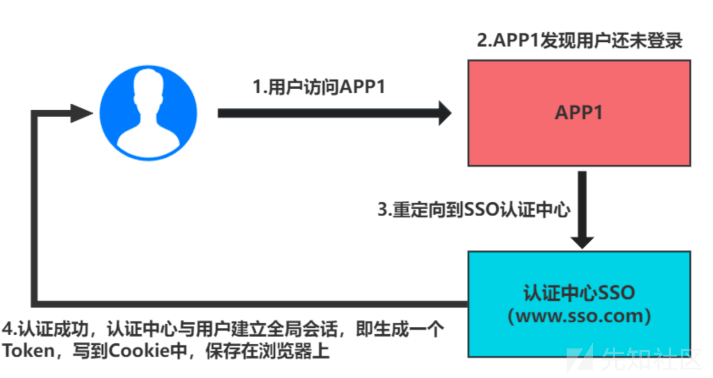](https://xzfile.aliyuncs.com/media/upload/picture/20240225165538-a56f594e-d3bb-1.png)  
为让大家更有代入感，简易画了张图，该 app（下文称之为 A）中有好多子应用系统，存在漏洞的这个应用（下文叫 B 应用）模块会跳转至第三方的域名中，为了提高用户体验使用了 SSO，来避免重复登录。

[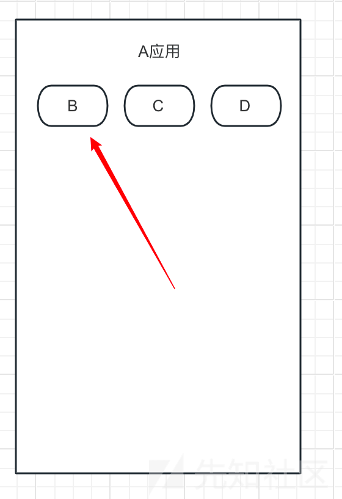](https://xzfile.aliyuncs.com/media/upload/picture/20240225165636-c805da00-d3bb-1.png)

## 流程异常

在抓包过程中，发现整个 sso 的流程出了些许差池：  
此时 A 根据 Token 凭证，颁发 ticketId  
[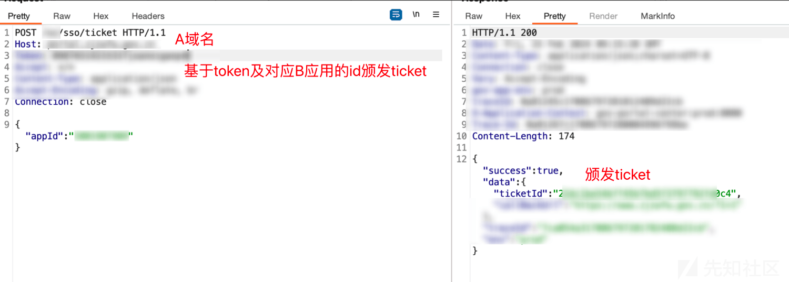](https://xzfile.aliyuncs.com/media/upload/picture/20240225165710-dc7f7ba8-d3bb-1.png)  
B 通过 ticketId 获取到 data 数据，正常来说此时返回的 data 就是 B 的授权访问凭据  
[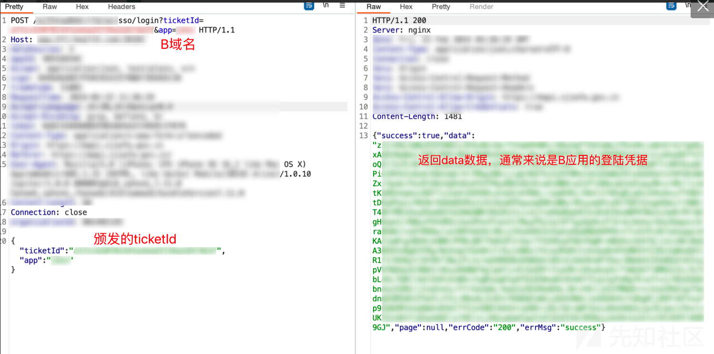](https://xzfile.aliyuncs.com/media/upload/picture/20240225165725-e52c452e-d3bb-1.png)  
但进入 B 应用后，发现 BP 流过的数据包中并没有携带该 data，唯一携带了的就只有上图的数据包  
[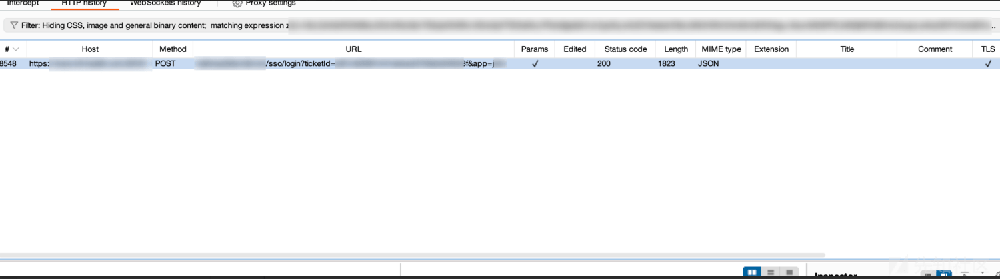](https://xzfile.aliyuncs.com/media/upload/picture/20240225165734-eae28f1e-d3bb-1.png)  
此时我怀疑整个 sso 流程出现了缺陷，可能 B 应用单独使用了自己的认证方式，浏览数据包发现 B 域名有一个叫/auth/register 的接口，果然是使用了自己的一套认证系统，且请求和响应均加密了。  
[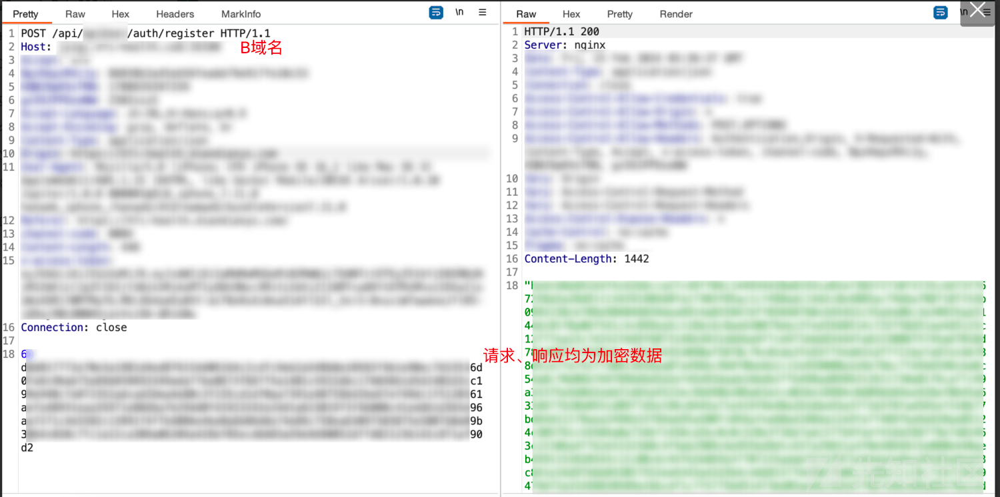](https://xzfile.aliyuncs.com/media/upload/picture/20240225165742-efaf1abc-d3bb-1.png)  
根据渗透经验：绣花枕头烂稻草，越是复杂的加密可能背后就有越多的漏洞。有些开发难免想着偷懒，通过加密来隐藏系统所存在的漏洞，毕竟从根源上修复漏洞是可能会推翻原本系统的整套架构的，尤其是认证授权方面。  
既然发现了这套系统存在 sso 认证问题，那么先把侧重点放在越权上。  
暂时不着急解密，先观察其他接口数据，例如 query 接口，用于查询用户账单信息  
[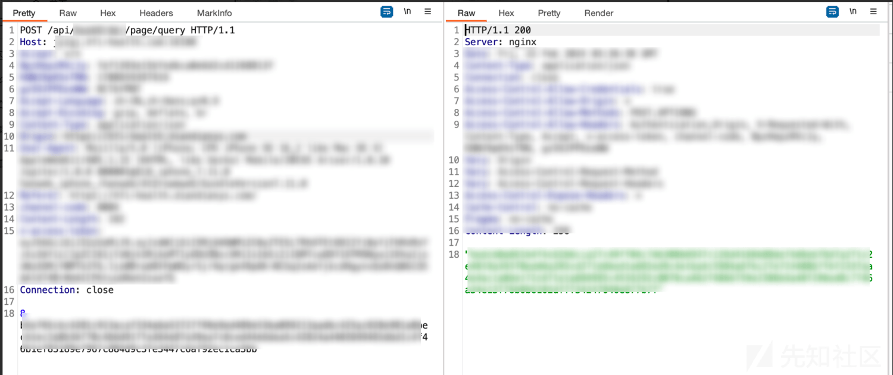](https://xzfile.aliyuncs.com/media/upload/picture/20240225165754-f6c34044-d3bb-1.png)  
此时我用朋友李四的账号登录了 B 应用，触发同一个功能点，抓包发现请求数据与上文有所区别，怀疑请求体解密后的数据类似于

```plain
本人：{"userid":"1"}
李四：{"userid":"2"}
```

即接口利用请求体来判断用户身份，而非 token 来鉴权  
此时我将李四账号抓到的请求数据替换到上述接口的数据，结果响应结果一样  
[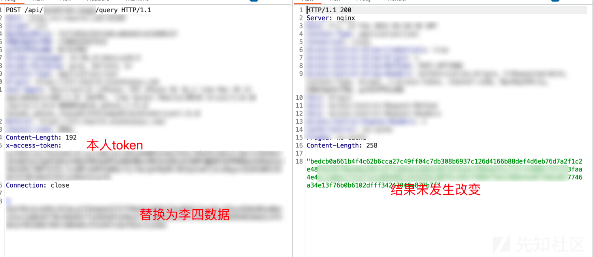](https://xzfile.aliyuncs.com/media/upload/picture/20240225165849-1724f710-d3bc-1.png)  
此时心凉了一截，大概率不是通过请求数据来检验用户。但同一个接口功能点，不同账号之间传递的参数不同，让人比较疑惑，因此将渗透工作着眼于数据解密上。

## 定位 JS 加解密

这里 app 整套系统的 js 加载流程是：通过 A 的统一网关，根据 B 应用的 appid 发送对应的 JS，当进入 B 应用后，还会再加载自己的一套 JS，总共需要关注的是两套 JS。这里简单说一下定位加密算法的小 tips：

1.  一般存有加密算法的 js 名称都有所不同，但我通常会优先关注 index.js、app.js 之类的
2.  结合 hae 插件，针对 js 引用的是第三方通用算法的，可以自行添加一些关于加密算法名称的正则。或者关注 sensitive infomation 那块，有时候直接会匹配到加密密钥，方便我们更快定位到加密算法所在位置  
    使用上面的方法，在往前回溯数据包时发现了在第二套 JS 中，找到了 SM4 加密算法及密钥  
    [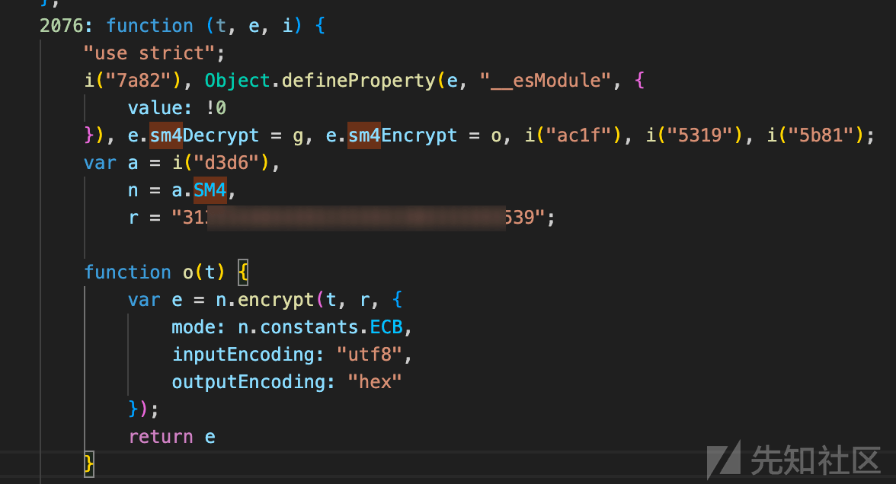](https://xzfile.aliyuncs.com/media/upload/picture/20240225170743-558facec-d3bd-1.png)  
    解密本人账号的请求 query 接口时的数据，发现明文如下：
    
    ```plain
    {"orderDateType":"0","userId":"10000","pageNum":1,"pageSize":15,"orderId":null}
    ```
    
    而李四的数据为
    
    ```plain
    {"orderDateType":"0","userId":"10001","pageNum":1,"pageSize":15,"orderId":null}
    ```
    
    事实证明之前对加密数据的猜想没错，但不幸的是这里的接口是通过 token 来作为身份校验的，且删除 token 会直接导致接口不可用。  
    \## 任意用户登录漏洞  
    既然有了加解密算法，那么就先看一下其余的流量吧，在进入 B 系统之后，第一个请求的接口是 register 接口，将请求响应数据进行解密  
    可以看到 register 接口通过 sfz+ 姓名 + 手机号作为登录认证（**后续测试发现只需要手机号正确，其他字段只需格式正确即可**），返回 token  
    [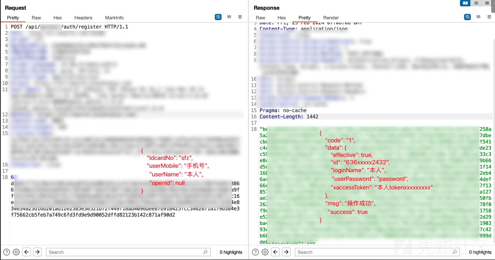](https://xzfile.aliyuncs.com/media/upload/picture/20240225170923-914e0396-d3bd-1.png)  
    此时构造出李四用户的 data 数据，即可获取到他的 token，进一步就能直接调用他的接口获取到账号的订单记录。  
    **相当于只要知道任意用户的手机号，即可实现了任意用户登录。**  
    [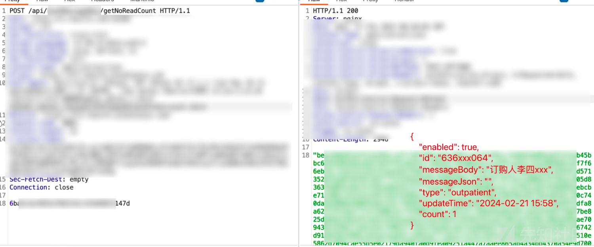](https://xzfile.aliyuncs.com/media/upload/picture/20240225170940-9b936814-d3bd-1.png)  
    因为漏洞比较严重，于是及时上报没有进行通用漏洞测试。  
    \## 两层加密+sign 值破解  
    到了第二天，开发通知说漏洞已修复，于是再次打开应用，发现接口未变，加密格式也没有变。使用之前的加密算法进行解密，发现依旧是原来老一套的算法，但解密后的数据有变，此时是通过 userInfo 来获取 token 数据。  
    [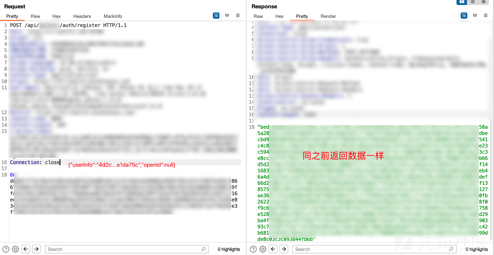](https://xzfile.aliyuncs.com/media/upload/picture/20240225171002-a8a43376-d3bd-1.png)

[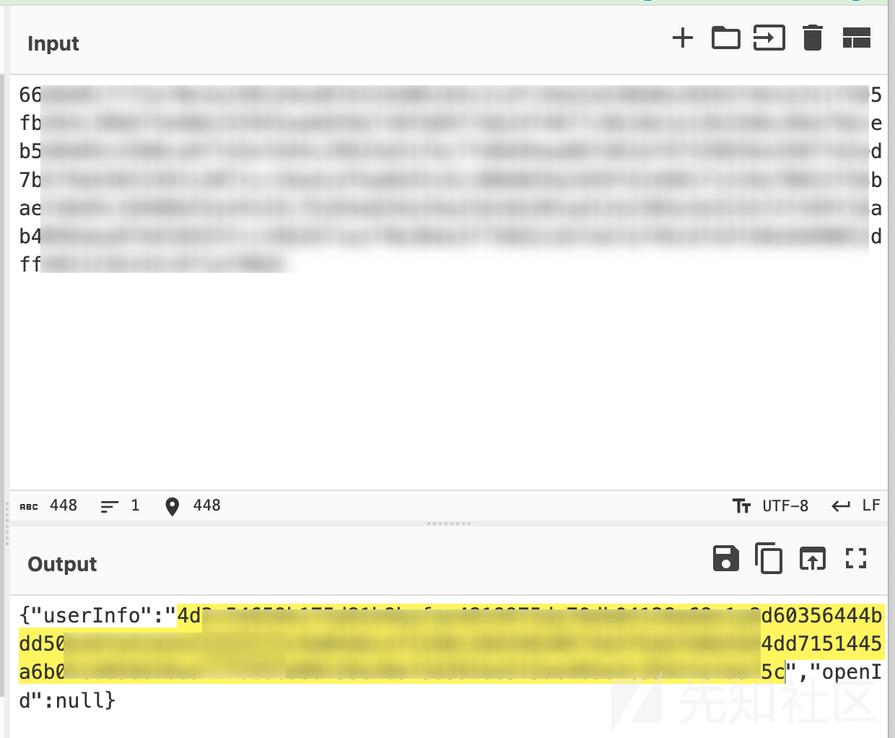](https://xzfile.aliyuncs.com/media/upload/picture/20240225171009-acc54a80-d3bd-1.png)  
往前数据包翻找了一下，并未找到 userInfo 的内容从何而来，因此怀疑是在原本 json

```plain
{
    "IdcardNo": "11 位 sfz",
    "userMobile": "手机号",
    "userName": "本人",
    "openId": null
}
```

基础上又进行了一次加密，变为

```plain
{"userInfo":"4d2c5...e1da75c","openId":null}
```

翻找了下 js，发现 userInfo 的加密轻易就能找到，通过 aes/ecb 进行加密，解密内容如下：也是包含老三样：姓名、身份号、手机号  
[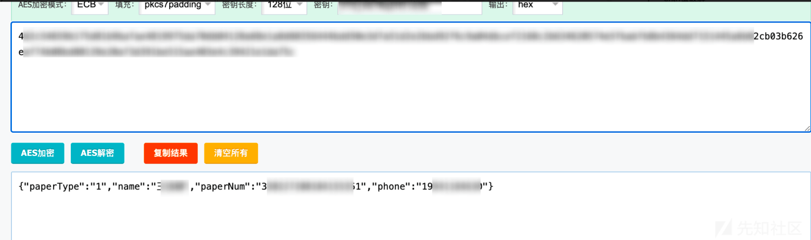](https://xzfile.aliyuncs.com/media/upload/picture/20240225171053-c6fee5e6-d3bd-1.png)  
因此两层加密即可构造出 data 数据

```plain
{"userInfo":aesEncry({"paperType":"1","name":"","paperNum":"","phone":""}),"openId":null}
```

构造出数据后发送请求，提示 sign 值有误。好好好，开发是想通过各种加密来试图修复漏洞啊。但把漏洞修复的活交给前端，实在是有点捉襟见肘了  
[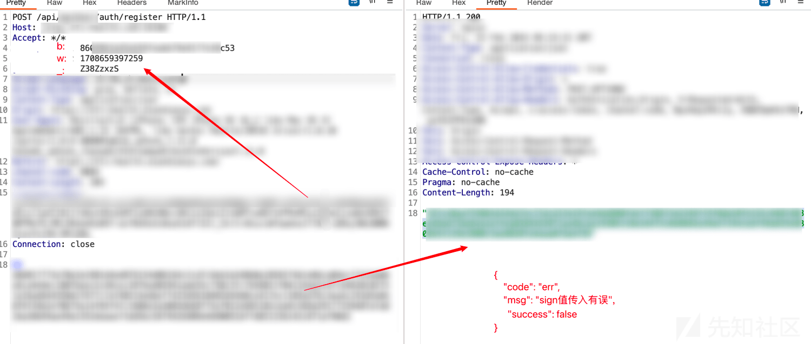](https://xzfile.aliyuncs.com/media/upload/picture/20240225171113-d2db7c9e-d3bd-1.png)  
继续回看 js，之前有提到过：这个系统的 js 加载流程是：通过 A 统一网关，根据 B 应用的 appid 发送对应的 JS，当进入 B 应用后，还会再加载自己的一套 JS。之前加密的内容都是在 8613 数据包的 JS 中，而 sign 值的生成是在 8549 这个数据包的 JS 中  
[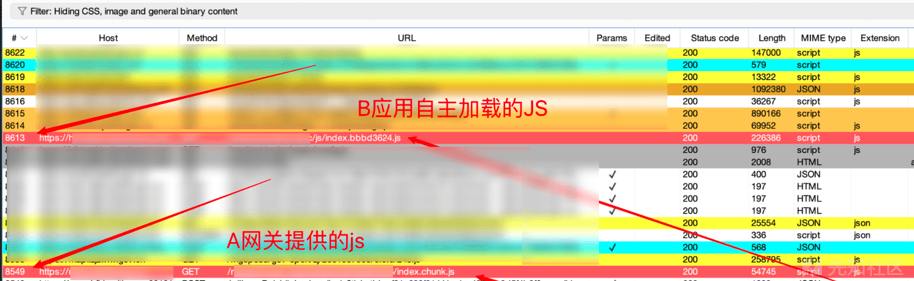](https://xzfile.aliyuncs.com/media/upload/picture/20240225171128-dbec7446-d3bd-1.png)  
这里 sign 值算法的定位比较简单，一般直接搜索 sign 的 header 头字段，即可一步步找到加密算法

```plain
(i = (0, o.sm4Encrypt)(JSON.stringify(i), atob(n.APP_SER)));
var b = (0, g.randomString)(8),
  w = (new Date).getTime(), 
  _ = (0, p.default)((0, p.default)(w + i) + b),

  x = {
    "x-access-token": f,
    "channel-code": m,
    randomchar: b,
    time: w,
    sign: _
  };
```

根据算法可知，header 头中，b 为八位随机数，w 为时间戳，\_为根据 b、w、以及 data 共同构造出来的 sign 值。一开始一直在寻找 p.default 是什么函数，但后面看\_的值像是 md5 之类生成的，于是乎全局搜索后发现确实是 md5 加密  
此时 sign 值生成的原理就一目了然了

```plain
sign = md5(md5(时间戳+data) + 随机 8 位字符)
```

此处简单的编写了下 sign 值生成代码，方便直接生成替换：

```plain
import hashlib

def md5_encrypt(input_string):
    # 创建一个 md5 hash 对象
    hash_object = hashlib.md5()

    # 对输入字符串进行编码，因为hashlib需要二进制数据
    hash_object.update(input_string.encode('utf-8'))

    # 获取十六进制格式的散列值
    md5_hash = hash_object.hexdigest()

    return md5_hash

# 使用示例
//时间戳
w = "1708659397259"
//传输数据
i = "6...f90d2"

//第一次 md5 处理
md5_result = md5_encrypt(w+i)
print(f"MD5 hash of 'w + i': {md5_result}")

b = 'Z38ZzxzS'
result = md5_result + b
//第二次 md5 处理
md5_result = md5_encrypt(result)
//打印签值
print(md5_result)
```

构造、替换 data 数据、sign 请求头，又重新能获取到用户 token 凭证了  
[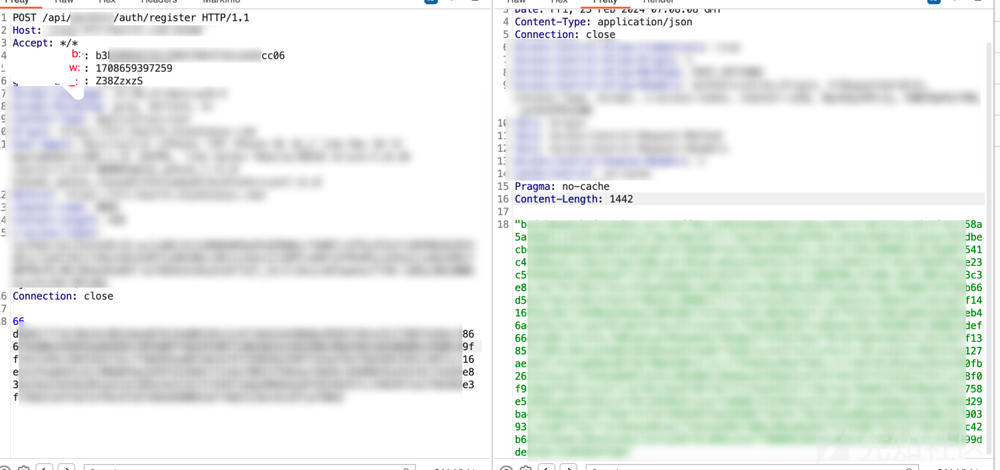](https://xzfile.aliyuncs.com/media/upload/picture/20240225171233-02693c94-d3be-1.png)

## 总结

此处发现的漏洞是因为开发没有正确的实现 SSO 登录认证，而是根据自己的方式来实现认证登录。虽代码中添加了很多加密来掩盖漏洞问题，但往往只要破解了加密算法，就很有可能找到一些高危漏洞。
