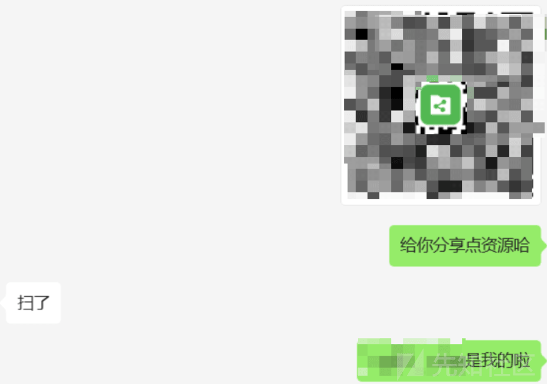

# 从二维码应用安全风险到新奇刷洞思路 - 先知社区

从二维码应用安全风险到新奇刷洞思路

- - -

### 前言

大家好，我是 A2Cai

这篇文章是我之前在研究通用的逻辑漏洞挖掘思路的成果

如今感觉有了更为清晰的思路之后

今天再拿出来整理下分享给大家

.

【**转载须知**】：**本文未经允许禁止转载！之前就发现有公众号直接把我文章给拖了下来，把我的 ID 给删了转载到公众号里，我强烈谴责这种行为！！！**

.

### 二维码

二维码，生活里经常能用到的东西

买东西的时候，打开微信收付款二维码给店员一扫就可以直接走了

去外面吃饭的时候，店员会叫你扫桌上二维码扫码点餐

浏览名胜古迹的时候，扫展品附近的二维码它会给你弹个页面上面是这个展品的历史渊源和故事

不难发现，扫码已经成为我们日常生活中习惯性的一个动作了

扫码很方便，但它安全吗？

今天我们主要就来探讨这个问题

.

### 二维码应用的本质

如果要探讨扫码这个行为是否安全

我认为得从二维码的应用出发，即为什么我要扫码

二维码其实本质上只是一个信息的载体，一种编码，与 Base64 编码无异

其中的关键在于，扫码之后获取的信息，是人为通过逻辑去处理的

如果处理不当，那自然而然就会产生安全风险

那扫码端的 APP 通常是怎样处理扫来的二维码呢？

以我最常用的扫码 APP 微信为例

微信对二维码解码后的内容有三种处理方式

1.  以 http:// 或 https:// 开头的网址会用微信内置浏览器打开
2.  符合微信规定语法的语句会被特别处理
3.  剩下的则以纯文本的形式进行展示（微信不允许纯文本内容中出现中文）

对应的就是二维码解码后常见的三种方式

1.  网站跳转
2.  内容解析处理
3.  纯文本传递

知道常见的扫码端处理解码二维码之后的数据之后

咱们就可以开始分析下其潜在的安全风险啦！

.

### 二维码处理不当所引发的安全风险

出于二维码天然“人畜无害”的外表，使得大多数人对二维码难以生起警惕之心

二维码比起钓鱼链接来说更具有迷惑性

而这种迷惑性是大部分人甚至安全行业从事者也可能中招的

因为我们的眼睛没办法解码二维码，自然也就没办法知道二维码背后到底是什么

那怎么知道呢？扫一扫就知道了，但扫了之后也就中招了...

这块我会从扫码端解码二维码后处理的三种方法出发

分别讲述下这几种方式如果处理不当会产生怎样的安全风险

.

#### 纯文本传输

针对纯文本传输而言，其实很难会出现什么安全风险

目前想到可能会出问题的操作如下所示

1.  假的纯文本传输：满足某些条件下 html 标签仍然会被解析。
2.  (想不到了...)

在安全风险小的同时，应用的场景少和频率也很小

大多数情况下应该都是直接传递加密数据，或者是符合特定规则的文本

二维码解码后不解析能让人看得懂的，其实就没啥编码的必要

.

#### 内容解析处理

对于内容解析处理来说，可能存在安全风险的范围是特别特别的广

因为这完全取决于扫码端如何去处理这个解码后获取的数据

如果扫码端会将二维码解码后的内容存进数据库，那是不是就有可能存在 SQL 注入？

如果扫码端会根据二维码解码后语句的语法去访问内网资源后返回，那是不是就可能存在 SSRF？

如果扫码端会根据二维码解码后的某个特定位置的值来分配用户身份，那是不是就存在任意用户身份伪造？

一切的一切都取决于扫码端的处理逻辑

对从二维码里获取来所有的数据进行足够合理的检查和处理是十分有必要的

.

#### 网站跳转

顾名思义，其实就是解码二维码后获得的内容是一个网址

而扫码端发现是个网址后，就给你直接跳转过去，过程就是这么简单

但其中可能存在一些潜在的安全风险

(PS：其实也不是扫码端处理二维码的问题，而是用二维码去放个网址跳转可能会把一些存在安全问题的接口暴露出来）

包括但不限于以下这几种：

1.  **接口遍历**：通过二维码添加好友、分享名片、获取优惠券...（例如：/api/v1/getUserProfile?userId=21234）
2.  **XSS**：动态传参渲染 HTML 来展示内容的时候（例如：/api/v1/showContent?form=%3Ch1%3EA2Cai%20is%20a%20handsome%20boy%3C%2Fh1%3E）
3.  **URL 重定向**：除了常见的 ?redirectURL=xxx 之外，如果二维码内容可控，其实就相当于存在 URL 重定向漏洞（交过 SRC 拿了 50 块，所以不用怀疑，它就是 URL 重定向）
4.  **敏感信息泄露**：二维码解码后链接的参数可能存在一些敏感信息，例如跟云、第三方服务相关的密钥或者跟目标系统相关的管理员账号、IP、组件...
5.  **CSRF**：为什么扫个码钱就没了号被盗了，其实不完全怪你，提供服务一方也要承担很大的责任，扫码被盗号钱被转走有可能是因为提供服务的网站存在 CSRF 漏洞导致的（当然也有可能是钓鱼网站，那就是安全意识的问题了）
6.  **OAuth 换绑**：本质上就是一个 CSRF，就是捕获第三方平台认证后那个回调的链接，别人点击这个链接之后，账号中的 OAuth 认证会被添加上我们预先认证好的账号，即点一下链接，号就被盗了。
7.  **OAuth 认证流程缺陷**：这个下面我重点讲，也是我所提到的刷洞思路。

.

### 从二维码应用安全风险到新奇刷洞思路

这个思路也是跟 OAuth 相关的，我将其称之为 OAuth 认证流程缺陷

这个漏洞全程不需要抓一个包，只需要扫码判断是否存在缺陷后，就可以直接交 SRC 了

至于说 SRC 收不收，咱们直接上图

.

AntSRC、网易 SRC 定级为中危

.

TSRC 前期中后期定低（不推荐交这）

(PS：这个是我带的学员挖的，光靠 OAuth 挖到了总榜 12...不是 TSRC 哈)

.

.

接下来就是相关的技术分析和实战报告

这个漏洞其实很简单，我甚至可以用一句话把它给描述出来

就是“平台在使用 OAuth 认证的时候如果没有二级校验就存在 OAuth 认证流程缺陷”

什么意思呢？

就不知道大家平时在用微信扫码登陆的时候有没有发现一个问题

有一些平台是需要你去关注他们公众号之后才能扫码登陆

但你在关注完公众号之后再进行扫码，你就会发现

诶，好方便诶，一扫我就能直接登陆进去了

殊不知这种方便其实是存在安全隐患的

你可以设想一个情景，假如说这个用来登陆的二维码被包装成以下这个样子呢？

.

.

寂寞男孩深夜悄悄掏出了这张白天不敢放大的图片

带上了耳机，然后长按识别二维码，哦吼，中招了

上面提示你“你已经成功登陆了 XXX。”

可以后悔嘛，有补救措施嘛，没有，权限已经给过去了，有感的钓鱼又怎么样？

不知道大家有没有意识到这么一点

我们最常用的微信扫码其实并不是一个简单的二维码解码工具

而是一个可以通过扫码来 **授权** 的工具

但平日里使用更多的扫码支付功能，麻痹了我们应当警惕陌生二维码的心

而且更可怕的是

你即便知道里面的内容是啥，你也很难去判断这个地方是否有坑

因为都是官方的微信域名的链接...

既然结果难以承受，那作为开发来说，如何去解决这个问题呢？

方法如下所示：

1.  用户扫码授权登陆后，在微信公众号端进行二级校验。（注意，不要在网页上进行二级校验，不然仍然是可以通过模拟二级校验来绕过限制）
2.  用户扫码授权之后，申请获取用户相关的一些信息，其实也就相当于有个二级校验。

.

下面是我交 SRC 并通过审核的漏洞报告

.

### 实战漏洞报告

.

漏洞原理及危害：

常规 OAuth 认证是：生成二维码 -> 用户扫码确认 -> 获得身份凭证

正常来说整个流程是没啥问题的，但平台在用户扫码登陆的时候使用的是关注微信公众号登陆

而以关注公众号的形式进行登陆的话是没有二级校验的

也就是说当用户在扫二维码之后便会直接赋予攻击者该账户的权限

缺少二级校验的身份认证就很容易遭受钓鱼攻击，任意攻击者只需要伪造身份认证二维码并配上诱人的文字

关注了公众号的受害者只需要扫描二维码，攻击者就可以立马获得受害者的完整权限

Q：这时候可能会说这不是有二级认证吗？需要关注公众号就是啊？

A：但实际上我们钓鱼的目标就是已经关注公众号，正在使用平台业务的账号。

.

下面是漏洞复现：

.

访问 [https://domain/login?platform=wechat&loginType=sms](https://domain/login?platform=wechat&loginType=sms)

这个时候会有生成一个微信二维码

.

.

将这个二维码保存下来，丢到二维码美化的网站

.

.

由于没有二级校验

已经关注了公众号的受害者只需要扫描这个二维码

我们就可以直接获取该用户在平台的权限

.

修复方法：使用完整的流程进行 OAuth 身份认证，在敏感操作处添加二级校验。

.
