# 从前端 JS 逆向到发现后端越权漏洞的渗透测试之旅 - 先知社区

从前端 JS 逆向到发现后端越权漏洞的渗透测试之旅

- - -

### 前言

本次漏洞挖掘涉及前端 js 逆向等过程，在此简单分享一下过程。**(本篇文章首发先知社区，禁止公众号转载！！！！)**

### 前端分析

首先搜索请求接口，未发现关键加密点

[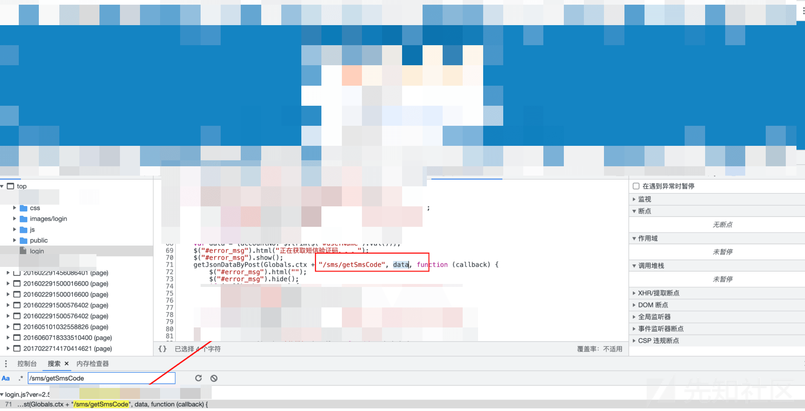](https://xzfile.aliyuncs.com/media/upload/picture/20240226093551-600a46c0-d447-1.png)

根据请求参数进行搜索

[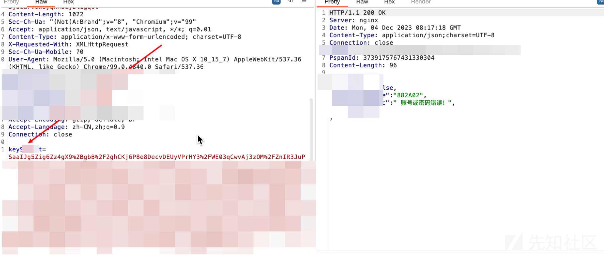](https://xzfile.aliyuncs.com/media/upload/picture/20240226093617-6fa11e92-d447-1.png)

在 js 文件中找到 aes 加密 key、iv

[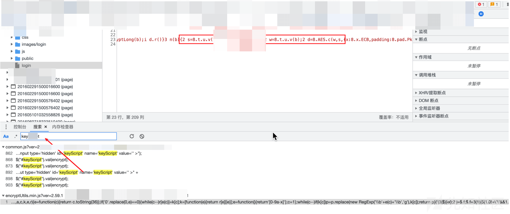](https://xzfile.aliyuncs.com/media/upload/picture/20240226093833-c0b04fba-d447-1.png)

```plain
eval(function(p, a, c, k, e, r) {
    e = function(c) {
        return c.toString(36)
    }
    ;
    if ('0'.replace(0, e) == 0) {
        while (c--)
            r[e(c)] = k[c];
        k = [function(e) {
            return r[e] || e
        }
        ];
        e = function() {
            return '[0-9a-x]'
        }
        ;
        c = 1
    }
    ;while (c--)
        if (k[c])
            p = p.replace(new RegExp('\\b' + e(c) + '\\b','g'), k[c]);
    return p
}('(3($){e();2 j=$.f;$.f=3(1){5(1.0!=\'\'&&1.0!=g){2 h=9 k();2 a=9 k();5(1.contentType=="application/json"){a=1.0}l{for(2 m in 1.0){2 4=m;5(1.0[4]!=g&&1.0[4].length>460){a[4]=1.0[4]}l{h[4]=1.0[4]}}}1.0=a;1.0.keyScript=n(o(JSON.stringify(h)))}2 p=$.extend(1,{beforeSend:3(jqXHR,settings){}});i j(p)}})(jQuery);3 e(){5(6.7==g||6.7==null||6.7==\'\'){$.f({type:\'GET\',async:false,url:Globals.ctx+"/e/generate",0:{nowDate:9 Date()},q:3(0){5(0.q){6.7=0.body}}})}}3 o(b){2 c=9 JSEncrypt();c.setPublicKey(6.7);2 d=c.encryptLong(b);i d.r()}3 n(b){2 s=8.t.u.v("x x x x x x");2 w=8.t.u.v(b);2 d=8.AES.c(w,s,{x:8.x.ECB,padding:8.pad.Pkcs7});i d.r()}', [], 34, 'data|opt|var|function|arrayName|if|window|publicKey|CryptoJS|new|noEncrypt|message|encrypt|encrypted|dynamicKey|ajax|undefined|isEncrypt|return|_ajax|Object|else|index|AesEncrypt|RsaEncrypt|_opt|success|toString|key|enc|Utf8|parse|srcs|mode'.split('|'), 0, {}))
```

继续跟进，发现了两个加密函数:RsaEncrypt、AesEncrypt

[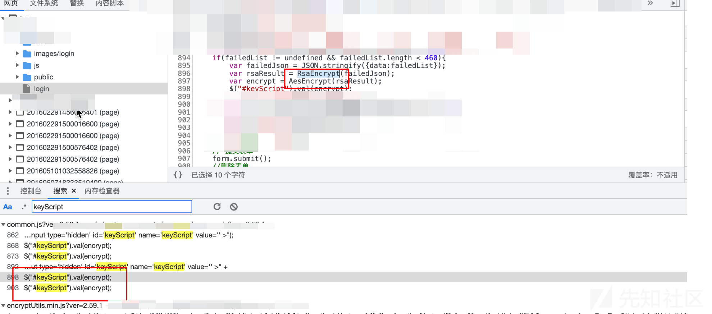](https://xzfile.aliyuncs.com/media/upload/picture/20240226090534-25052cc4-d443-1.png)

搜索这两个函数没有太多信息。我们继续阅读混淆的 js 代码。

```plain
('(3($){e();2 j=$.f;$.f=3(1){5(1.0!=\'\'&&1.0!=g){2 h=9 k();2 a=9 k();5(1.contentType=="application/json"){a=1.0}l{for(2 m in 1.0){2 4=m;5(1.0[4]!=g&&1.0[4].length>460){a[4]=1.0[4]}l{h[4]=1.0[4]}}}1.0=a;1.0.keyScript=n(o(JSON.stringify(h)))}2 p=$.extend(1,{beforeSend:3(jqXHR,settings){}});i j(p)}})(jQuery);3 e(){5(6.7==g||6.7==null||6.7==\'\'){$.f({type:\'GET\',async:false,url:Globals.ctx+"/e/generate",0:{nowDate:9 Date()},q:3(0){5(0.q){6.7=0.body}}})}}3 o(b){2 c=9 JSEncrypt();c.setPublicKey(6.7);2 d=c.encryptLong(b);i d.r()}3 n(b){2 s=8.t.u.v("x x x x");2 w=8.t.u.v(b);2 d=8.AES.c(w,s,{x:8.x.ECB,padding:8.pad.Pkcs7});i d.r()}', [], 34, 'data|opt|var|function|arrayName|if|window|publicKey|CryptoJS|new|noEncrypt|message|encrypt|encrypted|dynamicKey|ajax|undefined|isEncrypt|return|_ajax|Object|else|index|AesEncrypt|RsaEncrypt|_opt|success|toString|key|enc|Utf8|parse|srcs|mode'.split('|'), 0, {}))
```

这里在进行 RSA 加密的时候，调用了 JSEncrypt() 类。

[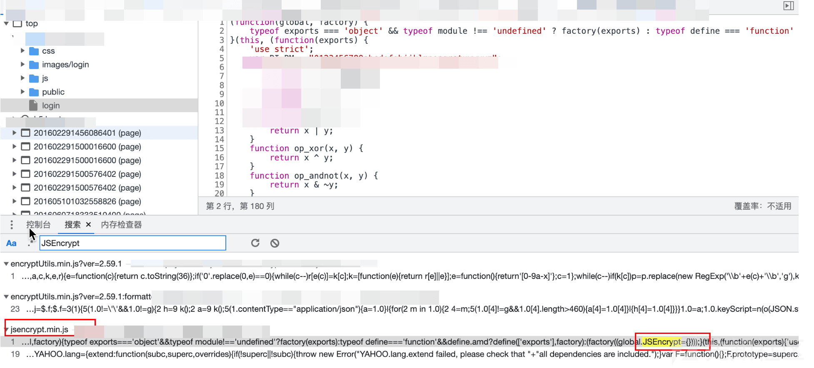](https://xzfile.aliyuncs.com/media/upload/picture/20240226090648-515e0f84-d443-1.png)

该 js 为 vue 的加密库。在该 js 文件中搜索 Publickey、encode 字段，发现了几个函数。

[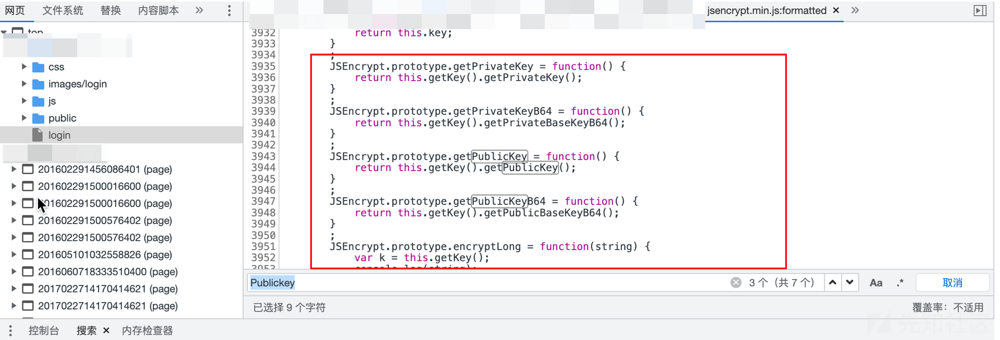](https://xzfile.aliyuncs.com/media/upload/picture/20240226090709-5da5f446-d443-1.png)

但是我们在相关函数下断点并不会经过。最后我们在 JSEncrypt.prototype.encryptLong 函数中下断点，跟进关键加密流程。

```plain
JSEncrypt.prototype.encryptLong = function(string) {
            var k = this.getKey();
            try {
                var ct = "";
                var bytes = new Array();
                bytes.push(0);
                var byteNo = 0;
                var len, c;
                len = string.length;
                var temp = 0;
                for (var i = 0; i < len; i++) {
                    c = string.charCodeAt(i);
                    if (c >= 0x010000 && c <= 0x10FFFF) {
                        byteNo += 4;
                    } else if (c >= 0x000800 && c <= 0x00FFFF) {
                        byteNo += 3;
                    } else if (c >= 0x000080 && c <= 0x0007FF) {
                        byteNo += 2;
                    } else {
                        byteNo += 1;
                    }
                    if ((byteNo % 117) >= 114 || (byteNo % 117) == 0) {
                        if (byteNo - temp >= 114) {
                            bytes.push(i);
                            temp = byteNo;
                        }
                    }
                }
                if (bytes.length > 1) {
                    for (var i = 0; i < bytes.length - 1; i++) {
                        var str;
                        if (i == 0) {
                            str = string.substring(0, bytes[i + 1] + 1);
                        } else {
                            str = string.substring(bytes[i] + 1, bytes[i + 1] + 1);
                        }
                        var t1 = k.encrypt(str);
                        ct += t1;
                    }
                    ;if (bytes[bytes.length - 1] != string.length - 1) {
                        var lastStr = string.substring(bytes[bytes.length - 1] + 1);
                        ct += k.encrypt(lastStr);
                    }
                    return hex2b64(ct);
                }
                var t = k.encrypt(string);
                var y = hex2b64(t);
                return y;
            } catch (ex) {
                return false;
            }
        }
        ;
        JSEncrypt.version = "3.0.0-rc.1";
        return JSEncrypt;
    }());
```

在这里下断点

断点跟进，可以发现先进行了 RSA 加密，得到十六进制进行 base64 编码。

[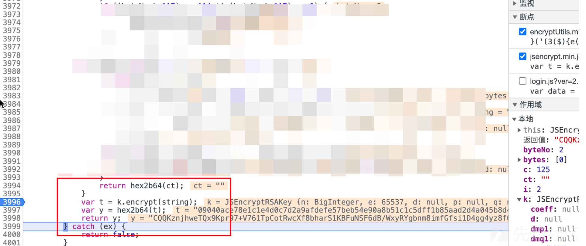](https://xzfile.aliyuncs.com/media/upload/picture/20240226090833-8fdd6160-d443-1.png)

继续跟进断点，发现跳转到 VM 虚拟机中。

[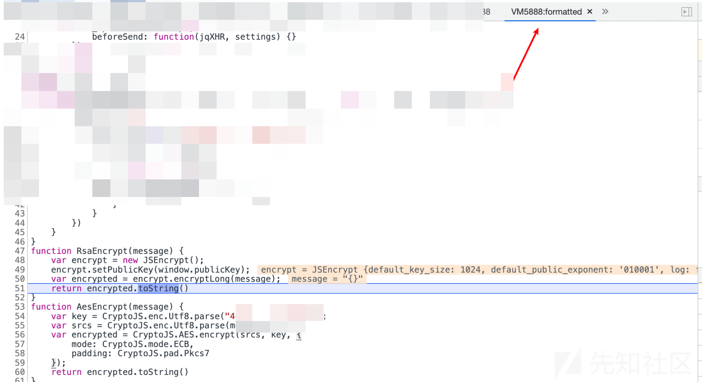](https://xzfile.aliyuncs.com/media/upload/picture/20240226090853-9b648bda-d443-1.png)  
两个加密函数一目了然

```plain
function RsaEncrypt(message) {
    var encrypt = new JSEncrypt();
    encrypt.setPublicKey(window.publicKey);
    var encrypted = encrypt.encryptLong(message);
    return encrypted.toString()
}
function AesEncrypt(message) {
    var key = CryptoJS.enc.Utf8.parse("xxxxxxxxxxx");
    var srcs = CryptoJS.enc.Utf8.parse(message);
    var encrypted = CryptoJS.AES.encrypt(srcs, key, {
        mode: CryptoJS.mode.ECB,
        padding: CryptoJS.pad.Pkcs7
    });
    return encrypted.toString()
}
```

核心代码为

```plain
(function($) {
    dynamicKey();
    var _ajax = $.ajax;
    $.ajax = function(opt) {
        if (opt.data != '' && opt.data != undefined) {
            var isEncrypt = new Object();
            var noEncrypt = new Object();
            if (opt.contentType == "application/json") {
                noEncrypt = opt.data
            } else {
                for (var index in opt.data) {
                    var arrayName = index;
                    if (opt.data[arrayName] != undefined && opt.data[arrayName].length > 460) {
                        noEncrypt[arrayName] = opt.data[arrayName]
                    } else {
                        isEncrypt[arrayName] = opt.data[arrayName]
                    }
                }
            }
            opt.data = noEncrypt;
            opt.data.keyScript = AesEncrypt(RsaEncrypt(JSON.stringify(isEncrypt)))
        }
        var _opt = $.extend(opt, {
            beforeSend: function(jqXHR, settings) {}
        });
        return _ajax(_opt)
    }
}
)(jQuery);
```

大体流程为

1、dynamicKey();动态生成 key。

2、将 keyScript 赋值为 aes、rsa 加密的结果。

opt.data.keyScript = AesEncrypt(RsaEncrypt(JSON.stringify(isEncrypt)))

3、dynamicKey 函数如下

```plain
function dynamicKey() {
    if (window.publicKey == undefined || window.publicKey == null || window.publicKey == '') {
        $.ajax({
            type: 'GET',
            async: false,
            url: Globals.ctx + "/xxxx/xxxxx",
            data: {
                nowDate: new Date()
            },
            success: function(data) {
                if (data.success) {
                    window.publicKey = data.body
                }
            }
        })
    }
}
```

一开始的 key 是通过动态调试获取的

[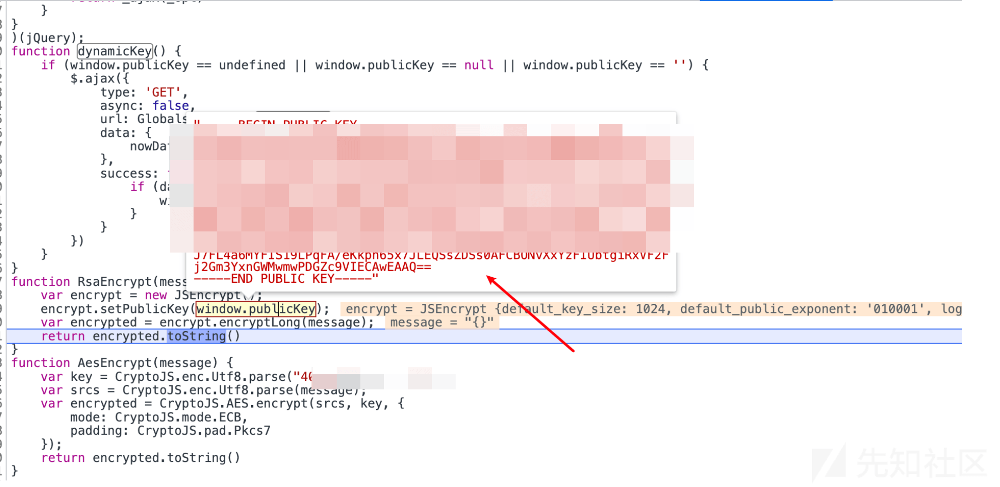](https://xzfile.aliyuncs.com/media/upload/picture/20240226091025-d2ccbb42-d443-1.png)

但是后续渗透发现，每次获取一个 key 都会发起一个请求包。

[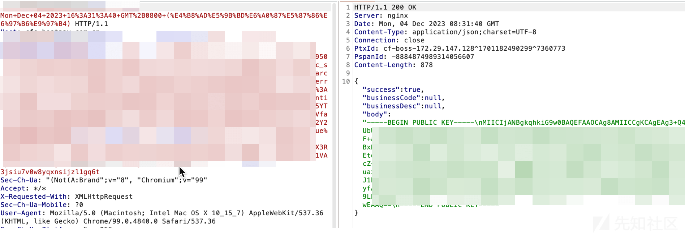](https://xzfile.aliyuncs.com/media/upload/picture/20240226091045-dea727e0-d443-1.png)

致此加密方式已经分析完毕。

### 原始数据获取

因为是通过 RSA 加密，我们无法拿到私钥无法进行解密。因为我们不知道请求发送的原始数据。只能根据公钥来加密数据，因此接下来就是获取原始数据。

之前我们发现一个函数 JSEncrypt.prototype.encryptLong，接受一个字符串，然后对该字符串进行加密，最后跳转到了 VM 虚拟机中的代码。

所以我们打印该 strings，查看是否是原始数据。

[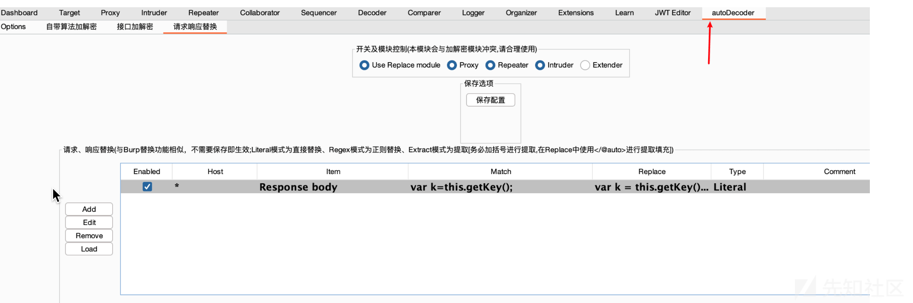](https://xzfile.aliyuncs.com/media/upload/picture/20240226091141-ff902ce0-d443-1.png)

在 burp 中使用插件，将 var k=this.getKey();替换为 var k = this.getKey();console.log(string);。最终的效果是可以在控制台中打印出原始数据。

[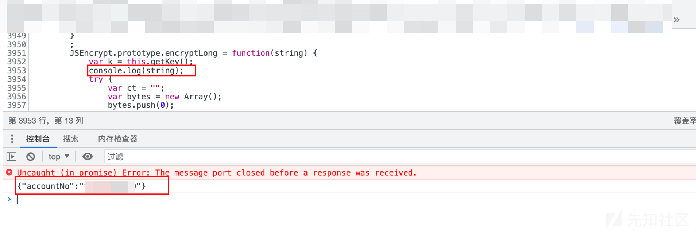](https://xzfile.aliyuncs.com/media/upload/picture/20240226091158-09a96e26-d444-1.png)

### 数据加密

接下来就是对数据进行加密，加密逻辑很简单：获取公钥-RSA 加密-AES 加密。AES 知道 iv、加密方式、key 比较简单。比较难得就是 RSA 加密。

首先网站使用了 vue 的 JSEncrypt 库。我们将整个 JSEncrypt 文件拷贝下来，使用工具对数据进行加密。

```plain
window = this;
navigator = this;
//以上两行主要是防止代码报错
(JSEncrypt 文件内容)
//加密函数直接使用网站自带的，然后自己把公钥贴上去就行。也可以引用网站的公钥获取函数，自动获取公钥匙。
function RsaEncrypt(message) {
    var encrypt = new JSEncrypt();
    encrypt.setPublicKey("-----BEGIN PUBLIC KEY-----\nx x x x x x x x x x x x x x\n-----END PUBLIC KEY-----");
    var encrypted = encrypt.encryptLong(message);
    return encrypted.toString()
}

console.log(RsaEncrypt("{\"id\":\"138652\"}"))
```

效果如图

[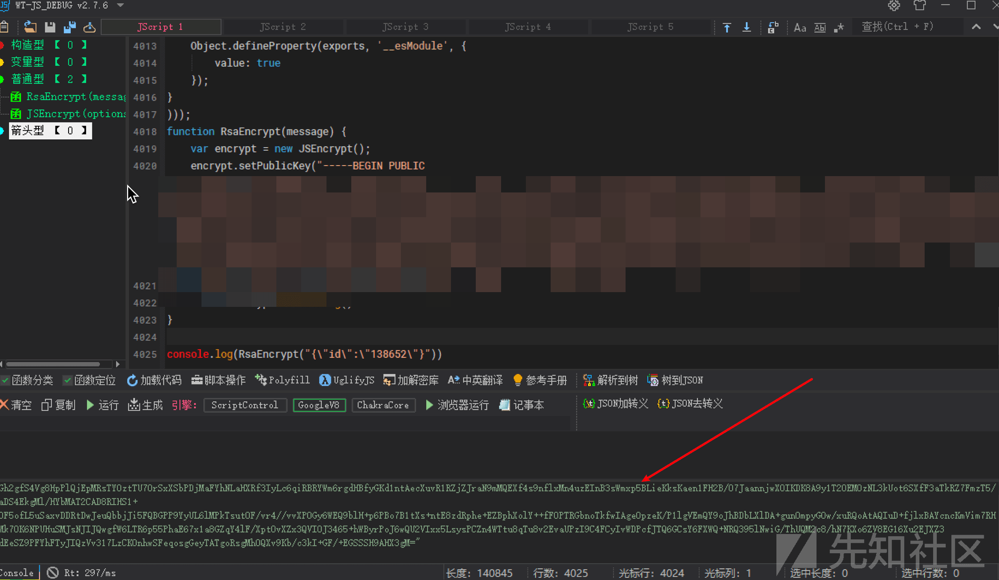](https://xzfile.aliyuncs.com/media/upload/picture/20240226091234-1f5dfaa2-d444-1.png)

### 自动化加密

在自动化加密的时候，需要调用 python 与 js。这里使用 execjs 库。最终代码如下

[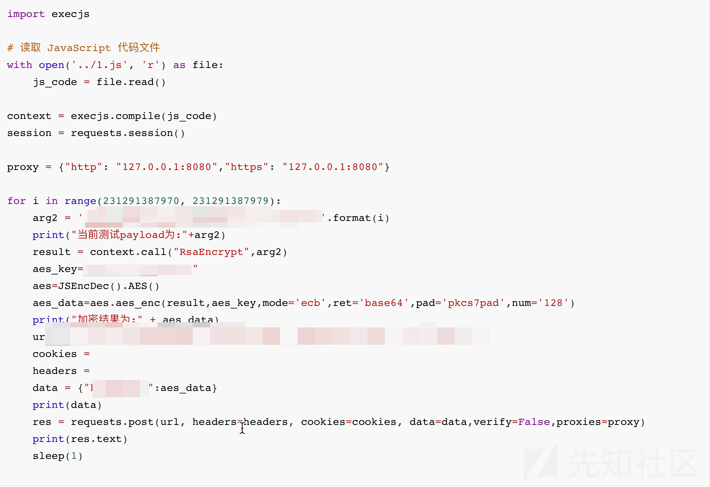](https://xzfile.aliyuncs.com/media/upload/picture/20240226093447-39eac7b2-d447-1.png)

### 漏洞挖掘

登陆后台之后，测试功能点在前端获取到加密之前的数据，然后通过 python 脚本进行加密发送请求进行测试，这里发现了两个越权，漏洞比较简单这里不在详细描述。
