# 从某堡垒机 FastjsonRCE 浅谈 Fastjson 漏洞利用 - 先知社区

从某堡垒机 FastjsonRCE 浅谈 Fastjson 漏洞利用

- - -

# 路由分析

查看 web.xml 配置文件，可以发现程序基于 spring MVC 框架，通过`DispatcherServlet` 会加载指定的配置文件，其中/WEB-INF/spring-servlet.xml 中。在 Spring 框架中，DispatcherServlet 扮演前端控制器的角色，负责接收 HTTP 请求并将其转发到相应的处理器。`spring-servlet.xml`文件中的配置就是告诉 DispatcherServlet 如何进行这些操作。  
[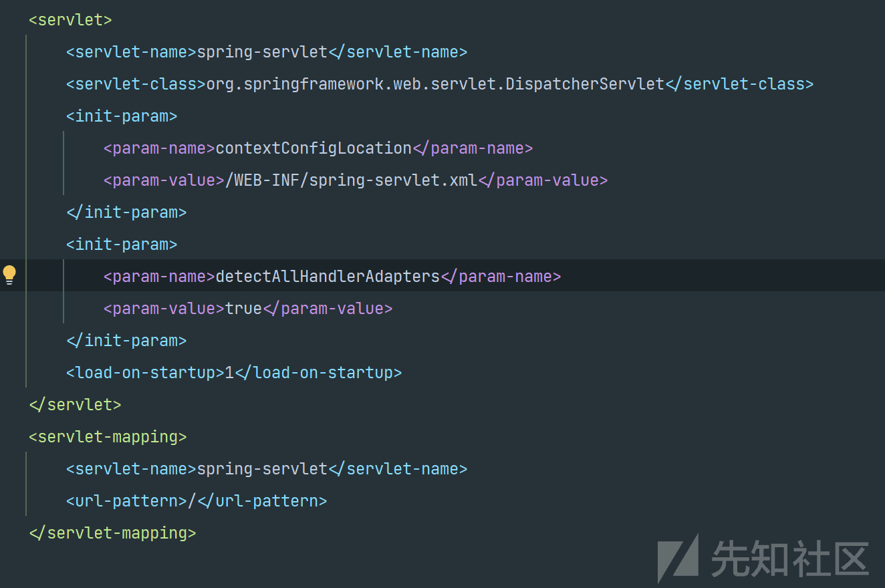](https://xzfile.aliyuncs.com/media/upload/picture/20240131161438-c6b9b522-c010-1.png)  
查看`spring-servlet.xml`配置文件，可以发现其中定义了不少拦截器，程序主要的鉴权逻辑都定义在拦截器中。这里可以发现处理是否登陆的拦截器，拦截所有/3.0 路由下的请求，同时对于/3.0/authService/**和/3.0/fileService/download/rootCert，/3.0/fileService/downloadPublic/**的请求不进行拦截。

[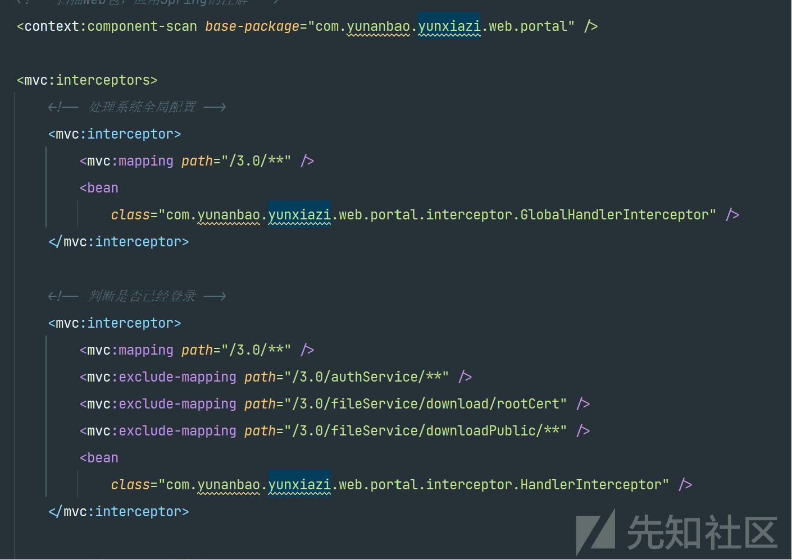](https://xzfile.aliyuncs.com/media/upload/picture/20240131161457-d23d4c88-c010-1.png)

也就是这些接口我们是可以未授权访问的，这也是后续利用的一个重要点。

# 反序列化漏洞点寻找

Fastjson 反序列化漏洞成因，简单说就是 json 字符串在反序列化时，parse 触发了 set 方法，parseObject 同时触发了 set 和 get 方法，由于存在这种`autoType`特性。如果`@type`标识的类中的 setter 或 getter 方法存在恶意代码，那么就有可能存在 fastjson 反序列化漏洞。

寻找漏洞点，就是寻找将 json 反序列化为类的方法。将 json 数据反序列化时常使用的方法为`parse()`、`parseObject()`、`parseArray()`，这三个方法。其中也有若干重载方法，简单介绍一些常用的。

## 常见方法

`parse()`常见的重载方法：

1、`parse(String text)`: 解析 JSON 字符串，返回一个`Object`类型，通常是`JSONObject`或`JSONArray`

```plain
Object object = JSON.parse(jsonString);
```

2、 `parse(String text, Feature... features)`: 解析 JSON 字符串，使用指定的反序列化特性。

```plain
Object object = JSON.parse(jsonString, Feature.AllowComment, Feature.AllowSingleQuotes);
```

3、 `parse(InputStream is, Charset charset, Feature... features)`: 从`InputStream`解析 JSON 数据，使用指定的字符集和反序列化特性。

```plain
Object object = JSON.parse(inputStream, StandardCharsets.UTF_8, Feature.AllowComment);
```

`parseObject` 方法常见的重载方法：

4、`parseObject(String text, Class<T> clazz)`: 将 JSON 字符串解析成指定类的对象。

```plain
MyType obj = JSON.parseObject(jsonStr, MyType.class);
```

5、`parseObject(String text, TypeReference<T> typeReference)`: 用于解析具有泛型信息的对象，如 List<mytype>。</mytype>

```plain
List<MyType> list = JSON.parseObject(jsonStr, new TypeReference<List<MyType>>(){});
```

6、`parseObject(String text, Type type, Feature... features)`: 除了指定要解析到的类型，还可以指定解析的特性。

```plain
MyType obj = JSON.parseObject(jsonStr, MyType.class, Feature.AllowComment);
```

7、`parseObject(String text, Type type, ParseProcess processor, Feature... features)`: 在解析的同时，可以通过实现`ParseProcess`接口来自定义处理解析过程。

```plain
MyType obj = JSON.parseObject(jsonStr, MyType.class, myParseProcess, Feature.AllowComment);
```

8、`parseObject(String input, Class<T> clazz, Feature... features)`: 允许在解析到指定类的对象时使用特定的解析特性。

```plain
MyType obj = JSON.parseObject(jsonStr, MyType.class, Feature.AllowSingleQuotes);
```

9、`parseObject(String input, Class<T> clazz, ParseProcess processor, Feature... features, int featureValues)`: 提供了更加详细的解析控制，可以指定特性、自定义处理器以及特性值。

```plain
MyType obj = JSON.parseObject(jsonStr, MyType.class, myParseProcess, new Feature[]{Feature.AllowComment}, Feature.config(Feature.AllowComment, true));
```

10、 `parseObject(String text, Class<T> clazz, ParserConfig config, Feature... features)`: 允许传入一个`ParserConfig`配置对象，进一步自定义解析过程。

```plain
MyType obj = JSON.parseObject(jsonStr, MyType.class, parserConfig, Feature.AllowComment);
```

以上方法涵盖了从简单到复杂的各种 JSON 字符串到 Java 对象的解析需求。选择合适的方法可以帮助开发者更准确地控制解析行为，并解决特定场景下的反序列化问题。

`parseArray` 常见的重载方法：

11、`parseArray(String text, Class<T> clazz)`: 将 JSON 字符串解析成一个指定类型对象的`List`集合。

```plain
List<MyType> list = JSON.parseArray(jsonStr, MyType.class);
```

12、`parseArray(String text, Type[] types)`: 解析 JSON 字符串为一个`List`集合，其中可以包含多种类型的对象。

```plain
List<Object> list = JSON.parseArray(jsonStr, new Type[]{String.class, MyType.class});
```

当我们打不同利用链时，对于服务端使用的反序列化方法，有时会不同的要求

## Fastjson 版本确定

在白盒审计中，我们可以通过直接查看 lib 库确定当前程序的 fastjson 版本，比如当前程序版本为 1.2.38，存在漏洞。

[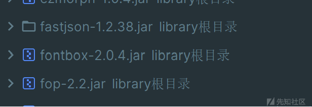](https://xzfile.aliyuncs.com/media/upload/picture/20240131161603-f979648a-c010-1.png)

但在黑盒中，无法直接接触代码环境，只能通过盲打测试，网上很多文章这里就不多做解释了。

## 反序列化点寻找

我们可以搜索`parse()`、`parseObject()`、`parseArray()`，这三个方法快速定位到存在将 json 字符串反序列化的方法，再结合路由分析，寻找到未授权的存在反序列化方法点。这里我们通过搜索`parseObject`方法，可以发现 5 个存在反序列化的利用点。

[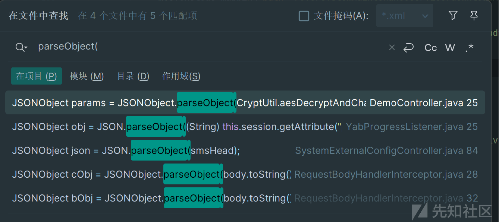](https://xzfile.aliyuncs.com/media/upload/picture/20240131161527-e3decd18-c010-1.png)

其中 RequestBodyHandlerInterceptor 类中的 preHandle 方法使用，`preHandle`方法：这是实现自`HandlerInterceptor`接口的方法。它在处理 Http 请求之前被调用。会接收三个参数

-   `HttpServletRequest request`：代表当前的 HTTP 请求。
    
-   `HttpServletResponse response`：代表当前的 HTTP 响应。
    
-   `Object handler`：处理当前请求的处理器。
    

在`parseObject`方法调用前，先使用`GblPubFunc.isEmptyString(body)`方法检查请求体是否不为空。`body.toString()`将请求头转换成 string 类型，然后`parseObjec`将一个 JSON 格式的字符串转换为一个`JSONObject`对象，然后`getJSONObject`提取对象中名为`"c"`键的字段。当`parseObjec`执行时我们反序列化的目的已经达成是否存在 c 键，不影响我们反序列化的利用。

[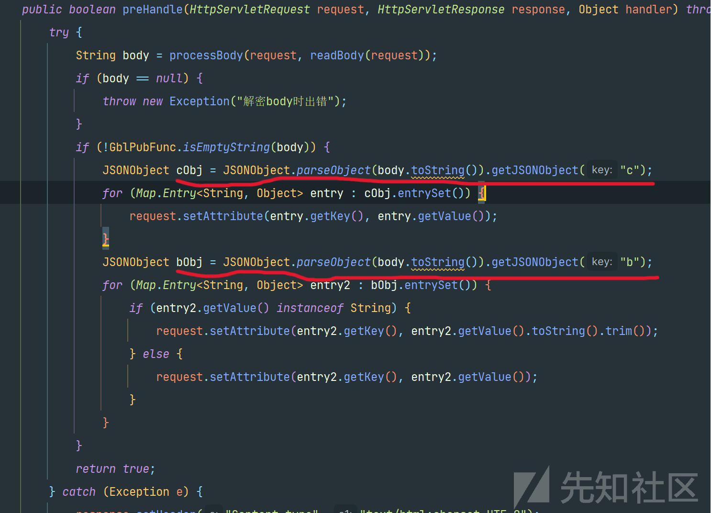](https://xzfile.aliyuncs.com/media/upload/picture/20240131161626-07778ef4-c011-1.png)

同时我们可以发现`RequestBodyHandlerInterceptor`类是一个拦截器（Interceptor）（拦截器（Interceptor）在 Spring 框架中是一个独立于具体业务的组件，它可以被配置为在特定的请求被处理之前、之后或完成之后执行。是否需要登录才能触发拦截器取决于拦截器的配置和它所拦截的 URL 模式。）在 Spring 框架中，`HandlerInterceptor`接口定义了三个方法，允许你在请求的不同点进行拦截，而`preHandle`方法就是在请求处理之前调用。

这里我们只需要寻找哪些请求会先经过 RequestBodyHandlerInterceptor 拦截器，同时我们需要注意到在 Spring XML 配置文件中拦截器的触发顺序会与它们在`<mvc:interceptors>`元素中被声明的顺序相同。在处理请求的时候，拦截器会按照这个顺序执行它们的`preHandle`方法，如果所有的`preHandle`方法都返回`true`，请求才会继续处理，然后在请求完成后，这些拦截器的`postHandle`和`afterCompletion`方法将会按照相反的顺序被调用。

所以请求需要通过在`RequestBodyHandlerInterceptor`中之前定义的拦截器。`RequestBodyHandlerInterceptor`拦截/3.0/authService/\*\*请求

[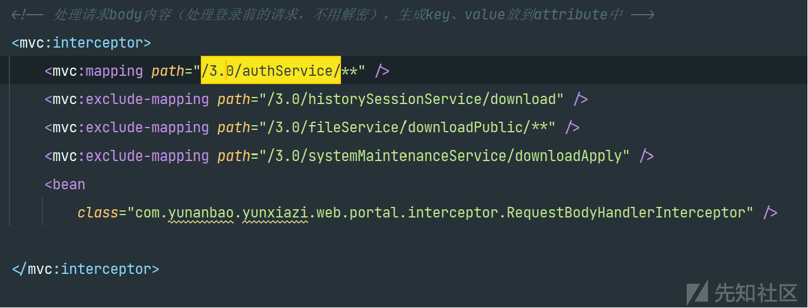](https://xzfile.aliyuncs.com/media/upload/picture/20240131161649-14d399f8-c011-1.png)

同时我们可以发现在前面的登陆校验以及授权校验，/3.0/authService/\*\*都被排除在外。

[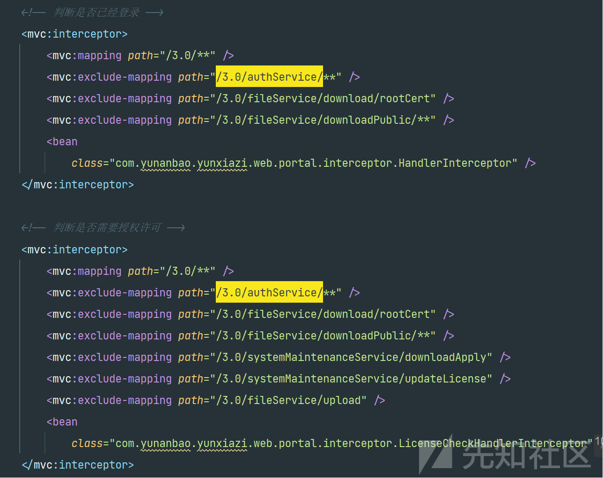](https://xzfile.aliyuncs.com/media/upload/picture/20240131161707-1f952546-c011-1.png)

所以任意/3.0/authService/\*\*的请求都会触发`RequestBodyHandlerInterceptor`拦截器同时进行 json 的反序列化，我们只需要找到利用链便可以达到未授权 RCE 的目的。

Fastjson 这个反序列化漏洞中原生利用链是使用`TemplatesImpl`和`JdbcRowSetImpl`构造恶意代码实现命令执行，其中`TemplatesImpl`这个类，他的内部使用的是类加载器，去进行 new 一个对象，这时候定义的恶意代码在静态代码块中，就会被执行。而`JdbcRowSetImpl`是需要利用到 JNDI 注入来实现攻击，需要出网。而 Fastjson 中使用`TemplatesImpl`链的条件也比较苛刻，因为在 Fastjson 中需要加入`Feature.SupportNonPublicField`（只要在启用 `Feature.SupportNonPublicField` 特性时，Fastjson 将能够访问和处理那些非公开（non-public，即私有 private 或者受保护 protected）的字段。），也就是前面提到的可以指定解析的特性的重载方法，而这种方式并不多见。

但我们也可以利用非原生利用链，也就是调用在 classpath 下的其他存在反序列化漏洞的利用链。这里我们可以发现存在 c3p0，C3P0 是一个开源的`JDBC`连接池，hibernate 自带的连接池就是 c3p0。

[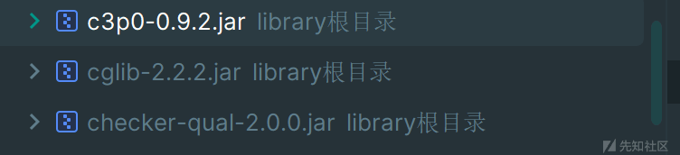](https://xzfile.aliyuncs.com/media/upload/picture/20240131161725-2a803716-c011-1.png)

其中 C3P0 的利用也分为 URLClassLoader 链，JndiRefForwardingDataSource 类和 BeanFactory 类，WrapperConnectionPoolDataSource 类，其中除了 WrapperConnectionPoolDataSource 类都属于 jndi 注入，而 BeanFactory 是通过当 Reference 对象的 classFactoryLocation 为 null 的时候，就不会加载远程字节码，而是直接加载本地字节码的方式达到不出网。

这里我们直接使用 WrapperConnectionPoolDataSource 类进行利用，成功执行命令。

[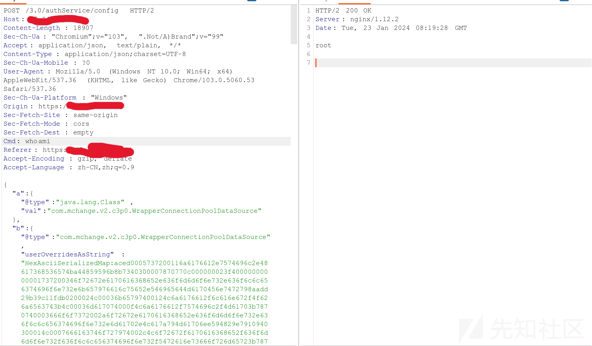](https://xzfile.aliyuncs.com/media/upload/picture/20240131161752-3a8d83de-c011-1.png)

网上公开的 poc 之针对 config 接口，但通过以上分析/3.0/authService/下所有接口都会执行 Fastjson 反序列化操作。

[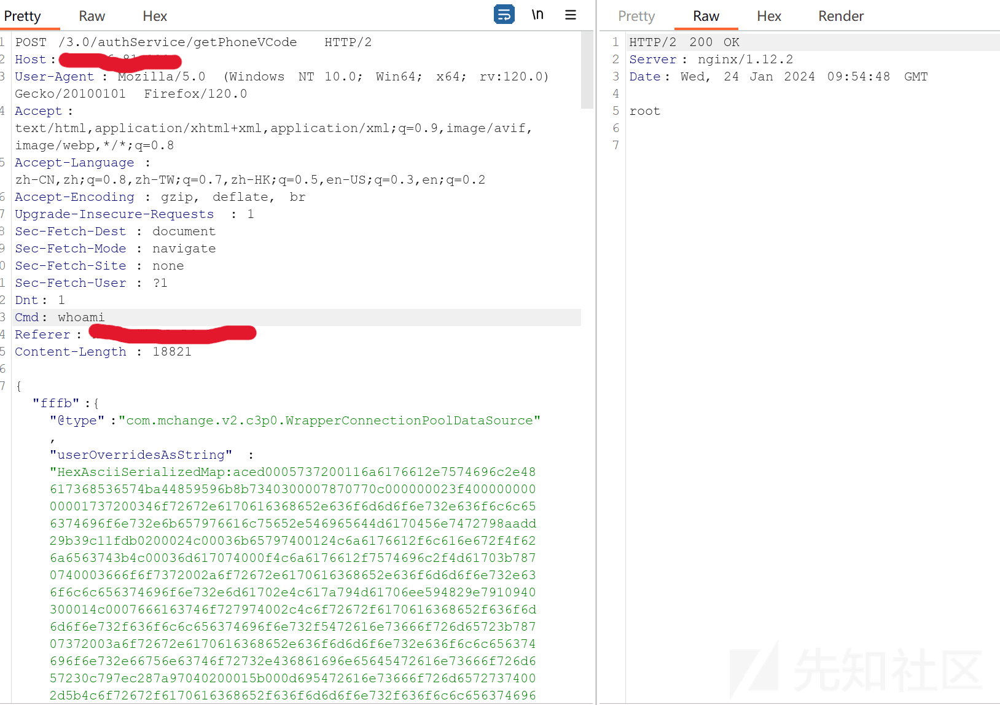](https://xzfile.aliyuncs.com/media/upload/picture/20240131161814-47cd2aea-c011-1.png)

[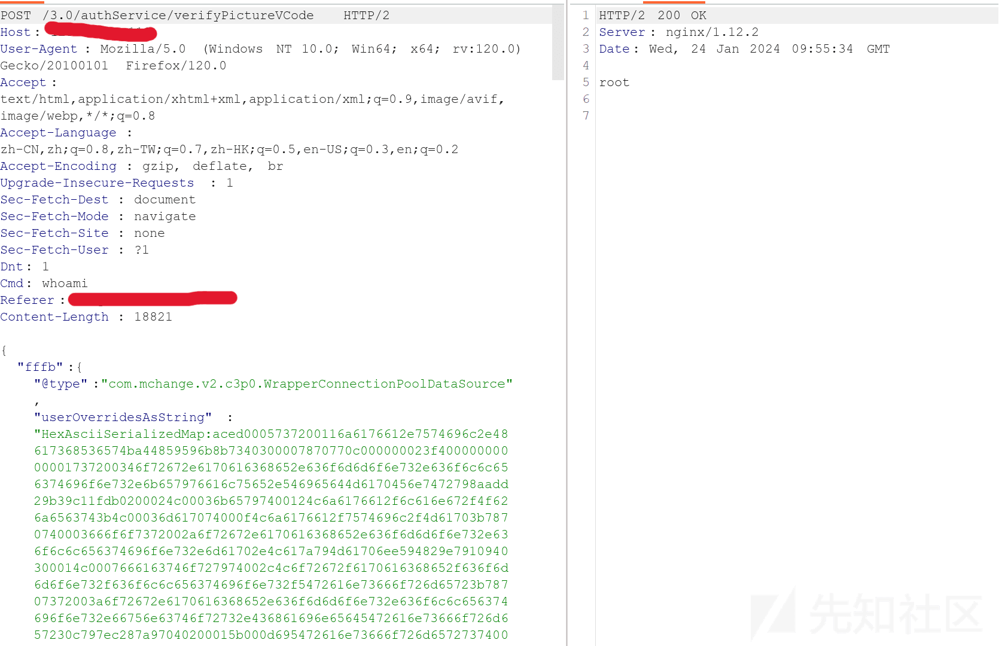](https://xzfile.aliyuncs.com/media/upload/picture/20240131180456-2fb4d4e4-c020-1.png)
