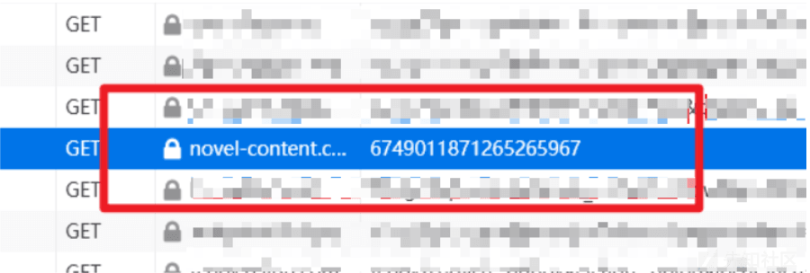
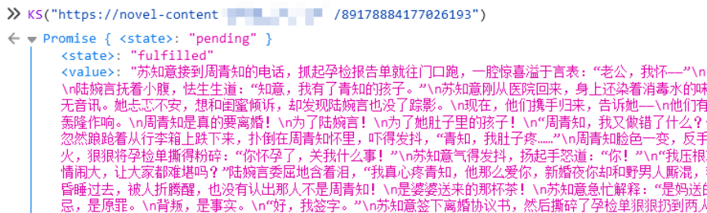
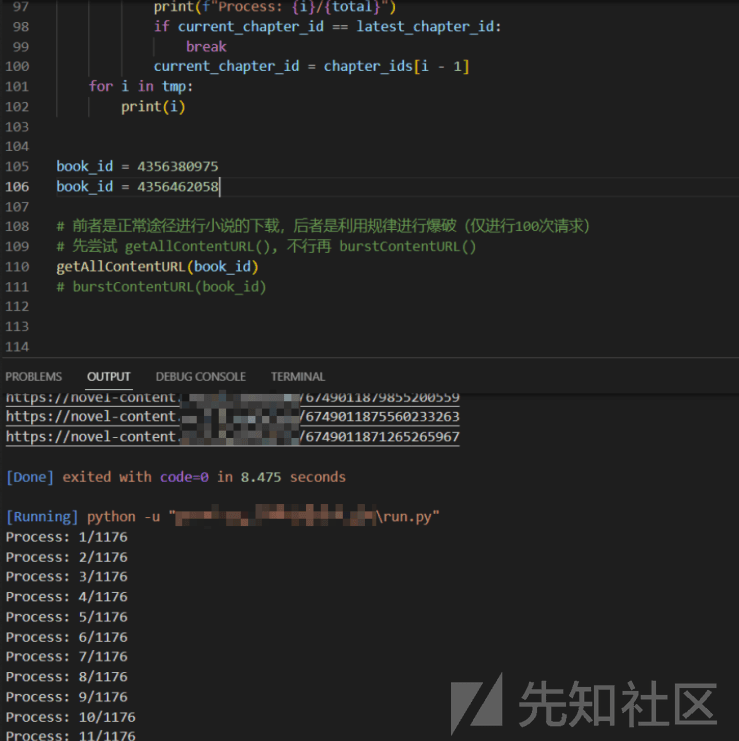
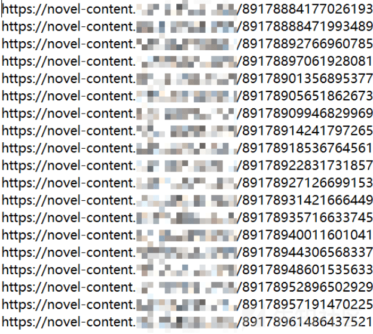
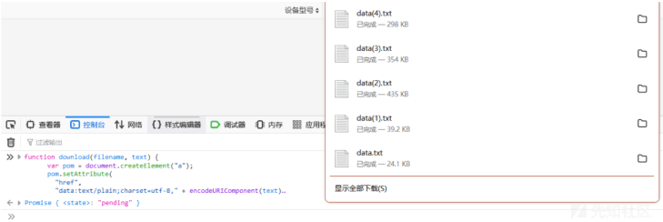
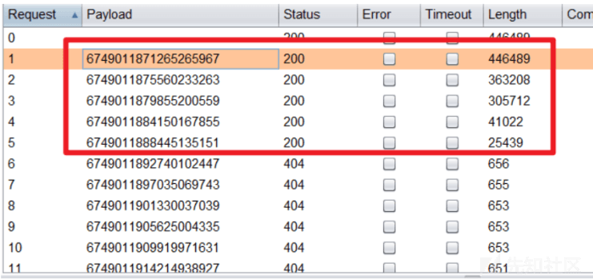
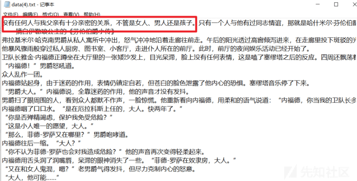

# 从简单的数字加减到发现 IDOR 漏洞 - 先知社区

从简单的数字加减到发现 IDOR 漏洞

- - -

### 前言

这次在挖掘这个漏洞的时候

真的遇到了各种各样的难题...

于是乎边挖边学，最后颇为艰难的完成了这次测试...

### 突发奇想

某天，我在翻看某某小说的时候，发现了这样一个 URL

然后访问下一章的时候，也会加载类似于这个的请求

于是乎我就在想，我可不可以通过遍历这个 URL 来获取小说的所有内容呢

包括免费的和付费的

但当我去查看这个请求响应的内容时，发现全是乱码...

看起来好像被加密了（废话捏~）

我的第一反应是前端找解密函数，然后逆向 JS

看着眼前混淆了的密密麻麻的 JS，我强忍着不适

稍稍看了一下....

发现看不懂

然后就开始百度了

"JS 断点调试怎么弄？"

"如何逆向 JS 加密函数？"

"逆向 JS 的工具 推荐"

......

时间过去了两天，我学会了更多的前端 JS 调试技巧可还是解决不了一开始的问题

逆向不成，那我就正着来吧

于是我找到了个函数

我只需要将之前找到的那个 URL 传进去

它就会给我返回解密后的结果

不过由于我只懂得一点点点点 JS

所以我在调用这个函数的时候，还得设断点才行...

想要继续获取下一章小说的内容，我就得知道它的 URL

咋来的呢？

翻了翻，发现有个接口会返回这个 URL

而这个接口需要传入两个参数，一个是 bookId，还要个 chapterId

万幸的是，这两个 Id 都是纯数字，但不幸的是都很长

bookId 好找，遍历就好了，但 chapterId 就难搞了

小说前几章的 chapterId 都是 + 1 就行了

但后面的就开始魔幻起来了

没办法，我只能继续翻

翻到个返回下一章 chapterId 的接口

只需要 bookId 和 chapterId 就行

东西都齐了

在写脚本的过程中我突然发现

诶不对，我怎么知道这本书第一章的 chapterId 是啥呢

然后又去翻，在听书的功能点里找到了符合我要求的接口

最后写了个脚本跑了一跑这篇小说所有章节的 URL

跑出来的 URL

诶这又是一大堆数字...

作为一个密逃 & 推理爱好者，直觉告诉我这里面藏着点东西

我拿着第二行的数字减去第一行的数字，得到个 4294967296

然后我又拿着第三行的数字减去第一行的数字，还是 4294967296

？突然感觉遍历好像也不是不可能了

之前一直 +1+1 的跑全是 404

原来间隔有这么大啊...

同时 4294967296 还是 2 的 32 次方

不知道其中有没啥联系...

但我都跑出来小说的所有 URL

好像也不需要遍历了...

### 欲求不满

我又想了一想

即便我有办法获取小说的内容

但一篇一篇设断点看真的好麻烦

于是乎，我决定把小说的所有章节给下载下来我的勇气来源于我 22 年看过的一篇文章

参考：[https://www.jianshu.com/p/1d0f634f0c86](https://www.jianshu.com/p/1d0f634f0c86)

是讲用 JS 将 CNVD 漏洞库里共享的漏洞保存为 txt 文件到本地

它只需要将一段 JS 代码放到控制台里运行

然后就开始自动下载了

很帅，我也想学学

于是又开始捣鼓起来...

然后再一次认清自己的实力

决定还是改改就好了

一开始先是发现它使用的 FileSaver.js 用不了

JS 烂得一批的我也不懂咋 Debug

整了好久也没整出来...

那就重头搞吧

上网翻了翻

找到了个能用的 download.js

参考：[https://juejin.cn/post/6844903715132948494](https://juejin.cn/post/6844903715132948494)

写了个简单的 JS 调用下 download() 函数

发现下载的全是 \[PromiseResult\] （好像是，不记得了）

又查了好一阵子，才整出来

至于为啥没重命名...我能说我有尝试但不行嘛....

### 咦？这个咋不行

再拿本付费的书测一下

发现在跑的过程中，出现了一种全新的 URL 它的结尾不是数字，而是一串 32 位的数字 + 字母组合

猜是 md5，在线解密，失败，躺平

拿着去解密发现内容很少，是付费书籍每章节开头的预览部分

啊？这不行啊...

没了有用的 URL，那我就没办法下载到小说的全部内容了

......

此时，我想到了一开始的那串神秘数字 4294967296

我拿着这串数字，给这本付费书籍的正常 URL 的数字进行累加

一切都在 Bp 里实现，然后开始爆破

诶？后面竟然有内容？！

而且是全部章节的内容（总共是 5 章，所以出了 5 章的内容）

拿去用老办法解密下载了下，发现了先前看不了的内容

下载下来的

还是感觉挺神奇

当挖洞的时候思路不被自己的技术所局限

那就会在挖洞的过程中学到很多
