# 从管理协同软件到堡垒机的实战案例 - 先知社区

从管理协同软件到堡垒机的实战案例

- - -

## confluence 命令执行

[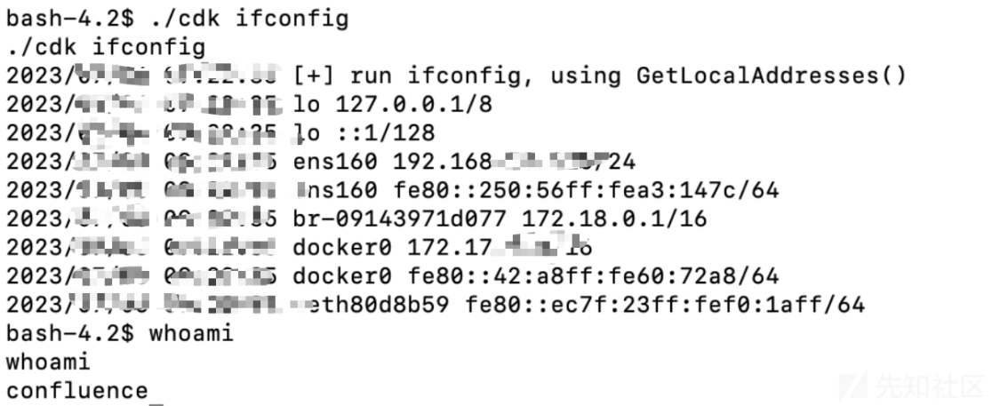](https://xzfile.aliyuncs.com/media/upload/picture/20240219212657-8de308ba-cf2a-1.png)  
添加 confluence 管理员

[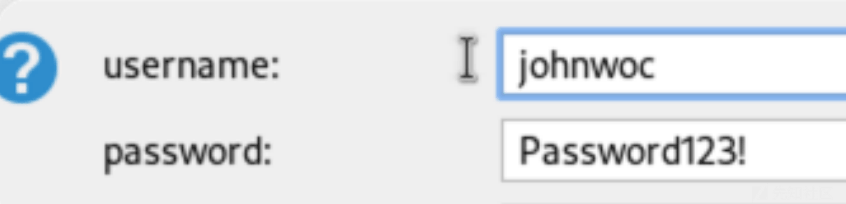](https://xzfile.aliyuncs.com/media/upload/picture/20240219212712-97537cc2-cf2a-1.png)  
进入后台

## 信息收集

[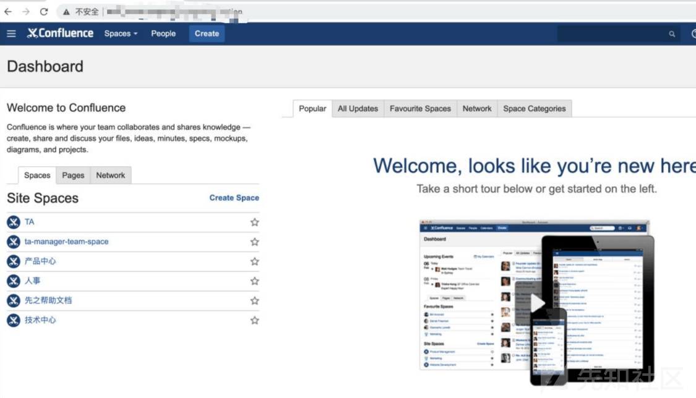](https://xzfile.aliyuncs.com/media/upload/picture/20240219212722-9cda2de4-cf2a-1.png)  
文档给了大量的账户密码，发现密码许多 xxxx.2018，在对应加一些年份作为密码本

[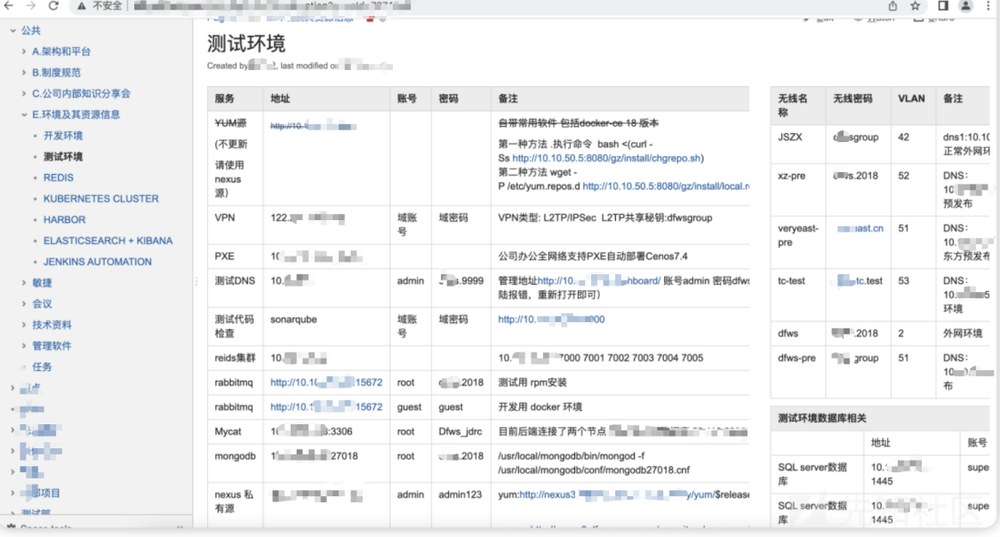](https://xzfile.aliyuncs.com/media/upload/picture/20240219212732-a3454cfe-cf2a-1.png)

## 突破逻辑隔离

192.168-->10

[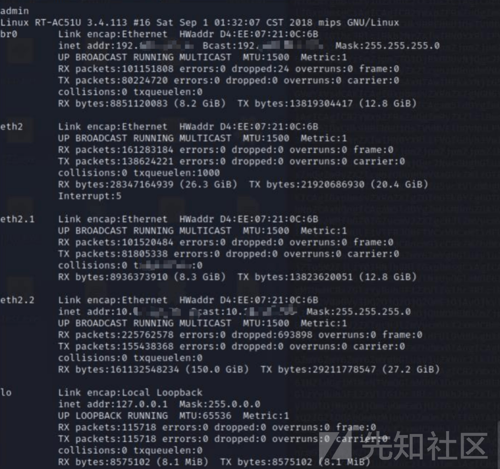](https://xzfile.aliyuncs.com/media/upload/picture/20240219212801-b3fe66d4-cf2a-1.png)

## WEB

结合上面搜索到的密码本，拿下多个平台 (rebbitMQ、OSS)、及多台设备 SSH 权限、大量数据库  
root/xxxx.2018

[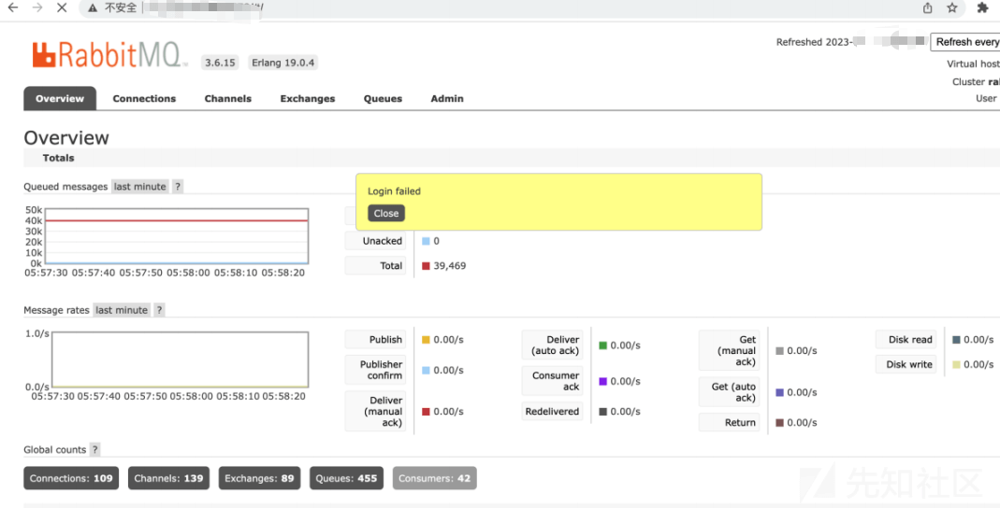](https://xzfile.aliyuncs.com/media/upload/picture/20240219212818-be324364-cf2a-1.png)

[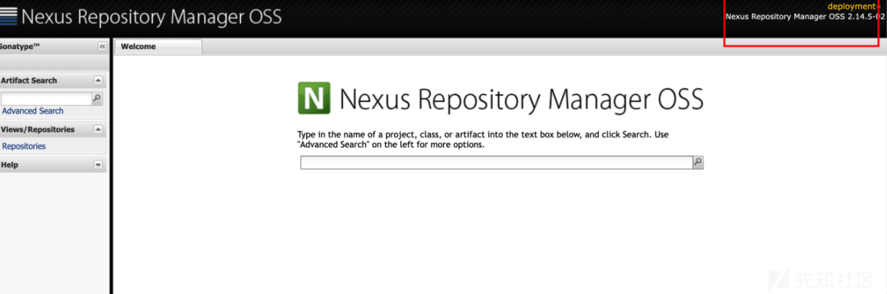](https://xzfile.aliyuncs.com/media/upload/picture/20240219212821-c01d6398-cf2a-1.png)  
未授权 + 弱口令拿下多个平台 (jenkins、druid、solr、swagger、任务调度中心)

[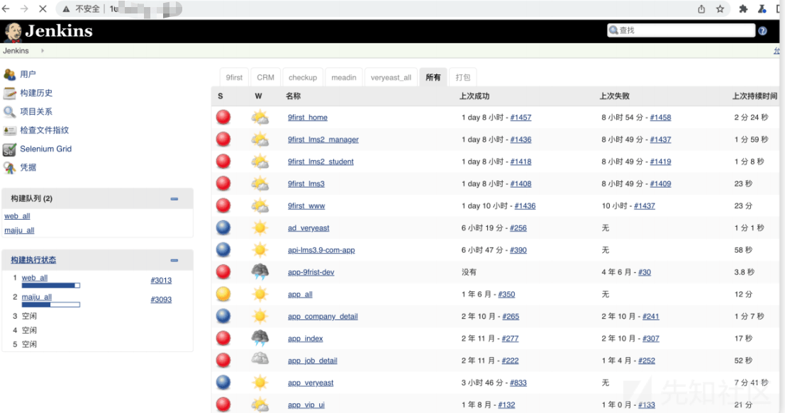](https://xzfile.aliyuncs.com/media/upload/picture/20240219212831-c602a4b2-cf2a-1.png)

[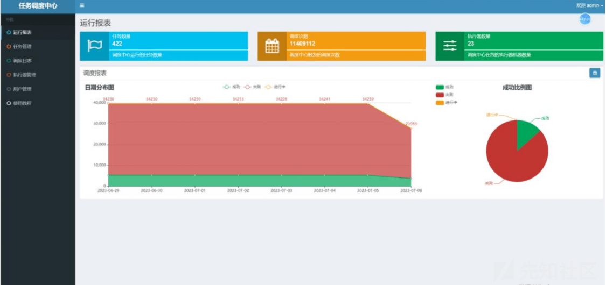](https://xzfile.aliyuncs.com/media/upload/picture/20240219212834-c815ce1e-cf2a-1.png)  
拿数据库未授权等权限

[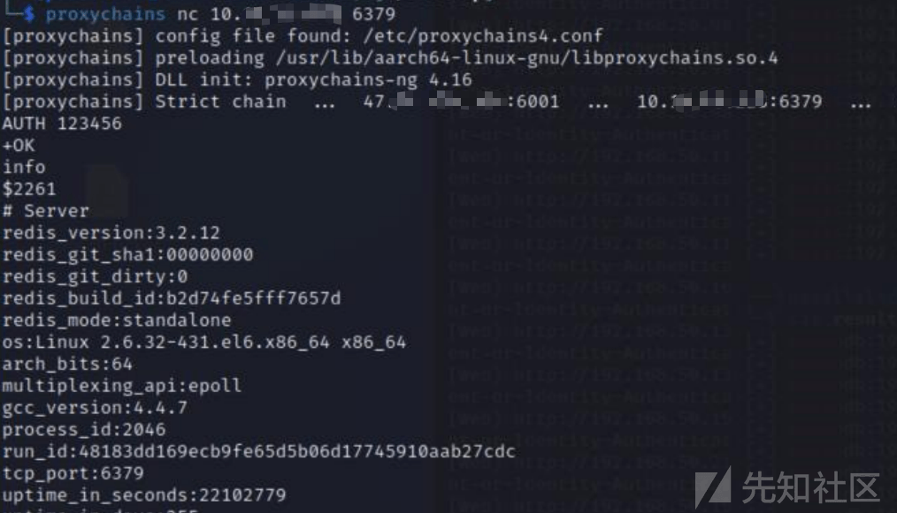](https://xzfile.aliyuncs.com/media/upload/picture/20240219212843-cd8dc284-cf2a-1.png)

## JumpServer 堡垒机

密码本拿到 ssh 权限后，找后台配置文件

[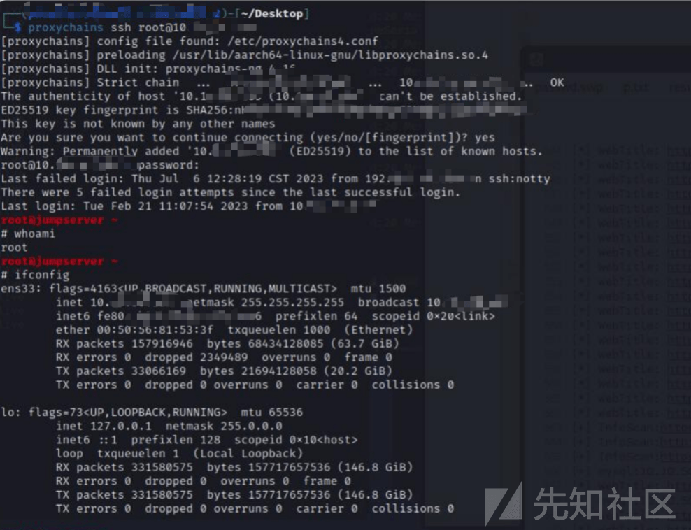](https://xzfile.aliyuncs.com/media/upload/picture/20240219212913-df14ddee-cf2a-1.png)  
拿到 password 第一时间没解开，想到可以通过 accesskey 调用 api 访问堡垒机新增账号

[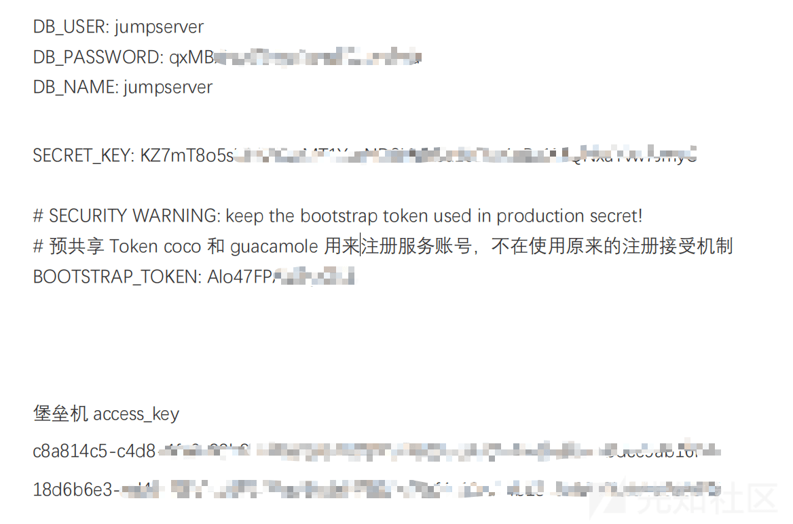](https://xzfile.aliyuncs.com/media/upload/picture/20240219212925-e66591e2-cf2a-1.png)

[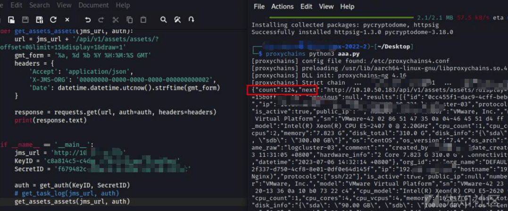](https://xzfile.aliyuncs.com/media/upload/picture/20240219212932-eaaf2fba-cf2a-1.png)  
后拿到后台 100+ 服务器

[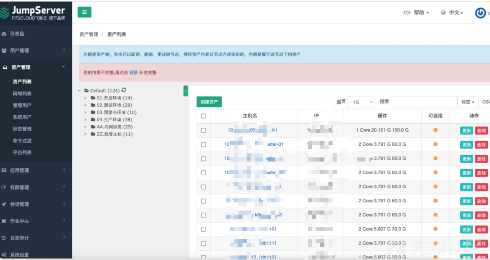](https://xzfile.aliyuncs.com/media/upload/picture/20240219212944-f181d450-cf2a-1.png)  
接下来就是不断翻配置文件，找数据库中敏感数据，反反复复，分自在其中。
