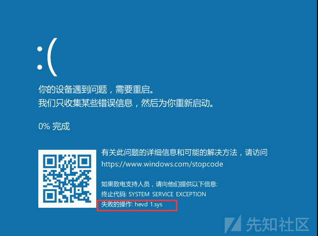

# 从零探索现代 windows 内核栈溢出 - 以 HEVD 练习为例（上） - 先知社区

从零探索现代 windows 内核栈溢出 - 以 HEVD 练习为例（上）

- - -

# 0\. 前置环境

更基础

-   WIndows10 Vmware 虚拟机
-   Visual Studio 2019，有 WDK
-   Windbg Preview（我用单纯是觉得更好看）
-   最重要的 HEVD 项目：[https://github.com/hacksysteam/HackSysExtremeVulnerableDriver](https://github.com/hacksysteam/HackSysExtremeVulnerableDriver)  
    我直接下载的 3.00 Release 版

我使用的 Windows 版本是

[](https://xzfile.aliyuncs.com/media/upload/picture/20240122123147-279feb92-b8df-1.png)

## I. 编程环境

**如果你想快速搭建一个驱动开发环境可以参考 B 站上的一些资料**，如：[配置驱动开发环境](https://www.bilibili.com/video/BV1wY4y1n77F)  
如果按照步骤 vs 没有`KernelModDriver`这一模板，找到 vs 目录的`WDK.vsix`双击即可

一段驱动的主要代码，在`main.cpp`中编写

```plain
#include <ntifs.h>
#include "win10.h"
#include "x64.h"

VOID
DriverUnload(PDRIVER_OBJECT DriverObject)
{
    UNREFERENCED_PARAMETER(DriverObject);
    DbgPrint("Driver Stopping -> %wZ\n", &DriverObject->DriverName);
}

NTSTATUS
DriverEntry(PDRIVER_OBJECT  DriverObject, PUNICODE_STRING RegistryPath)
{
    UNREFERENCED_PARAMETER(RegistryPath);

    DbgPrint("Driver Running -> %wZ\n", &DriverObject->DriverName);
    DriverObject->DriverUnload = DriverUnload;
    return STATUS_SUCCESS;
}
```

规定了驱动加载和卸载的两个函数，并在加载和卸载时打印调试信息

[](https://xzfile.aliyuncs.com/media/upload/picture/20240122123235-443ab7dc-b8df-1.png)

## II. 调试环境

### 传统串口调试

添加串口

[](https://xzfile.aliyuncs.com/media/upload/picture/20240122123316-5cae96e4-b8df-1.png)

在虚拟机中 Win+R 召唤`msconfig`，打开允许串口调试

[](https://xzfile.aliyuncs.com/media/upload/picture/20240122123340-6b22de92-b8df-1.png)

然后在（记得用管理员打开）windbg 中按照图中配置即可，其他选项不变

[](https://xzfile.aliyuncs.com/media/upload/picture/20240122123353-72c91a26-b8df-1.png)

一直找不到管道的话可以点 Break 再等会儿就有了

[](https://xzfile.aliyuncs.com/media/upload/picture/20240122123412-7dd02fcc-b8df-1.png)

### VirtualKD 法调试

项目链接：[http://virtualkd.sysprogs.org/](http://virtualkd.sysprogs.org/)

安装后，`vmmon64.exe`就行了

但是用了就不能用串口调试了

[](https://xzfile.aliyuncs.com/media/upload/picture/20240122123428-87bfcd44-b8df-1.png)

### 打开信息显示+DbgView

在`\HKEY_LOCAL_MACHINE\SYSTEM\CurrentControlSet\Control\Session Manager\`注册表中添加`Debug Print Filter`，并设置一个`Default`的`DWORD`值，你可以将其设置为`0x8`或者允许更多调试信息的`0xf`

[](https://xzfile.aliyuncs.com/media/upload/picture/20240122123440-8ed3b816-b8df-1.png)

虽然说 windbg 确实能打印出`DbgPrint`，但是 HEVD 使用的是`DbgPrintEx`，接受不到，安装了 DbgView 后，他会把调试信息打印出了并且 windbg 也能收到

[](https://xzfile.aliyuncs.com/media/upload/picture/20240122123453-9624d924-b8df-1.png)

### 调试指令

如果出现了以下情况且虚拟机卡顿，可以使用这两个指令关闭输出

[](https://xzfile.aliyuncs.com/media/upload/picture/20240122123504-9cc6b2b6-b8df-1.png)

```plain
1: kd> ed nt!Kd_SXS_Mask 0
1: kd> ed nt!Kd_FUSION_Mask 0
```

**关闭这两个函数的输出，莫名其妙变卡的话再用一下**

## III. 驱动加载

使用 KmdManager.exe，毛子的黑科技，使用时需要管理员启动

也可以使用 osLoader 啥的

这里用 KmdKit 的 KmdManager 演示，运行 HEVD

[](https://xzfile.aliyuncs.com/media/upload/picture/20240122123517-a4bb5558-b8df-1.png)

[](https://xzfile.aliyuncs.com/media/upload/picture/20240122123544-b49018b0-b8df-1.png)

那么就算搭建成功

# A. 编程基础

关于内核模式驱动程序：[https://learn.microsoft.com/zh-cn/windows-hardware/drivers/kernel/](https://learn.microsoft.com/zh-cn/windows-hardware/drivers/kernel/)

内核中交互是通过`IRP`请求进行交互的

> **IRP** 结构是表示 *I/O 请求数据包*的部分不透明结构。 **IRP** 结构的未记录成员是保留的，仅由 I/O 管理器使用，在某些情况下，由文件系统驱动程序 (FSD) 使用。

MSDN：[https://learn.microsoft.com/zh-cn/windows-hardware/drivers/ddi/wdm/ns-wdm-\_irp](https://learn.microsoft.com/zh-cn/windows-hardware/drivers/ddi/wdm/ns-wdm-_irp)

使用到的内存堆栈为`I/O Stack`

> I/O 管理器为分层驱动程序链中的每个驱动程序提供其设置的每个 IRP 的 I/O 堆栈位置。每个 I/O 堆栈位置都包含 **一个 IO\_STACK\_LOCATION**结构。

MSDN：[https://learn.microsoft.com/zh-cn/windows-hardware/drivers/kernel/i-o-stack-locations](https://learn.microsoft.com/zh-cn/windows-hardware/drivers/kernel/i-o-stack-locations)

[](https://xzfile.aliyuncs.com/media/upload/picture/20240122123821-121b290c-b8e0-1.png)

IRP 通过 iostack 发送给设备，对应的是应用层的“消息”。设备可以存在（硬盘等），也可以不存在（QQ Protect 驱动等）。

根据上图，应用层通过和设备对象（FDO）进行交互，设备（PDO）再和设备对象交互，实现交互。同时 FDO 向 PDO 的交互不是必要的。

> ## HAL 硬件抽象层
> 
> HAL 通常是一个独立的动态链接库，windows 自身携带多种 HAL，但是在系统安装的时候只会选择一种，名为`hal.dll`。涉及中断控制器、单处理器/多处理器硬件断点。

[](https://xzfile.aliyuncs.com/media/upload/picture/20240122123836-1b6b1f80-b8e0-1.png)

# B. 代码

[](https://xzfile.aliyuncs.com/media/upload/picture/20240122123908-2e194ec2-b8e0-1.png)

### 创建设备

MSDN：[https://learn.microsoft.com/en-us/windows-hardware/drivers/kernel/device-tree](https://learn.microsoft.com/en-us/windows-hardware/drivers/kernel/device-tree)

使用 DeviceTree，可以找到：[https://web.archive.org/web/20200519214156/http://www.osronline.com/OsrDown.cfm/devicetree\_v230.zip](https://web.archive.org/web/20200519214156/http://www.osronline.com/OsrDown.cfm/devicetree_v230.zip)

[](https://xzfile.aliyuncs.com/media/upload/picture/20240122124004-4f7f83e2-b8e0-1.png)

```plain
UNICODE_STRING DeviceName = { 0 };          //设备名
    PDEVICE_OBJECT pDevice = NULL;              //设备对象
    RtlInitUnicodeString(&DeviceName, DEVICE_NAME);
    Status = IoCreateDevice(DriverObject, 0, &DeviceName, FILE_DEVICE_UNKNOWN, 0, TRUE, &pDevice);
    if (!NT_SUCCESS(Status)) {
        DbgPrint("Create Device Failed: %x\n", Status);
        return Status;
    }
```

### 创建符号链接

[](https://xzfile.aliyuncs.com/media/upload/picture/20240122124018-584c415e-b8e0-1.png)

[](https://xzfile.aliyuncs.com/media/upload/picture/20240122124029-5e80f2f4-b8e0-1.png)

符号链接就是类似与`Z:\`之前的前缀

使用`WinObj`可以看到，我用的再第一章中下载的`KdmKit`中的`SymLinks`（太老了，建议换一个）

[](https://xzfile.aliyuncs.com/media/upload/picture/20240122124116-7a67ab70-b8e0-1.png)

```plain
UNICODE_STRING SymLink = { 0 };
    RtlInitUnicodeString(&SymLink, SYM_NAME);
    Status = IoCreateSymbolicLink(&SymLink, &DeviceName);
    if (!NT_SUCCESS(Status)) {
        DbgPrint("Create Symbol Link Failed: %x\n", Status);
        IoDeleteDevice(pDevice);
        return Status;
    }
```

### 关联功能的交互

#### I. 创建“句柄”

[](https://xzfile.aliyuncs.com/media/upload/picture/20240122124220-a116488a-b8e0-1.png)

MSDN：[https://learn.microsoft.com/zh-cn/windows-hardware/drivers/gettingstarted/minidrivers-and-driver-pairs](https://learn.microsoft.com/zh-cn/windows-hardware/drivers/gettingstarted/minidrivers-and-driver-pairs)

具体调试方法也在上面的文档中

> 每个内核模式驱动程序都必须实现名为 [**DriverEntry**](https://learn.microsoft.com/zh-cn/windows-hardware/drivers/ddi/wdm/nc-wdm-driver_initialize) 的函数，该函数在加载驱动程序之后会立即得到调用。 **DriverEntry** 函数使用指向驱动程序实现的一些其他函数的指针来填充 [**DRIVER\_OBJECT**](https://learn.microsoft.com/zh-cn/windows-hardware/drivers/ddi/wdm/ns-wdm-_driver_object) 结构的某些成员。例如，**DriverEntry** 函数使用指向驱动程序的 **Unload** 函数的指针来填充 **DRIVER\_OBJECT** 结构的 [*Unload*](https://learn.microsoft.com/zh-cn/windows-hardware/drivers/ddi/wdm/nc-wdm-driver_unload) 成员

[](https://xzfile.aliyuncs.com/media/upload/picture/20240122124246-b0794a02-b8e0-1.png)

```plain
DriverObject->MajorFunction[IRP_MJ_CREATE] = MyCreate;
```

根据上面的文档，创建的函数和主函数`Entry`差不多，**这里用的是设备对象，不是驱动对象**

```plain
NTSTATUS 
MyCreate(PDEVICE_OBJECT pdevice, PIRP pIrp) {
    NTSTATUS RET = STATUS_SUCCESS;
    DbgPrint("My Device Has Opened\n");
    pIrp->IoStatus.Status = RET;
    pIrp->IoStatus.Information = 0;
    IoCompleteRequest(pIrp, IO_NO_INCREMENT);
    return RET;
}
```

#### II. 关闭“句柄”

```plain
DriverObject->MajorFunction[IRP_MJ_CLOSE] = MyClose;
    DriverObject->MajorFunction[IRP_MJ_CLEANUP] = MyClean;
```

```plain
NTSTATUS
MyClose(PDEVICE_OBJECT pdevice, PIRP pIrp) {
    NTSTATUS RET = STATUS_SUCCESS;
    DbgPrint("My Device Has Closed\n");
    pIrp->IoStatus.Status = RET;
    pIrp->IoStatus.Information = 0;
    IoCompleteRequest(pIrp, IO_NO_INCREMENT);
    return RET;
}

NTSTATUS
MyClean(PDEVICE_OBJECT pdevice, PIRP pIrp) {
    NTSTATUS RET = STATUS_SUCCESS;
    DbgPrint("My Device Has Clean\n");
    pIrp->IoStatus.Status = RET;
    pIrp->IoStatus.Information = 0;
    IoCompleteRequest(pIrp, IO_NO_INCREMENT);
    return RET;
}
```

[](https://xzfile.aliyuncs.com/media/upload/picture/20240122124309-be4316e0-b8e0-1.png)

[](https://xzfile.aliyuncs.com/media/upload/picture/20240122124323-c660941a-b8e0-1.png)

成功加载

#### III. 在 Ring3 进行交互

```plain
#include <iostream>
#include <windows.h>

int main()
{
    HANDLE hDevice = NULL;
    hDevice = CreateFileW(L"\\\\.\\My1DeviceLinker", GENERIC_READ | GENERIC_WRITE, 0, NULL, OPEN_EXISTING, FILE_ATTRIBUTE_NORMAL, NULL);
    if (hDevice== INVALID_HANDLE_VALUE) {
        std::cout << "Error Create File\n";
        system("pause");
        return 0;
    }
    std::cout << "Success open\n";
    system("pause");

    CloseHandle(hDevice);
    std::cout << "Success close\n";
    system("pause");
    return 0;
}
```

[](https://xzfile.aliyuncs.com/media/upload/picture/20240122124345-d394c016-b8e0-1.png)

# C. 二阶段

MSDN：[https://learn.microsoft.com/zh-cn/windows-hardware/drivers/ddi/wdm/nf-wdm-iocreatedevice](https://learn.microsoft.com/zh-cn/windows-hardware/drivers/ddi/wdm/nf-wdm-iocreatedevice)

关于创建设备的原型

```plain
NTSTATUS IoCreateDevice(
  [in]           PDRIVER_OBJECT  DriverObject,
  [in]           ULONG           DeviceExtensionSize,
  [in, optional] PUNICODE_STRING DeviceName,
  [in]           DEVICE_TYPE     DeviceType,
  [in]           ULONG           DeviceCharacteristics,
  [in]           BOOLEAN         Exclusive,
  [out]          PDEVICE_OBJECT  *DeviceObject
);
```

> ```plain
> [in] DeviceExtensionSize
> ```
> 
> 指定要为 [设备对象的设备扩展](https://learn.microsoft.com/zh-cn/windows-hardware/drivers/kernel/device-extensions) 分配的驱动程序确定的字节数。设备扩展的内部结构是驱动程序定义的。

-   维护设备状态信息。
-   为驱动程序使用的任何内核定义对象或其他系统资源（如旋转锁）提供存储。
-   保存驱动程序必须在系统空间中驻留的任何数据，以执行其 I/O 操作。

那么这就是一段描述要传输的数据的空间的大小的值。

### 从驱动中读取

驱动`MyRead`函数和`DriverEntry`

```plain
NTSTATUS
MyRead(PDEVICE_OBJECT pdevice, PIRP pIrp) {
    UNREFERENCED_PARAMETER(pdevice);
    NTSTATUS RET = STATUS_SUCCESS;
    DbgPrint("My Device Has Read\n");

    PIO_STACK_LOCATION pStack = IoGetCurrentIrpStackLocation(pIrp);
    ULONG ReadSize = pStack->Parameters.Read.Length;
    PCHAR Buffer = pIrp->AssociatedIrp.SystemBuffer;
    DbgPrint("Ring3 Want Read %x\n", ReadSize);
    RtlCopyMemory(Buffer, "Message From Driver", strlen("Message From Driver"));


    pIrp->IoStatus.Status = RET;
    pIrp->IoStatus.Information = strlen("Message From Driver");
    IoCompleteRequest(pIrp, IO_NO_INCREMENT);
    return RET;
}
```

R3

```plain
CHAR Test[0x40] = { 0 };
    DWORD lpRead = 0;
    ReadFile(hDevice, Test, 30, &lpRead, NULL);
    printf("%p -%s--%d\n", Test, Test,lpRead);
```

-   `30`是要读取的字节
-   `lpRead`是真实读取的字节

[](https://xzfile.aliyuncs.com/media/upload/picture/20240122124434-f0e32fea-b8e0-1.png)

每向下传递一层需要一个设备栈（可以试着从自己设计这样一个模式的角度想想）

`SystemBuffer`和`pIrp->MdlAddress`是同一块物理地址的两个不同虚拟地址（不同的映射）。

[](https://xzfile.aliyuncs.com/media/upload/picture/20240122124453-fbc5701c-b8e0-1.png)

需要设置读写方式

```plain
pDevice->Flags |= DO_BUFFERED_IO;
//设备创建成功，绑定符号链接
```

[](https://xzfile.aliyuncs.com/media/upload/picture/20240122124510-0657900a-b8e1-1.png)

### 向驱动中写入

R3

```plain
WriteFile(hDevice, "This is From Ring3.", strlen("This is From Ring3."), &lpRead, NULL);
```

驱动

```plain
NTSTATUS
MyWrite(PDEVICE_OBJECT pdevice, PIRP pIrp) {
    UNREFERENCED_PARAMETER(pdevice);
    NTSTATUS RET = STATUS_SUCCESS;
    DbgPrint("My Device Has Wrtitten\n");

    PIO_STACK_LOCATION pStack = IoGetCurrentIrpStackLocation(pIrp);
    ULONG ReadSize = pStack->Parameters.Write.Length;
    PCHAR Buffer = pIrp->AssociatedIrp.SystemBuffer;
    DbgPrint("Ring3 Write Read %x\n", ReadSize);

    RtlZeroMemory(pdevice->DeviceExtension, 200);
    RtlCopyMemory(pdevice->DeviceExtension, Buffer, ReadSize);
    DbgPrint("--%p-%s\n", Buffer, (PCHAR)pdevice->DeviceExtension);

    pIrp->IoStatus.Status = RET;
    pIrp->IoStatus.Information = strlen("Message From Driver");
    IoCompleteRequest(pIrp, IO_NO_INCREMENT);
    return RET;
}
```

[](https://xzfile.aliyuncs.com/media/upload/picture/20240122124533-13ad6fcc-b8e1-1.png)

### \[IOCTL\]自定义控制 IO

`IRP_MJ_DEVICE_CONTROL`，定义 IOCTL 操作，**很多内核的交互大多都是依靠此方式**

这里程序接收一个数字返回值 x2

驱动

定义操作标识

MSDN：[https://learn.microsoft.com/zh-cn/windows-hardware/drivers/ddi/d4drvif/nf-d4drvif-ctl\_code](https://learn.microsoft.com/zh-cn/windows-hardware/drivers/ddi/d4drvif/nf-d4drvif-ctl_code)

```plain
#define IOCTL_MUL CTL_CODE(FILE_DEVICE_UNKNOWN, 0x9888, METHOD_BUFFERED, FILE_ANY_ACCESS)
```

-   0x9888：标识符号

编写函数

```plain
NTSTATUS
MyControl(PDEVICE_OBJECT pdevice, PIRP pIrp) {
    UNREFERENCED_PARAMETER(pdevice);
    NTSTATUS RET = STATUS_SUCCESS;
    DbgPrint("My Device Has IOCTL\n");

    PIO_STACK_LOCATION pStack = IoGetCurrentIrpStackLocation(pIrp);
    ULONG ioCode = pStack->Parameters.DeviceIoControl.IoControlCode;   //功能码
    ULONG inLen = pStack->Parameters.DeviceIoControl.InputBufferLength;     //出入长度
    //ULONG outLen = pStack->Parameters.DeviceIoControl.OutputBufferLength;   //输出长度
    ULONG ioInfo = 0;
    switch (ioCode)
    {
    case IOCTL_MUL:
    {
        DWORDLONG inData = *(PDWORDLONG)pIrp->AssociatedIrp.SystemBuffer;   //取出传输的数据
        DbgPrint("Kernel Recive: %d, Len: %lld\n", inData, inLen);
        inData *= 2;
        DbgPrint("Kernel Data %d\n", inData);
        *(PDWORDLONG)pIrp->AssociatedIrp.SystemBuffer = inData;             //写回操作
        ioInfo = 4;
        break;
    }

    default:
        RET = STATUS_UNSUCCESSFUL;
        ioInfo = 0;
        break;
    }

    pIrp->IoStatus.Status = RET;
    pIrp->IoStatus.Information = ioInfo;
    IoCompleteRequest(pIrp, IO_NO_INCREMENT);
    return RET;
}
```

[](https://xzfile.aliyuncs.com/media/upload/picture/20240122124603-25c56318-b8e1-1.png)

### 一些关键函数

`DriverEntry`

```plain
NTSTATUS
DriverEntry(PDRIVER_OBJECT  DriverObject, PUNICODE_STRING RegistryPath)
{
    UNREFERENCED_PARAMETER(RegistryPath);
    NTSTATUS Status = STATUS_SUCCESS;
    DbgPrint("Driver Running -> %wZ\n", &DriverObject->DriverName);
    DriverObject->DriverUnload = DriverUnload;


    //创建设备
    UNICODE_STRING DeviceName = { 0 };          //设备名
    PDEVICE_OBJECT pDevice = NULL;              //设备对象
    RtlInitUnicodeString(&DeviceName, DEVICE_NAME);
    Status = IoCreateDevice(DriverObject, 0x200, &DeviceName, FILE_DEVICE_UNKNOWN, 0, TRUE, &pDevice);
    if (!NT_SUCCESS(Status)) {
        DbgPrint("Create Device Failed: %x\n", Status);
        return Status;
    }

    pDevice->Flags |= DO_BUFFERED_IO;
    //设备创建成功，绑定符号链接

    UNICODE_STRING SymLink = { 0 };
    RtlInitUnicodeString(&SymLink, SYM_NAME);
    Status = IoCreateSymbolicLink(&SymLink, &DeviceName);
    if (!NT_SUCCESS(Status)) {
        DbgPrint("Create Symbol Link Failed: %x\n", Status);
        IoDeleteDevice(pDevice);
        return Status;
    }

    DbgPrint("Device & Symbolic Link Created\n");
    DriverObject->MajorFunction[IRP_MJ_CREATE] = MyCreate;
    DriverObject->MajorFunction[IRP_MJ_CLOSE] = MyClose;
    DriverObject->MajorFunction[IRP_MJ_CLEANUP] = MyClean;
    DriverObject->MajorFunction[IRP_MJ_READ] = MyRead;
    DriverObject->MajorFunction[IRP_MJ_WRITE] = MyWrite;
    DriverObject->MajorFunction[IRP_MJ_DEVICE_CONTROL] = MyControl;
    DbgPrint("Function Settal Done\n");

    return Status;
}
```

`DriverUnload`

```plain
VOID
DriverUnload(PDRIVER_OBJECT DriverObject)
{
    UNREFERENCED_PARAMETER(DriverObject);
    DbgPrint("Driver Stopping -> %wZ\n", &DriverObject->DriverName);
    DbgPrint("Device Stopping\n");
    if (DriverObject->DeviceObject) {
        IoDeleteDevice(DriverObject->DeviceObject);

        UNICODE_STRING symname = { 0 };
        RtlInitUnicodeString(&symname, SYM_NAME);
        IoDeleteSymbolicLink(&symname);
    }
}
```

用于在 Ring3 交互的项目的主函数

```plain
// R3Control.cpp : 此文件包含 "main" 函数。程序执行将在此处开始并结束。
//

#include <iostream>
#include <windows.h>
#define IOCTL_MUL CTL_CODE(FILE_DEVICE_UNKNOWN, 0x9888, METHOD_BUFFERED, FILE_ANY_ACCESS)

int main()
{
    HANDLE hDevice = NULL;
    hDevice = CreateFileW(L"\\\\.\\My1DeviceLinker", GENERIC_READ | GENERIC_WRITE, 0, NULL, OPEN_EXISTING, FILE_ATTRIBUTE_NORMAL, NULL);
    if (hDevice== INVALID_HANDLE_VALUE) {
        std::cout << "Error Create File\n";
        return 0;
    }
    std::cout << "Success open\n";
    system("pause");

    std::cout << "now IOCTL\n";
    DWORDLONG a = 64;
    DWORDLONG b = 0;
    DWORD info = 0;
    DeviceIoControl(hDevice, IOCTL_MUL, &a, sizeof(DWORDLONG), &b, sizeof(DWORDLONG), &info, NULL);
    printf("value a: %lld, b: %lld\nreal info %d\n", a, b, info);

    CloseHandle(hDevice);
    std::cout << "Success close\n";
    return 0;
}
```

# 参考

[https://www.bilibili.com/video/BV1QJ411A7kR](https://www.bilibili.com/video/BV1QJ411A7kR)

[https://space.bilibili.com/1992190180/](https://space.bilibili.com/1992190180/)

[https://learn.microsoft.com/zh-cn/windows-hardware/drivers/kernel/](https://learn.microsoft.com/zh-cn/windows-hardware/drivers/kernel/)
