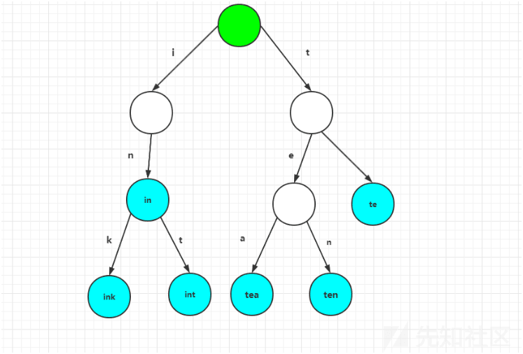
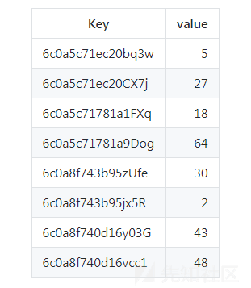
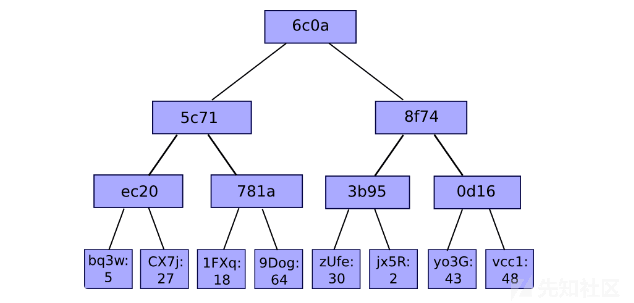
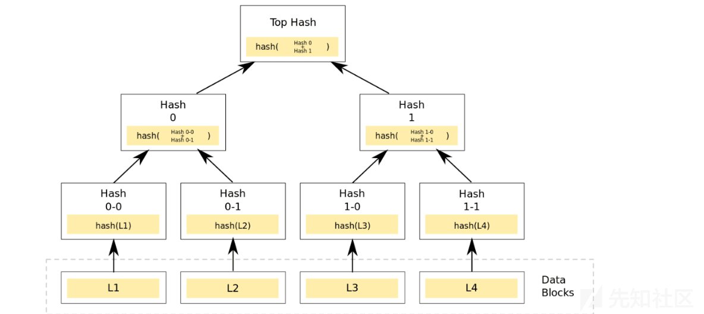
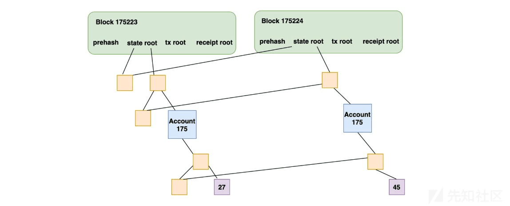
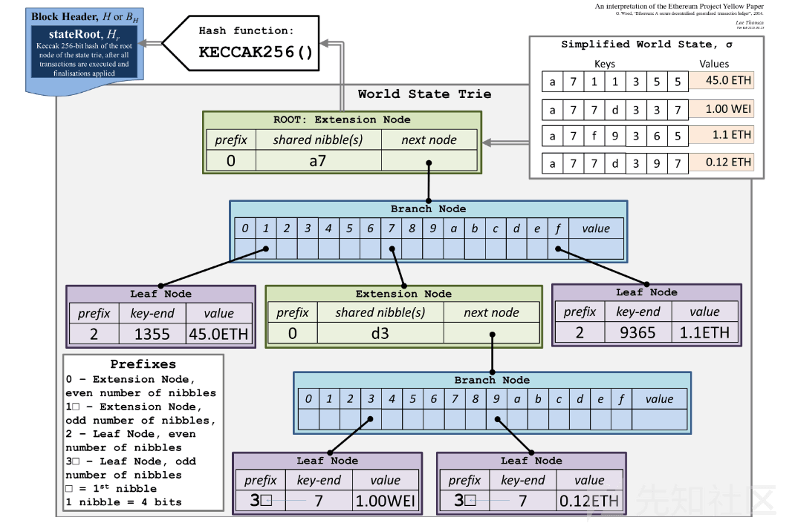

# 以太坊 MPT 构建 (上) - 先知社区

以太坊 MPT 构建 (上)

- - -

## 文章前言

MPT(Merkle Patrica Tree) 是以太坊中用于存储任意数据对 (key->Value) 的树形结构，它主要用于存储用户的状态信息、交易信息、交易收据等，而且它的插入、查找和删除效率都是 O(Log(N))，在以太坊中 MPT 为三种数据结构的集合：Trie、Patricia Trie、Merkle，下面将分别对此进行详细的介绍，同时我们将对默克尔树构造中的安全问题进行一个简易的梳理并给出一个安全示例供大家思考

## 树形结构

### Trie Tree

Trie 又被称之为字典树，它是一种用于快速检索的多叉树结构，例如我们的英文字母的字典树就是一个 26 叉数，阿拉伯数字的字典树是一个典型的 10 叉树，这里的 Trie 树通过利用字符串的公共前缀来节约存储空间，如果系统中存在大量字符串且这些字符串基本没有公共前缀，则相应的 Trie 树将变得非常消耗内存，这也是 Trie 树的一个缺点。

Trie Tree 具备以下特点：

-   根节点不包含字符，除根节点以外每个节点仅包含一个字符
-   每一个节点的所有子节点包含的字符串不相同
-   节点对应的字符串由根节点到某一节点路径上经过的所有字符链接而成

如下图所示，该 Trie Tree 用了 10 个节点保存了 6 个字符串：tea、ten、to、in、int、ink，可以看到这里的 ink 与 int 用了一个前缀——"in"，从而实现了对存储空间的节省，但是如果存储的字符串没有公共的前缀时则使用 Trie Tree 就会变得非常消耗内存，而这也是 Trie 树的一个缺点：  
[](https://xzfile.aliyuncs.com/media/upload/picture/20240126124823-22c59142-bc06-1.png)

### Patricia Tries

Patricia Tries 又称之为"前缀树"，它和 Trie 树的不同之处在于 Trie 树是为每一个字符串分配一个节点，而前缀树是将那些很长但又没有公共节点的字符串的 Trie 树退化成数组，前缀树的不同之处在于如果节点前缀相同则就使用公共的前缀，否则就把剩下的所有节点插入同一个节点，例如：  
[](https://xzfile.aliyuncs.com/media/upload/picture/20240126124840-2d384d40-bc06-1.png)  
[](https://xzfile.aliyuncs.com/media/upload/picture/20240126124854-352da130-bc06-1.png)

### Merkle Tree

Merkle Tree，通常也被称作 Hash Tree，顾名思义就是存储 hash 值的一棵树，Merkle 树的叶子是数据块的 hash 值，非叶节点是其对应子节点串联字符串的 hash，当我们拿到 Merkle Tree 的 Top Hash 的时候 (代表了整颗树的信息摘要)，当树里面任何一个数据发生了变动，都会导致 Top Hash 的值发生变化，所以只要拿到一个区块头，就可以对区块信息进行验证

[](https://xzfile.aliyuncs.com/media/upload/picture/20240126124914-4133c3ce-bc06-1.png)

## MPT Tree

以太坊的每一个区块头都包含了三棵 MPT 树：

-   交易树
-   收据树 (交易执行过程中的一些数据)
-   状态树 (账号信息，合约账户和用户账户)

MPT 树主要以下几个作用 (核心)：

-   可以存储任意长度的 key-value 键值对数据
-   提供了一种交易状态快速回滚的处理机制
-   提供了一种快速计算所维护数据集哈希标识的机制
-   提供了一种称为默克尔证明的证明方法，进行轻节点的扩展，实现简单支付验证 (重中之重)

下图中的两个区块头中 State root，Tx root、Receipt root 分别存储了这三棵树的树根，第二个区块显示了当账号 175 的数据变更 (27->45) 的时候，只需要存储跟这个账号相关的部分数据即可，而且之前的区块中的数据还是可以正常访问：  
[](https://xzfile.aliyuncs.com/media/upload/picture/20240126125105-83916884-bc06-1.png)

prefix 前缀：

-   0 - 扩展节点，偶数个半字节
-   1 - 扩展节点，奇数个半字节
-   2 - 叶子节点，偶数个半字节
-   3 - 叶子节点，奇数个半字节

Key-Value：

```plain
-----------------------------
key         |     value     | 
-----------------------------
a711355     |    45.0 ETH   | 
a77d337     |    1.00 WEI   |
a7f9365     |    1.1 ETH    | 
a77d397     |    0.12 ETH   |
-----------------------------
```

具体图示：  
[](https://xzfile.aliyuncs.com/media/upload/picture/20240126125147-9c73727a-bc06-1.png)  
Trie 树中有三种节点：

-   叶子节点 (Leaf): 叶子节点包含两个字段，第一个字段是剩下的 Key 的半字节编码，第二个字段是 Key 对应的 Value
-   扩展节点 (Extention): 扩展节点也包含两个字段，第一个字段是剩下的 Key 的半字节编码，第二个字段是 n(J,j)
-   分支节点 (Branch): 分支节点包含了 17 个字段，其前 16 个字段对应于这些节点在其遍历时键的十六个可能的半字节值中的每一个，第 17 个字段是存储那些在当前节点结束了的节点 (例如：有三个 key，分别是 abc ,abd, ab，则第 17 个字段用于储存 ab 节点的值)

## 源码分析

Trie 目录下的关键文件如下：

```plain
|-commiter.go 节点提交操作
|-database.go 内存中 Trie 的操作
|-encoding.go 编码转换
|-hasher.go 从某一节点开始计算子树的哈希
|-iterator.go 枚举相关的接口
|-node.go Trie 树中所有结点类型和解析代码
|-sync.go 实现 SyncTrie 对象的定义和所有方法
|-secure_trie.go 实现 SecureTrie 对象
|-proof.go 为 key 构造一个 merkle 证明
|-trie.go Trie 树的增删改查
```

### 数据结构

在研究树的构建、增删改查之前，我们先来看一下树的基本组成单位节点的类型，首先看一下之前的三种节点类型的定义：

-   fullNode：对应分支节点，可以有多个子节点，它有一个容量为 17 的 node 数组成员变量 Children，数组中前 16 个空位分别对应 16 进制 (hex)) 下的 0-9a-f，这样对于每个子节点，根据其 key 值 16 进制形式下的第一位的值，可挂载到 Children 数组的某个位置，fullNode 本身不再需要额外 key 变量，Children 数组的第 17 位，留给 fullNode 的数据部分，fullNode 继承了原生 trie 的特点
-   shortNode：对应扩展节点，只有一个子节点，成员 Val 指向一个子节点，成员 Key 是一个字节数组，shortNode 通过合并只有一个子节点的父节点和其子节点来缩短 trie 的深度
-   valueNode：对应叶子节点，没有子节点，它是承载 MPT 结构中真正数据部分的节点，在使用中 valueNode 就是所携带数据部分的 RLP 哈希值，长度 32byte，数据的 RLP 编码值作为 valueNode 的匹配项存储在数据库里
-   hashNode：hashNode 是 fullNode 和 shortNode 对象的 RLP 哈希值，hashNode 不会单独存在，而是以 nodeFlag.hsah 的形式存在，被 fullNode 和 shortNode 间接持有，一旦 fullNode 或 shortNode 的成员变量发生任何变化，nodeFlag.hsah 就一定会更新

```plain
// filedir:go-ethereum-1.10.2\trie\node.go  L34
type (
    fullNode struct {
        Children [17]node // Actual trie node data to encode/decode (needs custom encoder)
        flags    nodeFlag
    }
    shortNode struct {
        Key   []byte
        Val   node
        flags nodeFlag
    }
    hashNode  []byte
    valueNode []byte
)
```

Trie 的数据结构如下所示，其中 root 包含了当前的 root 节点，db 是后端的 KV 存储，unhashed 用于跟踪自上次哈希操作后插入的叶子数，该数字不会直接映射到实际 unhashed 的节点数：

```plain
// Trie is a Merkle Patricia Trie.
// The zero value is an empty trie with no database.
// Use New to create a trie that sits on top of a database.
//
// Trie is not safe for concurrent use.
type Trie struct {
    db   *Database
    root node
    // Keep track of the number leafs which have been inserted since the last
    // hashing operation. This number will not directly map to the number of
    // actually unhashed nodes
    unhashed int
}
```

### 树的创建

New 函数用于根据数据库中存在的 root 节点信息来创建一个树，在这里首先会检查 db 是否为空，之后检查 root 的 hash 是否为空，如果不为空则从数据库中加载一个已经存在的 Trie 树，如果为空则直接返回一个新的 Trie：

```plain
// filedir:go-ethereum-1.10.2\trie\trie.go  L62
// New creates a trie with an existing root node from db.
//
// If root is the zero hash or the sha3 hash of an empty string, the
// trie is initially empty and does not require a database. Otherwise,
// New will panic if db is nil and returns a MissingNodeError if root does
// not exist in the database. Accessing the trie loads nodes from db on demand.
func New(root common.Hash, db *Database) (*Trie, error) {
    if db == nil {
        panic("trie.New called without a database")
    }
    trie := &Trie{
        db: db,
    }
    if root != (common.Hash{}) && root != emptyRoot {
        rootnode, err := trie.resolveHash(root[:], nil)
        if err != nil {
            return nil, err
        }
        trie.root = rootnode
    }
    return trie, nil
}
```

resolveHash 具体实现代码如下：

```plain
func (t *Trie) resolveHash(n hashNode, prefix []byte) (node, error) {
    hash := common.BytesToHash(n)
    if node := t.db.node(hash); node != nil {
        return node, nil
    }
    return nil, &MissingNodeError{NodeHash: hash, Path: prefix}
}
```

### 树的检索

树的检索功能主要是根据传入的 key 值来查找 Trie 中对应的 value，主要通过 Get 函数来实现：

```plain
// Get returns the value for key stored in the trie.
// The value bytes must not be modified by the caller.
func (t *Trie) Get(key []byte) []byte {
    res, err := t.TryGet(key)
    if err != nil {
        log.Error(fmt.Sprintf("Unhandled trie error: %v", err))
    }
    return res
}
```

在合理可以看到又调用了 TryGet 方法，参数依旧为 key(类型为 byte 数组)，TryGet 的具体实现如下所示，在这里又掉了了 tryGet 方法来检索 key 对应的 value 值，在这里需要注意的时此时传入 tryGet 的第一个参数是 Trie 的 Root 根，第二个参数有我们检索的依据——key 通过 keybytesToHex 从 bytes 转十六进制所得，第三个参数为 0

```plain
// TryGet returns the value for key stored in the trie.
// The value bytes must not be modified by the caller.
// If a node was not found in the database, a MissingNodeError is returned.
func (t *Trie) TryGet(key []byte) ([]byte, error) {
    value, newroot, didResolve, err := t.tryGet(t.root, keybytesToHex(key), 0)
    if err == nil && didResolve {
        t.root = newroot
    }
    return value, err
}
```

tryGet 函数的实现如下所示，从这里可以看到从上面传入的第三个参数即为 pos，也就是我们的起始检索点，该函数有四个返回值：

-   value：通过检索 key 所得的值
-   newnode：node 类型，新的检索 node
-   didResolve：布尔类型，是否有检索成功
-   err：error 类型，错误信息

```plain
func (t *Trie) tryGet(origNode node, key []byte, pos int) (value []byte, newnode node, didResolve bool, err error) {
    switch n := (origNode).(type) {
    case nil:
        return nil, nil, false, nil
    case valueNode:
        return n, n, false, nil
    case *shortNode:
        if len(key)-pos < len(n.Key) || !bytes.Equal(n.Key, key[pos:pos+len(n.Key)]) {
            // key not found in trie
            return nil, n, false, nil
        }
        value, newnode, didResolve, err = t.tryGet(n.Val, key, pos+len(n.Key))
        if err == nil && didResolve {
            n = n.copy()
            n.Val = newnode
        }
        return value, n, didResolve, err
    case *fullNode:
        value, newnode, didResolve, err = t.tryGet(n.Children[key[pos]], key, pos+1)
        if err == nil && didResolve {
            n = n.copy()
            n.Children[key[pos]] = newnode
        }
        return value, n, didResolve, err
    case hashNode:
        child, err := t.resolveHash(n, key[:pos])
        if err != nil {
            return nil, n, true, err
        }
        value, newnode, _, err := t.tryGet(child, key, pos)
        return value, newnode, true, err
    default:
        panic(fmt.Sprintf("%T: invalid node: %v", origNode, origNode))
    }
}
```

在这里首先会检查当前检查的 node 的类型：

```plain
switch n := (origNode).(type) {
```

如果 node 类型为 nil，则说明此时的 Trie 为一个空树，之后停止检索，检索失败：

```plain
case nil:
        return nil, nil, false, nil
```

如果是叶子节点，则直接将叶子节点作为通过检索 key 所得的值，将 node 作为新的子树节点、检索结果为失败 (这样做的原因是不更新 newroot，即子树节点，因为叶子节点没有子节点，具体可以查看 TryGet)，错误为 nil：

```plain
case valueNode:
        return n, n, false, nil
```

如果检查节点为扩展节点，则首先会通过检查剩余未检查的 key 的长度是否小于当前检查节点的 shared nibbles 的长度，以及当前检查节点的 shared nibbles 的长度是否与 key 的未检测部分数值一致，如果满足以上一个条件则说明 Trie 中并没有要检索的 key，否则继续递归调用 TryGet 向下进行检索：

```plain
case *shortNode:
        if len(key)-pos < len(n.Key) || !bytes.Equal(n.Key, key[pos:pos+len(n.Key)]) {
            // key not found in trie
            return nil, n, false, nil
        }
        value, newnode, didResolve, err = t.tryGet(n.Val, key, pos+len(n.Key))
        if err == nil && didResolve {
            n = n.copy()
            n.Val = newnode
        }
        return value, n, didResolve, err
```

如果此时的检查节点为一个分支节点，则通过增加 pos 的方式递归调用 tryGet 来检索 children 子节点中是否有对应的 value：

```plain
case *fullNode:
        value, newnode, didResolve, err = t.tryGet(n.Children[key[pos]], key, pos+1)
        if err == nil && didResolve {
            n = n.copy()
            n.Children[key[pos]] = newnode
        }
        return value, n, didResolve, err
```

如果为 hashNode 则说明当前节点信息还未添加到内存中，所以需要先调用 t.resolveHash(n, prefix) 来加载节点到内存，之后调用 tryGet 进行检索：

```plain
case hashNode:
        child, err := t.resolveHash(n, key[:pos])
        if err != nil {
            return nil, n, true, err
        }
        value, newnode, _, err := t.tryGet(child, key, pos)
        return value, newnode, true, err
```

如果没有匹配到检查节点的类型则直接返回错误的节点类型

```plain
default:
        panic(fmt.Sprintf("%T: invalid node: %v", origNode, origNode))
    }
```

### 树的更新

树的更新通过 Update 函数来实现，在这里主要是更新 key 对应的 value 值，从下面的代码中可以看到这里又调用了 TryUpdate 函数：

```plain
// Update associates key with value in the trie. Subsequent calls to
// Get will return value. If value has length zero, any existing value
// is deleted from the trie and calls to Get will return nil.
//
// The value bytes must not be modified by the caller while they are
// stored in the trie.
func (t *Trie) Update(key, value []byte) {
    if err := t.TryUpdate(key, value); err != nil {
        log.Error(fmt.Sprintf("Unhandled trie error: %v", err))
    }
}
```

TryUpdate 函数如下所示，在这里首先将 key 通过 keyBytesToHex 从 byte 转为十六进制，之后检查 value 是否为 0，如果为 0 则表示删除操作，调用 delete 函数进行删除，如果不为空则表示更新操作，调用 insert 函数进行更新：

```plain
// TryUpdate associates key with value in the trie. Subsequent calls to
// Get will return value. If value has length zero, any existing value
// is deleted from the trie and calls to Get will return nil.
//
// The value bytes must not be modified by the caller while they are
// stored in the trie.
//
// If a node was not found in the database, a MissingNodeError is returned.
func (t *Trie) TryUpdate(key, value []byte) error {
    t.unhashed++
    k := keybytesToHex(key)
    if len(value) != 0 {
        _, n, err := t.insert(t.root, nil, k, valueNode(value))
        if err != nil {
            return err
        }
        t.root = n
    } else {
        _, n, err := t.delete(t.root, nil, k)
        if err != nil {
            return err
        }
        t.root = n
    }
    return nil
}
```

在这里我们先来看树的更新操作，具体实现函数为 insert，在上述代码中传入 insert 函数的有四个参数，我们可以对应下面的 insert 函数来了解其含义：

-   n node：当前检查的节点
-   prefix：已经处理完的部分 key(PS：完整的 key=key=prefix)
-   key：未处理完的部分 Key(PS：完整的 key=key=prefix)
-   value：待更新的节点的 value(node 类型)
    
    ```plain
    func (t *Trie) insert(n node, prefix, key []byte, value node) (bool, node, error) {
      if len(key) == 0 {
          if v, ok := n.(valueNode); ok {
              return !bytes.Equal(v, value.(valueNode)), value, nil
          }
          return true, value, nil
      }
      switch n := n.(type) {
      case *shortNode:
          matchlen := prefixLen(key, n.Key)
          // If the whole key matches, keep this short node as is
          // and only update the value.
          if matchlen == len(n.Key) {
              dirty, nn, err := t.insert(n.Val, append(prefix, key[:matchlen]...), key[matchlen:], value)
              if !dirty || err != nil {
                  return false, n, err
              }
              return true, &shortNode{n.Key, nn, t.newFlag()}, nil
          }
          // Otherwise branch out at the index where they differ.
          branch := &fullNode{flags: t.newFlag()}
          var err error
          _, branch.Children[n.Key[matchlen]], err = t.insert(nil, append(prefix, n.Key[:matchlen+1]...), n.Key[matchlen+1:], n.Val)
          if err != nil {
              return false, nil, err
          }
          _, branch.Children[key[matchlen]], err = t.insert(nil, append(prefix, key[:matchlen+1]...), key[matchlen+1:], value)
          if err != nil {
              return false, nil, err
          }
          // Replace this shortNode with the branch if it occurs at index 0.
          if matchlen == 0 {
              return true, branch, nil
          }
          // Otherwise, replace it with a short node leading up to the branch.
          return true, &shortNode{key[:matchlen], branch, t.newFlag()}, nil
    
      case *fullNode:
          dirty, nn, err := t.insert(n.Children[key[0]], append(prefix, key[0]), key[1:], value)
          if !dirty || err != nil {
              return false, n, err
          }
          n = n.copy()
          n.flags = t.newFlag()
          n.Children[key[0]] = nn
          return true, n, nil
    
      case nil:
          return true, &shortNode{key, value, t.newFlag()}, nil
    
      case hashNode:
          // We've hit a part of the trie that isn't loaded yet. Load
          // the node and insert into it. This leaves all child nodes on
          // the path to the value in the trie.
          rn, err := t.resolveHash(n, prefix)
          if err != nil {
              return false, nil, err
          }
          dirty, nn, err := t.insert(rn, prefix, key, value)
          if !dirty || err != nil {
              return false, rn, err
          }
          return true, nn, nil
    
      default:
          panic(fmt.Sprintf("%T: invalid node: %v", n, n))
      }
    }
    ```
    
    在这里首先检索 key 的值是否为空 (为空则表示我们已经检查 key 了)，之后检查当前检查节点的 value 值是否不为空，且与要更新的 value 值一致，如果一致则不做更新，否则重设 value 值并返回：
    
    ```plain
    if len(key) == 0 {
          if v, ok := n.(valueNode); ok {
              return !bytes.Equal(v, value.(valueNode)), value, nil
          }
          return true, value, nil
      }
    ```
    
    之后检查当前检查节点的类型，如果节点类型为扩展节点则调用 prefixLen 来获取检索的 key 与当前检查节点具有的公共前缀的长度值，如果公共前缀的长度值等于当前检查节点的前缀值则将当前扩展节点的 value 设置为新的检查节点，然后更新已检查的前缀部分，以及已检查部分和要更新的 value 值，之后继续递归调用 insert 向下进行检查，如果公共前缀的长度值不等于当前检查节点的前缀值 (表示没有 key-value)，之后在出现不同的地方创建一个分支节点，然后在分支节点的 Children 位置调用 t.insert 插入两个 shortNode(其中一个存储当前扩展节点的 value 数据信息，另一个存储当前要检查数据的信息)，之后进行匹配，当匹配长度为 0 时则用分支节点来替换扩展节点，否则将扩展节点作为插入后子树的根节点返回：
    
    ```plain
    case *shortNode:
          matchlen := prefixLen(key, n.Key)
          // If the whole key matches, keep this short node as is
          // and only update the value.
          if matchlen == len(n.Key) {
              dirty, nn, err := t.insert(n.Val, append(prefix, key[:matchlen]...), key[matchlen:], value)
              if !dirty || err != nil {
                  return false, n, err
              }
              return true, &shortNode{n.Key, nn, t.newFlag()}, nil
          }
          // Otherwise branch out at the index where they differ.
          branch := &fullNode{flags: t.newFlag()}
          var err error
          _, branch.Children[n.Key[matchlen]], err = t.insert(nil, append(prefix, n.Key[:matchlen+1]...), n.Key[matchlen+1:], n.Val)
          if err != nil {
              return false, nil, err
          }
          _, branch.Children[key[matchlen]], err = t.insert(nil, append(prefix, key[:matchlen+1]...), key[matchlen+1:], value)
          if err != nil {
              return false, nil, err
          }
          // Replace this shortNode with the branch if it occurs at index 0.
          if matchlen == 0 {
              return true, branch, nil
          }
          // Otherwise, replace it with a short node leading up to the branch.
          return true, &shortNode{key[:matchlen], branch, t.newFlag()}, nil
    ```
    
    如果当前检查节点类型为分支节点，则从分支节点的第一个子节点开始递归检查，然后把更新后的子树根节点设置为对应的孩子节点
    
    ```plain
    case *fullNode:
          dirty, nn, err := t.insert(n.Children[key[0]], append(prefix, key[0]), key[1:], value)
          if !dirty || err != nil {
              return false, n, err
          }
          n = n.copy()
          n.flags = t.newFlag()
          n.Children[key[0]] = nn
          return true, n, nil
    ```
    
    如果节点类型是 nil 则说明树是空的，直接返回 shortNode{key, value, t.newFlag()}，这个时候整颗树的根就含有了一个 shortNode 节点
    
    ```plain
    case nil:
          return true, &shortNode{key, value, t.newFlag()}, nil
    ```
    
    如果当前节点是 hashNode, 则表示当前节点还未添加到内存中，首先调用 t.resolveHash(n, prefix) 来加载到内存之后调用 insert 进行更新操作
    
    ```plain
    case hashNode:
          // We've hit a part of the trie that isn't loaded yet. Load
          // the node and insert into it. This leaves all child nodes on
          // the path to the value in the trie.
          rn, err := t.resolveHash(n, prefix)
          if err != nil {
              return false, nil, err
          }
          dirty, nn, err := t.insert(rn, prefix, key, value)
          if !dirty || err != nil {
              return false, rn, err
          }
          return true, nn, nil
    ```
    
    \### 树的删除  
    下面我们紧接着来看树的删除操作，该操作主要通过 delete 来实现：
    
    ```plain
    // delete returns the new root of the trie with key deleted.
    // It reduces the trie to minimal form by simplifying
    // nodes on the way up after deleting recursively.
    func (t *Trie) delete(n node, prefix, key []byte) (bool, node, error) {
      switch n := n.(type) {
      case *shortNode:
          matchlen := prefixLen(key, n.Key)
          if matchlen < len(n.Key) {
              return false, n, nil // don't replace n on mismatch
          }
          if matchlen == len(key) {
              return true, nil, nil // remove n entirely for whole matches
          }
          // The key is longer than n.Key. Remove the remaining suffix
          // from the subtrie. Child can never be nil here since the
          // subtrie must contain at least two other values with keys
          // longer than n.Key.
          dirty, child, err := t.delete(n.Val, append(prefix, key[:len(n.Key)]...), key[len(n.Key):])
          if !dirty || err != nil {
              return false, n, err
          }
          switch child := child.(type) {
          case *shortNode:
              // Deleting from the subtrie reduced it to another
              // short node. Merge the nodes to avoid creating a
              // shortNode{..., shortNode{...}}. Use concat (which
              // always creates a new slice) instead of append to
              // avoid modifying n.Key since it might be shared with
              // other nodes.
              return true, &shortNode{concat(n.Key, child.Key...), child.Val, t.newFlag()}, nil
          default:
              return true, &shortNode{n.Key, child, t.newFlag()}, nil
          }
    
      case *fullNode:
          dirty, nn, err := t.delete(n.Children[key[0]], append(prefix, key[0]), key[1:])
          if !dirty || err != nil {
              return false, n, err
          }
          n = n.copy()
          n.flags = t.newFlag()
          n.Children[key[0]] = nn
    
          // Check how many non-nil entries are left after deleting and
          // reduce the full node to a short node if only one entry is
          // left. Since n must've contained at least two children
          // before deletion (otherwise it would not be a full node) n
          // can never be reduced to nil.
          //
          // When the loop is done, pos contains the index of the single
          // value that is left in n or -2 if n contains at least two
          // values.
          pos := -1
          for i, cld := range &n.Children {
              if cld != nil {
                  if pos == -1 {
                      pos = i
                  } else {
                      pos = -2
                      break
                  }
              }
          }
          if pos >= 0 {
              if pos != 16 {
                  // If the remaining entry is a short node, it replaces
                  // n and its key gets the missing nibble tacked to the
                  // front. This avoids creating an invalid
                  // shortNode{..., shortNode{...}}.  Since the entry
                  // might not be loaded yet, resolve it just for this
                  // check.
                  cnode, err := t.resolve(n.Children[pos], prefix)
                  if err != nil {
                      return false, nil, err
                  }
                  if cnode, ok := cnode.(*shortNode); ok {
                      k := append([]byte{byte(pos)}, cnode.Key...)
                      return true, &shortNode{k, cnode.Val, t.newFlag()}, nil
                  }
              }
              // Otherwise, n is replaced by a one-nibble short node
              // containing the child.
              return true, &shortNode{[]byte{byte(pos)}, n.Children[pos], t.newFlag()}, nil
          }
          // n still contains at least two values and cannot be reduced.
          return true, n, nil
    
      case valueNode:
          return true, nil, nil
    
      case nil:
          return false, nil, nil
    
      case hashNode:
          // We've hit a part of the trie that isn't loaded yet. Load
          // the node and delete from it. This leaves all child nodes on
          // the path to the value in the trie.
          rn, err := t.resolveHash(n, prefix)
          if err != nil {
              return false, nil, err
          }
          dirty, nn, err := t.delete(rn, prefix, key)
          if !dirty || err != nil {
              return false, rn, err
          }
          return true, nn, nil
    
      default:
          panic(fmt.Sprintf("%T: invalid node: %v (%v)", n, n, key))
      }
    }
    ```
    
    在这里首先检查当前检查节点的类型，如果节点类型为 shortNode，则首先检查公共前缀，如果公共前缀的长度小于节点的前缀，则节点删除失败 (不存在)，如果共同的前缀等于 key 的长度，则删除匹配的整个节点，如果 key 比 node.key 还要长，则将扩展节点的子节点作为新的检查点并更新已检查的前缀信息，之后递归调用 delete 向下进行检索，之后检查子节点的节点类型，如果子节点的节点类型也为扩展节点则通过调用 concat 将检查节点的 key 与当前子节点的 key 相连接作为新的 key，之后将子树的节点作为新的子节点，实例化一个 ShortNode 返回 (即间接性的删除当前的检查节点)，否则直接返回一个 shortNode，需要注意的是这里返回的扩展节点的为子节点 child 实例化后的哦~
    
    ```plain
    case *shortNode:
          matchlen := prefixLen(key, n.Key)
          if matchlen < len(n.Key) {
              return false, n, nil // don't replace n on mismatch
          }
          if matchlen == len(key) {
              return true, nil, nil // remove n entirely for whole matches
          }
          // The key is longer than n.Key. Remove the remaining suffix
          // from the subtrie. Child can never be nil here since the
          // subtrie must contain at least two other values with keys
          // longer than n.Key.
          dirty, child, err := t.delete(n.Val, append(prefix, key[:len(n.Key)]...), key[len(n.Key):])
          if !dirty || err != nil {
              return false, n, err
          }
          switch child := child.(type) {
          case *shortNode:
              // Deleting from the subtrie reduced it to another
              // short node. Merge the nodes to avoid creating a
              // shortNode{..., shortNode{...}}. Use concat (which
              // always creates a new slice) instead of append to
              // avoid modifying n.Key since it might be shared with
              // other nodes.
              return true, &shortNode{concat(n.Key, child.Key...), child.Val, t.newFlag()}, nil
          default:
              return true, &shortNode{n.Key, child, t.newFlag()}, nil
          }
    ```
    
    如果是 fullNode(分支节点)，则从下标为 0 的第一个 children 开始递归调用 delete 向下进行检索，待检索到后更新 pos，然后通过一个 for 循环来检索删除操作之后有多少非空的子树，假设此时的 pos 为 0，则 pos:=-1 的结果为 pos=-1，如果当前分支节点只有一个子节点，那么此时的 pos 将被置为 0，所以减一操作后为 -1，之后 pos 变更为 0，此时如果有另一个子树则还需要再进入到 for 中一次，此时 pos 被置为 -2，之后通过 break 跳出循环，此时如果满足 pos>=0，可见如果此时子树多余两个则 pos 的值将为 -2(无论最初 pos 为多少)，之后判断 pos 是否大于 0，如果大于 0 则判断 pos 是否等于 16(即非分支节点的 value 部分)，如果不为 16 则调用 resolve 加载其子树，用子节点的子节点来替换当前子节点，之后更新 key 并返回一个 shortNode(扩展节点)，否则返回一个使用检查节点的第十六位即 value 字段的值初始化后的一个 shortNode，如果 pos<0，则说明依旧至少包含两个不可被缩减的子节点，则直接返回一个 shortNode：
    

```plain
case *fullNode:
        dirty, nn, err := t.delete(n.Children[key[0]], append(prefix, key[0]), key[1:])
        if !dirty || err != nil {
            return false, n, err
        }
        n = n.copy()
        n.flags = t.newFlag()
        n.Children[key[0]] = nn

        // Check how many non-nil entries are left after deleting and
        // reduce the full node to a short node if only one entry is
        // left. Since n must've contained at least two children
        // before deletion (otherwise it would not be a full node) n
        // can never be reduced to nil.
        //
        // When the loop is done, pos contains the index of the single
        // value that is left in n or -2 if n contains at least two
        // values.
        pos := -1
        for i, cld := range &n.Children {
            if cld != nil {
                if pos == -1 {
                    pos = i
                } else {
                    pos = -2
                    break
                }
            }
        }
        if pos >= 0 {
            if pos != 16 {
                // If the remaining entry is a short node, it replaces
                // n and its key gets the missing nibble tacked to the
                // front. This avoids creating an invalid
                // shortNode{..., shortNode{...}}.  Since the entry
                // might not be loaded yet, resolve it just for this
                // check.
                cnode, err := t.resolve(n.Children[pos], prefix)
                if err != nil {
                    return false, nil, err
                }
                if cnode, ok := cnode.(*shortNode); ok {
                    k := append([]byte{byte(pos)}, cnode.Key...)
                    return true, &shortNode{k, cnode.Val, t.newFlag()}, nil
                }
            }
            // Otherwise, n is replaced by a one-nibble short node
            // containing the child.
            return true, &shortNode{[]byte{byte(pos)}, n.Children[pos], t.newFlag()}, nil
        }
        // n still contains at least two values and cannot be reduced.
        return true, n, nil
```

如果节点为 valueNode(叶子结点 (没有子节点)) 类型则直接返回成功：

```plain
case valueNode:
        return true, nil, nil
```

如果节点为 nil 类型，则说明整颗树都是空的，直接返回失败：

```plain
case nil:
        return false, nil, nil
```

如果类型为 hashNode，hashNode 的意思是当前节点还没有加载到内存里面来，则调用 resolveHash 加载节点，之后递归调用 delete 进行删除操作：

```plain
case hashNode:
        // We've hit a part of the trie that isn't loaded yet. Load
        // the node and delete from it. This leaves all child nodes on
        // the path to the value in the trie.
        rn, err := t.resolveHash(n, prefix)
        if err != nil {
            return false, nil, err
        }
        dirty, nn, err := t.delete(rn, prefix, key)
        if !dirty || err != nil {
            return false, rn, err
        }
        return true, nn, nil
```

如果类型不匹配则直接抛出错误节点：

```plain
default:
        panic(fmt.Sprintf("%T: invalid node: %v (%v)", n, n, key))
    }
```

PS：篇幅有点长，一篇放不下，下篇再续，
