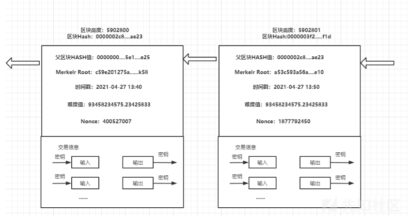

# 以太坊区块设计分析 (上) - 先知社区

以太坊区块设计分析 (上)

- - -

## 文章前言

区块链是由包含交易的区块按照时间先后顺序依次连接起来的数据结构，这种数据结构是一个形象的链表结构，所有数据有序地链接在同一条区块链上，每个区块通过一个 hash 指针指向前一个区块，hash 指针其实是前一个区块头进行 SHA256 哈希计算得到的，通过这个哈希值，可以唯一的识别一个区块，然后将每个区块连接到其区块头中前一个区块哈希值代币的区块后面，从而构建出一条完整的区块链。

## 区块结构

区块是区块链中数据存储的最小单元，每一个区块都由"区块头"和"区块主体"两部分组成，其中区块主体用于存储交易信息，而区块头由版本号、父区块 Hash 值、Merkle root、时间戳、难度值、随机数等构成：  
[](https://xzfile.aliyuncs.com/media/upload/picture/20240123152301-3d968f00-b9c0-1.png)  
备注：上图中区块 Hash 是使用 SHA256 算法对区块头进行二次哈希得到的 32 位哈希值，也被称为区块头哈希值，而不是整个区块的 HASH  
区块数据结构定义如下 (这里的 hash、size、td 等都是在接受和验证区块过程中产生的内容，在向全网公布的时候 block 就只有 header 和 body)：

```plain
// filedir: go-ethereum-1.10.2\core\types\block.go  L149
// Block represents an entire block in the Ethereum blockchain.
type Block struct {
    header       *Header
    uncles       []*Header
    transactions Transactions

    // caches
    hash atomic.Value
    size atomic.Value

    // Td is used by package core to store the total difficulty
    // of the chain up to and including the block.
    td *big.Int

    // These fields are used by package eth to track
    // inter-peer block relay.
    ReceivedAt   time.Time
    ReceivedFrom interface{}
}
```

区块头数据结构的设计如下：

```plain
// filedir:go-ethereum-1.10.2\core\types\block.go  L66
//go:generate gencodec -type Header -field-override headerMarshaling -out gen_header_json.go

// Header represents a block header in the Ethereum blockchain.
type Header struct {
    ParentHash  common.Hash    `json:"parentHash"       gencodec:"required"`
    UncleHash   common.Hash    `json:"sha3Uncles"       gencodec:"required"`
    Coinbase    common.Address `json:"miner"            gencodec:"required"`
    Root        common.Hash    `json:"stateRoot"        gencodec:"required"`
    TxHash      common.Hash    `json:"transactionsRoot" gencodec:"required"`
    ReceiptHash common.Hash    `json:"receiptsRoot"     gencodec:"required"`
    Bloom       Bloom          `json:"logsBloom"        gencodec:"required"`
    Difficulty  *big.Int       `json:"difficulty"       gencodec:"required"`
    Number      *big.Int       `json:"number"           gencodec:"required"`
    GasLimit    uint64         `json:"gasLimit"         gencodec:"required"`
    GasUsed     uint64         `json:"gasUsed"          gencodec:"required"`
    Time        uint64         `json:"timestamp"        gencodec:"required"`
    Extra       []byte         `json:"extraData"        gencodec:"required"`
    MixDigest   common.Hash    `json:"mixHash"`
    Nonce       BlockNonce     `json:"nonce"`
}
```

参数说明：

-   ParentHash：父区块 Hash 值
-   Coinbase：矿工账户地址
-   UncleHash：Block 结构体的成员 Uncles 的 RLP(递归长度前缀) 哈希值
-   Root：Merkle Tree Root
-   TxHash：区块中所有交易验证结果组成的交易结果的默克尔树
-   ReceiptHash：Block 中的"Receipt Trie"的根节点的 RLP 哈希值
-   Bloom：Bloom 过滤器 (Filter)，用来快速判断一个参数 Log 对象是否存在于一组已知的 Log 集合中
-   Difficulty：区块的难度
-   Number：区块的序号，当前区块的 Number 等于其父区块 Number+1
-   Time：区块被创建的时间戳，该值由共识算法确定，要么等于 parentBlock.Time + 10s，或者等于系统当前时间
-   GasLimit：区块内所有 Gas 消耗的理论上限
-   GasUsed：区块内所有 Transaction 执行时所实际消耗的 Gas 总和
-   Nonce：一个 64bit 的哈希数，它被应用在区块的"挖掘"阶段，并且在使用中会被修改

同时需要补充说明的一点是在比特币中区块 body 中的交易通过 Merkle Tree 的形式组织，之后将 Merkle Root 存储到 - Block header 中，而在以太坊中则采用 Merkle-PatricaTrie(MPT) 结构，一共存在三棵树：

-   StateTrie：在 StateDB 中每个账户以 stateObject 对象表示，所有账户对象逐个插入一个 Merkle-PatricaTrie(MPT) 结构里，形成"state Trie"
-   Tx Trie：Block 的 transactions 中所有的 tx 对象，被逐个插入一个 MPT 结构，形成"tx Trie"
-   Receipt Trie：Transaction 执行完后会生成一个 Receipt 数组，数组中的所有 Receipt 被逐个插入一个 MPT 结构中，形成"Receipt Trie"

关于这三棵树我们在后续的交易部分再进行深究，这里不再研讨~

## 创世区块

区块链中的第一个区块被称为"创世区块"，它是区块链里面所有区块的共同的祖先，当我们启动一个节点而不指定其创世区块文件 (genesis.json) 时，节点回尝试先从本地 LevelDB 数据库中加载区块信息，如果节点没有从 LevelDB 中获取到区块，则节点回认为自己是一个全新的节点，此时会根据硬编码的创世区块信息初始化本地链：

```plain
// filedir: go-ethereum-1.10.2\params\config.go L28
// Genesis hashes to enforce below configs on.
var (
    MainnetGenesisHash = common.HexToHash("0xd4e56740f876aef8c010b86a40d5f56745a118d0906a34e69aec8c0db1cb8fa3")
    RopstenGenesisHash = common.HexToHash("0x41941023680923e0fe4d74a34bdac8141f2540e3ae90623718e47d66d1ca4a2d")
    RinkebyGenesisHash = common.HexToHash("0x6341fd3daf94b748c72ced5a5b26028f2474f5f00d824504e4fa37a75767e177")
    GoerliGenesisHash  = common.HexToHash("0xbf7e331f7f7c1dd2e05159666b3bf8bc7a8a3a9eb1d518969eab529dd9b88c1a")
    YoloV3GenesisHash  = common.HexToHash("0x374f07cc7fa7c251fc5f36849f574b43db43600526410349efdca2bcea14101a")
)

// TrustedCheckpoints associates each known checkpoint with the genesis hash of
// the chain it belongs to.
var TrustedCheckpoints = map[common.Hash]*TrustedCheckpoint{
    MainnetGenesisHash: MainnetTrustedCheckpoint,
    RopstenGenesisHash: RopstenTrustedCheckpoint,
    RinkebyGenesisHash: RinkebyTrustedCheckpoint,
    GoerliGenesisHash:  GoerliTrustedCheckpoint,
}

// CheckpointOracles associates each known checkpoint oracles with the genesis hash of
// the chain it belongs to.
var CheckpointOracles = map[common.Hash]*CheckpointOracleConfig{
    MainnetGenesisHash: MainnetCheckpointOracle,
    RopstenGenesisHash: RopstenCheckpointOracle,
    RinkebyGenesisHash: RinkebyCheckpointOracle,
    GoerliGenesisHash:  GoerliCheckpointOracle,
}

var (
    // MainnetChainConfig is the chain parameters to run a node on the main network.
    MainnetChainConfig = &ChainConfig{
        ChainID:             big.NewInt(1),
        HomesteadBlock:      big.NewInt(1_150_000),
        DAOForkBlock:        big.NewInt(1_920_000),
        DAOForkSupport:      true,
        EIP150Block:         big.NewInt(2_463_000),
        EIP150Hash:          common.HexToHash("0x2086799aeebeae135c246c65021c82b4e15a2c451340993aacfd2751886514f0"),
        EIP155Block:         big.NewInt(2_675_000),
        EIP158Block:         big.NewInt(2_675_000),
        ByzantiumBlock:      big.NewInt(4_370_000),
        ConstantinopleBlock: big.NewInt(7_280_000),
        PetersburgBlock:     big.NewInt(7_280_000),
        IstanbulBlock:       big.NewInt(9_069_000),
        MuirGlacierBlock:    big.NewInt(9_200_000),
        BerlinBlock:         big.NewInt(12_244_000),
        Ethash:              new(EthashConfig),
    }

    // MainnetTrustedCheckpoint contains the light client trusted checkpoint for the main network.
    MainnetTrustedCheckpoint = &TrustedCheckpoint{
        SectionIndex: 371,
        SectionHead:  common.HexToHash("0x50fd3cec5376ede90ef9129772022690cd1467f22c18abb7faa11e793c51e9c9"),
        CHTRoot:      common.HexToHash("0xb57b4b22a77b5930847b1ca9f62daa11eae6578948cb7b18997f2c0fe5757025"),
        BloomRoot:    common.HexToHash("0xa338f8a868a194fa90327d0f5877f656a9f3640c618d2a01a01f2e76ef9ef954"),
    }

    // MainnetCheckpointOracle contains a set of configs for the main network oracle.
    MainnetCheckpointOracle = &CheckpointOracleConfig{
        Address: common.HexToAddress("0x9a9070028361F7AAbeB3f2F2Dc07F82C4a98A02a"),
        Signers: []common.Address{
            common.HexToAddress("0x1b2C260efc720BE89101890E4Db589b44E950527"), // Peter
            common.HexToAddress("0x78d1aD571A1A09D60D9BBf25894b44e4C8859595"), // Martin
            common.HexToAddress("0x286834935f4A8Cfb4FF4C77D5770C2775aE2b0E7"), // Zsolt
            common.HexToAddress("0xb86e2B0Ab5A4B1373e40c51A7C712c70Ba2f9f8E"), // Gary
            common.HexToAddress("0x0DF8fa387C602AE62559cC4aFa4972A7045d6707"), // Guillaume
        },
        Threshold: 2,
    }

    // RopstenChainConfig contains the chain parameters to run a node on the Ropsten test network.
    RopstenChainConfig = &ChainConfig{
        ChainID:             big.NewInt(3),
        HomesteadBlock:      big.NewInt(0),
        DAOForkBlock:        nil,
        DAOForkSupport:      true,
        EIP150Block:         big.NewInt(0),
        EIP150Hash:          common.HexToHash("0x41941023680923e0fe4d74a34bdac8141f2540e3ae90623718e47d66d1ca4a2d"),
        EIP155Block:         big.NewInt(10),
        EIP158Block:         big.NewInt(10),
        ByzantiumBlock:      big.NewInt(1_700_000),
        ConstantinopleBlock: big.NewInt(4_230_000),
        PetersburgBlock:     big.NewInt(4_939_394),
        IstanbulBlock:       big.NewInt(6_485_846),
        MuirGlacierBlock:    big.NewInt(7_117_117),
        BerlinBlock:         big.NewInt(9_812_189),
        Ethash:              new(EthashConfig),
    }

    // RopstenTrustedCheckpoint contains the light client trusted checkpoint for the Ropsten test network.
    RopstenTrustedCheckpoint = &TrustedCheckpoint{
        SectionIndex: 279,
        SectionHead:  common.HexToHash("0x4a4912848d4c06090097073357c10015d11c6f4544a0f93cbdd584701c3b7d58"),
        CHTRoot:      common.HexToHash("0x9053b7867ae921e80a4e2f5a4b15212e4af3d691ca712fb33dc150e9c6ea221c"),
        BloomRoot:    common.HexToHash("0x3dc04cb1be7ddc271f3f83469b47b76184a79d7209ef51d85b1539ea6d25a645"),
    }

    // RopstenCheckpointOracle contains a set of configs for the Ropsten test network oracle.
    RopstenCheckpointOracle = &CheckpointOracleConfig{
        Address: common.HexToAddress("0xEF79475013f154E6A65b54cB2742867791bf0B84"),
        Signers: []common.Address{
            common.HexToAddress("0x32162F3581E88a5f62e8A61892B42C46E2c18f7b"), // Peter
            common.HexToAddress("0x78d1aD571A1A09D60D9BBf25894b44e4C8859595"), // Martin
            common.HexToAddress("0x286834935f4A8Cfb4FF4C77D5770C2775aE2b0E7"), // Zsolt
            common.HexToAddress("0xb86e2B0Ab5A4B1373e40c51A7C712c70Ba2f9f8E"), // Gary
            common.HexToAddress("0x0DF8fa387C602AE62559cC4aFa4972A7045d6707"), // Guillaume
        },
        Threshold: 2,
    }

    // RinkebyChainConfig contains the chain parameters to run a node on the Rinkeby test network.
    RinkebyChainConfig = &ChainConfig{
        ChainID:             big.NewInt(4),
        HomesteadBlock:      big.NewInt(1),
        DAOForkBlock:        nil,
        DAOForkSupport:      true,
        EIP150Block:         big.NewInt(2),
        EIP150Hash:          common.HexToHash("0x9b095b36c15eaf13044373aef8ee0bd3a382a5abb92e402afa44b8249c3a90e9"),
        EIP155Block:         big.NewInt(3),
        EIP158Block:         big.NewInt(3),
        ByzantiumBlock:      big.NewInt(1_035_301),
        ConstantinopleBlock: big.NewInt(3_660_663),
        PetersburgBlock:     big.NewInt(4_321_234),
        IstanbulBlock:       big.NewInt(5_435_345),
        MuirGlacierBlock:    nil,
        BerlinBlock:         big.NewInt(8_290_928),
        Clique: &CliqueConfig{
            Period: 15,
            Epoch:  30000,
        },
    }

    // RinkebyTrustedCheckpoint contains the light client trusted checkpoint for the Rinkeby test network.
    RinkebyTrustedCheckpoint = &TrustedCheckpoint{
        SectionIndex: 254,
        SectionHead:  common.HexToHash("0x0cba01dd71baa22ac8fa0b105bc908e94f9ecfbc79b4eb97427fe07b5851dd10"),
        CHTRoot:      common.HexToHash("0x5673d8fc49c9c7d8729068640e4b392d46952a5a38798973bac1cf1d0d27ad7d"),
        BloomRoot:    common.HexToHash("0x70e01232b66df9a7778ae3291c9217afb9a2d9f799f32d7b912bd37e7bce83a8"),
    }

    // RinkebyCheckpointOracle contains a set of configs for the Rinkeby test network oracle.
    RinkebyCheckpointOracle = &CheckpointOracleConfig{
        Address: common.HexToAddress("0xebe8eFA441B9302A0d7eaECc277c09d20D684540"),
        Signers: []common.Address{
            common.HexToAddress("0xd9c9cd5f6779558b6e0ed4e6acf6b1947e7fa1f3"), // Peter
            common.HexToAddress("0x78d1aD571A1A09D60D9BBf25894b44e4C8859595"), // Martin
            common.HexToAddress("0x286834935f4A8Cfb4FF4C77D5770C2775aE2b0E7"), // Zsolt
            common.HexToAddress("0xb86e2B0Ab5A4B1373e40c51A7C712c70Ba2f9f8E"), // Gary
        },
        Threshold: 2,
    }

    // GoerliChainConfig contains the chain parameters to run a node on the Görli test network.
    GoerliChainConfig = &ChainConfig{
        ChainID:             big.NewInt(5),
        HomesteadBlock:      big.NewInt(0),
        DAOForkBlock:        nil,
        DAOForkSupport:      true,
        EIP150Block:         big.NewInt(0),
        EIP155Block:         big.NewInt(0),
        EIP158Block:         big.NewInt(0),
        ByzantiumBlock:      big.NewInt(0),
        ConstantinopleBlock: big.NewInt(0),
        PetersburgBlock:     big.NewInt(0),
        IstanbulBlock:       big.NewInt(1_561_651),
        MuirGlacierBlock:    nil,
        BerlinBlock:         big.NewInt(4_460_644),
        Clique: &CliqueConfig{
            Period: 15,
            Epoch:  30000,
        },
    }

    // GoerliTrustedCheckpoint contains the light client trusted checkpoint for the Görli test network.
    GoerliTrustedCheckpoint = &TrustedCheckpoint{
        SectionIndex: 138,
        SectionHead:  common.HexToHash("0xb7ea0566abd7d0def5b3c9afa3431debb7bb30b65af35f106ca93a59e6c859a7"),
        CHTRoot:      common.HexToHash("0x378c7ea9081242beb982e2e39567ba12f2ed3e59e5aba3f9db1d595646d7c9f4"),
        BloomRoot:    common.HexToHash("0x523c169286cfca52e8a6579d8c35dc8bf093412d8a7478163bfa81ae91c2492d"),
    }

    // GoerliCheckpointOracle contains a set of configs for the Goerli test network oracle.
    GoerliCheckpointOracle = &CheckpointOracleConfig{
        Address: common.HexToAddress("0x18CA0E045F0D772a851BC7e48357Bcaab0a0795D"),
        Signers: []common.Address{
            common.HexToAddress("0x4769bcaD07e3b938B7f43EB7D278Bc7Cb9efFb38"), // Peter
            common.HexToAddress("0x78d1aD571A1A09D60D9BBf25894b44e4C8859595"), // Martin
            common.HexToAddress("0x286834935f4A8Cfb4FF4C77D5770C2775aE2b0E7"), // Zsolt
            common.HexToAddress("0xb86e2B0Ab5A4B1373e40c51A7C712c70Ba2f9f8E"), // Gary
            common.HexToAddress("0x0DF8fa387C602AE62559cC4aFa4972A7045d6707"), // Guillaume
        },
        Threshold: 2,
    }

    // YoloV3ChainConfig contains the chain parameters to run a node on the YOLOv3 test network.
    YoloV3ChainConfig = &ChainConfig{
        ChainID:             new(big.Int).SetBytes([]byte("yolov3x")),
        HomesteadBlock:      big.NewInt(0),
        DAOForkBlock:        nil,
        DAOForkSupport:      true,
        EIP150Block:         big.NewInt(0),
        EIP155Block:         big.NewInt(0),
        EIP158Block:         big.NewInt(0),
        ByzantiumBlock:      big.NewInt(0),
        ConstantinopleBlock: big.NewInt(0),
        PetersburgBlock:     big.NewInt(0),
        IstanbulBlock:       big.NewInt(0),
        MuirGlacierBlock:    nil,
        BerlinBlock:         nil, // Don't enable Berlin directly, we're YOLOing it
        YoloV3Block:         big.NewInt(0),
        Clique: &CliqueConfig{
            Period: 15,
            Epoch:  30000,
        },
    }

    // AllEthashProtocolChanges contains every protocol change (EIPs) introduced
    // and accepted by the Ethereum core developers into the Ethash consensus.
    //
    // This configuration is intentionally not using keyed fields to force anyone
    // adding flags to the config to also have to set these fields.
    AllEthashProtocolChanges = &ChainConfig{big.NewInt(1337), big.NewInt(0), nil, false, big.NewInt(0), common.Hash{}, big.NewInt(0), big.NewInt(0), big.NewInt(0), big.NewInt(0), big.NewInt(0), big.NewInt(0), big.NewInt(0), big.NewInt(0), nil, nil, new(EthashConfig), nil}

    // AllCliqueProtocolChanges contains every protocol change (EIPs) introduced
    // and accepted by the Ethereum core developers into the Clique consensus.
    //
    // This configuration is intentionally not using keyed fields to force anyone
    // adding flags to the config to also have to set these fields.
    AllCliqueProtocolChanges = &ChainConfig{big.NewInt(1337), big.NewInt(0), nil, false, big.NewInt(0), common.Hash{}, big.NewInt(0), big.NewInt(0), big.NewInt(0), big.NewInt(0), big.NewInt(0), big.NewInt(0), big.NewInt(0), big.NewInt(0), nil, nil, nil, &CliqueConfig{Period: 0, Epoch: 30000}}

    TestChainConfig = &ChainConfig{big.NewInt(1), big.NewInt(0), nil, false, big.NewInt(0), common.Hash{}, big.NewInt(0), big.NewInt(0), big.NewInt(0), big.NewInt(0), big.NewInt(0), big.NewInt(0), big.NewInt(0), big.NewInt(0), nil, nil, new(EthashConfig), nil}
    TestRules       = TestChainConfig.Rules(new(big.Int))
)
```

当然我们也可以在启动的时候直接指定创世区块文件并通过 init 参数进行初始化操作，下面我们跟踪一下其具体流程：

```plain
./geth init <genesispath>
```

执行上述命令之后进入到命令解析阶段：

```plain
// filedir: go-ethereum-1.10.2\cmd\geth\chaincmd.go L38
var (
    initCommand = cli.Command{
        Action:    utils.MigrateFlags(initGenesis),
        Name:      "init",
        Usage:     "Bootstrap and initialize a new genesis block",
        ArgsUsage: "<genesisPath>",
        Flags: []cli.Flag{
            utils.DataDirFlag,
        },
        Category: "BLOCKCHAIN COMMANDS",
        Description: `
The init command initializes a new genesis block and definition for the network.
This is a destructive action and changes the network in which you will be
participating.

It expects the genesis file as argument.`,
    }
```

之后再 initGenesis 中应用我们自定义的创世文件，在这里会检查创世文件的格式、是否具备读的权限、调用 makeConfigNode 来加载并应用全局配置信息，之后调用 SetupGenesisBlock 来创建创世区块：

```plain
// filedir:go-ethereum-1.10.2\cmd\geth\chaincmd.go  L172
// initGenesis will initialise the given JSON format genesis file and writes it as
// the zero'd block (i.e. genesis) or will fail hard if it can't succeed.
func initGenesis(ctx *cli.Context) error {
    // Make sure we have a valid genesis JSON
    genesisPath := ctx.Args().First()
    if len(genesisPath) == 0 {
        utils.Fatalf("Must supply path to genesis JSON file")
    }
    file, err := os.Open(genesisPath)
    if err != nil {
        utils.Fatalf("Failed to read genesis file: %v", err)
    }
    defer file.Close()

    genesis := new(core.Genesis)
    if err := json.NewDecoder(file).Decode(genesis); err != nil {
        utils.Fatalf("invalid genesis file: %v", err)
    }
    // Open and initialise both full and light databases
    stack, _ := makeConfigNode(ctx)
    defer stack.Close()

    for _, name := range []string{"chaindata", "lightchaindata"} {
        chaindb, err := stack.OpenDatabase(name, 0, 0, "", false)
        if err != nil {
            utils.Fatalf("Failed to open database: %v", err)
        }
        _, hash, err := core.SetupGenesisBlock(chaindb, genesis)
        if err != nil {
            utils.Fatalf("Failed to write genesis block: %v", err)
        }
        chaindb.Close()
        log.Info("Successfully wrote genesis state", "database", name, "hash", hash)
    }
    return nil
}
```

SetupGenesisBlock 代码如下所示，此时如果没有存储 gensis 块则提交新的块即可，此时如果 Genesis 为 null，则加载默认主网配置，如果不为 null 则调用 commit 新建创世区块：

```plain
// filedir: go-ethereum-1.10.2\core\genesis.go  L142
// SetupGenesisBlock writes or updates the genesis block in db.
// The block that will be used is:
//
//                          genesis == nil       genesis != nil
//                       +------------------------------------------
//     db has no genesis |  main-net default  |  genesis
//     db has genesis    |  from DB           |  genesis (if compatible)
//
// The stored chain configuration will be updated if it is compatible (i.e. does not
// specify a fork block below the local head block). In case of a conflict, the
// error is a *params.ConfigCompatError and the new, unwritten config is returned.
//
// The returned chain configuration is never nil.
func SetupGenesisBlock(db ethdb.Database, genesis *Genesis) (*params.ChainConfig, common.Hash, error) {
    return SetupGenesisBlockWithOverride(db, genesis, nil)
}

func SetupGenesisBlockWithOverride(db ethdb.Database, genesis *Genesis, overrideBerlin *big.Int) (*params.ChainConfig, common.Hash, error) {
    if genesis != nil && genesis.Config == nil {
        return params.AllEthashProtocolChanges, common.Hash{}, errGenesisNoConfig
    }
    // Just commit the new block if there is no stored genesis block.
    stored := rawdb.ReadCanonicalHash(db, 0)
    if (stored == common.Hash{}) {
        if genesis == nil {
            log.Info("Writing default main-net genesis block")
            genesis = DefaultGenesisBlock()
        } else {
            log.Info("Writing custom genesis block")
        }
        block, err := genesis.Commit(db)
        if err != nil {
            return genesis.Config, common.Hash{}, err
        }
        return genesis.Config, block.Hash(), nil
    }
    // We have the genesis block in database(perhaps in ancient database)
    // but the corresponding state is missing.
    header := rawdb.ReadHeader(db, stored, 0)
    if _, err := state.New(header.Root, state.NewDatabaseWithConfig(db, nil), nil); err != nil {
        if genesis == nil {
            genesis = DefaultGenesisBlock()
        }
        // Ensure the stored genesis matches with the given one.
        hash := genesis.ToBlock(nil).Hash()
        if hash != stored {
            return genesis.Config, hash, &GenesisMismatchError{stored, hash}
        }
        block, err := genesis.Commit(db)
        if err != nil {
            return genesis.Config, hash, err
        }
        return genesis.Config, block.Hash(), nil
    }
    // Check whether the genesis block is already written.
    if genesis != nil {
        hash := genesis.ToBlock(nil).Hash()
        if hash != stored {
            return genesis.Config, hash, &GenesisMismatchError{stored, hash}
        }
    }
    // Get the existing chain configuration.
    newcfg := genesis.configOrDefault(stored)
    if overrideBerlin != nil {
        newcfg.BerlinBlock = overrideBerlin
    }
    if err := newcfg.CheckConfigForkOrder(); err != nil {
        return newcfg, common.Hash{}, err
    }
    storedcfg := rawdb.ReadChainConfig(db, stored)
    if storedcfg == nil {
        log.Warn("Found genesis block without chain config")
        rawdb.WriteChainConfig(db, stored, newcfg)
        return newcfg, stored, nil
    }
    // Special case: don't change the existing config of a non-mainnet chain if no new
    // config is supplied. These chains would get AllProtocolChanges (and a compat error)
    // if we just continued here.
    if genesis == nil && stored != params.MainnetGenesisHash {
        return storedcfg, stored, nil
    }
    // Check config compatibility and write the config. Compatibility errors
    // are returned to the caller unless we're already at block zero.
    height := rawdb.ReadHeaderNumber(db, rawdb.ReadHeadHeaderHash(db))
    if height == nil {
        return newcfg, stored, fmt.Errorf("missing block number for head header hash")
    }
    compatErr := storedcfg.CheckCompatible(newcfg, *height)
    if compatErr != nil && *height != 0 && compatErr.RewindTo != 0 {
        return newcfg, stored, compatErr
    }
    rawdb.WriteChainConfig(db, stored, newcfg)
    return newcfg, stored, nil
}
```

DefaultGenesisBlock(默认创世区块) 信息如下：

```plain
// filedir:go-ethereum-1.10.2\core\genesis.go   L338
// DefaultGenesisBlock returns the Ethereum main net genesis block.
func DefaultGenesisBlock() *Genesis {
    return &Genesis{
        Config:     params.MainnetChainConfig,
        Nonce:      66,
        ExtraData:  hexutil.MustDecode("0x11bbe8db4e347b4e8c937c1c8370e4b5ed33adb3db69cbdb7a38e1e50b1b82fa"),
        GasLimit:   5000,
        Difficulty: big.NewInt(17179869184),
        Alloc:      decodePrealloc(mainnetAllocData),
    }
}
```

提交区块：

```plain
// The block is committed as the canonical head block.
func (g *Genesis) Commit(db ethdb.Database) (*types.Block, error) {
    block := g.ToBlock(db)
    if block.Number().Sign() != 0 {
        return nil, fmt.Errorf("can't commit genesis block with number > 0")
    }
    config := g.Config
    if config == nil {
        config = params.AllEthashProtocolChanges
    }
    if err := config.CheckConfigForkOrder(); err != nil {
        return nil, err
    }
    rawdb.WriteTd(db, block.Hash(), block.NumberU64(), g.Difficulty)
    rawdb.WriteBlock(db, block)
    rawdb.WriteReceipts(db, block.Hash(), block.NumberU64(), nil)
    rawdb.WriteCanonicalHash(db, block.Hash(), block.NumberU64())
    rawdb.WriteHeadBlockHash(db, block.Hash())
    rawdb.WriteHeadFastBlockHash(db, block.Hash())
    rawdb.WriteHeadHeaderHash(db, block.Hash())
    rawdb.WriteChainConfig(db, block.Hash(), config)
    return block, nil
}
```

## 新建区块

新区块是由矿工打包而成，这里我们暂时不对挖矿流程进行深究，只对挖矿过程中新区块的产生进行简要分析，这里的 mainLoop 是一个 goroutine，它会打包新生成的交易信息到区块中，在这里会调用 updateSnapshot 函数 (更新快照)

```plain
// filedir:go-ethereum-1.10.2\miner\worker.go   L432
// mainLoop is a standalone goroutine to regenerate the sealing task based on the received event.
func (w *worker) mainLoop() {
    defer w.txsSub.Unsubscribe()
    defer w.chainHeadSub.Unsubscribe()
    defer w.chainSideSub.Unsubscribe()

    for {
        select {
        case req := <-w.newWorkCh:
            w.commitNewWork(req.interrupt, req.noempty, req.timestamp)

        case ev := <-w.chainSideCh:
            ......

        case ev := <-w.txsCh:
            // Apply transactions to the pending state if we're not mining.
            //
            // Note all transactions received may not be continuous with transactions
            // already included in the current mining block. These transactions will
            // be automatically eliminated.
            if !w.isRunning() && w.current != nil {
                // If block is already full, abort
                if gp := w.current.gasPool; gp != nil && gp.Gas() < params.TxGas {
                    continue
                }
                ......
                if tcount != w.current.tcount {
                    w.updateSnapshot()
                }
                ......
        // System stopped
        case <-w.exitCh:
            return
        case <-w.txsSub.Err():
            return
        case <-w.chainHeadSub.Err():
            return
        case <-w.chainSideSub.Err():
            return
        }
    }
}
```

updateSnapshot 函数的实现如下，在这里会调用 NewBlock 来更新 block 信息也就是新区块的信息：

```plain
// filedir:go-ethereum-1.10.2\miner\worker.go   L705
// updateSnapshot updates pending snapshot block and state.
// Note this function assumes the current variable is thread safe.
func (w *worker) updateSnapshot() {
    w.snapshotMu.Lock()
    defer w.snapshotMu.Unlock()

    var uncles []*types.Header
    w.current.uncles.Each(func(item interface{}) bool {
        hash, ok := item.(common.Hash)
        if !ok {
            return false
        }
        uncle, exist := w.localUncles[hash]
        if !exist {
            uncle, exist = w.remoteUncles[hash]
        }
        if !exist {
            return false
        }
        uncles = append(uncles, uncle.Header())
        return false
    })

    w.snapshotBlock = types.NewBlock(
        w.current.header,
        w.current.txs,
        uncles,
        w.current.receipts,
        trie.NewStackTrie(nil),
    )
    w.snapshotState = w.current.state.Copy()
}
```

NewBlock 如下所示，这里会更新 TxHash、transactions、header.ReceiptHash、header.Bloom 等区块信息：

```plain
// filedir:go-ethereum-1.10.2\core\types\block.go   L198
// NewBlock creates a new block. The input data is copied,
// changes to header and to the field values will not affect the
// block.
//
// The values of TxHash, UncleHash, ReceiptHash and Bloom in header
// are ignored and set to values derived from the given txs, uncles
// and receipts.
func NewBlock(header *Header, txs []*Transaction, uncles []*Header, receipts []*Receipt, hasher TrieHasher) *Block {
    b := &Block{header: CopyHeader(header), td: new(big.Int)}

    // TODO: panic if len(txs) != len(receipts)
    if len(txs) == 0 {
        b.header.TxHash = EmptyRootHash
    } else {
        b.header.TxHash = DeriveSha(Transactions(txs), hasher)
        b.transactions = make(Transactions, len(txs))
        copy(b.transactions, txs)
    }

    if len(receipts) == 0 {
        b.header.ReceiptHash = EmptyRootHash
    } else {
        b.header.ReceiptHash = DeriveSha(Receipts(receipts), hasher)
        b.header.Bloom = CreateBloom(receipts)
    }

    if len(uncles) == 0 {
        b.header.UncleHash = EmptyUncleHash
    } else {
        b.header.UncleHash = CalcUncleHash(uncles)
        b.uncles = make([]*Header, len(uncles))
        for i := range uncles {
            b.uncles[i] = CopyHeader(uncles[i])
        }
    }

    return b
}
```

## 区块验证

区块验证时保证区块链不产生分叉的重要手段，如果没有区块验证过程，则在同步区块的过程中节点间会产生较多的分叉，我们知道分叉会对区块链和财产安全造成极大的威胁，一般在以下四种情况下会对区块进行验证：

-   挖矿节点在成功挖掘到一个区块并向链上提交区块时，节点回先校验区块是否合法
-   用户通过 API 接口向节点提交区块到区块链时，节点回验证区块是否合法
-   同步区块时，节点收到其他节点同步过来的区块，节点会先验证同步的区块是否合法，如果合法则将其加入到本地链中
-   矿池中的节点向矿池提交工作时，矿池会验证矿机提交的区块

以太坊中区块的验证大体上可以分为区块头和区块体的验证，区块 body 的验证逻辑如下所示，它会校验给定块的叔区块并验证该块：

```plain
// filedir:go-ethereum-1.10.2\core\block_validator.go   L48
// ValidateBody validates the given block's uncles and verifies the block
// header's transaction and uncle roots. The headers are assumed to be already
// validated at this point.
func (v *BlockValidator) ValidateBody(block *types.Block) error {
    // Check whether the block's known, and if not, that it's linkable
    if v.bc.HasBlockAndState(block.Hash(), block.NumberU64()) {
        return ErrKnownBlock
    }
    // Header validity is known at this point, check the uncles and transactions
    header := block.Header()
    if err := v.engine.VerifyUncles(v.bc, block); err != nil {
        return err
    }
    if hash := types.CalcUncleHash(block.Uncles()); hash != header.UncleHash {
        return fmt.Errorf("uncle root hash mismatch: have %x, want %x", hash, header.UncleHash)
    }
    if hash := types.DeriveSha(block.Transactions(), trie.NewStackTrie(nil)); hash != header.TxHash {
        return fmt.Errorf("transaction root hash mismatch: have %x, want %x", hash, header.TxHash)
    }
    if !v.bc.HasBlockAndState(block.ParentHash(), block.NumberU64()-1) {
        if !v.bc.HasBlock(block.ParentHash(), block.NumberU64()-1) {
            return consensus.ErrUnknownAncestor
        }
        return consensus.ErrPrunedAncestor
    }
    return nil
}
```

VerifyUncles 验证逻辑如下，在这里会验证当前区块是否最多包含由两个叔区块、收集之前的叔区块等：

```plain
// VerifyUncles verifies that the given block's uncles conform to the consensus
// rules of the stock Ethereum ethash engine.
func (ethash *Ethash) VerifyUncles(chain consensus.ChainReader, block *types.Block) error {
    // If we're running a full engine faking, accept any input as valid
    if ethash.config.PowMode == ModeFullFake {
        return nil
    }
    // Verify that there are at most 2 uncles included in this block
    if len(block.Uncles()) > maxUncles {
        return errTooManyUncles
    }
    if len(block.Uncles()) == 0 {
        return nil
    }
    // Gather the set of past uncles and ancestors
    uncles, ancestors := mapset.NewSet(), make(map[common.Hash]*types.Header)

    number, parent := block.NumberU64()-1, block.ParentHash()
    for i := 0; i < 7; i++ {
        ancestor := chain.GetBlock(parent, number)
        if ancestor == nil {
            break
        }
        ancestors[ancestor.Hash()] = ancestor.Header()
        for _, uncle := range ancestor.Uncles() {
            uncles.Add(uncle.Hash())
        }
        parent, number = ancestor.ParentHash(), number-1
    }
    ancestors[block.Hash()] = block.Header()
    uncles.Add(block.Hash())

    // Verify each of the uncles that it's recent, but not an ancestor
    for _, uncle := range block.Uncles() {
        // Make sure every uncle is rewarded only once
        hash := uncle.Hash()
        if uncles.Contains(hash) {
            return errDuplicateUncle
        }
        uncles.Add(hash)

        // Make sure the uncle has a valid ancestry
        if ancestors[hash] != nil {
            return errUncleIsAncestor
        }
        if ancestors[uncle.ParentHash] == nil || uncle.ParentHash == block.ParentHash() {
            return errDanglingUncle
        }
        if err := ethash.verifyHeader(chain, uncle, ancestors[uncle.ParentHash], true, true, time.Now().Unix()); err != nil {
            return err
        }
    }
    return nil
}
```

之后调用 verifyHeader 来验证区块头信息，逻辑设计如下：

```plain
// filedir:go-ethereum-1.10.2\consensus\ethash\consensus.go L88
// VerifyHeader checks whether a header conforms to the consensus rules of the
// stock Ethereum ethash engine.
func (ethash *Ethash) VerifyHeader(chain consensus.ChainHeaderReader, header *types.Header, seal bool) error {
    // If we're running a full engine faking, accept any input as valid
    if ethash.config.PowMode == ModeFullFake {
        return nil
    }
    // Short circuit if the header is known, or its parent not
    number := header.Number.Uint64()
    if chain.GetHeader(header.Hash(), number) != nil {
        return nil
    }
    parent := chain.GetHeader(header.ParentHash, number-1)
    if parent == nil {
        return consensus.ErrUnknownAncestor
    }
    // Sanity checks passed, do a proper verification
    return ethash.verifyHeader(chain, header, parent, false, seal, time.Now().Unix())
}
```

在上述代码中会校验区块 hash 是否已经存在，之后通过 chain.GetHeader 来获取父区块的 Hash 值，之后检查父区块是否存在，然后调用 verifyHeader 进行后续检查，具体代码如下，这里会后续检查区块头中的 Extra(额外可附加数据) 是否超过最大范围，之后检查区块头的时间戳、检查区块难度 (根据区块时间戳和父块的难度验证块的难度的合法性)、验证 gas 上限、验证使用的 Gas 是否超过 Gaslimit、gaslimit 是否在允许范围之内、验证区块的编号是否是父区块 +1、验证区块是否满足共识要求、如果全部通过则验证关键的区块头字段信息以及硬分叉：

```plain
// filedir:go-ethereum-1.10.2\consensus\ethash\consensus.go L242
// verifyHeader checks whether a header conforms to the consensus rules of the
// stock Ethereum ethash engine.
// See YP section 4.3.4. "Block Header Validity"
func (ethash *Ethash) verifyHeader(chain consensus.ChainHeaderReader, header, parent *types.Header, uncle bool, seal bool, unixNow int64) error {
    // Ensure that the header's extra-data section is of a reasonable size
    if uint64(len(header.Extra)) > params.MaximumExtraDataSize {
        return fmt.Errorf("extra-data too long: %d > %d", len(header.Extra), params.MaximumExtraDataSize)
    }
    // Verify the header's timestamp
    if !uncle {
        if header.Time > uint64(unixNow+allowedFutureBlockTimeSeconds) {
            return consensus.ErrFutureBlock
        }
    }
    if header.Time <= parent.Time {
        return errOlderBlockTime
    }
    // Verify the block's difficulty based on its timestamp and parent's difficulty
    expected := ethash.CalcDifficulty(chain, header.Time, parent)

    if expected.Cmp(header.Difficulty) != 0 {
        return fmt.Errorf("invalid difficulty: have %v, want %v", header.Difficulty, expected)
    }
    // Verify that the gas limit is <= 2^63-1
    cap := uint64(0x7fffffffffffffff)
    if header.GasLimit > cap {
        return fmt.Errorf("invalid gasLimit: have %v, max %v", header.GasLimit, cap)
    }
    // Verify that the gasUsed is <= gasLimit
    if header.GasUsed > header.GasLimit {
        return fmt.Errorf("invalid gasUsed: have %d, gasLimit %d", header.GasUsed, header.GasLimit)
    }

    // Verify that the gas limit remains within allowed bounds
    diff := int64(parent.GasLimit) - int64(header.GasLimit)
    if diff < 0 {
        diff *= -1
    }
    limit := parent.GasLimit / params.GasLimitBoundDivisor

    if uint64(diff) >= limit || header.GasLimit < params.MinGasLimit {
        return fmt.Errorf("invalid gas limit: have %d, want %d += %d", header.GasLimit, parent.GasLimit, limit)
    }
    // Verify that the block number is parent's +1
    if diff := new(big.Int).Sub(header.Number, parent.Number); diff.Cmp(big.NewInt(1)) != 0 {
        return consensus.ErrInvalidNumber
    }
    // Verify the engine specific seal securing the block
    if seal {
        if err := ethash.verifySeal(chain, header, false); err != nil {
            return err
        }
    }
    // If all checks passed, validate any special fields for hard forks
    if err := misc.VerifyDAOHeaderExtraData(chain.Config(), header); err != nil {
        return err
    }
    if err := misc.VerifyForkHashes(chain.Config(), header, uncle); err != nil {
        return err
    }
    return nil
}
```

verifySeal 逻辑代码如下所示：

```plain
// filedir:go-ethereum-1.10.2\consensus\ethash\consensus.go L490
// verifySeal checks whether a block satisfies the PoW difficulty requirements,
// either using the usual ethash cache for it, or alternatively using a full DAG
// to make remote mining fast.
func (ethash *Ethash) verifySeal(chain consensus.ChainHeaderReader, header *types.Header, fulldag bool) error {
    // If we're running a fake PoW, accept any seal as valid
    if ethash.config.PowMode == ModeFake || ethash.config.PowMode == ModeFullFake {
        time.Sleep(ethash.fakeDelay)
        if ethash.fakeFail == header.Number.Uint64() {
            return errInvalidPoW
        }
        return nil
    }
    // If we're running a shared PoW, delegate verification to it
    if ethash.shared != nil {
        return ethash.shared.verifySeal(chain, header, fulldag)
    }
    // Ensure that we have a valid difficulty for the block
    if header.Difficulty.Sign() <= 0 {
        return errInvalidDifficulty
    }
    // Recompute the digest and PoW values
    number := header.Number.Uint64()

    var (
        digest []byte
        result []byte
    )
    // If fast-but-heavy PoW verification was requested, use an ethash dataset
    if fulldag {
        dataset := ethash.dataset(number, true)
        if dataset.generated() {
            digest, result = hashimotoFull(dataset.dataset, ethash.SealHash(header).Bytes(), header.Nonce.Uint64())

            // Datasets are unmapped in a finalizer. Ensure that the dataset stays alive
            // until after the call to hashimotoFull so it's not unmapped while being used.
            runtime.KeepAlive(dataset)
        } else {
            // Dataset not yet generated, don't hang, use a cache instead
            fulldag = false
        }
    }
    // If slow-but-light PoW verification was requested (or DAG not yet ready), use an ethash cache
    if !fulldag {
        cache := ethash.cache(number)

        size := datasetSize(number)
        if ethash.config.PowMode == ModeTest {
            size = 32 * 1024
        }
        digest, result = hashimotoLight(size, cache.cache, ethash.SealHash(header).Bytes(), header.Nonce.Uint64())

        // Caches are unmapped in a finalizer. Ensure that the cache stays alive
        // until after the call to hashimotoLight so it's not unmapped while being used.
        runtime.KeepAlive(cache)
    }
    // Verify the calculated values against the ones provided in the header
    if !bytes.Equal(header.MixDigest[:], digest) {
        return errInvalidMixDigest
    }
    target := new(big.Int).Div(two256, header.Difficulty)
    if new(big.Int).SetBytes(result).Cmp(target) > 0 {
        return errInvalidPoW
    }
    return nil
}
```

下面在来跟踪一下 VerifyForkHashes，该函数用于验证符合网络硬分叉的块是否具有正确的哈希值，以避免客户端在不同的链上断开，相关逻辑代码如下所示：

```plain
// filedir:go-ethereum-1.10.2\consensus\misc\forks.go   L26
// VerifyForkHashes verifies that blocks conforming to network hard-forks do have
// the correct hashes, to avoid clients going off on different chains. This is an
// optional feature.
func VerifyForkHashes(config *params.ChainConfig, header *types.Header, uncle bool) error {
    // We don't care about uncles
    if uncle {
        return nil
    }
    // If the homestead reprice hash is set, validate it
    if config.EIP150Block != nil && config.EIP150Block.Cmp(header.Number) == 0 {
        if config.EIP150Hash != (common.Hash{}) && config.EIP150Hash != header.Hash() {
            return fmt.Errorf("homestead gas reprice fork: have 0x%x, want 0x%x", header.Hash(), config.EIP150Hash)
        }
    }
    // All ok, return
    return nil
}
```

## 难度目标

因为上面的区块验证部分提及到了区块难度验证，所以我们这里简单的提一下区块难度目标，算法实现代码如下：

```plain
// filedir:go-ethereum-1.10.2\consensus\ethash\consensus.go L304
// CalcDifficulty is the difficulty adjustment algorithm. It returns
// the difficulty that a new block should have when created at time
// given the parent block's time and difficulty.
func (ethash *Ethash) CalcDifficulty(chain consensus.ChainHeaderReader, time uint64, parent *types.Header) *big.Int {
    return CalcDifficulty(chain.Config(), time, parent)
}

// CalcDifficulty is the difficulty adjustment algorithm. It returns
// the difficulty that a new block should have when created at time
// given the parent block's time and difficulty.
func CalcDifficulty(config *params.ChainConfig, time uint64, parent *types.Header) *big.Int {
    next := new(big.Int).Add(parent.Number, big1)
    switch {
    case config.IsMuirGlacier(next):
        return calcDifficultyEip2384(time, parent)
    case config.IsConstantinople(next):
        return calcDifficultyConstantinople(time, parent)
    case config.IsByzantium(next):
        return calcDifficultyByzantium(time, parent)
    case config.IsHomestead(next):
        return calcDifficultyHomestead(time, parent)
    default:
        return calcDifficultyFrontier(time, parent)
    }
}
```

目前使用的 IsHomestead 版本，我们直接跟进 calcDifficultyHomestead 函数查看一番：

```plain
// filedir:go-ethereum-1.10.2\consensus\ethash\consensus.go L404
// calcDifficultyHomestead is the difficulty adjustment algorithm. It returns
// the difficulty that a new block should have when created at time given the
// parent block's time and difficulty. The calculation uses the Homestead rules.
func calcDifficultyHomestead(time uint64, parent *types.Header) *big.Int {
    // https://github.com/ethereum/EIPs/blob/master/EIPS/eip-2.md
    // algorithm:
    // diff = (parent_diff +
    //         (parent_diff / 2048 * max(1 - (block_timestamp - parent_timestamp) // 10, -99))
    //        ) + 2^(periodCount - 2)

    bigTime := new(big.Int).SetUint64(time)
    bigParentTime := new(big.Int).SetUint64(parent.Time)

    // holds intermediate values to make the algo easier to read & audit
    x := new(big.Int)
    y := new(big.Int)

    // 1 - (block_timestamp - parent_timestamp) // 10
    x.Sub(bigTime, bigParentTime)
    x.Div(x, big10)
    x.Sub(big1, x)

    // max(1 - (block_timestamp - parent_timestamp) // 10, -99)
    if x.Cmp(bigMinus99) < 0 {
        x.Set(bigMinus99)
    }
    // (parent_diff + parent_diff // 2048 * max(1 - (block_timestamp - parent_timestamp) // 10, -99))
    y.Div(parent.Difficulty, params.DifficultyBoundDivisor)
    x.Mul(y, x)
    x.Add(parent.Difficulty, x)

    // minimum difficulty can ever be (before exponential factor)
    if x.Cmp(params.MinimumDifficulty) < 0 {
        x.Set(params.MinimumDifficulty)
    }
    // for the exponential factor
    periodCount := new(big.Int).Add(parent.Number, big1)
    periodCount.Div(periodCount, expDiffPeriod)

    // the exponential factor, commonly referred to as "the bomb"
    // diff = diff + 2^(periodCount - 2)
    if periodCount.Cmp(big1) > 0 {
        y.Sub(periodCount, big2)
        y.Exp(big2, y, nil)
        x.Add(x, y)
    }
    return x
}
```

整个计算过程如下：

```plain
diff = (parent_diff + (parent_diff / 2048 * max(1 - (block_timestamp - parent_timestamp)))) + 2^(periodCount - 2)
```
