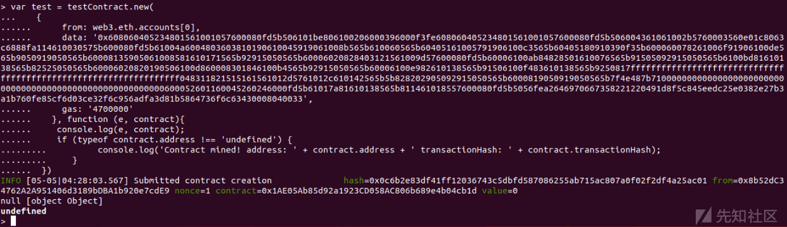

# 以太坊挖矿流程解析 - 先知社区

以太坊挖矿流程解析

- - -

## 文章前言

随着区块链技术的迅猛发展，以太坊成为了其中最受关注和应用广泛的平台之一，以太坊不仅是一种数字货币，更是一个去中心化的计算平台，为开发者提供了构建智能合约和去中心化应用 (DApps) 的能力，而作为以太坊网络的基石，挖矿是确保其安全性和稳定性的重要环节，本篇文章将从源代码角度对挖坑进行一个详细刨析并会对挖矿进行一个简单的演示

## 源码分析

### 数据结构

挖矿参数配置的数据结构如下：

```plain
// filedir: go-ethereum-1.10.2\miner\miner.go  L42
// Config is the configuration parameters of mining.
type Config struct {
    Etherbase  common.Address `toml:",omitempty"` // Public address for block mining rewards (default = first account)
    Notify     []string       `toml:",omitempty"` // HTTP URL list to be notified of new work packages (only useful in ethash).
    NotifyFull bool           `toml:",omitempty"` // Notify with pending block headers instead of work packages
    ExtraData  hexutil.Bytes  `toml:",omitempty"` // Block extra data set by the miner
    GasFloor   uint64         // Target gas floor for mined blocks.
    GasCeil    uint64         // Target gas ceiling for mined blocks.
    GasPrice   *big.Int       // Minimum gas price for mining a transaction
    Recommit   time.Duration  // The time interval for miner to re-create mining work.
    Noverify   bool           // Disable remote mining solution verification(only useful in ethash).
}
```

参数解释如下：

-   Etherbase: 公共地址，用于指定挖矿奖励的接收地址。在挖矿成功后以太币的奖励将发送至该地址，如果没有指定，默认为第一个账户的地址
-   Notify: HTTP URL 列表，用于接收新的挖矿工作包的通知，当有新的工作可用时，挖矿节点将向这些 URL 发送通知，这个字段在以太坊的 ethash 挖矿算法中比较有用
-   NotifyFull: 布尔值，用于指定是否使用完整的区块头信息而不仅仅是工作包来发送通知，如果设置为 true，挖矿节点将发送包含待处理区块头的通知
-   ExtraData: 十六进制字节数组，用于设置由矿工添加到挖掘的区块的附加数据。矿工可以在区块的额外数据字段中添加自定义信息
-   GasFloor: 目标矿工挖掘的区块的最低目标燃料限制。燃料是以太坊中执行交易和计算所需的资源单位
-   GasCeil: 目标矿工挖掘的区块的最高目标燃料限制。矿工在挖掘过程中，尝试创建燃料消耗在 GasFloor 和 GasCeil 之间的区块。
-   GasPrice: 最低燃料价格的大整数值，用于指定矿工愿意接受的最低交易燃料价格。矿工将只挖掘那些提供的交易价格高于或等于此值的交易。
-   Recommit: 时间间隔，用于指定矿工重新创建挖矿工作的时间间隔。在此时间间隔后，矿工将重新生成新的挖矿工作以确保持续挖掘。
-   Noverify: 这是一个布尔值，用于指定是否禁用远程挖矿解决方案的验证。在以太坊的 ethash 挖矿算法中，验证工作量证明（PoW）是一个耗时的过程。通过禁用验证，可以提高挖矿节点的效率

矿工数据结构：

```plain
// Miner creates blocks and searches for proof-of-work values.
type Miner struct {
    mux      *event.TypeMux
    worker   *worker
    coinbase common.Address
    eth      Backend
    engine   consensus.Engine
    exitCh   chan struct{}
    startCh  chan common.Address
    stopCh   chan struct{}
}
```

worker 数据结构：

```plain
// worker is the main object which takes care of submitting new work to consensus engine
// and gathering the sealing result.
type worker struct {
    config      *Config
    chainConfig *params.ChainConfig
    engine      consensus.Engine
    eth         Backend
    chain       *core.BlockChain

    // Feeds
    pendingLogsFeed event.Feed

    // Subscriptions
    mux          *event.TypeMux
    txsCh        chan core.NewTxsEvent
    txsSub       event.Subscription
    chainHeadCh  chan core.ChainHeadEvent
    chainHeadSub event.Subscription
    chainSideCh  chan core.ChainSideEvent
    chainSideSub event.Subscription

    // Channels
    newWorkCh          chan *newWorkReq
    taskCh             chan *task
    resultCh           chan *types.Block
    startCh            chan struct{}
    exitCh             chan struct{}
    resubmitIntervalCh chan time.Duration
    resubmitAdjustCh   chan *intervalAdjust

    current      *environment                 // An environment for current running cycle.
    localUncles  map[common.Hash]*types.Block // A set of side blocks generated locally as the possible uncle blocks.
    remoteUncles map[common.Hash]*types.Block // A set of side blocks as the possible uncle blocks.
    unconfirmed  *unconfirmedBlocks           // A set of locally mined blocks pending canonicalness confirmations.

    mu       sync.RWMutex // The lock used to protect the coinbase and extra fields
    coinbase common.Address
    extra    []byte

    pendingMu    sync.RWMutex
    pendingTasks map[common.Hash]*task

    snapshotMu    sync.RWMutex // The lock used to protect the block snapshot and state snapshot
    snapshotBlock *types.Block
    snapshotState *state.StateDB

    // atomic status counters
    running int32 // The indicator whether the consensus engine is running or not.
    newTxs  int32 // New arrival transaction count since last sealing work submitting.

    // noempty is the flag used to control whether the feature of pre-seal empty
    // block is enabled. The default value is false(pre-seal is enabled by default).
    // But in some special scenario the consensus engine will seal blocks instantaneously,
    // in this case this feature will add all empty blocks into canonical chain
    // non-stop and no real transaction will be included.
    noempty uint32

    // External functions
    isLocalBlock func(block *types.Block) bool // Function used to determine whether the specified block is mined by local miner.

    // Test hooks
    newTaskHook  func(*task)                        // Method to call upon receiving a new sealing task.
    skipSealHook func(*task) bool                   // Method to decide whether skipping the sealing.
    fullTaskHook func()                             // Method to call before pushing the full sealing task.
    resubmitHook func(time.Duration, time.Duration) // Method to call upon updating resubmitting interval.
}
```

### 矿工实例

通过 New 方法用于创建一个矿工实例，在函数内部通过使用 Miner 结构体的字面量初始化，创建一个 Miner 对象，该对象包含了以下字段的赋值

-   eth：指定了以太坊的后端实例
-   mux：指定了事件类型的多路复用器，用于处理不同类型的事件
-   engine：指定了共识引擎，用于验证和执行挖矿过程中的共识规则
-   exitCh：创建了一个空的通道（channel），用于通知挖矿器退出的信号
-   startCh：创建了一个通道，用于接收指定挖矿奖励接收地址的信号
-   stopCh：创建了一个空的通道，用于通知挖矿器停止挖矿的信号
-   worker：通过调用 newWorker 函数创建了一个工作器（worker）对象，并将其赋值给 worker 字段。工作器是实际执行挖矿工作的组件，其中包含了配置参数、链配置参数、共识引擎等信息

```plain
// filedir:go-ethereum-1.10.2\miner\miner.go  L68
func New(eth Backend, config *Config, chainConfig *params.ChainConfig, mux *event.TypeMux, engine consensus.Engine, isLocalBlock func(block *types.Block) bool) *Miner {
    miner := &Miner{
        eth:     eth,
        mux:     mux,
        engine:  engine,
        exitCh:  make(chan struct{}),
        startCh: make(chan common.Address),
        stopCh:  make(chan struct{}),
        worker:  newWorker(config, chainConfig, engine, eth, mux, isLocalBlock, true),
    }
    go miner.update()

    return miner
}
```

以上代码会调用 newWorker 来创建一个 worker 实例 (这里的 miner 只是一个发起人，真正干活的是 worker)：

```plain
// filedir:go-ethereum-1.10.2\miner\worker.go L190
func newWorker(config *Config, chainConfig *params.ChainConfig, engine consensus.Engine, eth Backend, mux *event.TypeMux, isLocalBlock func(*types.Block) bool, init bool) *worker {
    worker := &worker{
        config:             config,
        chainConfig:        chainConfig,
        engine:             engine,
        eth:                eth,
        mux:                mux,
        chain:              eth.BlockChain(),
        isLocalBlock:       isLocalBlock,
        localUncles:        make(map[common.Hash]*types.Block),
        remoteUncles:       make(map[common.Hash]*types.Block),
        unconfirmed:        newUnconfirmedBlocks(eth.BlockChain(), miningLogAtDepth),
        pendingTasks:       make(map[common.Hash]*task),
        txsCh:              make(chan core.NewTxsEvent, txChanSize),
        chainHeadCh:        make(chan core.ChainHeadEvent, chainHeadChanSize),
        chainSideCh:        make(chan core.ChainSideEvent, chainSideChanSize),
        newWorkCh:          make(chan *newWorkReq),
        taskCh:             make(chan *task),
        resultCh:           make(chan *types.Block, resultQueueSize),
        exitCh:             make(chan struct{}),
        startCh:            make(chan struct{}, 1),
        resubmitIntervalCh: make(chan time.Duration),
        resubmitAdjustCh:   make(chan *intervalAdjust, resubmitAdjustChanSize),
    }
    // Subscribe NewTxsEvent for tx pool
    worker.txsSub = eth.TxPool().SubscribeNewTxsEvent(worker.txsCh)
    // Subscribe events for blockchain
    worker.chainHeadSub = eth.BlockChain().SubscribeChainHeadEvent(worker.chainHeadCh)
    worker.chainSideSub = eth.BlockChain().SubscribeChainSideEvent(worker.chainSideCh)

    // Sanitize recommit interval if the user-specified one is too short.
    recommit := worker.config.Recommit
    if recommit < minRecommitInterval {
        log.Warn("Sanitizing miner recommit interval", "provided", recommit, "updated", minRecommitInterval)
        recommit = minRecommitInterval
    }

    go worker.mainLoop()
    go worker.newWorkLoop(recommit)
    go worker.resultLoop()
    go worker.taskLoop()

    // Submit first work to initialize pending state.
    if init {
        worker.startCh <- struct{}{}
    }
    return worker
}
```

上述代码示例化了一个 worker 对象，之后订阅了 TX pool 中的事件、区块事件，之后启动 worker.mainLoop()、worker.resultLoop()、worker.taskLoop()、worker.newWorkLoop(recommit) 三个协程，之后检查 init 的值 (这里为 true)，如果为 true 则提交第一个 work 以初始化 pending 状态，之后返回一个 worker，紧接着在 New 函数中又会去调用 update 函数来跟踪 download 事件，具体代码如下：

```plain
// filedir:go-ethereum-1.10.2\miner\miner.go  L82
// update keeps track of the downloader events. Please be aware that this is a one shot type of update loop.
// It's entered once and as soon as `Done` or `Failed` has been broadcasted the events are unregistered and
// the loop is exited. This to prevent a major security vuln where external parties can DOS you with blocks
// and halt your mining operation for as long as the DOS continues.
func (miner *Miner) update() {
    events := miner.mux.Subscribe(downloader.StartEvent{}, downloader.DoneEvent{}, downloader.FailedEvent{})
    defer func() {
        if !events.Closed() {
            events.Unsubscribe()
        }
    }()

    shouldStart := false
    canStart := true
    dlEventCh := events.Chan()
    for {
        select {
        case ev := <-dlEventCh:            //  停止所有订阅，停止监听事件
            if ev == nil {
                // Unsubscription done, stop listening    
                dlEventCh = nil
                continue
            }
            switch ev.Data.(type) {
            case downloader.StartEvent:    
                wasMining := miner.Mining()
                miner.worker.stop()
                canStart = false
                if wasMining {
                    // Resume mining after sync was finished
                    shouldStart = true
                    log.Info("Mining aborted due to sync")
                }
            case downloader.FailedEvent:
                canStart = true
                if shouldStart {
                    miner.SetEtherbase(miner.coinbase)
                    miner.worker.start()
                }
            case downloader.DoneEvent:
                canStart = true
                if shouldStart {
                    miner.SetEtherbase(miner.coinbase)
                    miner.worker.start()
                }
                // Stop reacting to downloader events
                events.Unsubscribe()
            }
        case addr := <-miner.startCh:      // 开启挖矿
            miner.SetEtherbase(addr)
            if canStart {
                miner.worker.start()
            }
            shouldStart = true
        case <-miner.stopCh:               // 停止挖矿
            shouldStart = false
            miner.worker.stop()
        case <-miner.exitCh:               // 退出
            miner.worker.close()
            return
        }
    }
}
```

### 矿工地址

setEtherbase 函数用于设置挖矿的矿工地址：

```plain
// setEtherbase sets the etherbase used to initialize the block coinbase field.
func (w *worker) setEtherbase(addr common.Address) {
    w.mu.Lock()
    defer w.mu.Unlock()
    w.coinbase = addr
}
```

### 预挖设置

disablePreseal 与 enablePreseal 用于配置是否开启预挖矿：

```plain
// disablePreseal disables pre-sealing mining feature
func (w *worker) disablePreseal() {
    atomic.StoreUint32(&w.noempty, 1)
}

// enablePreseal enables pre-sealing mining feature
func (w *worker) enablePreseal() {
    atomic.StoreUint32(&w.noempty, 0)
}
```

### 挖矿提交

newWorkLoop 是一个独立的 goroutine，用于在收到事件时提交新的挖掘工作，它主要监听两个重要的通道，一个是 startCh 通道，一个是 chainHeadCh，这两个通道均用于清理特定父区块的 pending tasks 列表，然后递交基于父区块的挖矿 task，区别在于 startCh 通道基于当前 currentBlock，chainHeadCh 基于新传来的区块头，清理残留挖矿任务后转而构建新的挖矿任务，之后调用 commit 函数构建 newWorkReq 对象，将其传入 newWorkCh 通道，进入 MainLoop：

```plain
// newWorkLoop is a standalone goroutine to submit new mining work upon received events.
func (w *worker) newWorkLoop(recommit time.Duration) {
    var (
        interrupt   *int32
        minRecommit = recommit // minimal resubmit interval specified by user.
        timestamp   int64      // timestamp for each round of mining.
    )

    timer := time.NewTimer(0)
    defer timer.Stop()
    <-timer.C // discard the initial tick

    // commit aborts in-flight transaction execution with given signal and resubmits a new one.
    commit := func(noempty bool, s int32) {
        if interrupt != nil {
            atomic.StoreInt32(interrupt, s)
        }
        interrupt = new(int32)
        select {
        case w.newWorkCh <- &newWorkReq{interrupt: interrupt, noempty: noempty, timestamp: timestamp}:
        case <-w.exitCh:
            return
        }
        timer.Reset(recommit)
        atomic.StoreInt32(&w.newTxs, 0)
    }
    // clearPending cleans the stale pending tasks.
    clearPending := func(number uint64) {
        w.pendingMu.Lock()
        for h, t := range w.pendingTasks {
            if t.block.NumberU64()+staleThreshold <= number {
                delete(w.pendingTasks, h)
            }
        }
        w.pendingMu.Unlock()
    }

    for {
        select {
        case <-w.startCh:
            clearPending(w.chain.CurrentBlock().NumberU64())
            timestamp = time.Now().Unix()
            commit(false, commitInterruptNewHead)

        case head := <-w.chainHeadCh:
            clearPending(head.Block.NumberU64())
            timestamp = time.Now().Unix()
            commit(false, commitInterruptNewHead)

        case <-timer.C:
            // If mining is running resubmit a new work cycle periodically to pull in
            // higher priced transactions. Disable this overhead for pending blocks.
            if w.isRunning() && (w.chainConfig.Clique == nil || w.chainConfig.Clique.Period > 0) {
                // Short circuit if no new transaction arrives.
                if atomic.LoadInt32(&w.newTxs) == 0 {
                    timer.Reset(recommit)
                    continue
                }
                commit(true, commitInterruptResubmit)
            }

        case interval := <-w.resubmitIntervalCh:
            // Adjust resubmit interval explicitly by user.
            if interval < minRecommitInterval {
                log.Warn("Sanitizing miner recommit interval", "provided", interval, "updated", minRecommitInterval)
                interval = minRecommitInterval
            }
            log.Info("Miner recommit interval update", "from", minRecommit, "to", interval)
            minRecommit, recommit = interval, interval

            if w.resubmitHook != nil {
                w.resubmitHook(minRecommit, recommit)
            }

        case adjust := <-w.resubmitAdjustCh:
            // Adjust resubmit interval by feedback.
            if adjust.inc {
                before := recommit
                target := float64(recommit.Nanoseconds()) / adjust.ratio
                recommit = recalcRecommit(minRecommit, recommit, target, true)
                log.Trace("Increase miner recommit interval", "from", before, "to", recommit)
            } else {
                before := recommit
                recommit = recalcRecommit(minRecommit, recommit, float64(minRecommit.Nanoseconds()), false)
                log.Trace("Decrease miner recommit interval", "from", before, "to", recommit)
            }

            if w.resubmitHook != nil {
                w.resubmitHook(minRecommit, recommit)
            }

        case <-w.exitCh:
            return
        }
    }
}
```

MainLoop() 主要监听三个重要的通道，newWorkCh(新 work 请求通道)、txsCh(交易池更新事件通道)、chainSideCh(区块链分叉事件通道):

```plain
// mainLoop is a standalone goroutine to regenerate the sealing task based on the received event.
func (w *worker) mainLoop() {
    defer w.txsSub.Unsubscribe()
    defer w.chainHeadSub.Unsubscribe()
    defer w.chainSideSub.Unsubscribe()

    for {
        select {
        case req := <-w.newWorkCh:    // 直接启动commitNewWork，进一步递交挖矿task
            w.commitNewWork(req.interrupt, req.noempty, req.timestamp)

        case ev := <-w.chainSideCh:   // 出现分叉后，处理叔块
            // Short circuit for duplicate side blocks    
            if _, exist := w.localUncles[ev.Block.Hash()]; exist {
                continue
            }
            if _, exist := w.remoteUncles[ev.Block.Hash()]; exist {
                continue
            }
            // Add side block to possible uncle block set depending on the author.
            if w.isLocalBlock != nil && w.isLocalBlock(ev.Block) { // 将该区块作为潜在叔块加入叔块map，key为该区块的矿工地址
                w.localUncles[ev.Block.Hash()] = ev.Block
            } else {
                w.remoteUncles[ev.Block.Hash()] = ev.Block
            } // 如果我们正在mining的区块少于两个uncles，则添加新的uncles并重新生成mining block
            // If our mining block contains less than 2 uncle blocks,
            // add the new uncle block if valid and regenerate a mining block.
            if w.isRunning() && w.current != nil && w.current.uncles.Cardinality() < 2 {
                start := time.Now()
                if err := w.commitUncle(w.current, ev.Block.Header()); err == nil {
                    var uncles []*types.Header
                    w.current.uncles.Each(func(item interface{}) bool {
                        hash, ok := item.(common.Hash)
                        if !ok {
                            return false
                        }
                        uncle, exist := w.localUncles[hash]
                        if !exist {
                            uncle, exist = w.remoteUncles[hash]
                        }
                        if !exist {
                            return false
                        }
                        uncles = append(uncles, uncle.Header())
                        return false
                    })
                    w.commit(uncles, nil, true, start)
                }
            }

        case ev := <-w.txsCh:   // 交易池更新后
            // Apply transactions to the pending state if we're not mining.
            //
            // Note all transactions received may not be continuous with transactions
            // already included in the current mining block. These transactions will
            // be automatically eliminated.
            if !w.isRunning() && w.current != nil { //待挖矿停止，执行该交易并更新世界状态,如果该交易与正在mining的交易不连续，则直接忽略
                // If block is already full, abort
                if gp := w.current.gasPool; gp != nil && gp.Gas() < params.TxGas {
                    continue
                }
                w.mu.RLock()
                coinbase := w.coinbase
                w.mu.RUnlock()

                txs := make(map[common.Address]types.Transactions)
                for _, tx := range ev.Txs {
                    acc, _ := types.Sender(w.current.signer, tx)
                    txs[acc] = append(txs[acc], tx)
                }
                txset := types.NewTransactionsByPriceAndNonce(w.current.signer, txs)
                tcount := w.current.tcount
                w.commitTransactions(txset, coinbase, nil)
                // Only update the snapshot if any new transactons were added
                // to the pending block
                if tcount != w.current.tcount {
                    w.updateSnapshot()
                }
            } else {
                // Special case, if the consensus engine is 0 period clique(dev mode),
                // submit mining work here since all empty submission will be rejected
                // by clique. Of course the advance sealing(empty submission) is disabled.
                if w.chainConfig.Clique != nil && w.chainConfig.Clique.Period == 0 {
                    w.commitNewWork(nil, true, time.Now().Unix())
                }
            }
            atomic.AddInt32(&w.newTxs, int32(len(ev.Txs)))

        // System stopped
        case <-w.exitCh:
            return
        case <-w.txsSub.Err():
            return
        case <-w.chainHeadSub.Err():
            return
        case <-w.chainSideSub.Err():
            return
        }
    }
}
```

newWorkCh 通道传出 req 后，直接启动了 commitNewWork() 函数，该函数的主要功能是递交一个新的 task：  
初始化一个新区块头给待挖矿的区块  
为当前挖矿周期初始化一个工作环境 work 3）获取交易池中每个账户地址的交易列表中的第一个交易后排序，然后应用这些交易 4）获取两个叔块 6）将区块递交给 commit，用于生成 task 7）更新状态快照，供前端查询

```plain
// filedir: go-ethereum-1.10.2\miner\worker.go  L868
// commitNewWork generates several new sealing tasks based on the parent block.
func (w *worker) commitNewWork(interrupt *int32, noempty bool, timestamp int64) {
    w.mu.RLock()
    defer w.mu.RUnlock()

    tstart := time.Now()
    parent := w.chain.CurrentBlock()

    if parent.Time() >= uint64(timestamp) {  //如果父区块的时间比现在的时间还大，将当前时间设置为父区块时间+1
        timestamp = int64(parent.Time() + 1)
    }
    // task1:初始化区块头给待挖矿的区块，调用core.CalcGasLimit方法，计算gas限额
    // 如果父区块使用的gas大于父区块gasLimit的2/3，那么当前区块的gasLimit就会增加
    num := parent.Number() 
    header := &types.Header{
        ParentHash: parent.Hash(),
        Number:     num.Add(num, common.Big1),
        GasLimit:   core.CalcGasLimit(parent, w.config.GasFloor, w.config.GasCeil),
        Extra:      w.extra,
        Time:       uint64(timestamp),
    }
    // 共识引擎启动后才能设置coinbase到区块头(avoid spurious block rewards)
    if w.isRunning() {
        if w.coinbase == (common.Address{}) {
            log.Error("Refusing to mine without etherbase")
            return
        }
        header.Coinbase = w.coinbase
    }
    if err := w.engine.Prepare(w.chain, header); err != nil { // 计算挖矿难度值
        log.Error("Failed to prepare header for mining", "err", err)
        return
    }
    // If we are care about TheDAO hard-fork check whether to override the extra-data or not
    if daoBlock := w.chainConfig.DAOForkBlock; daoBlock != nil {  // 处理DAO事件分叉
        // Check whether the block is among the fork extra-override range
        limit := new(big.Int).Add(daoBlock, params.DAOForkExtraRange)
        if header.Number.Cmp(daoBlock) >= 0 && header.Number.Cmp(limit) < 0 {
            // Depending whether we support or oppose the fork, override differently
            if w.chainConfig.DAOForkSupport {
                header.Extra = common.CopyBytes(params.DAOForkBlockExtra)
            } else if bytes.Equal(header.Extra, params.DAOForkBlockExtra) {
                header.Extra = []byte{} // If miner opposes, don't let it use the reserved extra-data
            }
        }
    }
    //task2：设置当前任务的environment，其中获取了7个ancestors和与之直接相连的familily
    err := w.makeCurrent(parent, header)
    if err != nil {
        log.Error("Failed to create mining context", "err", err)
        return
    }
    // Create the current work task and check any fork transitions needed  创建当前work task
    env := w.current
    if w.chainConfig.DAOForkSupport && w.chainConfig.DAOForkBlock != nil && w.chainConfig.DAOForkBlock.Cmp(header.Number) == 0 {
        misc.ApplyDAOHardFork(env.state)
    }
    // task3：添加两个叔块到当前mining block中
    uncles := make([]*types.Header, 0, 2)
    commitUncles := func(blocks map[common.Hash]*types.Block) {
        // 先清除之前的uncle
        for hash, uncle := range blocks {
            if uncle.NumberU64()+staleThreshold <= header.Number.Uint64() {
                delete(blocks, hash)
            }
        }
        for hash, uncle := range blocks {
            if len(uncles) == 2 {
                break
            }
            if err := w.commitUncle(env, uncle.Header()); err != nil {
                log.Trace("Possible uncle rejected", "hash", hash, "reason", err)
            } else {
                log.Debug("Committing new uncle to block", "hash", hash)
                uncles = append(uncles, uncle.Header())
            }
        }
    }
    // 优先选择本地叔块
    commitUncles(w.localUncles)
    commitUncles(w.remoteUncles)

    // Create an empty block based on temporary copied state for
    // sealing in advance without waiting block execution finished.
    if !noempty && atomic.LoadUint32(&w.noempty) == 0 {
        w.commit(uncles, nil, false, tstart) //如果noempty参数为false，根据临时复制状态创建一个空块，以便在不等待块执行完成的情况下提前创建block
    }
    // task4：从交易池pending列表中向区块中添加可用的交易
    // Fill the block with all available pending transactions.
    pending, err := w.eth.TxPool().Pending()
    if err != nil {
        log.Error("Failed to fetch pending transactions", "err", err)
        return
    }
    // Short circuit if there is no available pending transactions.
    // But if we disable empty precommit already, ignore it. Since
    // empty block is necessary to keep the liveness of the network.
    if len(pending) == 0 && atomic.LoadUint32(&w.noempty) == 0 {// 如果没有可用的交易，更新一下状态快照
        w.updateSnapshot()
        return
    }
    // 将交易分为local和remote，分别执行commitTransaction，将交易执行并传入block
    localTxs, remoteTxs := make(map[common.Address]types.Transactions), pending
    for _, account := range w.eth.TxPool().Locals() {
        if txs := remoteTxs[account]; len(txs) > 0 {
            delete(remoteTxs, account)
            localTxs[account] = txs
        }
    }
    if len(localTxs) > 0 {
        txs := types.NewTransactionsByPriceAndNonce(w.current.signer, localTxs)
        if w.commitTransactions(txs, w.coinbase, interrupt) {
            return
        }
    }
    if len(remoteTxs) > 0 {
        txs := types.NewTransactionsByPriceAndNonce(w.current.signer, remoteTxs)
        if w.commitTransactions(txs, w.coinbase, interrupt) {
            return
        }
    }
    w.commit(uncles, w.fullTaskHook, true, tstart)  // task5：递交
}
```

最后通过 commit 方法计算挖矿奖励，更新 block，将上面生成的 block 递交到一个挖矿 task，最后将 task 传入 taskCh 通道

```plain
// commit runs any post-transaction state modifications, assembles the final block
// and commits new work if consensus engine is running.
func (w *worker) commit(uncles []*types.Header, interval func(), update bool, start time.Time) error {
    // Deep copy receipts here to avoid interaction between different tasks.
    receipts := copyReceipts(w.current.receipts)
    s := w.current.state.Copy()
    block, err := w.engine.FinalizeAndAssemble(w.chain, w.current.header, s, w.current.txs, uncles, receipts)// 计算挖矿奖励 (包括叔块奖励)
    if err != nil {
        return err
    }
    if w.isRunning() {
        if interval != nil {
            interval()
        }
        select {
        case w.taskCh <- &task{receipts: receipts, state: s, block: block, createdAt: time.Now()}: // 生成 task，传入 taskCh 通道
            w.unconfirmed.Shift(block.NumberU64() - 1)
            log.Info("Commit new mining work", "number", block.Number(), "sealhash", w.engine.SealHash(block.Header()),
                "uncles", len(uncles), "txs", w.current.tcount,
                "gas", block.GasUsed(), "fees", totalFees(block, receipts),
                "elapsed", common.PrettyDuration(time.Since(start)))

        case <-w.exitCh:
            log.Info("Worker has exited")
        }
    }
    if update {
        w.updateSnapshot()
    }
    return nil
}
```

task 进入 taskLoop 后，被加入 pendingTasks 列表：

```plain
// taskLoop is a standalone goroutine to fetch sealing task from the generator and
// push them to consensus engine.
func (w *worker) taskLoop() {
    var (
        stopCh chan struct{}
        prev   common.Hash
    )

    // interrupt aborts the in-flight sealing task.
    interrupt := func() {
        if stopCh != nil {
            close(stopCh)
            stopCh = nil
        }
    }
    for {
        select {
        case task := <-w.taskCh:
            if w.newTaskHook != nil {
                w.newTaskHook(task)
            }
            // 计算header数据的RLP hash值，判断是否有相同的块已经在挖矿中了，如果是则放弃,如果不是，则终止之前的挖矿
            sealHash := w.engine.SealHash(task.block.Header())
            if sealHash == prev {
                continue
            }
            // Interrupt previous sealing operation
            interrupt()
            stopCh, prev = make(chan struct{}), sealHash

            if w.skipSealHook != nil && w.skipSealHook(task) {
                continue
            }
            w.pendingMu.Lock()
            w.pendingTasks[sealHash] = task
            w.pendingMu.Unlock()
            // 最后执行挖矿，结果会通过resultCh传入resultLoop
            if err := w.engine.Seal(w.chain, task.block, w.resultCh, stopCh); err != nil {
                log.Warn("Block sealing failed", "err", err)
            }
        case <-w.exitCh:
            interrupt()
            return
        }
    }
}
```

最后挖矿结果传入 resultLoop，先从 pendingTasks 列表中取出执行挖矿的 task，更新收据日志中的 blockHash，然后将区块存入数据库，最后将区块广播出去

```plain
// resultLoop is a standalone goroutine to handle sealing result submitting
// and flush relative data to the database.
func (w *worker) resultLoop() {
    for {
        select {
        case block := <-w.resultCh:
            // Short circuit when receiving empty result.
            if block == nil {
                continue
            }
            // Short circuit when receiving duplicate result caused by resubmitting.
            if w.chain.HasBlock(block.Hash(), block.NumberU64()) {
                continue
            }
            var (
                sealhash = w.engine.SealHash(block.Header())
                hash     = block.Hash()
            )
            w.pendingMu.RLock()
            task, exist := w.pendingTasks[sealhash]
            w.pendingMu.RUnlock()
            if !exist {
                log.Error("Block found but no relative pending task", "number", block.Number(), "sealhash", sealhash, "hash", hash)
                continue
            }
            // Different block could share same sealhash, deep copy here to prevent write-write conflict.
            var (
                receipts = make([]*types.Receipt, len(task.receipts))
                logs     []*types.Log
            )
            for i, receipt := range task.receipts {
                // add block location fields
                receipt.BlockHash = hash
                receipt.BlockNumber = block.Number()
                receipt.TransactionIndex = uint(i)

                receipts[i] = new(types.Receipt)
                *receipts[i] = *receipt
                // Update the block hash in all logs since it is now available and not when the
                // receipt/log of individual transactions were created.
                for _, log := range receipt.Logs {
                    log.BlockHash = hash
                }
                logs = append(logs, receipt.Logs...)
            }
            // Commit block and state to database.
            _, err := w.chain.WriteBlockWithState(block, receipts, logs, task.state, true)
            if err != nil {
                log.Error("Failed writing block to chain", "err", err)
                continue
            }
            log.Info("Successfully sealed new block", "number", block.Number(), "sealhash", sealhash, "hash", hash,
                "elapsed", common.PrettyDuration(time.Since(task.createdAt)))

            // Broadcast the block and announce chain insertion event
            w.mux.Post(core.NewMinedBlockEvent{Block: block})

            // Insert the block into the set of pending ones to resultLoop for confirmations
            w.unconfirmed.Insert(block.NumberU64(), block.Hash())

        case <-w.exitCh:
            return
        }
    }
}
```

### 区块打包

commitNewWork 函数主要用于区块打包工作，在函数开头首先获取当前区块，然后创建一个 Header 结构，填充父块 hash、区块高度、GasLimit、矿工地址等信息，之后调用 Prepare() 函数来初始化共识引擎，之后调用 makeCurrent() 函数来创建新 Work，之后调用 commitUncle() 把叔块 header 的 hash 添加进 Work.uncles 集合中，并调用 commitTransactions 提交交易到 EVM 去执行：

```plain
// commitNewWork generates several new sealing tasks based on the parent block.
func (w *worker) commitNewWork(interrupt *int32, noempty bool, timestamp int64) {
    w.mu.RLock()
    defer w.mu.RUnlock()

    tstart := time.Now()
    parent := w.chain.CurrentBlock()

    if parent.Time() >= uint64(timestamp) {
        timestamp = int64(parent.Time() + 1)
    }
    num := parent.Number()
    header := &types.Header{
        ParentHash: parent.Hash(),
        Number:     num.Add(num, common.Big1),
        GasLimit:   core.CalcGasLimit(parent, w.config.GasFloor, w.config.GasCeil),
        Extra:      w.extra,
        Time:       uint64(timestamp),
    }
    // Only set the coinbase if our consensus engine is running (avoid spurious block rewards)
    if w.isRunning() {
        if w.coinbase == (common.Address{}) {
            log.Error("Refusing to mine without etherbase")
            return
        }
        header.Coinbase = w.coinbase
    }
    if err := w.engine.Prepare(w.chain, header); err != nil {
        log.Error("Failed to prepare header for mining", "err", err)
        return
    }
    // If we are care about TheDAO hard-fork check whether to override the extra-data or not
    if daoBlock := w.chainConfig.DAOForkBlock; daoBlock != nil {
        // Check whether the block is among the fork extra-override range
        limit := new(big.Int).Add(daoBlock, params.DAOForkExtraRange)
        if header.Number.Cmp(daoBlock) >= 0 && header.Number.Cmp(limit) < 0 {
            // Depending whether we support or oppose the fork, override differently
            if w.chainConfig.DAOForkSupport {
                header.Extra = common.CopyBytes(params.DAOForkBlockExtra)
            } else if bytes.Equal(header.Extra, params.DAOForkBlockExtra) {
                header.Extra = []byte{} // If miner opposes, don't let it use the reserved extra-data
            }
        }
    }
    // Could potentially happen if starting to mine in an odd state.
    err := w.makeCurrent(parent, header)
    if err != nil {
        log.Error("Failed to create mining context", "err", err)
        return
    }
    // Create the current work task and check any fork transitions needed
    env := w.current
    if w.chainConfig.DAOForkSupport && w.chainConfig.DAOForkBlock != nil && w.chainConfig.DAOForkBlock.Cmp(header.Number) == 0 {
        misc.ApplyDAOHardFork(env.state)
    }
    // Accumulate the uncles for the current block
    uncles := make([]*types.Header, 0, 2)
    commitUncles := func(blocks map[common.Hash]*types.Block) {
        // Clean up stale uncle blocks first
        for hash, uncle := range blocks {
            if uncle.NumberU64()+staleThreshold <= header.Number.Uint64() {
                delete(blocks, hash)
            }
        }
        for hash, uncle := range blocks {
            if len(uncles) == 2 {
                break
            }
            if err := w.commitUncle(env, uncle.Header()); err != nil {
                log.Trace("Possible uncle rejected", "hash", hash, "reason", err)
            } else {
                log.Debug("Committing new uncle to block", "hash", hash)
                uncles = append(uncles, uncle.Header())
            }
        }
    }
    // Prefer to locally generated uncle
    commitUncles(w.localUncles)
    commitUncles(w.remoteUncles)

    // Create an empty block based on temporary copied state for
    // sealing in advance without waiting block execution finished.
    if !noempty && atomic.LoadUint32(&w.noempty) == 0 {
        w.commit(uncles, nil, false, tstart)
    }

    // Fill the block with all available pending transactions.
    pending, err := w.eth.TxPool().Pending()
    if err != nil {
        log.Error("Failed to fetch pending transactions", "err", err)
        return
    }
    // Short circuit if there is no available pending transactions.
    // But if we disable empty precommit already, ignore it. Since
    // empty block is necessary to keep the liveness of the network.
    if len(pending) == 0 && atomic.LoadUint32(&w.noempty) == 0 {
        w.updateSnapshot()
        return
    }
    // Split the pending transactions into locals and remotes
    localTxs, remoteTxs := make(map[common.Address]types.Transactions), pending
    for _, account := range w.eth.TxPool().Locals() {
        if txs := remoteTxs[account]; len(txs) > 0 {
            delete(remoteTxs, account)
            localTxs[account] = txs
        }
    }
    if len(localTxs) > 0 {
        txs := types.NewTransactionsByPriceAndNonce(w.current.signer, localTxs)
        if w.commitTransactions(txs, w.coinbase, interrupt) {
            return
        }
    }
    if len(remoteTxs) > 0 {
        txs := types.NewTransactionsByPriceAndNonce(w.current.signer, remoteTxs)
        if w.commitTransactions(txs, w.coinbase, interrupt) {
            return
        }
    }
    w.commit(uncles, w.fullTaskHook, true, tstart)
}
```

## 挖矿演示

这里我们介绍一个通过挖矿来部署智能合约的示例，期间主要通过底层的接口调用来实现，涉及到交易费用、合约部署、交易信息等的关联性问题：

### 合约创建

以太坊支持使用 solidity 编写的智能合约，用户可以使用 Solidity 编写一个自己所需要的之智能合约，例如：

```plain
pragma solidity ^0.8.4;

contract test{
    function multiply(uint a) public returns(uint d){
        return a *7;
    }
}
```

### 合约编译

关于合约的编译我们可以使用 solc 也可以使用在线编译工具 Remix 来对合约进行编译操作：  
[](https://xzfile.aliyuncs.com/media/upload/picture/20240124160418-2cc9ba9c-ba8f-1.png)  
ABI:

```plain
[
    {
        "inputs": [
            {
                "internalType": "uint256",
                "name": "a",
                "type": "uint256"
            }
        ],
        "name": "multiply",
        "outputs": [
            {
                "internalType": "uint256",
                "name": "d",
                "type": "uint256"
            }
        ],
        "stateMutability": "nonpayable",
        "type": "function"
    }
]
```

之后在 bejson 中转义成字符串[http://www.bejson.com/jsonviewernew/](http://www.bejson.com/jsonviewernew/)

```plain
[{\"constant\":false,\"inputs\":[{\"name\":\"a\",\"type\":\"uint256\"}],\"name\":\"multiply\",\"outputs\":[{\"name\":\"d\",\"type\":\"uint256\"}],\"payable\":false,\"type\":\"function\",\"stateMutability\":\"nonpayable\"}]
```

### 合约部署

启动公链的交互模式：

```plain
sudo geth --networkid 666 --datadir /home/ubuntu/Private_eth/eth1 --identity "node1" --rpc --rpcport "8545" --rpcaddr "192.168.174.212" --nodiscover --rpcapi "eth,net,web3,txpool,debug,miner" --allow-insecure-unlock console
```

[](https://xzfile.aliyuncs.com/media/upload/picture/20240124160550-639fc868-ba8f-1.png)  
之后我们创建一个对象：

```plain
var abi=JSON.parse('[{\"constant\":false,\"inputs\":[{\"name\":\"a\",\"type\":\"uint256\"}],\"name\":\"multiply\",\"outputs\":[{\"name\":\"d\",\"type\":\"uint256\"}],\"payable\":false,\"type\":\"function\",\"stateMutability\":\"nonpayable\"}]')
```

[](https://xzfile.aliyuncs.com/media/upload/picture/20240124160601-69cd359a-ba8f-1.png)

```plain
myContract=web3.eth.contract(abi)
```

[](https://xzfile.aliyuncs.com/media/upload/picture/20240124160625-787b8d94-ba8f-1.png)  
之后检查 coinbase 账户余额 (如果这里的余额大于 0，则继续，否则，开始挖矿，等你觉得差不多的时候再停止就 OK)

```plain
> eth.coinbase
"0x8b52dc34762a2a951406d3189bdba1b920e7cde9"
> eth.accounts[0]
"0x8b52dc34762a2a951406d3189bdba1b920e7cde9"
> web3.fromWei(eth.getBalance(eth.accounts[0]),"ether")
20.000021
>
```

[](https://xzfile.aliyuncs.com/media/upload/picture/20240124160650-873285c2-ba8f-1.png)  
之后解锁 coinbase 账户，并使用 coinbase 账户来部署合约

```plain
personal.unlockAccount(eth.accounts[0],"123456",0)
```

[](https://xzfile.aliyuncs.com/media/upload/picture/20240124160709-92529672-ba8f-1.png)  
之后预估手续费——149143 wei:  
[](https://xzfile.aliyuncs.com/media/upload/picture/20240124160737-a2e48e64-ba8f-1.png)  
之后开始部署合约 (这里增加一个回调函数为了看效果)  
[](https://xzfile.aliyuncs.com/media/upload/picture/20240124160757-af473a76-ba8f-1.png)  
之后开启挖矿 (这里我们将 log 输出到了 geth.log 文件中去并未在控制台中显示，所以需要访问 geth.log 来查看)

```plain
miner.start()
```

[](https://xzfile.aliyuncs.com/media/upload/picture/20240124160823-be41e120-ba8f-1.png)  
交易信息如下：  
[](https://xzfile.aliyuncs.com/media/upload/picture/20240124160832-c3fd879a-ba8f-1.png)  
之后验证合约部署成功与否：  
[](https://xzfile.aliyuncs.com/media/upload/picture/20240124160852-cfd59508-ba8f-1.png)

## 文末小结

本篇文章主要介绍了以太坊挖矿流程，包括矿工示例的创建、矿工地址设置、预挖矿设计、区块打包等，最后借助挖矿实现了对合约的部署操作，后续有机会可以放出几个公链的 0day，到时候让大家试试手，
