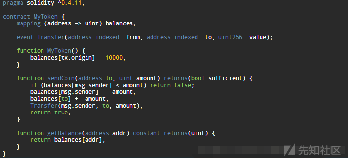
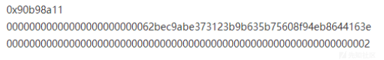
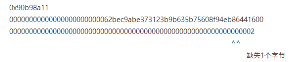

# 以太坊虚拟机工作原理深入刨析 (下) - 先知社区

以太坊虚拟机工作原理深入刨析 (下)

- - -

## 文章前言

本篇文章是对《以太坊虚拟机工作原理深入刨析 (中)》的续篇

## 源码分析

### 合约调用

#### EVM.CallCode

EVM.CallCode 函数主要用于执行与指定地址关联的合约代码并处理必要的转账操作，在执行过程中会进行递归调用的检查、深度限制的检查、余额检查等，它还负责处理转账操作和创建账户并在执行错误或转账失败时回滚状态，函数的实现根据合约地址是否是预编译合约来执行不同的逻辑，最后返回执行结果、剩余的 Gas 和可能的错误

```plain
// CallCode executes the contract associated with the addr with the given input
// as parameters. It also handles any necessary value transfer required and takes
// the necessary steps to create accounts and reverses the state in case of an
// execution error or failed value transfer.
//
// CallCode differs from Call in the sense that it executes the given address'
// code with the caller as context.
func (evm *EVM) CallCode(caller ContractRef, addr common.Address, input []byte, gas uint64, value *big.Int) (ret []byte, leftOverGas uint64, err error) {
    if evm.vmConfig.NoRecursion && evm.depth > 0 {
        return nil, gas, nil
    }
    // Fail if we're trying to execute above the call depth limit
    if evm.depth > int(params.CallCreateDepth) {
        return nil, gas, ErrDepth
    }
    // Fail if we're trying to transfer more than the available balance
    // Note although it's noop to transfer X ether to caller itself. But
    // if caller doesn't have enough balance, it would be an error to allow
    // over-charging itself. So the check here is necessary.
    if !evm.Context.CanTransfer(evm.StateDB, caller.Address(), value) {
        return nil, gas, ErrInsufficientBalance
    }
    var snapshot = evm.StateDB.Snapshot()

    // It is allowed to call precompiles, even via delegatecall
    if p, isPrecompile := evm.precompile(addr); isPrecompile {
        ret, gas, err = RunPrecompiledContract(p, input, gas)
    } else {
        addrCopy := addr
        // Initialise a new contract and set the code that is to be used by the EVM.
        // The contract is a scoped environment for this execution context only.
        contract := NewContract(caller, AccountRef(caller.Address()), value, gas)
        contract.SetCallCode(&addrCopy, evm.StateDB.GetCodeHash(addrCopy), evm.StateDB.GetCode(addrCopy))
        ret, err = run(evm, contract, input, false)
        gas = contract.Gas
    }
    if err != nil {
        evm.StateDB.RevertToSnapshot(snapshot)
        if err != ErrExecutionReverted {
            gas = 0
        }
    }
    return ret, gas, err
}
```

RunPrecompiledContract 函数如下，首先检查 gas 是否足够，之后调用 run，和 call 一致：

```plain
// RunPrecompiledContract runs and evaluates the output of a precompiled contract.
// It returns
// - the returned bytes,
// - the _remaining_ gas,
// - any error that occurred
func RunPrecompiledContract(p PrecompiledContract, input []byte, suppliedGas uint64) (ret []byte, remainingGas uint64, err error) {
    gasCost := p.RequiredGas(input)
    if suppliedGas < gasCost {
        return nil, 0, ErrOutOfGas
    }
    suppliedGas -= gasCost
    output, err := p.Run(input)
    return output, suppliedGas, err
}
```

如果不是原生合约，则调用 run 函数执行合约，之后返回字节码信息：

```plain
// run runs the given contract and takes care of running precompiles with a fallback to the byte code interpreter.
func run(evm *EVM, contract *Contract, input []byte, readOnly bool) ([]byte, error) {
    for _, interpreter := range evm.interpreters {
        if interpreter.CanRun(contract.Code) {
            if evm.interpreter != interpreter {
                // Ensure that the interpreter pointer is set back
                // to its current value upon return.
                defer func(i Interpreter) {
                    evm.interpreter = i
                }(evm.interpreter)
                evm.interpreter = interpreter
            }
            return interpreter.Run(contract, input, readOnly)
        }
    }
    return nil, errors.New("no compatible interpreter")
}
```

如果有错误产生则回退到之前的快照：

```plain
if err != nil {
        evm.StateDB.RevertToSnapshot(snapshot)
        if err != ErrExecutionReverted {
            gas = 0
        }
    }
    return ret, gas, err
```

#### EVM.DelegateCall

EVM.DelegateCall 代码如下所示，与 CallCode 类似，这里不再赘述：

```plain
// DelegateCall executes the contract associated with the addr with the given input
// as parameters. It reverses the state in case of an execution error.
//
// DelegateCall differs from CallCode in the sense that it executes the given address'
// code with the caller as context and the caller is set to the caller of the caller.
func (evm *EVM) DelegateCall(caller ContractRef, addr common.Address, input []byte, gas uint64) (ret []byte, leftOverGas uint64, err error) {
    if evm.vmConfig.NoRecursion && evm.depth > 0 {
        return nil, gas, nil
    }
    // Fail if we're trying to execute above the call depth limit
    if evm.depth > int(params.CallCreateDepth) {
        return nil, gas, ErrDepth
    }
    var snapshot = evm.StateDB.Snapshot()

    // It is allowed to call precompiles, even via delegatecall
    if p, isPrecompile := evm.precompile(addr); isPrecompile {
        ret, gas, err = RunPrecompiledContract(p, input, gas)
    } else {
        addrCopy := addr
        // Initialise a new contract and make initialise the delegate values
        contract := NewContract(caller, AccountRef(caller.Address()), nil, gas).AsDelegate()
        contract.SetCallCode(&addrCopy, evm.StateDB.GetCodeHash(addrCopy), evm.StateDB.GetCode(addrCopy))
        ret, err = run(evm, contract, input, false)
        gas = contract.Gas
    }
    if err != nil {
        evm.StateDB.RevertToSnapshot(snapshot)
        if err != ErrExecutionReverted {
            gas = 0
        }
    }
    return ret, gas, err
}
```

#### EVM.StaticCall

EVM.StaticCall 函数代码如下所示，与 CallCode 大同小异，这里不再赘述：

```plain
// StaticCall executes the contract associated with the addr with the given input
// as parameters while disallowing any modifications to the state during the call.
// Opcodes that attempt to perform such modifications will result in exceptions
// instead of performing the modifications.
func (evm *EVM) StaticCall(caller ContractRef, addr common.Address, input []byte, gas uint64) (ret []byte, leftOverGas uint64, err error) {
    if evm.vmConfig.NoRecursion && evm.depth > 0 {
        return nil, gas, nil
    }
    // Fail if we're trying to execute above the call depth limit
    if evm.depth > int(params.CallCreateDepth) {
        return nil, gas, ErrDepth
    }
    // We take a snapshot here. This is a bit counter-intuitive, and could probably be skipped.
    // However, even a staticcall is considered a 'touch'. On mainnet, static calls were introduced
    // after all empty accounts were deleted, so this is not required. However, if we omit this,
    // then certain tests start failing; stRevertTest/RevertPrecompiledTouchExactOOG.json.
    // We could change this, but for now it's left for legacy reasons
    var snapshot = evm.StateDB.Snapshot()

    // We do an AddBalance of zero here, just in order to trigger a touch.
    // This doesn't matter on Mainnet, where all empties are gone at the time of Byzantium,
    // but is the correct thing to do and matters on other networks, in tests, and potential
    // future scenarios
    evm.StateDB.AddBalance(addr, big0)

    if p, isPrecompile := evm.precompile(addr); isPrecompile {
        ret, gas, err = RunPrecompiledContract(p, input, gas)
    } else {
        // At this point, we use a copy of address. If we don't, the go compiler will
        // leak the 'contract' to the outer scope, and make allocation for 'contract'
        // even if the actual execution ends on RunPrecompiled above.
        addrCopy := addr
        // Initialise a new contract and set the code that is to be used by the EVM.
        // The contract is a scoped environment for this execution context only.
        contract := NewContract(caller, AccountRef(addrCopy), new(big.Int), gas)
        contract.SetCallCode(&addrCopy, evm.StateDB.GetCodeHash(addrCopy), evm.StateDB.GetCode(addrCopy))
        // When an error was returned by the EVM or when setting the creation code
        // above we revert to the snapshot and consume any gas remaining. Additionally
        // when we're in Homestead this also counts for code storage gas errors.
        ret, err = run(evm, contract, input, true)
        gas = contract.Gas
    }
    if err != nil {
        evm.StateDB.RevertToSnapshot(snapshot)
        if err != ErrExecutionReverted {
            gas = 0
        }
    }
    return ret, gas, err
}
```

### 原生合约

在上面的调用分析过程中我们曾涉及到一个概念——"原生合约"，当地址为原生合约时直接进入 RunPrecompiledContract 执行原生合约，无需通过解释器进行解释，我们对其简单介绍一下下：

```plain
// CallCode executes the contract associated with the addr with the given input
// as parameters. It also handles any necessary value transfer required and takes
// the necessary steps to create accounts and reverses the state in case of an
// execution error or failed value transfer.
//
// CallCode differs from Call in the sense that it executes the given address'
// code with the caller as context.
func (evm *EVM) CallCode(caller ContractRef, addr common.Address, input []byte, gas uint64, value *big.Int) (ret []byte, leftOverGas uint64, err error) {
    if evm.vmConfig.NoRecursion && evm.depth > 0 {
        return nil, gas, nil
    }
    // Fail if we're trying to execute above the call depth limit
    if evm.depth > int(params.CallCreateDepth) {
        return nil, gas, ErrDepth
    }
    // Fail if we're trying to transfer more than the available balance
    // Note although it's noop to transfer X ether to caller itself. But
    // if caller doesn't have enough balance, it would be an error to allow
    // over-charging itself. So the check here is necessary.
    if !evm.Context.CanTransfer(evm.StateDB, caller.Address(), value) {
        return nil, gas, ErrInsufficientBalance
    }
    var snapshot = evm.StateDB.Snapshot()

    // It is allowed to call precompiles, even via delegatecall
    if p, isPrecompile := evm.precompile(addr); isPrecompile {
        ret, gas, err = RunPrecompiledContract(p, input, gas)
    } else {
        addrCopy := addr
        // Initialise a new contract and set the code that is to be used by the EVM.
        // The contract is a scoped environment for this execution context only.
        contract := NewContract(caller, AccountRef(caller.Address()), value, gas)
        contract.SetCallCode(&addrCopy, evm.StateDB.GetCodeHash(addrCopy), evm.StateDB.GetCode(addrCopy))
        ret, err = run(evm, contract, input, false)
        gas = contract.Gas
    }
    ......
```

首先跟进 evm.precompile() 函数中，在这里根据当前 evm 链规则选择不同的 precompiles 集合，之后从 precompiles 检索我们的地址是否在其中：

```plain
func (evm *EVM) precompile(addr common.Address) (PrecompiledContract, bool) {
    var precompiles map[common.Address]PrecompiledContract
    switch {
    case evm.chainRules.IsBerlin:
        precompiles = PrecompiledContractsBerlin
    case evm.chainRules.IsIstanbul:
        precompiles = PrecompiledContractsIstanbul
    case evm.chainRules.IsByzantium:
        precompiles = PrecompiledContractsByzantium
    default:
        precompiles = PrecompiledContractsHomestead
    }
    p, ok := precompiles[addr]
    return p, ok
}
```

evm.chainRules 定义结构如下：

```plain
// filedir:go-ethereum-1.10.2\params\config.go  L616
// Rules wraps ChainConfig and is merely syntactic sugar or can be used for functions
// that do not have or require information about the block.
//
// Rules is a one time interface meaning that it shouldn't be used in between transition
// phases.
type Rules struct {
    ChainID                                                 *big.Int
    IsHomestead, IsEIP150, IsEIP155, IsEIP158               bool
    IsByzantium, IsConstantinople, IsPetersburg, IsIstanbul bool
    IsBerlin                                                bool
}
```

我们跟进 PrecompiledContract 可以看到这里的原生合约的地址时预先定义好了的，以 PrecompiledContractsHomestead 为例来说，从下面可以看到它有 4 个预定义合约地址序列，与地址对应的对象也都有一个 Run 方法，用于执行各自的内容：

```plain
// PrecompiledContractsHomestead contains the default set of pre-compiled Ethereum
// contracts used in the Frontier and Homestead releases.
var PrecompiledContractsHomestead = map[common.Address]PrecompiledContract{
    common.BytesToAddress([]byte{1}): &ecrecover{},
    common.BytesToAddress([]byte{2}): &sha256hash{},
    common.BytesToAddress([]byte{3}): &ripemd160hash{},
    common.BytesToAddress([]byte{4}): &dataCopy{},
}

// PrecompiledContractsByzantium contains the default set of pre-compiled Ethereum
// contracts used in the Byzantium release.
var PrecompiledContractsByzantium = map[common.Address]PrecompiledContract{
    common.BytesToAddress([]byte{1}): &ecrecover{},
    common.BytesToAddress([]byte{2}): &sha256hash{},
    common.BytesToAddress([]byte{3}): &ripemd160hash{},
    common.BytesToAddress([]byte{4}): &dataCopy{},
    common.BytesToAddress([]byte{5}): &bigModExp{eip2565: false},
    common.BytesToAddress([]byte{6}): &bn256AddByzantium{},
    common.BytesToAddress([]byte{7}): &bn256ScalarMulByzantium{},
    common.BytesToAddress([]byte{8}): &bn256PairingByzantium{},
}

// PrecompiledContractsIstanbul contains the default set of pre-compiled Ethereum
// contracts used in the Istanbul release.
var PrecompiledContractsIstanbul = map[common.Address]PrecompiledContract{
    common.BytesToAddress([]byte{1}): &ecrecover{},
    common.BytesToAddress([]byte{2}): &sha256hash{},
    common.BytesToAddress([]byte{3}): &ripemd160hash{},
    common.BytesToAddress([]byte{4}): &dataCopy{},
    common.BytesToAddress([]byte{5}): &bigModExp{eip2565: false},
    common.BytesToAddress([]byte{6}): &bn256AddIstanbul{},
    common.BytesToAddress([]byte{7}): &bn256ScalarMulIstanbul{},
    common.BytesToAddress([]byte{8}): &bn256PairingIstanbul{},
    common.BytesToAddress([]byte{9}): &blake2F{},
}

// PrecompiledContractsBerlin contains the default set of pre-compiled Ethereum
// contracts used in the Berlin release.
var PrecompiledContractsBerlin = map[common.Address]PrecompiledContract{
    common.BytesToAddress([]byte{1}): &ecrecover{},
    common.BytesToAddress([]byte{2}): &sha256hash{},
    common.BytesToAddress([]byte{3}): &ripemd160hash{},
    common.BytesToAddress([]byte{4}): &dataCopy{},
    common.BytesToAddress([]byte{5}): &bigModExp{eip2565: true},
    common.BytesToAddress([]byte{6}): &bn256AddIstanbul{},
    common.BytesToAddress([]byte{7}): &bn256ScalarMulIstanbul{},
    common.BytesToAddress([]byte{8}): &bn256PairingIstanbul{},
    common.BytesToAddress([]byte{9}): &blake2F{},
}

// PrecompiledContractsBLS contains the set of pre-compiled Ethereum
// contracts specified in EIP-2537. These are exported for testing purposes.
var PrecompiledContractsBLS = map[common.Address]PrecompiledContract{
    common.BytesToAddress([]byte{10}): &bls12381G1Add{},
    common.BytesToAddress([]byte{11}): &bls12381G1Mul{},
    common.BytesToAddress([]byte{12}): &bls12381G1MultiExp{},
    common.BytesToAddress([]byte{13}): &bls12381G2Add{},
    common.BytesToAddress([]byte{14}): &bls12381G2Mul{},
    common.BytesToAddress([]byte{15}): &bls12381G2MultiExp{},
    common.BytesToAddress([]byte{16}): &bls12381Pairing{},
    common.BytesToAddress([]byte{17}): &bls12381MapG1{},
    common.BytesToAddress([]byte{18}): &bls12381MapG2{},
}

var (
    PrecompiledAddressesBerlin    []common.Address
    PrecompiledAddressesIstanbul  []common.Address
    PrecompiledAddressesByzantium []common.Address
    PrecompiledAddressesHomestead []common.Address
)
```

### 解释器类

解释器数据结构定义如下所示：

```plain
// filedir:go-ethereum-1.10.2\core\vm\interpreter.go  L28
// Config are the configuration options for the Interpreter
type Config struct {
    Debug                   bool   // Enables debugging
    Tracer                  Tracer // Opcode logger
    NoRecursion             bool   // Disables call, callcode, delegate call and create
    EnablePreimageRecording bool   // Enables recording of SHA3/keccak preimages

    JumpTable [256]*operation // EVM instruction table, automatically populated if unset

    EWASMInterpreter string // External EWASM interpreter options
    EVMInterpreter   string // External EVM interpreter options

    ExtraEips []int // Additional EIPS that are to be enabled
}

// Interpreter is used to run Ethereum based contracts and will utilise the
// passed environment to query external sources for state information.
// The Interpreter will run the byte code VM based on the passed
// configuration.
type Interpreter interface {
    // Run loops and evaluates the contract's code with the given input data and returns
    // the return byte-slice and an error if one occurred.
    Run(contract *Contract, input []byte, static bool) ([]byte, error)
    // CanRun tells if the contract, passed as an argument, can be
    // run by the current interpreter. This is meant so that the
    // caller can do something like:
    //
    // ```golang
    // for _, interpreter := range interpreters {
    //   if interpreter.CanRun(contract.code) {
    //     interpreter.Run(contract.code, input)
    //   }
    // }
    //
```

```plain
CanRun([]byte) bool
```

}

````plain
### 解释对象
NewEVMInterpreter 用于创建一个解释器，首先填充 cfg.JumpTable，在填充时会根据以太坊版本来填充相应的字段，同时通过一个 for 循环来开启 EIP，最后返回一个 EVMInterpreter 对象：
```go
// filedir:go-ethereum-1.10.2\core\vm\interpreter.go  L92
// NewEVMInterpreter returns a new instance of the Interpreter.
func NewEVMInterpreter(evm *EVM, cfg Config) *EVMInterpreter {
    // We use the STOP instruction whether to see
    // the jump table was initialised. If it was not
    // we'll set the default jump table.
    if cfg.JumpTable[STOP] == nil {
        var jt JumpTable
        switch {
        case evm.chainRules.IsBerlin:
            jt = berlinInstructionSet
        case evm.chainRules.IsIstanbul:
            jt = istanbulInstructionSet
        case evm.chainRules.IsConstantinople:
            jt = constantinopleInstructionSet
        case evm.chainRules.IsByzantium:
            jt = byzantiumInstructionSet
        case evm.chainRules.IsEIP158:
            jt = spuriousDragonInstructionSet
        case evm.chainRules.IsEIP150:
            jt = tangerineWhistleInstructionSet
        case evm.chainRules.IsHomestead:
            jt = homesteadInstructionSet
        default:
            jt = frontierInstructionSet
        }
        for i, eip := range cfg.ExtraEips {
            if err := EnableEIP(eip, &jt); err != nil {
                // Disable it, so caller can check if it's activated or not
                cfg.ExtraEips = append(cfg.ExtraEips[:i], cfg.ExtraEips[i+1:]...)
                log.Error("EIP activation failed", "eip", eip, "error", err)
            }
        }
        cfg.JumpTable = jt
    }

    return &EVMInterpreter{
        evm: evm,
        cfg: cfg,
    }
}
````

### 指令结构

go-ethereum-1.10.2\\core\\vm\\jump\_table.go 文件中定义了指令操作的数据结构：

```plain
type (
    executionFunc func(pc *uint64, interpreter *EVMInterpreter, callContext *ScopeContext) ([]byte, error)
    gasFunc       func(*EVM, *Contract, *Stack, *Memory, uint64) (uint64, error) // last parameter is the requested memory size as a uint64
    // memorySizeFunc returns the required size, and whether the operation overflowed a uint64
    memorySizeFunc func(*Stack) (size uint64, overflow bool)
)

type operation struct {
    // execute is the operation function
    execute     executionFunc
    constantGas uint64
    dynamicGas  gasFunc
    // minStack tells how many stack items are required
    minStack int
    // maxStack specifies the max length the stack can have for this operation
    // to not overflow the stack.
    maxStack int

    // memorySize returns the memory size required for the operation
    memorySize memorySizeFunc

    halts   bool // indicates whether the operation should halt further execution
    jumps   bool // indicates whether the program counter should not increment
    writes  bool // determines whether this a state modifying operation
    reverts bool // determines whether the operation reverts state (implicitly halts)
    returns bool // determines whether the operations sets the return data content
}
```

同时根据不同的以太坊版本订制不同的指令集：

```plain
// JumpTable contains the EVM opcodes supported at a given fork.
type JumpTable [256]*operation

// newBerlinInstructionSet returns the frontier, homestead, byzantium,
// contantinople, istanbul, petersburg and berlin instructions.
func newBerlinInstructionSet() JumpTable {
    instructionSet := newIstanbulInstructionSet()
    enable2929(&instructionSet) // Access lists for trie accesses https://eips.ethereum.org/EIPS/eip-2929
    return instructionSet
}

// newIstanbulInstructionSet returns the frontier, homestead, byzantium,
// contantinople, istanbul and petersburg instructions.
func newIstanbulInstructionSet() JumpTable {
    instructionSet := newConstantinopleInstructionSet()

    enable1344(&instructionSet) // ChainID opcode - https://eips.ethereum.org/EIPS/eip-1344
    enable1884(&instructionSet) // Reprice reader opcodes - https://eips.ethereum.org/EIPS/eip-1884
    enable2200(&instructionSet) // Net metered SSTORE - https://eips.ethereum.org/EIPS/eip-2200

    return instructionSet
}
```

### 操作指令

go-ethereum-1.10.2\\core\\vm\\instructions.go 文件中包含了常见的操作指令，例如：

```plain
func opAdd(pc *uint64, interpreter *EVMInterpreter, scope *ScopeContext) ([]byte, error) {
    x, y := scope.Stack.pop(), scope.Stack.peek()
    y.Add(&x, y)
    return nil, nil
}

func opSub(pc *uint64, interpreter *EVMInterpreter, scope *ScopeContext) ([]byte, error) {
    x, y := scope.Stack.pop(), scope.Stack.peek()
    y.Sub(&x, y)
    return nil, nil
}

func opMul(pc *uint64, interpreter *EVMInterpreter, scope *ScopeContext) ([]byte, error) {
    x, y := scope.Stack.pop(), scope.Stack.peek()
    y.Mul(&x, y)
    return nil, nil
}
```

### 指令解释

解释器的关键方法为 Run 方法，在 Run 函数的开头之处，首先增加了当前的调用深度 (有多个 defer 是会进行压栈操作，所以函数执行完之后会恢复到最初的深度)

```plain
// Increment the call depth which is restricted to 1024
    in.evm.depth++
    defer func() { in.evm.depth-- }()
```

之后检查 readOnly 是否设置，之后将上一个调用的返回数据清空，之后检查合约代码是否为空，如果为空则直接返回，之后定义一些局部变量 (操作码、内存块、栈等)，之后检查是否开启 debug 模式，如果是则跟踪调用执行记录：

```plain
// Make sure the readOnly is only set if we aren't in readOnly yet.
    // This makes also sure that the readOnly flag isn't removed for child calls.
    if readOnly && !in.readOnly {
        in.readOnly = true
        defer func() { in.readOnly = false }()
    }

    // Reset the previous call's return data. It's unimportant to preserve the old buffer
    // as every returning call will return new data anyway.
    in.returnData = nil

    // Don't bother with the execution if there's no code.
    if len(contract.Code) == 0 {
        return nil, nil
    }

    var (
        op          OpCode        // current opcode
        mem         = NewMemory() // bound memory
        stack       = newstack()  // local stack
        callContext = &ScopeContext{
            Memory:   mem,
            Stack:    stack,
            Contract: contract,
        }
        // For optimisation reason we're using uint64 as the program counter.
        // It's theoretically possible to go above 2^64. The YP defines the PC
        // to be uint256. Practically much less so feasible.
        pc   = uint64(0) // program counter
        cost uint64
        // copies used by tracer
        pcCopy  uint64 // needed for the deferred Tracer
        gasCopy uint64 // for Tracer to log gas remaining before execution
        logged  bool   // deferred Tracer should ignore already logged steps
        res     []byte // result of the opcode execution function
    )
    // Don't move this deferrred function, it's placed before the capturestate-deferred method,
    // so that it get's executed _after_: the capturestate needs the stacks before
    // they are returned to the pools
    defer func() {
        returnStack(stack)
    }()
    contract.Input = input

    if in.cfg.Debug {
        defer func() {
            if err != nil {
                if !logged {
                    in.cfg.Tracer.CaptureState(in.evm, pcCopy, op, gasCopy, cost, callContext, in.returnData, in.evm.depth, err)
                } else {
                    in.cfg.Tracer.CaptureFault(in.evm, pcCopy, op, gasCopy, cost, callContext, in.evm.depth, err)
                }
            }
        }()
    }
```

之后解释器的主循环，它通过一个 for 循环来来实现，该循环会一直执行，直到执行显示结束 (STOP)、停止 (RETURN)、自毁 (SELFDESTRUCT)、在执行过程中发生错误，在这里首先检查执行的次数是否为 1000 的整数倍同时 evm 是否终止，如果满足条件则直接 break，否则继续向下执行来检查 debug 是否开启：

```plain
steps := 0
    for {
        steps++
        if steps%1000 == 0 && atomic.LoadInt32(&in.evm.abort) != 0 {
            break
        }
        if in.cfg.Debug {
            // Capture pre-execution values for tracing.
            logged, pcCopy, gasCopy = false, pc, contract.Gas
        }
```

之后通过 GetOp 获取操作码，从 JumpTable 获取操作指令，并检查操作指令是否为空以及栈空间是否足够，同时检查 readOnly 是否开启并确保在开启模式下不存在数据状态修改操作，调用 Usegas 来消耗执行操作所需要的 gas 并返回一个布尔值来标识当前的 gas 是否足够执行该指令：

```plain
// Get the operation from the jump table and validate the stack to ensure there are
        // enough stack items available to perform the operation.
        op = contract.GetOp(pc)
        operation := in.cfg.JumpTable[op]
        if operation == nil {
            return nil, &ErrInvalidOpCode{opcode: op}
        }
        // Validate stack
        if sLen := stack.len(); sLen < operation.minStack {
            return nil, &ErrStackUnderflow{stackLen: sLen, required: operation.minStack}
        } else if sLen > operation.maxStack {
            return nil, &ErrStackOverflow{stackLen: sLen, limit: operation.maxStack}
        }
        // If the operation is valid, enforce and write restrictions
        if in.readOnly && in.evm.chainRules.IsByzantium {
            // If the interpreter is operating in readonly mode, make sure no
            // state-modifying operation is performed. The 3rd stack item
            // for a call operation is the value. Transferring value from one
            // account to the others means the state is modified and should also
            // return with an error.
            if operation.writes || (op == CALL && stack.Back(2).Sign() != 0) {
                return nil, ErrWriteProtection
            }
        }
        // Static portion of gas
        cost = operation.constantGas // For tracing
        if !contract.UseGas(operation.constantGas) {
            return nil, ErrOutOfGas
        }
```

首先检查操作 memorySize 是否需要用到内存存储空间，如果会用到则计算所需要的空间大小并将空间大小进行适当扩展：

```plain
var memorySize uint64
        // calculate the new memory size and expand the memory to fit
        // the operation
        // Memory check needs to be done prior to evaluating the dynamic gas portion,
        // to detect calculation overflows
        if operation.memorySize != nil {
            memSize, overflow := operation.memorySize(stack)
            if overflow {
                return nil, ErrGasUintOverflow
            }
            // memory is expanded in words of 32 bytes. Gas
            // is also calculated in words.
            if memorySize, overflow = math.SafeMul(toWordSize(memSize), 32); overflow {
                return nil, ErrGasUintOverflow
            }
        }
```

之后检查 dynamicGas 是否为空，如果不为空则检查 gas 费用是否足够，之后重置 memorySize 以保证足够的内存存储空间，如果开启 debug 模式则捕获所有的操作码以及 storage 信息、地址信息等：

```plain
// Dynamic portion of gas
        // consume the gas and return an error if not enough gas is available.
        // cost is explicitly set so that the capture state defer method can get the proper cost
        if operation.dynamicGas != nil {
            var dynamicCost uint64
            dynamicCost, err = operation.dynamicGas(in.evm, contract, stack, mem, memorySize)
            cost += dynamicCost // total cost, for debug tracing
            if err != nil || !contract.UseGas(dynamicCost) {
                return nil, ErrOutOfGas
            }
        }
        if memorySize > 0 {
            mem.Resize(memorySize)
        }

        if in.cfg.Debug {
            in.cfg.Tracer.CaptureState(in.evm, pc, op, gasCopy, cost, callContext, in.returnData, in.evm.depth, err)
            logged = true
        }
```

之后通过 operation.execute 来执行操作，并通过 switch 方法来检查返回结果的错误值或者先前移动 pc：

```plain
// execute the operation
        res, err = operation.execute(&pc, in, callContext)
        // if the operation clears the return data (e.g. it has returning data)
        // set the last return to the result of the operation.
        if operation.returns {
            in.returnData = common.CopyBytes(res)
        }

        switch {
        case err != nil:
            return nil, err
        case operation.reverts:
            return res, ErrExecutionReverted
        case operation.halts:
            return res, nil
        case !operation.jumps:
            pc++
        }
    }
    return nil, nil
```

### 操作指令

go-ethereum-1.10.2\\core\\vm\\opcodes.go 文件中定义了常见的操作指令：

```plain
// OpCode is an EVM opcode
type OpCode byte

// IsPush specifies if an opcode is a PUSH opcode.
func (op OpCode) IsPush() bool {
    switch op {
    case PUSH1, PUSH2, PUSH3, PUSH4, PUSH5, PUSH6, PUSH7, PUSH8, PUSH9, PUSH10, PUSH11, PUSH12, PUSH13, PUSH14, PUSH15, PUSH16, PUSH17, PUSH18, PUSH19, PUSH20, PUSH21, PUSH22, PUSH23, PUSH24, PUSH25, PUSH26, PUSH27, PUSH28, PUSH29, PUSH30, PUSH31, PUSH32:
        return true
    }
    return false
}

// IsStaticJump specifies if an opcode is JUMP.
func (op OpCode) IsStaticJump() bool {
    return op == JUMP
}

// 0x0 range - arithmetic ops.
const (
    STOP OpCode = iota
    ADD
    MUL
    SUB
    DIV
    SDIV
    MOD
    SMOD
    ADDMOD
    MULMOD
    EXP
    SIGNEXTEND
)

// 0x10 range - comparison ops.
const (
    LT OpCode = iota + 0x10
    GT
    SLT
    SGT
    EQ
    ISZERO
    AND
    OR
    XOR
    NOT
    BYTE
    SHL
    SHR
    SAR

    SHA3 OpCode = 0x20
)

// 0x30 range - closure state.
const (
    ADDRESS OpCode = 0x30 + iota
    BALANCE
    ORIGIN
    CALLER
    CALLVALUE
    CALLDATALOAD
    CALLDATASIZE
    CALLDATACOPY
    CODESIZE
    CODECOPY
    GASPRICE
    EXTCODESIZE
    EXTCODECOPY
    RETURNDATASIZE
    RETURNDATACOPY
    EXTCODEHASH
)
......
```

### 栈操作类

PUSH——压栈操作

```plain
func (st *Stack) push(d *uint256.Int) {
    // NOTE push limit (1024) is checked in baseCheck
    st.data = append(st.data, *d)
}
func (st *Stack) pushN(ds ...uint256.Int) {
    // FIXME: Is there a way to pass args by pointers.
    st.data = append(st.data, ds...)
}
```

POP——出栈操作

```plain
func (st *Stack) pop() (ret uint256.Int) {
    ret = st.data[len(st.data)-1]
    st.data = st.data[:len(st.data)-1]
    return
}
```

SWAP——元素交换

```plain
func (st *Stack) swap(n int) {
    st.data[st.len()-n], st.data[st.len()-1] = st.data[st.len()-1], st.data[st.len()-n]
}
```

DUP——复制数据到栈顶

```plain
func (st *Stack) dup(n int) {
    st.push(&st.data[st.len()-n])
}
```

PEEK——检索栈顶数据

```plain
func (st *Stack) peek() *uint256.Int {
    return &st.data[st.len()-1]
}
```

BACK——查看指定位置的数据

```plain
// Back returns the n'th item in stack
func (st *Stack) Back(n int) *uint256.Int {
    return &st.data[st.len()-n-1]
}
```

### 费用计算

在对合约进行操作时每种操作都有相应的费用，下面的文件包含了各种操作所需要消耗的 Gas 费用：

```plain
func gasCall(evm *EVM, contract *Contract, stack *Stack, mem *Memory, memorySize uint64) (uint64, error) {
    var (
        gas            uint64
        transfersValue = !stack.Back(2).IsZero()
        address        = common.Address(stack.Back(1).Bytes20())
    )
    if evm.chainRules.IsEIP158 {
        if transfersValue && evm.StateDB.Empty(address) {
            gas += params.CallNewAccountGas
        }
    } else if !evm.StateDB.Exist(address) {
        gas += params.CallNewAccountGas
    }
    if transfersValue {
        gas += params.CallValueTransferGas
    }
    memoryGas, err := memoryGasCost(mem, memorySize)
    if err != nil {
        return 0, err
    }
    var overflow bool
    if gas, overflow = math.SafeAdd(gas, memoryGas); overflow {
        return 0, ErrGasUintOverflow
    }

    evm.callGasTemp, err = callGas(evm.chainRules.IsEIP150, contract.Gas, gas, stack.Back(0))
    if err != nil {
        return 0, err
    }
    if gas, overflow = math.SafeAdd(gas, evm.callGasTemp); overflow {
        return 0, ErrGasUintOverflow
    }
    return gas, nil
}

func gasCallCode(evm *EVM, contract *Contract, stack *Stack, mem *Memory, memorySize uint64) (uint64, error) {
    memoryGas, err := memoryGasCost(mem, memorySize)
    if err != nil {
        return 0, err
    }
    var (
        gas      uint64
        overflow bool
    )
    if stack.Back(2).Sign() != 0 {
        gas += params.CallValueTransferGas
    }
    if gas, overflow = math.SafeAdd(gas, memoryGas); overflow {
        return 0, ErrGasUintOverflow
    }
    evm.callGasTemp, err = callGas(evm.chainRules.IsEIP150, contract.Gas, gas, stack.Back(0))
    if err != nil {
        return 0, err
    }
    if gas, overflow = math.SafeAdd(gas, evm.callGasTemp); overflow {
        return 0, ErrGasUintOverflow
    }
    return gas, nil
}

func gasDelegateCall(evm *EVM, contract *Contract, stack *Stack, mem *Memory, memorySize uint64) (uint64, error) {
    gas, err := memoryGasCost(mem, memorySize)
    if err != nil {
        return 0, err
    }
    evm.callGasTemp, err = callGas(evm.chainRules.IsEIP150, contract.Gas, gas, stack.Back(0))
    if err != nil {
        return 0, err
    }
    var overflow bool
    if gas, overflow = math.SafeAdd(gas, evm.callGasTemp); overflow {
        return 0, ErrGasUintOverflow
    }
    return gas, nil
}

func gasStaticCall(evm *EVM, contract *Contract, stack *Stack, mem *Memory, memorySize uint64) (uint64, error) {
    gas, err := memoryGasCost(mem, memorySize)
    if err != nil {
        return 0, err
    }
    evm.callGasTemp, err = callGas(evm.chainRules.IsEIP150, contract.Gas, gas, stack.Back(0))
    if err != nil {
        return 0, err
    }
    var overflow bool
    if gas, overflow = math.SafeAdd(gas, evm.callGasTemp); overflow {
        return 0, ErrGasUintOverflow
    }
    return gas, nil
}
```

## 安全攻击

### 基本介绍

短地址攻击 (Short Address Attack) 是一种利用以太坊虚拟机 (EVM) 中的漏洞来盗取资金的攻击方式，该攻击利用了智能合约函数参数解析的不完善性，通过在调用合约函数时传递较短的参数来欺骗合约并获取额外的资金

### 合约解析

以下是 EVM 虚拟机在解析合约的字节码的过程

-   将合约的字节码加载到内存中
-   从字节码中读取前 4 个字节，确定该字节码对应的操作码
-   根据操作码的类型和参数个数，从字节码中读取相应的参数
-   执行该操作码对应的操作，并将结果保存到栈中
-   重复步骤 2 到步骤 4，直到字节码被完全解析并执行完毕

### 攻击步骤

-   攻击者创建一个恶意的智能合约，并在其中包含一个可触发攻击的函数
-   攻击者计算出一个较短的函数参数哈希值并将其附加到函数调用数据中
-   当其他用户调用该恶意合约的函数时，EVM 会根据函数参数哈希值来解析函数调用，但由于短地址攻击的特性，EVM 会读取超出函数参数长度的数据
-   攻击者利用这个漏洞，在函数调用之后附加一些恶意的操作码或数据
-   当合约执行时 EVM 会执行攻击者附加的恶意操作码或数据，从而导致资金被盗取

假设有一个 ERC20 智能合约，代码如下：

```plain
pragma solidity ^0.8.0;

contract MyToken {
    string public name = "MyToken";
    string public symbol = "MTK";
    uint8 public decimals = 18;
    uint256 public totalSupply = 1000000 * 10 ** uint256(decimals);
    mapping(address => uint256) public balanceOf;
    mapping(address => mapping(address => uint256)) public allowance;

    event Transfer(address indexed from, address indexed to, uint256 value);
    event Approval(address indexed owner, address indexed spender, uint256 value);

    constructor() {
        balanceOf[msg.sender] = totalSupply;
    }

    function transfer(address to, uint256 value) public returns (bool) {
        require(to != address(0), "Invalid address");
        require(value <= balanceOf[msg.sender], "Insufficient balance");
        balanceOf[msg.sender] -= value;
        balanceOf[to] += value;
        emit Transfer(msg.sender, to, value);
        return true;
    }

    function approve(address spender, uint256 value) public returns (bool) {
        require(spender != address(0), "Invalid address");
        allowance[msg.sender][spender] = value;
        emit Approval(msg.sender, spender, value);
        return true;
    }

    function transferFrom(address from, address to, uint256 value) public returns (bool) {
        require(from != address(0), "Invalid address");
        require(to != address(0), "Invalid address");
        require(value <= balanceOf[from], "Insufficient balance");
        require(value <= allowance[from][msg.sender], "Insufficient allowance");
        balanceOf[from] -= value;
        balanceOf[to] += value;
        allowance[from][msg.sender] -= value;
        emit Transfer(from, to, value);
        return true;
    }
}
```

假设调用者想要调用 transfer 函数，将 10 个代币转移到另一个地址，其调用的字节码为：

```plain
0xa9059cbb                                                                  # transfer 函数的操作码
000000000000000000000000fedcba9876543210                                    # 目标地址
0000000000000000000000000000000000000000000000000000000000000a              # 转账金额
```

以下是 EVM 对其的解析过程：

-   将合约的字节码加载到内存中
-   从字节码中读取前 4 个字节，确定该字节码对应的操作码为 0xa9059cbb(对应于"transfer"函数)
-   从字节码中读取下一个 32 个字节的参数，该参数为转账目标地址，为"0xfedcba9876543210"
-   从字节码中读取下一个 32 个字节的参数，该参数为转账金额，为 10
-   执行"transfer"操作，即在合约中将调用者的账户余额减去转账金额并将转账金额加到目标地址的账户余额中，如果执行成功，则将返回 true；否则，将返回 false
-   在执行过程中会触发 Transfer 事件，将转账信息记录在区块链上

以下是一个解析流程示意图：

```plain
+----------------+
             |  Load Bytecode |
             +----------------+
                     |
                     V
             +--------------+
             |  Read Opcode |
             +--------------+
                     |
                     V
             +--------------+
             | Read Address |
             +--------------+
                     |
                     V
             +--------------+
             | Read Amount  |
             +--------------+
                     |
                     V
             +--------------+
             |  Execute     |
             +--------------+
                     |
                     V
              +-----------+
              |  Return   |
              +-----------+
```

短地址攻击的成功关键在于利用了 EVM 在解析函数参数时的不完善性，EVM 会根据函数参数的字节长度来解析参数，但并不会检查参数的实际长度，因此攻击者可以通过在函数调用数据中附加额外的数据来欺骗 EVM，使其读取超出函数参数长度的数据

### 攻击流程

用户在交易所调用 transfer 方法提币时，如果可以输入了一个短地址，比如：没有校验用户输入的地址长度是否合法，例如下面的地址 (注意到结尾为 0)：0x1234567890123456789012345678901234567800，当我们将后面的 00 省略时 EVM 会从下一个参数的高位拿到 00 来补充，这时 token 数量参数其实就会少了 1 个字节，即 token 数量左移了一个字节，使得合约多发送很多代币出来：  
[](https://xzfile.aliyuncs.com/media/upload/picture/20240204143903-1626bd0c-c328-1.png)  
这里调用 sendCoin 方法时，传入的参数如下：

[](https://xzfile.aliyuncs.com/media/upload/picture/20240204143918-1f3450f8-c328-1.png)  
这里的 0x90b98a11 是 method 的 hash 值，第二个是地址，第三个是 amount 参数，如果我们调用 sendCoin 方法的时候传入地址 0x62bec9abe373123b9b635b75608f94eb8644163e，把这个地址的"3e"丢掉，即扔掉末尾的一个字节，参数就变成了：

[](https://xzfile.aliyuncs.com/media/upload/picture/20240204143930-269196f8-c328-1.png)  
这里 EVM 把 amount 的高位的一个字节的 0 填充到了 address 部分，这样使得 amount 向左移位了 1 个字节，即向左移位 8，这样 amount 就成了 2 << 8 = 512

## 文末小结

在本文的下篇中我们进一步深入探讨了以太坊虚拟机 (EVM) 的工作原理。我们首先介绍了 EVM 的执行模型和指令集，了解了 EVM 是如何执行智能合约的，然后我们讨论了 EVM 中的内存模型和栈，以及它们在合约执行过程中的作用，随后详细研究了 EVM 的状态管理和存储模型，最后我们提供了一个关于 EVM 安全漏洞——短地址攻击的流程和思路
