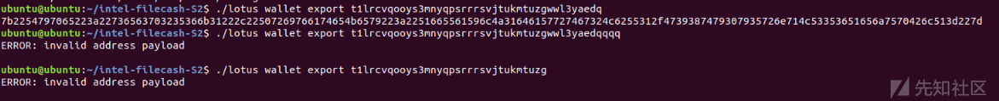
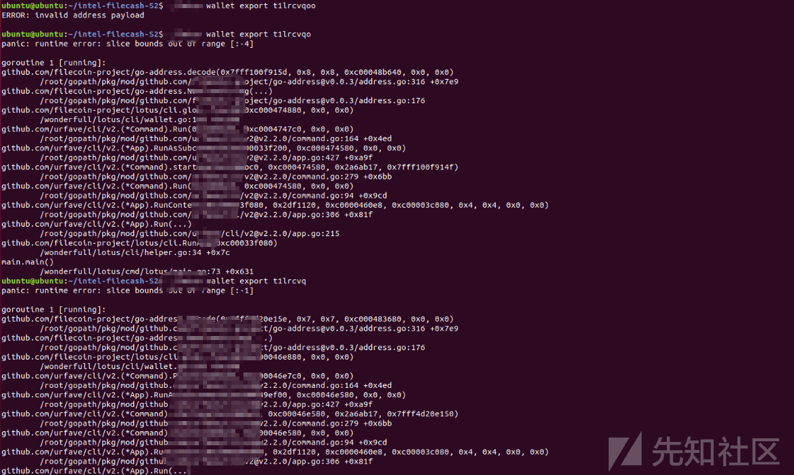
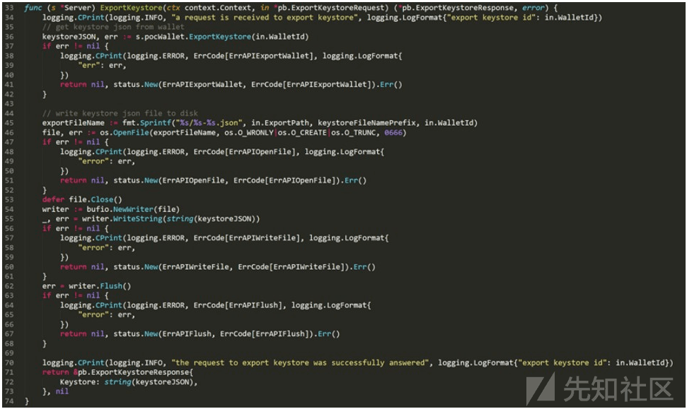
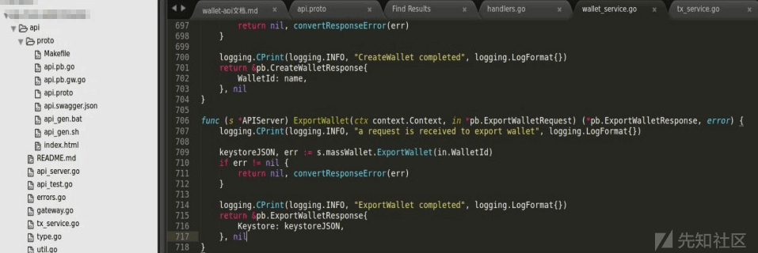
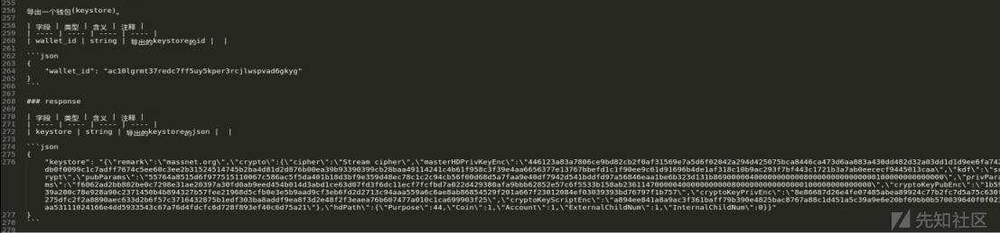
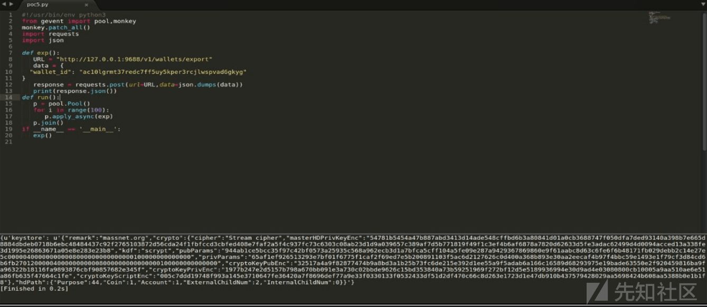

# 以太坊调用客户端 Geth 源码分析 - 先知社区

以太坊调用客户端 Geth 源码分析

- - -

## 文章前言

以太坊是目前最受欢迎和广泛应用的区块链平台之一，它提供了一个强大的分布式计算平台和智能合约功能，使得开发者能够构建去中心化的应用程序。在以太坊的生态系统中 Geth(Go Ethereum) 是一个重要的客户端实现，它充当了与以太坊网络进行通信的接口，理解和分析 Geth 的源代码对于深入了解以太坊的工作原理和实现细节至关重要。本文将对 Geth 的源代码进行分析，探索其内部机制以及如何与以太坊网络进行交互我们将深入研究 Geth 的关键组件、功能和算法等。

## 基本介绍

Geth(Go Ethereum) 是以太坊的官方客户端之一，它是用 Go 语言编写的，用于与以太坊网络进行交互的软件，Geth 提供了一个完整的以太坊节点实现，可以用于连接到以太坊网络、管理钱包、发送交易、挖矿等操作，Geth 提供了以下强大的功能支持：

-   以太坊节点：Geth 可以作为一个完整的以太坊节点连接到以太坊的主网或测试网络并与网络中的其他节点进行通信，它能够下载和同步区块链数据，维护区块链状态并提供对区块链的查询和访问功能
-   钱包管理：Geth 具有内置的钱包管理功能，可以生成和管理以太坊账户，用户可以使用 Geth 创建新账户、导入现有账户、查看账户余额和交易历史，以及发送以太币和其他代币
-   智能合约交互：Geth 允许用户与以太坊上的智能合约进行交互，用户可以部署自己的智能合约，调用合约的方法并读取合约的状态和事件
-   交易处理：Geth 具有处理以太坊交易的能力，它可以创建新的交易、签名交易、发送交易到网络并监听和处理交易的确认和状态变化
-   挖矿支持：Geth 提供了挖矿功能，允许用户参与以太坊的共识机制，用户可以使用 Geth 运行自己的矿工节点，通过计算来验证和打包交易并为此获得以太币的奖励
-   开发者工具：Geth 提供了一些开发者工具和 API，用于与以太坊网络进行集成和交互，开发人员可以使用 Geth 提供的 API 创建自己的以太坊应用程序、监控网络状态、订阅事件等

## 关键组件

Geth(Go Ethereum) 作为以太坊的官方客户端，由多个关键组件组成，以下是 Geth 的一些关键组件的介绍：

-   P2P(Peer-to-Peer) 网络层：Geth 与以太坊网络中其他节点通信的核心组件，P2P 网络层负责建立和维护节点之间的连接，传输区块、交易和其他消息，它实现了以太坊的自定义 P2P 协议，用于节点之间的握手、(
-   EVM(Ethereum Virtual Machine)：EVM 是以太坊的虚拟机，负责执行智能合约的字节码。Geth 实现了 EVM，允许用户在其节点上部署和执行智能合约，EVM 提供了一种安全且确定性的执行环境，确保智能合约在不同节点上的一致性
-   交易池：交易池是一个临时存储待处理交易的地方，当用户发送交易时，交易将首先进入交易池，交易池负责验证交易的有效性和正确性并将它们传递给区块链管理器进行处理，交易池还能够管理交易的优先级和手续费以决定哪些交易应该被包含在下一个区块中
-   钱包管理器：钱包管理器负责生成和管理以太坊账户，它可以生成新的账户地址和私钥，导入现有账户以及管理账户的余额和交易历史，钱包管理器还提供了对账户的签名功能，用于创建和发送交易
-   JSON-RPC 接口：Geth 提供了一个 JSON-RPC 接口，允许开发人员通过 HTTP 或 IPC（Inter-Process Communication）与 Geth 进行交互。开发人员可以使用 JSON-RPC 接口调用 Geth 的各种功能，如查询区块链状态、发送交易、执行智能合约等

## 源码刨析

Geth 相关的代码文件结构如下所示：

```plain
├─geth
│  │  accountcmd.go             钱包账户相关
│  │  chaincmd.go               链数据相关
│  │  config.go                 配置文件相关
│  │  consolecmd.go             console 交互模式
│  │  dbcmd.go                  数据库操作相关
│  │  main.go                   节点启动主程序
│  │  misccmd.go                杂项查询相关
│  │  snapshot.go               snapshot 相关
│  │  usage.go                  使用模板
│  │  version_check.go          安全版本检查
```

首先我们来看一下 go-ethereum-1.10.2\\cmd\\geth\\main.go 文件，在该文件中有两个关键的函数：init 函数和 main 函数，对于熟悉 Go 语言的人来说 init 函数和 main 函数都是 Go 语言保留的两个函数，当一个文件中同时存在 init 函数和 main 函数时，Go 语言会按照一定的顺序先调用所有保留的 init 函数，然后再调用 main 函数，在该文件中 init 函数是 gopkg.in/urfave/cli.v1 包的一个实例，使用该包的方法是首先创建一个 APP 对象，然后通过代码配置 APP 对象的行为并提供必要的回调函数，在运行时只需要在 main 函数中运行 app.Run(os.Args) 即可

```plain
import (
    "fmt"
    "os"
    "sort"
    "strconv"
    "strings"
    "time"

    "github.com/ethereum/go-ethereum/accounts"
    ......
    "gopkg.in/urfave/cli.v1"
)

......

func init() {
    // Initialize the CLI app and start Geth
    app.Action = geth       
    app.HideVersion = true // we have a command to print the version
    app.Copyright = "Copyright 2013-2021 The go-ethereum Authors"
    app.Commands = []cli.Command{
        // See chaincmd.go:
        initCommand,
        importCommand,
        exportCommand,
        importPreimagesCommand,
        exportPreimagesCommand,
        removedbCommand,
        dumpCommand,
        dumpGenesisCommand,
        // See accountcmd.go:
        accountCommand,
        walletCommand,
        // See consolecmd.go:
        consoleCommand,
        attachCommand,
        javascriptCommand,
        // See misccmd.go:
        makecacheCommand,
        makedagCommand,
        versionCommand,
        versionCheckCommand,
        licenseCommand,
        // See config.go
        dumpConfigCommand,
        // see dbcmd.go
        dbCommand,
        // See cmd/utils/flags_legacy.go
        utils.ShowDeprecated,
        // See snapshot.go
        snapshotCommand,
    }
    sort.Sort(cli.CommandsByName(app.Commands))

    app.Flags = append(app.Flags, nodeFlags...)
    app.Flags = append(app.Flags, rpcFlags...)
    app.Flags = append(app.Flags, consoleFlags...)
    app.Flags = append(app.Flags, debug.Flags...)
    app.Flags = append(app.Flags, metricsFlags...)

    app.Before = func(ctx *cli.Context) error {
        return debug.Setup(ctx)
    }
    app.After = func(ctx *cli.Context) error {
        debug.Exit()
        prompt.Stdin.Close() // Resets terminal mode.
        return nil
    }
}

func main() {
    if err := app.Run(os.Args); err != nil {
        fmt.Fprintln(os.Stderr, err)
        os.Exit(1)
    }
}

// prepare manipulates memory cache allowance and setups metric system.
// This function should be called before launching devp2p stack.
func prepare(ctx *cli.Context) {
    // If we're running a known preset, log it for convenience.
    switch {
    case ctx.GlobalIsSet(utils.RopstenFlag.Name):
        log.Info("Starting Geth on Ropsten testnet...")

    case ctx.GlobalIsSet(utils.RinkebyFlag.Name):
        log.Info("Starting Geth on Rinkeby testnet...")

    case ctx.GlobalIsSet(utils.GoerliFlag.Name):
        log.Info("Starting Geth on Görli testnet...")

    case ctx.GlobalIsSet(utils.YoloV3Flag.Name):
        log.Info("Starting Geth on YOLOv3 testnet...")

    case ctx.GlobalIsSet(utils.DeveloperFlag.Name):
        log.Info("Starting Geth in ephemeral dev mode...")

    case !ctx.GlobalIsSet(utils.NetworkIdFlag.Name):
        log.Info("Starting Geth on Ethereum mainnet...")
    }
    // If we're a full node on mainnet without --cache specified, bump default cache allowance
    if ctx.GlobalString(utils.SyncModeFlag.Name) != "light" && !ctx.GlobalIsSet(utils.CacheFlag.Name) && !ctx.GlobalIsSet(utils.NetworkIdFlag.Name) {
        // Make sure we're not on any supported preconfigured testnet either
        if !ctx.GlobalIsSet(utils.RopstenFlag.Name) && !ctx.GlobalIsSet(utils.RinkebyFlag.Name) && !ctx.GlobalIsSet(utils.GoerliFlag.Name) && !ctx.GlobalIsSet(utils.DeveloperFlag.Name) {
            // Nope, we're really on mainnet. Bump that cache up!
            log.Info("Bumping default cache on mainnet", "provided", ctx.GlobalInt(utils.CacheFlag.Name), "updated", 4096)
            ctx.GlobalSet(utils.CacheFlag.Name, strconv.Itoa(4096))
        }
    }
    // If we're running a light client on any network, drop the cache to some meaningfully low amount
    if ctx.GlobalString(utils.SyncModeFlag.Name) == "light" && !ctx.GlobalIsSet(utils.CacheFlag.Name) {
        log.Info("Dropping default light client cache", "provided", ctx.GlobalInt(utils.CacheFlag.Name), "updated", 128)
        ctx.GlobalSet(utils.CacheFlag.Name, strconv.Itoa(128))
    }

    // Start metrics export if enabled
    utils.SetupMetrics(ctx)

    // Start system runtime metrics collection
    go metrics.CollectProcessMetrics(3 * time.Second)
}

// geth is the main entry point into the system if no special subcommand is ran.
// It creates a default node based on the command line arguments and runs it in
// blocking mode, waiting for it to be shut down.
func geth(ctx *cli.Context) error {
    if args := ctx.Args(); len(args) > 0 {
        return fmt.Errorf("invalid command: %q", args[0])
    }

    prepare(ctx)
    stack, backend := makeFullNode(ctx)
    defer stack.Close()

    startNode(ctx, stack, backend)
    stack.Wait()
    return nil
}
......
```

在上述代码中我们可以看到 init 函数的 app.Action 字段，这个字段表示如果用户没有输入其他子命令时会调用指向该字段的函数，也就是我们的 geth 函数，所以说真正意义上的启动函数应该是 geth，而非 main 函数，下面我们以创建账户为例来对源码进行分析，来看一下整个过程中参数的传递以及后端的命令的执行下发的流程是怎么样子的，首先我们还是得进入到 go-ethereum-1.10.2\\cmd\\geth\\main.go 的 init 函数中，在这里构造一个 APP 对象，然后通过代码配置 app 对象的行为并提供必要的回调函数

```plain
func init() {
    // Initialize the CLI app and start Geth
    app.Action = geth
    app.HideVersion = true // we have a command to print the version
    app.Copyright = "Copyright 2013-2021 The go-ethereum Authors"
    app.Commands = []cli.Command{
        // See chaincmd.go:
        initCommand,
        importCommand,
        exportCommand,
        importPreimagesCommand,
        exportPreimagesCommand,
        removedbCommand,
        dumpCommand,
        dumpGenesisCommand,
        // See accountcmd.go:
        accountCommand,
        walletCommand,
        // See consolecmd.go:
        consoleCommand,
        attachCommand,
        javascriptCommand,
        // See misccmd.go:
        makecacheCommand,
        makedagCommand,
        versionCommand,
        versionCheckCommand,
        licenseCommand,
        // See config.go
        dumpConfigCommand,
        // see dbcmd.go
        dbCommand,
        // See cmd/utils/flags_legacy.go
        utils.ShowDeprecated,
        // See snapshot.go
        snapshotCommand,
    }
    sort.Sort(cli.CommandsByName(app.Commands))

    app.Flags = append(app.Flags, nodeFlags...)
    app.Flags = append(app.Flags, rpcFlags...)
    app.Flags = append(app.Flags, consoleFlags...)
    app.Flags = append(app.Flags, debug.Flags...)
    app.Flags = append(app.Flags, metricsFlags...)

    app.Before = func(ctx *cli.Context) error {
        return debug.Setup(ctx)
    }
    app.After = func(ctx *cli.Context) error {
        debug.Exit()
        prompt.Stdin.Close() // Resets terminal mode.
        return nil
    }
}
```

在 main 函数中运行 app.Run(os.Args)，其中传入的参数指令为"account"，对应的具体参数是"new"：

```plain
func main() {
    if err := app.Run(os.Args); err != nil {
        fmt.Fprintln(os.Stderr, err)
        os.Exit(1)
    }
}
```

随后 accountcmd.go 解析会对 account 命令及其二级子命令 new 进行解析处理，在下面的代码中可以看到定义了两个变量 walletCommand 和 accountCommand，它们的类型是来自名为 cli 的包中的 cli.Command，这些变量代表了在命令行界面中管理以太坊钱包和账户的命令：

-   walletCommand 变量代表了管理以太坊预售钱包的命令，它的 Name 字段设置为"wallet"，Usage 字段设置为"Manage Ethereum presale wallets"，它还有一个 Subcommands 字段，它是一个子命令的数组，在这种情况下只有一个子命令"import"，允许导入以太坊钱包
-   accountCommand 变量代表了管理以太坊账户的命令，它的 Name 字段设置为"account"，Usage 字段设置为"Manage accounts"，它也有一个 Subcommands 字段，它是一个子命令的数组，子命令包括"list"用于打印现有账户的摘要，"new"用于创建新账户，"update"用于更新现有账户，"import"用于将私钥导入到新账户

每个子命令都有不同的字段设置，例如：Usage、Action、Flags 和 Description，这些字段提供关于如何使用和与每个命令交互的信息，Action 字段指定在运行命令时要执行的函数，Flags 字段指定可以与命令一起使用的任何附加命令行标志，该代码使用 cli 包构建了一个命令行界面，用于管理以太坊钱包和账户，为用户提供了一组命令和选项以便与他们的以太坊账户进行交互

```plain
var (
    walletCommand = cli.Command{
        Name:      "wallet",
        Usage:     "Manage Ethereum presale wallets",
        ArgsUsage: "",
        Category:  "ACCOUNT COMMANDS",
        Description: `
    geth wallet import /path/to/my/presale.wallet

will prompt for your password and imports your ether presale account.
It can be used non-interactively with the --password option taking a
passwordfile as argument containing the wallet password in plaintext.`,
        Subcommands: []cli.Command{
            {

                Name:      "import",
                Usage:     "Import Ethereum presale wallet",
                ArgsUsage: "<keyFile>",
                Action:    utils.MigrateFlags(importWallet),
                Category:  "ACCOUNT COMMANDS",
                Flags: []cli.Flag{
                    utils.DataDirFlag,
                    utils.KeyStoreDirFlag,
                    utils.PasswordFileFlag,
                    utils.LightKDFFlag,
                },
                Description: `
    geth wallet [options] /path/to/my/presale.wallet

will prompt for your password and imports your ether presale account.
It can be used non-interactively with the --password option taking a
passwordfile as argument containing the wallet password in plaintext.`,
            },
        },
    }

    accountCommand = cli.Command{
        Name:     "account",
        Usage:    "Manage accounts",
        Category: "ACCOUNT COMMANDS",
        Description: `

Manage accounts, list all existing accounts, import a private key into a new
account, create a new account or update an existing account.

It supports interactive mode, when you are prompted for password as well as
non-interactive mode where passwords are supplied via a given password file.
Non-interactive mode is only meant for scripted use on test networks or known
safe environments.

Make sure you remember the password you gave when creating a new account (with
either new or import). Without it you are not able to unlock your account.

Note that exporting your key in unencrypted format is NOT supported.

Keys are stored under <DATADIR>/keystore.
It is safe to transfer the entire directory or the individual keys therein
between ethereum nodes by simply copying.

Make sure you backup your keys regularly.`,
        Subcommands: []cli.Command{
            {
                Name:   "list",
                Usage:  "Print summary of existing accounts",
                Action: utils.MigrateFlags(accountList),
                Flags: []cli.Flag{
                    utils.DataDirFlag,
                    utils.KeyStoreDirFlag,
                },
                Description: `
Print a short summary of all accounts`,
            },
            {
                Name:   "new",
                Usage:  "Create a new account",
                Action: utils.MigrateFlags(accountCreate),
                Flags: []cli.Flag{
                    utils.DataDirFlag,
                    utils.KeyStoreDirFlag,
                    utils.PasswordFileFlag,
                    utils.LightKDFFlag,
                },
                Description: `
    geth account new

Creates a new account and prints the address.

The account is saved in encrypted format, you are prompted for a password.

You must remember this password to unlock your account in the future.

For non-interactive use the password can be specified with the --password flag:

Note, this is meant to be used for testing only, it is a bad idea to save your
password to file or expose in any other way.
`,
            },
            {
                Name:      "update",
                Usage:     "Update an existing account",
                Action:    utils.MigrateFlags(accountUpdate),
                ArgsUsage: "<address>",
                Flags: []cli.Flag{
                    utils.DataDirFlag,
                    utils.KeyStoreDirFlag,
                    utils.LightKDFFlag,
                },
                Description: `
    geth account update <address>

Update an existing account.

The account is saved in the newest version in encrypted format, you are prompted
for a password to unlock the account and another to save the updated file.

This same command can therefore be used to migrate an account of a deprecated
format to the newest format or change the password for an account.

For non-interactive use the password can be specified with the --password flag:

    geth account update [options] <address>

Since only one password can be given, only format update can be performed,
changing your password is only possible interactively.
`,
            },
            {
                Name:   "import",
                Usage:  "Import a private key into a new account",
                Action: utils.MigrateFlags(accountImport),
                Flags: []cli.Flag{
                    utils.DataDirFlag,
                    utils.KeyStoreDirFlag,
                    utils.PasswordFileFlag,
                    utils.LightKDFFlag,
                },
                ArgsUsage: "<keyFile>",
                Description: `
    geth account import <keyfile>

Imports an unencrypted private key from <keyfile> and creates a new account.
Prints the address.

The keyfile is assumed to contain an unencrypted private key in hexadecimal format.

The account is saved in encrypted format, you are prompted for a password.

You must remember this password to unlock your account in the future.

For non-interactive use the password can be specified with the -password flag:

    geth account import [options] <keyfile>

Note:
As you can directly copy your encrypted accounts to another ethereum instance,
this import mechanism is not needed when you transfer an account between
nodes.
`,
            },
        },
    }
)
```

在这里我们以创建账户为例跟进，在下面的关键代码部分中 accountCreate 的函数用于创建一个新的账户并将其存储在由 CLI 标志定义的密钥库中，函数首先创建一个 gethConfig 结构体变量 cfg 并设置其 Node 字段为默认的节点配置，然后它尝试加载配置文件，如果有配置文件路径通过 CLI 标志传入，则使用 loadConfig 函数加载配置文件内容并将其解析到 cfg 变量中，随后函数使用 utils.SetNodeConfig 函数将 CLI 上下文中的配置应用到 cfg.Node 中，紧接着会去调用 cfg.Node.AccountConfig() 函数获取 scryptN、scryptP、keydir 和 err，这些值用于后续的账户创建操作，如果在获取配置时出现错误，函数将使用 utils.Fatalf 函数打印错误消息并终止程序的执行，接下来函数使用 utils.GetPassPhraseWithList 函数获取用户输入的密码并用于保护新账户的私钥，然后调用 keystore.StoreKey 函数将新账户的私钥存储在密钥库中并返回账户的相关信息和可能出现的错误，如果在存储账户时出现错误，函数将使用 utils.Fatalf 函数打印错误消息并终止程序的执行，最后函数使用 fmt.Printf 函数打印一些关于新账户的信息，包括公共地址、密钥文件路径以及一些安全提示，然后函数返回 nil 表示执行成功

```plain
// accountCreate creates a new account into the keystore defined by the CLI flags.
func accountCreate(ctx *cli.Context) error {
    cfg := gethConfig{Node: defaultNodeConfig()}
    // Load config file.
    if file := ctx.GlobalString(configFileFlag.Name); file != "" {
        if err := loadConfig(file, &cfg); err != nil {
            utils.Fatalf("%v", err)
        }
    }
    utils.SetNodeConfig(ctx, &cfg.Node)
    scryptN, scryptP, keydir, err := cfg.Node.AccountConfig()

    if err != nil {
        utils.Fatalf("Failed to read configuration: %v", err)
    }

    password := utils.GetPassPhraseWithList("Your new account is locked with a password. Please give a password. Do not forget this password.", true, 0, utils.MakePasswordList(ctx))

    account, err := keystore.StoreKey(keydir, password, scryptN, scryptP)

    if err != nil {
        utils.Fatalf("Failed to create account: %v", err)
    }
    fmt.Printf("\nYour new key was generated\n\n")
    fmt.Printf("Public address of the key:   %s\n", account.Address.Hex())
    fmt.Printf("Path of the secret key file: %s\n\n", account.URL.Path)
    fmt.Printf("- You can share your public address with anyone. Others need it to interact with you.\n")
    fmt.Printf("- You must NEVER share the secret key with anyone! The key controls access to your funds!\n")
    fmt.Printf("- You must BACKUP your key file! Without the key, it's impossible to access account funds!\n")
    fmt.Printf("- You must REMEMBER your password! Without the password, it's impossible to decrypt the key!\n\n")
    return nil
}
```

上面的代码如果正常执行，那么会调用 keystore.StoreKey 来创建账户、验证并存储账户，StoreKey 函数接收一个目录路径 dir，一个授权字符串 auth 以及两个整数 scryptN 和 scryptP，在这里需要留意下面的两个调用：

-   storeNewKey 函数主要用于生成一个密钥并使用 auth 进行加密，然后将其存储在给定的目录中，最后函数返回生成的账户和可能出现的错误，需要注意的是这里的 storeNewKey 函数是该库的内部函数，用于生成密钥并进行加密，它接收一个实现了 keystorePassphrase 接口的对象 ks，一个随机数生成器 rand.Reader 以及一个授权字符串 auth 并调用 EncryptKey 函数来对密钥进行加密，然后将加密后的密钥存储在一个临时文件中，最后它返回临时文件的路径、生成的账户以及可能出现的错误
-   EncryptKey 函数则是一个用于加密密钥的内部函数，它接收一个密钥对象 key、一个授权字符串 auth 以及两个整数 scryptN 和 scryptP，它使用给定的参数对密钥进行加密并返回加密后的密钥文件内容和可能出现的错误  
    整个过程中，密钥和加密后的密钥文件内容都是使用以太坊的标准加密算法进行处理的

```plain
// StoreKey generates a key, encrypts with 'auth' and stores in the given directory
func StoreKey(dir, auth string, scryptN, scryptP int) (accounts.Account, error) {
    _, a, err := storeNewKey(&keyStorePassphrase{dir, scryptN, scryptP, false}, rand.Reader, auth)
    return a, err
}

func (ks keyStorePassphrase) StoreKey(filename string, key *Key, auth string) error {
    keyjson, err := EncryptKey(key, auth, ks.scryptN, ks.scryptP)
    if err != nil {
        return err
    }
    // Write into temporary file
    tmpName, err := writeTemporaryKeyFile(filename, keyjson)
    if err != nil {
        return err
    }
    if !ks.skipKeyFileVerification {
        // Verify that we can decrypt the file with the given password.
        _, err = ks.GetKey(key.Address, tmpName, auth)
        if err != nil {
            msg := "An error was encountered when saving and verifying the keystore file. \n" +
                "This indicates that the keystore is corrupted. \n" +
                "The corrupted file is stored at \n%v\n" +
                "Please file a ticket at:\n\n" +
                "https://github.com/ethereum/go-ethereum/issues." +
                "The error was : %s"
            //lint:ignore ST1005 This is a message for the user
            return fmt.Errorf(msg, tmpName, err)
        }
    }
    return os.Rename(tmpName, filename)
}
```

下面我们跟踪一下 keystore(需要注意这里的 keystore 并不是私钥也不是助记词，而是将私钥通过钱包密码加密得来的，所以说如果我们得到了钱包密码，那么我们就得到了私钥) 的生成方式

```plain
// StoreKey generates a key, encrypts with 'auth' and stores in the given directory
func StoreKey(dir, auth string, scryptN, scryptP int) (accounts.Account, error) {
    _, a, err := storeNewKey(&keyStorePassphrase{dir, scryptN, scryptP, false}, rand.Reader, auth)
    return a, err
}
```

storeNewKey 函数的第一个参数 ks 是一个实现了 keyStore 接口的对象，提供了密钥存储的方法，第二个参数 rand 是一个随机数生成器，用于生成密钥，第三个参数 auth 是一个授权字符串，用于加密密钥，函数首先调用 newKey 函数使用随机数生成器生成一个新的密钥，如果生成密钥时出现错误，函数会返回 nil 的密钥、空的账户对象和错误信息，然后函数调用 ks.StoreKey 方法将密钥存储到指定的路径中，使用给定的授权字符串进行加密，如果存储密钥时出现错误，函数会清除密钥的私钥信息，返回 nil 的密钥、账户对象和错误信息，最后函数返回生成的密钥、账户对象和可能出现的错误

```plain
func storeNewKey(ks keyStore, rand io.Reader, auth string) (*Key, accounts.Account, error) {
    key, err := newKey(rand)
    if err != nil {
        return nil, accounts.Account{}, err
    }
    a := accounts.Account{
        Address: key.Address,
        URL:     accounts.URL{Scheme: KeyStoreScheme, Path: ks.JoinPath(keyFileName(key.Address))},
    }
    if err := ks.StoreKey(a.URL.Path, key, auth); err != nil {
        zeroKey(key.PrivateKey)
        return nil, a, err
    }
    return key, a, err
}
```

在这里会调用 netKey 并使用传入的随机参数通过椭圆曲线加密算法来生成一个私钥：

```plain
func newKey(rand io.Reader) (*Key, error) {
    privateKeyECDSA, err := ecdsa.GenerateKey(crypto.S256(), rand)
    if err != nil {
        return nil, err
    }
    return newKeyFromECDSA(privateKeyECDSA), nil
}
```

调用 newKeyFromECDSA 根据私钥来生成公钥，然后根据公钥来生成地址参数并将其返回：

```plain
func newKeyFromECDSA(privateKeyECDSA *ecdsa.PrivateKey) *Key {
    id, err := uuid.NewRandom()
    if err != nil {
        panic(fmt.Sprintf("Could not create random uuid: %v", err))
    }
    key := &Key{
        Id:         id,
        Address:    crypto.PubkeyToAddress(privateKeyECDSA.PublicKey),
        PrivateKey: privateKeyECDSA,
    }
    return key
}
```

调用 StoreKey 来存储账户信息，在这里会首先对生成的 key(结构体类型，包含账户地址、私钥、ID 序列) 和密码进行一次加密操作，然后调用 writeTemporaryKeyFile 写文件进去

```plain
func (ks keyStorePassphrase) StoreKey(filename string, key *Key, auth string) error {
    keyjson, err := EncryptKey(key, auth, ks.scryptN, ks.scryptP)
    if err != nil {
        return err
    }
    // Write into temporary file
    tmpName, err := writeTemporaryKeyFile(filename, keyjson)
    if err != nil {
        return err
    }
    if !ks.skipKeyFileVerification {
        // Verify that we can decrypt the file with the given password.
        _, err = ks.GetKey(key.Address, tmpName, auth)
        if err != nil {
            msg := "An error was encountered when saving and verifying the keystore file. \n" +
                "This indicates that the keystore is corrupted. \n" +
                "The corrupted file is stored at \n%v\n" +
                "Please file a ticket at:\n\n" +
                "https://github.com/ethereum/go-ethereum/issues." +
                "The error was : %s"
            //lint:ignore ST1005 This is a message for the user
            return fmt.Errorf(msg, tmpName, err)
        }
    }
    return os.Rename(tmpName, filename)
}
```

随后调用 EncryptDataV3 来进行关键的加密操作，然后将数据进行 JSON 格式化：

```plain
// EncryptKey encrypts a key using the specified scrypt parameters into a json
// blob that can be decrypted later on.
func EncryptKey(key *Key, auth string, scryptN, scryptP int) ([]byte, error) {
    keyBytes := math.PaddedBigBytes(key.PrivateKey.D, 32)
    cryptoStruct, err := EncryptDataV3(keyBytes, []byte(auth), scryptN, scryptP)
    if err != nil {
        return nil, err
    }
    encryptedKeyJSONV3 := encryptedKeyJSONV3{
        hex.EncodeToString(key.Address[:]),
        cryptoStruct,
        key.Id.String(),
        version,
    }
    return json.Marshal(encryptedKeyJSONV3)
}
```

EncryptDataV3 加密的具体实现代码如下所示，这里以我们输入的密码的作为盐值，然后经过一系列的处理后使用 Keccak256 进行加密处理：

```plain
// Encryptdata encrypts the data given as 'data' with the password 'auth'.
func EncryptDataV3(data, auth []byte, scryptN, scryptP int) (CryptoJSON, error) {

    salt := make([]byte, 32)
    if _, err := io.ReadFull(rand.Reader, salt); err != nil {
        panic("reading from crypto/rand failed: " + err.Error())
    }
    derivedKey, err := scrypt.Key(auth, salt, scryptN, scryptR, scryptP, scryptDKLen)
    if err != nil {
        return CryptoJSON{}, err
    }
    encryptKey := derivedKey[:16]

    iv := make([]byte, aes.BlockSize) // 16
    if _, err := io.ReadFull(rand.Reader, iv); err != nil {
        panic("reading from crypto/rand failed: " + err.Error())
    }
    cipherText, err := aesCTRXOR(encryptKey, data, iv)
    if err != nil {
        return CryptoJSON{}, err
    }
    mac := crypto.Keccak256(derivedKey[16:32], cipherText)

    scryptParamsJSON := make(map[string]interface{}, 5)
    scryptParamsJSON["n"] = scryptN
    scryptParamsJSON["r"] = scryptR
    scryptParamsJSON["p"] = scryptP
    scryptParamsJSON["dklen"] = scryptDKLen
    scryptParamsJSON["salt"] = hex.EncodeToString(salt)
    cipherParamsJSON := cipherparamsJSON{
        IV: hex.EncodeToString(iv),
    }

    cryptoStruct := CryptoJSON{
        Cipher:       "aes-128-ctr",
        CipherText:   hex.EncodeToString(cipherText),
        CipherParams: cipherParamsJSON,
        KDF:          keyHeaderKDF,
        KDFParams:    scryptParamsJSON,
        MAC:          hex.EncodeToString(mac),
    }
    return cryptoStruct, nil
}
```

调用 writeTemporaryKeyFile 来写文件，在这里会严格设置秘钥存储目录的权限：

```plain
func writeTemporaryKeyFile(file string, content []byte) (string, error) {
    // Create the keystore directory with appropriate permissions
    // in case it is not present yet.
    const dirPerm = 0700
    if err := os.MkdirAll(filepath.Dir(file), dirPerm); err != nil {
        return "", err
    }
    // Atomic write: create a temporary hidden file first
    // then move it into place. TempFile assigns mode 0600.
    f, err := ioutil.TempFile(filepath.Dir(file), "."+filepath.Base(file)+".tmp")
    if err != nil {
        return "", err
    }
    if _, err := f.Write(content); err != nil {
        f.Close()
        os.Remove(f.Name())
        return "", err
    }
    f.Close()
    return f.Name(), nil
}
```

最后在 StoreKey 函数中检查使用最初设置的密码是否可以对秘钥文件 (临时) 进行解密，如果可以则将其进行更名存储，最后返回账户地址信息、秘钥存储路径

```plain
if !ks.skipKeyFileVerification {
        // Verify that we can decrypt the file with the given password.
        _, err = ks.GetKey(key.Address, tmpName, auth)
        if err != nil {
            msg := "An error was encountered when saving and verifying the keystore file. \n" +
                "This indicates that the keystore is corrupted. \n" +
                "The corrupted file is stored at \n%v\n" +
                "Please file a ticket at:\n\n" +
                "https://github.com/ethereum/go-ethereum/issues." +
                "The error was : %s"
            //lint:ignore ST1005 This is a message for the user
            return fmt.Errorf(msg, tmpName, err)
        }
    }
    return os.Rename(tmpName, filename)
```

## 风险示例

通过上面的一个账户创建的示例我们可以洞穿整个 Geth 客户端对用户的命令、参数进行后端处理和调用的过程，而在一些安全评估过程中我们也经常需要特别留意客户端的接口的调用以及鉴权处理，例如：钱包创建时的密钥存储、钱包的解锁和锁定、接口的健壮性等等

### 地址合法性校验

下面以某公链的一处示例为例进行演示：  
在导出钱包操作时未对地址做合法性校验，当用户输入非法的地址参数时返回 panic 信息：  
[](https://xzfile.aliyuncs.com/media/upload/picture/20240129101517-3ea00a62-be4c-1.png)  
当传入合法地址或适当扩展\\缩减地址长度时能够正常返回\\给出正确的错误信息  
[](https://xzfile.aliyuncs.com/media/upload/picture/20240129101529-45a3759c-be4c-1.png)  
最终在缩减到长度为 8 时出现 panic 问题

[](https://xzfile.aliyuncs.com/media/upload/picture/20240129101611-5eb808f4-be4c-1.png)

### 权限校验缺失

经检测发现挖矿代码和钱包代码在钱包备份时均未对钱包备份操作的用户身份进行验证，通过 wallet id 可以直接对钱包进行备份  
[](https://xzfile.aliyuncs.com/media/upload/picture/20240129101715-84e04d16-be4c-1.png)  
钱包代码 ExportWallet 逻辑代码设计：

[](https://xzfile.aliyuncs.com/media/upload/picture/20240129101736-9195f4d4-be4c-1.png)  
ExportWallet 调用说明：  
[](https://xzfile.aliyuncs.com/media/upload/picture/20240129101748-98b86936-be4c-1.png)  
从上面可以看到在备份钱包时无需身份认证只需要钱包的 id 即可完成钱包的备份操作

[](https://xzfile.aliyuncs.com/media/upload/picture/20240129101817-aa1252aa-be4c-1.png)  
建议对钱包备份操作的用户进行身份认证，例如：在钱包备份 RPC 增加"passphrase"字段（钱包密码）进行验证

## 文末小结

在本文中我们对以太坊调用客户端 Geth 的源代码进行了详细的分析，我们首先介绍了 Geth 的基本结构和工作原理，然后深入探讨了一些关键功能和模块，例如：账户管理，随后我们对一些接口调用中的风险面结合公链实例进行了简易的介绍，其中侧重点在于输入输出校验、身份认证、数据包体量校验、接口鉴权等方面
