# 伪装成花旗银行对帐单的窃密攻击活动 - 先知社区

伪装成花旗银行对帐单的窃密攻击活动

- - -

# 前言概述

前不久花旗银行被纽约总检察长起诉，指控其未能保护客户免受黑客和诈骗攻击，并允许欺诈者从受害者帐户中窃取数百万美元后拒绝向受害者赔偿，针对金融行业客户的攻击活动一直是黑客组织攻击的重点目标之一，通过木马程序控制受害者主机之后，窃取主机重要数据，然后再通过诈骗的方式骗取受害者，是现在一种比较流行的网络诈骗黑产攻击手段，国内去年以“银狐”木马为主的一些黑客团伙就是使用这种方式对多家企业进行诈骗攻击，骗取企业巨额利润，多家企业中招，损失巨大。

笔者最近跟踪到一起伪装成花旗银行对帐单的窃密攻击活动，该攻击活动的黑客利用一家墨西哥能源公司的网站和一家德国医疗护理的网络作为其载荷服务器，猜测黑客先对这两家公司的网站进行了渗透测试，入侵了这两家公司的网站后台服务器，然后将恶意脚本和恶意程序上传到这两家网站服务器上，再通过脚本从这两家网站后台服务器上下载恶意脚本和恶意程序并加载执行，笔者对该攻击活动进行了详细的分析。

# 攻击活动

黑客组织攻击活动，如下所示：  
[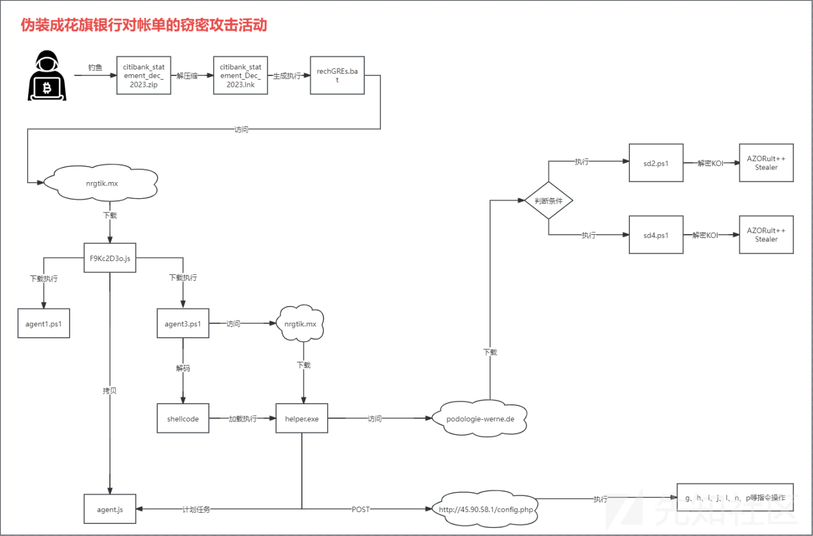](https://xzfile.aliyuncs.com/media/upload/picture/20240213213414-945a9bdc-ca74-1.png)

# 详细分析

1.样本为图标 PDF 的 LNK 恶意文件，名字伪装成花旗银行的对帐单，如下所示：  
[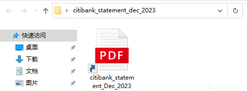](https://xzfile.aliyuncs.com/media/upload/picture/20240213213454-ac23c982-ca74-1.png)  
2.LNK 恶意文件调用 CMD 程序生成执行 BAT 脚本，并创建计划任务，如下所示：  
[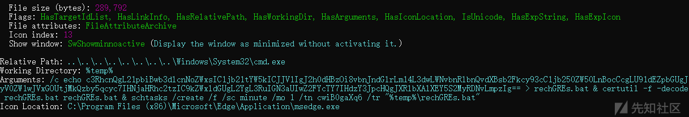](https://xzfile.aliyuncs.com/media/upload/picture/20240213213520-bb2e30a2-ca74-1.png)  
3.创建的计划任务，如下所示：  
[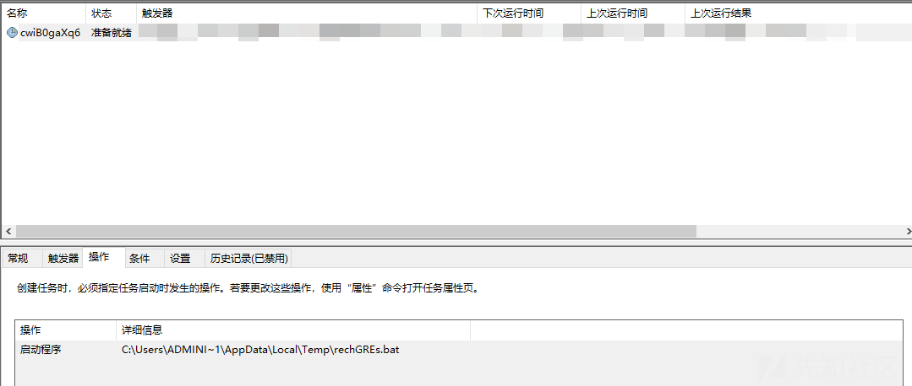](https://xzfile.aliyuncs.com/media/upload/picture/20240213213542-c8dbbf94-ca74-1.png)  
4.解码生成的 BAT 脚本，从远程服务器上下载生成恶意 JS 脚本，并删除之前创建的计划任务，如下所示：  
[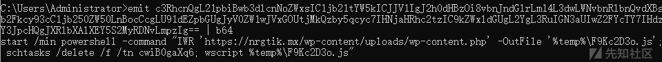](https://xzfile.aliyuncs.com/media/upload/picture/20240213213609-d8e58de8-ca74-1.png)  
5.下载的恶意 JS 脚本会拷贝自身到 ProgramData 目录，并命名为 agent.js，再从网上下载恶意 PowerShell 脚本，如下所示：  
[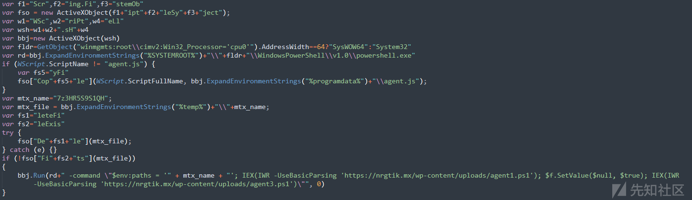](https://xzfile.aliyuncs.com/media/upload/picture/20240213213635-e7e99e10-ca74-1.png)  
6.agent3.ps1 脚本通过 shellcode 代码在内存中加载执行从远程服务器上下载回来的 EXE 程序，如下所示：  
[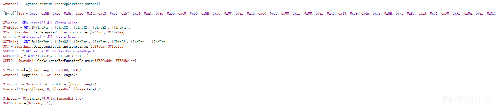](https://xzfile.aliyuncs.com/media/upload/picture/20240213213702-f8837f0c-ca74-1.png)  
7.该 EXE 程序主体代码，如下所示：  
[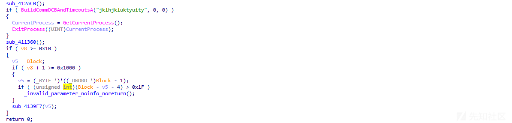](https://xzfile.aliyuncs.com/media/upload/picture/20240213213741-0fc46ec4-ca75-1.png)  
8.读取资源数据到内存中，删除多余的 00 数据，如下所示：  
[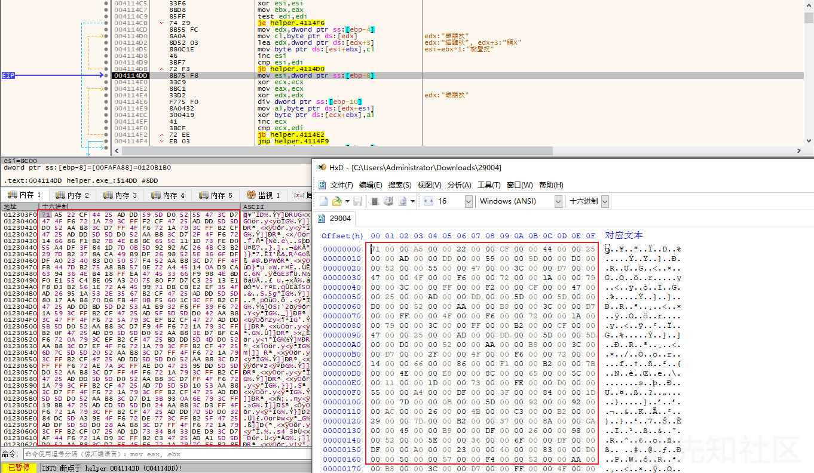](https://xzfile.aliyuncs.com/media/upload/picture/20240213213808-1f8f0b7a-ca75-1.png)  
9.解密资源数据，如下所示：  
[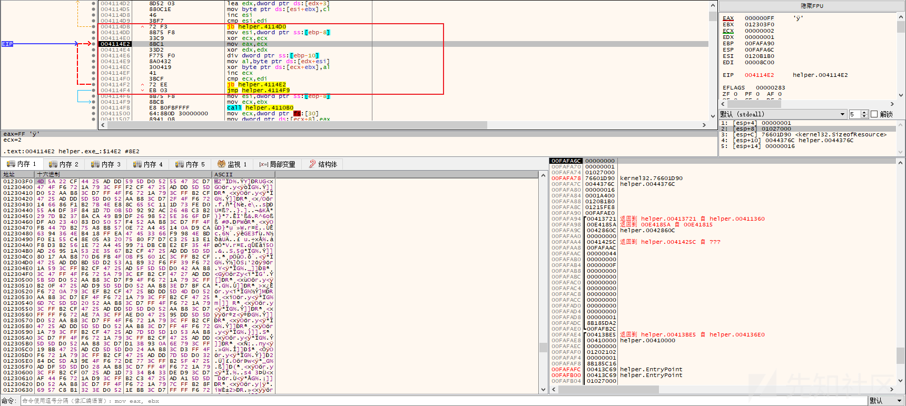](https://xzfile.aliyuncs.com/media/upload/picture/20240213213829-2c1c2b02-ca75-1.png)  
10.解密出来的资源数据是一个 PE 文件，如下所示：  
[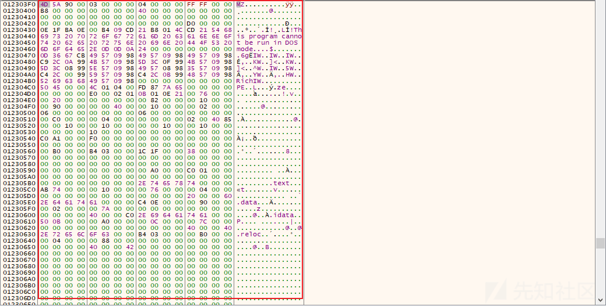](https://xzfile.aliyuncs.com/media/upload/picture/20240213213853-3a37b404-ca75-1.png)  
11.在内存中加载执行该 PE 文件，如下所示：  
[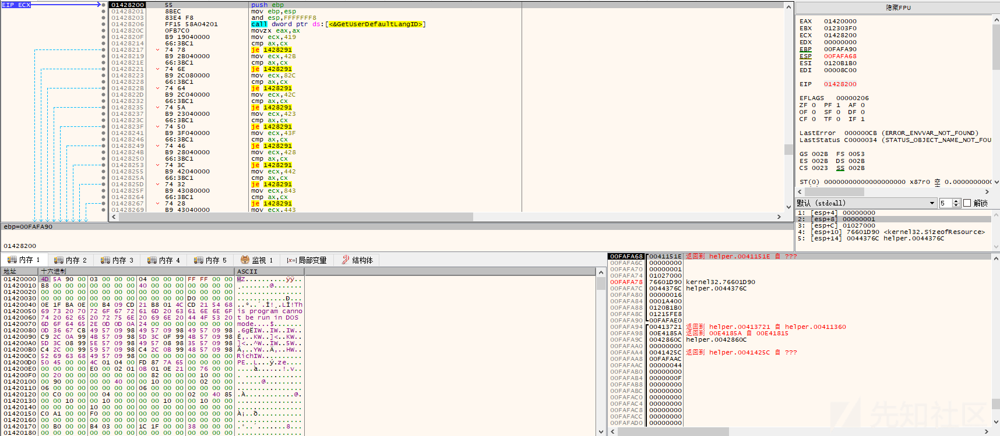](https://xzfile.aliyuncs.com/media/upload/picture/20240213213917-48ecc192-ca75-1.png)  
12.通过 GetUserDefaultLangID 获取操作系统语言，如果为特定语言的操作系统，则退出，如下所示：  
[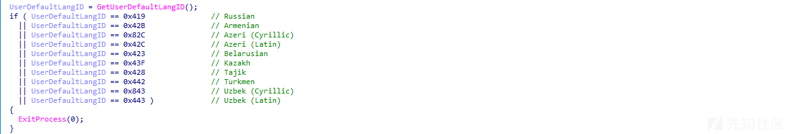](https://xzfile.aliyuncs.com/media/upload/picture/20240213213940-569fc24e-ca75-1.png)  
13.创建计划任务，伪装成 Firefox 的更新任务，如下所示：  
[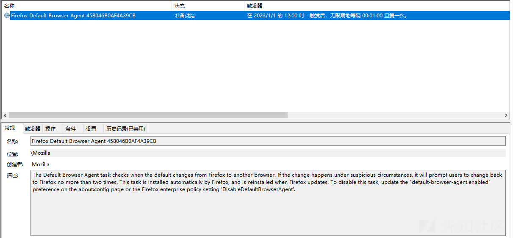](https://xzfile.aliyuncs.com/media/upload/picture/20240213214005-6590689e-ca75-1.png)  
执行之前生成的 agent.js 恶意脚本，如下所示：  
[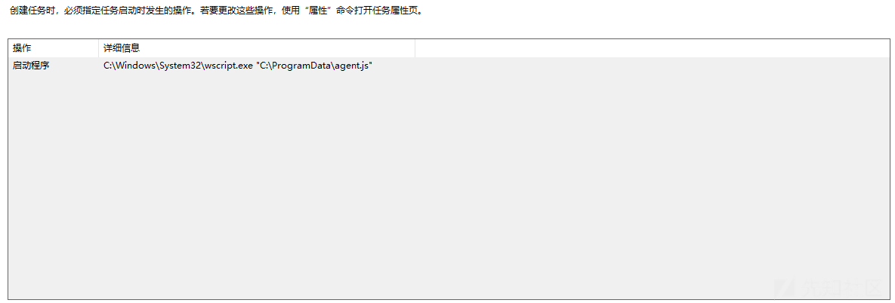](https://xzfile.aliyuncs.com/media/upload/picture/20240213214034-765ddce2-ca75-1.png)  
14.加密生成相应的数据，并向远程服务器发送相应的 POST 数据，如下所示：  
[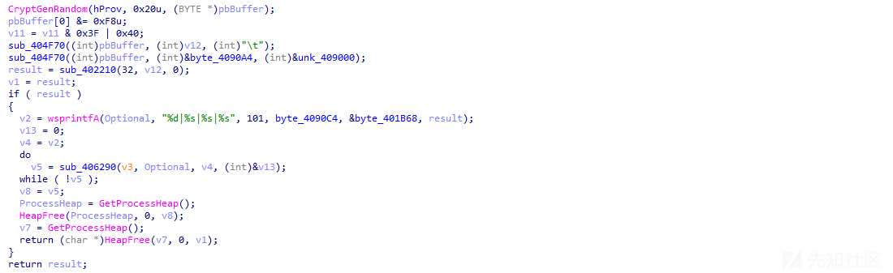](https://xzfile.aliyuncs.com/media/upload/picture/20240213214103-87cd6be6-ca75-1.png)  
15.远程服务器 URL 为 45.90.58.1/config.php，发送的 POST 数据格式内容，如下所示：  
[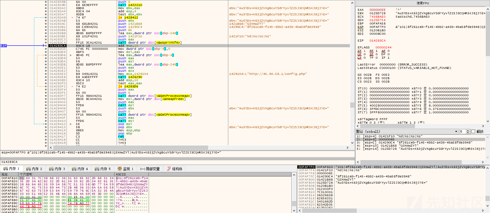](https://xzfile.aliyuncs.com/media/upload/picture/20240213214308-d26950ac-ca75-1.png)  
16.获取主机相关信息，然后进行加密操作，拼接字符串，向远程服务器发送 POST 数据请求，如下所示：  
[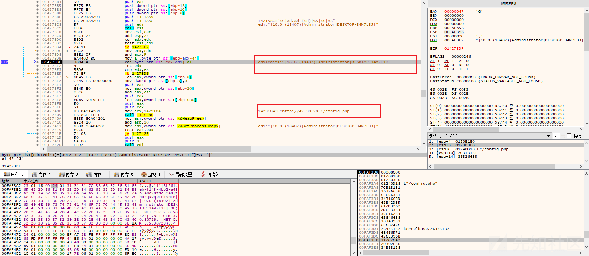](https://xzfile.aliyuncs.com/media/upload/picture/20240213214337-e3d20d3e-ca75-1.png)  
17.从远程服务器下载执行恶意 PowerShell 脚本，如下所示：  
[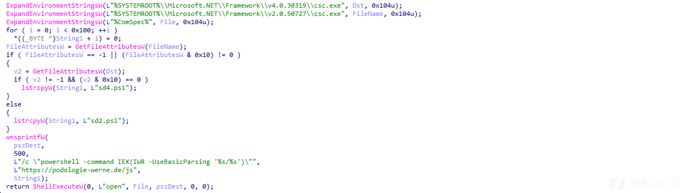](https://xzfile.aliyuncs.com/media/upload/picture/20240213214403-f2ef1460-ca75-1.png)  
18.调用 CMD 命令，执行 PowerShell 脚本，如下所示：  
[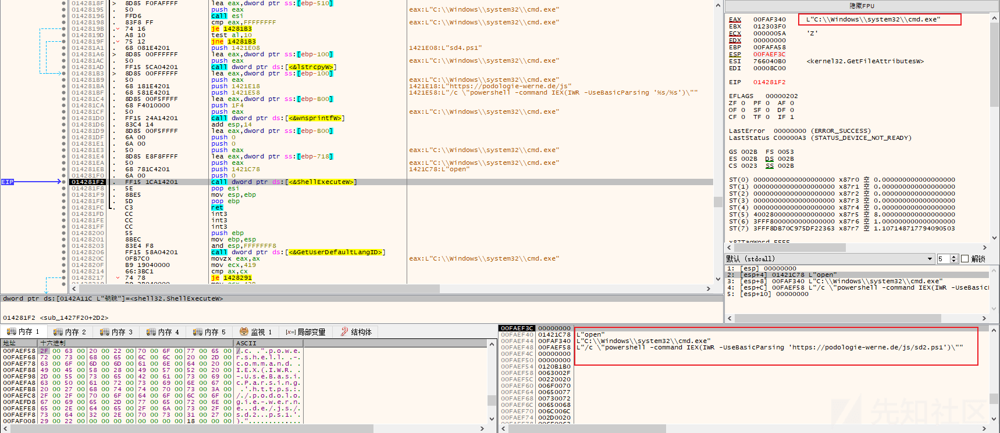](https://xzfile.aliyuncs.com/media/upload/picture/20240213214429-02c6bb9a-ca76-1.png)  
19.恶意 PowerShell 脚本 sd2.ps1，从网上下载相应的配置信息，如下所示：  
[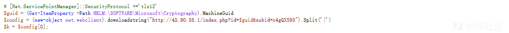](https://xzfile.aliyuncs.com/media/upload/picture/20240213214458-14086afc-ca76-1.png)  
20.配置信息，如下所示：  
[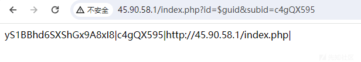](https://xzfile.aliyuncs.com/media/upload/picture/20240213214522-220a3b80-ca76-1.png)  
21.异或解密出恶意 PowerShell 脚本数据，然后调用执行，传到配置信息参数，如下所示：  
[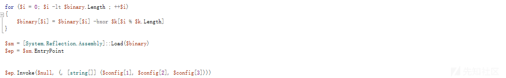](https://xzfile.aliyuncs.com/media/upload/picture/20240213214551-33a9cb30-ca76-1.png)  
22.解密出来的数据为 NET 编写的恶意软件，如下所示：  
[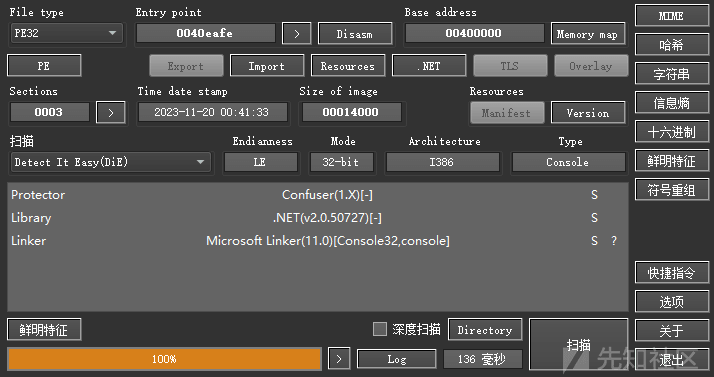](https://xzfile.aliyuncs.com/media/upload/picture/20240213214614-417802cc-ca76-1.png)  
23.NET 恶意软件解密出 KOI 恶意模块，并调用执行，如下所示：  
[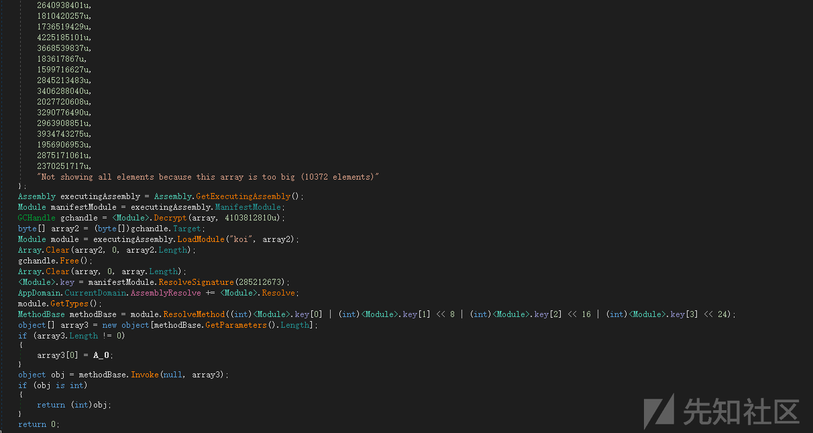](https://xzfile.aliyuncs.com/media/upload/picture/20240213214641-51501a7c-ca76-1.png)  
24.KOI 恶意模块是窃密恶意软件，窃取主机文件、通讯应用、浏览器、虚拟数字货币钱包数据，然后加密发送到远程服务器，如下所示：  
[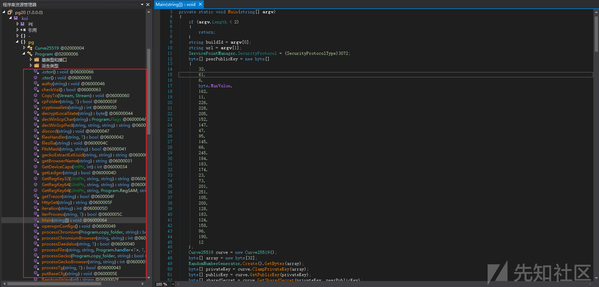](https://xzfile.aliyuncs.com/media/upload/picture/20240213214705-5f709bae-ca76-1.png)  
25.恶意 PowerShell 脚本 sd4.ps1 与上面 sd2.ps1 基本一致，解密出来的 KOI 模块也是窃密恶意软件，如下所示：  
[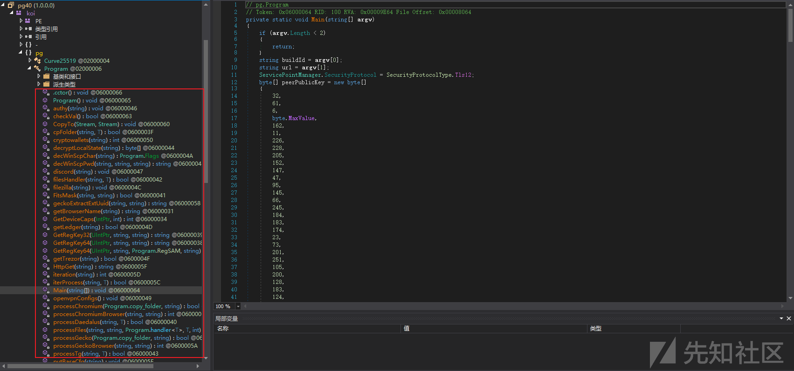](https://xzfile.aliyuncs.com/media/upload/picture/20240213214728-6d9eec9e-ca76-1.png)  
26.向远程服务器发送 POST 数据请求，然后返回相应的指令，如下所示：  
[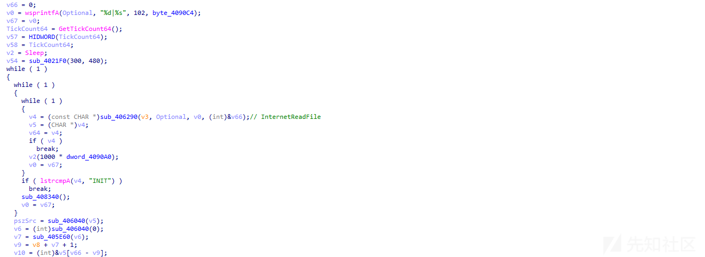](https://xzfile.aliyuncs.com/media/upload/picture/20240213214803-8229ab54-ca76-1.png)  
27.通过服务器返回不同的指令执行不同的操作，如下所示：  
[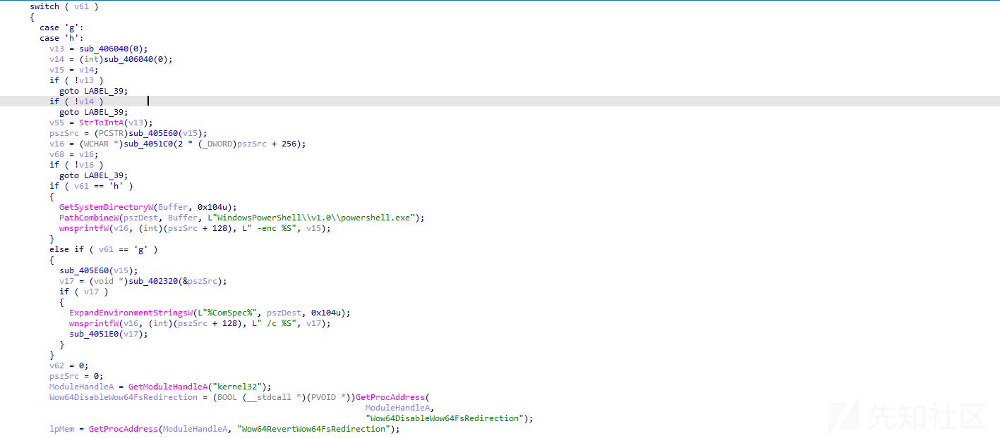](https://xzfile.aliyuncs.com/media/upload/picture/20240213214829-91903c8e-ca76-1.png)

# 关联分析

查看 nrgtik.mx 域名，已经标记为失陷主机了，如下所示：  
[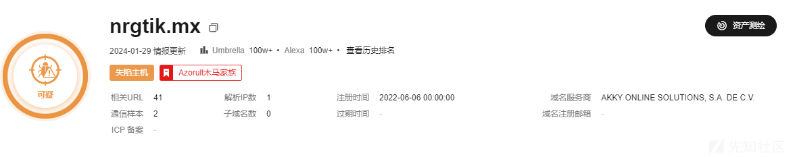](https://xzfile.aliyuncs.com/media/upload/picture/20240213214908-a8b2ef1a-ca76-1.png)  
同时可以关联到多个 JS 恶意脚本，如下所示：  
[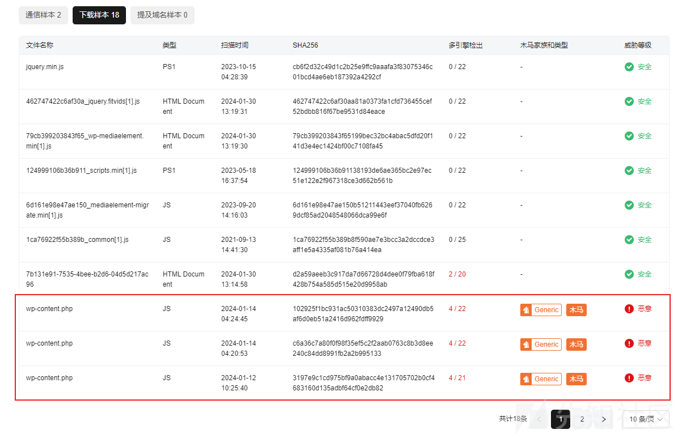](https://xzfile.aliyuncs.com/media/upload/picture/20240213214935-b93471ec-ca76-1.png)  
通过分析这些脚本基本类似，只是里面的互斥变量不同，这次攻击活动应该还在持续攻击当中。  
查看 IP 地址 45.90.58.1，也已经标记为恶意软件，如下所示：  
[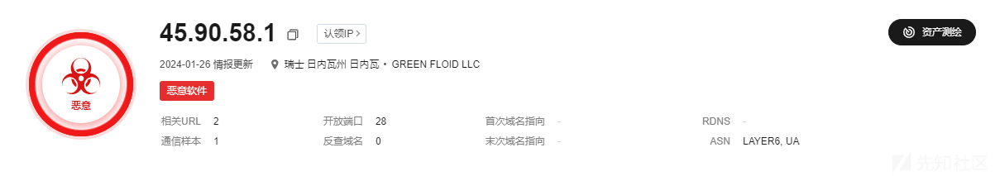](https://xzfile.aliyuncs.com/media/upload/picture/20240213215002-c93e445a-ca76-1.png)  
通过上面的分析以及情报关联，可以推断出这可能是某个黑客组织利用 AZORult 窃密木马针对花旗银行客户进行的一次窃密攻击活动。

# 威胁情报

[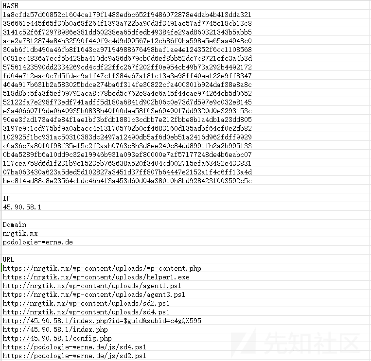](https://xzfile.aliyuncs.com/media/upload/picture/20240213215035-dc959c24-ca76-1.png)

# 总结结尾

黑客组织利用各种恶意软件进行的各种攻击活动已经无处不在，防不胜防，很多系统可能已经被感染了各种恶意软件，全球各地每天都在发生各种恶意软件攻击活动，这些攻击活动主要包含：勒索攻击、APT 窃密攻击等，黑客组织从来没有停止过攻击活动，而且非常活跃，持续不断地更新攻击样本，采用新的攻击技术。

笔者一直从事与恶意软件威胁情报相关的安全分析与研究工作，包含各种各样的不同类型的恶意软件，通过深度分析和研究这些恶意软件，了解全球黑客组织最新的攻击技术以及攻击趋势。
