# 你永远难以忘记的 pool party：用 windows 线程池的新进程注入技术 - 先知社区

你永远难以忘记的 pool party：用 windows 线程池的新进程注入技术

- - -

作者：Alon Leviev

原文链接：[Process Injection Using Windows Thread Pools | Safebreach](https://www.safebreach.com/blog/process-injection-using-windows-thread-pools?utm_source=social-media&utm_medium=twitter&utm_campaign=2023Q3_SM_Twitter)

在网络攻击期间，攻击者经常通过想漏洞利用和钓鱼等方式来突破目标组织的外部防护。一旦进入，他们就会试图了解内部网络来提升权限和获取或加密数据，但是在这个阶段他们经常要面对目的是识别和防止这类活动的 EDR（endpoint detection and response）。为了躲避检测，攻击者会使用进程注入技术，使他们能够将恶意代码注入到系统的合法进程中。恶意代码由目标进程（即那个合法进程）执行，而不是攻击者进程，这会让防守组织难以从取证的角度进行识别和追踪。

虽然进程注入技术曾经变得很流行，但大多数操作系统和 EDR 厂商都收紧了安全措施，要么阻止已知技术，要么严格限制其影响。因此，近年来看到的技术越来越少，而那些仍然在野外看到的技术只适用于特定的工艺状态——直到现在。

SafeBreach Labs 团队着手探索使用 Windows 线程池（Microsoft Windows 操作系统中分析不足的领域）作为进程注入的新型攻击媒介的可行性。在此过程中，我们发现了八种新的进程注入技术，我们称之为 Pool Party 变体，这些技术能够由于完全合法的操作而触发恶意执行。这些技术能够不受任何限制地跨所有流程工作，使其比现有的流程注入技术更灵活。而且，更重要的是，在与五种领先的 EDR 解决方案进行测试时，这些技术被证明是完全无法检测到的。

下面我们将分享我们的研究背后的详细信息，该研究首次在 Black Hat Europe 2023 上提出。我们首先将简要概述进程注入的工作原理以及端点安全控制如何检测当前已知的技术。然后，我们将解释 Windows 线程池的架构和相关组件，并讨论导致我们成功利用它们开发八种独特的进程注入技术的研究过程。最后，我们将重点介绍我们测试过的 EDR 解决方案，并确定 SafeBreach 如何与更广泛的安全社区共享这些信息，以帮助组织保护自己。

## 背景

### 进程注入

作为一种用于在目标进程中执行任意代码的规避技术，进程注入通常由三个函数组成：

1.  分配函数：用于在目标进程上分配内存
2.  写入函数：用于向分配的内存写入恶意代码
3.  执行函数：用于执行编写的恶意代码

[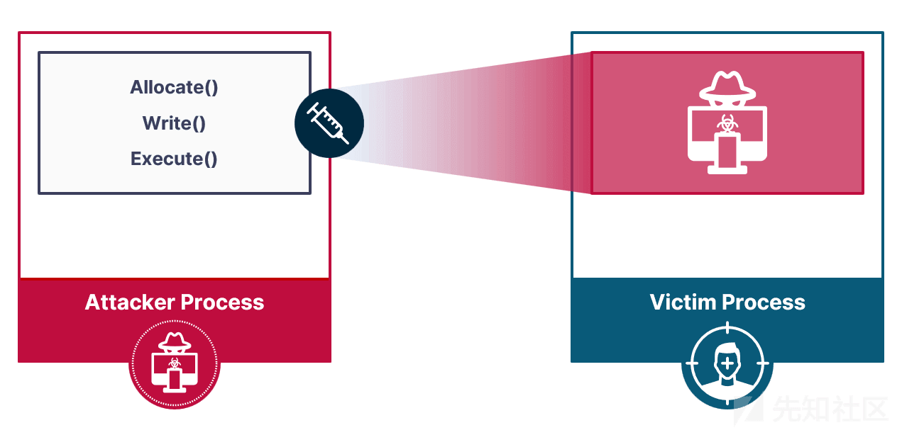](https://xzfile.aliyuncs.com/media/upload/picture/20231217222500-0fef6aee-9ce8-1.png)

最基本的注入技术将使用 VirtualAllocEX（）进行分配，使用 WriteProcessMemory（）进行写入，并使用 CreateRemoteThread（）执行。这种注入技术（公开称为 CreateRemoteThread 注入）非常简单和强大，但有一个缺点：所有现代 EDR 都可以检测到它。我们的研究试图发现是否有可能创建完全无法检测到的工艺注入技术。

通过研究 CreateRemoteThread 注入这个过程，我们试图了解 EDR 是否可以有效地区分功能的合法使用与恶意使用。我们还想知道 EDR 当前使用的检测方法是否足够通用，可以检测新的和从未见过的过程注入。

### EDR 检测方法

为了回答这些问题，我们需要回顾 EDR 当前针对进程注入采用的检测方法。通过对不同函数的实验，我们得出的结论是，EDR 的检测主要基于执行函数。最重要的是，写入和分配函数（以最基本的形式）不会被检测到。

[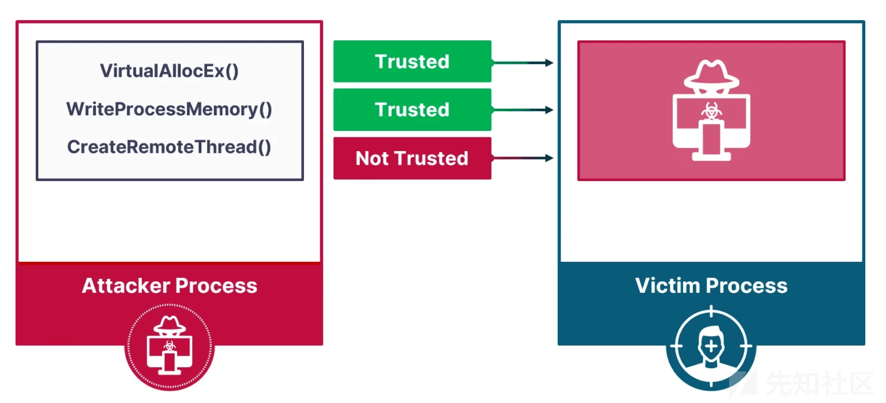](https://xzfile.aliyuncs.com/media/upload/picture/20231217222514-1801abc0-9ce8-1.png)

基于这一发现，如果我们仅基于分配和写入原语创建执行函数会发生什么？此外，如果执行是由合法操作触发的（例如写入合法文件），并且可能在受害者进程上触发 shellcode，该怎么办？这种方式将使过程注入更加难以检测。

# Windows 用户模式线程池

在寻找有助于实现研究目标的合适组件时，我们遇到了 Windows 用户模式线程池。这最终成为完美的目标，因为：

1.  默认情况下，所有 Windows 进程都有一个线程池，这意味着滥用线程池将适用于所有 Windows 进程。
2.  工作项和线程池由结构体表示，这样在有分配和写入函数的基础上，会有更多执行内存函数的机会。
3.  支持多种工作项类型，这意味着更多机会。
4.  线程池是一个相当复杂的组件，包含内核和用户层代码，这扩大了攻击面。

### 架构

线程池由三个不同的工作队列组成，每个队列专用于不同类型的工作项。工作线程在不同的队列上运行，以取消工作项的排队并执行它们。此外，线程池还包含一个工作线程工厂对象，该对象负责管理工作线程。

基于此体系结构，线程池中可能被滥用于进程注入的潜在区域很少：

1.  工作线程工厂（Worker Factories）
2.  任务队列
3.  I/O 完成队列
4.  计时器队列

我们知道，将有效的工作项插入到其中一个队列中将由工作线程执行。除了队列之外，充当工作线程管理器的工作线程工厂可用于接管工作线程。

### 攻击工作线程工厂

工作线程工厂是负责管理线程池工作线程的 Windows 对象。它通过监视活动或阻塞的工作线程来管理工作线程，并根据监视结果创建或终止工作线程。工作线程工厂不执行工作项的任何调度或执行;它的存在是为了确保工作线程的数量足够。

[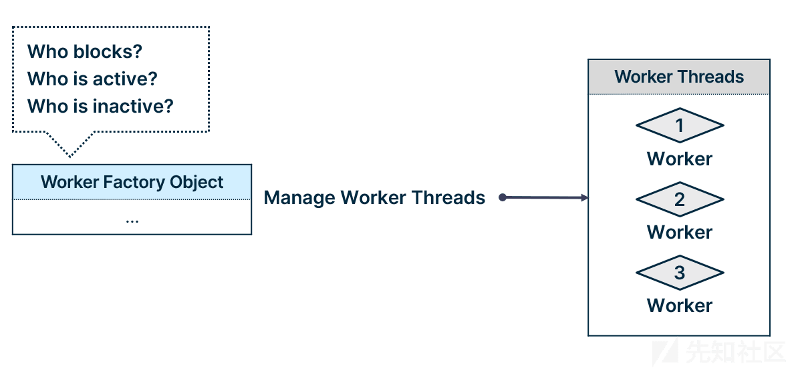](https://xzfile.aliyuncs.com/media/upload/picture/20231217222527-1ff3dd58-9ce8-1.png)

内核公开了 7 个系统调用来与工作线程工厂对象进行交互：

-   NtCreateWorkerFactory
-   NtShutdownWorkerFactory
-   NtQueryInformationWorkerFactory
-   NtSetInformationWorkerFactory
-   NtWorkerFactoryWorkerReady
-   NtWaitForWorkViaWorkerFactory
-   NtReleaseWorkerFactoryWorker

我们的目的是接管工作线程，相关目标是启动例程。启动例程基本上是工作线程的入口点，通常此例程充当线程池调度程序，负责对工作项进行出列和执行。

启动例程可以在工作线程工厂创建系统调用中控制，更有趣的是，系统调用接受要为其创建工作器工厂的进程的句柄：

[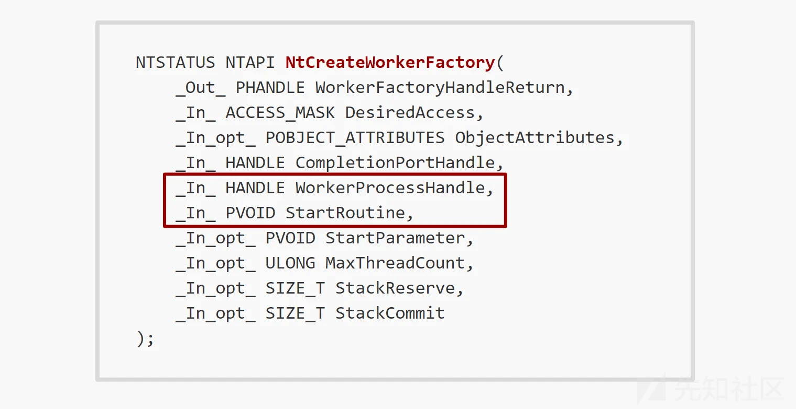](https://xzfile.aliyuncs.com/media/upload/picture/20231217222841-938c7298-9ce8-1.png)

查看内核中系统调用的实现，我们注意到有一个验证，可以确保没有为当前进程以外的进程创建工作线程工厂：

[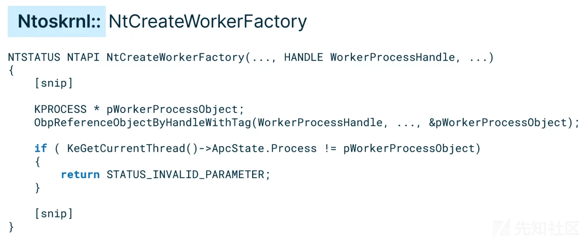](https://xzfile.aliyuncs.com/media/upload/picture/20231217222922-ab954590-9ce8-1.png)

一般来说，系统调用获取一个可能值的参数有点奇怪。所有进程默认都有一个线程池，因此默认有一个工作线程工厂。

我们可以简单地利用 DuplicateHandle() API 来访问属于目标进程的工作线程工厂，而无需经历创建工作线程工厂的麻烦。

[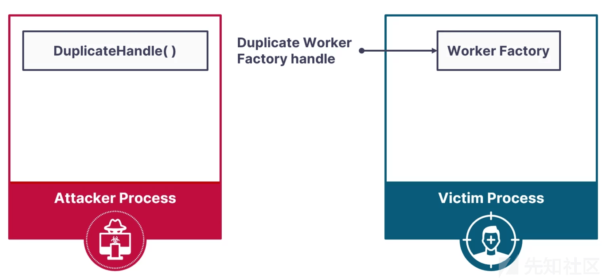](https://xzfile.aliyuncs.com/media/upload/picture/20231217222926-adfa745e-9ce8-1.png)

通过访问现有的工作线程工厂，我们无法控制启动例程值，因为该值是恒定的，在对象初始化后无法自然更改。这么说的话，如果我们能确定启动例程值，我们就可以用恶意 shellcode 覆盖例程代码。

若要获取工作线程工厂信息，可以使用 NtQueryWorkerFactoryInformation 系统调用：

查询系统调用（query system call）可以检索的唯一受支持的信息类是基本工作线程工厂信息：

在这种情况下，这就足够了，因为基本工人线程工厂（worker factory）信息包括启动例程值：

给定启动例程值，我们可以用恶意 shellcode 覆盖启动例程内容。

启动例程可以保证在某个时间点运行，但如果我们也可以触发它的执行而不是等待它，那就更好了。为此，我们查看了 NtSetInformationWorkerFactory 系统调用：

与查询系统调用相比，set 系统调用支持更多的信息类，最符合我们需求的是 WorkerFactoryThreadMinimum 信息类：

设置的最小工作线程数起码为当前正在运行的线程数 + 1，这会导致创建一个新的工作线程，这意味着执行了启动例程：

[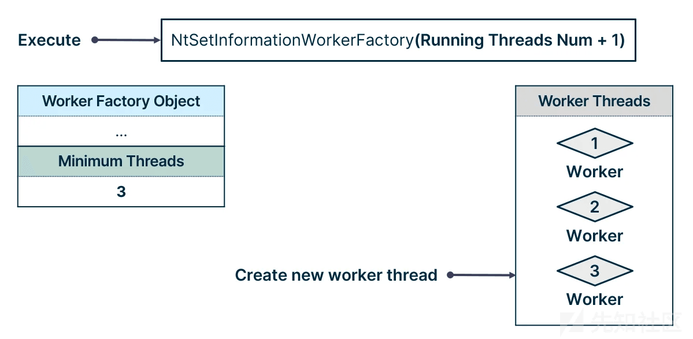](https://xzfile.aliyuncs.com/media/upload/picture/20231217222956-c00ff6dc-9ce8-1.png)

就这样，我们成功开发了我们的第一个 pool party 变体。

### 攻击线程池

在攻击线程池时，我们的目标是将工作项插入到目标进程中，因此我们专注于如何将工作项插入到线程池中。我们知道，如果我们正确插入一个工作项，它将由工作线程执行。我们将假设我们已经有权访问目标线程池的工作线程工厂，正如我们在上一节中证明的那样，可以通过复制工作线程工厂句柄来授予此类访问权限。

#### 工作项类型

支持的工作项可分为三种类型：

1.  常规工作项，这些工作项由排队 API 调用时立即排队。
2.  异步工作项，在操作完成时排队，例如，在写入文件操作完成时。
3.  计时器工作项，这些工作项由排队 API 调用立即排队，但在计时器过期时执行。

#### 队列类型

关于这三种类型的工作项，还有三种队列：

1.  常规工作项排队到任务队列中，驻留在主线程池结构中，即 TP\_POOL。
2.  异步工作项将排队到 I/O 完成队列，该队列是一个 Windows 对象。
3.  异步工作项将排队到 I/O 完成队列，该队列是一个 Windows 对象。

主线程池结构驻留在进程内存地址空间中的用户模式中，因此可以通过内存写入函数对其队列进行修改。I/O 完成队列是一个 Windows 对象，因此该队列驻留在内核中，并可由其公开的系统调用进行操作。

#### 辅助结构

在深入研究每种工作项类型的排队机制之前，请务必注意，工作项回调不是由工作线程直接执行的。相反，每个工作项都有一个帮助程序回调，用于执行工作项回调。排队的结构体是帮助程序结构体。

[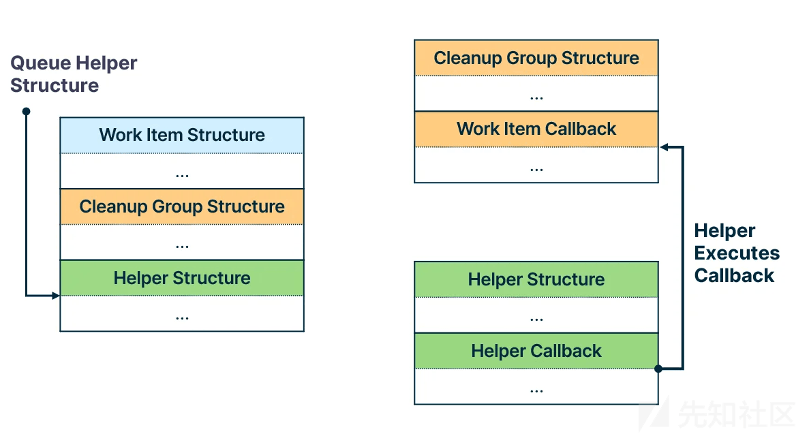](https://xzfile.aliyuncs.com/media/upload/picture/20231217223029-d3d7b6f0-9ce8-1.png)

### 攻击线程池：TP\_WORK

通过查看 TP\_WORK 工作项结构体，我们发现其帮助程序结构是 TP\_TASK 结构体。我们知道 Task 结构体是插入到线程池结构体中的任务队列中的内容。

负责提交 TP\_WORK 工作项的 API 名为 SubmitThreadpoolWork。沿着 SubmitThreadpoolWork 的调用链向下，我们到达了名为 TpPostTask 的排队 API。

TpPostTask API 负责将任务插入到任务队列中，该队列由双向链表表示。它按优先级检索相应的任务队列，并将任务插入到任务队列的尾部。

[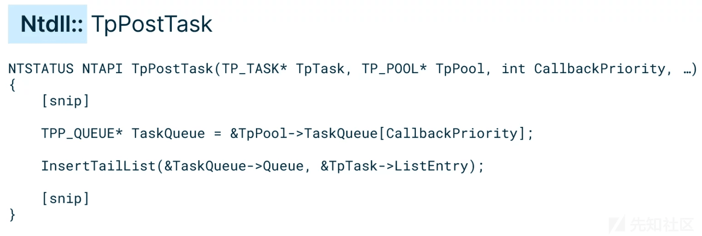](https://xzfile.aliyuncs.com/media/upload/picture/20231217223039-d9fee468-9ce8-1.png)

根据目标进程的线程池结构，我们可以篡改其任务队列，将恶意任务注入其中。若要获取目标进程的线程池结构体，可以使用 NtQueryInformationWorkerFactory。基本 worker factory 信息包括 start 例程的 start 参数，而此 start 参数实质上是指向 TP\_POOL 结构体的指针。我们有了第二个 pool party 变体。

### 攻击线程池：TP\_IO

调用队列类型，异步工作项将排队到 I/O 完成队列。I/O 完成队列是一个 Windows 对象，用作已完成 I/O 操作的队列。I/O 操作完成后，通知将插入队列中。

[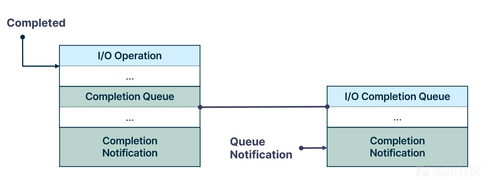](https://xzfile.aliyuncs.com/media/upload/picture/20231217223045-dd5f1330-9ce8-1.png)

线程池依赖于 I/O 完成队列，以便在异步工作项的操作完成时接收通知。

注意：微软将 I/O 完成队列称为 I/O 完成端口。此对象本质上是一个内核队列（KQUEUE），因此为了避免混淆，我们将其称为 I/O 完成队列。

内核公开了 8 个系统调用，用于与 I/O 完成队列进行交互：

-   NtCreateIoCompletion
-   NtOpenIoCompletion
-   NtQueryIoCompletion
-   NtQueryIoCompletionEx
-   NtSetIoCompletion
-   NtSetIoCompletionEx
-   NtRemoveIoCompletion
-   NtRemoveIoCompletionEx

请记住，NtSetIoCompletion 系统调用用于将通知排队到队列中。我们稍后将回到此系统调用。

有了一定的 I/O 完成背景，我们可以直接进入异步工作项的排队机制。我们将使用 TP\_IO 工作项作为示例，但请注意，相同的概念适用于其他异步工作项。

TP\_IO 工作项是在完成文件操作（如读取和写入）时执行的工作项。TP\_IO 工作项的辅助结构体（helper structure）是 TP\_DIRECT 结构体，因此我们希望此结构排队到完成队列。

当异步工作项排队到 I/O 完成队列时，我们查找将工作项与线程池的 I/O 完成队列关联的函数。查看 CreateThreadpoolIo 的调用链，我们找到了感兴趣的函数：TpBindFileToDirect 函数。此函数将文件完成队列设置为线程池的 I/O 完成队列，并将文件完成键设置为直接结构：

[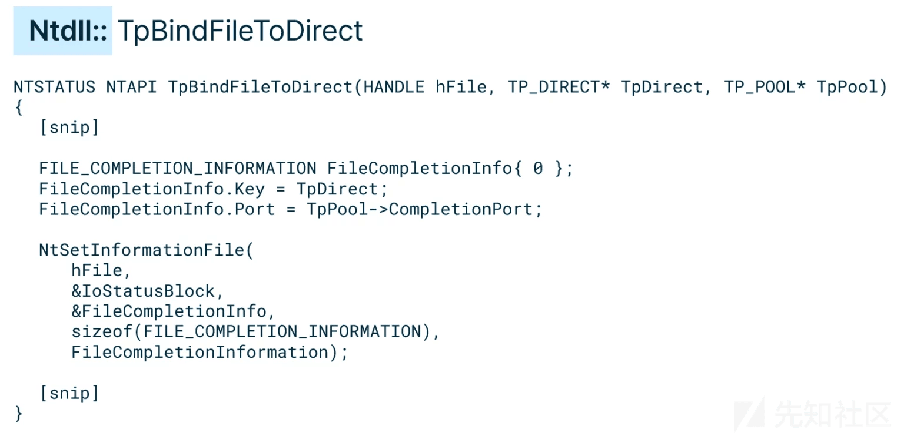](https://xzfile.aliyuncs.com/media/upload/picture/20231217223102-e7b9c9b0-9ce8-1.png)

对文件对象调用 TpBindFileToDirect 会导致文件对象的完成队列指向线程池的 I/O 完成队列，并且完成键指向直接结构。

[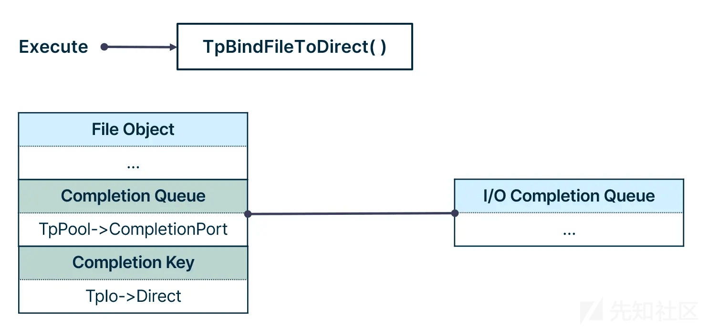](https://xzfile.aliyuncs.com/media/upload/picture/20231217223106-e9d03090-9ce8-1.png)

此时，I/O 完成队列仍为空，因为未对文件执行任何操作。函数调用后对文件执行的任何操作（例如，WriteFile）都会导致完成密钥排队到 I/O 完成队列。

[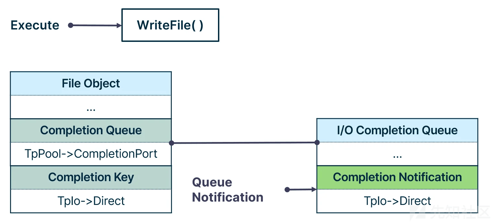](https://xzfile.aliyuncs.com/media/upload/picture/20231217223113-edc17b50-9ce8-1.png)

总而言之，异步工作项将排队到 I/O 完成队列，直接结构体是排队的字段。有了目标进程的 I/O 完成队列的句柄，我们就能够将通知排队到它。可以使用 DuplicateHandle API 复制此句柄，类似于我们复制 worker factory 句柄的方式。有了这个，我们有了第三个泳池派对变体：

我们如何插入 ALPC、JOB 和 WAIT 工作项？将执行排队到 I/O 完成队列的任何有效 TP\_DIRECT 结构体。这完全取决于我们如何将 TP\_DIRECT 结构体排入 I/O 完成队列。

可以通过以下方式之一完成排队：

1.  利用 Windows 对象，类似于 TP\_IO 滥用。这将涉及将对象与目标进程的 I/O 完成队列相关联，然后此对象上的任何操作完成都将对通知进行排队。
2.  利用 NtSetIoCompletion 将通知直接排入完成队列。

考虑到这一点，我们可以通过将基础 Windows 对象与目标线程池的 I/O 完成队列相关联，并将其完成密钥设置为指向恶意工作项来注入其余的异步工作项，即 TP\_WAIT、TP\_ALPC 和 TP\_JOB。最重要的是，我们可以直接注入恶意 TP\_DIRECT 结构体，而无需通过 Windows 对象对其进行代理，这涉及使用 NtSetIoCompletion 系统调用。这使我们能够创建另外四个泳池派对变体：

-   PoolParty 变体 4 – 远程 TP\_WAIT 工作项插入
-   PoolParty 变体 5 – 远程 TP\_ALPC 工作项插入
-   PoolParty 变体 6 – 远程 TP\_JOB 工作项插入
-   PoolParty 变体 7 – 远程 TP\_DIRECT 插入

这些变体很特殊，因为执行是由完全合法的操作触发的，例如写入文件、连接到 ALPC 端口、将进程分配给作业对象以及设置事件。

### 攻击线程池：TP\_TIMER

首先，在查看计时器工作项的创建和提交 API 时，我们注意到未提供计时器句柄。提交 API SetThreadpoolTimer 接受某些计时器配置（如 DueTime），但尚不清楚实际计时器对象所在的位置。

事实证明，计时器工作项对存放在计时器队列中的现有计时器对象进行操作。调用 SubmitThreadpoolTimer API 后，工作项将插入队列中，并使用用户提供的配置信息来配置存放在队列中的计时器对象。

[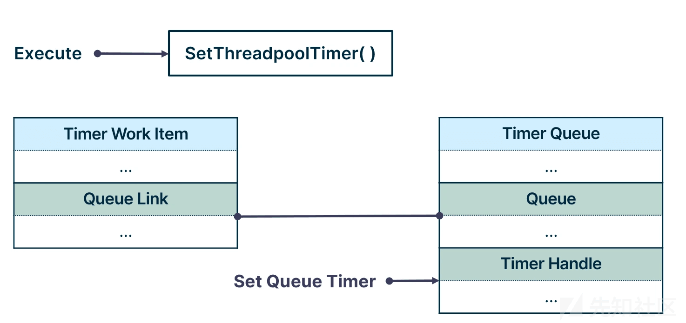](https://xzfile.aliyuncs.com/media/upload/picture/20231217223124-f4bacd94-9ce8-1.png)

计时器到期后，将调用出队函数，该函数将工作项从队列中出队并执行它。

[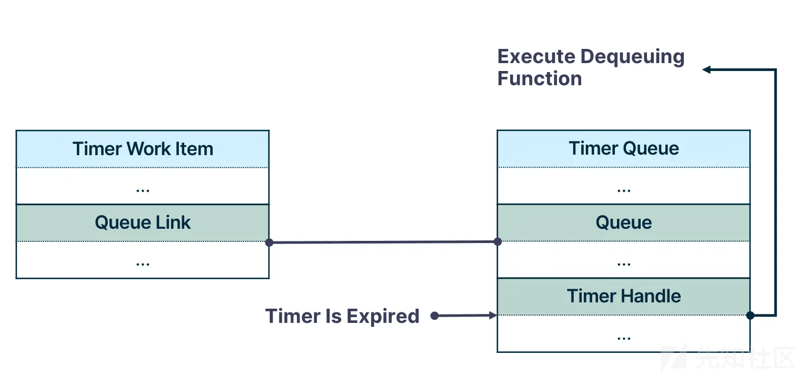](https://xzfile.aliyuncs.com/media/upload/picture/20231217223128-f71115d0-9ce8-1.png)

一般来说，计时器对象本身不支持在过期时执行回调。您需要知道的是，线程池使用支持计时器的 TP\_WAIT 工作项来实现它。因此，如果我们将计时器队列设置为过期，则调用出列函数。现在的问题是，我们如何正确地将计时器排队到队列中？

计时器和计时器队列之间的连接器是 TP\_TIMER 的 WindowEndLinks 和 WindowStartLinks 字段。

为了简单起见，我们可以将这两个字段视为双向链表的列表条目。

[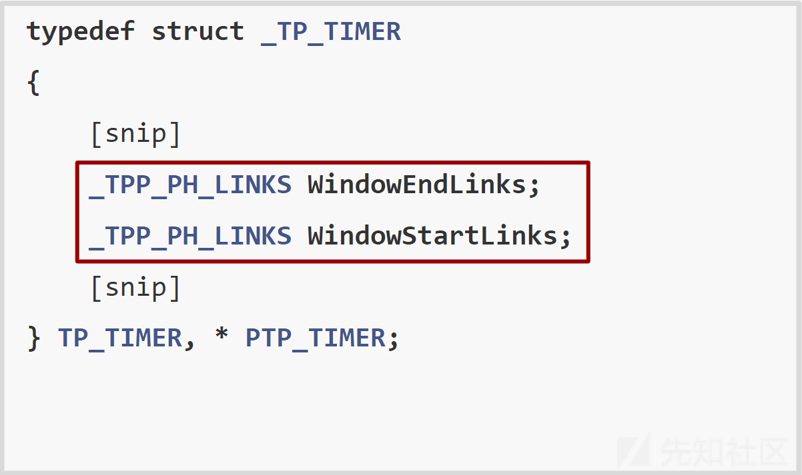](https://xzfile.aliyuncs.com/media/upload/picture/20231217223133-f9ead14c-9ce8-1.png)

沿着 SetThreadpoolTimer 的调用链向下，我们到达了名为 TppEnqueueTimer 的排队函数。

TppEnqueueTimer 将 TP\_TIMER 的 WindowStartLinks 插入队列 WindowStart 字段，并将 WindowEndLinks 插入队列 WindowEnd 字段。

[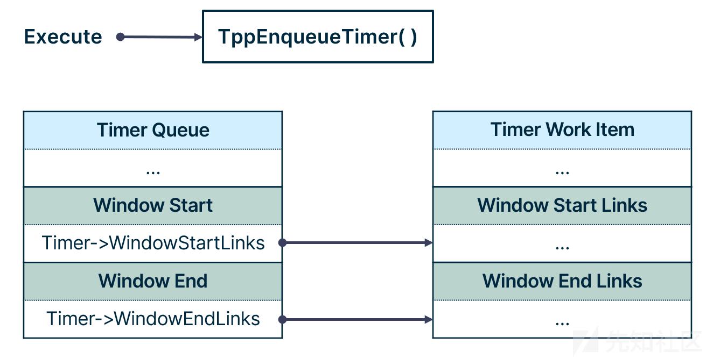](https://xzfile.aliyuncs.com/media/upload/picture/20231217223142-ff6253c0-9ce8-1.png)

1.  Queue the timer work item to the timer queue.  
    将计时器工作项排队到计时器队列。
2.  Configure the timer object residing in the queue.  
    配置存放在队列中的计时器对象。

由于这两个操作，一旦计时器对象过期，取消排队函数将执行，取消排队并执行排队的计时器工作项。给定目标进程的线程池结构，我们可以篡改其计时器队列，将恶意计时器工作项注入其中。排队后，我们需要设置队列用于过期的计时器对象。设置计时器需要一个句柄，可以使用 DuplicateHandle API 复制此类句柄。就这样，我们有了第八个泳池派对变体：

更令人惊讶的是，在设置计时器后，攻击者可以退出进程并从系统中删除其身份。因此，系统看起来很干净，恶意代码仅在计时器用完时才会激活。

## 经过测试的 EDR 解决方案

作为研究过程的一部分，每个 Pool Party 变体都针对五种领先的 EDR 解决方案进行了测试，包括：

-   Palo Alto Cortex
-   SentinelOne EDR
-   CrowdStrike Falcon
-   Microsoft Defender For Endpoint
-   Cybereason EDR

我们实现了 100% 的成功率，因为没有一个 EDR 能够检测或阻止 Pool Party 攻击。我们向每个供应商报告了这些发现，并相信他们正在进行更新以更好地检测这些类型的技术。

需要注意的是，虽然我们已尽最大努力测试我们可以使用的 EDR 产品，但我们无法测试市场上的每种产品。通过向安全社区提供这些信息，我们希望将恶意行为者利用这些技术的能力降至最低，并为 EDR 供应商和用户提供他们自己立即采取行动所需的知识。

## 关键要点

我们认为，根据这项研究的结果，有一些重要的结论：

1.  尽管 EDR 已经发展，但大多数解决方案目前使用的检测方法无法通用地检测我们在这里开发的新技术工艺注入技术。虽然我们的研究证明了我们如何能够专门滥用线程池，但恶意行为者无疑会以类似的方式找到其他功能来利用。我们认为，对于 EDR 供应商来说，开发和实施一种通用的检测方法，以主动防御这些可能性至关重要。
2.  我们还认为，对于各个组织来说，加强对检测异常的关注是很重要的，而不是完全信任仅基于其身份的流程。我们的研究表明，代表受信任的进程执行代码可能不会被 EDR 检测到。这突出表明，必须进行更深入的检查，以确保这些程序所执行业务的合法性。

# 结论

尽管现代 EDR 已经发展到可以检测已知的工艺注入技术，但我们的研究证明，仍然有可能开发出无法检测到并有可能产生毁灭性影响的新技术。老练的威胁行为者将继续探索新的和创新的流程注入方法，安全工具供应商和从业者必须积极主动地防御它们。
