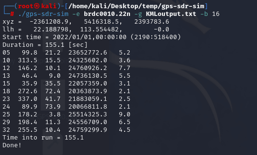

# 使用 bladeRF 进行 GPS 欺骗 - 先知社区

使用 bladeRF 进行 GPS 欺骗

- - -

## 简介

> BladeRF 是一款软件定义无线电 (SDR) 平台，由 Nuand 公司开发。它是一个高性能、可编程的设备，使用户能够发送和接收无线电频率信号。SDR 技术允许用户通过软件来控制无线电通信的各个方面，而不是传统的硬件方法

刚好手边有一块 BladeRF 的板子，尝试实现对手机和车机的 GPS 欺骗攻击

## GPS 简介

GPS（全球定位系统）是一种基于卫星导航的定位技术，通过使用一组卫星在空间中确定接收器的位置  
运行于宇宙空间的 GPS 卫星，每一个都在时刻不停地通过卫星信号向全世界广播自己的当前位置坐标信息，在发送位置的同时还会附上自己的时间戳，GPS 接收器收到卫星 GPS 数据的时候，根据时间戳和光速可以算出自己和卫星的直线距离。  
理论上来说，三维空间中 三对卫星 GPS 数据就可以确定一个点了，但是现实中要确定一个点至少需要四颗卫星，多出来的一颗卫星就是用于消除和减少误差的，保证定位有效  
[](https://cdn.nlark.com/yuque/0/2024/png/21398751/1706672137698-89b5a24a-3b14-4c35-a764-bdd668b9e4b9.png#averageHue=%23f0eeeb&clientId=u67f7ae35-39eb-4&from=paste&id=u998a79f1&originHeight=404&originWidth=570&originalType=url&ratio=1.5&rotation=0&showTitle=false&status=done&style=none&taskId=u429fb162-e02c-49d6-8ace-7b12ba441f7&title=)

## 环境搭建

### bladeRF 设备识别

这里使用 kali 搭建环境（尝试了在 windows 下运行，虽然能识别到 bladeRF 设备，但是运行起来还是有奇奇怪怪的问题，如果还是想自己尝试一下 windows 环境的话可以参考官方文档 - [https://github.com/Nuand/bladeRF/wiki/Getting-Started%3A-Windows](https://github.com/Nuand/bladeRF/wiki/Getting-Started%3A-Windows) ）

参考官方文档 - [https://github.com/Nuand/bladeRF/wiki/Getting-Started%3A-Linux](https://github.com/Nuand/bladeRF/wiki/Getting-Started%3A-Linux)

先将虚拟机的 USB 调整成 USB3.1  
[](https://cdn.nlark.com/yuque/0/2024/png/21398751/1706603121109-e2f1e953-fda7-4d68-be69-a7753f8b8ea4.png#averageHue=%23f7f3f3&clientId=u83451815-4164-4&from=paste&height=421&id=ufb684df4&originHeight=421&originWidth=942&originalType=binary&ratio=1.5&rotation=0&showTitle=false&size=42031&status=done&style=none&taskId=u7cbecc35-0b7b-4075-9f98-97ffbb6617d&title=&width=942)

安装 BladeRF 工具

```plain
$ sudo add-apt-repository ppa:nuandllc/bladerf 
$ sudo apt-get update 
$ sudo apt-get installbladerf
```

安装 header 文件

```plain
$ sudo apt-get install libbladerf-dev
```

安装 bladeRF 固件和 FPGA 镜像，自行选择

```plain
$ sudo apt-get installbladerf-firmware-fx3 # 适用于所有型号 bladeRF 的固件
$ sudo apt-get installbladerf-fpga-hostedx40 # 适用于 bladeRF x40 
$ sudo apt-get installbladerf-fpga-hostedx115 # 适用于 bladeRF x115 
$ sudo apt-get 安装 bladerf-fpga-hostedxa4 # 适用于 bladeRF 2.0 Micro A4 
$ sudo apt-get installbladerf-fpga-hostedxa9 # 适用于 bladeRF 2.0 Micro A9
```

安装依赖（这个一定要安装，至少 usb 的那两个要安装，不然会识别不到设备

```plain
sudo apt-get install libusb-1.0-0-dev libusb-1.0-0 build-essential cmake libncurses5-dev libtecla1 libtecla-dev pkg-config git wget
```

一切就绪之后，插上设备，使用命令就可以看到脸上的 bladeRF 了

```plain
bladeRF-cli -p
```

[](https://cdn.nlark.com/yuque/0/2024/png/21398751/1706603531682-5f124a4c-957f-405a-b866-4d9488260fed.png#averageHue=%23272b38&clientId=u83451815-4164-4&from=paste&height=142&id=u31edb77b&originHeight=213&originWidth=519&originalType=binary&ratio=1.5&rotation=0&showTitle=false&size=51831&status=done&style=none&taskId=ua3d76d50-be0e-4f9c-b1b4-7d866df50c5&title=&width=346)

### 生成 GPS 数据

我们利用 bladeRF 来收发 GPS 数据，GPS 数据的来源需要使用 gps-sdr-sim - [https://github.com/osqzss/gps-sdr-sim](https://github.com/osqzss/gps-sdr-sim)工具来静态生成

```plain
git clone https://github.com/osqzss/gps-sdr-sim.git
cd gps-sdr-sim
gcc gpssim.c -lm -O3 -o gps-sdr-sim
```

在谷歌在线地图上面选择一个坐标，我这里选择澳门葡京娱乐场，经纬度为 22.18982545839303, 113.544124355456  
[](https://cdn.nlark.com/yuque/0/2024/png/21398751/1706589365087-ef7f2f3d-56d9-406c-945a-7d6657c26711.png#averageHue=%23c8ebd3&clientId=ue69a2480-96fa-4&from=paste&height=606&id=u7684b48a&originHeight=909&originWidth=1438&originalType=binary&ratio=1.5&rotation=0&showTitle=false&size=1096828&status=done&style=none&taskId=u416a9dfc-920d-414d-8dc9-4e48ad6e021&title=&width=958.6666666666666)  
使用项目源码中自带的卫星星历生成 GPS 数据，生成澳门新葡京的固定坐标数据

```plain
./gps-sdr-sim -e brdc0010.22n -l 22.18982545839303,113.544124355456,100 -b 16
```

[](https://cdn.nlark.com/yuque/0/2024/png/21398751/1706610910066-3f299f14-7113-4fd8-b6af-a7e3ade9834b.png#averageHue=%232a2f3c&clientId=u67f7ae35-39eb-4&from=paste&height=372&id=u62241abc&originHeight=372&originWidth=640&originalType=binary&ratio=1.5&rotation=0&showTitle=false&size=113255&status=done&style=none&taskId=uf9548f7c-1290-4c2c-aa77-679d43d3759&title=&width=640)  
这里的 gpssim.bin 文件就是模拟生成的 GPS 数据  
[](https://cdn.nlark.com/yuque/0/2024/png/21398751/1706610945529-44dd6b04-0458-4a29-8f50-9332fb01a5b3.png#averageHue=%232f3440&clientId=u67f7ae35-39eb-4&from=paste&height=347&id=u2b834577&originHeight=347&originWidth=613&originalType=binary&ratio=1.5&rotation=0&showTitle=false&size=126056&status=done&style=none&taskId=u9f34b65c-2548-432c-9475-050dfc57275&title=&width=613)

## GPS 欺骗

### 手机静态 GPS 欺骗

bladeRF 进入交互模式

```plain
# bladeRF-cli -i
bladeRF> set frequency tx1 1575.42M

  TX1 Frequency: 1575419998 Hz (Range: [47000000, 6000000000])

bladeRF> set samplerate tx1 2.6M

  Setting TX1 sample rate - req:   2600000 0/1Hz, actual:   2600000 0/1Hz

bladeRF> set bandwidth tx1 2.5M

  TX1 Bandwidth:   2500000 Hz (Range: [200000, 56000000])

bladeRF> tx config file=gpssim.bin format=bin channel=1
bladeRF> tx start
bladeRF> tx wait
```

[](https://cdn.nlark.com/yuque/0/2024/png/21398751/1706610786702-e9fbcad0-f6b4-4a9e-b2f5-6928fbd0c473.png#averageHue=%23282d39&clientId=u67f7ae35-39eb-4&from=paste&height=302&id=u61be7361&originHeight=302&originWidth=642&originalType=binary&ratio=1.5&rotation=0&showTitle=false&size=83610&status=done&style=none&taskId=u23b20a65-c394-4654-b664-31fa194ebdc&title=&width=642)  
AOSP（Android 10）手机打开 GPS Test 这个软件，因为它是仅 GPS 的，所以纯纯被欺骗  
[](https://cdn.nlark.com/yuque/0/2024/jpeg/21398751/1706610751260-e705ad24-ca9b-4d46-8d20-199a394357f7.jpeg#averageHue=%23385c4b&clientId=u67f7ae35-39eb-4&from=paste&height=1616&id=u7746e000&originHeight=1616&originWidth=1280&originalType=binary&ratio=1.5&rotation=0&showTitle=false&size=1119961&status=done&style=none&taskId=u13d2fd9b-7134-498b-bb87-27cf16fe6fc&title=&width=1280)  
虽然有一点点的偏差（可能是我用的星历比较老），但可以看出来 GPS 已经被欺骗了（本来在室内环境下不能识别到卫星信号）

### 联网状态下定位欺骗

> 联网状态下能实现定位欺骗吗

测试之前我觉得是不能的  
手机联网状态下高德竟然也可以被欺骗....原因可能是多样的，比如我这个测试机没有手机卡，Android 版本比较低等等  
[](https://cdn.nlark.com/yuque/0/2024/jpeg/21398751/1706667160643-a4d1a628-a036-46f2-93b1-b98d82ff1fd8.jpeg#averageHue=%233d4545&clientId=u67f7ae35-39eb-4&from=paste&height=1706&id=u2f8501d2&originHeight=1706&originWidth=1280&originalType=binary&ratio=1.5&rotation=0&showTitle=false&size=597015&status=done&style=none&taskId=u235846af-d7d3-4618-98f8-c780bab6315&title=&width=1280)

使用

### 动态 GPS 欺骗

在在线网址上画路径 - [https://earth.google.com/](https://earth.google.com/)  
[](https://cdn.nlark.com/yuque/0/2024/png/21398751/1706671397068-230d7cc1-b0de-491b-977c-1e1d9c79288b.png#averageHue=%23677883&clientId=u67f7ae35-39eb-4&from=paste&height=329&id=ub593b13e&originHeight=493&originWidth=612&originalType=binary&ratio=1.5&rotation=0&showTitle=false&size=710638&status=done&style=none&taskId=uaab6a07a-08f0-4e54-b054-1dd33d0756e&title=&width=408)  
导出为 KML，接着将 kml 格式数据导入 SatGEN，生成 MNEA 格式文件  
[](https://cdn.nlark.com/yuque/0/2024/png/21398751/1706672756909-4dd1c053-216b-4b2f-b4be-f02f382f1880.png#averageHue=%23cbb79e&clientId=u67f7ae35-39eb-4&from=paste&height=534&id=u53eab0e6&originHeight=801&originWidth=1258&originalType=binary&ratio=1.5&rotation=0&showTitle=false&size=170736&status=done&style=none&taskId=u5e67faf8-7db4-4961-8f02-a82fceab907&title=&width=838.6666666666666)  
生成内容如下  
[](https://cdn.nlark.com/yuque/0/2024/png/21398751/1706672933644-ab7e2b52-3e46-465d-840a-700a9ab7b9ef.png#averageHue=%2333302e&clientId=u67f7ae35-39eb-4&from=paste&height=385&id=ud2ccbd6a&originHeight=577&originWidth=1104&originalType=binary&ratio=1.5&rotation=0&showTitle=false&size=207443&status=done&style=none&taskId=ue9fedd2d-ac25-475f-8602-bd515dc521f&title=&width=736)  
使用 gps-sdr-sim 生成轨迹数据

```plain
./gps-sdr-sim -e brdc0010.22n -g KMLoutput.txt -b 16
```

[](https://cdn.nlark.com/yuque/0/2024/png/21398751/1706675542488-d98abfc5-e764-4f28-88a0-052d7c6904f3.png#averageHue=%232d313c&clientId=u33bbd212-41e5-4&from=paste&height=321&id=u4e0b6272&originHeight=321&originWidth=530&originalType=binary&ratio=1&rotation=0&showTitle=false&size=83610&status=done&style=none&taskId=ub103f47e-b74b-4206-a898-7bf9f825e7e&title=&width=530)  
最后按照之前的方法使用 bladeRF-cli 进行欺骗即可，打开高德地图可以看到正在按照我们之前的路线行进，欺骗成功  
[](https://cdn.nlark.com/yuque/0/2024/jpeg/21398751/1706676005112-b4ebb486-c4fb-415d-ae3a-21465458949e.jpeg#averageHue=%2390968b&clientId=u33bbd212-41e5-4&from=paste&height=4096&id=ubeba984f&originHeight=4096&originWidth=3072&originalType=binary&ratio=1&rotation=0&showTitle=false&size=3880949&status=done&style=none&taskId=ub371095d-479e-42b5-9471-06968ee2501&title=&width=3072)

## 参考链接

-   [https://www.anquanke.com/post/id/204316](https://www.anquanke.com/post/id/204316)
-   [https://bbs.kanxue.com/thread-271306.htm](https://bbs.kanxue.com/thread-271306.htm)
-   [https://mp.weixin.qq.com/s/y\_seB1mt1Oa1SGZBE0skNQ](https://mp.weixin.qq.com/s/y_seB1mt1Oa1SGZBE0skNQ)
-   [https://xz.aliyun.com/t/124](https://xz.aliyun.com/t/124)
-   [https://www.cnblogs.com/magicboy110/articles/1901669.html](https://www.cnblogs.com/magicboy110/articles/1901669.html)
-   [https://zhuanlan.kanxue.com/article-12936.htm](https://zhuanlan.kanxue.com/article-12936.htm)
-   [https://github.com/Nuand/bladeRF/wiki](https://github.com/Nuand/bladeRF/wiki)
-   [https://blog.csdn.net/OpenSourceSDR/article/details/108857782](https://blog.csdn.net/OpenSourceSDR/article/details/108857782)
-   [https://www.blackhat.com/docs/eu-15/materials/eu-15-Kang-Is-Your-Timespace-Safe-Time-And-Position-Spoofing-Opensourcely-wp.pdf](https://www.blackhat.com/docs/eu-15/materials/eu-15-Kang-Is-Your-Timespace-Safe-Time-And-Position-Spoofing-Opensourcely-wp.pdf)
-   [https://blog.csdn.net/qq\_43066145/article/details/124802734](https://blog.csdn.net/qq_43066145/article/details/124802734)
-   [https://www.mrskye.cn/archives/5d9be0ae/](https://www.mrskye.cn/archives/5d9be0ae/)
