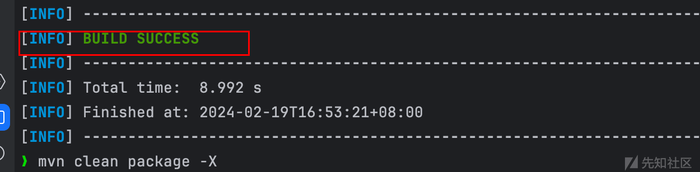
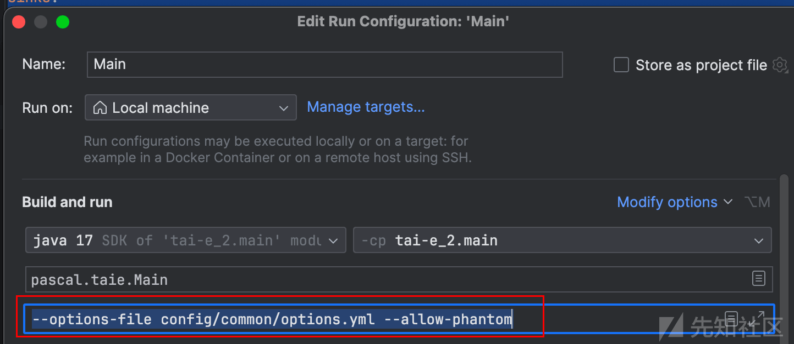
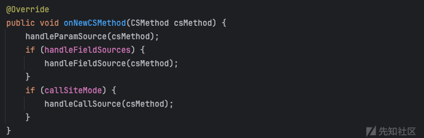

# 使用太阿（Tai-e）进行静态代码安全分析（spring-boot 篇一） - 先知社区

使用太阿（Tai-e）进行静态代码安全分析（spring-boot 篇一）

- - -

**author: keanu, lcark**

## 概述

[Tai-e](https://github.com/pascal-lab/Tai-e "Tai-e")是由南京大学的老师 (李樾、谭添) 开发的针对 java 的静态程序分析框架，支持包括指针分析、数据流分析、污点分析在内的诸多静态程序分析。由于 Tai-e 并非专门用来做静态代码安全分析，所以并非开箱即用，在实际安全分析中使用有许多问题。准备通过大致如下多篇文章，逐渐将 Tai-e 改造为开箱即用的静态代码安全分析框架。

-   分析 SpringBoot 应用，支持控制翻转、依赖注入、面向切面编程等特性
-   分析基于 Mybatis 框架的 sql 注入漏洞
-   优化输出结果
-   Java Api 提取，更偏向于支持企业 Api 安全。
-   Pointer Analysis And Taint Analysis Flow Analysis  
    由于 spring-boot 实现了控制反转与面向切面编程的设计思想，使得程序并非顺序执行，因此很难通过程序入口来顺序分析所有代码。本篇文章旨在从 0 开始，利用 Tai-e 来分析 spring-boot 程序，解决控制反转的问题。

## 从 0 开始配置 tai-e 并加载 java-sec-code

## 下载 tai-e 代码

`git clone https://github.com/pascal-lab/Tai-e.git`  
[](https://xzfile.aliyuncs.com/media/upload/picture/20240219183626-bc06d95a-cf12-1.png)  
`git submodule update --init --recursive（this repo contains the Java libraries used by the analysis; it is large and may take a while to clone）`  
[](https://xzfile.aliyuncs.com/media/upload/picture/20240219183652-cb4620ba-cf12-1.png)

## IDEA 配置 tai-e

其实就是按照[官方文档](https://tai-e.pascal-lab.net/docs/current/reference/en/setup-in-intellij-idea.html "官方文档")进行配置 IDEA  
在打开 tai-e 程序后设置  
`File->Project Structure`  
[](https://xzfile.aliyuncs.com/media/upload/picture/20240219183946-32eff600-cf13-1.png)  
[](https://xzfile.aliyuncs.com/media/upload/picture/20240219183951-3614cf4a-cf13-1.png)

## 编译 java-sec-code

下载 java-sec-code 源码  
`git clone https://github.com/JoyChou93/java-sec-code.git`  
进入该下载路径执行  
`mvn clean package -X` 看到 Build success 代表编译成功  
[](https://xzfile.aliyuncs.com/media/upload/picture/20240219184149-7c34bdd2-cf13-1.png)  
用 idea 看是 target 路径  
[](https://xzfile.aliyuncs.com/media/upload/picture/20240219184144-795fdfe2-cf13-1.png)

## 配置 tai-e 加载 java-sec-code

首先创建 common 目录和 options 和 taint-config 文件。作为我们自己的配置  
[](https://xzfile.aliyuncs.com/media/upload/picture/20240219184229-947674bc-cf13-1.png)  
options 文件内容，注意需要修改 appClassPath 也就是我们刚才编译的 java-sec-code 的 target。

```plain
optionsFile: null
printHelp: false
classPath: []
appClassPath:
- /Users/Documents/codeqljava/java-sec-code/target/classes
mainClass:
inputClasses: []
javaVersion: 8
prependJVM: false
allowPhantom: true
worldBuilderClass: pascal.taie.frontend.soot.SootWorldBuilder
outputDir: output
preBuildIR: false
worldCacheMode: true
scope: REACHABLE
nativeModel: true
planFile: null
analyses:
#  ir-dumper: ;
  pta: cs:ci;implicit-entries:true;distinguish-string-constants:null;reflection-inference:solar;merge-string-objects:false;merge-string-builders:false;merge-exception-objects:false;taint-config:config/common/taint-config.yml;
onlyGenPlan: false
keepResult:
- $KEEP-ALL
```

taint-config 文件内容，这个文件暂时不需要修改，就是加了一个 sources 和 sinks 点以及 transfers。

```plain
sources:
#  - { kind: param, method: "<org.joychou.controller.SQLI: java.lang.String jdbc_sqli_sec(java.lang.String)>", index: 0}
  - { kind: param, method: "<org.joychou.controller.SQLI: java.lang.String jdbc_sqli_vul(java.lang.String)>", index: 0}
#  - { kind: param, method: "<org.joychou.controller.SpEL: void main(java.lang.String[])>", index: 0}
#  - {kind: param, method: "<org.joychou.controller.Rce: java.lang.String CommandExec(java.lang.String)>",index: 0}
sinks:
  ## SQLI
  - { vuln: "SQL Injection", level: 4, method: "<java.sql.Statement: java.sql.ResultSet executeQuery(java.lang.String)>", index: 0 }
  - { vuln: "SQL Injection", level: 4, method: "<java.sql.Connection: java.sql.PreparedStatement prepareStatement(java.lang.String)>", index: 0 }
transfers:
  - { method: "<java.lang.String: java.lang.String concat(java.lang.String)>", from: base, to: result }
  - { method: "<java.lang.String: java.lang.String concat(java.lang.String)>", from: 0, to: result }
  - { method: "<java.lang.String: char[] toCharArray()>", from: base, to: result }
  - { method: "<java.lang.String: void <init>(char[])>", from: 0, to: base }
  - { method: "<java.lang.String: void getChars(int,int,char[],int)>", from: base, to: 2 }
  - { method: "<java.lang.String: java.lang.String format(java.lang.String,java.lang.Object[])>", from: "1[*]", to: result }
  - { method: "<java.lang.StringBuffer: void <init>(java.lang.String)>", from: 0, to: base }
  - { method: "<java.lang.StringBuffer: java.lang.StringBuffer append(java.lang.String)>", from: 0, to: base }
  - { method: "<java.lang.StringBuffer: java.lang.StringBuffer append(java.lang.String)>", from: 0, to: result }
  - { method: "<java.lang.StringBuffer: java.lang.StringBuffer append(java.lang.String)>", from: base, to: result }
  - { method: "<java.lang.StringBuffer: java.lang.String toString()>", from: base, to: result }
  - { method: "<java.lang.StringBuilder: void <init>(java.lang.String)>", from: 0, to: base }
  - { method: "<java.lang.StringBuilder: java.lang.StringBuilder append(java.lang.String)>", from: 0, to: base }
  - { method: "<java.lang.StringBuilder: java.lang.StringBuilder append(java.lang.String)>", from: 0, to: result }
  - { method: "<java.lang.StringBuilder: java.lang.StringBuilder append(java.lang.String)>", from: base, to: result }
  - { method: "<java.lang.StringBuilder: java.lang.String toString()>", from: base, to: result }

call-site-mode: true
```

配置 Main 函数参数

[](https://xzfile.aliyuncs.com/media/upload/picture/20240219184335-bb799706-cf13-1.png)

[](https://xzfile.aliyuncs.com/media/upload/picture/20240219184339-be1a6abc-cf13-1.png)  
现在可以运行了，但是你会发现没有 taint-flow 的结果。  
taint-flow 结果分析  
主要的问题是 tai-e 的 taint-analysis 是基于 pointer-anysis 的。而 pointer-analysis 的分析是基于 worklist，这个 worklist 如果是 java se 程序初始化就是 main 函数，可以通过 main 函数进行分析，进行函数调用处理，从而 reach 到需要分析的函数，这个 tai-e 可以支持。由于我们的是 springboot 程序包含依赖注入和控制反转等。所以从 springboot 的入口 tai-e 没办法分析到我们的 controller 函数。所以 pointer-anlaysis 的结果也就是空的，导致 taint-anlaysis 结果也是空的。

经过分析发现 tai-e 分析 SpringBoot 项目存在 2 个问题。  
第一个为缺少 entrypoint，因为 JavaWeb 项目从入口点进行 pointerAnalysis 分析没办法 reach 到我们需要分析的 controller 方法。  
第二个问题为缺少 source，我们暂时没有办法通过 yml 将所有 Mapping 注解的 parameters 加入 sources，我们上边 yml 仅加入了一个 source。  
需要解决以上两个问题，才能进行基础的分析。

## 关键源码分析及实现

## PointerAnaysis 分析及入口点添加

由于 tai-e 的插件是集成在 PointerAnalysis，包括污点分析也是，也就是说 PointerAnalysis 就是这些分析的核心。所以在写如何编写插件前我们先大概分析一下 PointerAnlaysis 的执行流程。

### PointerAnaysis 插件执行流程

`DefalutSolver`实现指针分析以及插件的调用，并返回指针分析的结果 (core)  
`Plugin`即一个插件，可以通过编写插件的方式，在进行指针分析的过程中执行我们想要的操作 (污点分析也是类似的操作)。  
我们先看`PointerAnalysis` 的`runAnalysis`方法，这个其实不算是入口点，`analyze`才是，但是`analyze`仅根据配置然后调用`runAnalysis`，所以我们直接分析这个就好。  
[](https://xzfile.aliyuncs.com/media/upload/picture/20240221161649-8f98d7c6-d091-1.png)  
创建 DefaultSolver 对象并没有特别的操作对于插件，接下来看一下 setPlugin 方法  
[](https://xzfile.aliyuncs.com/media/upload/picture/20240221161701-97260158-d091-1.png)  
分析 DefaultSolver 的`solve`方法  
会首先调用 `initialize` 方法  
● 根据初始化调用图、指针流向图、worklist(可以理解为指针分析的工作集)、reachableMethods(也就是分析能到达的方法)、initializedClasses(可以理解为内置的类，会进行指针分析，不需要我们添加)、stmtProcessor(这个类是指针分析处理语句的核心，根据访问者模式处理对行的语句 (new、load、invoke、array 等))  
● 然后会执行插件的 onStart() 方法  
[](https://xzfile.aliyuncs.com/media/upload/picture/20240221161746-b18e424e-d091-1.png)  
`analyze`方法

-   通过消费 worklist 中的 Entry，对 Entry 进行指针分析的处理包括，然后调用 Plugin 的`onNewPointsToSet`方法（本篇文章用不到该方法，该方法是处理 field 和 array source 会用到）
-   在进行 worklist 后调用 Plugin.Finish() 的方法  
    [](https://xzfile.aliyuncs.com/media/upload/picture/20240221162056-233445e2-d092-1.png)  
    插件方法执行流程  
    loadPlugin(pointerAnalysis 加载插件)->setSolver->onStart->指针分析以及一些 plugin 方法 (由于不影响本篇顺序故没有写)->onFinish  
    从上边我们可以理解编写 Plugin 的流程
-   编写插件实现 plugin 的方法，选择我们需要的方法比如 onStart、onFinish
-   在 PointerAnalysis 加入编写的插件。

### 分析 EntryPointerHandler

通过对 PointerAnalysis 执行流程的分析应该能大概了解 Plugin 的执行顺序了。  
看一下 Plugin 的 interface，有一系列 plugin 的方法，对应我们上边分析的时序。  
[](https://xzfile.aliyuncs.com/media/upload/picture/20240221163342-eb95cd34-d093-1.png)  
看一下 tai-e 自带的`EntryPointHandler`它就是在 onStart 处判断加入口点。  
[](https://xzfile.aliyuncs.com/media/upload/picture/20240221163408-fb050c44-d093-1.png)

### 添加 EntryPoint

这样加入我们自己入口点的方法也有了，在 onStart 的时候把所有 有*Mapping 注解的方法都加入入口点，这样 pointeranalysis 就能分析到我们的 source 点了，taintanalysis 也会有结果。  
下边的代码就是获取所有的 class 然后获取 class 的 method 看注解是不是*Mapping 是的话就加入 entrypoint

```plain
public class AddControllerEntryPointHandler implements Plugin {
    private  Solver solver;
    @Override
    public void setSolver(Solver solver) {
        this.solver=solver;
    }

    @Override
    public void onStart() {
        //add all hsd mapping annotation methods to entrypoint
        List<JClass> list = solver.getHierarchy().applicationClasses().toList();
        for (JClass jClass : list) {
           jClass.getDeclaredMethods().forEach(jMethod->{
               if (!jMethod.getAnnotations().stream().filter(
                       annotation -> annotation.getType().matches("org.springframework.web.bind.annotation.\\w+Mapping")
               ).toList().isEmpty()) {
                   solver.addEntryPoint(new EntryPoint(jMethod, EmptyParamProvider.get()));
               }
            });


        }
    }
}
```

然后在 pointer Analysis 直接加入该插件，然后执行程序  
[](https://xzfile.aliyuncs.com/media/upload/picture/20240221163521-265f93d2-d094-1.png)  
然后执行程序将 dot 转换为 svg  
`dot -Tsvg -o taint-flow-graph.svg taint-flow-graph.dot`  
由于上边我们只加入了一个 sources 和 sql 的 sink 点，所以只能检测出来一个 taintflow  
[](https://xzfile.aliyuncs.com/media/upload/picture/20240221163600-3dadc888-d094-1.png)

## SourceHandler 分析及 springboot source 添加

污点分析的核心包括如下三个集成到指针分析的核心插件：  
`SourceHandler` 添加代表污点的特殊堆抽象加入到符合 source 点规则的指针的指向集中  
`TransferHandler` 将符合污点传播规则的边加入指针分析  
`SinkHandler` 收集污点流，输出 source->sink 的污点流的集合

### source 类型

tai-e 的污点分析支以下持三种 source

```plain
sources:
  - { kind: call, method: "<javax.servlet.ServletRequestWrapper: java.lang.String getParameter(java.lang.String)>", index: result }
  - { kind: param, method: "<com.example.Controller: java.lang.String index(javax.servlet.http.HttpServletRequest)>", index: 0 }
  - { kind: field, field: "<SourceSink: java.lang.String info>" }
```

**call sources**  
source 点由调用点生成，若 callsite 语句调用了特定方法，那么返回值就是 source 点。  
**paramater sources**  
对于特定方法，例如入口方法，没有特定的调用点。但其形参依然可能是 source 点。在 spring-boot，通过注解来声明请求的处理入口，没有明确调用 controller 方法，在这种情况下，paramater sources 非常有用。  
**field sources**  
对于字段类型的指针，其依然可能是 source。

### 流程分析

从配置中获取 source 点的配置  
[](https://xzfile.aliyuncs.com/media/upload/picture/20240221164403-5d7028f4-d095-1.png)  
当指针分析中产生新的语句或新的调用边时，若语句符合 source 的规则，则代表指针即为 source 点  
[](https://xzfile.aliyuncs.com/media/upload/picture/20240221164413-6389740c-d095-1.png)  
当指针分析产生新的方法时，会处理其中的语句，也会在这个地方处理 paramater sources  
[](https://xzfile.aliyuncs.com/media/upload/picture/20240221164438-72733228-d095-1.png)  
若我们想添加自定义的 source 点，便可以在 handleParamSource handleFieldSource handleCallSource 中添加。  
[](https://xzfile.aliyuncs.com/media/upload/picture/20240221164449-79542fca-d095-1.png)

### 添加 source

我们可以看到上边的一条传播路径，但是 sink 点为 executeQuery 的漏洞不止一个，因为我们的 source 仅加入了一个，但是一条一条加 source 也不太现实，没办法实现通用型。我们可以根据加 entrypoint 点的地方同样加入 source。  
通过分析找到 2 个比较适合加 source 点的地方，一个是处理 source 的开始，一个是处理 source 结束的地方。  
1.SourceHandler 处理 ParamSource 的地方  
[](https://xzfile.aliyuncs.com/media/upload/picture/20240221164519-8ac89be2-d095-1.png)  
2.在 tai-e 读取 taint-config 文件解析后添加 source  
[](https://xzfile.aliyuncs.com/media/upload/picture/20240221164531-921d6436-d095-1.png)  
我们这里就看第一种方法吧  
代码如下

```plain
private void handleParamSource(CSMethod csMethod) {
        JMethod method = csMethod.getMethod();
        if (paramSources.containsKey(method)) {
            Context context = csMethod.getContext();
            IR ir = method.getIR();
            paramSources.get(method).forEach(source -> {
                IndexRef indexRef = source.indexRef();
                Var param = ir.getParam(indexRef.index());
                SourcePoint sourcePoint = new ParamSourcePoint(method, indexRef);
                Obj taint = manager.makeTaint(sourcePoint, source.type());
                switch (indexRef.kind()) {
                    case VAR -> solver.addVarPointsTo(context, param, taint);
                    case ARRAY, FIELD -> sourceInfos.put(
                            param, new SourceInfo(indexRef, taint));
                }
            });
        }else {
            if (!method.getAnnotations().stream().filter(
                    annotation -> annotation.getType().matches("org.springframework.web.bind.annotation.\\w+Mapping")
            ).toList().isEmpty()) {
                Context context = csMethod.getContext();
                IR ir = method.getIR();
                for (int i = 0; i < ir.getParams().size(); i++) {
                    Var param = ir.getParam(i);
                    SourcePoint sourcePoint = new ParamSourcePoint(method, new IndexRef(IndexRef.Kind.VAR, i, null));
                    Obj taint = manager.makeTaint(sourcePoint, param.getType());
                    solver.addVarPointsTo(context, param, taint);
                }
            }
        }
    }
```

然后执行程序，查看结果，可以看到 source 都添加成功了，并且新增了一个 taintflow。  
[](https://xzfile.aliyuncs.com/media/upload/picture/20240221164716-d0ec579e-d095-1.png)

## 结果展示

由于为了降低耦合性，结果展示我们选择了另一种方法进行添加 sources 点。  
更改的相关代码以及配置文件已经上传至 github，见[https://github.com/lcark/Tai-e-demo/tree/main/spring-boot-1](https://github.com/lcark/Tai-e-demo/tree/main/spring-boot-1)  
具体食用方法如下：  
下载代码，并移动至 spring-boot-1 目录下

```plain
git clone https://github.com/lcark/Tai-e-demo
cd Tai-e-demo/spring-boot-1
git submodule update --init
```

将 SpringBootHandler.java 移动至 Tai-e 源码的 src/main/java/pascal/taie/analysis/pta/plugin/taint/目录下，并重新编译打包

[](https://xzfile.aliyuncs.com/media/upload/picture/20240221180241-59eed8a0-d0a0-1.png)  
使用如下命令运行 tai-e 便可以成功获取到扫描结果  
`java -cp ~/Downloads/Tai-e/build/tai-e-all-0.5.1-SNAPSHOT.jar pascal.taie.Main --options-file=options.yml`  
如下图所示，总共扫出 24 个漏洞  
[](https://xzfile.aliyuncs.com/media/upload/picture/20240221181238-bd628232-d0a1-1.png)  
对应 DOT 图片段如下

[](https://xzfile.aliyuncs.com/media/upload/picture/20240221180318-6fdf48e8-d0a0-1.png)

## 参考

\[0\]. [https://tai-e.pascal-lab.net/en/lectures.html](https://tai-e.pascal-lab.net/en/lectures.html)  
\[1\]. [https://github.com/pascal-lab/Tai-e](https://github.com/pascal-lab/Tai-e)  
\[2\]. [https://tai-e.pascal-lab.net/docs/current/reference/en/index.html](https://tai-e.pascal-lab.net/docs/current/reference/en/index.html)
