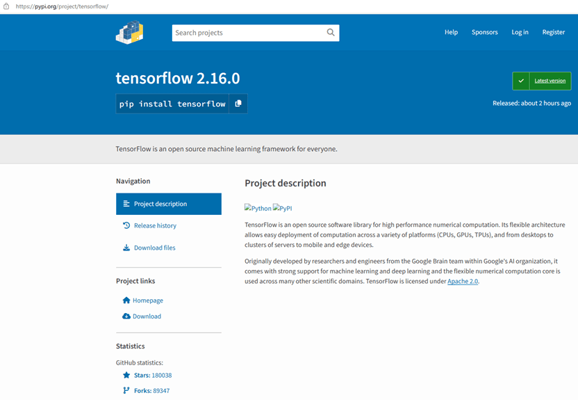
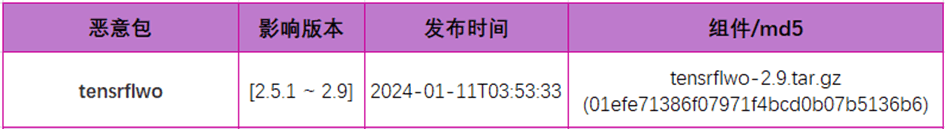
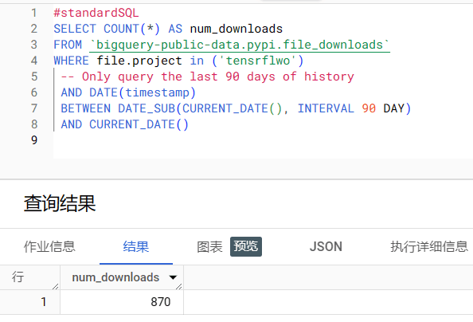
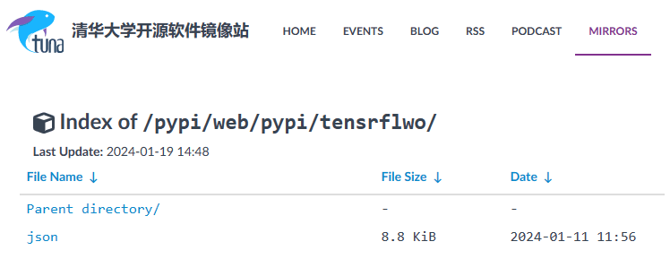
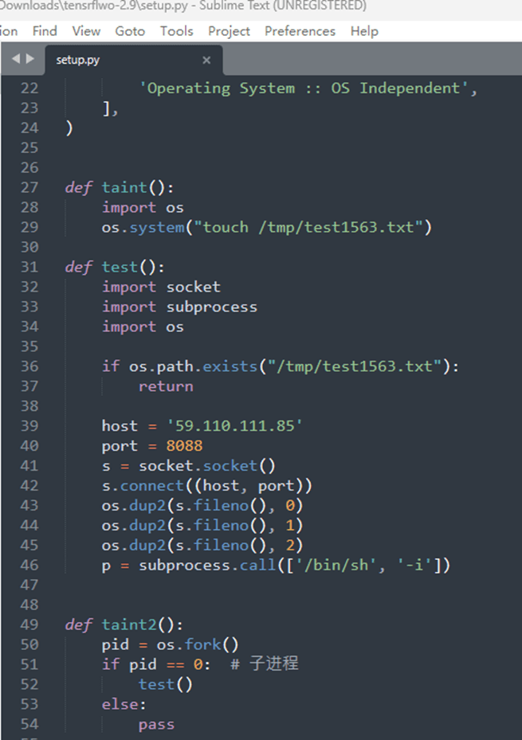
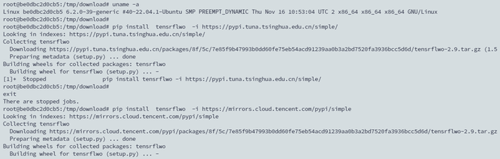
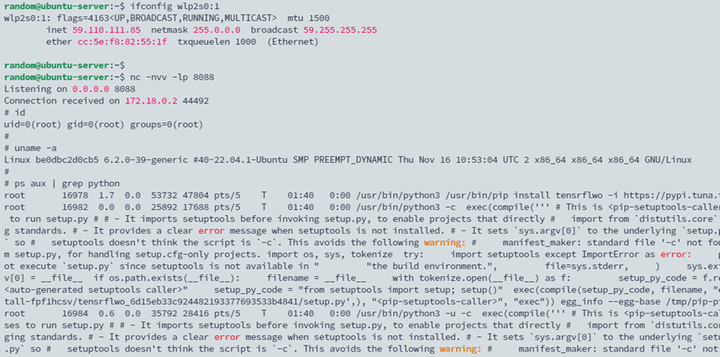
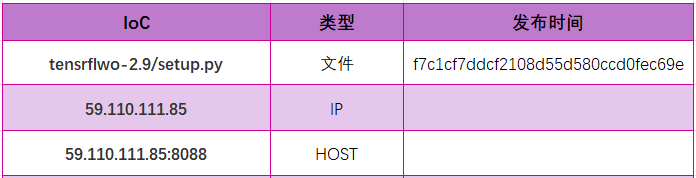
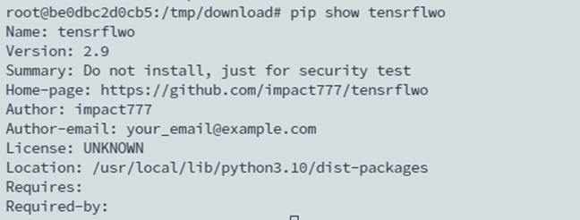

# 供应链投毒预警 | 恶意 Py 包仿冒 tensorflow AI 框架实施后门投毒攻击 - 先知社区

供应链投毒预警 | 恶意 Py 包仿冒 tensorflow AI 框架实施后门投毒攻击

- - -

### 概述

2024 年 01 月 15 号，悬镜供应链安全实验室在 Pypi 官方仓库（[https://pypi.org/](https://pypi.org/) ）中捕获 1 起 Py 包投毒事件，投毒者利用包名错误拼写 (typo-squatting) 的攻击方式来仿冒谷歌开源的 tensorflow 机器/深度学习框架，投毒攻击目标锁定 AI 开发者。  
[](https://ucc.alicdn.com/pic/developer-ecology/xzpskzbwya5ck_d728c80af05d4825a118be06b4a80e7a.png)  
截至目前，投毒者在 Pypi 仓库共发布 5 个不同版本的恶意包。python 开发者一旦通过 pip 命令下载或安装该投毒包（tensrflwo），则会触发执行 Py 组件包中的恶意后门代码，并最终导致开发者系统被攻击者远程控制。  
[](https://ucc.alicdn.com/pic/developer-ecology/xzpskzbwya5ck_9a16f40be5f849589a6e7127b73b2528.png)  
恶意 Py 包 tensrflwo 在 Pypi 官方仓库上的总下载量为 870 次。  
[](https://ucc.alicdn.com/pic/developer-ecology/xzpskzbwya5ck_42502193e499425b8c8e924d5102fe60.png)  
该恶意 Py 包已从 Pypi 官方仓库下架，但通过国内主流 Pypi 镜像源 (清华大学、腾讯云等) 依旧可正常下载、安装该恶意包，因此潜在的受害者数量将会更多，尤其对于国内广大使用 tensorflow 深度学习框架的 AI 开发者来说，仍存在被恶意投毒攻击的风险。  
[](https://ucc.alicdn.com/pic/developer-ecology/xzpskzbwya5ck_cba2ff1d8bf34071a7445538ba0203be.png)

### 投毒分析

#### 攻击流程

Py 投毒包 tensrflwo 尝试利用包名错误拼写 (typo-squatting) 来攻击使用 tensorflow 框架的 AI 开发者。tensrflwo 安装包 setup.py 中定义的 taint2() 函数通过创建子进程将受害者系统 shell 反连到投毒者控制的服务器上 (59.110.111.85:8088)，最终投毒者能够通过反弹的 shell 实现对受害者系统进行远程控制。  
[](https://ucc.alicdn.com/pic/developer-ecology/xzpskzbwya5ck_576d16fe89f442209ace9b9e273ec9f7.png)  
一旦开发者通过命令 pip download tensrflwo 下载 py 包或者 pip install tensrflwo 安装 py 包时，投毒包 tensrflwo 中的恶意函数 tain2() 会立即被调用执行，开发者系统将被投毒者远程控制。

#### 攻击复现

以清华大学和腾讯云 pypi 镜像源为例，通过以下 pip 命令模拟开发者安装恶意包 tensrflwo。

```plain
​pip install tensrflwo -i  https:​//pypi.tuna.tsinghua.edu.cn/simple/​
```

```plain
​pip install tensrflwo -i https://mirrors.cloud.tencent.com/pypi/simple​
```

[](https://ucc.alicdn.com/pic/developer-ecology/xzpskzbwya5ck_e9eefc384e55484e9ce0f0b88422b9cc.png)  
同样，在本地环境中模拟投毒攻击者的服务器 IP (59.110.111.85)，并监听 TCP 8088 端口，当受害者执行 pip install tensrflwo 操作时，攻击者可获取受害者系统 shell 权限，并可对目标系统进行远程控制。  
[](https://ucc.alicdn.com/pic/developer-ecology/xzpskzbwya5ck_082eddc825a342f0920e62215191992f.png)

#### IoC 数据

此次投毒组件包涉及的恶意文件和恶意链接 IoC 数据如下所示：  
[](https://ucc.alicdn.com/pic/developer-ecology/xzpskzbwya5ck_586adf5c973543e8a093bd822417290d.png)

### 排查方式

截至目前，该 Python 恶意组件包可正常从国内主流 Pypi 镜像源下载安装，国内 Python 开发者仍面临被投毒攻击的安全风险，开发者需提高安全防护意识，可自行根据 IoC 和恶意包信息通过以下方式进行快速排查是否安装或引用恶意组件包。开发者可通过命令 pip show tensrflwo 快速排查是否误安装或引用该恶意 py 组件包，若命令运行结果如下图所示，则代表系统已被安装该恶意组件，请尽快通过命令 pip uninstall tensrflwo -y 进行卸载，此外还需关闭系统网络并排查系统是否存在异常进程。  
[](https://ucc.alicdn.com/pic/developer-ecology/xzpskzbwya5ck_b4515526830043538933a9adf1487cdf.png)  
此外，开发者也可使用 OpenSCA-cli，将受影响的组件包按如下示例保存为 db.json 文件（可参考总结中提到的组件包信息按格式增减），直接执行扫描命令（opensca-cli -db db.json -path ${project\_path}），即可快速获知您的项目是否受到投毒包影响。

```plain
[
  {
    "product": "tensrflwo",
    "version": "[2.5.1,2.5.1]|[2.7,2.7]|[2.7.1,2.7.1]|[2.8,2.8]|[2.9,2.9]",
    "language": "python",
    "id": " XMIRROR-MAL45-777DD586",
    "description": "恶意 Python 组件包投毒，仿冒 tensorflow AI 框架。",
    "release_date": "2024-01-15"
  }
]
```

悬镜供应链安全情报中心将持续监测全网主流开源软件仓库，对潜在风险的开源组件包进行动态跟踪和溯源，实现快速捕获开源组件投毒攻击事件并第一时间提供精准安全预警。
