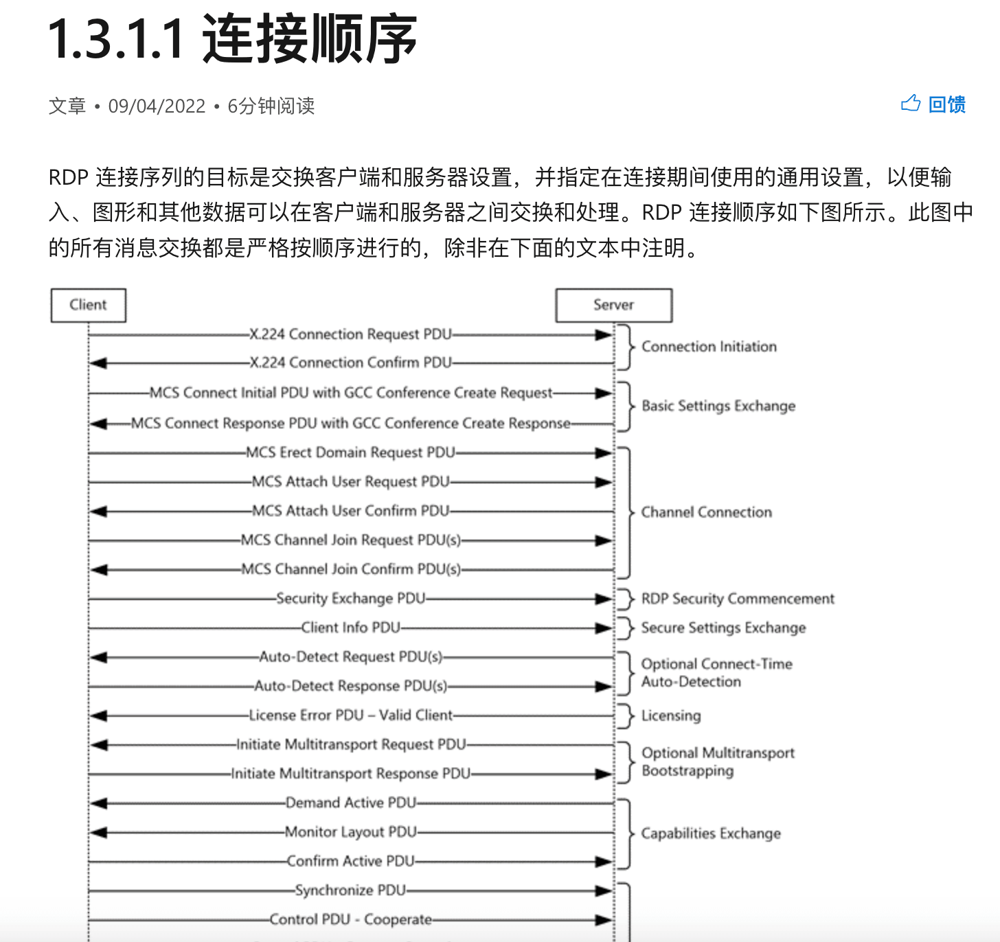
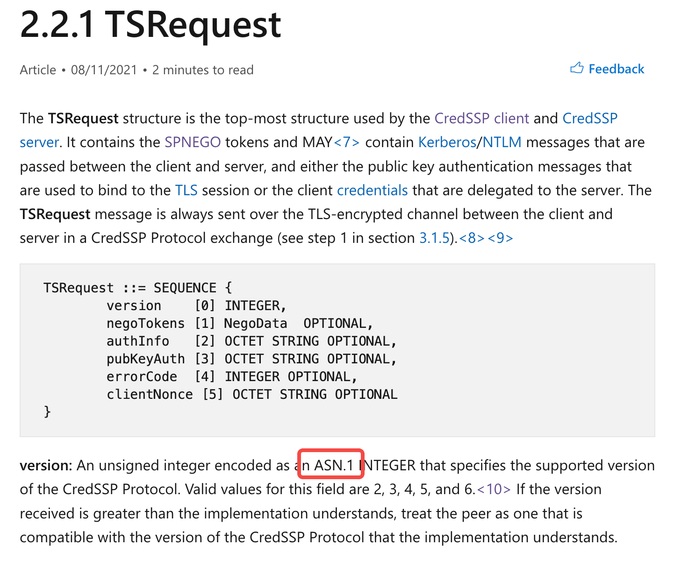

# 像 fofa 一样解析 RDP 信息，RDP 提取操作系统，RDP 登录截屏（Golang 实现） - 先知社区

像 fofa 一样解析 RDP 信息，RDP 提取操作系统，RDP 登录截屏（Golang 实现）

- - -

从 fofa 中搜索 RDP，会看到它会解析出 RDP 的信息。

[](https://images.hacking8.com/2022/12/20/g7R6G_image_yMMSfwvlC9.png)

本文探索如何自己实现一个。

## Nmap 指纹

在[https://raw.githubusercontent.com/nmap/nmap/master/nmap-service-probes](https://raw.githubusercontent.com/nmap/nmap/master/nmap-service-probes "https://raw.githubusercontent.com/nmap/nmap/master/nmap-service-probes") 可以找到关于 RDP 发包的定义

```plain
##############################NEXT PROBE##############################
# This is an RDP connection request with the MSTS cookie set. Some RDP
# listeners (with NLA?) only respond to this one.
# This must be sent before TLSSessionReq because Windows RDP will handshake TLS
# immediately and we don't have a way of identifying RDP at that point.
Probe TCP TerminalServerCookie q|\x03\0\0*%\xe0\0\0\0\0\0Cookie: mstshash=nmap\r\n\x01\0\x08\0\x03\0\0\0|
rarity 7
ports 3388,3389
fallback TerminalServer


Probe TCP TerminalServer q|\x03\0\0\x0b\x06\xe0\0\0\0\0\0|
rarity 6
ports 515,1028,1068,1503,1720,1935,2040,3388,3389

# Windows 2000 Server
# Windows 2000 Advanced Server
# Windows XP Professional
match ms-wbt-server m|^\x03\0\0\x0b\x06\xd0\0\0\x12.\0$|s p/Microsoft Terminal Service/ o/Windows/ cpe:/o:microsoft:windows/a
match ms-wbt-server m|^\x03\0\0\x17\x08\x02\0\0Z~\0\x0b\x05\x05@\x06\0\x08\x91J\0\x02X$| p/Microsoft Terminal Service/ i/Used with Netmeeting, Remote Desktop, Remote Assistance/ o/Windows/ cpe:/o:microsoft:windows/a
match ms-wbt-server m|^\x03\0\0\x11\x08\x02..}\x08\x03\0\0\xdf\x14\x01\x01$|s p/Microsoft NetMeeting Remote Desktop Service/ o/Windows/ cpe:/a:microsoft:netmeeting/ cpe:/o:microsoft:windows/a
match ms-wbt-server m|^\x03\0\0\x0b\x06\xd0\0\0\x03.\0$|s p/Microsoft NetMeeting Remote Desktop Service/ o/Windows/ cpe:/a:microsoft:netmeeting/ cpe:/o:microsoft:windows/a

# Need more samples!
match ms-wbt-server m|^\x03\0\0\x0b\x06\xd0\0\0\0\0\0| p/xrdp/ cpe:/a:jay_sorg:xrdp/
match ms-wbt-server m|^\x03\0\0\x0e\t\xd0\0\0\0[\x02\xa1]\0\xc0\x01\n$| p/IBM Sametime Meeting Services/ o/Windows/ cpe:/a:ibm:sametime/ cpe:/o:microsoft:windows/a

match ms-wbt-server m|^\x03\0\0\x0b\x06\xd0\0\x004\x12\0| p/VirtualBox VM Remote Desktop Service/ o/Windows/ cpe:/a:oracle:vm_virtualbox/ cpe:/o:microsoft:windows/a

match ms-wbt-server-proxy m|^nmproxy: Procotol byte is not 8\n$| p/nmproxy NetMeeting proxy/
```

它在 tcp 连接上之后会发包 `\x03\0\0*%\xe0\0\0\0\0\0Cookie: mstshash=nmap\r\n\x01\0\x08\0\x03\0\0\0`，nmap 关于 rdp 的版本指纹比较少，而且发的包还有特征。

nmap 有一个`rdp.lua`，封装了 rdp 连接的前几层协议，后面深入学习协议时可以对照着看。

## 深入协议

官方文档：[https://learn.microsoft.com/en-us/openspecs/windows\\\_protocols/ms-rdpbcgr/023f1e69-cfe8-4ee6-9ee0-7e759fb4e4ee](https://learn.microsoft.com/en-us/openspecs/windows_protocols/ms-rdpbcgr/023f1e69-cfe8-4ee6-9ee0-7e759fb4e4ee "https://learn.microsoft.com/en-us/openspecs/windows_protocols/ms-rdpbcgr/023f1e69-cfe8-4ee6-9ee0-7e759fb4e4ee") 有协议的交互流程图

[](https://images.hacking8.com/2022/12/20/nTABC_image_Q4Os-CdC91.png)

### 发包

看了文档后，发现连接顺序分为十个不同的阶段，但是获得一些基础信息，只用看第一阶段`Connection Initiation`就行了。

> Connection Initiation：客户端通过向服务器发送 X.224 连接请求 PDU（第[2.2.1.1](https://learn.microsoft.com/en-us/openspecs/windows_protocols/ms-rdpbcgr/18a27ef9-6f9a-4501-b000-94b1fe3c2c10 "2.2.1.1")节）来启动连接。服务器响应 0 类 X.224 连接确认 PDU（第[2.2.1.2](https://learn.microsoft.com/en-us/openspecs/windows_protocols/ms-rdpbcgr/13757f8f-66db-4273-9d2c-385c33b1e483 "2.2.1.2")节）。
> 
> 从这一点开始，客户端和服务器之间发送的所有后续数据都包装在 X.224 数据[协议数据单元 (PDU)](https://learn.microsoft.com/en-us/openspecs/windows_protocols/ms-rdpbcgr/ab35aee7-1cf7-42dc-ac74-d0d7f4ca64f7#gt_34715e6f-1612-4b2d-a4bb-3305c56e96f5 "协议数据单元 (PDU)") (1) 中。

请求结构

[](https://images.hacking8.com/2022/12/20/SIY7q_image_fCA-Jcerdy.png)

结构体如下：

**tpktHeader（4 字节）：** TPKT 标头，如[\[T123\]](https://go.microsoft.com/fwlink/?LinkId=90541 "\[T123]") 第 8 节中所指定。

[](https://images.hacking8.com/2022/12/20/T9mZA_image_MoStd9SoAv.png)

nmap 中的定义

```plain
__tostring = function(self)
  return string.pack(">BBI2",
    self.version,  //  一般是 3 
    self.reserved or 0, // 一般是 0
    (self.data and #self.data + 4 or 4)) // 整个结构体的大小，包括后面的数据
  ..self.data  // 后面的数据
```

**x224Crq（7 字节）：** 一个 X.224 类 0 连接请求传输协议数据单元 (TPDU)，如[\[X224\]](https://go.microsoft.com/fwlink/?LinkId=90588 "\[X224]") 第 13.3 节中所指定。

[](https://images.hacking8.com/2022/12/20/RMxXY_image_KufNa8gHSl.png)

[](https://images.hacking8.com/2022/12/20/Zx5t0_image_G_DSNHZdcI.png)

-   第一个是后面结构体长度，第二个是 hex(int('11100000',2)),即 0xe0 ,后面 5 个字节都是 0，这个数据结构即 length+0xe0,0x0,0x0,0x0,0x0,0x0

**routingToken（可变）：一个可选的可变长度路由令牌（用于负载平衡），由 0x0D0A 两字节序列终止。有关路由令牌格式的详细信息，请参阅**[**\[MSFT-SDLBTS\]**](https://go.microsoft.com/fwlink/?LinkId=90204 "\[MSFT-SDLBTS]")\*\* “路由令牌格式”。路由令牌和 CR+LF 序列的长度包含在**X.224 连接请求长度指示符 字段中。如果此字段存在，则**cookie\*\*字段不得存在。

**cookie（变量）：可选且长度可变的**[**ANSI**](https://learn.microsoft.com/en-us/openspecs/windows_protocols/ms-rdpbcgr/ab35aee7-1cf7-42dc-ac74-d0d7f4ca64f7#gt_372d5ad1-677d-4f38-ad65-a5849f11215f "ANSI")\*\* 字符串，以 0x0D0A 两字节序列结尾。此文本字符串必须是“Cookie：mstshash=IDENTIFIER”，其中 IDENTIFIER 是一个 ANSI 字符串（示例 cookie 字符串显示在第\*\*​[**4.1.1**](https://learn.microsoft.com/en-us/openspecs/windows_protocols/ms-rdpbcgr/e78db616-689f-4b8a-8a99-525f7a433ee2 "4.1.1")**节中）。整个 cookie 字符串和 CR+LF 序列的长度包含在**X.224 连接请求长度指示符字段中。如果**routingToken**字段存在，则该字段不得存在。

**rdpNegReq（8 字节）：一个可选的**RDP 协商请求（第[2.2.1.1.1](https://learn.microsoft.com/en-us/openspecs/windows_protocols/ms-rdpbcgr/902b090b-9cb3-4efc-92bf-ee13373371e3 "2.2.1.1.1")节）结构。该字段的长度包含在**X.224 连接请求长度指示符**字段中。

[](https://images.hacking8.com/2022/12/20/D7FG4_image_aqfBizPkI6.png)

-   文档描述很详细了，这个结构体很重要，用于设置请求协议

[](https://images.hacking8.com/2022/12/20/ZYBAV_image_3liYy58Ftz.png)

**rdpCorrelationInfo（36 字节）：一个可选的**关联信息（第[2.2.1.1.2](https://learn.microsoft.com/en-us/openspecs/windows_protocols/ms-rdpbcgr/f047e45b-fbb8-4014-8f20-ce80149586d7 "2.2.1.1.2")节）结构。该字段的长度包含在**X.224 连接请求长度指示符**字段中。如果在 RDP 协商请求结构的**标志**字段中设置了 CORRELATION\_INFO\_PRESENT (0x08) 标志，则该字段必须存在，封装在可选的**rdpNegReq** 字段中。如果未设置 CORRELATION\_INFO\_PRESENT (0x08) 标志，则该字段不得存在。

-   这个结构体没啥用，不用写

用 golang 实现这个结构体

```plain
type RdpReq struct {
  requestedProtocols uint32
  cookie             []byte
}

func NewReq(protocol uint32, cookie []byte) *RdpReq {
  return &RdpReq{requestedProtocols: protocol, cookie: cookie}
}
func (r *RdpReq) Serialize() []byte {
  buff := &bytes.Buffer{}
  // cookie
  if r.cookie != nil {
    cookie := []byte(fmt.Sprintf("Cookie: mstshash=%s\r\n", r.cookie))
    buff.Write(cookie)
  }
  // rdpNegReq
  buff.Write([]byte{0x1, 0x0, 0x8, 0x0})
  requestedProtocolData := make([]byte, 4)
  binary.LittleEndian.PutUint32(requestedProtocolData, r.requestedProtocols)
  buff.Write(requestedProtocolData)

  buff2 := &bytes.Buffer{}
  // x224Crq (7 字节)
  buff2.Write([]byte{
    uint8(buff.Len() + 6),
    0xe0,
    0x00, 0x00,
    0x00, 0x00, 0x00,
  })
  buff2.Write(buff.Bytes())

  // tpktHeader（4 字节）
  buff3 := &bytes.Buffer{}
  buff3.Write([]byte{3, 0})
  lengthData := make([]byte, 2)
  binary.BigEndian.PutUint16(lengthData, uint16(buff2.Len()+4))
  buff3.Write(lengthData)
  buff3.Write(buff2.Bytes())
  return buff3.Bytes()
}
```

测试

```plain
func main() {
  rdp := NewReq(PROTOCOL_RDP|PROTOCOL_SSL|PROTOCOL_HYBRID, []byte("w8ay"))
  buff := rdp.Serialize()
  fmt.Println(hex.Dump(buff))
}
```

输出

[](https://images.hacking8.com/2022/12/20/DrA9i_image_RoG_3JeSJE.png)

和 nmap 的 probe`\x03\0\0*%\xe0\0\0\0\0\0Cookie: mstshash=nmap\r\n\x01\0\x08\0\x03\0\0\0`也能对应上

### 收包

在发包完毕后，会收到如下结构体

[](https://images.hacking8.com/2022/12/20/y0lfq_image_dYhAoHMmQ3.png)

前面的结构可以跳过，直接看`rdpNegData`结构

文档： [https://learn.microsoft.com/en-us/openspecs/windows\\\_protocols/ms-rdpbcgr/b2975bdc-6d56-49ee-9c57-f2ff3a0b6817](https://learn.microsoft.com/en-us/openspecs/windows_protocols/ms-rdpbcgr/b2975bdc-6d56-49ee-9c57-f2ff3a0b6817 "https://learn.microsoft.com/en-us/openspecs/windows_protocols/ms-rdpbcgr/b2975bdc-6d56-49ee-9c57-f2ff3a0b6817")

成功的话，它会返回一个服务器指定的通信协议。

[](https://images.hacking8.com/2022/12/20/QJIcC_image_XMLFo1Tz9l.png)

根据结构用 golang 写个解析程序

```plain
type RdpResp struct {
  data   []byte
  Type   int
  Flags  int
  Result uint32
}

func ParseRdpResp(data []byte) (*RdpResp, error) {
  GenericRDPSignature := []byte{
    0x03, 0x00, 0x00, 0x13, 0x0e, 0xd0, 0x00, 0x00, 0x12, 0x34, 0x00,
  }
  if !checkSignature(data[:11], GenericRDPSignature) {
    return nil, errors.New("not rdp response")
  }
  reader := bytes.NewReader(data)
  reader.Seek(11, io.SeekStart)
  r := new(RdpResp)
  r.data = data
  _type, err := reader.ReadByte()
  if err != nil {
    return r, err
  }
  r.Type = int(_type)
  _flag, err := reader.ReadByte()
  if err != nil {
    return r, err
  }
  r.Flags = int(_flag)
  reader.Seek(2, io.SeekCurrent)
  result := make([]byte, 4)
  _, err = reader.Read(result)
  if err != nil {
    return r, err
  }
  r.Result = binary.LittleEndian.Uint32(result)
  return r, nil
}
```

## 简单 OS 识别

第一层连接协议中，我们可以控制请求的协议，并从返回包中解析出`服务器选择的协议`以及`flags`参数。

协议的支持在 windows 不同版本是不一样的，根据这个，将协议设定为`PROTOCOL_RDP|PROTOCOL_SSL|PROTOCOL_HYBRID_EX`，即可根据返回包结果来识别不同 OS。

```plain
func (r *RdpResp) FingerPrintOs() string {
  Windows2000 := []byte{
    0x03, 0x00, 0x00, 0x0b, 0x06, 0xd0, 0x00, 0x00, 0x12, 0x34, 0x00,
  }

  WindowsServer2012R2 := []byte{
    0x03, 0x00, 0x00, 0x13, 0x0e, 0xd0, 0x00, 0x00, 0x12, 0x34, 0x00,
    0x03, 0x00, 0x08, 0x00, 0x02, 0x00, 0x00, 0x00,
  }

  WindowsServer2008 := []byte{
    0x03, 0x00, 0x00, 0x13, 0x0e, 0xd0, 0x00, 0x00, 0x12, 0x34, 0x00, 0x02,
    0x00, 0x08, 0x00, 0x02, 0x00, 0x00, 0x00,
  }

  Windows7OrServer2008R2 := []byte{
    0x03, 0x00, 0x00, 0x13, 0x0e, 0xd0, 0x00, 0x00, 0x12, 0x34, 0x00, 0x02,
    0x09, 0x08, 0x00, 0x02, 0x00, 0x00, 0x00,
  }

  WindowsServer2008R2DC := []byte{
    0x03, 0x00, 0x00, 0x13, 0x0e, 0xd0, 0x00, 0x00, 0x12, 0x34, 0x00, 0x02,
    0x01, 0x08, 0x00, 0x02, 0x00, 0x00, 0x00,
  }

  Windows10 := []byte{
    0x03, 0x00, 0x00, 0x13, 0x0e, 0xd0, 0x00, 0x00, 0x12, 0x34, 0x00, 0x02,
    0x1f, 0x08, 0x00, 0x02, 0x00, 0x00, 0x00,
  }

  WindowsServer2012Or8 := []byte{
    0x03, 0x00, 0x00, 0x13, 0x0e, 0xd0, 0x00, 0x00, 0x12, 0x34, 0x00, 0x02,
    0x0f, 0x08, 0x00, 0x02, 0x00, 0x00, 0x00,
  }

  WindowsServer2016or2019 := []byte{
    0x03, 0x00, 0x00, 0x13, 0x0e, 0xd0, 0x00, 0x00, 0x12, 0x34, 0x00, 0x02,
    0x0f, 0x08, 0x00, 0x08, 0x00, 0x00, 0x00,
  }

  signatures := map[string][]byte{
    "Windows 2000":                Windows2000,
    "WindowsServer2012R2":         WindowsServer2012R2,
    "Windows Server 2008":         WindowsServer2008,
    "Windows 7 or Server 2008 R2": Windows7OrServer2008R2,
    "Windows Server 2008 R2 DC":   WindowsServer2008R2DC,
    "Windows 10":                  Windows10,
    "Windows 8 or Server 2012":    WindowsServer2012Or8,
    "Windows Server 2016 or 2019": WindowsServer2016or2019,
  }

  for fingerprint, signature := range signatures {
    signatureLength := len(signature)

    if len(r.data) < signatureLength {
      continue
    }

    responseSlice := r.data[:signatureLength]
    tof := checkSignature(responseSlice, signature)
    if tof {
      return fingerprint
    }
  }
  return ""
}
```

简单识别通过包对比进行识别，有时能识别 fofa 所识别不了的地方。如

[](https://images.hacking8.com/2022/12/20/Etymx_image_NIofGHQQY-.png)

[](https://images.hacking8.com/2022/12/20/it8DF_image__4IndlIAsR.png)

## 协议枚举

可以看 nmap rdp 加密协议枚举的脚本 [https://github.com/nmap/nmap/blob/master/scripts/rdp-enum-encryption.nse](https://github.com/nmap/nmap/blob/master/scripts/rdp-enum-encryption.nse "https://github.com/nmap/nmap/blob/master/scripts/rdp-enum-encryption.nse")

```plain
-- @output
-- PORT     STATE SERVICE
-- 3389/tcp open  ms-wbt-server
-- |   Security layer
-- |     CredSSP (NLA): SUCCESS
-- |     CredSSP with Early User Auth: SUCCESS
-- |     Native RDP: SUCCESS
-- |     RDSTLS: SUCCESS
-- |     SSL: SUCCESS
-- |   RDP Encryption level: High
-- |     40-bit RC4: SUCCESS
-- |     56-bit RC4: SUCCESS
-- |     128-bit RC4: SUCCESS
-- |     FIPS 140-1: SUCCESS
-- |_  RDP Protocol Version:  RDP 5.x, 6.x, 7.x, or 8.x server
```

它实现获取 Security layer，是遍历发送协议，如果返回包支持则支持。这个可以很容易实现。

在之前封装的返回包结构中加上获取支持协议的文本

```plain
func (r *RdpResp) SupportProtocol() string {
  if r.Type == TYPE_RDP_NEG_FAILURE {
    return ""
  }
  switch r.Result {
  case PROTOCOL_HYBRID_EX:
    return "PROTOCOL_HYBRID_EX"
  case PROTOCOL_RDSAAD:
    return "PROTOCOL_RDSAAD"
  case PROTOCOL_HYBRID:
    return "PROTOCOL_HYBRID"
  case PROTOCOL_SSL:
    return "PROTOCOL_SSL"
  case PROTOCOL_RDP:
    return "PROTOCOL_RDP"
  case PROTOCOL_RDSTLS:
    return "PROTOCOL_RDSTLS"
  }
  return ""
}
```

封装协议枚举函数

```plain
// 获取 RDP 支持的协议
func GetSupportProtocol(address string, port uint16, timeout time.Duration) []string {
  ret := make([]string, 0)
  for _, v := range []uint32{PROTOCOL_RDP, PROTOCOL_SSL, PROTOCOL_HYBRID, PROTOCOL_HYBRID_EX, PROTOCOL_RDSTLS, PROTOCOL_RDSAAD} {
    conn, err := DialTCP(address, port, timeout)
    if err != nil {
      panic(err)
    }
    rdp := NewReq(v, []byte("w8ay"))
    buff := rdp.Serialize()
    err = Send(conn, buff, timeout)
    if err != nil {
      continue
    }
    response, err := Recv(conn, timeout)
    if err != nil {
      continue
    }
    resp, _ := ParseRdpResp(response)
    if resp != nil {
      if resp.Type == TYPE_RDP_NEG_RSP {
        ret = append(ret, resp.SupportProtocol())
      }
    }
    time.Sleep(time.Millisecond * 100)
  }
  return ret
}
```

[](https://images.hacking8.com/2022/12/20/bGnUK_image_1tL5fcjJzq.png)

不清楚 fofa 的 flag 是怎么实现的，相同的 IP 使用这种方式能识别出的协议更多。

[](https://images.hacking8.com/2022/12/20/liY4g_image_LRYaXnSNWq.png)

RDP Protocol Version 的获取要实现 MCS 结构，太麻烦不做了，资料在

[https://learn.microsoft.com/en-us/openspecs/windows\\\_protocols/ms-rdpbcgr/379a020e-9925-4b4f-98f3-7d634e10b411](https://learn.microsoft.com/en-us/openspecs/windows_protocols/ms-rdpbcgr/379a020e-9925-4b4f-98f3-7d634e10b411 "https://learn.microsoft.com/en-us/openspecs/windows_protocols/ms-rdpbcgr/379a020e-9925-4b4f-98f3-7d634e10b411")

## NTLM 信息获取

> 大佬说：**tls 连接后会进行 ntlmssp 的挑战响应，能够非常准确的提取出来主机名和操作系统的版本**

RDP 文档中写道，为了安全考虑，可以直接走 TLS 协议并使用 CredSSP 进行验证。CredSSP 可以使用 ntlm 验证进行信息获取。

nmap 有一个脚本用于提取 ntlm 信息 [https://github.com/nmap/nmap/blob/master/scripts/rdp-ntlm-info.nse](https://github.com/nmap/nmap/blob/master/scripts/rdp-ntlm-info.nse "https://github.com/nmap/nmap/blob/master/scripts/rdp-ntlm-info.nse")

```plain
-- @output
-- 3389/tcp open     ms-wbt-server syn-ack ttl 128 Microsoft Terminal Services
-- | rdp-ntlm-info:
-- |   Target_Name: W2016
-- |   NetBIOS_Domain_Name: W2016
-- |   NetBIOS_Computer_Name: W16GA-SRV01
-- |   DNS_Domain_Name: W2016.lab
-- |   DNS_Computer_Name: W16GA-SRV01.W2016.lab
-- |   DNS_Tree_Name: W2016.lab
-- |   Product_Version: 10.0.14393
-- |_  System_Time: 2019-06-13T10:38:35+00:00
-
```

文档：[https://learn.microsoft.com/en-us/openspecs/windows\\\_protocols/ms-cssp/6aac4dea-08ef-47a6-8747-22ea7f6d8685?source=recommendations](https://learn.microsoft.com/en-us/openspecs/windows_protocols/ms-cssp/6aac4dea-08ef-47a6-8747-22ea7f6d8685?source=recommendations "https://learn.microsoft.com/en-us/openspecs/windows_protocols/ms-cssp/6aac4dea-08ef-47a6-8747-22ea7f6d8685?source=recommendations")

请求体，negoToken 字段是 ntlm 的结构，整个结构体要进行 ASN.1 编码。

[](https://images.hacking8.com/2022/12/20/wcdrl_image_YIMFW-XIdd.png)

嫌麻烦可以直接用 nmap 组好的数据包

[](https://images.hacking8.com/2022/12/20/JmXEK_image_81gD-Bzpfr.png)

它的返回信息见文档

[https://learn.microsoft.com/en-us/openspecs/windows\\\_protocols/ms-nlmp/801a4681-8809-4be9-ab0d-61dcfe762786](https://learn.microsoft.com/en-us/openspecs/windows_protocols/ms-nlmp/801a4681-8809-4be9-ab0d-61dcfe762786 "https://learn.microsoft.com/en-us/openspecs/windows_protocols/ms-nlmp/801a4681-8809-4be9-ab0d-61dcfe762786")

[](https://images.hacking8.com/2022/12/20/wfiKV_image_roKITZ0WRk.png)

里面值得关注的数据有 OSVersion，TargetName 以及以下的结构

```plain
AvIDMap := map[uint16]string{
    1: "NetBIOSComputerName",
    2: "NetBIOSDomainName",
    3: "FQDN", // DNS Computer Name
    4: "DNSDomainName",
    5: "DNSTreeName",
    7: "Timestamp",
    9: "MsvAvTargetName",
  }
```

编写程序解析后就能获得想要的信息了。

[](https://images.hacking8.com/2022/12/20/6bON8_image_3u-hOolMiz.png)

获得的操作系统版本信息是基于\`*Major-Minor-Build*\`的版本号，找到一个比较全的列表

[https://www.gaijin.at/en/infos/windows-version-numbers](https://www.gaijin.at/en/infos/windows-version-numbers "https://www.gaijin.at/en/infos/windows-version-numbers")

[](https://images.hacking8.com/2022/12/20/OkXU1_image_Ccg5v-lbqc.png)

写个爬虫就给爬下来了

[](https://images.hacking8.com/2022/12/20/FNRmB_image_amf-lbhcZn.png)

再次运行下，就能得到操作系统的详细信息了。输出

```plain
请求包
00000000  03 00 00 2a 25 e0 00 00  00 00 00 43 6f 6f 6b 69  |...*%......Cooki|
00000010  65 3a 20 6d 73 74 73 68  61 73 68 3d 77 38 61 79  |e: mstshash=w8ay|
00000020  0d 0a 01 00 08 00 0b 00  00 00                    |..........|

返回包
00000000  03 00 00 13 0e d0 00 00  12 34 00 02 1f 08 00 08  |.........4......|
00000010  00 00 00                                          |...|

简单 OS 识别：Windows 10 
支持协议 [PROTOCOL_RDP PROTOCOL_SSL PROTOCOL_HYBRID PROTOCOL_HYBRID_EX PROTOCOL_RDSTLS]

NTLMSSP 返回包
00000000  30 81 a8 a0 03 02 01 06  a1 81 a0 30 81 9d 30 81  |0..........0..0.|
00000010  9a a0 81 97 04 81 94 4e  54 4c 4d 53 53 50 00 02  |.......NTLMSSP..|
00000020  00 00 00 0c 00 0c 00 38  00 00 00 75 82 9a e2 5e  |.......8...u...^|
00000030  53 34 ae 68 91 2c 56 00  00 00 00 00 00 00 00 50  |S4.h.,V........P|
00000040  00 50 00 44 00 00 00 0a  00 61 4a 00 00 00 0f 53  |.P.D.....aJ....S|
00000050  00 45 00 52 00 56 00 45  00 52 00 02 00 0c 00 53  |.E.R.V.E.R.....S|
00000060  00 45 00 52 00 56 00 45  00 52 00 01 00 0c 00 53  |.E.R.V.E.R.....S|
00000070  00 45 00 52 00 56 00 45  00 52 00 04 00 0c 00 53  |.E.R.V.E.R.....S|
00000080  00 45 00 52 00 56 00 45  00 52 00 03 00 0c 00 53  |.E.R.V.E.R.....S|
00000090  00 45 00 52 00 56 00 45  00 52 00 07 00 08 00 74  |.E.R.V.E.R.....t|
000000a0  df 2b ea 65 14 d9 01 00  00 00 00                 |.+.e.......|

NetBIOSComputerName:SERVER
DNSDomainName:SERVER
FQDN:SERVER
Timestamp:2022-12-20 19:26:33
Product_Version:10.0.19041
Os_Verion:Windows 10, Version 2004/Windows Server, Version 2004
TargetName:SERVER
NetBIOSDomainName:SERVER
```

fofa 中的信息

[](https://images.hacking8.com/2022/12/20/pnFj1_image_ZzH9OIiWeI.png)

NTLM 解析代码如下

```plain
func RdpWithNTLM(conn net.Conn, timeout time.Duration) (map[string]any, error) {
  info := make(map[string]any)

  // CredSSP protocol - NTLM authentication
  // https://docs.microsoft.com/en-us/openspecs/windows_protocols/ms-cssp
  // https://docs.microsoft.com/en-us/openspecs/windows_protocols/ms-nlmp
  // http://davenport.sourceforge.net/ntlm.html

  NegotiatePacket := []byte{
    0x30, 0x37, 0xA0, 0x03, 0x02, 0x01, 0xff, 0xA1, 0x30, 0x30, 0x2E, 0x30, 0x2C, 0xA0, 0x2A, 0x04, 0x28,
    // Signature
    'N', 'T', 'L', 'M', 'S', 'S', 'P', 0x00,
    // Message Type
    0x01, 0x00, 0x00, 0x00,
    // Negotiate Flags
    0xF7, 0xBA, 0xDB, 0xE2,
    // Domain Name Fields
    0x00, 0x00, // DomainNameLen
    0x00, 0x00, // DomainNameMaxLen
    0x00, 0x00, 0x00, 0x00, // DomainNameBufferOffset
    // Workstation Fields
    0x00, 0x00, // WorkstationLen
    0x00, 0x00, // WorkstationMaxLen
    0x00, 0x00, 0x00, 0x00, // WorkstationBufferOffset
    // Version
    0x00, 0x00, 0x00, 0x00, 0x00, 0x00, 0x00, 0x00,
  }

  err := Send(conn, NegotiatePacket, timeout)
  if err != nil {
    return nil, err
  }
  response, err := Recv(conn, timeout)
  if err != nil {
    return nil, err
  }
  fmt.Println("NTLMSSP 返回包")
  fmt.Println(hex.Dump(response))

  type NTLMChallenge struct {
    Signature              [8]byte
    MessageType            uint32
    TargetNameLen          uint16
    TargetNameMaxLen       uint16
    TargetNameBufferOffset uint32
    NegotiateFlags         uint32
    ServerChallenge        uint64
    Reserved               uint64
    TargetInfoLen          uint16
    TargetInfoMaxLen       uint16
    TargetInfoBufferOffset uint32
    Version                [8]byte
    // Payload (variable)
  }
  var challengeLen = 56

  challengeStartOffset := bytes.Index(response, []byte{'N', 'T', 'L', 'M', 'S', 'S', 'P', 0})
  if challengeStartOffset == -1 {
    return info, nil
  }
  if len(response) < challengeStartOffset+challengeLen {
    return info, nil
  }
  var responseData NTLMChallenge
  response = response[challengeStartOffset:]
  responseBuf := bytes.NewBuffer(response)
  err = binary.Read(responseBuf, binary.LittleEndian, &responseData)
  if err != nil {
    return info, err
  }

  // Check if valid NTLM challenge response message structure
  if responseData.MessageType != 0x00000002 ||
    responseData.Reserved != 0 ||
    !reflect.DeepEqual(responseData.Version[4:], []byte{0, 0, 0, 0xF}) {
    return info, nil
  }

  // Parse: Version
  type version struct {
    MajorVersion byte
    MinorVersion byte
    BuildNumber  uint16
  }
  var versionData version
  versionBuf := bytes.NewBuffer(responseData.Version[:4])
  err = binary.Read(versionBuf, binary.LittleEndian, &versionData)
  if err != nil {
    return info, err
  }
  ProductVersion := fmt.Sprintf("%d.%d.%d", versionData.MajorVersion,
    versionData.MinorVersion,
    versionData.BuildNumber)
  info["Product_Version"] = ProductVersion

  v, ok := OsVersion[ProductVersion]
  if ok {
    info["Os_Verion"] = v
  }

  // Parse: TargetName
  targetNameLen := int(responseData.TargetNameLen)
  if targetNameLen > 0 {
    startIdx := int(responseData.TargetNameBufferOffset)
    endIdx := startIdx + targetNameLen
    targetName := strings.ReplaceAll(string(response[startIdx:endIdx]), "\x00", "")
    info["TargetName"] = targetName
  }

  // Parse: TargetInfo
  AvIDMap := map[uint16]string{
    1: "NetBIOSComputerName",
    2: "NetBIOSDomainName",
    3: "FQDN", // DNS Computer Name
    4: "DNSDomainName",
    5: "DNSTreeName",
    7: "Timestamp",
    9: "MsvAvTargetName",
  }

  type AVPair struct {
    AvID  uint16
    AvLen uint16
    // Value (variable)
  }
  var avPairLen = 4
  targetInfoLen := int(responseData.TargetInfoLen)
  if targetInfoLen > 0 {
    startIdx := int(responseData.TargetInfoBufferOffset)
    if startIdx+targetInfoLen > len(response) {
      return info, fmt.Errorf("Invalid TargetInfoLen value")
    }
    var avPair AVPair
    avPairBuf := bytes.NewBuffer(response[startIdx : startIdx+avPairLen])
    err = binary.Read(avPairBuf, binary.LittleEndian, &avPair)
    if err != nil {
      return info, err
    }
    currIdx := startIdx
    for avPair.AvID != 0 {
      if field, exists := AvIDMap[avPair.AvID]; exists {
        var value string
        r := response[currIdx+avPairLen : currIdx+avPairLen+int(avPair.AvLen)]
        if avPair.AvID == 7 {
          unixStamp := binary.LittleEndian.Uint64(r)/10000000 - 11644473600
          tm := time.Unix(int64(unixStamp), 0)
          value = tm.Format("2006-01-02 15:04:05")
        } else {
          value = strings.ReplaceAll(string(r), "\x00", "")
        }
        info[field] = value
      }
      currIdx += avPairLen + int(avPair.AvLen)
      if currIdx+avPairLen > startIdx+targetInfoLen {
        return info, fmt.Errorf("Invalid AV_PAIR list")
      }
      avPairBuf = bytes.NewBuffer(response[currIdx : currIdx+avPairLen])
      err = binary.Read(avPairBuf, binary.LittleEndian, &avPair)
      if err != nil {
        return info, err
      }
    }
  }

  return info, nil
}
```

## RDP 登录截图

不是所有协议都支持 RDP 截图

[](https://images.hacking8.com/2022/12/20/OUiW4_image_WVZQ-OBMgA.png)

要实现 RDP 登录交互，这个涉及更后面的交互了，所以找了个 go rdp 的库 [https://github.com/tomatome/grdp](https://github.com/tomatome/grdp "https://github.com/tomatome/grdp") （这个库有点小 bug，而且只能编译 windows 版本，不过我已经一通魔改，修了一些 bug，并且支持全平台编译）

它里面提供了一个接口，可以获得位图数据

```plain
g.pdu.On("update", func(rectangles []pdu.BitmapData) {}
```

bitmap 的数据结构可以看文档：[https://learn.microsoft.com/en-us/openspecs/windows\\\_protocols/ms-rdpbcgr/f4ed1422-2eed-4474-bafb-42ab35ad3707](https://learn.microsoft.com/en-us/openspecs/windows_protocols/ms-rdpbcgr/f4ed1422-2eed-4474-bafb-42ab35ad3707 "https://learn.microsoft.com/en-us/openspecs/windows_protocols/ms-rdpbcgr/f4ed1422-2eed-4474-bafb-42ab35ad3707")

**获得截图要做的事情也很多很杂**

-   获得的位图只是一小块图片，后需要将这些图片拼接起来
-   位图有的是压缩的，需要解压
-   涉及到将位图数据转换为图片等等

伪代码如下

```plain
ScreenImage := image.NewRGBA(image.Rect(0, 0, 1024, 768))
host := g.Host
g.pdu.On("update", func(rectangles []pdu.BitmapData) {
  glog.Info("on update bitmap:", len(rectangles))
  bs := make([]Bitmap, 0)
  for _, v := range rectangles {
    IsCompress := v.IsCompress()
    data := v.BitmapDataStream
    if IsCompress {
      data = BitmapDecompress(&v)
      IsCompress = false
    }
    b := Bitmap{int(v.DestLeft), int(v.DestTop), int(v.DestRight), int(v.DestBottom),
      int(v.Width), int(v.Height), Bpp(v.BitsPerPixel), IsCompress, data}
    bs = append(bs, b)
  }
  var (
    pixel      int
    i          int
    r, g, b, a uint8
  )

  for _, bm := range bs {
    i = 0
    pixel = bm.BitsPerPixel
    m := image.NewRGBA(image.Rect(0, 0, bm.Width, bm.Height))
    for y := 0; y < bm.Height; y++ {
      for x := 0; x < bm.Width; x++ {
        r, g, b, a = ToRGBA(pixel, i, bm.Data)
        c := color.RGBA{r, g, b, a}
        i += pixel
        m.Set(x, y, c)
      }
    }
    draw.Draw(ScreenImage, ScreenImage.Bounds().Add(image.Pt(bm.DestLeft, bm.DestTop)), m, m.Bounds().Min, draw.Src)
  }
  // Encode to jpeg.
  var imageBuf bytes.Buffer
  err = jpeg.Encode(&imageBuf, ScreenImage, nil)

  if err != nil {
    log.Panic(err)
  }

  // Write to file.
  fo, err := os.Create(fmt.Sprintf("img/%s-%d.jpg", host, index))
  index += 1
  if err != nil {
    panic(err)
  }
  fw := bufio.NewWriter(fo)
  fw.Write(imageBuf.Bytes())
})
```

这个代码会在前一帧的基础行保存图片，每一帧都会保存为一个完整的图片。

[](https://images.hacking8.com/2022/12/20/2hqRy_image_RcTA_50FbV.png)

[](https://images.hacking8.com/2022/12/20/CFAGq_190.131.242.172-3_qa63cLiGx1.jpg)

[](https://images.hacking8.com/2022/12/20/H8ITp_190.131.242.172-29_Dxu3hw88O5.jpg)

连起来就像是一个登录的 gif

[](https://images.hacking8.com/2022/12/20/tdbQU_media.io_nwXtnaRT_F5QaGi_U1C.gif)

## 参考

-   [https://github.com/praetorian-inc/fingerprintx](https://github.com/praetorian-inc/fingerprintx "https://github.com/praetorian-inc/fingerprintx")
-   [https://github.com/nmap/nmap](https://github.com/nmap/nmap "https://github.com/nmap/nmap")
-   [https://cloud.tencent.com/developer/article/1888905](https://cloud.tencent.com/developer/article/1888905 "https://cloud.tencent.com/developer/article/1888905")
-   [https://mp.weixin.qq.com/s?\\\_\\\_biz=MjM5NDQ5NjM5NQ==\\&mid=2651626127\\&idx=1\\&sn=0bdcd4969306c5f79707fa946da76b83](https://mp.weixin.qq.com/s?__biz=MjM5NDQ5NjM5NQ==\&mid=2651626127\&idx=1\&sn=0bdcd4969306c5f79707fa946da76b83 "https://mp.weixin.qq.com/s?__biz=MjM5NDQ5NjM5NQ==\&mid=2651626127\&idx=1\&sn=0bdcd4969306c5f79707fa946da76b83")
    -   网络空间测绘技术之：协议识别（RDP 篇）
