# 入侵检测之流量分析--SURICATA 应用及规则来源梳理 - 先知社区

入侵检测之流量分析--SURICATA 应用及规则来源梳理

- - -

# 一、前言

此篇是[https://xz.aliyun.com/t/13810](https://xz.aliyun.com/t/13810) 文章的续篇，在海量流量中做威胁线索挖掘一定是需要自动化框架的，SURICATA 是一个开源的网络入侵检测系统（IDS）和入侵防御系统（IPS），它可以捕获通讯流量并对其做协议解析，识别或防御通讯流量中可疑或恶意的行为。国内多数厂商基于流量的 IDS 的数据包捕获、协议解析、检测引擎等关键模块都是在此基础上做修改和扩展优化的。

我在公网建立了一个基于 SURICATA 流量分析平台，搭载 10w 量级的检测规则，其中包括商业付费规则 ET PRO，可以作为这篇文章的配套工具使用。  
[http://47.108.150.136:8080/IDS/](http://47.108.150.136:8080/IDS/)

关于规则来源我从各个渠道收录和维护着一个十二万条左右的规则库，在日常流量分析中优化和更新、新增，所以对各个开源库的性能和概况相对了解，这里主要讨论 suricata，lua 脚本暂时不讨论。

总的来说，目前国内没有维护的很好的开源规则库，在 github 或者其他渠道能够找到的中文规则库，我见过的无一列外都是大量翻译而来的（比如 github 星最多的中文库 github.com/al0ne/suricata-rules），部分库有很少量的独立编写规则，如果你用这样的库，那么规则的准确程度和后续更新都会面临极大的问题，所以建议还是使用原生的库。

国外靓仔或者社区维护的规则库都有一个通病，一整个水土不服，比如维护的最好 (没有之一) 的开源 Emerging Threats 规则库，在其 5 万余条规则中几乎没有国内厂商的 web 应用 (例如咱们天天打的各种国产 OA)、网络设备等漏洞利用检测规则，但好在操作系统、底层协议等通用领域恶意行为检测效果还是值得肯定的。

# 二、背景

对我个人而言，做病毒样本分析实际上是受流量分析的启发。因为加密通讯流量的普及，单纯的流量分析有着很大的局限性。比如在窃密事件中，受害者端木马程序对传输的窃密文件先加密在传输，流量会话中只会捕获到一连串无意义的二进制流，这时候可以获取样本的话，结合木马分析，我可以去逆向它的加密和通讯逻辑、提取到密钥及外联地址等。  
除了可以完成解密失窃内容做危害评估以外，也可能获取以下一些内容，它们都可以作为此木马的通讯特征，在其他流量中被检测。

-   外链地址（域名、IP 等）。
-   硬编码在木马样本中的字符被传输，它们可能 (无随机数参与加密) 在流量中的密文是固定的。
-   行为特征，使用的加密或编码算法使得通讯流量具有一定的长度或者 ascll 码组成特征。（以常见工具举例，冰蝎 3.\*上下行流量分别为 BASE64 和二进制乱码，冰蝎 4.x 中使用默认是 php 服务端 AES128 加密算法使得响应载荷长度是 256 整数倍)

这些通讯特征就可以被编写为检测规则，被 SURICATA 入侵检测引擎在通讯流量中被匹配。

## 三、一个示例

首先看一个应用示例，以下是一个针对 OA 服务的漏洞扫描工具，以通达 OA 为例，捕获其通讯流量，保存数据包。

[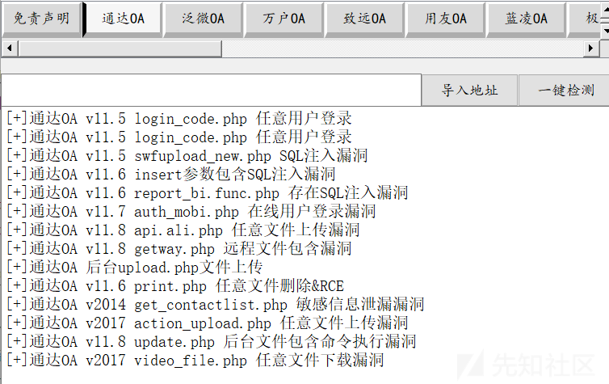](https://xzfile.aliyuncs.com/media/upload/picture/20240228161538-8e594d8e-d611-1.png)  
捕获部分通讯流量如下。

[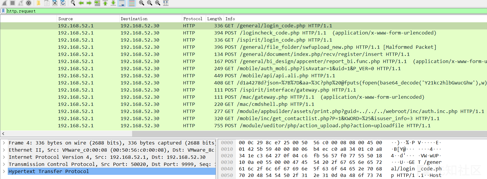](https://xzfile.aliyuncs.com/media/upload/picture/20240228161602-9c9893aa-d611-1.png)  
调用 suricata 进行分析。

[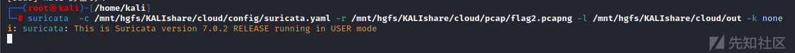](https://xzfile.aliyuncs.com/media/upload/picture/20240228161632-ae60b59a-d611-1.png)

suricata 做规则内容和配置文件自检，然后开始、结束扫描。

[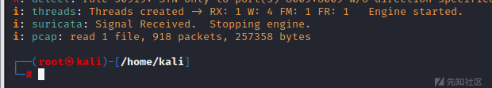](https://xzfile.aliyuncs.com/media/upload/picture/20240228161643-b52cf9a6-d611-1.png)  
查看输出的日志信息。

[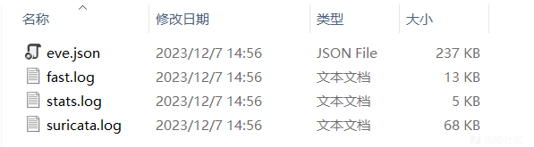](https://xzfile.aliyuncs.com/media/upload/picture/20240228161656-bcce147e-d611-1.png)  
查看 fast.log 输出的告警信息，其中通达 OA 关联的检测规则是我编写的。

[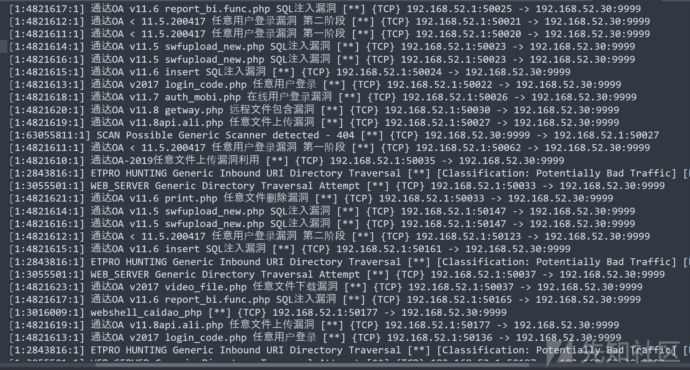](https://xzfile.aliyuncs.com/media/upload/picture/20240228161814-eafe776c-d611-1.png)

```plain
- 示例告警：
11/15/2021-10:07:02.200926  [**] [1:2026096:3] ET EXPLOIT Apache Struts getWriter and opensymphony inbound OGNL injection remote code execution attempt [**] [Classification: Attempted Administrator Privilege Gain] [Priority: 1] {TCP} 119.188.53.154:33506 -> 60.8.110.130:80
- 逐字段说明：
事件发生的时间戳：11/15/2021-10:07:02.200926

规则集 id:规则 sid:版本 id：[1:2026096:3]

规则概述：ET EXPLOIT Apache Struts getWriter and opensymphony inbound OGNL injection remote code execution attempt

告警优先级：[Priority: 1]

通讯协议类型：{TCP}

四元组信息：119.188.53.154:33506 -> 60.8.110.130:80（四元组 源 ip:源端口 流量流向 目的 ip:目的端口）
```

这样就在流量中发现了恶意的攻击行为，检测引擎对这些可以选择丢弃或告警输出，这样就成了实现了检测和防御两个方面的功能。

## 四、安装

官方文档有比较完备的介绍，不再过多赘述。我这里可以给大家提供编译好的二进制文件，安装 suricata 7.02 走官方文档的流程方法会有一些棘手的依赖问题，尤其是在 centos8+ 上，该版本用了一些很新的库 (例如 dpdk2.2)，常规的下载源中还没有收录，只有自己源码编译安装。

如果遇到难解决的问题你可以私信我，我将编译好的 SURICATA 二进制文件和其所需依赖打包给你。

[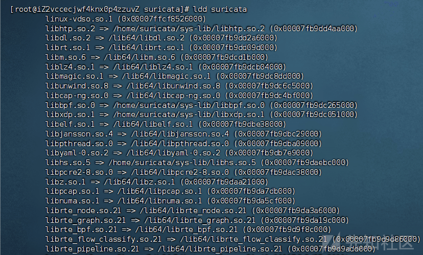](https://xzfile.aliyuncs.com/media/upload/picture/20240228162216-7baac838-d612-1.png)  
你可以在文件“/etc/ld.so.conf”中手动添加动态链接库路径，将缺失库放入路径，SURICATA 就可以执行了。

[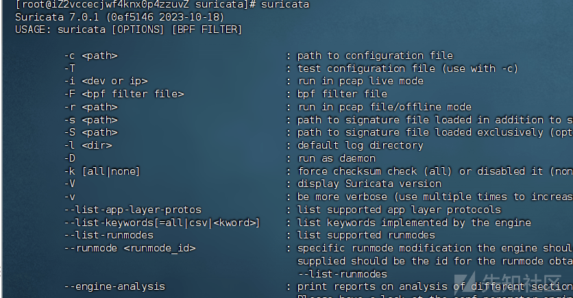](https://xzfile.aliyuncs.com/media/upload/picture/20240228162225-81066d1e-d612-1.png)

## 五、基本使用

在日常对于流量的安全研究主要是使用离线数据包分析模块，SURICATA 提供了接口加载配置文件、加载待检测数据包、输出告警信息。

```plain
suricata -c ../suricata.yaml -r ../*.pcapng -l ../output/ 
suricata.yaml 检测引擎配置文件
*.pcapng      待检测数据包
output        告警信息等输出文件
```

### 1.修改配置文件 suricata.yaml

按官方的分法，配置文件主要分为四个模块，规则文件的配置独立于于这四个模块以外。

-   模块一，定义网络信息。例如本地资产，熟知端口等，可以在检测规则中使用这些定义。

[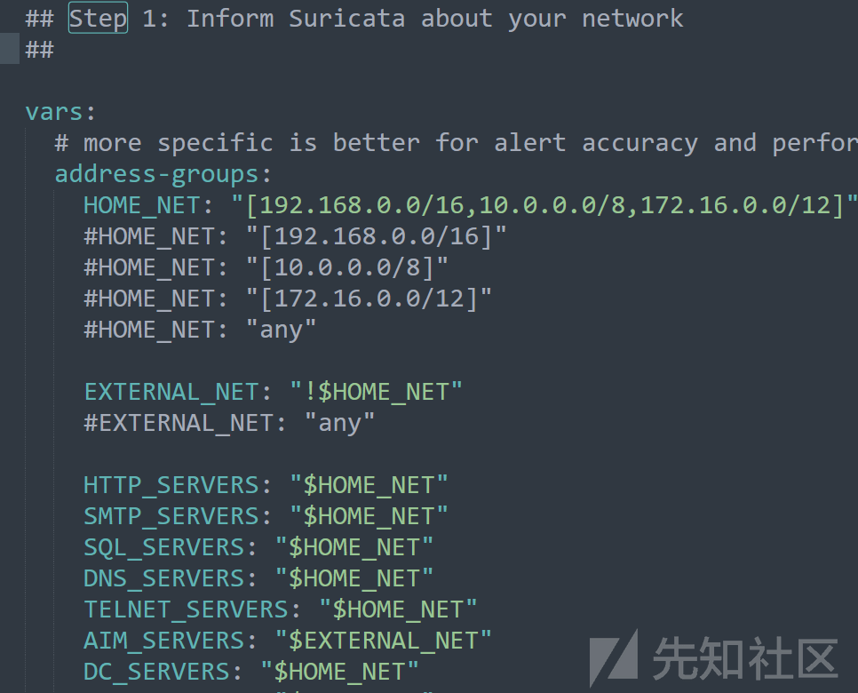](https://xzfile.aliyuncs.com/media/upload/picture/20240228162343-af3bedd0-d612-1.png)

-   模块二，选择启用哪些输出模块，用于记录 Suricata 的日志。例如轻量级告警日志“fast.log”，EVE JSON 格式的日志“eve-log”等，也可以解析和输出部分应用层协议日志，例如 http 访问日志。

[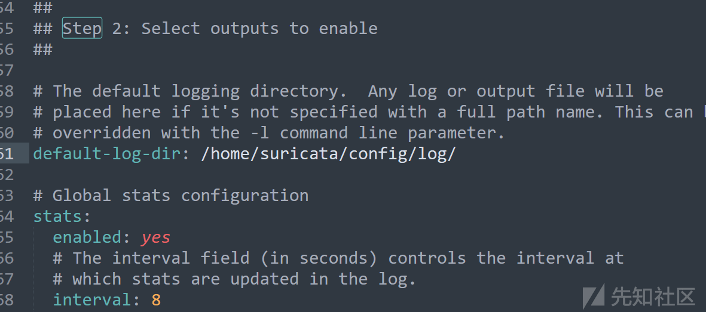](https://xzfile.aliyuncs.com/media/upload/picture/20240228162357-b7ec6a86-d612-1.png)

-   模块三，配置 Suricata 的捕获设置。指定使用的捕获引擎和捕获的网络接口，还有一些捕获策略，(做离线分析的话，这个模块用的不多，主要是研发、运维等人员用)。

[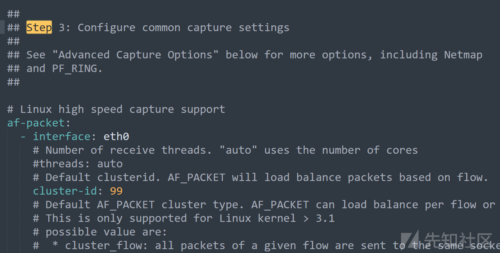](https://xzfile.aliyuncs.com/media/upload/picture/20240228162409-bf0d8c6e-d612-1.png)

-   模块四，配置应用层协议的设置，包括应用层协议的解析和检测。(用默认的基本可以满足) 。

[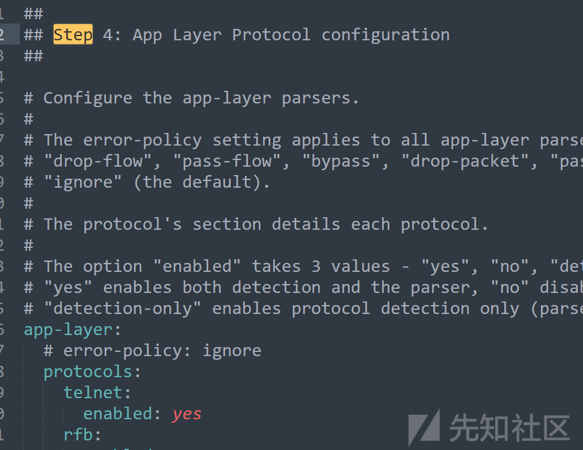](https://xzfile.aliyuncs.com/media/upload/picture/20240228162419-c51a4a02-d612-1.png)

-   规则模块配置，也是最重要的配置。在路径“default-rule-path”存放检测规则，在“rule-files”下添加文件名使得规则生效，“classification-file”是对应规则字段 classtype 的规则分类信息。

[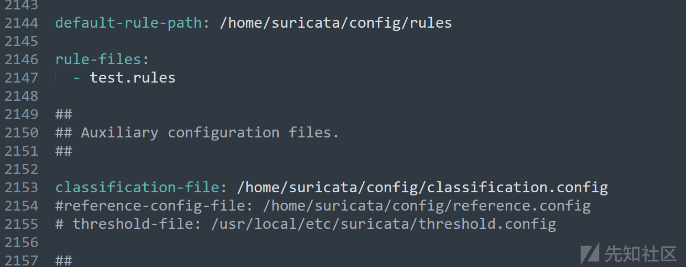](https://xzfile.aliyuncs.com/media/upload/picture/20240228162433-cd2e707e-d612-1.png)

-   检测规则还可以用信誉度检测 (其实就是黑名单)，目标 IP 低于信誉度阈值，即可报警。也可以编写 lua 脚本去做更复杂更灵活的恶意流量检测 (例如 cobalt strike 的部分通讯流量) 。

[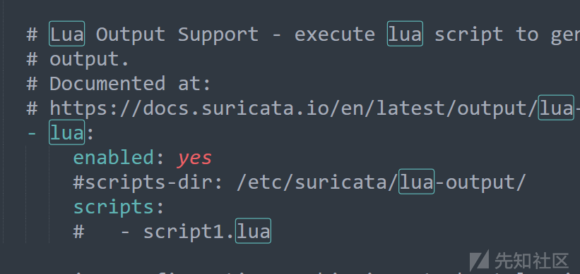](https://xzfile.aliyuncs.com/media/upload/picture/20240228162442-d2c79d26-d612-1.png)

### 2.待检测数据包

在日常渗透测试当中捕获，扫描探测、漏洞利用、远程控制、内网横向、等各个攻击链阶段均可。

介绍一个获取恶意通讯数据包的网站，一抓一大把。

[https://www.netresec.com](https://www.netresec.com/)

[https://www.malware-traffic-analysis.net](https://www.malware-traffic-analysis.net/)

### 3.运行和输出

运行命令即可，举例如下

```plain
suricata -c /home/suricata/config/suricata.yaml -r /home/work/test-data/* -l /home/suricata/config/log -k none
```

如果你不修改输出的相关配置，输出将会有如下四个。

[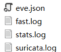](https://xzfile.aliyuncs.com/media/upload/picture/20240228165447-069b4e00-d617-1.png)

-   suricata.log，包含 Suricata 运行时的日志信息，如启动、关闭、规则加载等，用于故障排除和监视。
-   stats.log，包含 Suricata 的统计信息，如流量统计、规则匹配统计等，，用于性能调优和网络活动分析。
-   fast.log，就是告警输出日志了，通常看这个就可以。
-   eve.json，详细的事件记录，以 JSON 格式呈现，包括有关规则匹配事件的详细信息，包括协议解析、源和目标地址、端口、负载数据等，用于深入分析和检测。这也是各家公司将 suricata 产品化后主要数据来源。  
    \## 六、检测规则来源  
    \#### 1.开源 et/open 库
    
    ```plain
    库名称：Emerging Threats Open Ruleset
    获取地址：https://rules.emergingthreats.net/open/suricata-6.0/
    ```
    
    因为社区维护、涵盖应用广泛、用户群体多且活跃等特点，这是在开源渠道可以获取的最全面、时效性最高、且维护质量最高的的规则库。

[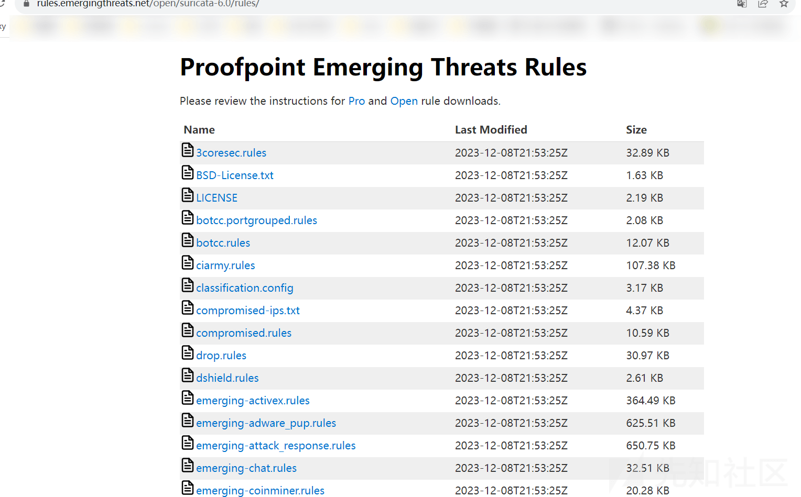](https://xzfile.aliyuncs.com/media/upload/picture/20240228163540-5a785f48-d614-1.png)  
它其中一部分规则脱离了网络安全领域，例如 games.rules、policy.rules 等偏向于隐私策略、运维等，或者对于网络攻击层面参考意义不大的规则集。这一部分建议永久停用或暂时停用，下面是我停用的策略，可以作为参考。

[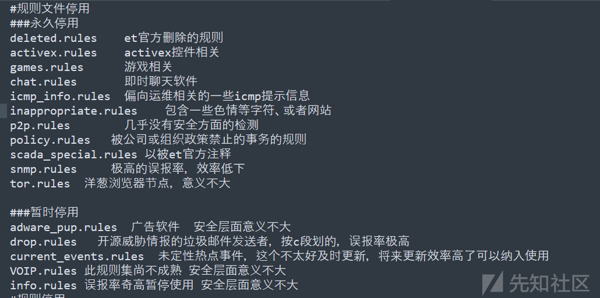](https://xzfile.aliyuncs.com/media/upload/picture/20240228163549-606357e6-d614-1.png)  
但是它毕竟是国外的靓仔开发和维护，将水土不服体现的淋漓尽致，在 5 万余条规则中，几乎没有国内厂商的 web 应用、网络设备等漏洞利用检测规则。但好在操作系统、底层协议等通用领域检测效果还是值得肯定的。

et/open和下一个要介绍的et/pro规则是被包含关系，规则文件目录结构基本一致，详细到每个规则文件在下一小点中将被介绍。

#### 2\. 商业 et/pro 库

```plain
库名称：Emerging Threats Open Ruleset
获取地址：https://rules.emergingthreats.net/open/suricata-6.0/
```

它是 Emerging Threats 社区维护的付费规则集，这玩意儿在官方渠道很不便宜，订阅一年 749 欧元 (初始库加未来一年的更新推送)，合人民币及税务大概 6500 左右。

[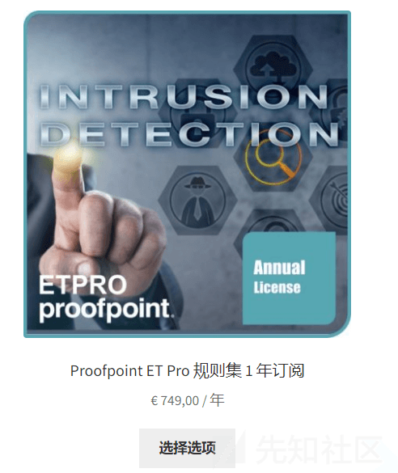](https://xzfile.aliyuncs.com/media/upload/picture/20240228163639-7dca9416-d614-1.png)  
它包含 et/open，截至此篇公众号发文当日，规则库共计 99941 条规则。

[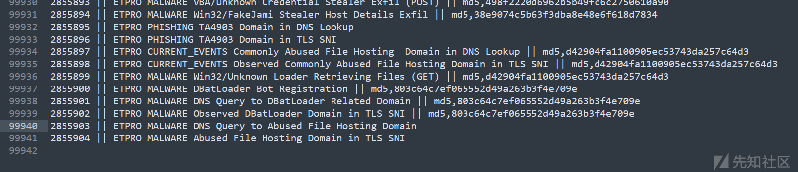](https://xzfile.aliyuncs.com/media/upload/picture/20240228163654-870ee932-d614-1.png)  
毕竟是付费的，总体效果还是很不错的，但还是一整个水土不服。如果你纠结的是哪些规则好用，可以沿用 et/open 的停用策略

#### 3\. 开源 oisf/trafficid

```plain
库名称：OISF -- Suricata Traffic ID ruleset
获取地址：https://openinfosecfoundation.org/rules/trafficid/trafficid.rules
```

网络攻击层面没什么参考意义，它检测网络流量中的不同类型和协议，识别和分类网络流量，包括但不限于 Web 流量、文件传输、远程桌面、数据库通信等。通过使用这些规则，Suricata 可以生成有关网络流量的详细日志，可以在本地被动资产识别、内网测绘之类的功能模块起到一定的作用。中规中矩~

#### 4.开源 ptresearch/attackdetection

```plain
库名称：Positive Technologies -- Positive Technologies Attack Detection Team ruleset [ptresearch/attackdetection]
获取：https://github.com/ptresearch/AttackDetection
```

一个小体积的库，主要是漏洞利用的检测，共计 791 条，但是在去年已经没怎么维护了，其中一部分是从 et 系列库改的，不过有一部分检测效果还是不错的，我通过这个库检测到过一些威胁，所以印象还是不错的。好评！

#### 4.开源 sslbl/ssl-fp-blacklist

```plain
库名称：Abuse.ch -- Abuse.ch SSL Blacklist [sslbl/ssl-fp-blacklist]
获取：https://sslbl.abuse.ch/blacklist/sslblacklist.rules
```

实时更新的 ja3 指纹黑名单形式的规则集体，你值得拥有，要是本地资产和外界恶意资产通讯，是不是搞不好就有发现了。好评！

#### 4\. sslbl/ja3-fingerprints

```plain
库名称：Abuse.ch -- Abuse.ch Suricata JA3 Fingerprint Ruleset [sslbl/ja3-fingerprints]
获取：https://sslbl.abuse.ch/blacklist/ja3_fingerprints.rules
```

实时更新的 ja3 指纹黑名单，你值得拥有。好评！

#### 5.etnetera/aggressive

```plain
库名称：Etnetera a.s. -- Etnetera aggressive IP blacklist [etnetera/aggressive]
获取：https://security.etnetera.cz/feeds/etn_aggressive.rules
```

黑名单 IP，这个很难评，因为一些正常的业务 IP 也在里边，但是还是生效，如有报警人工研判。中规中矩~

#### 6.tgreen/hunting

```plain
库名称：tgreen -- Threat hunting rules [tgreen/hunting]
获取：https://raw.githubusercontent.com/travisbgreen/hunting-rules/master/hunting.rules
```

体积很小的一个库，我观察了一段时间貌似更新也不怎么样，“有总比没有强"系列。

#### 7.malsilo / win-malware

```plain
库名称：malsilo -- Commodity malware rules [malsilo/win-malware]
获取：https://malsilo.gitlab.io/feeds/dumps/malsilo.rules.tar.gz
```

感觉像一个靓仔一时兴起搞了一下，然后就没搞了，“有总比没有强"系列。

#### 8.stamus/lateral

```plain
库名称：Stamus Networks -- Lateral movement rules [stamus/lateral]
获取：
https://ti.stamus-networks.io/open/stamus-lateral-rules.tar.gz
```

号称是致力于检测 Stamus Networks 的 Microsoft Windows 环境中的横向移动的规则，但没见他告警过（也可能是我没注意到），可以生效在观察观察。中规中矩~

是不是感觉很少，其实就这些了，我看国外的社区，基本上都用的 Emerging Threats Open Ruleset，其实你要是只想简单搭建一下，ET 库足矣。

大概就是这样了，感谢师傅们有耐心看到结尾。
