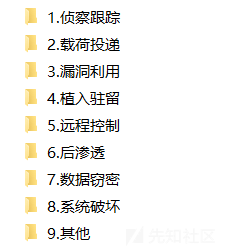
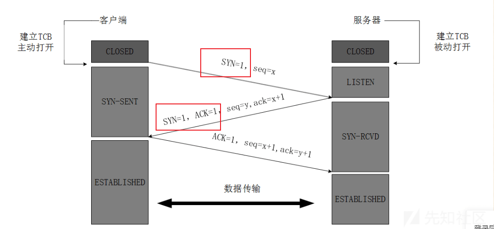

# 入侵检测之流量分析--识别常见恶意行为 - 先知社区

入侵检测之流量分析--识别常见恶意行为

- - -

# 前言

记录一些流量分析的基础，帮助初学读者认识恶意数据包分析。全是生产环境经验需要全面叙述，所以有点啰嗦，不过个人感觉干货满满，若是不喜叙述性文字，可以直接跳转至后面具体案例的部分。

就我个人经验来说，我觉得流量分析有以下一些特点或者现象。

-   流量分析最重要的还是熟悉网络架构、协议及字段信息，毕竟流量就摆在那，也不用去做多么复杂的操作，常用协议也不多，特征见多了，就会越来越简单。
-   你要有自动化的思路去想如何分析流量，毕竟海量流量不可能挨着挨着看，更多时候时是研判告警、看统计分析，如果你想深入学习原理，你就要知道检测引擎是如何告警的。（以 SURICATA 为例，你可以看此系列前几篇文章）。
-   有时候受控是没有明确特征的，但是你可以用区分正常和非正常业务的思想去分析流量，这个比较需要经验。比如防火墙、摄像头或其他 IOT 设备等，主动外连到非业务 IP，它正常的业务是不应该有这样的行为的，是不是就很可疑。
-   流量分析重度依赖威胁情报，包括各种各样的恶意 IP、域名、文件 HASH、JA3 指纹等。但是威胁情报库收录的质量尤其是时效性难有保障，但只要有威胁情报类告警还是优先看，省时省力。

- - -

可以用一个开源平台，上边可以分析流量、也有示例数据包，示例数据包包括各类威胁流量，平台利用 SUIRICATA 检测引擎搭建，可以做威胁流量告警。  
[http://47.108.150.136:8080/IDS/](http://47.108.150.136:8080/IDS/)

# 背景

现假定一个生产环境场景，流量设备部署于一个政务单位的出口处，它镜像接入了整个单位出口处全部的流量（比如核心交换机，可以配置所有通过此硬件的流量从一个网口导出，即镜像网口），这些导出的流量被某入侵检测流量分析产品捕获分析处理，并对统计和告警信息做展示，现在我们作为技术人员，来分析这些流量。

我将 ATT&CK 模型 (业内广泛认可的用于描述组织间对抗、网络攻击的战术、技术和常见知识的模型，这个东西早点认识有好处，甲方通用，也不用学，简单点说就是个表。) 中涉及流量检测的部分提炼为攻击链阶段，如下图。  
[](https://xzfile.aliyuncs.com/media/upload/picture/20240221164259-3775b56a-d095-1.png)

## 分析前需要明确的

### 本地资产是哪些

你需要先定位本地资产，不然看的是一头雾水。既然是在出口处捕获的流量，那么就是单位内部的 PC 或服务器和外界通讯的数据包，你需要搞清楚通讯双方 IP 哪个是单位内部资产。这可能有三种情况。

1.  ABC 三类私有地址 IP 和 外部网络 IP 通讯。这说明捕获的镜像流量是在 NAT 地址转换之前的。
    
2.  本地出口的公网 IP 和 外部网络 IP 通讯。这说明捕获的镜像流量是在 NAT 地址转换之后的。
    
3.  内网中的非私有地址 IP 和外部网络 IP 通讯，首先这说明捕获的镜像流量是在 NAT 地址转换之前的，并且是单位中有公网地址私用的情况 (这在一些超大国企尤其是运营商单位中很常见)。
    

通常情况 1 是最多的，从溯源的角度镜像流量是应该做在 NAT 地址转换之前的，比如在通讯中发现木马通讯流量，情况 2 只能知道本地出口公网 IP 下面的内网中有受控情况，而 1、3 就可以根据内网 IP 确定到受控的 PC 或服务器。

### 有哪些边界设备

边界设备是指可以被外部直接访问本地资产。比如单位中的搭载邮件、OA、官网等软件的服务器，这些服务可以被反向代理在出口公网 IP 的端口上，供外部访问。这也是攻击者能够通过空间测绘等方式，直接访问的资产，基本上每天都会有大量的扫描和漏洞探测。

为什么关注边界设备。如果边界设备受控 (实际上就是内网中的服务器受控)，如果权限足够，没做隔离，攻击者就可以边界设备上做正向代理当作跳板，做内网横向渗透。

现在也有了堡垒机、虚拟化平台之类的机制，可以强力的保护边界设备及内网，现在安全产品越来越好使，没有 0day、1day 的基本上很难搞，所以钓鱼多了起来。

# 流量分析

在流量分析产品上可以通过各类过滤，或者研判告警信息做分析，但是脱离产品你需要熟悉 wireshark 展示的界面信息和基本的过滤。我提供的数据包大家不用纠结源、目的 IP 或其内外网，都是修改过的。

## 1.侦察跟踪 (即信息搜集)

### 1.1TCP 端口扫描

端口扫描的原理是在传输层协议 tcp 三次握手中，攻击者对服务器不同的端口遍历发送第一次握手的数据包 (标志位 syn)。  
[](https://xzfile.aliyuncs.com/media/upload/picture/20240221164419-67439e92-d095-1.png)  
若服务器端口开放，则会响应第二次握手数据包 (标志位 syn、ack)，不开放则不回复。比如下图中 80 端口是开放的。  
[](https://xzfile.aliyuncs.com/media/upload/picture/20240221164437-71eda1a8-d095-1.png)  
对应常见的 tcp 三次握手示意图，上面的描述对应前两次数据包发送。[](https://xzfile.aliyuncs.com/media/upload/picture/20240221164450-797e1b64-d095-1.png)  
攻击者第三次握手（标志位 ack）可以选择回复或者不回复，因为攻击者已经可以确定服务器是否开放了这个端口。这就分别对应着全开放扫描和半开放扫描，这是 nmap 参数可选的。

### 1.2 漏洞扫描

漏洞扫描工具集成了大量漏洞 POC，通常是对边界设备开放的 WEB 服务 (比如 OA、邮服、CMS、IOT 设备等) 及其相关组件 (apache、nginx、IIS 等) 的漏洞扫描。扫描特征为大量的基于 HTTP 协议 (混杂着 GET、POST 方法) 的明文请求。如下图。  
[](https://xzfile.aliyuncs.com/media/upload/picture/20240221164535-944556d8-d095-1.png)  
可以看到其中包含目录穿越、系统敏感文件路等。因为会在极短的时间连续访问很多不存在在界面 (404 响应)，所以可能会目录扫描检测也会触发告警。

当然不只是 WEB 应用的漏洞，还有数据库漏洞、协议漏洞等，但是在边界设备上，对外开放的绝大部分还是 WEB 形式的服务。

如何处置这大量的漏洞扫描告警，说实话我通常是不看的，也更不用去了解漏洞文件路径、原理什么的。我会直接去看这个被扫描的服务器开放的是什么 web 应用，然后去看看它最近三年有没有什么漏洞，获得授权后，直接自己测一测。如果能利用早被人打烂了，也没必要看流量了，上机取证检查吧。

## 2.载荷投递

### 2.1 暴力破解

无论是 ssh、rdp、telnet、FTP、mysql 或其他含登录凭据验证的服务，暴力破解即在极端的时间或周期性的内做大量的登录尝试。

首先要明确这些含登录业务的应用层协议，都会使用面向连接的、可靠的传输层协议 TCP，并且正常登录的 TCP 会话时长通常比较长（比如 ssh 正常登录后，连接时间短则数分钟、长则几小时）。而密码校验失败 (一次或多次，看策略配置) 服务端就会主动断开 TCP 会话，客户端再次登录就会建立新的 TCP 链接。所以在暴力破解恶意行为流量中，开放登录服务的端口有大量的会话在极端的时间内建立（tcp 握手）和结束（tcp 挥手）。

如果你可以有产品过滤会话那么就会很清晰，如果你只能用 wireshark 过滤数据包，以 TELNET 暴力破解为例（其他协议也是一样的），那么你可以过滤含登陆服务的目的 23 端口、tcp 第一次握手。  
tcp.flags.syn==1&&tcp.dstport==23  
极端时间内针对 telnet 服务端口大量连接请求，过滤结果如图。  
[](https://xzfile.aliyuncs.com/media/upload/picture/20240221164727-d73a87c4-d095-1.png)  
登录失败，数次密码校验失败，会话迅速结束。  
[](https://xzfile.aliyuncs.com/media/upload/picture/20240221164800-eac4f806-d095-1.png)  
telnet、ftp 等明文通讯协议，你可以在登录阶段看到账号密码以及登录验证状态等。它们也可以作为更准确的暴力破解特征。  
[](https://xzfile.aliyuncs.com/media/upload/picture/20240221164816-f4ac7e7a-d095-1.png)  
ftp 暴力破解如图。  
[](https://xzfile.aliyuncs.com/media/upload/picture/20240221164834-ff27a3ac-d095-1.png)  
rdp 单次登录如图，其中包括为登陆用户名。  
[](https://xzfile.aliyuncs.com/media/upload/picture/20240221164859-0dd2c8be-d096-1.png)  
如何判断暴力破解是否成功。明文的通讯协议会有成功的标识符，密文协议就看通讯会话的时长和数据量大小，登录失败的会话时长极短、数据流极小，若登录成功不就可以霍霍服务器了，一般会有较长时间登录和窃密流量传输。

还有一种情况，攻击者通过钓鱼、弱口令者其他方式获取了登录凭据，没有暴力破解，一次或几次就登录成功。这样你需要了解一下业务，向服务器管理人员询问通常是哪些 IP 地址在登录此服务器，如果从流量过滤有境外或者非正常业务 IP 成功登录，都是很可疑的，通常这会结合日志分析（从流量中解析并还原的日志或系统日志）。

### 2.2 SQL 注入

以 sqlmap 通讯流量为例，在注入点处尝试不同的恶意 SQL 语句拼接来发现潜在的漏洞。显然和用户交互的还是 WEB 服务，普通业务的正常用户谁天天在各种框上写 sql 语句。所以短时且连续的 http（url 或 POST 主体）请求中，包含敏感 sql 语句的，一律打死。下图为 sqlmap 通讯流量。  
[](https://xzfile.aliyuncs.com/media/upload/picture/20240221165129-6764465a-d096-1.png)

## 3.漏洞利用

如果一个有政务单位标识的 web 服务开放在公网，每天都会有大量境内外 IP 来做漏洞探测，各个漏洞的成功、失败的响应特征也不尽相同，数量大难研判。建议还是经过授权后，自己上手测，如果有洞的话肯定已经打烂了。

## 4.植入驻留

广义来说 webshell 上传、shellcode 下载都算是植入驻留。但是这一分类主要是为了不明确的缓冲区溢出类攻击尝试准备的分类，毕竟不是所有的溢出类漏洞都有具体的漏洞名字或编号。例如下列两个。

Heartbleed（心脏滴血）为 OpenSSL 库中的一个缓冲区溢出漏洞，允许攻击者读取服务器和客户端内存中的敏感信息，包括私钥。  
EternalBlue（永恒之蓝）Windows 操作系统的缓冲区溢出漏洞。  
对这样协议、操作系统层面的漏洞。你需要特别熟悉相应协议及字段才能明白其原理。我也是见一个学一个，但好在这类知名或典型的漏洞，检测原理已经被前人琢磨透了，你只需要在这类告警触发时看一些帖子如何研判就行，平时不用刻意积累。

# 5.远程控制

远程控制主要举例常见黑客工具，包括 webshell 管理工具以及 cobalt strike。

## 5.1 webshell 管理工具

从原理上可以提炼以下比较通用的 webshell 黑客工具通讯特征。

-   http 方法为 POST。（一般不会有 GET 的，应用场景少）
-   其次 url 路径是对应的服务器脚本语言后缀 (例如.php、.jsp 等) 文件。
-   若是明文在 POST 主体中一定会有一个接收参数。  
    上述特征如图。  
    [](https://xzfile.aliyuncs.com/media/upload/picture/20240221165434-d5b69c20-d096-1.png)  
    不同明文通讯的 webshell 黑客工具的特征，就在于构造的 aa 参数中（例如蚁剑、菜刀等）。密文就只能通过一些字符组成或者长度等特征去研判（例如哥斯拉、冰蝎等），部分默认的头部字段也可以作为弱特征。简单的网上很多，我就不在赘述，我提供了数据包和分析平台，感兴趣可以结合其他资料研判一下。  
    \## 5.2 冰蝎 4.X  
    这里说一下的冰蝎 4.X 的特征，通讯如图。  
    [](https://xzfile.aliyuncs.com/media/upload/picture/20240221165919-7f7b1592-d097-1.png)
-   不自定义的话，几个 Accept 头通常是固定的。  
    Accept: application/json, text/javascript, */*; q=0.01  
    Accept-Encoding: identity  
    Accept-Language: zh-CN,zh;q=0.9,en-US;q=0.8,en;q=0.7
-   Content-Length 较大，构造的恶意参数密文较长。  
    Content-Length: 8240
-   冰蝎通讯默认使用长连接  
    Connection: Keep-Alive
-   端口检测。冰蝎与 webshell 建立连接的同时，javaw 也与目的主机建立 tcp 连接，每次连接使用本地端口在 49700 左右，每连接一次，每建立一次新的连接，端口就依次增加。此处在其他条件的基础上可以对符合该范围内端口告警。
    
-   服务端是 PHP 时，使用默认的 aes 算法，但是由于默认使用的是 aes128 的算法，会导致密文长度恒是 16 的整数倍。因为这个强特征，所以作者在后 Aug 11, 2022 发布版本更新中添加了 magic 参数，如图。原理就是加了一个随机长度的短尾巴，此特征就没了。  
    [](https://xzfile.aliyuncs.com/media/upload/picture/20240221170101-bcab0062-d097-1.png)  
    在当时因为这个缺陷还是检查了不少冰蝎 4 的受控。  
    \## 5.3 icmp 隧道远控流量  
    icmp 作为网络层协议消息通常被封装在 IP 数据包中，常用于连通性检测 (ping)，icmp 协议没有会话的概念，只有数据包的 reques 和 reply。但是隧道工具利用 icmp 通讯，在协议的数据字段中填充载荷实现远程控制的功能，流量如下图。  
    [](https://xzfile.aliyuncs.com/media/upload/picture/20240221170152-dafe24b8-d097-1.png)  
    也比较好检测，正常连通性检测 ping 数据包数量不会太大，并且载荷填充固定字符 (abcd...),相同类型的操作系统数据包长度是固定的。站在这些角度去区分隧道流量即可。  
    \# 6 系统破坏  
    系统破坏就记录一个挖矿，蠕虫、僵尸网络什么的太多了。
    

矿机和矿池通讯有一些专用协议，例如 stratum 协议。其中最广泛的挖矿门罗币采用 Cryptonight 算法，公开提供的程序有 xmr-stak，xmrig，claymore 等，它们用明文的 jsonrpc 格式通讯，有很强的特征。如图  
[](https://xzfile.aliyuncs.com/media/upload/picture/20240221170238-f6580332-d097-1.png)  
挖矿算法标准通讯格式如下，这种告警一般都很准。

```plain
xmr-stak

request：

{"method":"login","params":{"login":"xxxxxxx","pass":"xxx","rigid":"","agent":"xxxxxx"},"id":1}

{"method":"submit","params":{"id":"xx","job_id":"xxxxxx","nonce":"xxxxx","result":"xxxxxx"},"id":1}

response：

{"method":"job","params":{"target":"xxxxx","job_id":"xxxxxx","blob":"xxxxxxx"}} xmrig

request：

{"id":x,"jsonrpc":"2.0","method":"login","params":{"login":"xxxxxx","pass":"x","agent":"xxxxx","algo":["xxx","xxx","xxx"]}}

{"id":x,"jsonrpc":"2.0","method":"submit","params":{"id":"xxxx","job_id":"xx","nonce":"xxxx","result":"xxxxxxx"}}

response：

{"params":{"blob":"xxxxxx","taget":"xxxx","job_id":"xxxxx"},"method":"xxx"} claymore

request：

{"method":"login","params":{"login":"xxxxxx","pass":"x","agent":"xxx"},"id":1}

{"method":"submit","params":{"id":"xxxx","job_id":"xxx","nonce":"xxxxx","result":"xxxxx"},"id":x}

response：

{"params":{"blob":"xxxxxx","target":"xxxx","job_id":"xxx"},"method":"xxx"}
```

僵尸网络、蠕虫、挖矿等通常都有请求特定域名的行为，这类威胁告警主要来源于内置威胁情报的匹配。
